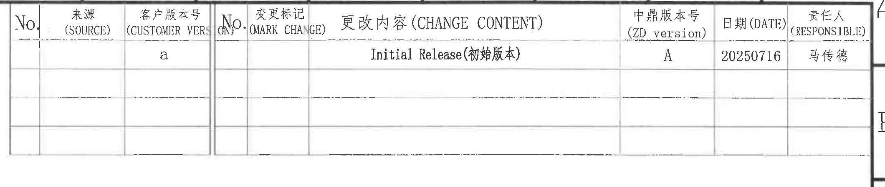
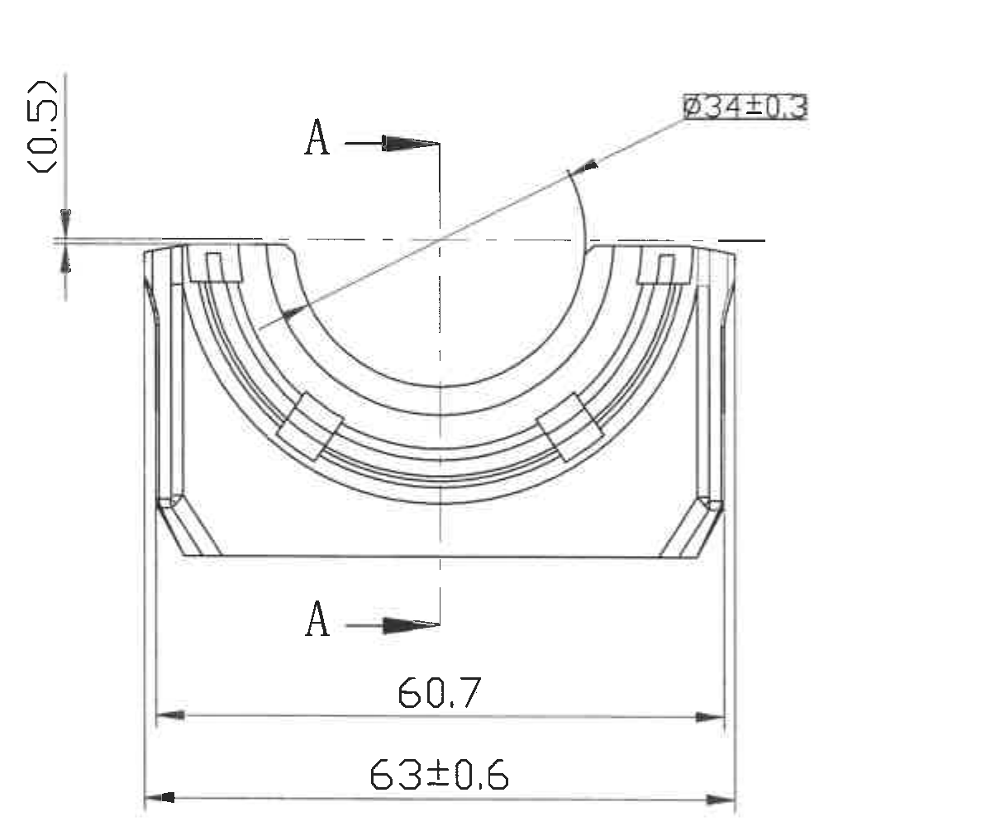
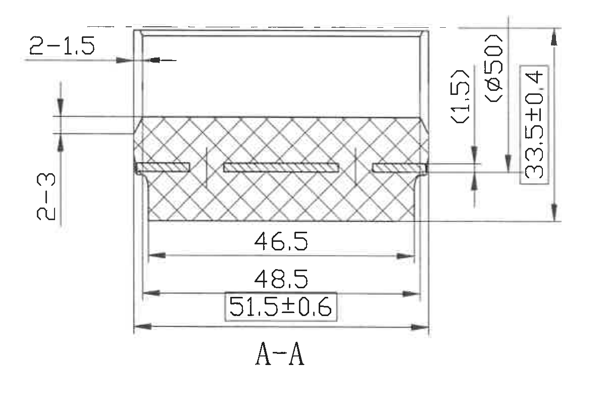
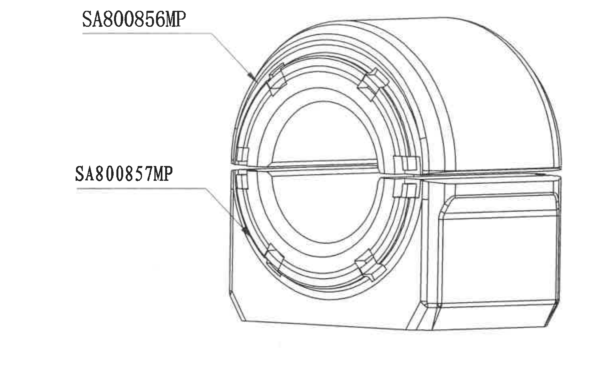
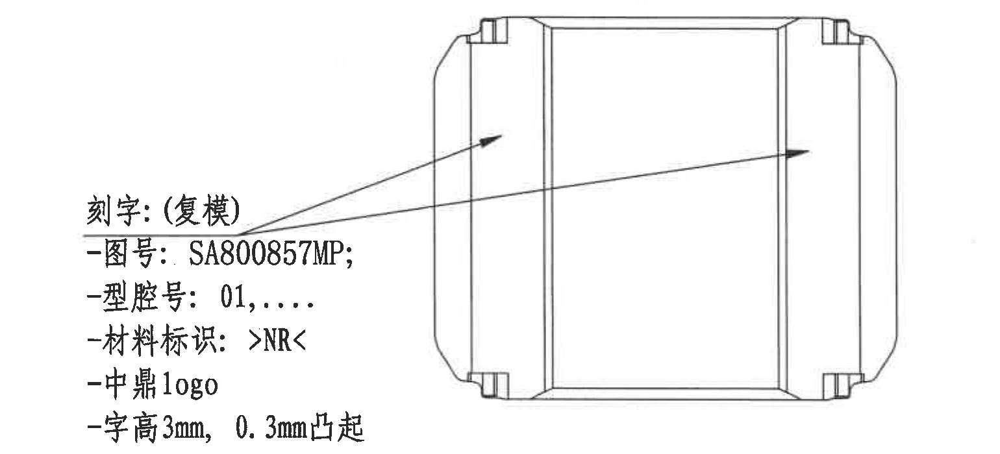
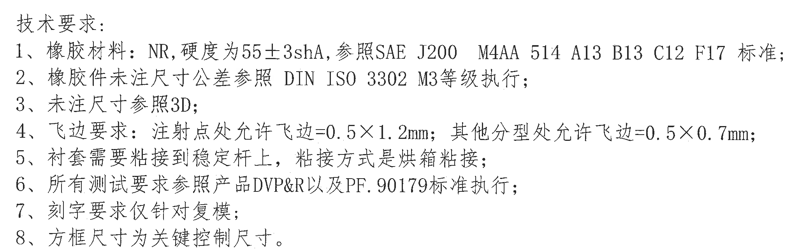
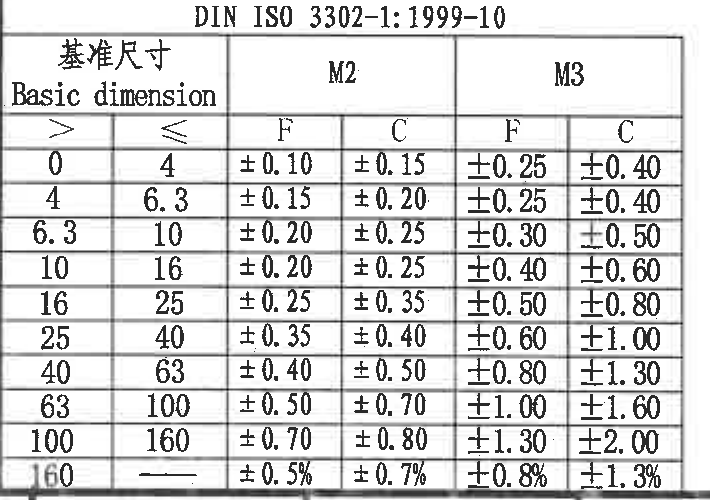
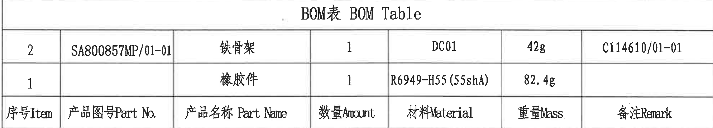
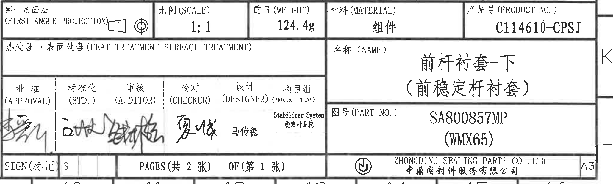

# 20C114610.pdf 内容识别

整页渲染图：`outputs/20C114610_assets/images/page_1.png`  
整页 PNG 尺寸：4959 × 3505 px

## object_5 - 顶部修订履历表

原图位置/视图名称：第 1 页顶部修订履历表，bbox `[2640, 165, 2120, 450]`。

原表行列还原：

| No. | 来源 (SOURCE) | 客户版本号 (CUSTOMER VER) | No. | 变更标记 (MARK CHANGE) | 更改内容 (CHANGE CONTENT) | 中鼎版本号 (ZD version) | 日期 (DATE) | 责任人 (RESPONSIBLE) |
| --- | --- | --- | --- | --- | --- | --- | --- | --- |
|  |  | a |  |  | Initial Release(初始版本) | A | 20250716 | 马传德 |
|  |  |  |  |  |  |  |  |  |
|  |  |  |  |  |  |  |  |  |

提取表格：

| 提取项 | 原图数值或文本 | 含义说明 |
| --- | --- | --- |
| 客户版本号 | a | 客户版本列记录为 `a`。 |
| 更改内容 | Initial Release(初始版本) | 首次发行/初始版本记录。 |
| 中鼎版本号 | A | 中鼎内部版本为 `A`。 |
| 日期 | 20250716 | 修订记录日期，格式为 YYYYMMDD。 |
| 责任人 | 马传德 | 该修订记录责任人。 |
| 空白行 | 后续两行为空 | 原表保留空白记录行，未填写修订内容。 |

边界归属说明：该裁切对象只提取修订履历表内的表头、首条记录和空白记录行；上方图纸分区编号、右侧图框字母不作为修订表字段提取。

## object_1 - 左中主视图

原图位置/视图名称：第 1 页左中主视图，bbox `[570, 740, 1210, 1000]`。

提取表格：

| 提取项 | 原图数值或文本 | 含义说明 |
| --- | --- | --- |
| 参考尺寸 | `(0.5)` | 位于主视图左上侧的竖向括号尺寸；括号表示参考尺寸，用于说明上沿附近小台阶/间隙关系，不作为直接控制公差尺寸。 |
| 直径尺寸 | `Ø34±0.3` | 指向上部半圆内弧/孔口特征的直径尺寸，公差为 ±0.3。 |
| 横向尺寸 | `60.7` | 位于下方内侧的一条水平尺寸线，表示主视图外形/局部宽度控制尺寸；原图未给显式公差。 |
| 横向总宽 | `63±0.6` | 主视图最下方水平总宽尺寸，公差为 ±0.6。 |
| 剖切标记 | `A`、`A` | 两个 A 箭头和中线标识 A-A 剖切位置，对应中部剖面视图 object_2。 |
| 弧形/弧向信息 | `Ø34±0.3` 对应半圆弧特征 | 主视图可见多道同心弧形槽；原图未给单独弧长、半径或角度标注，弧形控制以直径标注表达。 |
| 角度标注 | 未见 | 当前主视图内没有角度尺寸。 |
| T 编号 | 未见 | 当前主视图内没有 T 编号。 |
| 带星号关键尺寸 | 未见星号 | 当前主视图内没有星号关键尺寸；关键控制说明见 NOTES 第 8 条。 |

边界归属说明：裁切边界包含主视图完整外形、`(0.5)`、`Ø34±0.3`、`60.7`、`63±0.6` 和 A-A 剖切箭头；右侧 A-A 剖视图的 `2-1.5`、`2-3` 等尺寸已排除，不归入主视图。

## object_2 - 中部 A-A 剖面视图

原图位置/视图名称：第 1 页中部 A-A 剖面视图，bbox `[1750, 980, 1200, 820]`。

提取表格：

| 提取项 | 原图数值或文本 | 含义说明 |
| --- | --- | --- |
| 剖面名称 | `A-A` | 与主视图 A-A 剖切箭头对应的剖面视图。 |
| 数量前缀尺寸 | `2-1.5` | 左上水平引出尺寸，`2-` 表示两处相同特征，单处尺寸为 1.5；原图未给显式公差。 |
| 数量前缀尺寸 | `2-3` | 左侧竖向尺寸，`2-` 表示两处相同特征，单处尺寸为 3；原图未给显式公差。 |
| 参考尺寸 | `(1.5)` | 右侧竖向括号尺寸，为参考尺寸，用于说明局部台阶/位置关系。 |
| 参考直径 | `(Ø50)` | 右侧竖向括号直径参考尺寸，表示相关圆柱/弧形轮廓的参考直径。 |
| 竖向总尺寸 | `33.5±0.4` | 右侧外侧竖向总高度/总厚度控制尺寸，公差为 ±0.4。 |
| 横向尺寸 | `46.5` | 剖面内部较短水平尺寸线，原图未给显式公差。 |
| 横向尺寸 | `48.5` | 剖面中部水平尺寸线，原图未给显式公差。 |
| 框选关键控制尺寸 | `51.5±0.6` | 底部外侧水平尺寸，带矩形框；结合 NOTES 第 8 条，方框尺寸为关键控制尺寸，公差为 ±0.6。 |
| 剖面材料表达 | 剖面交叉线 | 剖切区域用交叉剖面线表示实体橡胶/材料截面。 |
| 角度标注 | 未见 | 当前剖面视图内没有角度尺寸。 |
| T 编号 | 未见 | 当前剖面视图内没有 T 编号。 |
| 带星号关键尺寸 | 未见星号 | 当前剖面未见星号；关键控制以框选尺寸表达。 |

边界归属说明：裁切边界包含 A-A 剖面图、左右竖向尺寸、底部三条水平尺寸线和 `A-A` 文字；左侧尺寸文字 `2-1.5`、`2-3` 完整保留。主视图的 `Ø34±0.3`、`60.7`、`63±0.6` 不归入该剖面视图。

## object_3 - 右上零件标识视图

原图位置/视图名称：第 1 页右上立体/零件标识视图，bbox `[3120, 620, 1530, 980]`。

提取表格：

| 提取项 | 原图数值或文本 | 含义说明 |
| --- | --- | --- |
| 上半部零件标识 | `SA800856MP` | 引线指向上半圆/上件区域，表示该区域对应的零件或模具/部件编号。 |
| 下半部零件标识 | `SA800857MP` | 引线指向下半圆/下件区域，表示该区域对应的零件或模具/部件编号。 |
| 外形信息 | 装配/零件立体外形 | 显示圆弧衬套与右侧块状外形的组合关系。 |
| 尺寸标注 | 未见 | 当前视图内没有数字尺寸、角度、公差或 T 编号。 |
| 弧形信息 | 可见同心圆弧槽 | 视图中显示弧形槽形态，但没有独立弧长、半径、角度或公差标注。 |

边界归属说明：该裁切只提取右上立体视图和两条零件标识引线；下方刻字要求视图 object_4、顶部修订表 object_5、右侧图框栏均不归入该对象。

## object_4 - 右中刻字/局部外形视图

原图位置/视图名称：第 1 页右中刻字说明与局部外形视图，bbox `[3050, 1610, 1540, 700]`。

提取表格：

| 提取项 | 原图数值或文本 | 含义说明 |
| --- | --- | --- |
| 刻字对象 | `刻字:(复模)` | 说明刻字要求针对复模。 |
| 图号 | `SA800857MP` | 刻字内容中的图号。 |
| 型腔号 | `01,....` | 刻字内容中的型腔号格式，原图显示为 `01,....`。 |
| 材料标识 | `>NR<` | 刻字内容中的材料标识，表示 NR。 |
| Logo | `中鼎logo` | 刻字内容包括中鼎 logo。 |
| 字高 | `3mm` | 刻字字符高度为 3 mm。 |
| 凸起高度 | `0.3mm凸起` | 刻字凸起高度为 0.3 mm。 |
| 引线/箭头 | 两条箭头指向外形侧面 | 指出刻字位置在局部外形视图所示侧面区域。 |
| 角度标注 | 未见 | 当前局部视图内没有角度尺寸。 |
| T 编号 | 未见 | 当前局部视图内没有 T 编号。 |
| 带星号关键尺寸 | 未见星号 | 当前局部视图内没有星号关键尺寸。 |

边界归属说明：裁切包含完整刻字说明、两条箭头和右侧局部外形；下方 BOM 表头已排除，右侧图框栏已排除。刻字尺寸 `3mm`、`0.3mm凸起` 归入该对象。

## object_6 - 左下 NOTES / 技术要求

原图位置/视图名称：第 1 页左下技术要求 NOTES，bbox `[640, 2160, 2050, 640]`。

提取表格：

| 提取项 | 原图数值或文本 | 含义说明 |
| --- | --- | --- |
| 标题 | `技术要求:` | 技术要求说明区标题。 |
| 1 | `橡胶材料: NR, 硬度为55±3shA, 参照SAE J200 M4AA 514 A13 B13 C12 F17 标准;` | 材料为 NR，硬度 55±3 shA，并参考 SAE J200 M4AA 514 A13 B13 C12 F17。 |
| 2 | `橡胶件未注尺寸公差参照 DIN ISO 3302 M3等级执行;` | 未注尺寸公差按 DIN ISO 3302 的 M3 等级。 |
| 3 | `未注尺寸参照3D;` | 图中未标尺寸以 3D 数据为准。 |
| 4 | `飞边要求: 注射点处允许飞边=0.5×1.2mm; 其他分型处允许飞边=0.5×0.7mm;` | 注射点和其他分型处飞边允许值分别为 0.5×1.2 mm、0.5×0.7 mm。 |
| 5 | `衬套需要粘接到稳定杆上, 粘接方式是烘箱粘接;` | 装配/工艺要求：衬套粘接到稳定杆，方式为烘箱粘接。 |
| 6 | `所有测试要求参照产品DVP&R以及PF.90179标准执行;` | 测试要求按产品 DVP&R 和 PF.90179 标准。 |
| 7 | `刻字要求仅针对复模;` | 刻字要求只适用于复模。 |
| 8 | `方框尺寸为关键控制尺寸。` | 图中带矩形框的尺寸为关键控制尺寸，例如 A-A 剖面中的 `51.5±0.6`。 |

边界归属说明：该裁切只提取技术要求 1-8 条；左下基本尺寸公差表 object_7、右下标题栏 object_9 和图框栏均不归入 NOTES。

## object_7 - 左下基本尺寸公差表

原图位置/视图名称：第 1 页左下 DIN ISO 3302-1 基本尺寸公差表，bbox `[355, 2840, 710, 500]`。

原表行列还原：

| DIN ISO 3302-1:1999-10 |  | M2 | M2 | M3 | M3 |
| --- | --- | --- | --- | --- | --- |
| 基准尺寸 Basic dimension `>` | 基准尺寸 Basic dimension `≤` | F | C | F | C |
| 0 | 4 | ±0.10 | ±0.15 | ±0.25 | ±0.40 |
| 4 | 6.3 | ±0.15 | ±0.20 | ±0.25 | ±0.40 |
| 6.3 | 10 | ±0.20 | ±0.25 | ±0.30 | ±0.50 |
| 10 | 16 | ±0.20 | ±0.25 | ±0.40 | ±0.60 |
| 16 | 25 | ±0.25 | ±0.35 | ±0.50 | ±0.80 |
| 25 | 40 | ±0.35 | ±0.40 | ±0.60 | ±1.00 |
| 40 | 63 | ±0.40 | ±0.50 | ±0.80 | ±1.30 |
| 63 | 100 | ±0.50 | ±0.70 | ±1.00 | ±1.60 |
| 100 | 160 | ±0.70 | ±0.80 | ±1.30 | ±2.00 |
| 160 | -- | ±0.5% | ±0.7% | ±0.8% | ±1.3% |

提取表格：

| 提取项 | 原图数值或文本 | 含义说明 |
| --- | --- | --- |
| 标准 | `DIN ISO 3302-1:1999-10` | 公差表依据标准。 |
| 等级列 | `M2`、`M3` | 表格分别给出 M2、M3 等级下的 F/C 公差。 |
| 基准尺寸范围 | `> 0` 到 `> 160` | 各行按基准尺寸区间给出公差值。 |
| 与 NOTES 关联 | NOTES 第 2 条指定 `DIN ISO 3302 M3等级` | 本图未注尺寸公差应优先使用 M3 等级列。 |

边界归属说明：裁切对象只包含基本尺寸公差表及其表格边框；左侧图框坐标字母和底部图框编号不作为表格字段提取。

## object_8 - 右下 BOM 表

原图位置/视图名称：第 1 页右下 BOM 表，bbox `[2730, 2380, 1990, 360]`。

原表行列还原：

| BOM表 BOM Table |  |  |  |  |  |  |
| --- | --- | --- | --- | --- | --- | --- |
| 序号 Item | 产品图号 Part No. | 产品名称 Part Name | 数量 Amount | 材料 Material | 重量 Mass | 备注 Remark |
| 2 | SA800857MP/01-01 | 铁骨架 | 1 | DC01 | 42g | C114610/01-01 |
| 1 |  | 橡胶件 | 1 | R6949-H55(55shA) | 82.4g |  |

提取表格：

| 提取项 | 原图数值或文本 | 含义说明 |
| --- | --- | --- |
| BOM 标题 | `BOM表 BOM Table` | 物料清单表。 |
| Item 2 | `SA800857MP/01-01`、`铁骨架`、`1`、`DC01`、`42g`、`C114610/01-01` | 铁骨架物料，数量 1，材料 DC01，重量 42 g，备注/关联号 C114610/01-01。 |
| Item 1 | `橡胶件`、`1`、`R6949-H55(55shA)`、`82.4g` | 橡胶件物料，数量 1，材料/硬度 R6949-H55(55shA)，重量 82.4 g；产品图号和备注栏为空。 |

边界归属说明：裁切对象只包含 BOM 标题、两条物料记录和 BOM 字段表头；下方标题栏的比例、重量、材料、产品号等字段已排除。

## object_9 - 右下标题栏

原图位置/视图名称：第 1 页右下标题栏，bbox `[2730, 2740, 2060, 620]`。

标题栏字段还原：

| 第一角画法 (FIRST ANGLE PROJECTION) | 比例 (SCALE) | 重量 (WEIGHT) | 材料 (MATERIAL) | 产品号 (PRODUCT NO.) |
| --- | --- | --- | --- | --- |
| 第一角投影符号 | 1:1 | 124.4g | 组件 | C114610-CPSJ |

| 热处理・表面处理 (HEAT TREATMENT. SURFACE TREATMENT) | 名称 (NAME) |
| --- | --- |
|  | 前杆衬套-下 (前稳定杆衬套) |

| 批准 (APPROVAL) | 标准化 (STD.) | 审核 (AUDITOR) | 校对 (CHECKER) | 设计 (DESIGNER) | 项目组 (PROJECT TEAM) |
| --- | --- | --- | --- | --- | --- |
| 签名 | 签名 | 签名 | 签名 | 马传德 | Stabilizer System 稳定杆系统 |

| 图号 (PART NO.) | SIGN(标记) | PAGES(共 2 张) | OF(第 1 张) | 公司 | 幅面 |
| --- | --- | --- | --- | --- | --- |
| SA800857MP (WMX65) | S | PAGES(共 2 张) | OF(第 1 张) | ZHONGDING SEALING PARTS CO.,LTD 中鼎密封件股份有限公司 | A3 |

提取表格：

| 提取项 | 原图数值或文本 | 含义说明 |
| --- | --- | --- |
| 投影法 | `第一角画法 (FIRST ANGLE PROJECTION)` | 图纸采用第一角投影。 |
| 比例 | `1:1` | 绘图比例。 |
| 重量 | `124.4g` | 标题栏总重量。 |
| 材料 | `组件` | 标题栏材料栏为组件。 |
| 产品号 | `C114610-CPSJ` | 产品号字段。 |
| 名称 | `前杆衬套-下 (前稳定杆衬套)` | 产品名称。 |
| 图号 | `SA800857MP (WMX65)` | 图号/零件号字段。 |
| 设计 | `马传德` | 设计栏人员。 |
| 项目组 | `Stabilizer System / 稳定杆系统` | 项目组字段。 |
| 标记 | `S` | SIGN 标记值。 |
| 页码 | `PAGES(共 2 张) OF(第 1 张)` | 图纸总 2 张中的第 1 张。 |
| 公司 | `ZHONGDING SEALING PARTS CO.,LTD / 中鼎密封件股份有限公司` | 图纸所属公司。 |
| 幅面 | `A3` | 图纸幅面。 |

边界归属说明：该裁切对象从标题栏第一行开始，包含投影、比例、重量、材料、产品号、名称、图号、审批签名、页码、公司名和 A3 幅面；上方 BOM 表 object_8 不归入标题栏，底部图框分区编号不作为标题栏字段提取。

## 裁切检查记录

| 图片 | 对象 | 检查结果 | 处理记录 |
| --- | --- | --- | --- |
| `page_1.png` | 整页渲染 | 完整 | PDF 已渲染为 4959×3505 px 整页 PNG。 |
| `object_1.png` | 左中主视图 | 完整 | 首裁顶部 `Ø34±0.3` 被裁，已外扩；右侧曾带入剖视图尺寸片段，已收边。最终包含完整主视图尺寸线和文字。 |
| `object_2.png` | A-A 剖面视图 | 完整 | 首裁左侧 `2-1.5`、`2-3` 不完整，已向左外扩。最终尺寸线、箭头、文字完整。 |
| `object_3.png` | 右上零件标识视图 | 完整 | 首裁右侧带入图框栏，已收边。最终只含视图和两条零件标识引线。 |
| `object_4.png` | 右中刻字/局部外形视图 | 完整 | 首裁下方带入 BOM 表头、右侧带入图框栏，已收边。最终文字、箭头、外形线完整。 |
| `object_5.png` | 顶部修订履历表 | 完整 | 表格外框、表头、记录行和空白行完整；非表格图框坐标不提取为字段。 |
| `object_6.png` | NOTES/技术要求 | 完整 | 首裁右侧和底部带入其他区域，已收边。最终 1-8 条技术要求完整。 |
| `object_7.png` | 基本尺寸公差表 | 完整 | 首裁左侧带入图框字母，已收边。最终表头、全部行列完整。 |
| `object_8.png` | BOM 表 | 完整 | 首裁带入标题栏字段，已按 BOM 下边界收高。最终 BOM 标题、两条记录、字段表头完整。 |
| `object_9.png` | 标题栏 | 完整 | 首裁漏上方标题栏字段，后扩高；随后排除 BOM 并纳入右端 A3 字段。最终标题栏字段完整，底部图框编号不提取。 |
