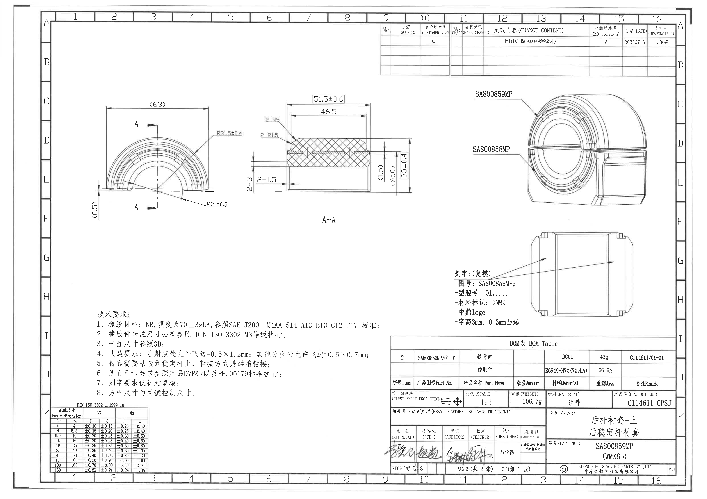
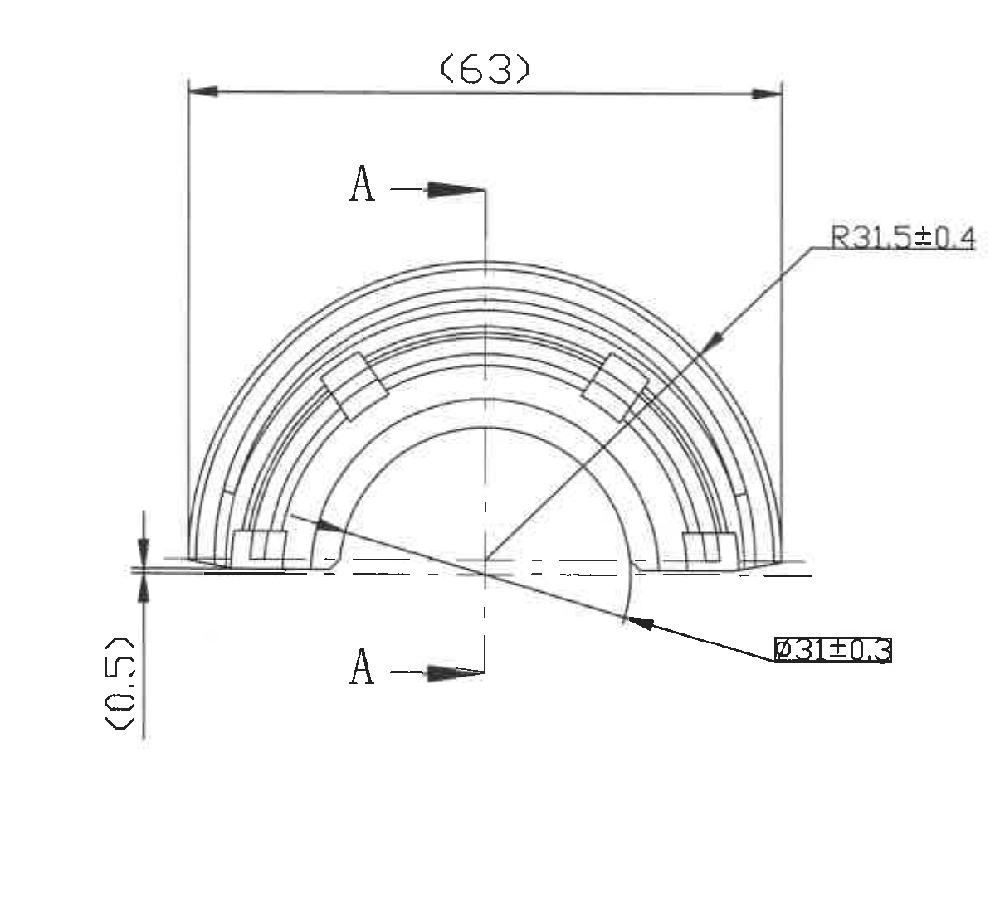
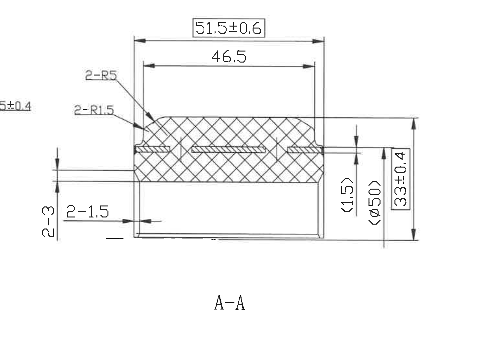
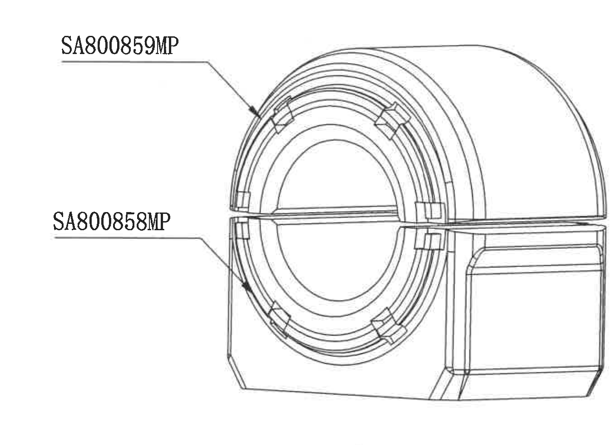
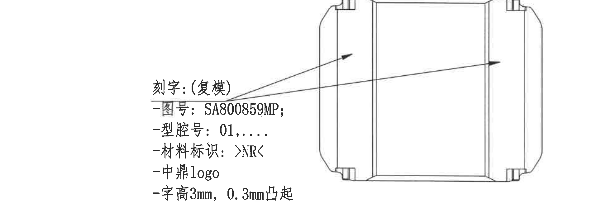
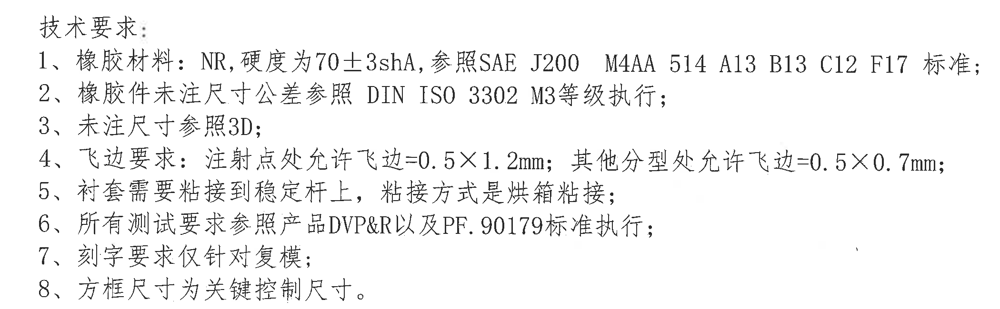
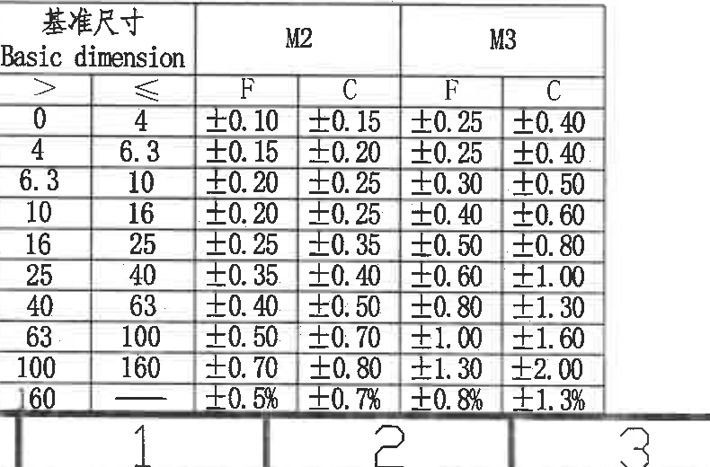
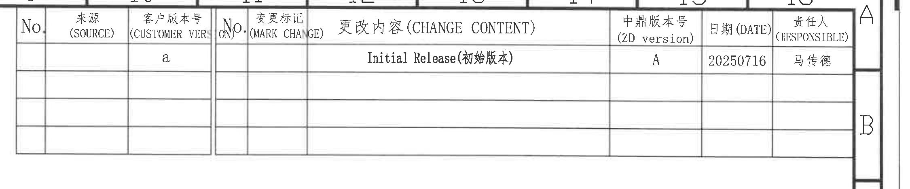
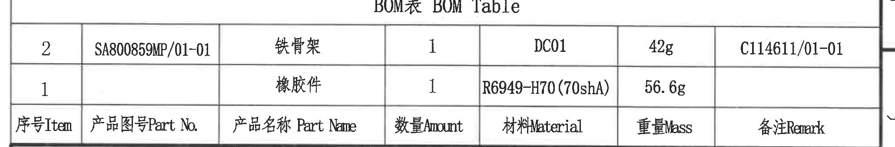
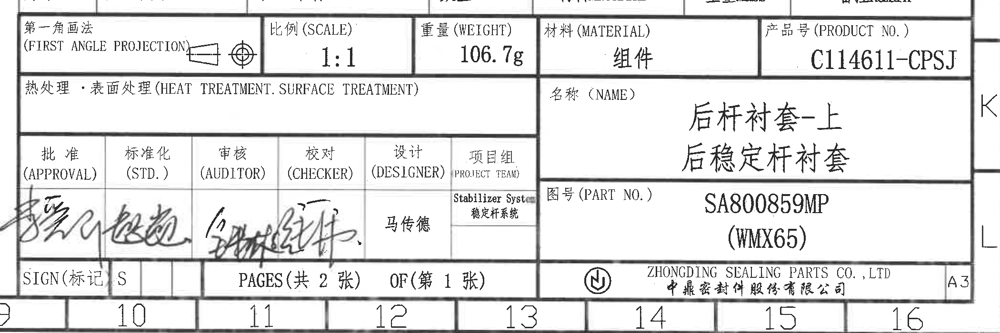

# 20C114611.pdf 内容识别与裁切提取

## 整页渲染

- 原图位置：第 1 页整页，渲染 PNG 尺寸 4959 × 3505 px。
- 页面结构：左上半圆主视图；中上 A-A 剖面视图；右上三维装配示意图；右中刻字局部视图；左下技术要求；左下 DIN ISO 3302 公差表；右上修订履历表；右下 BOM 表；右下标题栏。

## object_1：左上半圆主视图

- 原图位置/视图名称：第 1 页左上区域，半圆主视图，bbox `[520, 650, 1725, 1750]`。

| 提取项 | 原图数值或文本 | 含义说明 |
|---|---|---|
| 参考宽度 | `(63)` | 主视图上方总体参考宽度，括号表示参考尺寸。 |
| 外圆弧半径 | `R31.5±0.4` | 指向外侧圆弧的半径尺寸，公差为 ±0.4。 |
| 内径/孔径 | `Ø31±0.3` | 指向内侧圆弧/内孔的直径尺寸，公差为 ±0.3。 |
| 局部参考高度 | `(0.5)` | 左下靠近底边的参考尺寸，括号表示参考尺寸。 |
| 剖切标识 | `A`、`A`、剖切线 | 上下两个 A 箭头定义剖切方向，对应中上方 `A-A` 剖面。 |
| 视图几何 | 半圆同心槽、端部台阶、中心线 | 表示零件半圆端面结构与槽形分布。 |

边界归属说明：本裁切只提取半圆主视图及其尺寸。右侧 A-A 剖面视图的 `2-3`、`2-1.5` 等尺寸不归入本对象。`(63)` 与 `(0.5)` 为参考尺寸，不能作为直接加工控制尺寸，但在此主视图中必须保留。

## object_2：A-A 剖面视图

- 原图位置/视图名称：第 1 页中上区域，`A-A` 剖面视图，bbox `[1600, 610, 3100, 1730]`。

| 提取项 | 原图数值或文本 | 含义说明 |
|---|---|---|
| 总宽/总长 | `51.5±0.6` | 剖面顶部外侧总尺寸，带方框标注，按技术要求第 8 条属于关键控制尺寸。 |
| 内部长度 | `46.5` | 剖面顶部内侧长度尺寸。 |
| 两处半径 | `2-R5` | 剖面左上区域两处 R5 圆角/半径。 |
| 两处半径 | `2-R1.5` | 剖面左侧两处 R1.5 圆角/半径。 |
| 两处厚度/高度 | `2-3` | 剖面左侧竖向尺寸，两处 3 mm。 |
| 两处局部尺寸 | `2-1.5` | 剖面左下横向局部尺寸，两处 1.5 mm。 |
| 参考尺寸 | `(1.5)` | 剖面右侧局部参考尺寸，括号表示参考。 |
| 参考直径 | `(Ø50)` | 剖面右侧参考直径尺寸，括号表示参考。 |
| 总高度/外径方向尺寸 | `33±0.4` | 剖面右侧总高度尺寸，公差为 ±0.4。 |
| 剖面名称 | `A-A` | 对应 object_1 中的 A-A 剖切位置。 |

边界归属说明：本裁切为 A-A 剖面。左边缘可见相邻主视图 `R31.5±0.4` 的末端残片，这是为完整保留 `2-3` 尺寸线和箭头而带入，不作为本剖面提取项。剖面内括号尺寸 `(1.5)`、`(Ø50)` 均作为参考尺寸列出。

## object_3：右上三维装配示意图

- 原图位置/视图名称：第 1 页右上区域，三维装配示意图，bbox `[3200, 560, 4550, 1540]`。

| 提取项 | 原图数值或文本 | 含义说明 |
|---|---|---|
| 上件引出标号 | `SA800859MP` | 引线指向上半衬套/上件。 |
| 下件引出标号 | `SA800858MP` | 引线指向下半衬套/下件。 |
| 外观结构 | 半圆衬套与稳定杆/骨架装配外观 | 此视图用于说明装配关系，无尺寸线。 |

边界归属说明：本裁切只包含右上三维外观和两个件号引出标注；下方刻字局部视图不归入本对象。

## object_4：右中刻字局部视图

- 原图位置/视图名称：第 1 页右中区域，刻字局部视图，bbox `[2700, 1640, 4600, 2340]`。

| 提取项 | 原图数值或文本 | 含义说明 |
|---|---|---|
| 刻字对象 | `刻字：(复模)` | 刻字要求仅针对复模。 |
| 图号 | `SA800859MP` | 复模上需刻出的图号。 |
| 型腔号 | `01,....` | 复模型腔号标识格式。 |
| 材料标识 | `>NR<` | 复模上需刻出的材料标识。 |
| logo | `中鼎logo` | 复模上需包含中鼎 logo。 |
| 字高/凸起 | `字高3mm，0.3mm凸起` | 刻字高度 3 mm，凸起高度 0.3 mm。 |
| 引出位置 | 两条引出箭头 | 指向零件外表面的刻字区域。 |

边界归属说明：本裁切保留刻字说明文字和局部外形，不包含下方 BOM 表。两条引出线均归属该刻字局部视图。

## object_5：左下技术要求 NOTES

- 原图位置/视图名称：第 1 页左下区域，技术要求文本，bbox `[600, 2150, 2700, 2800]`。

| 提取项 | 原图数值或文本 | 含义说明 |
|---|---|---|
| 1 | `橡胶材料：NR，硬度为70±3shA，参照SAE J200 M4AA 514 A13 B13 C12 F17 标准；` | 材料为 NR，硬度要求 70±3 shA，并引用 SAE J200 材料标准。 |
| 2 | `橡胶件未注尺寸公差参照 DIN ISO 3302 M3等级执行；` | 未注尺寸公差按 DIN ISO 3302 的 M3 等级。 |
| 3 | `未注尺寸参照3D；` | 图纸未标注的尺寸需参考 3D 数据。 |
| 4 | `飞边要求：注射点处允许飞边=0.5×1.2mm；其他分型处允许飞边=0.5×0.7mm；` | 注射点和其他分型位置的飞边允许值不同。 |
| 5 | `衬套需要粘接到稳定杆上，粘接方式是烘箱粘接；` | 衬套需与稳定杆粘接，工艺为烘箱粘接。 |
| 6 | `所有测试要求参照产品DVP&R以及PF.90179标准执行；` | 测试要求按产品 DVP&R 和 PF.90179 标准。 |
| 7 | `刻字要求仅针对复模；` | 刻字要求作用于复模，不直接说明零件表面全部加工。 |
| 8 | `方框尺寸为关键控制尺寸。` | 带方框的尺寸为关键控制尺寸，例如 A-A 剖面的 `51.5±0.6`。 |

边界归属说明：本裁切只包含技术要求文本；右侧 BOM 表和下方 DIN ISO 公差表不归入本对象。

## object_6：DIN ISO 3302:1999-10 M2/M3 公差表

- 原图位置/视图名称：第 1 页左下角，DIN ISO 3302 公差表，bbox `[365, 2858, 1155, 3378]`。

| Basic dimension `>` | Basic dimension `≤` | M2 F | M2 C | M3 F | M3 C |
|---:|---:|---:|---:|---:|---:|
| 0 | 4 | ±0.10 | ±0.15 | ±0.25 | ±0.40 |
| 4 | 6.3 | ±0.15 | ±0.20 | ±0.25 | ±0.40 |
| 6.3 | 10 | ±0.20 | ±0.25 | ±0.30 | ±0.50 |
| 10 | 16 | ±0.20 | ±0.25 | ±0.40 | ±0.60 |
| 16 | 25 | ±0.25 | ±0.35 | ±0.50 | ±0.80 |
| 25 | 40 | ±0.35 | ±0.40 | ±0.60 | ±1.00 |
| 40 | 63 | ±0.40 | ±0.50 | ±0.80 | ±1.30 |
| 63 | 100 | ±0.50 | ±0.70 | ±1.00 | ±1.60 |
| 100 | 160 | ±0.70 | ±0.80 | ±1.30 | ±2.00 |
| 160 | - | ±0.5% | ±0.7% | ±0.8% | ±1.3% |

边界归属说明：本裁切为小公差表。底部图框区号 `1`、`2`、`3` 的上缘可能可见，但不是表格内容，未写入表格。技术要求第 2 条指定本图橡胶件未注尺寸公差采用 DIN ISO 3302 M3 等级，因此 M3 F/C 列是本图未注尺寸的公差依据。

## object_7：右上修订履历表

- 原图位置/视图名称：第 1 页右上区域，修订履历表，bbox `[2630, 145, 4880, 615]`。

| No | 来源(SOURCE) | 客户版本号(CUSTOMER VER) | No. | 变更标记(MARK CHANGE) | 更改内容(CHANGE CONTENT) | 中鼎版本号(ZD version) | 日期(DATE) | 责任人(RESPONSIBLE) |
|---|---|---|---|---|---|---|---|---|
|  |  | a |  |  | Initial Release(初始版本) | A | 20250716 | 马传德 |
|  |  |  |  |  |  |  |  |  |
|  |  |  |  |  |  |  |  |  |
|  |  |  |  |  |  |  |  |  |

边界归属说明：本裁切为右上修订表。右侧图框坐标 `A`、`B` 属于图框索引，不是修订表列。空白行按原表结构保留。

## object_8：右下 BOM表 BOM Table

- 原图位置/视图名称：第 1 页右下标题栏上方，BOM 表，bbox `[2715, 2400, 4775, 2740]`。

| 序号Item | 产品图号Part No. | 产品名称 Part Name | 数量Amount | 材料Material | 重量Mass | 备注Remark |
|---:|---|---|---:|---|---:|---|
| 2 | SA800859MP/01-01 | 铁骨架 | 1 | DC01 | 42g | C114611/01-01 |
| 1 |  | 橡胶件 | 1 | R6949-H70(70shA) | 56.6g |  |

边界归属说明：本裁切只包含 BOM 表标题、表头和两条物料记录。下方标题栏的投影法、比例、重量、材料等字段不归入本对象。

## object_9：右下标题栏

- 原图位置/视图名称：第 1 页右下角，标题栏，bbox `[2700, 2705, 4800, 3405]`。

| 提取项 | 原图数值或文本 | 含义说明 |
|---|---|---|
| 投影法 | `第一角画法 (FIRST ANGLE PROJECTION)` | 图纸采用第一角投影法。 |
| 比例 | `1:1` | 图纸比例。 |
| 重量 | `106.7g` | 标题栏总重量。 |
| 材料 | `组件` | 标题栏材料栏记录为组件。 |
| 产品号 | `C114611-CPSJ` | 产品号。 |
| 热处理/表面处理 | `热处理·表面处理(HEAT TREATMENT.SURFACE TREATMENT)` | 对应栏位为空白，未填写具体处理。 |
| 名称 | `后杆衬套-上` / `后稳定杆衬套` | 零件中文名称。 |
| 图号 | `SA800859MP (WMX65)` | 零件图号及括号内标识。 |
| 批准 | `批准 (APPROVAL)` + 签名 | 签审栏。 |
| 标准化 | `标准化 (STD.)` + 签名 | 签审栏。 |
| 审核 | `审核 (AUDITOR)` + 签名 | 签审栏。 |
| 校对 | `校对 (CHECKER)` + 签名 | 签审栏。 |
| 设计 | `设计 (DESIGNER)` | 签审栏标题。 |
| 项目组 | `项目组 (PROJECT TEAM)`；`Stabilizer System 稳定杆系统`；`马传德` | 项目组/系统与人员。 |
| 标记 | `SIGN(标记)`；`S` | 标记栏。 |
| 页码 | `PAGES(共2张)`；`OF(第1张)` | 总页数 2 张，本页第 1 张。 |
| 公司 | `ZHONGDING SEALING PARTS CO., LTD`；`中鼎密封件股份有限公司` | 公司名称。 |
| 图幅 | `A3` | 图纸幅面。 |

边界归属说明：标题栏与 BOM 表紧贴，上沿可见 BOM 表底线/列头残片；该残片不作为标题栏内容。标题栏提取仅包含投影、比例、重量、材料、产品号、名称、图号、签审、页码、公司和图幅信息。

## 裁切检查记录

| 对象 | 裁切检查结论 | 边界/重裁记录 |
|---|---|---|
| page_1.png | 完整包含整页图框、所有视图、表格、NOTES 和标题栏。 | 由 PDF 以 300 dpi 渲染为整页 PNG。 |
| object_1.png | 完整包含主视图尺寸线和文字：`(63)`、`R31.5±0.4`、`Ø31±0.3`、`(0.5)`、A-A 剖切标识。 | 初裁右侧混入 A-A 剖面尺寸残片，已重裁并微扩右边界以保留 `R31.5±0.4` 完整文字。 |
| object_2.png | 完整包含 A-A 剖面尺寸线和文字：`51.5±0.6`、`46.5`、`2-R5`、`2-R1.5`、`2-3`、`2-1.5`、`(1.5)`、`(Ø50)`、`33±0.4`。 | 为保留左侧 `2-3` 完整尺寸线，左边缘带入主视图 `R31.5±0.4` 的残片；已在提取中排除该残片。 |
| object_3.png | 完整包含三维示意主体和 `SA800859MP`、`SA800858MP` 两个引出标注。 | 初裁带入下方局部视图顶线，已重裁去除。 |
| object_4.png | 完整包含刻字说明、两条引出线和局部视图轮廓。 | 初裁带入 BOM 标题，已上移底边重裁去除。 |
| object_5.png | 完整包含 1-8 条技术要求文字。 | 初裁带入右侧 BOM 和下方公差表头，已重裁为独立 NOTES 区域。 |
| object_6.png | 完整包含 DIN ISO 3302 表头、M2/M3 列和全部公差行。 | 顶部中文表头靠近边缘，已向上扩裁；底部图框区号残边不是表格内容，已排除。 |
| object_7.png | 完整包含修订履历表列头、一条修订记录和空白行。 | 初裁左侧列头不完整，已向左扩；右侧图框 A/B 标记不是表内容，已排除。 |
| object_8.png | 完整包含 BOM 表标题、表头和两条物料记录。 | 初裁混入标题栏，已收到底部粗线处，仅保留 BOM。 |
| object_9.png | 完整包含标题栏主要字段、签审栏、页码、公司和图幅。 | 标题栏与 BOM 紧贴，上沿可见 BOM 残片，已在归属说明中排除。 |
