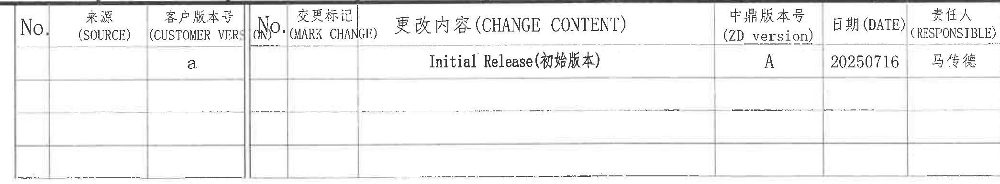
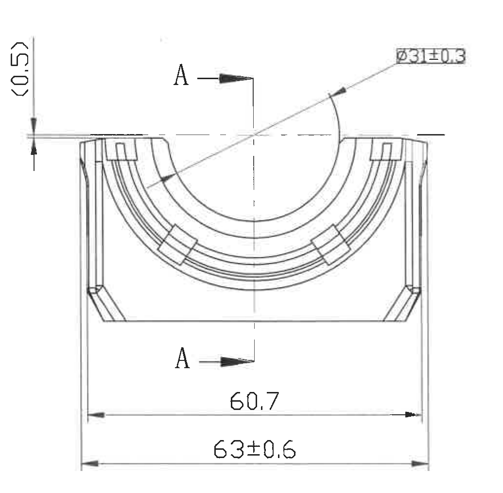
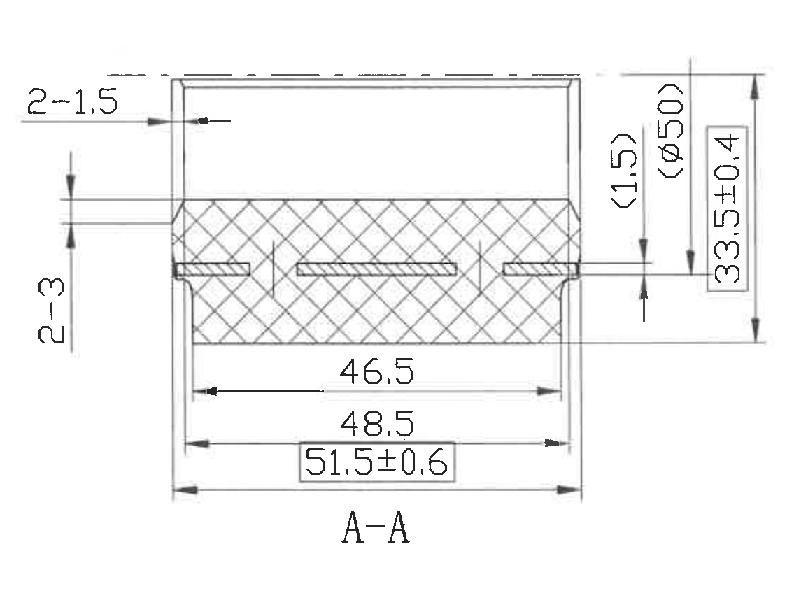
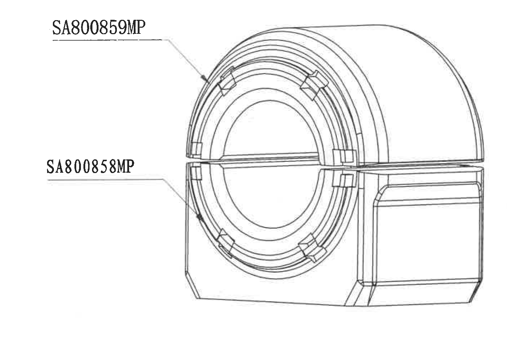
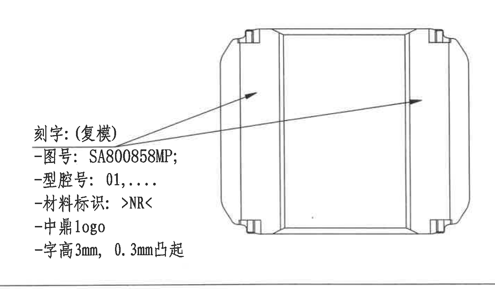
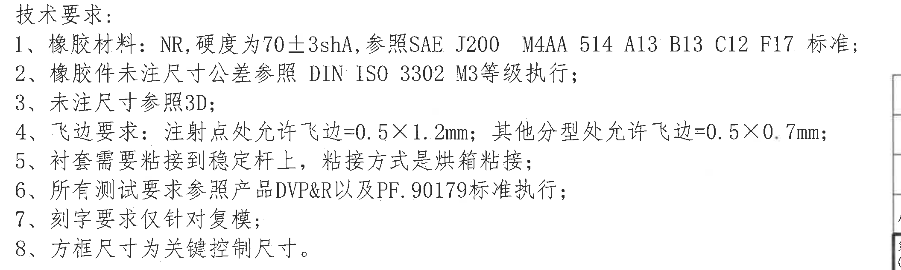
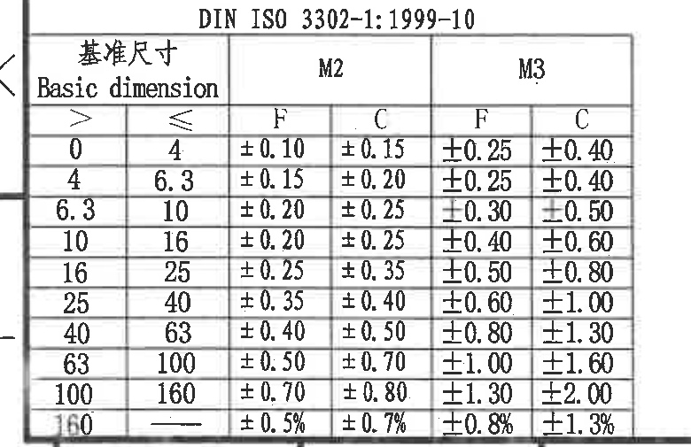
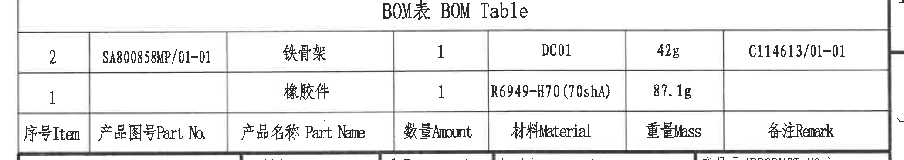
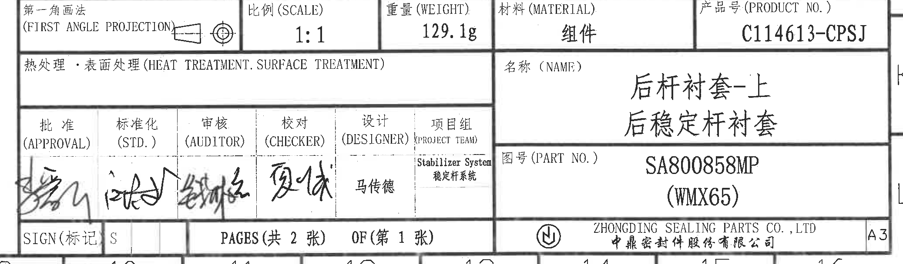

# 20C114613 PDF 内容识别与裁切提取

整页渲染图：`outputs/20C114613_assets/images/page_1.png`  
页面：1；整页 PNG 尺寸：4959 × 3505 px。  
说明：除原图另有说明外，尺寸按图纸默认毫米（mm）解读；括号内尺寸按参考尺寸处理；方框尺寸按技术要求第 8 条解读为关键控制尺寸。

## object_7：顶部更改履历表

原图位置/视图名称：页面顶部 9-16 区域，更改履历表。bbox：`[2630, 165, 4720, 550]`。

| No. | 来源 (SOURCE) | 客户版本号 (CUSTOMER VERSION) | No. | 变更标记 (MARK CHANGE) | 更改内容 (CHANGE CONTENT) | 中鼎版本号 (ZD version) | 日期 (DATE) | 责任人 (RESPONSIBLE) |
|---|---|---|---|---|---|---|---|---|
|  |  | a |  |  | Initial Release(初始版本) | A | 20250716 | 马传德 |
|  |  |  |  |  |  |  |  |  |
|  |  |  |  |  |  |  |  |  |

| 提取项 | 原图数值或文本 | 含义说明 |
|---|---|---|
| 客户版本号 | a | 客户版本标记为 a。 |
| 更改内容 | Initial Release(初始版本) | 初始发布版本。 |
| 中鼎版本号 | A | 中鼎内部版本为 A。 |
| 日期 | 20250716 | 版本日期，原图格式为 YYYYMMDD。 |
| 责任人 | 马传德 | 该版本责任人。 |

边界归属说明：裁切包含表格完整外框、表头和已有数据行；右侧图框坐标字母已尽量排除，不作为更改履历内容提取。

## object_1：左侧主视图

原图位置/视图名称：页面左中部 D-F 区域，零件主视图。bbox：`[580, 760, 1615, 1775]`。

| 提取项 | 原图数值或文本 | 含义说明 |
|---|---|---|
| 参考尺寸 | `(0.5)` | 位于主视图左上侧竖向标注，括号表示参考尺寸；用于提示上边缘相对高度/间隙，不作为主要加工控制尺寸。 |
| 圆/弧特征直径 | `Ø31±0.3` | 引线指向上方半圆开口/圆弧轮廓，表示该弧形开口对应直径 31，公差 ±0.3。 |
| 剖切标识 | `A`、`A` | 主视图中上下两处剖切箭头，定义 A-A 剖视方向；此为剖切视图编号，不是单独尺寸。 |
| 宽度尺寸 | `60.7` | 底部内侧两竖边之间的宽度尺寸。 |
| 总宽度尺寸 | `63±0.6` | 最外侧宽度尺寸，带公差 ±0.6。 |
| 角度/半径/T 编号 | 未见角度、R 半径、T 编号、星号关键尺寸 | 主视图中可见弧形轮廓，但未标注独立角度、R 半径或 T 编号；关键控制尺寸不在本视图中以方框显示。 |

边界归属说明：裁切保留主视图完整轮廓、A-A 剖切箭头、`Ø31±0.3` 引线、`(0.5)` 参考尺寸及底部两条宽度尺寸线；未包含中央 A-A 剖视图或右侧外观视图内容。

## object_2：A-A 剖视图

原图位置/视图名称：页面中部 E-F 区域，A-A 剖视图。bbox：`[1770, 930, 2925, 1785]`。

| 提取项 | 原图数值或文本 | 含义说明 |
|---|---|---|
| 数量前缀尺寸 | `2-1.5` | 左上侧引线标注，表示 2 处特征，每处尺寸为 1.5。 |
| 数量前缀尺寸 | `2-3` | 左侧竖向标注，表示 2 处特征，每处尺寸为 3。 |
| 参考尺寸 | `(1.5)` | 右侧竖向括号尺寸，作为参考尺寸，提示局部台阶/间距关系。 |
| 参考直径 | `(Ø50)` | 右侧竖向括号内直径标注，作为参考直径尺寸，不作为直接控制尺寸。 |
| 总高度尺寸 | `33.5±0.4` | 右侧总高度尺寸，带公差 ±0.4。 |
| 宽度尺寸 | `46.5` | 剖面下方内侧宽度尺寸。 |
| 宽度尺寸 | `48.5` | 剖面下方中间宽度尺寸。 |
| 方框关键控制尺寸 | `51.5±0.6` | 剖面下方总宽度尺寸，原图用方框框出；依据技术要求第 8 条，该方框尺寸为关键控制尺寸，公差 ±0.6。 |
| 剖视名称 | `A-A` | 该视图由主视图中 A-A 剖切线生成。 |
| 角度/半径/T 编号 | 未见角度、R 半径、T 编号、星号关键尺寸 | 本剖视图无独立角度、R 半径、T 编号或星号尺寸；关键尺寸以方框形式出现。 |

边界归属说明：裁切包含 A-A 剖视轮廓、剖面线、所有横向/竖向尺寸线、箭头和尺寸文字；与左侧主视图和右侧外观视图分离，未把其他视图尺寸归入本剖视图。

## object_3：右上外观/刻字指示视图

原图位置/视图名称：页面右上 C-E 区域，零件外观视图及图号引线。bbox：`[3180, 590, 4590, 1535]`。

| 提取项 | 原图数值或文本 | 含义说明 |
|---|---|---|
| 上部引线文本 | `SA800859MP` | 引线指向上半部分/对应外观位置，用于标识相关件号或刻字位置。 |
| 下部引线文本 | `SA800858MP` | 引线指向下半部分/对应外观位置，用于标识相关件号或刻字位置。 |
| 圆弧/轮廓 | 未给出尺寸数值 | 视图显示圆弧槽、环形筋和外形轮廓，但本对象内未标注直径、半径、角度或公差数值。 |
| T 编号/基准 | 未见 T 编号和基准字母 | 该视图仅见件号引线，不含 T 编号、基准框或尺寸公差。 |

边界归属说明：裁切包含右上外观视图与两条件号引线；不包含下方刻字局部视图的刻字说明，不把局部视图文字归入本外观视图。

## object_4：右中刻字局部视图

原图位置/视图名称：页面右中 G-H 区域，刻字局部视图。bbox：`[3090, 1550, 4510, 2380]`。

| 提取项 | 原图数值或文本 | 含义说明 |
|---|---|---|
| 刻字说明 | `刻字:（复模）` | 本刻字要求仅针对复模。 |
| 图号 | `SA800858MP;` | 要刻印的图号内容。 |
| 型腔号 | `01,....` | 要刻印的型腔号格式，示例从 01 开始，后续以省略号表示。 |
| 材料标识 | `>NR<` | 材料标识刻字内容。 |
| logo | `中鼎logo` | 需要包含中鼎 logo。 |
| 字高与凸起 | `字高3mm，0.3mm凸起` | 刻字高度 3 mm，凸起高度 0.3 mm。 |
| 引线位置 | 两条引线指向零件侧面平面区域 | 表示上述刻字内容应布置在被引线指示的外表面区域。 |
| 其他尺寸/T 编号 | 未见其他尺寸、角度、半径、T 编号 | 本局部视图只给出刻字内容、字高和凸起高度。 |

边界归属说明：裁切包含完整刻字文本、两条引线和被指示的局部外观；上方右上视图和下方 BOM/标题栏表格不归入该局部视图。

## object_5：技术要求 NOTES

原图位置/视图名称：页面左下 H-J 区域，技术要求。bbox：`[650, 2195, 2760, 2830]`。

| 提取项 | 原图数值或文本 | 含义说明 |
|---|---|---|
| 技术要求 1 | `橡胶材料：NR,硬度为70±3shA,参照SAE J200 M4AA 514 A13 B13 C12 F17 标准;` | 规定橡胶材料、硬度和适用材料标准。 |
| 技术要求 2 | `橡胶件未注尺寸公差参照 DIN ISO 3302 M3等级执行;` | 未注尺寸公差按 DIN ISO 3302 M3 等级执行。 |
| 技术要求 3 | `未注尺寸参照3D;` | 未标注尺寸以 3D 数据为准。 |
| 技术要求 4 | `飞边要求：注射点处允许飞边=0.5×1.2mm；其他分型处允许飞边=0.5×0.7mm;` | 注射点和其他分型处的允许飞边尺寸。 |
| 技术要求 5 | `衬套需要粘接到稳定杆上，粘接方式是烘箱粘接;` | 装配/工艺要求。 |
| 技术要求 6 | `所有测试要求参照产品DVP&R以及PF.90179标准执行;` | 测试依据为产品 DVP&R 和 PF.90179。 |
| 技术要求 7 | `刻字要求仅针对复模;` | object_4 中刻字要求的适用范围。 |
| 技术要求 8 | `方框尺寸为关键控制尺寸。` | 说明方框标注尺寸为关键控制尺寸；对应 A-A 剖视图中的 `51.5±0.6`。 |

边界归属说明：裁切完整包含 1-8 条技术要求；右侧可见相邻表格外框线仅作为邻接边界，不提取为 NOTES 内容。

## object_6：DIN ISO 3302 公差表

原图位置/视图名称：页面左下 K-L 区域，DIN ISO 3302 公差表。bbox：`[330, 2845, 1110, 3350]`。

表名：`DIN ISO 3302-1:1999-10`

| 基准尺寸 Basic dimension `>` | 基准尺寸 Basic dimension `≤` | M2 F | M2 C | M3 F | M3 C |
|---:|---:|---:|---:|---:|---:|
| 0 | 4 | ±0.10 | ±0.15 | ±0.25 | ±0.40 |
| 4 | 6.3 | ±0.15 | ±0.20 | ±0.25 | ±0.40 |
| 6.3 | 10 | ±0.20 | ±0.25 | ±0.30 | ±0.50 |
| 10 | 16 | ±0.20 | ±0.25 | ±0.40 | ±0.60 |
| 16 | 25 | ±0.25 | ±0.35 | ±0.50 | ±0.80 |
| 25 | 40 | ±0.35 | ±0.40 | ±0.60 | ±1.00 |
| 40 | 63 | ±0.40 | ±0.50 | ±0.80 | ±1.30 |
| 63 | 100 | ±0.50 | ±0.70 | ±1.00 | ±1.60 |
| 100 | 160 | ±0.70 | ±0.80 | ±1.30 | ±2.00 |
| 160 | — | ±0.5% | ±0.7% | ±0.8% | ±1.3% |

| 提取项 | 原图数值或文本 | 含义说明 |
|---|---|---|
| 适用标准 | `DIN ISO 3302-1:1999-10` | 未注尺寸公差表引用标准。 |
| 技术要求关联 | `M3等级` | 技术要求第 2 条指定橡胶件未注尺寸公差按 M3 等级执行，因此本表 M3 F/C 列为主要关联列。 |

边界归属说明：裁切包含完整 DIN 标准号、表头、所有公差行和外框；左侧外图框线为邻近边界，不作为公差表内容。

## object_8：BOM 表

原图位置/视图名称：页面右下 I-J 区域，BOM 表。bbox：`[2700, 2390, 4775, 2760]`。

| 序号 Item | 产品图号 Part No. | 产品名称 Part Name | 数量 Amount | 材料 Material | 重量 Mass | 备注 Remark |
|---:|---|---|---:|---|---:|---|
| 2 | SA800858MP/01-01 | 铁骨架 | 1 | DC01 | 42g | C114613/01-01 |
| 1 |  | 橡胶件 | 1 | R6949-H70(70shA) | 87.1g |  |

| 提取项 | 原图数值或文本 | 含义说明 |
|---|---|---|
| BOM 标题 | `BOM表 BOM Table` | 物料清单表。 |
| 序号 2 | `SA800858MP/01-01 / 铁骨架 / 1 / DC01 / 42g / C114613/01-01` | 铁骨架零件条目。 |
| 序号 1 | `橡胶件 / 1 / R6949-H70(70shA) / 87.1g` | 橡胶件条目；产品图号和备注单元格为空。 |

边界归属说明：裁切包含 BOM 标题、两行物料和表头；下方标题栏只在外框邻接处接触，不把标题栏字段归入 BOM。

## object_9：标题栏

原图位置/视图名称：页面右下 J-L 区域，标题栏。bbox：`[2700, 2750, 4775, 3360]`。

| 字段 | 原图数值或文本 |
|---|---|
| 第一角画法 | `FIRST ANGLE PROJECTION`，含第一角投影符号 |
| 比例 (SCALE) | `1:1` |
| 重量 (WEIGHT) | `129.1g` |
| 材料 (MATERIAL) | `组件` |
| 产品号 (PRODUCT NO.) | `C114613-CPSJ` |
| 热处理·表面处理 (HEAT TREATMENT. SURFACE TREATMENT) | 空白 |
| 名称 (NAME) | `后杆衬套-上` / `后稳定杆衬套` |
| 批准 (APPROVAL) | 手签 |
| 标准化 (STD.) | 手签 |
| 审核 (AUDITOR) | 手签 |
| 校对 (CHECKER) | 手签 |
| 设计 (DESIGNER) | `马传德` |
| 项目组 (PROJECT TEAM) | `Stabilizer System` / `稳定杆系统` |
| 图号 (PART NO.) | `SA800858MP` / `(WMX65)` |
| SIGN (标记) | `S` |
| PAGES | `PAGES(共 2 张) OF(第 1 张)` |
| 公司 | `ZHONGDING SEALING PARTS CO.,LTD` / `中鼎密封件股份有限公司` |
| 图幅 | `A3` |

| 提取项 | 原图数值或文本 | 含义说明 |
|---|---|---|
| 产品号 | `C114613-CPSJ` | 标题栏产品编号。 |
| 图号 | `SA800858MP (WMX65)` | 零件/图纸编号。 |
| 名称 | `后杆衬套-上；后稳定杆衬套` | 零件名称。 |
| 比例 | `1:1` | 绘图比例。 |
| 重量 | `129.1g` | 总重量；与 BOM 中 42g + 87.1g 相符。 |
| 材料 | `组件` | 标题栏材料字段为组件。 |

边界归属说明：裁切包含标题栏的表格外框和字段；上方 BOM 表边界仅为邻接关系，不将 BOM 行项目归入标题栏。

## 裁切检查记录

| 对象 | bbox | 检查结果 |
|---|---|---|
| object_1 | `[580, 760, 1615, 1775]` | 主视图完整；`(0.5)`、`Ø31±0.3`、A-A 剖切箭头、`60.7`、`63±0.6` 均完整包含，未混入 A-A 剖视图。 |
| object_2 | `[1770, 930, 2925, 1785]` | A-A 剖视图完整；`2-1.5`、`2-3`、`(1.5)`、`(Ø50)`、`33.5±0.4`、`46.5`、`48.5`、`51.5±0.6` 和 A-A 标签完整包含。 |
| object_3 | `[3180, 590, 4590, 1535]` | 右上外观视图和两条件号引线完整；未纳入右中刻字局部视图文本。 |
| object_4 | `[3090, 1550, 4510, 2380]` | 刻字局部视图完整；刻字说明、图号、型腔号、材料标识、logo、字高和凸起高度文字完整，无底部文字截断。 |
| object_5 | `[650, 2195, 2760, 2830]` | 技术要求 1-8 条完整；右侧仅保留邻近表格边界线，未提取为 NOTES 内容。 |
| object_6 | `[330, 2845, 1110, 3350]` | DIN 公差表完整；标准号、表头和 10 行公差数据均完整，底部图框坐标已裁除。 |
| object_7 | `[2630, 165, 4720, 550]` | 顶部更改履历表完整；表头、初始发布行和空白行外框均完整，右侧图框坐标字母未作为内容提取。 |
| object_8 | `[2700, 2390, 4775, 2760]` | BOM 表完整；标题、表头、两条物料行完整，下方标题栏未归入 BOM 内容。 |
| object_9 | `[2700, 2750, 4775, 3360]` | 标题栏完整；比例、重量、材料、产品号、名称、图号、签署栏、页码、公司和图幅字段完整。 |
