# 20C114614 内容识别与裁切提取

整页渲染图：`outputs/20C114614_assets/images/page_1.png`  
整页尺寸：4959 x 3505 px

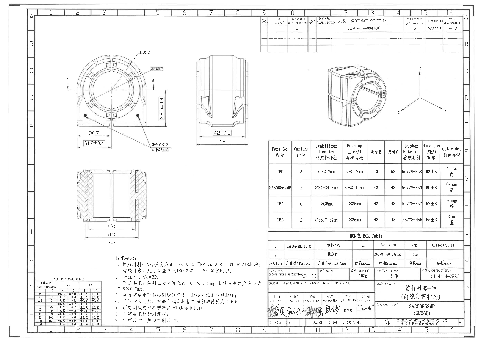

## object_5 修订履历表

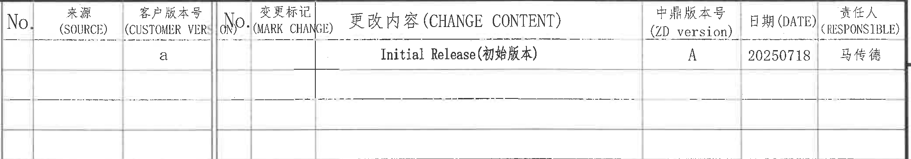

原图位置/视图名称：页 1，上方右侧修订履历表，bbox `[2655, 165, 4735, 530]`。

原表还原：

| No. | 来源 (SOURCE) | 客户版本号 (CUSTOMER VERSION) | No. | 变更标记 (MARK CHANGE) | 更改内容 (CHANGE CONTENT) | 中鼎版本号 (ZD version) | 日期 (DATE) | 责任人 (RESPONSIBLE) |
|---|---|---|---|---|---|---|---|---|
|  |  | a |  |  | Initial Release(初始版本) | A | 20250718 | 马传德 |
|  |  |  |  |  |  |  |  |  |
|  |  |  |  |  |  |  |  |  |

提取表格：

| 提取项 | 原图数值或文本 | 含义说明 |
|---|---|---|
| 客户版本号 | a | 客户侧版本标识。 |
| 更改内容 | Initial Release(初始版本) | 本页记录为初始发布版本。 |
| 中鼎版本号 | A | 中鼎内部版本号。 |
| 日期 | 20250718 | 修订/发布日期，格式为 YYYYMMDD。 |
| 责任人 | 马传德 | 修订记录责任人。 |

边界归属说明：裁切只包含图纸上方修订履历表区域；右侧图框字母和下方其他表格未纳入。本表中的版本、日期和责任人只归属于修订履历表。

## object_1 主视图

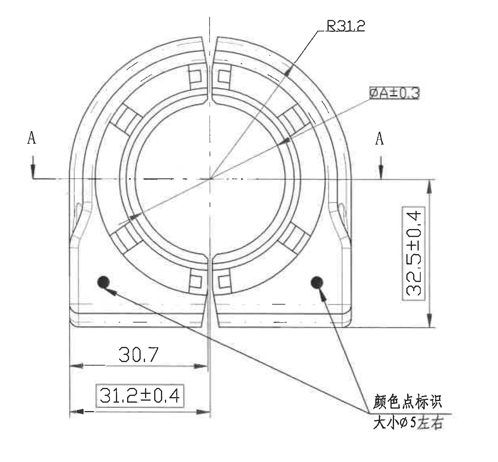

原图位置/视图名称：页 1，左上主视图，bbox `[610, 470, 1860, 1630]`。

提取表格：

| 提取项 | 原图数值或文本 | 含义说明 |
|---|---|---|
| 剖切标识 | A / A | 水平剖切线两端标注 A，指向下方 A-A 剖视图。该标识属于主视图上的剖切位置，不是尺寸值。 |
| 圆弧半径 | R31.2 | 外部圆弧/环形轮廓半径为 31.2。`R` 表示半径尺寸。 |
| 直径变量尺寸 | ØA±0.3 | 内孔/衬套内径相关直径尺寸，`Ø` 表示直径，A 为表格变量；公差为 ±0.3。A 值见规格参数表的 Bushing ID(ØA) 列。 |
| 总高度 | 32.5±0.4 | 主视图右侧竖向总高度尺寸，公差 ±0.4。 |
| 水平局部尺寸 | 30.7 | 主视图底部左侧局部水平尺寸，无单独标注公差；未注公差按 NOTES 和 DIN ISO 3302-1 表执行。 |
| 底部宽度尺寸 | 31.2±0.4 | 主视图底部水平尺寸，公差 ±0.4。 |
| 颜色点标识 | 颜色点标识 大小Ø5左右 | 两个黑色圆点为颜色标识位置；颜色点直径约 Ø5。 |
| 星号关键尺寸 | 未见星号标注 | 主视图未出现带星号关键尺寸。 |
| T 编号 | 未见 T 编号 | 主视图未出现 T 编号。 |
| 角度/弧向尺寸 | 未见角度或弧向长度标注 | 主视图仅见半径 R31.2 和直径 ØA±0.3；未见角度数值或弧向长度尺寸。 |

边界归属说明：裁切完整包含主视图轮廓、剖切线 A-A、R31.2、ØA±0.3、32.5±0.4、30.7、31.2±0.4 和颜色点标识文字。右侧侧视图、下方 A-A 剖视图、右侧规格表均未纳入；本区尺寸不得归到剖视图或侧视图。

## object_2 侧视图

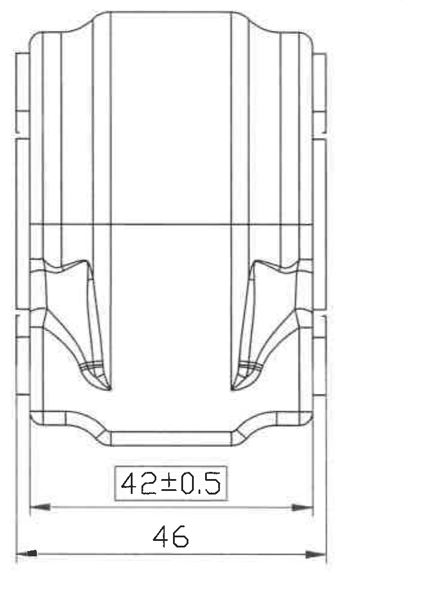

原图位置/视图名称：页 1，上方中部侧视图，bbox `[1980, 545, 2700, 1560]`。

提取表格：

| 提取项 | 原图数值或文本 | 含义说明 |
|---|---|---|
| 内部宽度/局部宽度 | 42±0.5 | 侧视图底部框选尺寸，公差 ±0.5。 |
| 总宽 | 46 | 侧视图底部外侧总宽尺寸，无单独标注公差；未注公差按 NOTES 和 DIN ISO 3302-1 表执行。 |
| 星号关键尺寸 | 未见星号标注 | 侧视图未出现带星号关键尺寸。 |
| T 编号 | 未见 T 编号 | 侧视图未出现 T 编号。 |
| 角度/弧度/弧向尺寸 | 未见 | 侧视图未出现角度、半径或弧向长度标注。 |

边界归属说明：裁切完整包含侧视图轮廓和底部两条尺寸线。左侧主视图和右侧等轴测图未纳入；`42±0.5` 和 `46` 只归属于侧视图。

## object_4 等轴测参考视图

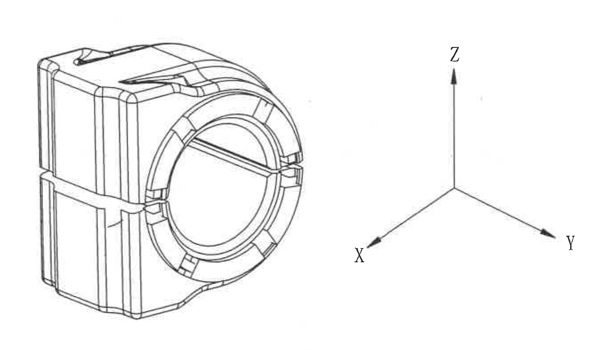

原图位置/视图名称：页 1，右上等轴测参考视图及坐标轴，bbox `[3260, 575, 4610, 1365]`。

提取表格：

| 提取项 | 原图数值或文本 | 含义说明 |
|---|---|---|
| 等轴测视图 | 零件 3D 外形 | 用于表达零件空间形状和开口方向。 |
| 坐标轴 | X / Y / Z | 三维方向标识，用于确认空间朝向。 |
| 尺寸标注 | 未见尺寸数值 | 该视图区未标注具体加工尺寸。 |
| 星号关键尺寸 | 未见星号标注 | 该视图区未出现星号关键尺寸。 |
| T 编号 | 未见 T 编号 | 该视图区未出现 T 编号。 |

边界归属说明：裁切只包含等轴测参考图和 X/Y/Z 坐标轴，不包含下方规格参数表边线和文字。该图中的内容仅用于空间方向解释，不把规格表尺寸归入本视图。

## object_6 规格参数表

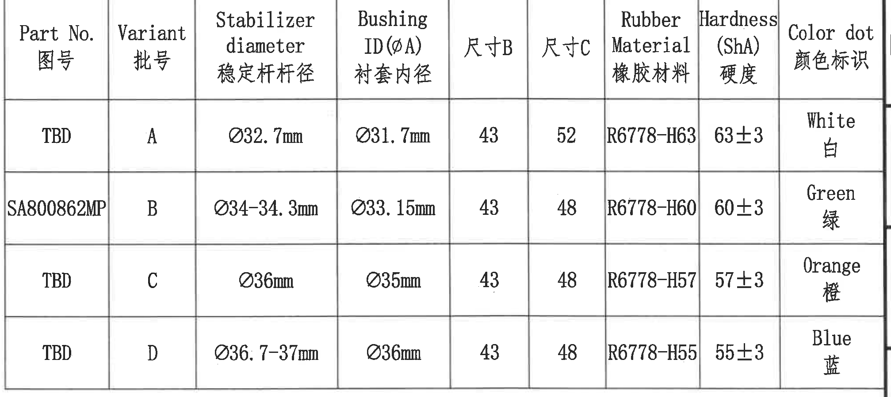

原图位置/视图名称：页 1，右中规格参数表，bbox `[2730, 1447, 4745, 2347]`。

原表还原：

| Part No. 图号 | Variant 批号 | Stabilizer diameter 稳定杆杆径 | Bushing ID(ØA) 衬套内径 | 尺寸B | 尺寸C | Rubber Material 橡胶材料 | Hardness (ShA) 硬度 | Color dot 颜色标识 |
|---|---|---|---|---|---|---|---|---|
| TBD | A | Ø32.7mm | Ø31.7mm | 43 | 52 | R6778-H63 | 63±3 | White 白 |
| SA800862MP | B | Ø34-34.3mm | Ø33.15mm | 43 | 48 | R6778-H60 | 60±3 | Green 绿 |
| TBD | C | Ø36mm | Ø35mm | 43 | 48 | R6778-H57 | 57±3 | Orange 橙 |
| TBD | D | Ø36.7-37mm | Ø36mm | 43 | 48 | R6778-H55 | 55±3 | Blue 蓝 |

提取表格：

| 提取项 | 原图数值或文本 | 含义说明 |
|---|---|---|
| Bushing ID(ØA) | Ø31.7mm / Ø33.15mm / Ø35mm / Ø36mm | 对应主视图 `ØA±0.3` 的变量 A，按不同 Variant 选取。 |
| 尺寸B | 43 | 对应 A-A 剖视图参考尺寸 `<B>`，各 Variant 均为 43。 |
| 尺寸C | A=52；B/C/D=48 | 对应 A-A 剖视图参考尺寸 `<C>`，按 Variant 变化。 |
| Rubber Material | R6778-H63 / R6778-H60 / R6778-H57 / R6778-H55 | 各 Variant 对应橡胶材料牌号。 |
| Hardness (ShA) | 63±3 / 60±3 / 57±3 / 55±3 | 各 Variant 橡胶硬度及公差，单位 ShA。 |
| Color dot | White / Green / Orange / Blue | 对应主视图颜色点标识。 |

边界归属说明：裁切完整包含规格参数表表头和 A-D 四行数据。上方等轴测图、下方 BOM 表未纳入；表中的 `ØA`、`B`、`C` 是对主视图和 A-A 剖视图变量尺寸的取值说明。

## object_3 A-A 剖视图

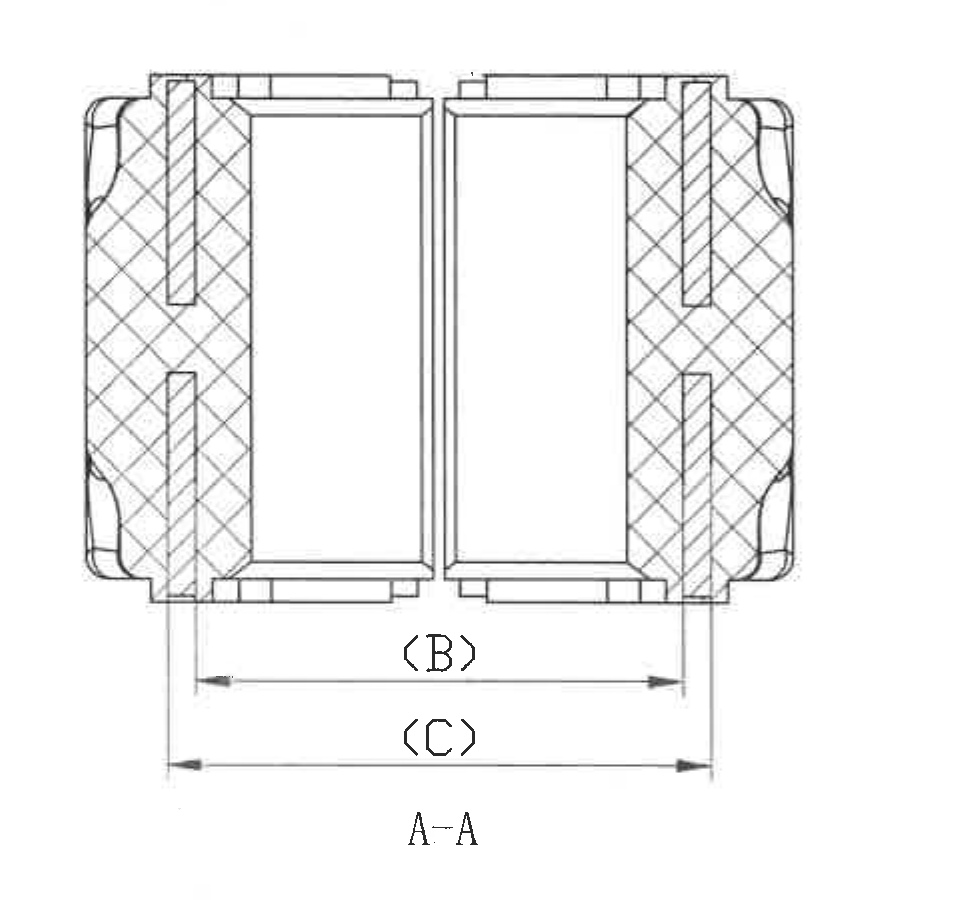

原图位置/视图名称：页 1，左下中部 A-A 剖视图，bbox `[700, 1660, 1680, 2560]`。

提取表格：

| 提取项 | 原图数值或文本 | 含义说明 |
|---|---|---|
| 剖视图名称 | A-A | 由主视图中的 A-A 剖切线得到的剖面视图。 |
| 参考尺寸 | `<B>` | 括号/尖括号中的参考尺寸，数值不直接写在剖视图内；具体取值见规格参数表 `尺寸B` 列，当前表中为 43。 |
| 参考尺寸 | `<C>` | 括号/尖括号中的参考尺寸，数值不直接写在剖视图内；具体取值见规格参数表 `尺寸C` 列，A 为 52，B/C/D 为 48。 |
| 剖面填充 | 交叉剖面线 | 表示剖切到的橡胶/实体截面区域。 |
| 星号关键尺寸 | 未见星号标注 | 剖视图未出现带星号关键尺寸。 |
| T 编号 | 未见 T 编号 | 剖视图未出现 T 编号。 |
| 角度/弧度/弧向尺寸 | 未见 | 剖视图未出现角度、半径或弧向长度标注。 |

边界归属说明：裁切完整包含 A-A 剖视图和 `<B>`、`<C>` 两条参考尺寸线及箭头。主视图底部尺寸 `30.7`、`31.2±0.4` 未纳入本剖视图；`<B>`、`<C>` 不归属于主视图。

## object_10 DIN ISO 3302-1 公差表

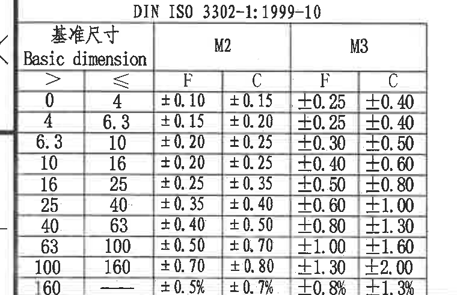

原图位置/视图名称：页 1，左下角 DIN ISO 3302-1:1999-10 基础尺寸公差表，bbox `[325, 2835, 1085, 3325]`。

原表还原：

| Basic dimension > | Basic dimension ≤ | M2 F | M2 C | M3 F | M3 C |
|---:|---:|---:|---:|---:|---:|
| 0 | 4 | ±0.10 | ±0.15 | ±0.25 | ±0.40 |
| 4 | 6.3 | ±0.15 | ±0.20 | ±0.25 | ±0.40 |
| 6.3 | 10 | ±0.20 | ±0.25 | ±0.30 | ±0.50 |
| 10 | 16 | ±0.20 | ±0.25 | ±0.40 | ±0.60 |
| 16 | 25 | ±0.25 | ±0.35 | ±0.50 | ±0.80 |
| 25 | 40 | ±0.35 | ±0.40 | ±0.60 | ±1.00 |
| 40 | 63 | ±0.40 | ±0.50 | ±0.80 | ±1.30 |
| 63 | 100 | ±0.50 | ±0.70 | ±1.00 | ±1.60 |
| 100 | 160 | ±0.70 | ±0.80 | ±1.30 | ±2.00 |
| 160 | -- | ±0.5% | ±0.7% | ±0.8% | ±1.3% |

提取表格：

| 提取项 | 原图数值或文本 | 含义说明 |
|---|---|---|
| 标准 | DIN ISO 3302-1:1999-10 | 橡胶件未注尺寸公差引用标准。 |
| 等级 | M2 / M3，F / C | 表格列出 M2、M3 等级下 F、C 两类公差。 |
| NOTES 引用 | ISO 3302-1 M3 等级F | 技术要求第 2 条指定未注尺寸公差按 M3 等级 F 执行。 |

边界归属说明：裁切完整包含 DIN ISO 3302-1 表头、M2/M3 分栏和全部尺寸区间。左侧少量图框线为保证表格左边界完整保留；该表不包含 NOTES 文本。

## object_9 NOTES / 技术要求

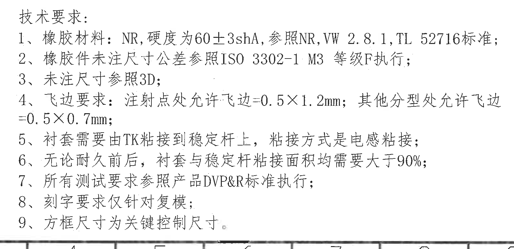

原图位置/视图名称：页 1，下方中左技术要求文本块，bbox `[1120, 2585, 2705, 3355]`。

提取表格：

| 提取项 | 原图数值或文本 | 含义说明 |
|---|---|---|
| 标题 | 技术要求: | 下列 1-9 条为本图技术要求。 |
| 1 | 橡胶材料：NR,硬度为60±3shA,参照NR,VW 2.8.1,TL 52716标准; | 橡胶材料和硬度要求，引用 NR、VW 2.8.1、TL 52716 标准。 |
| 2 | 橡胶件未注尺寸公差参照ISO 3302-1 M3 等级F执行; | 未注尺寸公差执行 DIN ISO 3302-1 的 M3 F 等级。 |
| 3 | 未注尺寸参照3D; | 图纸未标注的尺寸以 3D 数据为准。 |
| 4 | 飞边要求：注射点处允许飞边=0.5×1.2mm；其他分型处允许飞边=0.5×0.7mm; | 注射点和其他分型位置允许飞边尺寸要求。 |
| 5 | 衬套需要由TK粘接到稳定杆上，粘接方式是电感粘接; | 衬套与稳定杆的粘接方式要求。 |
| 6 | 无论耐久前后，衬套与稳定杆粘接面积均需要大于90%; | 耐久前后粘接面积要求。 |
| 7 | 所有测试要求参照产品DVP&R标准执行; | 测试要求引用产品 DVP&R 标准。 |
| 8 | 刻字要求仅针对复模; | 刻字要求适用范围。 |
| 9 | 方框尺寸为关键控制尺寸。 | 图纸中框选尺寸为关键控制尺寸。 |

边界归属说明：裁切完整包含技术要求 1-9 条。底部带入少量图框坐标线是为避免第 9 条被裁掉；这些坐标线不作为 NOTES 内容提取。左下 DIN ISO 公差表和右下标题栏未纳入本对象内容。

## object_7 BOM 表

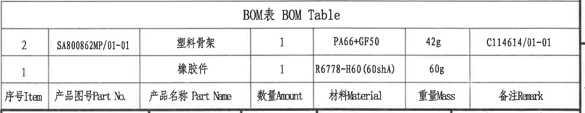

原图位置/视图名称：页 1，右下标题栏上方 BOM 表，bbox `[2730, 2360, 4750, 2750]`。

原表还原：

| 序号 Item | 产品图号 Part No. | 产品名称 Part Name | 数量 Amount | 材料 Material | 重量 Mass | 备注 Remark |
|---|---|---|---:|---|---:|---|
| 2 | SA800862MP/01-01 | 塑料骨架 | 1 | PA66+GF50 | 42g | C114614/01-01 |
| 1 |  | 橡胶件 | 1 | R6778-H60(60ShA) | 60g |  |

提取表格：

| 提取项 | 原图数值或文本 | 含义说明 |
|---|---|---|
| BOM 标题 | BOM表 BOM Table | 物料清单表标题。 |
| 塑料骨架 | SA800862MP/01-01；PA66+GF50；42g；C114614/01-01 | 塑料骨架物料，数量 1，材料 PA66+GF50。 |
| 橡胶件 | R6778-H60(60ShA)；60g | 橡胶件物料，数量 1，材料/硬度 R6778-H60(60ShA)。 |

边界归属说明：裁切完整包含 BOM 标题、两行物料和表头。下方标题栏未作为 BOM 内容提取；BOM 的材料和重量只归属于物料清单。

## object_8 标题栏

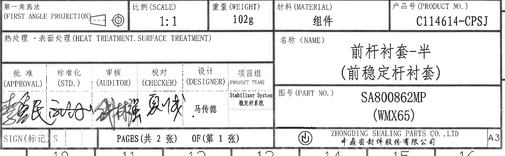

原图位置/视图名称：页 1，右下标题栏，bbox `[2730, 2740, 4750, 3365]`。

提取表格：

| 提取项 | 原图数值或文本 | 含义说明 |
|---|---|---|
| 投影法 | 第一角画法 (FIRST ANGLE PROJECTION) | 图纸采用第一角投影法，图中有投影符号。 |
| 比例 | 1:1 | 图纸比例。 |
| 重量 | 102g | 组件重量。 |
| 材料 | 组件 | 材料栏标注为组件。 |
| 产品号 | C114614-CPSJ | 产品号。 |
| 热处理/表面处理 | 空白 | 原图该栏未填写具体处理。 |
| 名称 | 前杆衬套-半（前稳定杆衬套） | 零件/组件名称。 |
| 图号 | SA800862MP (WMX65) | 图号和括号内附加代号。 |
| 批准/标准化/审核/校对 | 手写签名 | 原图为手写签名，未可靠转写为文字。 |
| 设计 | 马传德 | 设计栏可见印刷姓名。 |
| 项目组 | Stabilizer System / 稳定杆系统 | 项目组名称。 |
| 标记 | SIGN(标记)；S | 标记栏内容。 |
| 页码 | PAGES(共 2 张) OF(第 1 张) | 共 2 张，第 1 张。 |
| 公司 | ZHONGDING SEALING PARTS CO., LTD / 中鼎密封件股份有限公司 | 出图公司。 |
| 图幅 | A3 | 图纸幅面。 |

边界归属说明：裁切完整包含标题栏主字段、签名区、页码、公司名和 A3 图幅。上方 BOM 表未作为标题栏字段提取；手写签名仅按图像保留，不做主观猜读。

## 裁切检查记录

| 对象 | 图片路径 | 检查结果 |
|---|---|---|
| page_1 | outputs/20C114614_assets/images/page_1.png | 整页 PNG 渲染完整，尺寸 4959 x 3505 px。 |
| object_1 | outputs/20C114614_assets/images/object_1.png | 主视图完整包含所有尺寸线、箭头和文字；未带入侧视图或剖视图。 |
| object_2 | outputs/20C114614_assets/images/object_2.png | 侧视图完整包含 `42±0.5` 和 `46` 两条尺寸线及箭头；未带入主视图。 |
| object_3 | outputs/20C114614_assets/images/object_3.png | A-A 剖视图完整包含 `<B>`、`<C>` 参考尺寸线、箭头和剖视图名称。 |
| object_4 | outputs/20C114614_assets/images/object_4.png | 等轴测参考图和 X/Y/Z 坐标轴完整；已去除下方规格表边线。 |
| object_5 | outputs/20C114614_assets/images/object_5.png | 修订履历表表头和记录行完整；未纳入下方其他表格。 |
| object_6 | outputs/20C114614_assets/images/object_6.png | 规格参数表表头和 A-D 四行完整；未纳入 BOM 表。 |
| object_7 | outputs/20C114614_assets/images/object_7.png | BOM 表标题、表头和两行物料完整；未纳入标题栏字段。 |
| object_8 | outputs/20C114614_assets/images/object_8.png | 标题栏字段、签名区、页码、公司名和 A3 标识完整；未把 BOM 行作为标题栏内容。 |
| object_9 | outputs/20C114614_assets/images/object_9.png | NOTES 1-9 条完整；底部少量图框坐标线为避免第 9 条被裁掉，不提取为 NOTES 内容。 |
| object_10 | outputs/20C114614_assets/images/object_10.png | DIN ISO 3302-1 公差表表头、分栏和所有行完整；未纳入 NOTES 文本。 |
