# 20C114615 PDF 内容识别

整页渲染图：`outputs/20C114615_assets/images/page_1.png`

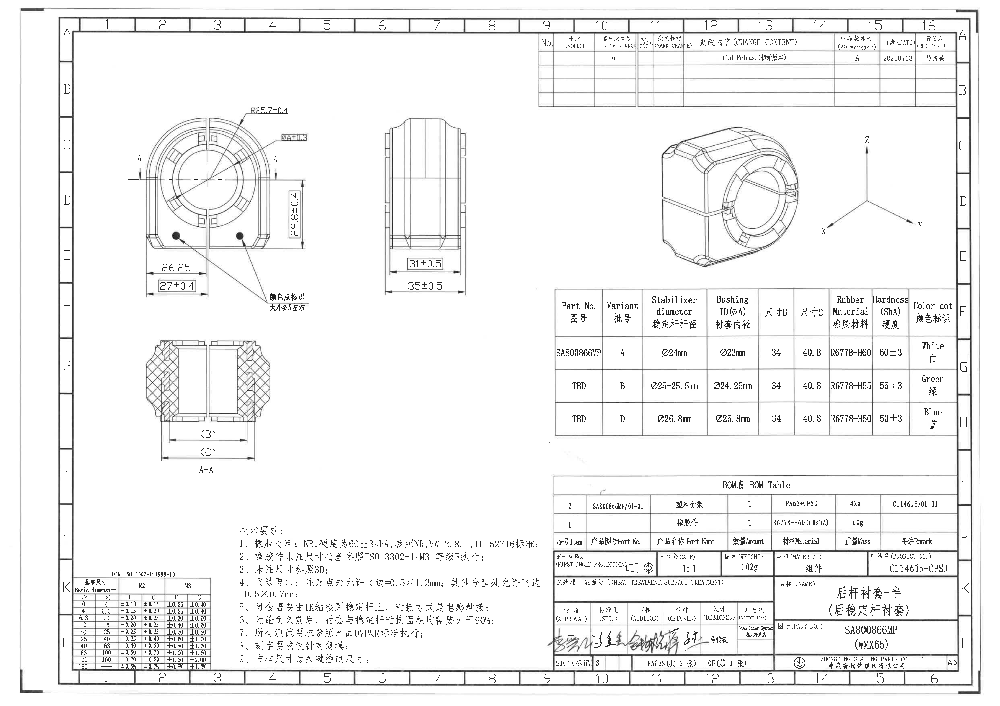

坐标说明：下列 `bbox` 均为整页 PNG 左上角坐标，格式为 `[x, y, width, height]`，整页尺寸为 `6612 x 4673 px`。

## object_1 主视图 / 正面加工视图

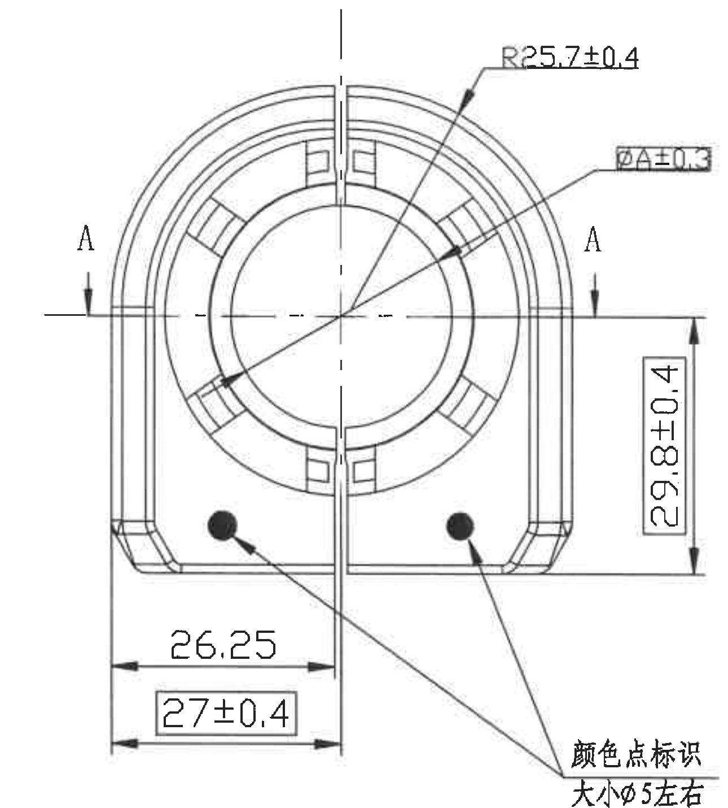

原图位置/视图名称：第 1 页左上区域，主视图/正面加工视图，bbox `[770, 630, 1290, 1430]`。

边界归属说明：裁切范围完整包含主视图外形、孔/环形结构、A-A 剖切标记、所有主视图尺寸线、箭头和文字。左、右 `A` 剖切箭头属于主视图内的剖切指示，不归入 A-A 剖面图的尺寸提取。未带入侧视图或剖面视图尺寸。

| 提取项 | 原图数值或文本 | 含义说明 |
|---|---|---|
| 半径尺寸 | `R25.7±0.4` | 主视图上方弧形外轮廓/环形区域的半径标注，带 `±0.4` 公差。 |
| 内径参数 | `ØA±0.3` | 主视图孔/衬套内径参数 `A`，带 `±0.3` 公差；`A` 的具体取值见 object_7 规格表中的 `Bushing ID(ØA)`。 |
| 竖向尺寸 | `29.8±0.4` | 主视图右侧竖向尺寸，表示从中心水平基准线/剖切线到下端基准边的距离，带 `±0.4` 公差。 |
| 下部横向尺寸 | `26.25` | 主视图下部左侧横向距离尺寸，图中未给出独立公差。 |
| 方框关键尺寸 | `27±0.4` | 主视图下部方框尺寸，带 `±0.4` 公差；根据技术要求第 9 条，方框尺寸为关键控制尺寸。 |
| 颜色点标识 | `颜色点标识 大小Ø5左右` | 两个黑色圆点为颜色点标识，尺寸约 `Ø5`；颜色对应关系见 object_7 规格表的 `Color dot 颜色标识`。 |
| 剖切标记 | `A`、`A` | 主视图左右两侧剖切箭头，指示 A-A 剖面位置；不作为主视图尺寸值。 |

## object_2 侧视图 / 宽度加工视图

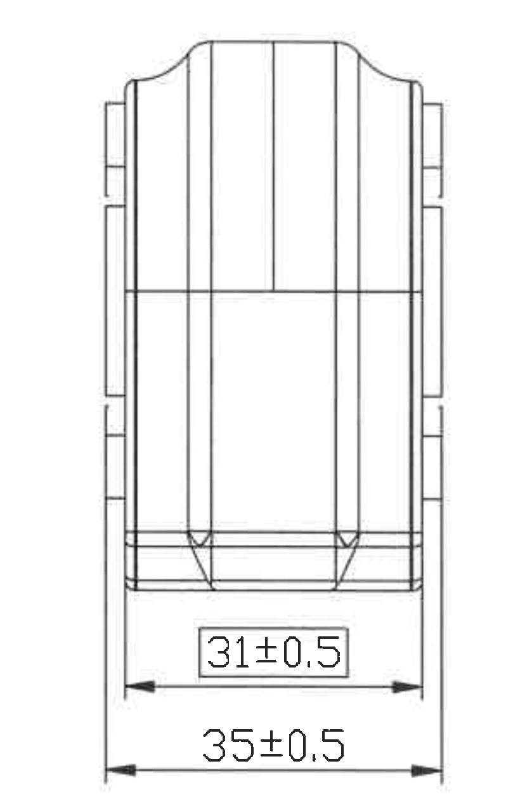

原图位置/视图名称：第 1 页中上偏左区域，侧视图/宽度加工视图，bbox `[2380, 720, 820, 1260]`。

边界归属说明：裁切范围完整包含侧视图轮廓以及底部两条水平尺寸线、箭头和文字；未带入主视图或剖面图尺寸。

| 提取项 | 原图数值或文本 | 含义说明 |
|---|---|---|
| 方框关键宽度 | `31±0.5` | 侧视图内部/局部宽度尺寸，带 `±0.5` 公差；该尺寸在方框内，根据技术要求第 9 条为关键控制尺寸。 |
| 外侧总宽度 | `35±0.5` | 侧视图外侧宽度尺寸，带 `±0.5` 公差。 |

## object_3 A-A 剖面视图

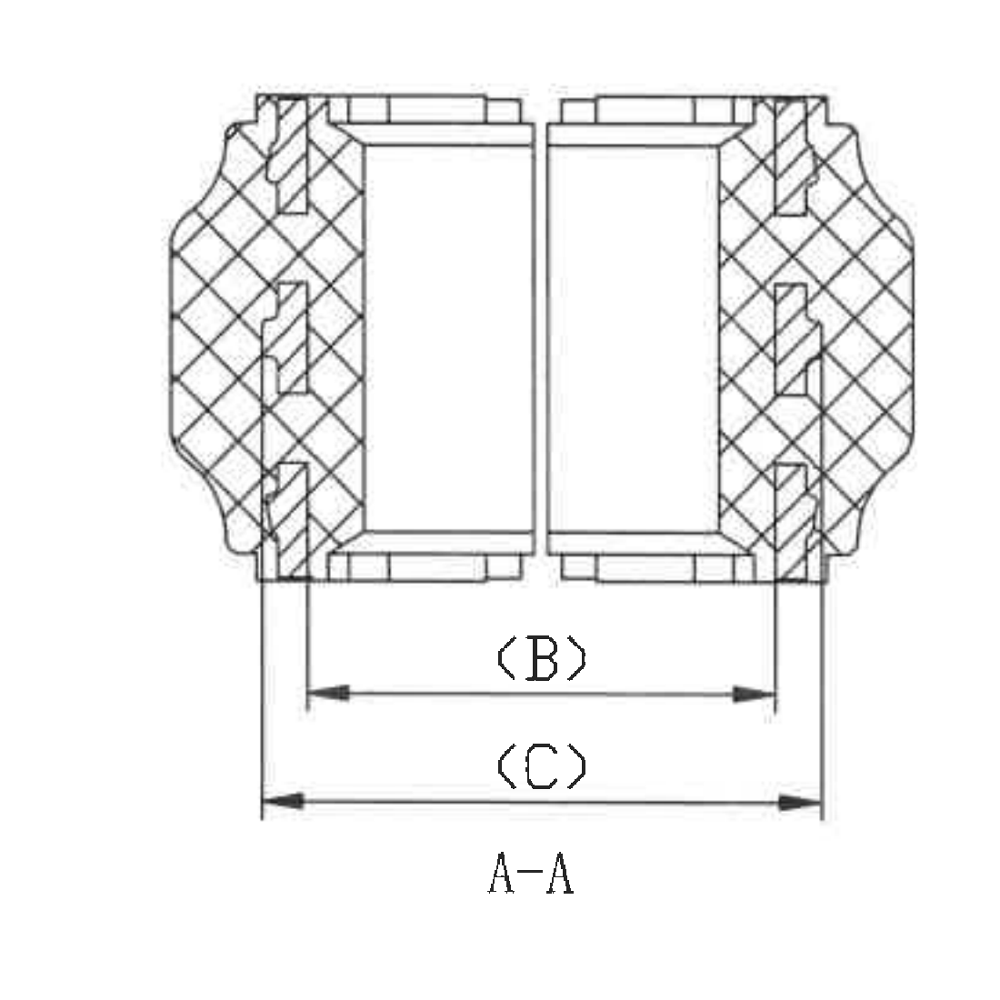

原图位置/视图名称：第 1 页左下偏上区域，A-A 剖面视图，bbox `[780, 2150, 1100, 1100]`。

边界归属说明：裁切范围完整包含 A-A 剖面、剖面线、底部 `(B)`、`(C)` 参考尺寸线和 `A-A` 视图名。`(B)` 与 `(C)` 仅归属于此剖面视图，不归入主视图或侧视图。

| 提取项 | 原图数值或文本 | 含义说明 |
|---|---|---|
| 参考尺寸 B | `(B)` | 括号内尺寸，为参考/参数尺寸；具体数值由 object_7 规格表的 `尺寸B` 给出，本图三种 Variant 均为 `34`。 |
| 参考尺寸 C | `(C)` | 括号内尺寸，为参考/参数尺寸；具体数值由 object_7 规格表的 `尺寸C` 给出，本图三种 Variant 均为 `40.8`。 |
| 剖面名称 | `A-A` | 由 object_1 主视图中的 A-A 剖切标记生成的剖面视图。 |

## object_4 三维外观视图

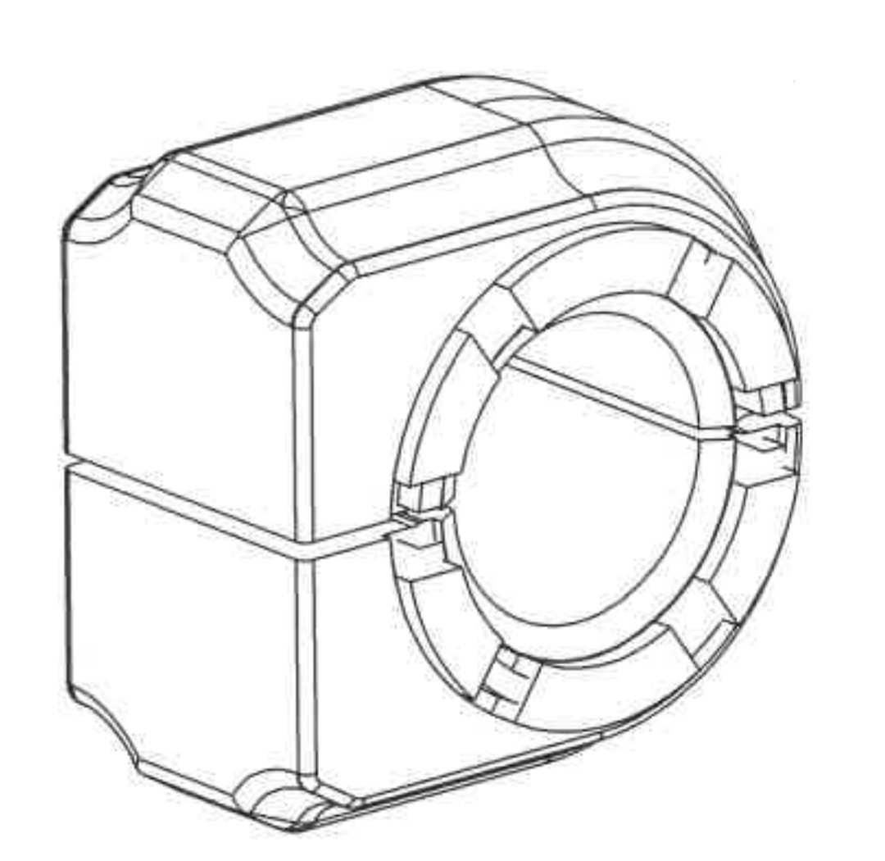

原图位置/视图名称：第 1 页右上区域，三维外观视图，bbox `[4300, 750, 1080, 1050]`。

边界归属说明：裁切范围完整包含零件三维轮廓，右侧坐标轴已单独裁为 object_5，本对象不提取坐标轴信息。该视图未标注尺寸线或尺寸文字。

| 提取项 | 原图数值或文本 | 含义说明 |
|---|---|---|
| 三维外观 | 无尺寸文字 | 用于显示零件立体外形、圆孔、外侧肋/槽及端部结构；与技术要求第 3 条“未注尺寸参照3D”相关。 |

## object_5 坐标轴局部视图

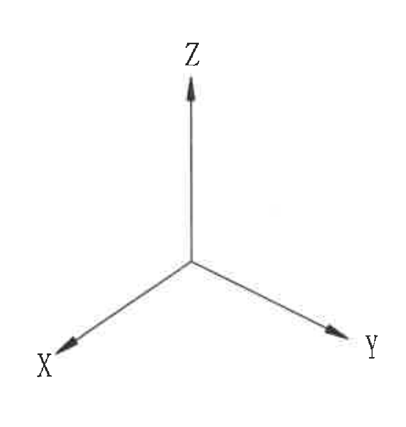

原图位置/视图名称：第 1 页右上区域，坐标轴局部视图，bbox `[5360, 820, 790, 830]`。

边界归属说明：裁切范围完整包含 `X`、`Y`、`Z` 三个坐标箭头及文字，未带入 object_4 三维外观视图轮廓。

| 提取项 | 原图数值或文本 | 含义说明 |
|---|---|---|
| X 轴 | `X` | 坐标方向，箭头指向左下。 |
| Y 轴 | `Y` | 坐标方向，箭头指向右下。 |
| Z 轴 | `Z` | 坐标方向，箭头向上。 |

## object_6 修订履历表

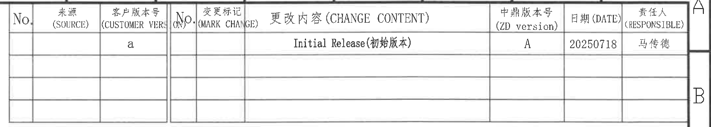

原图位置/视图名称：第 1 页上方中右区域，修订履历表，bbox `[3525, 205, 2890, 520]`。

边界归属说明：裁切范围完整包含修订表全部列、首条记录和空白记录行；右侧可见图框分区字母 `A/B`，属于图框坐标，不作为修订表字段提取。

原表格还原：

| No. | 来源 (SOURCE) | 客户版本号 (CUSTOMER VER.) | No. | 变更标记 (MARK CHANGE) | 更改内容 (CHANGE CONTENT) | 中鼎版本号 (ZD version) | 日期 (DATE) | 责任人 (RESPONSIBLE) |
|---|---|---|---|---|---|---|---|---|
|  |  | `a` |  |  | `Initial Release(初始版本)` | `A` | `20250718` | `马传德` |
|  |  |  |  |  |  |  |  |  |
|  |  |  |  |  |  |  |  |  |
|  |  |  |  |  |  |  |  |  |

| 提取项 | 原图数值或文本 | 含义说明 |
|---|---|---|
| 客户版本号 | `a` | 客户版本栏记录为 `a`。 |
| 更改内容 | `Initial Release(初始版本)` | 初始发布/初始版本记录。 |
| 中鼎版本号 | `A` | 中鼎版本号为 `A`。 |
| 日期 | `20250718` | 修订日期为 2025-07-18。 |
| 责任人 | `马传德` | 该修订记录责任人。 |

## object_7 规格/Variant 参数表

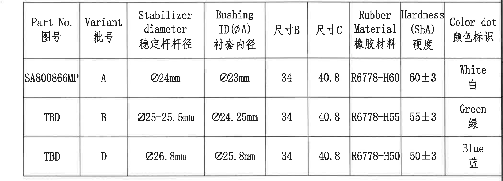

原图位置/视图名称：第 1 页右中区域，规格/Variant 参数表，bbox `[3540, 1900, 2795, 1010]`。

边界归属说明：裁切范围完整包含规格表表头与三行数据，未带入右侧图框分区字母。表中 `ØA` 对应 object_1 的 `ØA±0.3`，`尺寸B`、`尺寸C` 对应 object_3 的 `(B)`、`(C)`。

原表格还原：

| Part No. 图号 | Variant 批号 | Stabilizer diameter 稳定杆杆径 | Bushing ID(ØA) 衬套内径 | 尺寸B | 尺寸C | Rubber Material 橡胶材料 | Hardness (ShA) 硬度 | Color dot 颜色标识 |
|---|---|---|---|---|---|---|---|---|
| `SA800866MP` | `A` | `Ø24mm` | `Ø23mm` | `34` | `40.8` | `R6778-H60` | `60±3` | `White 白` |
| `TBD` | `B` | `Ø25-25.5mm` | `Ø24.25mm` | `34` | `40.8` | `R6778-H55` | `55±3` | `Green 绿` |
| `TBD` | `D` | `Ø26.8mm` | `Ø25.8mm` | `34` | `40.8` | `R6778-H50` | `50±3` | `Blue 蓝` |

| 提取项 | 原图数值或文本 | 含义说明 |
|---|---|---|
| Variant A 内径 | `ØA = Ø23mm` | 对应 object_1 的 `ØA±0.3`，适用于 Part No. `SA800866MP`、稳定杆杆径 `Ø24mm`。 |
| Variant B 内径 | `ØA = Ø24.25mm` | 对应 object_1 的 `ØA±0.3`，稳定杆杆径范围 `Ø25-25.5mm`。 |
| Variant D 内径 | `ØA = Ø25.8mm` | 对应 object_1 的 `ØA±0.3`，稳定杆杆径 `Ø26.8mm`。 |
| 尺寸 B | `34` | 对应 object_3 A-A 剖面参考尺寸 `(B)`。 |
| 尺寸 C | `40.8` | 对应 object_3 A-A 剖面参考尺寸 `(C)`。 |
| 硬度 | `60±3` / `55±3` / `50±3` | 分别对应 Variant A/B/D 的橡胶硬度，单位 ShA。 |
| 颜色点 | `White 白` / `Green 绿` / `Blue 蓝` | 对应 object_1 的颜色点标识。 |

## object_8 BOM 表

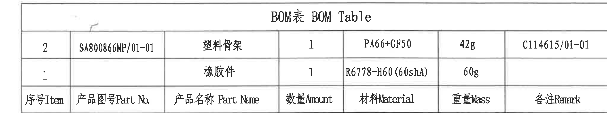

原图位置/视图名称：第 1 页右下、标题栏上方，BOM 表，bbox `[3565, 3135, 2715, 510]`。

边界归属说明：裁切范围完整包含 `BOM表 BOM Table` 标题、两行物料记录和表头行；下方标题栏已作为 object_9 单独裁切，未将标题栏字段归入 BOM 表。

原表格还原：

| 序号 Item | 产品图号 Part No. | 产品名称 Part Name | 数量 Amount | 材料 Material | 重量 Mass | 备注 Remark |
|---|---|---|---|---|---|---|
| `2` | `SA800866MP/01-01` | `塑料骨架` | `1` | `PA66+GF50` | `42g` | `C114615/01-01` |
| `1` |  | `橡胶件` | `1` | `R6778-H60(60shA)` | `60g` |  |

| 提取项 | 原图数值或文本 | 含义说明 |
|---|---|---|
| BOM 标题 | `BOM表 BOM Table` | 物料明细表标题。 |
| Item 2 | `SA800866MP/01-01 / 塑料骨架 / 1 / PA66+GF50 / 42g / C114615/01-01` | 塑料骨架组件，数量 1，材料 PA66+GF50，重量 42g，备注/关联号为 C114615/01-01。 |
| Item 1 | `橡胶件 / 1 / R6778-H60(60shA) / 60g` | 橡胶件，数量 1，材料 R6778-H60，硬度标注 60shA，重量 60g。 |

## object_9 标题栏

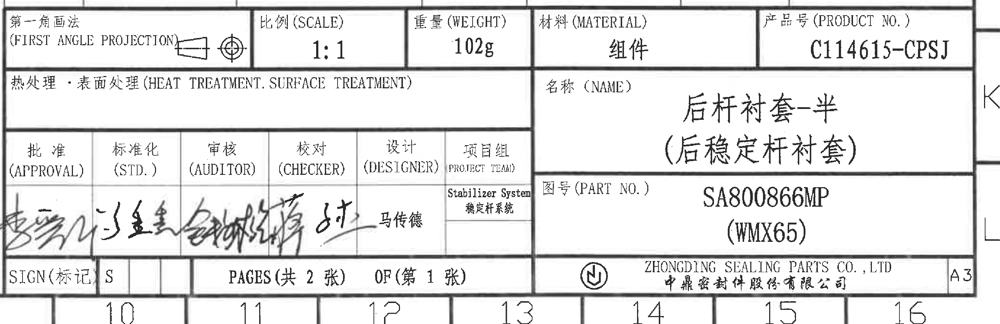

原图位置/视图名称：第 1 页右下标题栏，bbox `[3650, 3625, 2755, 895]`。

边界归属说明：裁切范围完整包含标题栏主要字段、签字栏、页码栏、公司栏和 A3 标识。右侧/底部可见图框坐标字母或数字属于图框，不作为标题栏字段提取。上方 BOM 表已作为 object_8 单独裁切。

原标题栏字段还原：

| 字段 | 原图数值或文本 |
|---|---|
| 第一角画法 | `第一角画法 (FIRST ANGLE PROJECTION)`，带投影视图符号 |
| 比例 (SCALE) | `1:1` |
| 重量 (WEIGHT) | `102g` |
| 材料 (MATERIAL) | `组件` |
| 产品号 (PRODUCT NO.) | `C114615-CPSJ` |
| 热处理·表面处理 (HEAT TREATMENT. SURFACE TREATMENT) | 空白 |
| 名称 (NAME) | `后杆衬套-半` / `(后稳定杆衬套)` |
| 图号 (PART NO.) | `SA800866MP` / `(WMX65)` |
| 批准 (APPROVAL) | 手写签名 |
| 标准化 (STD.) | 手写签名/标记 |
| 审核 (AUDITOR) | 手写签名 |
| 校对 (CHECKER) | 手写签名 |
| 设计 (DESIGNER) | `马传德` |
| 项目组 (PROJECT TEAM) | `Stabilizer System 稳定杆系统` |
| SIGN(标记) | `S` |
| 页码 | `PAGES(共 2 张) OF(第 1 张)` |
| 公司 | `ZHONGDING SEALING PARTS CO., LTD` / `中鼎密封件股份有限公司` |
| 图幅 | `A3` |

| 提取项 | 原图数值或文本 | 含义说明 |
|---|---|---|
| 产品名称 | `后杆衬套-半 (后稳定杆衬套)` | 图样标题/零件名称。 |
| 产品号 | `C114615-CPSJ` | 标题栏产品号。 |
| 图号 | `SA800866MP (WMX65)` | 标题栏图号/零件号。 |
| 比例 | `1:1` | 图样绘制比例。 |
| 重量 | `102g` | 组件总重量。 |
| 材料 | `组件` | 标题栏材料字段为组件。 |
| 投影法 | `FIRST ANGLE PROJECTION` | 第一角画法。 |
| 页码 | `共 2 张，第 1 张` | 当前图为第 1 张，共 2 张。 |

## object_10 技术要求 / NOTES

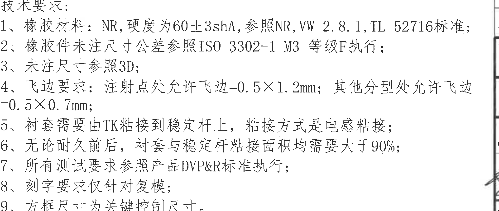

原图位置/视图名称：第 1 页下方中左区域，技术要求/NOTES，bbox `[1580, 3490, 2100, 890]`。

边界归属说明：裁切范围完整包含技术要求标题和第 1-9 条文字；左下基准尺寸表与右侧标题栏均已单独裁切，不将其表格内容归入 NOTES。

| 提取项 | 原图数值或文本 | 含义说明 |
|---|---|---|
| 技术要求 1 | `橡胶材料：NR, 硬度为60±3shA, 参照NR, VW 2.8.1, TL 52716标准;` | 指定橡胶材料 NR、硬度 60±3shA，并引用 NR、VW 2.8.1、TL 52716 标准。 |
| 技术要求 2 | `橡胶件未注尺寸公差参照ISO 3302-1 M3 等级F执行;` | 未注尺寸公差按 ISO 3302-1 M3 等级 F 执行。 |
| 技术要求 3 | `未注尺寸参照3D;` | 未在二维图中标注的尺寸参考三维数据。 |
| 技术要求 4 | `飞边要求：注射点处允许飞边=0.5×1.2mm; 其他分型处允许飞边=0.5×0.7mm;` | 注射点和其他分型处允许飞边尺寸不同。 |
| 技术要求 5 | `衬套需要由TK粘接到稳定杆上，粘接方式是电感粘接;` | 衬套与稳定杆需粘接，方式为电感粘接。 |
| 技术要求 6 | `无论耐久前后，衬套与稳定杆粘接面积均需要大于90%;` | 粘接面积要求大于 90%，耐久前后均适用。 |
| 技术要求 7 | `所有测试要求参照产品DVP&R标准执行;` | 测试要求按产品 DVP&R 标准执行。 |
| 技术要求 8 | `刻字要求仅针对复模;` | 刻字要求只针对复模。 |
| 技术要求 9 | `方框尺寸为关键控制尺寸。` | 解释 object_1 的 `27±0.4` 和 object_2 的 `31±0.5` 等方框尺寸为关键控制尺寸。 |

## object_11 基准尺寸公差表

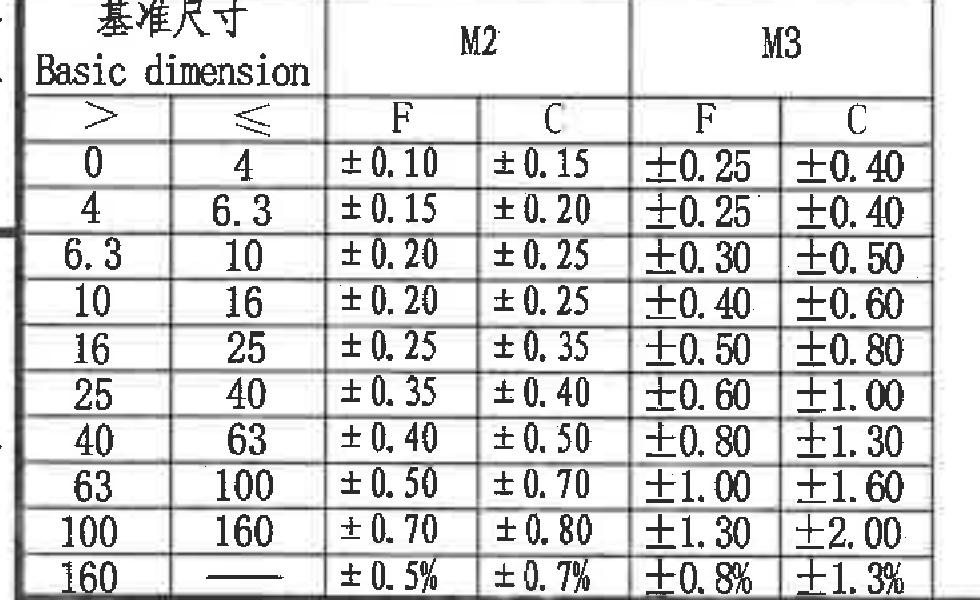

原图位置/视图名称：第 1 页左下角，DIN ISO 3302-1:1999-10 基准尺寸公差表，bbox `[460, 3835, 980, 600]`。

边界归属说明：裁切范围完整包含表题、所有表头、全部公差行列和边框；未带入技术要求正文或标题栏。

原表格还原：

| Basic dimension 基准尺寸 | M2 F | M2 C | M3 F | M3 C |
|---|---|---|---|---|
| `>0 ≤4` | `±0.10` | `±0.15` | `±0.25` | `±0.40` |
| `>4 ≤6.3` | `±0.15` | `±0.20` | `±0.25` | `±0.40` |
| `>6.3 ≤10` | `±0.20` | `±0.25` | `±0.30` | `±0.50` |
| `>10 ≤16` | `±0.20` | `±0.25` | `±0.40` | `±0.60` |
| `>16 ≤25` | `±0.25` | `±0.35` | `±0.50` | `±0.80` |
| `>25 ≤40` | `±0.35` | `±0.40` | `±0.60` | `±1.00` |
| `>40 ≤63` | `±0.40` | `±0.50` | `±0.80` | `±1.30` |
| `>63 ≤100` | `±0.50` | `±0.70` | `±1.00` | `±1.60` |
| `>100 ≤160` | `±0.70` | `±0.80` | `±1.30` | `±2.00` |
| `>160` | `±0.5%` | `±0.7%` | `±0.8%` | `±1.3%` |

| 提取项 | 原图数值或文本 | 含义说明 |
|---|---|---|
| 标准 | `DIN ISO 3302-1:1999-10` | 橡胶件尺寸公差参考表。 |
| M3 F 适用说明 | `ISO 3302-1 M3 等级F` | 与 object_10 技术要求第 2 条对应，未注尺寸公差按 M3 F 执行。 |
| M3 F 公差范围 | `±0.25` 至 `±1.30`，`>160` 为 `±0.8%` | M3 等级 F 在各基准尺寸区间下的公差值。 |

## 裁切检查记录

| 对象 | 图片路径 | 完整性检查 | 边界归属检查 |
|---|---|---|---|
| page_1 | `outputs/20C114615_assets/images/page_1.png` | 整页渲染完整，尺寸 `6612 x 4673 px`。 | 作为所有对象裁切来源。 |
| object_1 | `outputs/20C114615_assets/images/object_1.png` | 完整包含主视图尺寸线、箭头、标注文字和颜色点说明。 | A-A 剖切箭头属于主视图内剖切标记；未提取剖面图尺寸。 |
| object_2 | `outputs/20C114615_assets/images/object_2.png` | 完整包含 `31±0.5`、`35±0.5` 两条尺寸线和文字。 | 未带入主视图或 A-A 剖面图。 |
| object_3 | `outputs/20C114615_assets/images/object_3.png` | 完整包含 `(B)`、`(C)` 参考尺寸线、箭头和 `A-A` 文字。 | `(B)`、`(C)` 仅归属 A-A 剖面。 |
| object_4 | `outputs/20C114615_assets/images/object_4.png` | 三维视图轮廓完整，无尺寸标注。 | 坐标轴已另裁为 object_5。 |
| object_5 | `outputs/20C114615_assets/images/object_5.png` | 完整包含 X/Y/Z 箭头和文字。 | 未带入三维外观视图。 |
| object_6 | `outputs/20C114615_assets/images/object_6.png` | 修订表列、记录和责任人文字完整。 | 右侧图框字母 A/B 为边框坐标，未作为表字段提取。 |
| object_7 | `outputs/20C114615_assets/images/object_7.png` | 规格表表头和三行数据完整。 | 未带入右侧图框分区字母。 |
| object_8 | `outputs/20C114615_assets/images/object_8.png` | BOM 标题、两行物料记录和表头行完整。 | 下方标题栏已分离为 object_9。 |
| object_9 | `outputs/20C114615_assets/images/object_9.png` | 标题栏字段、签字栏、公司栏、A3 标识完整。 | 底部/右侧图框坐标数字和字母不是标题栏字段，未提取；上方 BOM 另归 object_8。 |
| object_10 | `outputs/20C114615_assets/images/object_10.png` | 技术要求第 1-9 条文字完整。 | 左下公差表和右下标题栏均另裁，未混入 NOTES 提取。 |
| object_11 | `outputs/20C114615_assets/images/object_11.png` | 基准尺寸表表头、所有区间和公差值完整。 | 未带入 NOTES 正文或标题栏。 |
