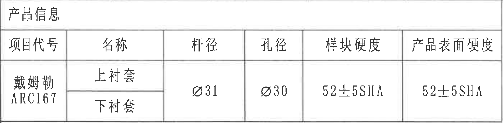
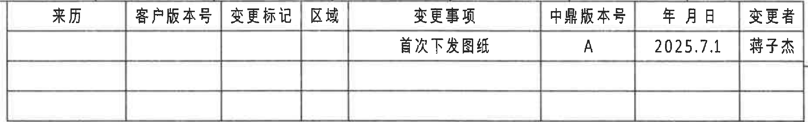
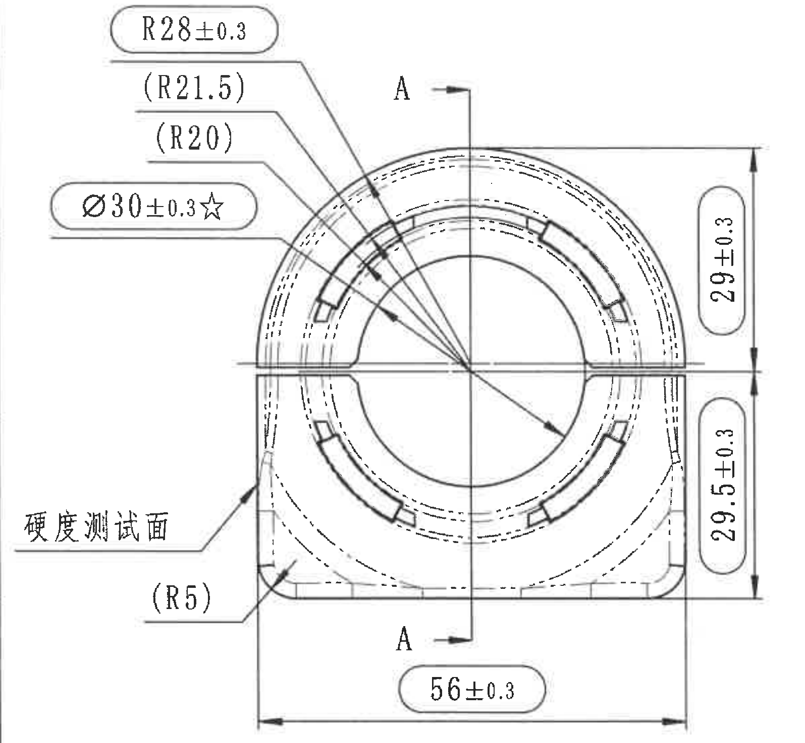
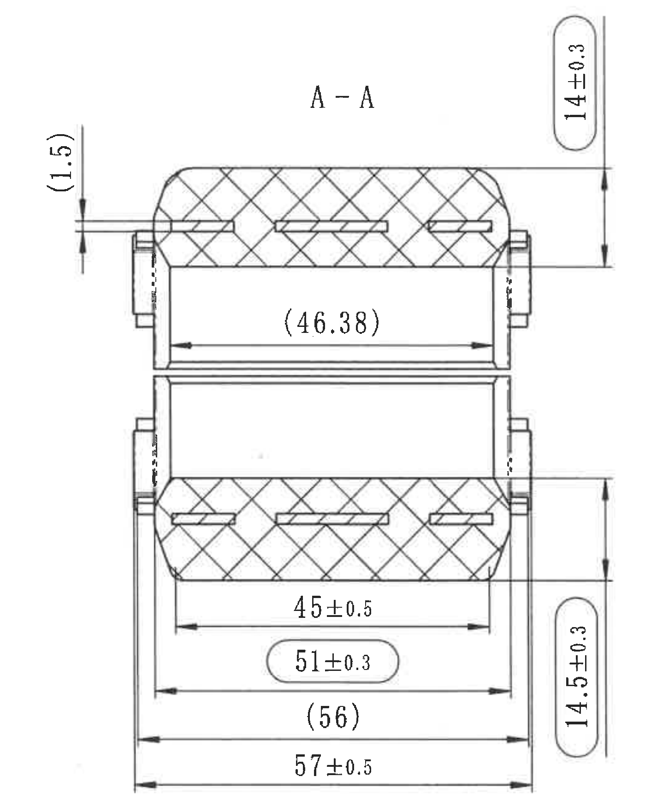
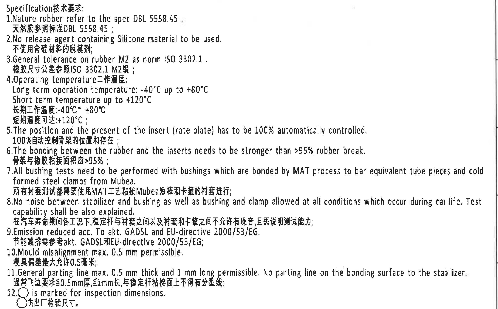
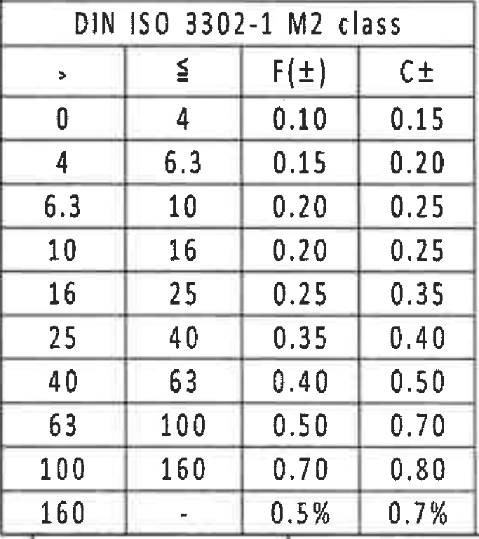
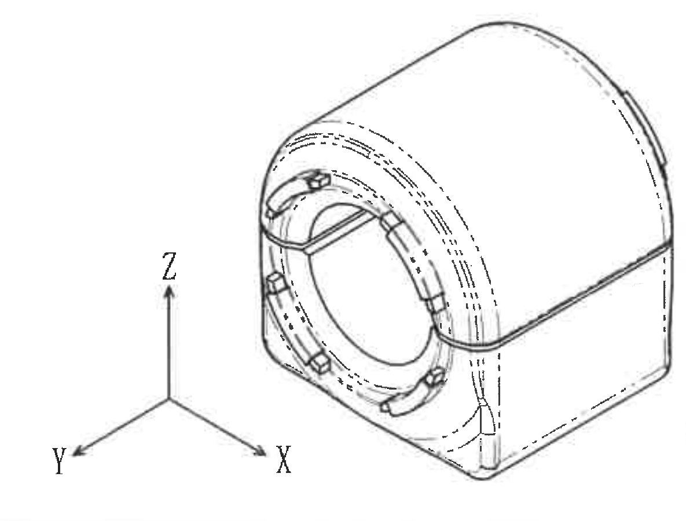
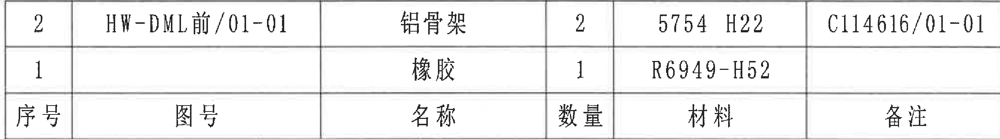
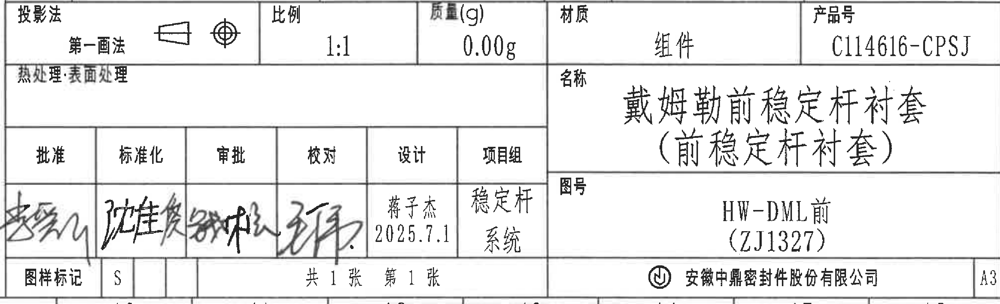

# 20C114616 PDF 内容识别结果

整页渲染图：`outputs/20C114616_assets/images/page_1.png`，尺寸 `6612 x 4673`，bbox `[0, 0, 6612, 4673]`。本页未见单独标注的局部 Detail 视图；已按原图结构分别裁切产品信息表、修订履历表、主视图、A-A 剖视图、Specification/技术要求、DIN ISO 公差表、三维参考视图、明细表和标题栏。

## object_1 产品信息表

原图位置/视图名称：页 1 左上产品信息表，bbox `[511, 206, 2373, 665]`。

原表标题：产品信息。原图中“项目代号”“杆径”“孔径”“样块硬度”“产品表面硬度”为跨两行含义。

| 项目代号 | 名称 | 杆径 | 孔径 | 样块硬度 | 产品表面硬度 |
|---|---|---|---|---|---|
| 戴姆勒 / ARC167 | 上衬套 | Ø31 | Ø30 | 52±5SHA | 52±5SHA |
| （同上） | 下衬套 | Ø31 | Ø30 | 52±5SHA | 52±5SHA |

| 提取项 | 原图数值或文本 | 含义说明 |
|---|---|---|
| 项目代号 | 戴姆勒 / ARC167 | 对应本产品项目来源或项目代码。 |
| 名称 | 上衬套、下衬套 | 同一产品信息表列出上下衬套。 |
| 杆径 | Ø31 | 与稳定杆配合的杆径字段，直径符号 Ø 保留。 |
| 孔径 | Ø30 | 衬套孔径字段，直径符号 Ø 保留。 |
| 样块硬度 | 52±5SHA | 样块硬度，邵氏 A 硬度范围。 |
| 产品表面硬度 | 52±5SHA | 产品表面硬度，邵氏 A 硬度范围。 |

边界归属说明：裁切框只包含左上产品信息表，未包含主视图或页面坐标格；表格外框、标题行、表头和两行名称均完整。

## object_2 修订履历表

原图位置/视图名称：页 1 右上修订履历/变更表，bbox `[3901, 202, 6377, 577]`。

| 来历 | 客户版本号 | 变更标记 | 区域 | 变更事项 | 中鼎版本号 | 年月日 | 变更者 |
|---|---|---|---|---|---|---|---|
|  |  |  |  | 首次下发图纸 | A | 2025.7.1 | 蒋子杰 |
|  |  |  |  |  |  |  |  |
|  |  |  |  |  |  |  |  |

| 提取项 | 原图数值或文本 | 含义说明 |
|---|---|---|
| 表头 | 来历、客户版本号、变更标记、区域、变更事项、中鼎版本号、年月日、变更者 | 原表修订履历字段。 |
| 变更事项 | 首次下发图纸 | 表示该版本为首次下发。 |
| 中鼎版本号 | A | 当前中鼎版本。 |
| 年月日 | 2025.7.1 | 变更记录日期。 |
| 变更者 | 蒋子杰 | 变更记录责任人。 |

边界归属说明：裁切框覆盖完整修订表三条记录行；未带入右侧图框字母或其它表格。

## object_3 主视图

原图位置/视图名称：页 1 中左主视图，bbox `[520, 1040, 2115, 2515]`。

| 提取项 | 原图数值或文本 | 含义说明 |
|---|---|---|
| 半径/弧度 | R28±0.3 | 上部外轮廓半径，带 ±0.3 公差，并以检验尺寸框标示。 |
| 参考半径 | (R21.5) | 括号内参考半径，用于说明相关内外圆弧位置关系，不作为直接制造控制尺寸。 |
| 参考半径 | (R20) | 括号内参考半径，用于说明内侧圆弧位置关系，不作为直接制造控制尺寸。 |
| 关键直径 | Ø30±0.3☆ | 孔径/内圆直径，带 ±0.3 公差和星号关键标记；直径符号 Ø 与星号均保留。 |
| 文字标注 | 硬度测试面 | 引线指向左下侧表面，说明该处为硬度测试面。 |
| 参考半径 | (R5) | 左下圆角/过渡处参考半径，括号表示参考尺寸。 |
| 上侧高度 | 29±0.3 | 右侧上半段垂直尺寸，从中心水平线到上侧轮廓位置。 |
| 下侧高度 | 29.5±0.3 | 右侧下半段垂直尺寸，从中心水平线到底部轮廓位置。 |
| 底部总宽 | 56±0.3 | 主视图底部横向总宽尺寸，带 ±0.3 公差。 |
| 剖切基准字母 | A、A | 主视图中部竖向剖切线及上下箭头，指示 A-A 剖视图位置和方向。 |
| 角度/T 编号 | 未见 | 当前主视图未见角度标注或 T 编号。 |
| 总高度 | 未见单独总高度标注 | 原图以 29±0.3 与 29.5±0.3 两段垂直尺寸表达，不把两者相加改写成原图尺寸。 |

边界归属说明：主视图左侧“硬度测试面”文字、左上半径引线、右侧两段高度尺寸和底部 56±0.3 尺寸线均完整；右侧边界未带入 A-A 剖视图内容。A-A 字母在本图中作为剖切标记，不把剖视图内尺寸归入主视图。

## object_4 A-A 剖视图

原图位置/视图名称：页 1 中部 A-A 剖视图，bbox `[2140, 970, 3565, 2705]`。

| 提取项 | 原图数值或文本 | 含义说明 |
|---|---|---|
| 剖视名称 | A-A | 与主视图剖切线 A-A 对应。 |
| 参考尺寸 | (1.5) | 左上竖向参考尺寸，括号表示参考；尺寸线和箭头属于 A-A 剖视图左上局部。 |
| 上部厚度/高度 | 14±0.3 | 右上竖向尺寸，控制上部剖面高度/厚度，带 ±0.3 公差。 |
| 参考长度 | (46.38) | 上半内部横向参考长度，括号表示参考尺寸。 |
| 下部内长 | 45±0.5 | 下部剖面内部横向尺寸，带 ±0.5 公差。 |
| 检验/控制长度 | 51±0.3 | 下部横向尺寸，带 ±0.3 公差，并以检验尺寸框标示。 |
| 参考总长 | (56) | 下部外侧横向参考尺寸，括号表示参考。 |
| 外侧总长 | 57±0.5 | 剖视图底部最大横向总尺寸，带 ±0.5 公差。 |
| 下部厚度/高度 | 14.5±0.3 | 右下竖向尺寸，控制下部剖面高度/厚度，带 ±0.3 公差。 |
| 材料/结构表现 | 交叉剖面线与嵌件 | 交叉剖面线表示橡胶剖切区域，内部长条和侧部结构表示嵌件/骨架位置。 |
| 角度/T 编号 | 未见 | 当前 A-A 剖视图未见角度标注或 T 编号。 |

边界归属说明：裁切框保留 A-A 剖视图完整外形、(1.5) 参考尺寸、右侧 14±0.3 与 14.5±0.3、底部所有横向尺寸线和箭头。左侧靠近主视图边界处只按 A-A 的 (1.5) 尺寸归属提取，不把主视图尺寸归入剖视图。

## object_5 Specification 技术要求 / NOTES

原图位置/视图名称：页 1 右中 Specification 技术要求，bbox `[3685, 1550, 6380, 3225]`。

| 提取项 | 原图数值或文本 | 含义说明 |
|---|---|---|
| 标题 | Specification技术要求: | 技术要求/NOTES 标题。 |
| 1 | Nature rubber refer to the spec DBL 5558.45 . / 天然胶参照标准DBL 5558.45； | 天然胶材料依据 DBL 5558.45。 |
| 2 | No release agent containing Silicone material to be used. / 不使用含硅材料的脱模剂; | 禁用含硅脱模剂。 |
| 3 | General tolerance on rubber M2 as norm ISO 3302.1 . / 橡胶尺寸公差参照ISO 3302.1 M2级； | 橡胶件通用公差按 ISO 3302.1 M2。 |
| 4 | Operating temperature工作温度: Long term operation temperature: -40°C up to +80°C; Short term temperature up to +120°C / 长期工作温度:-40°C~ +80°C; 短期温度可达:+120°C; | 规定长期和短期工作温度范围。 |
| 5 | The position and the present of the insert (rate plate) has to be 100% automatically controlled. / 100%自动控制骨架的位置和存在； | 骨架/嵌件位置和存在需 100% 自动控制。 |
| 6 | The bonding between the rubber and the inserts needs to be stronger than >95% rubber break. / 骨架与橡胶粘接面积应>95%； | 橡胶与嵌件粘接强度要求。 |
| 7 | All bushing tests need to be performed with bushings which are bonded by MAT process to bar equivalent tube pieces and cold formed steel clamps from Mubea. / 所有衬套测试都需要使用MAT工艺粘接Mubea短棒和卡箍的衬套进行; | 衬套测试样件和工艺要求。 |
| 8 | No noise between stabilizer and bushing as well as bushing and clamp allowed at all conditions which occur during car life. Test capability shall be also explained. / 在汽车寿命期间各工况下,稳定杆与衬套之间以及衬套和卡箍之间不允许有噪音,且需说明测试能力; | 全寿命工况噪声要求及测试能力说明。 |
| 9 | Emission reduced acc. To akt. GADSL and EU-directive 2000/53/EG. / 节能减排需参考akt. GADSL和EU-directive 2000/53/EG; | 排放/环保要求依据。 |
| 10 | Mould misalignment max. 0.5 mm permissible. / 模具偏差最大允许0.5毫米; | 模具错位最大允许值。 |
| 11 | General parting line max. 0.5 mm thick and 1 mm long permissible. No parting line on the bonding surface to the stabilizer. / 通常飞边要求≤0.5mm厚,≤1mm长,与稳定杆粘接面上不得有分型线; | 飞边和分型线限制。 |
| 12 | ○ is marked for inspection dimensions. / ○为出厂检验尺寸。 | 图中带圆/框标记的尺寸为出厂检验尺寸。 |

边界归属说明：裁切框完整包含 NOTES 第 1 至第 12 条及右侧图框边线；未带入下方明细表或标题栏。

## object_6 DIN ISO 3302-1 M2 class 公差表

原图位置/视图名称：页 1 左下 DIN ISO 3302-1 M2 class 表，bbox `[522, 3677, 1205, 4445]`。

| > | ≤ | F(±) | C± |
|---:|---:|---:|---:|
| 0 | 4 | 0.10 | 0.15 |
| 4 | 6.3 | 0.15 | 0.20 |
| 6.3 | 10 | 0.20 | 0.25 |
| 10 | 16 | 0.20 | 0.25 |
| 16 | 25 | 0.25 | 0.35 |
| 25 | 40 | 0.35 | 0.40 |
| 40 | 63 | 0.40 | 0.50 |
| 63 | 100 | 0.50 | 0.70 |
| 100 | 160 | 0.70 | 0.80 |
| 160 | - | 0.5% | 0.7% |

| 提取项 | 原图数值或文本 | 含义说明 |
|---|---|---|
| 表题 | DIN ISO 3302-1 M2 class | 橡胶件 M2 级通用公差表。 |
| 列 | >、≤、F(±)、C± | 尺寸区间和对应 F/C 公差列。 |
| 数据行 | 0-4 到 160 以上 | 按原表逐行还原。 |

边界归属说明：裁切框完整包含表题、表头和 10 行公差数据；未包含左侧/底部图框编号。

## object_7 三维参考视图

原图位置/视图名称：页 1 底部中间三维参考视图，bbox `[2460, 3520, 3645, 4420]`。

| 提取项 | 原图数值或文本 | 含义说明 |
|---|---|---|
| 视图类型 | 三维等轴测参考视图 | 展示衬套外形、开口、嵌件/槽形结构和整体方向。 |
| 坐标轴 | X、Y、Z | 视图方向坐标，Z 轴向上，X/Y 轴位于底部。 |
| 尺寸 | 未见尺寸数值 | 该视图未标注尺寸、公差、参考尺寸或 T 编号。 |

边界归属说明：裁切框包含完整三维视图及 X/Y/Z 坐标轴；下边界避开标题栏表格，未把底部表格归入该视图。

## object_8 明细表 / BOM

原图位置/视图名称：页 1 右下明细表上半部，bbox `[3688, 3270, 6362, 3644]`。

原图表头位于底行，以下按视觉行序保留：

| 原图行序 | 序号 | 图号 | 名称 | 数量 | 材料 | 备注 |
|---|---|---|---|---|---|---|
| 第1行 | 2 | HW-DML前/01-01 | 铝骨架 | 2 | 5754 H22 | C114616/01-01 |
| 第2行 | 1 |  | 橡胶 | 1 | R6949-H52 |  |
| 第3行（表头） | 序号 | 图号 | 名称 | 数量 | 材料 | 备注 |

| 提取项 | 原图数值或文本 | 含义说明 |
|---|---|---|
| 序号 2 | HW-DML前/01-01；铝骨架；数量 2；材料 5754 H22；备注 C114616/01-01 | 铝骨架明细行。 |
| 序号 1 | 图号空白；橡胶；数量 1；材料 R6949-H52；备注空白 | 橡胶明细行。 |
| 表头 | 序号、图号、名称、数量、材料、备注 | 原图表头位于明细表底行。 |

边界归属说明：裁切框包含明细表完整三行及分隔线；下方标题栏另作为 object_9 裁切，不把标题栏字段并入明细表。

## object_9 标题栏

原图位置/视图名称：页 1 右下标题栏，bbox `[3688, 3640, 6370, 4458]`。

| 提取项 | 原图数值或文本 | 含义说明 |
|---|---|---|
| 投影法 | 第一画法 | 标题栏投影法字段，旁有投影符号。 |
| 比例 | 1:1 | 图纸比例。 |
| 质量(g) | 0.00g | 标题栏质量字段。 |
| 材质 | 组件 | 标题栏材质/类别字段。 |
| 产品号 | C114616-CPSJ | 产品号。 |
| 热处理·表面处理 | 空白 | 原图该栏未填写具体内容。 |
| 名称 | 戴姆勒前稳定杆衬套（前稳定杆衬套） | 图纸名称。 |
| 图号 | HW-DML前 (ZJ1327) | 图纸编号/型号字段。 |
| 批准 | 手写签名，无法可靠辨认 | 保留栏位，不臆造签名。 |
| 标准化 | 手写签名，无法可靠辨认 | 保留栏位，不臆造签名。 |
| 审批 | 手写签名，无法可靠辨认 | 保留栏位，不臆造签名。 |
| 校对 | 手写签名，无法可靠辨认 | 保留栏位，不臆造签名。 |
| 设计 | 蒋子杰 / 2025.7.1 | 设计栏签名和日期。 |
| 项目组 | 稳定杆 / 系统 | 项目组字段。 |
| 图样标记 | S | 图样标记字段。 |
| 页数 | 共 1 张 第 1 张 | 页数信息。 |
| 公司 | 安徽中鼎密封件股份有限公司 | 标题栏公司名称。 |
| 幅面 | A3 | 图幅。 |

边界归属说明：裁切框覆盖标题栏完整字段；顶部只保留与明细表相接的边界线，下方公司名、A3 幅面、页数和图样标记完整。

## 裁切检查记录

| 对象 | 图片路径 | 检查结果 |
|---|---|---|
| object_1 产品信息表 | outputs/20C114616_assets/images/object_1.png | 完整包含表格外框、标题、表头和数据文字；无边缘文字截断；未混入其它视图。 |
| object_2 修订履历表 | outputs/20C114616_assets/images/object_2.png | 完整包含表头、首条记录和空白记录行；无截字；未混入图框字母或其它表格。 |
| object_3 主视图 | outputs/20C114616_assets/images/object_3.png | 完整包含 R28±0.3、(R21.5)、(R20)、Ø30±0.3☆、硬度测试面、(R5)、29±0.3、29.5±0.3、56±0.3 及 A-A 剖切标记；未带入剖视图尺寸。 |
| object_4 A-A 剖视图 | outputs/20C114616_assets/images/object_4.png | 完整包含 A-A、(1.5)、14±0.3、(46.38)、45±0.5、51±0.3、(56)、57±0.5、14.5±0.3 及尺寸线箭头；不把主视图尺寸归入剖视图。 |
| object_5 NOTES | outputs/20C114616_assets/images/object_5.png | 完整包含 Specification/技术要求第 1-12 条；长句右端未截断；未带入下方明细表或标题栏。 |
| object_6 DIN ISO 公差表 | outputs/20C114616_assets/images/object_6.png | 完整包含表题、表头和 10 行数据；无截字；未混入图框。 |
| object_7 三维参考视图 | outputs/20C114616_assets/images/object_7.png | 完整包含三维视图和 X/Y/Z 坐标轴；无尺寸文字被裁；未带入标题栏。 |
| object_8 明细表 | outputs/20C114616_assets/images/object_8.png | 完整包含两条明细行和底部表头行；未带入标题栏字段。 |
| object_9 标题栏 | outputs/20C114616_assets/images/object_9.png | 完整包含标题栏字段、签名栏、图号、名称、产品号、公司名、页数和 A3 幅面；未把明细表数据并入标题栏。 |
