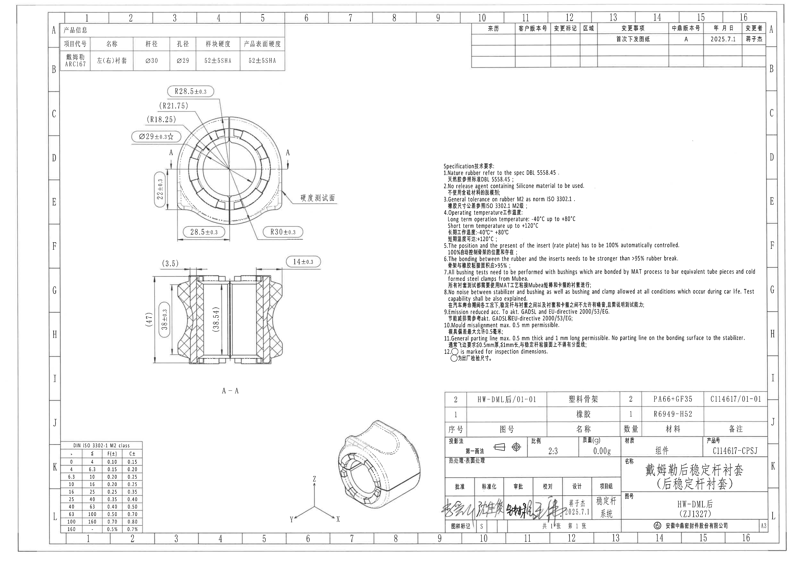
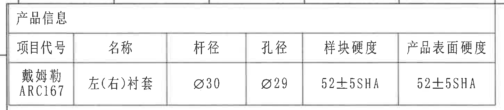
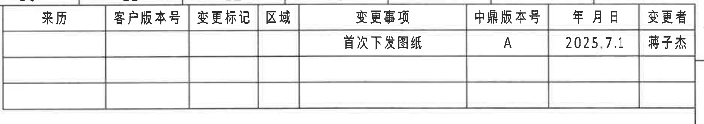
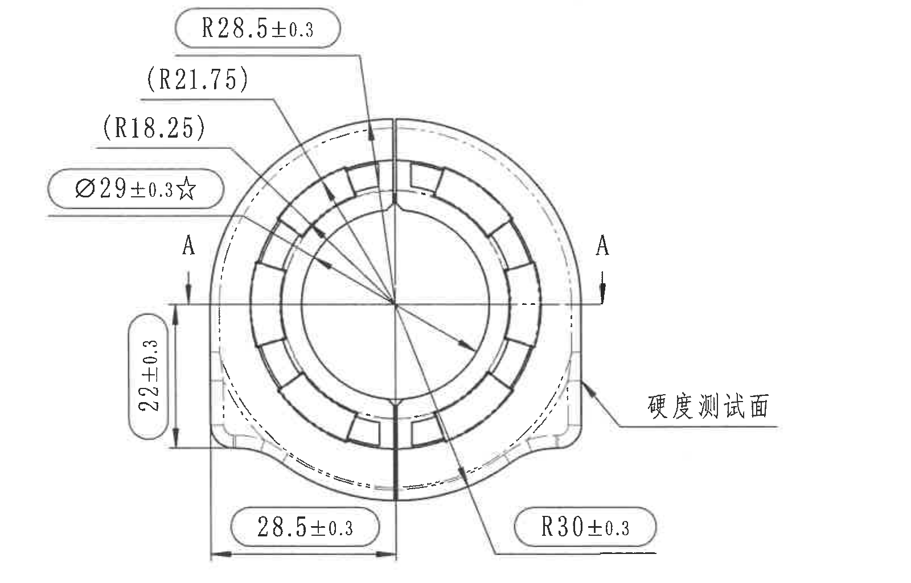
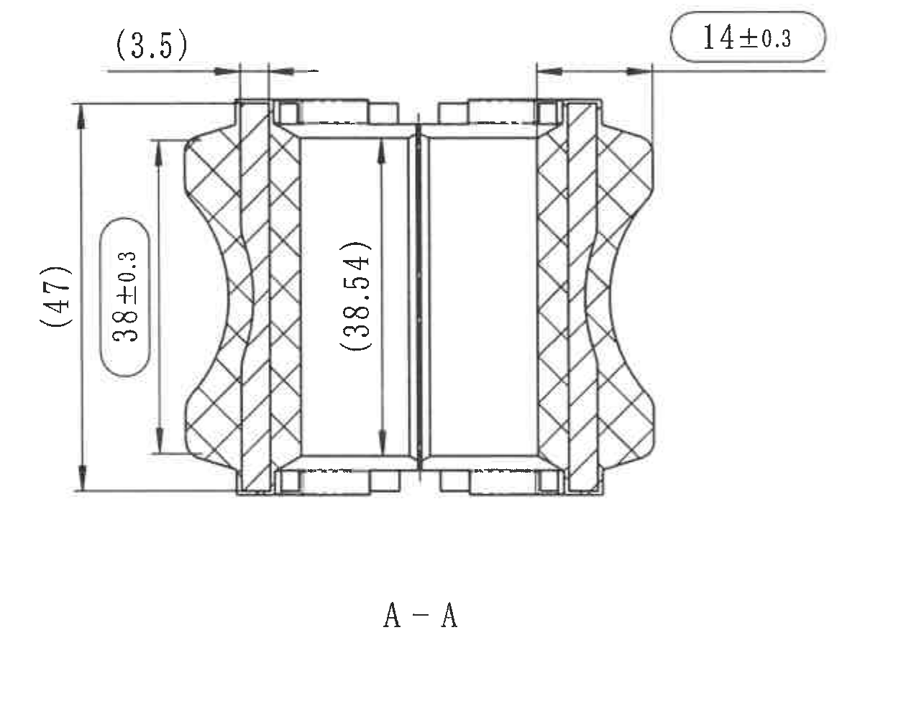
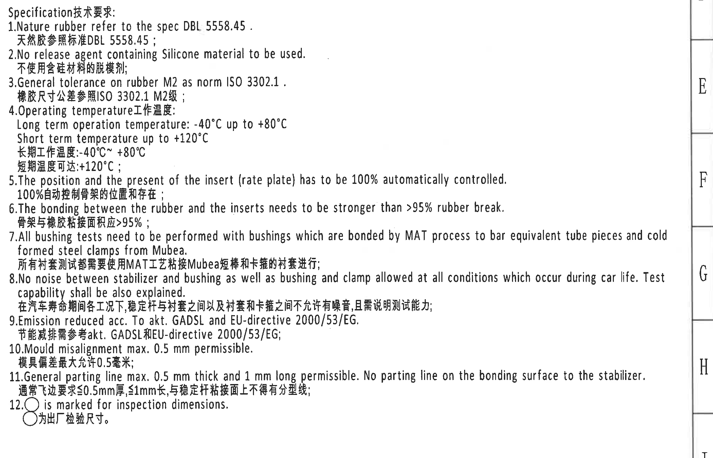
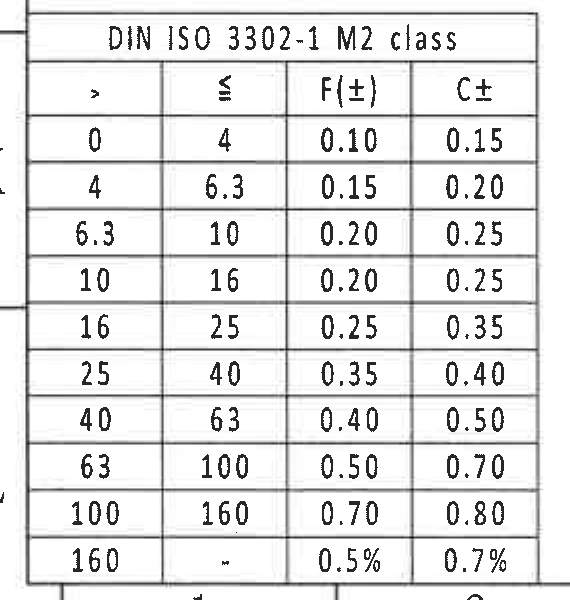
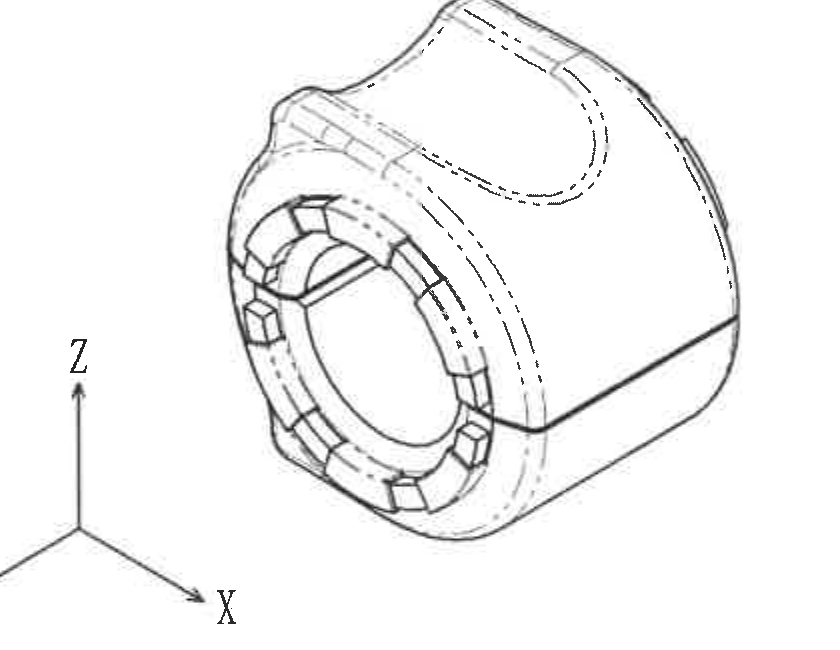
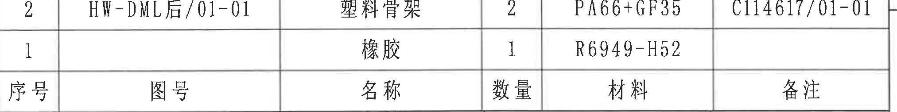
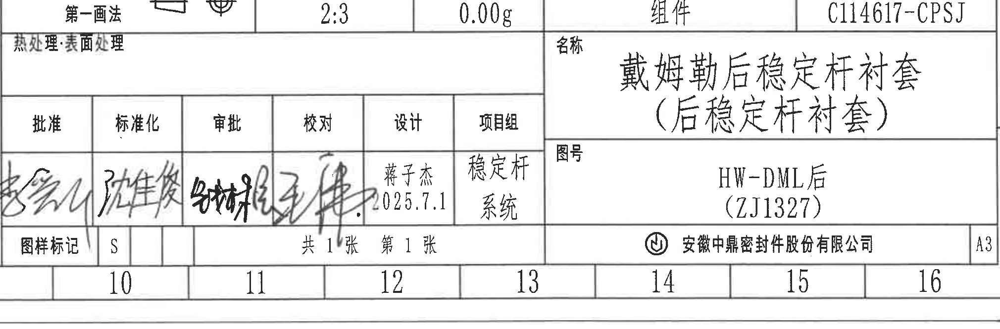

# 20C114617 内容识别

## 整页渲染

| 提取项 | 原图数值或文本 | 含义说明 |
|---|---|---|
| 页面 | 1 | PDF 渲染为整页 PNG。 |
| 整页图像 | `outputs/20C114617_assets/images/page_1.png` | 页面尺寸 4959 x 3505 px。 |

边界归属说明：整页图包含完整图框、视图、表格、NOTES 和标题栏；后续对象均从该整页 PNG 裁切。

## object_1 产品信息表

原图位置/视图名称：页面左上角，产品信息表，bbox `[350, 135, 1800, 455]`。

原表还原：

| 产品信息 |  |  |  |  |  |
|---|---|---|---|---|---|
| 项目代号 | 名称 | 杆径 | 孔径 | 样块硬度 | 产品表面硬度 |
| 戴姆勒 ARC167 | 左(右)衬套 | Ø30 | Ø29 | 52±5SHA | 52±5SHA |

| 提取项 | 原图数值或文本 | 含义说明 |
|---|---|---|
| 项目代号 | 戴姆勒 / ARC167 | 产品项目或客户项目代号。 |
| 名称 | 左(右)衬套 | 左、右通用或成对使用的衬套名称。 |
| 杆径 | Ø30 | 与稳定杆配合的杆径为直径 30。 |
| 孔径 | Ø29 | 衬套孔径为直径 29。 |
| 样块硬度 | 52±5SHA | 试样块 Shore A 硬度范围。 |
| 产品表面硬度 | 52±5SHA | 产品表面 Shore A 硬度范围。 |

边界归属说明：裁切仅覆盖产品信息表外框；顶部图框分区线未作为表格内容提取，周边未混入视图或其他表格字段。

## object_2 变更履历表

原图位置/视图名称：页面右上角，变更履历表，bbox `[2930, 130, 4795, 460]`。

原表还原：

| 来历 | 客户版本号 | 变更标记 | 区域 | 变更事项 | 中鼎版本号 | 年月日 | 变更者 |
|---|---|---|---|---|---|---|---|
|  |  |  |  | 首次下发图纸 | A | 2025.7.1 | 蒋子杰 |
|  |  |  |  |  |  |  |  |
|  |  |  |  |  |  |  |  |

| 提取项 | 原图数值或文本 | 含义说明 |
|---|---|---|
| 变更事项 | 首次下发图纸 | 本次为首次发图。 |
| 中鼎版本号 | A | 中鼎内部版本号为 A。 |
| 年月日 | 2025.7.1 | 变更或发图日期。 |
| 变更者 | 蒋子杰 | 变更执行人。 |
| 空白行 | 原表保留两行空白记录 | 原图中预留后续变更记录行。 |

边界归属说明：裁切保留完整表格外框和空白记录行；右侧图框坐标 A/B 已排除，不作为变更履历内容。

## object_3 主视图

原图位置/视图名称：页面左上至中左，圆形主加工视图，bbox `[735, 520, 2335, 1545]`。

| 提取项 | 原图数值或文本 | 含义说明 |
|---|---|---|
| 外侧上部半径 | R28.5±0.3 | 主视图上方外轮廓半径，带 ±0.3 公差。 |
| 参考半径 | (R21.75) | 括号内参考尺寸，表示对应内侧圆弧半径参考值，不作为单独控制公差；位于主视图左上引出线。 |
| 参考半径 | (R18.25) | 括号内参考尺寸，表示更内侧圆弧半径参考值；位于主视图左上引出线。 |
| 关键孔径 | Ø29±0.3☆ | 内孔直径 29，公差 ±0.3；带星号，为原图标出的关键/检验尺寸。 |
| 左侧竖向尺寸 | 22±0.3 | 主视图左下侧局部竖向高度或台阶间距，公差 ±0.3。 |
| 下方水平尺寸 | 28.5±0.3 | 下方从左侧边界到中心线的水平距离，公差 ±0.3。 |
| 右下半径 | R30±0.3 | 主视图右下外轮廓圆弧半径，公差 ±0.3。 |
| 剖切标识 | A / A | 水平中心线处左右两侧剖切箭头，指向剖面 A-A。 |
| 功能标注 | 硬度测试面 | 引出线指向右侧表面，说明该处为硬度测试面。 |

边界归属说明：主视图裁切完整包含上述尺寸线、箭头、文字、剖切 A/A 标识和硬度测试面引出线；底边已收至 `28.5±0.3` 与 `R30±0.3` 尺寸线下方，未把下方 A-A 剖视图的 `14±0.3` 等尺寸归入主视图。

## object_4 A-A 剖视图

原图位置/视图名称：页面左中部，A-A 剖视图，bbox `[850, 1580, 2110, 2560]`。

| 提取项 | 原图数值或文本 | 含义说明 |
|---|---|---|
| 参考厚度 | (3.5) | 顶部左侧括号内参考尺寸，表示局部台阶或唇边厚度参考值。 |
| 顶部水平尺寸 | 14±0.3 | 剖视图顶部右侧水平尺寸，公差 ±0.3。 |
| 总高度参考尺寸 | (47) | 左侧整体竖向参考高度，括号表示参考尺寸。 |
| 竖向控制尺寸 | 38±0.3 | 左侧内侧竖向高度控制尺寸，公差 ±0.3。 |
| 内部参考高度 | (38.54) | 剖视图中部括号内参考高度，位于内腔竖向尺寸线上。 |
| 视图名 | A-A | 表示该剖面由主视图 A-A 剖切线生成。 |
| 剖面线 | 交叉剖面线 | 表示被剖切材料区域；尺寸均归属于本 A-A 剖视图。 |

边界归属说明：裁切完整包含剖视图主体、上下尺寸线、箭头、括号参考尺寸和 `A-A` 视图名；未混入主视图底部尺寸或右侧 NOTES。

## object_5 NOTES / Specification 技术要求

原图位置/视图名称：页面右中部，Specification 技术要求，bbox `[2740, 1000, 4840, 2350]`。

| 提取项 | 原图数值或文本 | 含义说明 |
|---|---|---|
| 标题 | Specification技术要求; | 技术要求说明区标题。 |
| 1 | Nature rubber refer to the spec DBL 5558.45 . 天然胶参照标准DBL 5558.45； | 天然橡胶材料参考 DBL 5558.45 规范。 |
| 2 | No release agent containing Silicone material to be used. 不使用含硅材料的脱模剂； | 禁止使用含硅脱模剂。 |
| 3 | General tolerance on rubber M2 as norm ISO 3302.1 . 橡胶尺寸公差参照ISO 3302.1 M2级； | 橡胶尺寸通用公差按 ISO 3302.1 M2。 |
| 4 | Operating temperature工作温度; Long term operation temperature: -40℃ up to +80℃ Short term temperature up to +120℃ 长期工作温度:-40℃~ +80℃ 短期温度可达:+120℃； | 工作温度要求，长期 -40℃ 至 +80℃，短期可到 +120℃。 |
| 5 | The position and the present of the insert (rate plate) has to be 100% automatically controlled. 100%自动控制骨架的位置和存在； | 骨架位置和有无必须 100% 自动控制。 |
| 6 | The bonding between the rubber and the inserts needs to be stronger than >95% rubber break. 骨架与橡胶粘接面积应>95%； | 橡胶与骨架粘接强度要求，橡胶破坏比例需 >95%。 |
| 7 | All bushing tests need to be performed with bushings which are bonded by MAT process to bar equivalent tube pieces and cold formed steel clamps from Mubea. 所有衬套测试都需要使用MAT工艺粘接Mubea短棒和卡箍的衬套进行； | 衬套测试样件与工艺要求。 |
| 8 | No noise between stabilizer and bushing as well as bushing and clamp allowed at all conditions which occur during car life. Test capability shall be also explained. 在汽车寿命期间各工况下,稳定杆与衬套之间以及衬套和卡箍之间不允许有噪音,且需说明测试能力; | 寿命周期工况下不得产生噪音，并需说明测试能力。 |
| 9 | Emission reduced acc. To akt. GADSL and EU-directive 2000/53/EG. 节能减排需参考akt. GADSL和EU-directive 2000/53/EG; | 排放/环保要求参考 GADSL 与 EU 2000/53/EG。 |
| 10 | Mould misalignment max. 0.5 mm permissible. 模具偏差最大允许0.5毫米； | 模具错位最大允许 0.5 mm。 |
| 11 | General parting line max. 0.5 mm thick and 1 mm long permissible. No parting line on the bonding surface to the stabilizer. 通常飞边要求≤0.5mm厚,≤1mm长,与稳定杆粘接面上不得有分型线; | 飞边/分型线要求；与稳定杆粘接面不得有分型线。 |
| 12 | ○ is marked for inspection dimensions. ○为出厂检验尺寸。 | 圆圈标记表示出厂检验尺寸。 |

边界归属说明：裁切完整包含 NOTES 第 1 至第 12 条文字；右侧因第 7、8、11 条英文长句完整性需要，带入少量图框坐标线和字母边界，图框坐标不作为 NOTES 内容提取。

## object_6 DIN ISO 3302-1 M2 公差表

原图位置/视图名称：页面左下角，DIN ISO 3302-1 M2 class 公差表，bbox `[350, 2740, 920, 3340]`。

原表还原：

| DIN ISO 3302-1 M2 class |  |  |  |
|---|---|---|---|
| > | ≤ | F(±) | C± |
| 0 | 4 | 0.10 | 0.15 |
| 4 | 6.3 | 0.15 | 0.20 |
| 6.3 | 10 | 0.20 | 0.25 |
| 10 | 16 | 0.20 | 0.25 |
| 16 | 25 | 0.25 | 0.35 |
| 25 | 40 | 0.35 | 0.40 |
| 40 | 63 | 0.40 | 0.50 |
| 63 | 100 | 0.50 | 0.70 |
| 100 | 160 | 0.70 | 0.80 |
| 160 | - | 0.5% | 0.7% |

| 提取项 | 原图数值或文本 | 含义说明 |
|---|---|---|
| 标准 | DIN ISO 3302-1 M2 class | 橡胶件通用尺寸公差等级表。 |
| 范围列 | > / ≤ | 名义尺寸区间的下限和上限。 |
| F(±) | 0.10 到 0.5% | F 等级双向公差。 |
| C± | 0.15 到 0.7% | C 等级双向公差。 |

边界归属说明：裁切完整包含表格标题、表头、所有 10 行公差数据和底部外框；底部极少量图框分区数字上缘因保留最后一行外框而进入裁切，但未作为表格内容提取。

## object_7 等轴测视图

原图位置/视图名称：页面下中部，三维等轴测参考视图，bbox `[1880, 2630, 2720, 3280]`。

| 提取项 | 原图数值或文本 | 含义说明 |
|---|---|---|
| 视图类型 | 等轴测视图 | 展示零件外形、前端槽形结构、外表面轮廓和虚线内部边界。 |
| 坐标标识 | Z、X | 左侧可见坐标轴文字；Y 方向箭头存在但字母未在裁切/原图可见范围内清晰显示。 |
| 尺寸标注 | 无 | 此视图未给出尺寸、公差、弧度、基准或 T 编号。 |

边界归属说明：裁切保留完整等轴测零件外形及可见坐标轴，不含右侧标题栏边界和签名痕迹；底部图框分区号未纳入正式裁切。

## object_8 零件明细表

原图位置/视图名称：页面右下标题栏上方，零件明细表，bbox `[2775, 2470, 4800, 2725]`。

原表还原：

| 序号 | 图号 | 名称 | 数量 | 材料 | 备注 |
|---|---|---|---|---|---|
| 2 | HW-DML后/01-01 | 塑料骨架 | 2 | PA66+GF35 | C114617/01-01 |
| 1 |  | 橡胶 | 1 | R6949-H52 |  |

| 提取项 | 原图数值或文本 | 含义说明 |
|---|---|---|
| 序号 2 | HW-DML后/01-01 / 塑料骨架 / 2 / PA66+GF35 / C114617/01-01 | 塑料骨架零件，数量 2，材料 PA66+GF35，备注或关联号 C114617/01-01。 |
| 序号 1 | 橡胶 / 1 / R6949-H52 | 橡胶零件，数量 1，材料 R6949-H52；图号和备注为空。 |

边界归属说明：裁切仅保留明细表的表头和两行物料记录；下方投影法、比例、质量、材质、产品号等字段属于标题栏 object_9，不在此对象提取。

## object_9 标题栏

原图位置/视图名称：页面右下角，标题栏和签审栏，bbox `[2770, 2785, 4790, 3450]`。

标题栏字段还原：

| 字段 | 原图数值或文本 |
|---|---|
| 投影法 | 第一画法（投影符号见图） |
| 比例 | 2:3 |
| 质量(g) | 0.00g |
| 材质 | 组件 |
| 产品号 | C114617-CPSJ |
| 热处理/表面处理 | 空白 |
| 名称 | 戴姆勒后稳定杆衬套 （后稳定杆衬套） |
| 图号 | HW-DML后 （ZJ1327） |
| 图样标记 | S |
| 张数 | 共 1 张 / 第 1 张 |
| 公司 | 安徽中鼎密封件股份有限公司 |
| 图幅 | A3 |

签审栏还原：

| 批准 | 标准化 | 审批 | 校对 | 设计 | 项目组 |
|---|---|---|---|---|---|
| 手写签名 | 手写签名 | 手写签名 | 手写签名 | 蒋子杰 2025.7.1 | 稳定杆 系统 |

| 提取项 | 原图数值或文本 | 含义说明 |
|---|---|---|
| 名称 | 戴姆勒后稳定杆衬套（后稳定杆衬套） | 产品总成名称。 |
| 图号 | HW-DML后（ZJ1327） | 图纸编号和括号内编号。 |
| 产品号 | C114617-CPSJ | 产品号。 |
| 比例 | 2:3 | 图样比例。 |
| 质量 | 0.00g | 标题栏记录质量。 |
| 材质 | 组件 | 标题栏材质栏为组件。 |
| 设计 | 蒋子杰 / 2025.7.1 | 设计人员与日期。 |
| 项目组 | 稳定杆 / 系统 | 项目组字段。 |
| 图样标记 | S | 图样标记栏内容。 |
| 张数 | 共 1 张 / 第 1 张 | 图纸页数信息。 |
| 公司 | 安徽中鼎密封件股份有限公司 | 出图单位。 |
| 图幅 | A3 | 图纸幅面。 |

边界归属说明：标题栏裁切完整保留标题栏、签审栏、名称栏、图号栏、公司和 A3 图幅；顶部与明细表相邻，明细表两行物料不在此对象重复提取；底部图框分区数字 10-16 属于外框坐标，不作为标题栏字段。

## 裁切检查记录

| 对象 | 检查结果 |
|---|---|
| page_1 | 整页 PNG 完整，包含图框与所有对象。 |
| object_1 | 产品信息表外框、表头和数据完整；未裁掉文字。 |
| object_2 | 变更履历表外框、表头、首行记录和空白行完整；右侧图框坐标已排除。 |
| object_3 | 主视图尺寸线、箭头、文字、A/A 剖切标识和硬度测试面标注完整；已重裁去除下方 A-A 剖视图片段。 |
| object_4 | A-A 剖视图尺寸线、箭头、剖面线、参考尺寸和视图名完整；未混入主视图或 NOTES。 |
| object_5 | NOTES 第 1-12 条文字完整；右侧少量图框坐标线为保证长句完整而带入，已在归属说明中排除。 |
| object_6 | DIN ISO 3302-1 M2 公差表表头和全部行完整；底部少量图框分区数字上缘因保留最后一行外框而带入，已排除。 |
| object_7 | 等轴测零件外形和可见 Z/X 坐标轴完整；未带入标题栏片段。 |
| object_8 | 零件明细表表头和两行物料完整；下方标题栏字段已排除。 |
| object_9 | 标题栏、签审栏、名称、图号、公司、A3 图幅完整；底部图框分区数字作为外框坐标排除。 |
