# 20C114628 内容识别与裁切提取

源文件：`input/20C114628.pdf`

整页渲染基准：`outputs/20C114628_assets/images/page_1.png`，尺寸 4959 x 3505 px。以下 bbox 均为整页 PNG 像素坐标 `[x1, y1, x2, y2]`。对象顺序按原图从上到下、从左到右展开；括号内尺寸按参考尺寸记录，不因参考性质省略。本页未见星号关键尺寸，未见 T 编号；关键/重要特性由三角 `C`、三角 `I` 说明，见技术要求第 3 条。

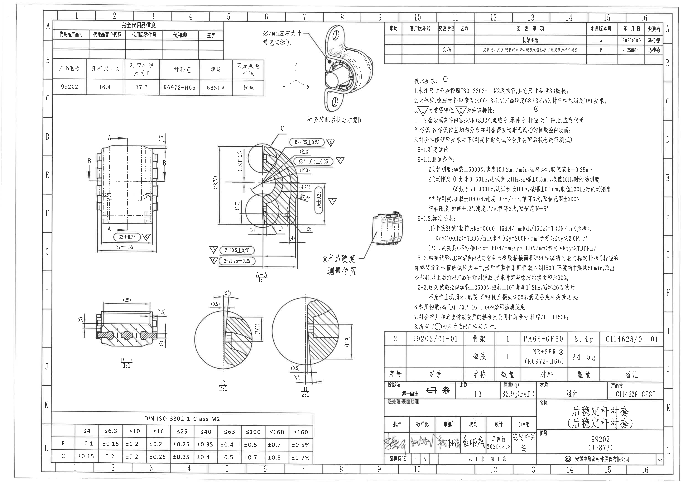

## object_1 - table - 完全代用品信息

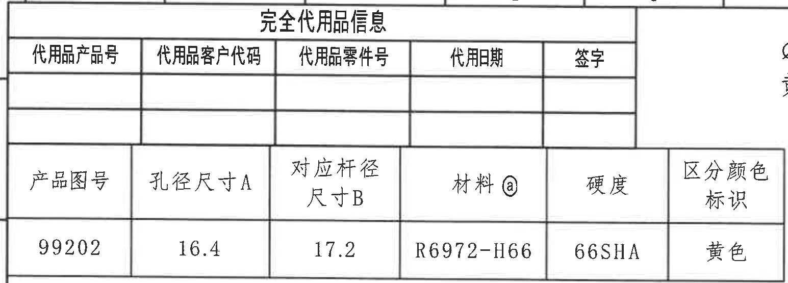

原图位置/视图名称：左上角 A-C 区域，bbox `[365, 140, 1910, 695]`。

原表格还原：

| 完全代用品信息 |  |  |  |  |
|---|---|---|---|---|
| 代用品产品号 | 代用品客户代码 | 代用品零件号 | 代用期 | 签字 |
|  |  |  |  |  |
|  |  |  |  |  |

| 产品图号 | 孔径尺寸 A | 对应杆径尺寸 B | 材料 @ | 硬度 | 区分颜色标识 |
|---|---:|---:|---|---|---|
| 99202 | 16.4 | 17.2 | R6972-H66 | 66SHA | 黄色 |

提取表格：

| 提取项 | 原图数值或文本 | 含义说明 |
|---|---|---|
| 代用品信息栏 | 表头存在，数据行为空 | 上部表格为替代品追溯信息，本图未填写替代品数据。 |
| 产品图号 | 99202 | 本零件/产品图号。 |
| 孔径尺寸 A | 16.4 | 与后续 A-A 剖面 `ØA=16.4±0.25` 对应。 |
| 对应杆径尺寸 B | 17.2 | 与稳定杆或匹配杆径相关的对应尺寸。 |
| 材料 @ | R6972-H66 | 橡胶材料牌号或配方代号，`@` 与技术要求材料说明关联。 |
| 硬度 | 66SHA | 材料硬度要求。 |
| 区分颜色标识 | 黄色 | 与装配示意中的黄色点标识关联。 |

边界归属说明：裁切完整包含表格外框、表头和数据行；右侧未提取装配示意中的 `Ø5mm` 标注，二者分别归属 object_2。

## object_2 - view - 衬套装配后状态示意图

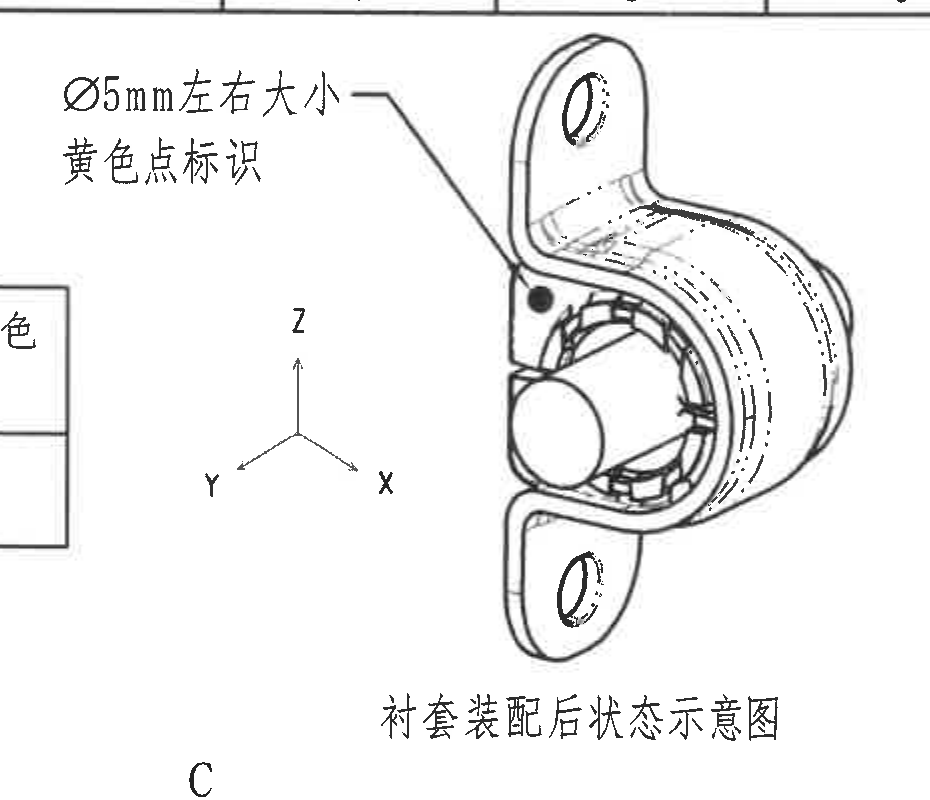

原图位置/视图名称：上部中间 B-D 区域，bbox `[1835, 145, 2765, 945]`。

提取表格：

| 提取项 | 原图数值或文本 | 含义说明 |
|---|---|---|
| 视图名称 | 衬套装配后状态示意图 | 表示衬套装配到骨架/杆件后的立体状态。 |
| 标识尺寸 | Ø5mm 左右大小 | 黄色点标识的近似直径或大小；带直径符号 `Ø`，为标识点尺寸说明。 |
| 标识颜色 | 黄色点标识 | 说明图中黑色扫描点在实物上为黄色点，用于区分颜色或装配识别。 |
| 坐标方向 | X、Y、Z | 图中给出三向坐标，用于后续 Z 向、Y 向刚度/耐久试验方向理解。 |

边界归属说明：左侧保留了少量 object_1 表格边线，以避免切掉 `Ø5mm 左右大小 / 黄色点标识` 文字；该表格边线不属于本视图提取内容。底部靠近 A-A 的局部视图字母 `C`，不归入本对象。

## object_3 - table - 修订履历表

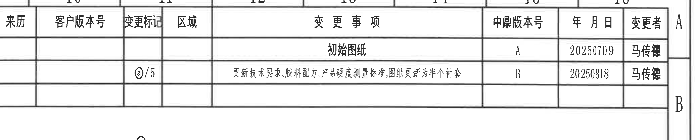

原图位置/视图名称：右上角 A-B 区域，bbox `[2790, 140, 4860, 560]`。

原表格还原：

| 来历 | 客户版本号 | 变更标记 | 区域 | 变更事项 | 中鼎版本号 | 年月日 | 变更者 |
|---|---|---|---|---|---|---|---|
|  |  |  |  | 初始图纸 | A | 20250709 | 马传德 |
|  |  | @/5 |  | 更新技术要求、胶料配方、产品硬度测量标准；图纸更新为半个衬套 | B | 20250818 | 马传德 |
|  |  |  |  |  |  |  |  |

提取表格：

| 提取项 | 原图数值或文本 | 含义说明 |
|---|---|---|
| 版本 A | 初始图纸，20250709，马传德 | 初版发布记录。 |
| 版本 B | 更新技术要求、胶料配方、产品硬度测量标准；图纸更新为半个衬套，20250818，马传德 | 当前图面变更记录，说明技术要求、材料配方和硬度测量标准均已更新。 |
| 变更标记 | @/5 | 标识变更点或变更次数/条目号，与图中 `@` 标记相关。 |

边界归属说明：裁切包含表格外框、列头、两条修订记录和一条空白行；下方技术要求文字不属于本对象。

## object_4 - view - 主视图

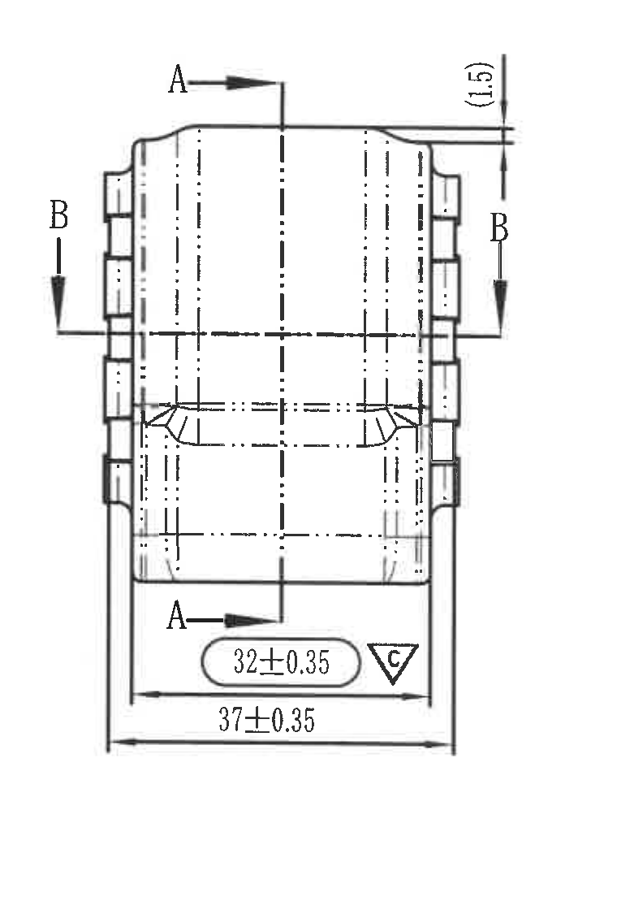

原图位置/视图名称：左中 D-G 区域，bbox `[570, 895, 1330, 2015]`。

提取表格：

| 提取项 | 原图数值或文本 | 含义说明 |
|---|---|---|
| 剖切标识 | A-A | 垂直方向剖切位置，上下均有 `A` 箭头，剖面结果见 object_5。 |
| 剖切标识 | B-B | 水平方向剖切位置，左右均有 `B` 箭头，剖面结果见 object_7。 |
| 参考尺寸 | (1.5) | 右上端局部厚度/台阶参考尺寸；括号表示参考尺寸，仍归属主视图。 |
| 关键尺寸 | 32±0.35，三角 C | 内侧宽度或功能宽度，公差 ±0.35；三角 C 表示关键特性。 |
| 总宽尺寸 | 37±0.35 | 下方总宽尺寸，公差 ±0.35。 |

边界归属说明：裁切完整包含主视图外形、A-A/B-B 剖切箭头和底部两条尺寸线；未带入 A-A 剖面或 B-B 剖面中的尺寸。

## object_5 - section - A-A 剖面 1:1

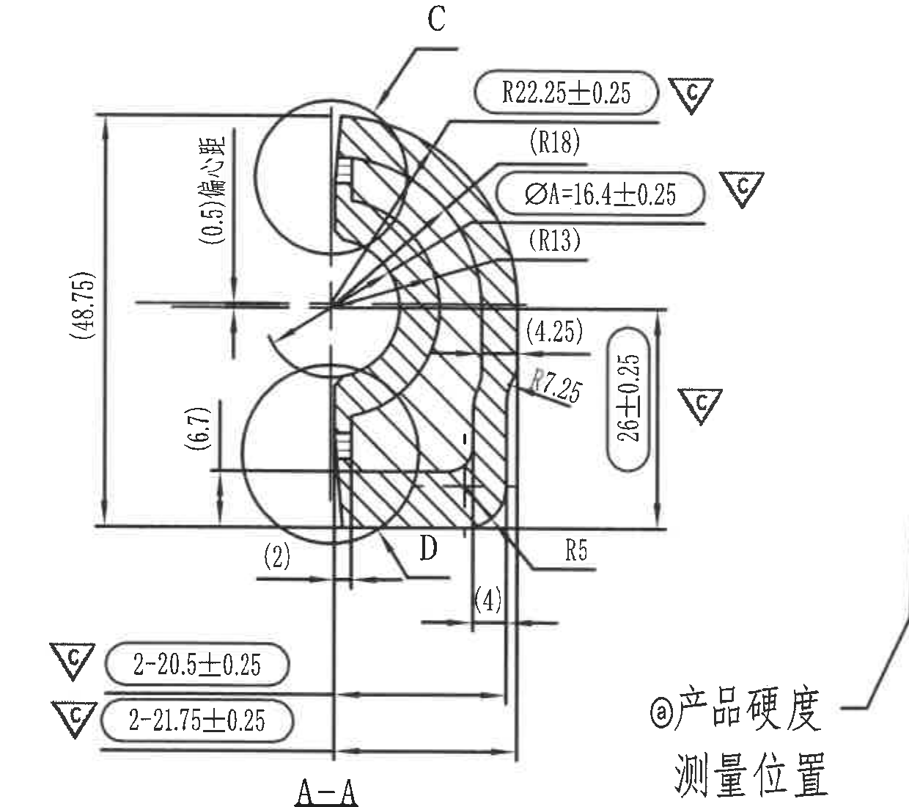

原图位置/视图名称：中部 D-G 区域，bbox `[1440, 900, 2680, 2000]`。

提取表格：

| 提取项 | 原图数值或文本 | 含义说明 |
|---|---|---|
| 视图名称/比例 | A-A，1:1 | 主视图 A-A 剖切结果。 |
| 局部视图索引 | C | 指向局部放大 C，详见 object_8。 |
| 局部视图索引 | D | 指向局部放大 D，详见 object_9。 |
| 参考总高度 | (48.75) | 左侧总高度参考尺寸；括号表示参考尺寸。 |
| 参考偏距 | (0.5) 偏距 | 上部偏距参考尺寸，箭头指向局部偏置。 |
| 参考高度 | (6.7) | 左下高度参考尺寸。 |
| 关键半径 | R22.25±0.25，三角 C | 外弧半径，公差 ±0.25，关键特性。 |
| 参考半径 | (R18) | 内部弧半径参考尺寸。 |
| 关键直径 | ØA=16.4±0.25，三角 C | 孔径/杆配合尺寸 A，直径符号 `Ø`，公差 ±0.25，关键特性；与 object_1 的孔径尺寸 A 对应。 |
| 参考半径 | (R13) | 内部弧半径参考尺寸。 |
| 参考尺寸 | (4.25) | 右侧局部厚度/台阶参考尺寸。 |
| 弧半径 | R7.25 | 内部过渡圆弧半径，未单独给出公差。 |
| 关键高度 | 26±0.25，三角 C | 右侧竖向尺寸，公差 ±0.25，关键特性。 |
| 半径 | R5 | 下部过渡圆弧半径，未单独给出公差。 |
| 参考尺寸 | (2) | 左下局部水平参考尺寸。 |
| 参考尺寸 | (4) | 下部中间局部水平参考尺寸。 |
| 数量前缀关键尺寸 | 2-20.5±0.25，三角 C | 两处同类尺寸，公差 ±0.25，关键特性。 |
| 数量前缀关键尺寸 | 2-21.75±0.25，三角 C | 两处同类尺寸，公差 ±0.25，关键特性。 |

边界归属说明：为完整包含左下两条 `2-` 尺寸的三角 C、右侧 `26±0.25` 尺寸线和底部 `A-A 1:1`，裁片右下角不可避免保留了相邻 object_6 的 `@产品硬度测量位置` 字样边缘。该文字不归属 A-A 剖面，已在 object_6 单独提取；本对象只提取 A-A 剖面尺寸和 C/D 局部视图索引。

## object_6 - detail - 产品硬度测量位置示意

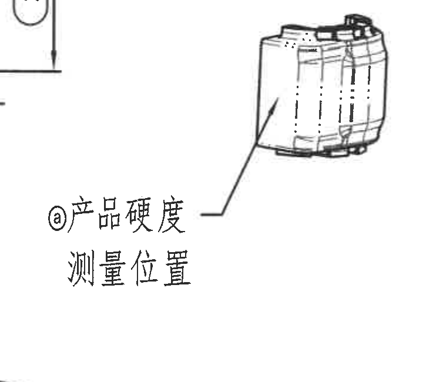

原图位置/视图名称：中右 F-G 区域，bbox `[2245, 1500, 2970, 2150]`。

提取表格：

| 提取项 | 原图数值或文本 | 含义说明 |
|---|---|---|
| 标识 | @产品硬度测量位置 | `@` 对应材料/硬度要求说明，指示产品硬度测试的位置。 |
| 引线 | 引线指向衬套外侧面 | 测量位置位于装配状态示意中的衬套外表面区域。 |
| 数值尺寸 | 无新增数字尺寸 | 本对象只给出测量位置，不给出单独尺寸；硬度数值见 object_1 和技术要求 object_11。 |

边界归属说明：左上角可能出现 A-A 剖面尺寸线残留，右侧邻近技术要求文字；均不归入本对象。提取内容仅为硬度测量位置示意、引线和标题文字。

## object_7 - section - B-B 剖面 1:1

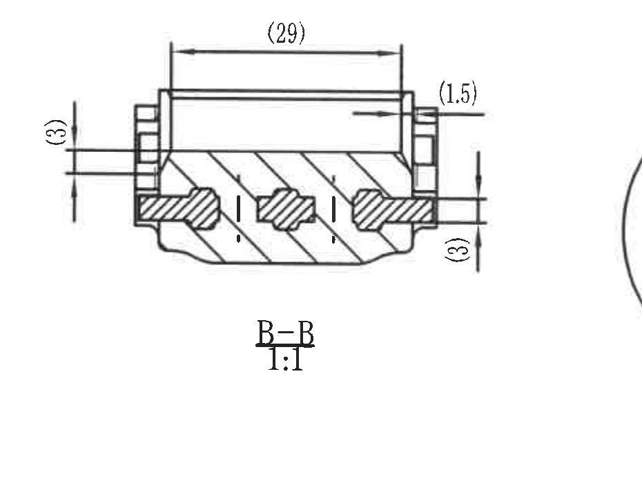

原图位置/视图名称：左下 I-J 区域，bbox `[500, 2115, 1430, 2815]`。

提取表格：

| 提取项 | 原图数值或文本 | 含义说明 |
|---|---|---|
| 视图名称/比例 | B-B，1:1 | 主视图 B-B 剖切结果。 |
| 参考长度 | (29) | 上方横向参考尺寸，括号表示参考尺寸。 |
| 参考尺寸 | (1.5) | 右上端局部参考尺寸。 |
| 参考尺寸 | (3) | 左侧局部竖向参考尺寸。 |
| 参考尺寸 | (3) | 右侧局部竖向参考尺寸。 |

边界归属说明：裁切完整包含 B-B 剖面、剖面线、顶部 `(29)` 尺寸线和左右参考尺寸；右侧相邻局部 C/D 圆形边缘未归入本对象。

## object_8 - detail - 局部 C 2:1

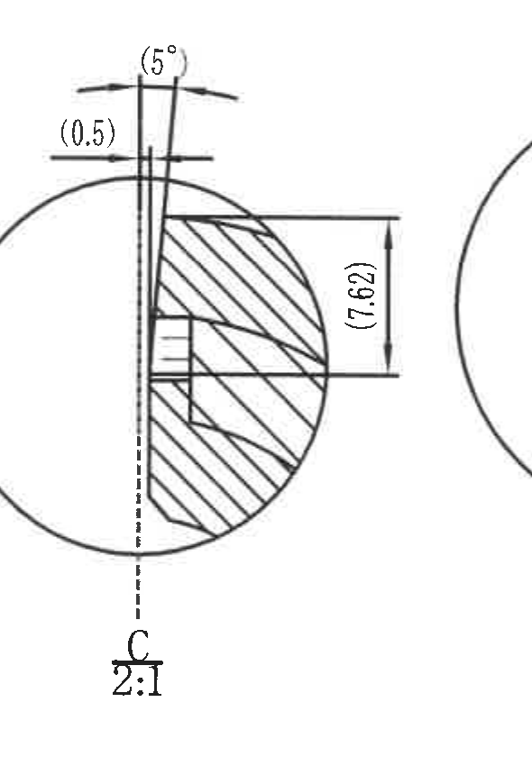

原图位置/视图名称：下中偏左 I-J 区域，bbox `[1455, 2045, 2045, 2905]`。

提取表格：

| 提取项 | 原图数值或文本 | 含义说明 |
|---|---|---|
| 视图名称/比例 | C，2:1 | A-A 剖面中 C 处局部放大，比例 2:1。 |
| 参考角度 | (5°) | 顶部夹角/倾角参考尺寸。 |
| 参考间隙 | (0.5) | 左上局部水平偏距或间隙参考尺寸。 |
| 参考高度 | (7.62) | 右侧竖向参考尺寸。 |

边界归属说明：裁切完整包含 C 局部圆形放大、中心线、剖面线和全部括号尺寸；右边缘存在相邻局部 D 的圆弧边缘残留，不提取为 C 的尺寸。

## object_9 - detail - 局部 D 2:1

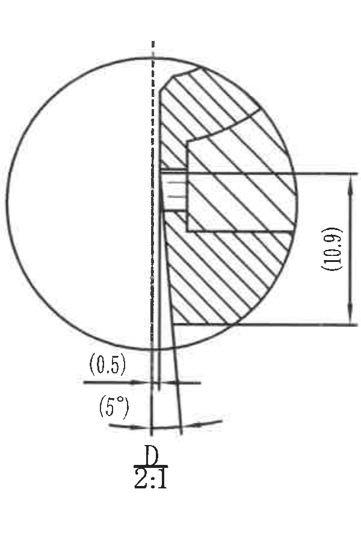

原图位置/视图名称：下中 J 区域，bbox `[1950, 2050, 2550, 2960]`。

提取表格：

| 提取项 | 原图数值或文本 | 含义说明 |
|---|---|---|
| 视图名称/比例 | D，2:1 | A-A 剖面中 D 处局部放大，比例 2:1。 |
| 参考高度 | (10.9) | 右侧竖向参考尺寸。 |
| 参考间隙 | (0.5) | 底部局部水平偏距或间隙参考尺寸。 |
| 参考角度 | (5°) | 底部夹角/倾角参考尺寸。 |

边界归属说明：裁切完整包含 D 局部圆形放大、剖面线、中心线、底部角度和间隙尺寸；未将 C 局部尺寸归入本对象。

## object_10 - table - DIN ISO 3302-1 Class M2 公差表

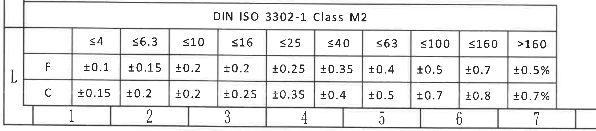

原图位置/视图名称：左下 L 区域，bbox `[285, 2960, 2395, 3425]`。

原表格还原：

| DIN ISO 3302-1 Class M2 | ≤4 | ≤6.3 | ≤10 | ≤16 | ≤25 | ≤40 | ≤63 | ≤100 | ≤160 | >160 |
|---|---:|---:|---:|---:|---:|---:|---:|---:|---:|---:|
| F | ±0.1 | ±0.15 | ±0.2 | ±0.2 | ±0.25 | ±0.35 | ±0.4 | ±0.5 | ±0.7 | ±0.5% |
| C | ±0.15 | ±0.2 | ±0.2 | ±0.25 | ±0.35 | ±0.4 | ±0.5 | ±0.7 | ±0.8 | ±0.7% |

提取表格：

| 提取项 | 原图数值或文本 | 含义说明 |
|---|---|---|
| 标准 | DIN ISO 3302-1 Class M2 | 未注尺寸公差表，用于橡胶制品尺寸等级。 |
| F 行 | ±0.1 到 ±0.5% | F 类尺寸公差，按尺寸范围查表。 |
| C 行 | ±0.15 到 ±0.7% | C 类尺寸公差，按尺寸范围查表；图中三角 C 为关键特性标识，不等同于此处 C 行。 |

边界归属说明：裁切完整包含公差表标题、全部尺寸范围列和 F/C 两行；底部图框分区数字 1-7 属于图纸边框坐标，不作为公差表内容提取。

## object_11 - notes - 技术要求

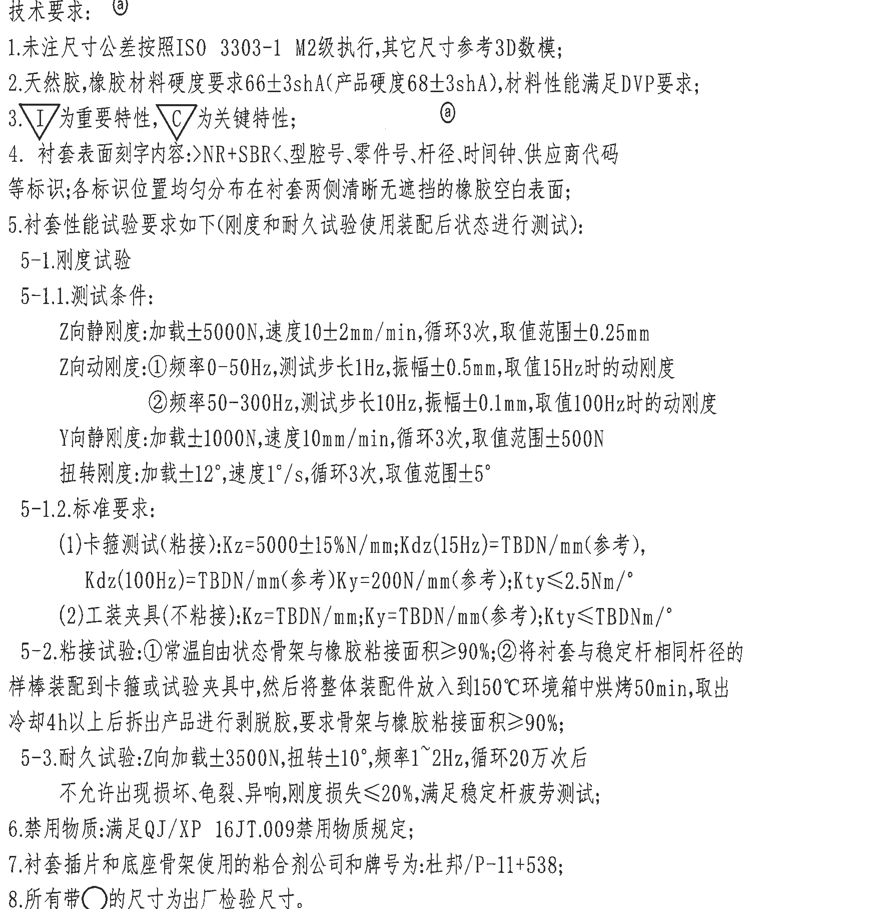

原图位置/视图名称：右侧 C-I 区域，bbox `[2970, 560, 4715, 2375]`。

提取表格：

| 提取项 | 原图数值或文本 | 含义说明 |
|---|---|---|
| 标题 | 技术要求：@ | `@` 与材料、硬度及产品硬度测量位置相关。 |
| 1 | 未注尺寸公差按照 ISO 3303-1 M2级执行，其它尺寸参考 3D 数模； | 未单独标注公差的尺寸按 M2 级执行；其它尺寸参考 3D 模型。 |
| 2 | 天然胶，橡胶材料硬度要求 66±3shA（产品硬度 68±3shA），材料性能满足 DVP 要求； | 给出材料硬度和产品硬度，包含公差 ±3shA。 |
| 3 | 三角 I 为重要特性，三角 C 为关键特性； | 定义特性符号含义，主视图和 A-A 中的三角 C 尺寸均为关键特性。 |
| 4 | 衬套表面刻字内容：>NR+SBR<、型腔号、零件号、杆径、时间钟、供应商代码等标识；各标识位置均匀分布在衬套两侧清晰无遮挡的橡胶空白表面； | 规定刻字/标识内容和位置。 |
| 5 | 衬套性能试验要求如下（刚度和耐久试验使用装配后状态进行测试）： | 性能试验总要求，测试状态采用装配后状态。 |
| 5-1 | 刚度试验 | 刚度试验项目标题。 |
| 5-1.1 Z向静刚度 | 加载 ±5000N，速度 10±2mm/min，循环 3 次，取值范围 ±0.25mm | Z 向静态刚度测试条件。 |
| 5-1.1 Z向动刚度 ① | 频率 0-50Hz，测试步长 1Hz，振幅 ±0.5mm，取值 15Hz 时的动刚度 | Z 向低频动态刚度测试条件。 |
| 5-1.1 Z向动刚度 ② | 频率 50-300Hz，测试步长 10Hz，振幅 ±0.1mm，取值 100Hz 时的动刚度 | Z 向高频动态刚度测试条件。 |
| 5-1.1 Y向静刚度 | 加载 ±1000N，速度 10mm/min，循环 3 次，取值范围 ±500N | Y 向静态刚度测试条件。 |
| 5-1.1 扭转刚度 | 加载 ±12°，速度 1°/s，循环 3 次，取值范围 ±5° | 扭转刚度测试条件，包含角度和角速度。 |
| 5-1.2 标准要求 (1) | 卡箍测试（粘接）：Kz=5000±15%N/mm；Kdz(15Hz)=TBDN/mm（参考），Kdz(100Hz)=TBDN/mm（参考）；Ky=200N/mm（参考）；Kty≤2.5Nm/° | 粘接状态卡箍测试标准。 |
| 5-1.2 标准要求 (2) | 工装夹具（不粘接）：Kz=TBDN/mm；Ky=TBDN/mm（参考）；Kty≤TBDNm/° | 不粘接夹具测试标准。 |
| 5-2 | 粘接试验：①常温自由状态骨架与橡胶粘接面积≥90%；②将衬套与稳定杆相同杆径的样棒装配到卡箍或试验夹具中，然后将整体装配件放入到 150℃ 环境箱中烘烤 50min，取出冷却 4h 以上后拆出产品进行剥脱胶，要求骨架与橡胶粘接面积≥90%； | 粘接面积和热处理后剥脱胶要求。 |
| 5-3 | 耐久试验：Z向加载 ±3500N，扭转 ±10°，频率 1~2Hz，循环 20 万次后不允许出现损坏、龟裂、异响，刚度损失≤20%，满足稳定杆疲劳测试； | 耐久试验载荷、角度、频率和判定要求。 |
| 6 | 禁用物质：满足 QJ/XP 16JT.009 禁用物质规定； | 禁用物质规范。 |
| 7 | 衬套插件和底座骨架使用的粘合剂公司和牌号为：杜邦/P-11+538； | 粘合剂公司和牌号要求。 |
| 8 | 所有带○的尺寸为出厂检验尺寸。 | 带圆圈标识的尺寸为出厂检验尺寸。 |

边界归属说明：裁切包含完整技术要求文字块；左侧硬度测量示意不属于本对象，右侧图框分区字母已裁除。

## object_12 - table - 明细/BOM 表

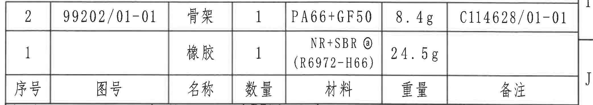

原图位置/视图名称：右下 I-J 区域，bbox `[2750, 2385, 4835, 2755]`。

原表格还原：

| 序号 | 图号 | 名称 | 数量 | 材料 | 重量 | 备注 |
|---:|---|---|---:|---|---:|---|
| 2 | 99202/01-01 | 骨架 | 1 | PA66+GF50 | 8.4g | C114628/01-01 |
| 1 |  | 橡胶 | 1 | NR+SBR @（R6972-H66） | 24.5g |  |

提取表格：

| 提取项 | 原图数值或文本 | 含义说明 |
|---|---|---|
| 骨架 | 图号 99202/01-01，数量 1，材料 PA66+GF50，重量 8.4g，备注 C114628/01-01 | 骨架件 BOM 行。 |
| 橡胶 | 数量 1，材料 NR+SBR @（R6972-H66），重量 24.5g | 橡胶件 BOM 行；材料 @ 与技术要求和代用品信息材料关联。 |

边界归属说明：裁切完整包含 BOM 表头和两条物料行；下方标题栏已通过重裁排除，不将标题栏字段归入本对象。

## object_13 - title_block - 标题栏

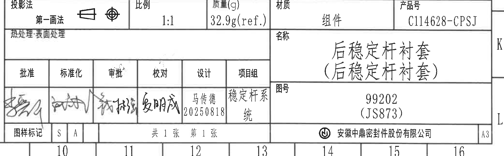

原图位置/视图名称：右下 J-L 区域，bbox `[2750, 2755, 4835, 3405]`。

原表格还原：

| 字段 | 原图文本 |
|---|---|
| 投影法 | 第一画法，带投影符号 |
| 比例 | 1:1 |
| 质量 @ | 32.9g(ref.) |
| 材质 | 组件 |
| 产品号 | C114628-CPSJ |
| 热处理/表面处理 | 表头存在，内容为空 |
| 名称 | 后稳定杆衬套（后稳定杆衬套） |
| 批准 | 手写签名 |
| 标准化 | 手写签名 |
| 审批 | 手写签名 |
| 校对 | 手写签名 |
| 设计 | 马传德，20250818 |
| 项目组 | 稳定杆系统 |
| 图号 | 99202（JS873） |
| 图样标记 | S，A |
| 张数 | 共 1 张，第 1 张 |
| 公司 | 安徽中鼎密封件股份有限公司 |
| 图幅 | A3 |

提取表格：

| 提取项 | 原图数值或文本 | 含义说明 |
|---|---|---|
| 名称 | 后稳定杆衬套（后稳定杆衬套） | 图纸零件/组件名称。 |
| 图号 | 99202（JS873） | 图纸编号及括号内参考/关联编号。 |
| 产品号 | C114628-CPSJ | 产品编号。 |
| 比例 | 1:1 | 图纸主比例。 |
| 质量 | 32.9g(ref.) | 参考质量，括号 `ref.` 表示参考值。 |
| 材质 | 组件 | 标题栏材质/类别。 |
| 设计 | 马传德，20250818 | 设计者和日期。 |

边界归属说明：裁切包含标题栏主体、签署栏、图号栏、公司栏和图幅栏；上方 BOM 表不归入本对象。手写签名字迹按“手写签名”记录，不臆测姓名。

## 裁切检查记录

| 对象 | 图像路径 | 检查结果 |
|---|---|---|
| page_1 | outputs/20C114628_assets/images/page_1.png | 整页 PNG 渲染完整，4959 x 3505 px。 |
| object_1 | outputs/20C114628_assets/images/object_1.png | 表格边框、表头和数据行完整；未截断文字。 |
| object_2 | outputs/20C114628_assets/images/object_2.png | `Ø5mm 左右大小`、`黄色点标识`、XYZ 坐标和视图标题完整；左侧残留相邻表格边线，已排除归属。 |
| object_3 | outputs/20C114628_assets/images/object_3.png | 修订履历表列头、A/B 两条记录和空白行完整；未带入技术要求正文。 |
| object_4 | outputs/20C114628_assets/images/object_4.png | 主视图、A-A/B-B 剖切箭头、`(1.5)`、`32±0.35`、`37±0.35` 尺寸线完整。 |
| object_5 | outputs/20C114628_assets/images/object_5.png | A-A 剖面尺寸线、箭头、C/D 索引、底部 `A-A 1:1` 完整；右下硬度测量文字因相邻过近被保留边缘，但已单独归属 object_6。 |
| object_6 | outputs/20C114628_assets/images/object_6.png | 硬度测量示意、引线和 `@产品硬度测量位置` 完整；邻近 A-A 线条不提取。 |
| object_7 | outputs/20C114628_assets/images/object_7.png | B-B 剖面、`(29)`、`(1.5)`、两处 `(3)` 参考尺寸完整。 |
| object_8 | outputs/20C114628_assets/images/object_8.png | C 局部、`(5°)`、`(0.5)`、`(7.62)` 完整；右边缘相邻圆弧不提取。 |
| object_9 | outputs/20C114628_assets/images/object_9.png | D 局部、`(10.9)`、`(0.5)`、`(5°)` 完整。 |
| object_10 | outputs/20C114628_assets/images/object_10.png | 公差表标题、列范围、F/C 行完整；底部图框坐标数字不作为表格内容。 |
| object_11 | outputs/20C114628_assets/images/object_11.png | 技术要求 1-8 完整，右侧图框字母已裁除。 |
| object_12 | outputs/20C114628_assets/images/object_12.png | BOM 表头和 1/2 两行完整；重裁后未混入标题栏。 |
| object_13 | outputs/20C114628_assets/images/object_13.png | 标题栏字段、签署栏、公司栏和 A3 图幅完整；上方 BOM 不归属本对象。 |
