# 20C114629 PDF内容识别与裁切提取

## 整页渲染

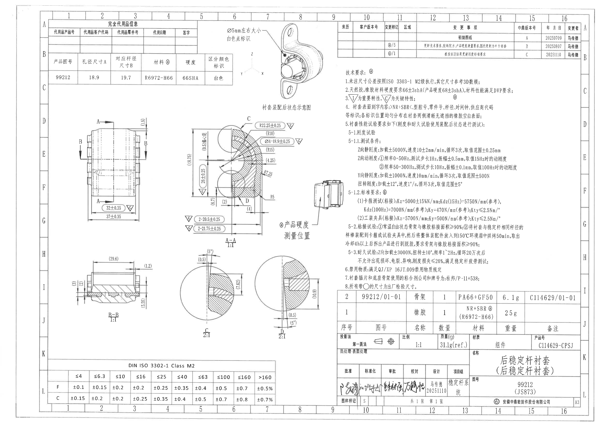

| 提取项 | 原图数值或文本 | 含义说明 |
|---|---|---|
| 整页PNG | outputs/20C114629_assets/images/page_1.png | PDF第1页按400 dpi渲染，图像尺寸6612×4673px。 |
| 页面bbox | [0, 0, 6612, 4673] | 后续所有裁切bbox均基于该整页PNG像素坐标。 |

## object_1 - 完全代用品信息表

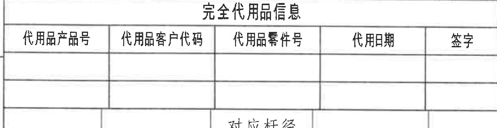

- 原图位置/视图名称：第1页；完全代用品信息表；bbox=[520, 225, 2165, 650]。
- 原表行列还原：

| 代用品产品号 | 代用品客户代码 | 代用品零件号 | 代用期 | 签字 |
| --- | --- | --- | --- | --- |
|  |  |  |  |  |
|  |  |  |  |  |

| 提取项 | 原图数值或文本 | 含义说明 |
|---|---|---|
| 表名 | 完全代用品信息 | 记录可完全代用件的信息；当前表格未填写代用品数据。 |
| 列 | 代用品产品号、代用品客户代码、代用品零件号、代用期、签字 | 代用品信息的字段列。 |
| 数据行 | 空白两行 | 图中未给出具体代用品记录。 |

- 边界归属说明：第1页左上方，完全代用品信息表。裁切贴近表格外框；右侧相邻“Ø5mm左右大小/白色点标识”说明不属于本表，已排除。

## object_14 - 产品属性表

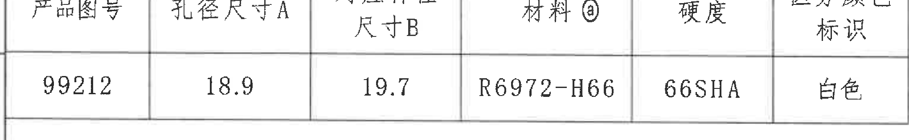

- 原图位置/视图名称：第1页；产品属性表；bbox=[520, 660, 2560, 975]。
- 原表行列还原：

| 产品图号 | 孔径尺寸A | 对应杆径尺寸B | 材料ⓐ | 硬度 | 区分颜色标识 |
| --- | --- | --- | --- | --- | --- |
| 99212 | 18.9 | 19.7 | R6972-H66 | 66SHA | 白色 |

| 提取项 | 原图数值或文本 | 含义说明 |
|---|---|---|
| 产品图号 | 99212 | 产品或零件图号。 |
| 孔径尺寸A | 18.9 | 孔径尺寸 A，后续在剖视图中以 ØA=18.9±0.25 标注。 |
| 对应杆径尺寸B | 19.7 | 与孔径 A 对应的杆径尺寸 B。 |
| 材料ⓐ | R6972-H66 | 材料编号，ⓐ与技术要求和材料明细中的材料标识关联。 |
| 硬度 | 66SHA | 橡胶材料硬度标称值。 |
| 区分颜色标识 | 白色 | 用于区分/识别的颜色标识。 |

- 边界归属说明：第1页左上，位于完全代用品信息表下方。裁切仅包含产品图号/尺寸/材料/硬度/颜色标识表，未包含右侧装配示意图。

## object_2 - 衬套装配后状态示意图

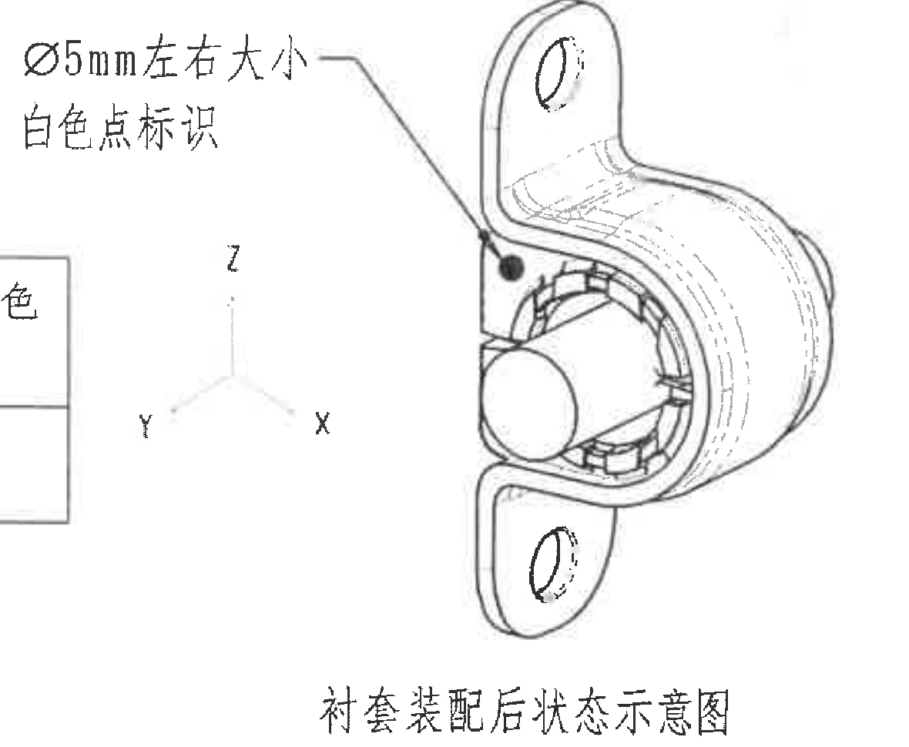

- 原图位置/视图名称：第1页；衬套装配后状态示意图；bbox=[2470, 260, 3650, 1230]。
| 提取项 | 原图数值或文本 | 含义说明 |
|---|---|---|
| 标识尺寸 | Ø5mm左右大小 | 白色点标识的约略直径，使用“左右大小”表示近似尺寸。 |
| 标识内容 | 白色点标识 | 装配后可见的白色点标识位置；引线指向图中黑点位置。 |
| 坐标轴 | X/Y/Z | 三维方向参考坐标。 |
| 图名 | 衬套装配后状态示意图 | 说明该图不是加工尺寸主视图，而是装配后状态示意。 |

- 边界归属说明：第1页上部中间，装配后状态示意图。裁切包含白色点标识说明、引线、装配状态图和X/Y/Z方向；左侧残留表格边线为相邻表格，不作为本对象内容提取。

## object_3 - 修订履历表

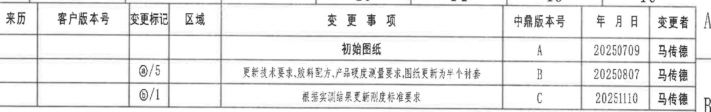

- 原图位置/视图名称：第1页；修订履历表；bbox=[3740, 225, 6450, 655]。
- 原表行列还原：

| 来历 | 客户版本号 | 变更标记 | 区域 | 变更事项 | 中鼎版本号 | 年月日 | 变更者 |
| --- | --- | --- | --- | --- | --- | --- | --- |
|  |  |  |  | 初始图纸 | A | 20250709 | 马传德 |
|  |  | ⓐ/5 |  | 更新技术要求,胶料配方,产品硬度测量要求;图纸更新为半个衬套 | B | 20250807 | 马传德 |
|  |  | ⓑ/1 |  | 根据实测结果更新刚度标准要求 | C | 20251110 | 马传德 |

| 提取项 | 原图数值或文本 | 含义说明 |
|---|---|---|
| 版本A | 初始图纸 / A / 20250709 / 马传德 | 初始发行记录。 |
| 版本B | ⓐ/5；更新技术要求,胶料配方,产品硬度测量要求;图纸更新为半个衬套 / B / 20250807 / 马传德 | 第二次变更，关联ⓐ和第5条技术要求。 |
| 版本C | ⓑ/1；根据实测结果更新刚度标准要求 / C / 20251110 / 马传德 | 第三次变更，关联ⓑ和刚度标准要求。 |

- 边界归属说明：第1页右上方修订履历表。裁切完整包含表头和三行修订记录；右侧图框坐标字母不属于表格内容。

## object_4 - 技术要求 NOTES

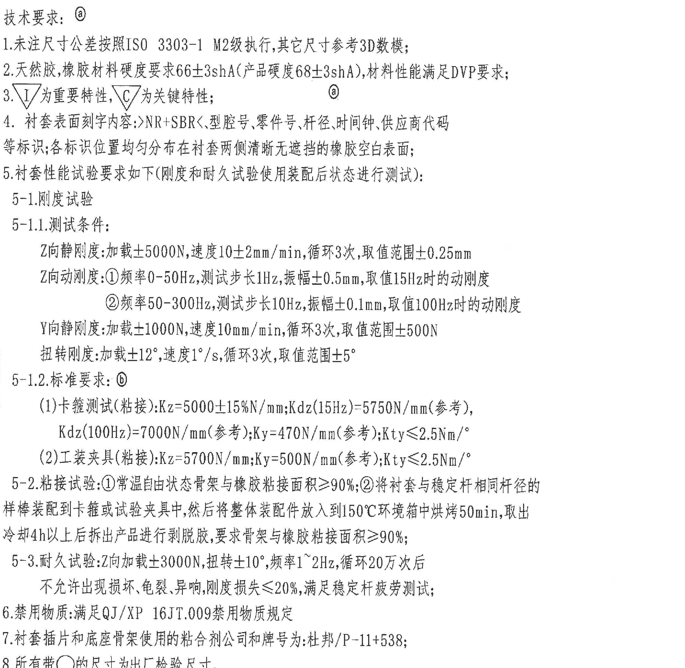

- 原图位置/视图名称：第1页；技术要求 NOTES；bbox=[3790, 735, 6285, 3170]。
| 提取项 | 原图数值或文本 | 含义说明 |
|---|---|---|
| 技术要求标识 | ⓐ | 本技术要求区与材料/硬度标识ⓐ关联。 |
| 未注公差 | ISO 3303-1 M2；其它尺寸参考3D数模 | 未注尺寸公差执行标准和3D数模参考说明。 |
| 硬度要求 | 66±3shA；产品硬度68±3shA | 天然胶/橡胶材料和产品硬度要求。 |
| 特性符号 | △I重要特性；△C关键特性 | 图中带△C的尺寸为关键特性。 |
| 刻字内容 | NR+SBR<、型腔号、零件号、杆径、时间钟、供应商代码等标识 | 衬套表面标识内容与位置要求。 |
| Z向静刚度测试 | 加载±5000N；速度10±2mm/min；循环3次；取值范围±0.25mm | 刚度试验测试条件。 |
| Z向动刚度测试1 | 0-50Hz；步长1Hz；振幅±0.5mm；取值15Hz | Z向动刚度低频段测试条件。 |
| Z向动刚度测试2 | 50-300Hz；步长10Hz；振幅±0.1mm；取值100Hz | Z向动刚度高频段测试条件。 |
| Y向静刚度测试 | 加载±1000N；速度10mm/min；循环3次；取值范围±500N | Y向静刚度测试条件。 |
| 扭转刚度测试 | 加载±12°；速度1°/s；循环3次；取值范围±5° | 扭转刚度测试条件。 |
| 标准要求ⓑ-卡箍测试 | Kz=5000±15%N/mm；Kdz(15Hz)=5750N/mm(参考)；Kdz(100Hz)=7000N/mm(参考)；Ky=470N/mm(参考)；Kty≤2.5Nm/° | 卡箍测试粘接刚度标准。 |
| 标准要求ⓑ-工装夹具 | Kz=5700N/mm；Ky=500N/mm(参考)；Kty≤2.5Nm/° | 工装夹具粘接刚度标准。 |
| 粘接试验 | 常温自由状态骨架与橡胶粘接面积≥90%；150℃烘烤50min，冷却4h以上后剥脱胶，粘接面积≥90% | 粘接性能试验要求。 |
| 耐久试验 | Z向加载±3000N；扭转±10°；频率1~2Hz；循环20万次；刚度损失≤20% | 耐久试验载荷、频率、循环次数和判定要求。 |
| 禁用物质 | 满足QJ/XP 16JT.009禁用物质规定 | 禁用物质要求。 |
| 粘合剂 | 杜邦/P-11+538 | 插片和底座骨架使用的粘合剂公司和牌号。 |
| 出厂检验尺寸 | 所有带○的尺寸为出厂检验尺寸 | 带圆圈标识尺寸的检验属性说明。 |

- 边界归属说明：第1页右中部技术要求。裁切完整覆盖“技术要求：ⓐ”至第8条；左侧相邻硬度测量位置图不属于本对象，底部明细表不属于本对象。

## object_5 - 主视图/加工视图

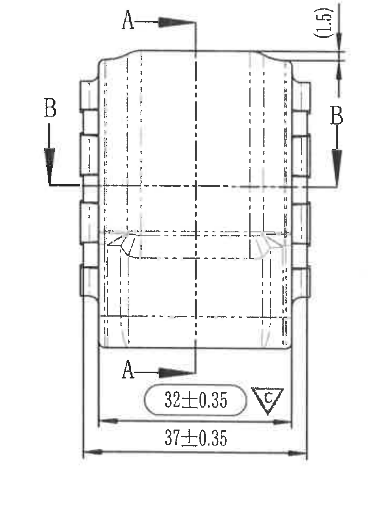

- 原图位置/视图名称：第1页；主视图/加工视图；bbox=[760, 1290, 1720, 2555]。
| 提取项 | 原图数值或文本 | 含义说明 |
|---|---|---|
| 剖切标识 | A-A | 主视图中竖向剖切位置，指向A-A剖视图。 |
| 剖切标识 | B-B | 主视图中横向剖切位置，指向B-B剖视图。 |
| 参考尺寸 | (1.5) | 上端局部高度/台阶相关参考尺寸，括号表示参考尺寸。 |
| 关键尺寸 | 32±0.35 △C | 主视图底部内侧宽度/功能宽度，△C表示关键特性。 |
| 总宽度 | 37±0.35 | 主视图底部外侧总宽度。 |

- 边界归属说明：第1页左中部主视图。裁切完整包含主视图外形、A-A和B-B剖切箭头、顶部和底部尺寸线；未包含右侧A-A剖视图。

## object_6 - A-A剖视图 1:1

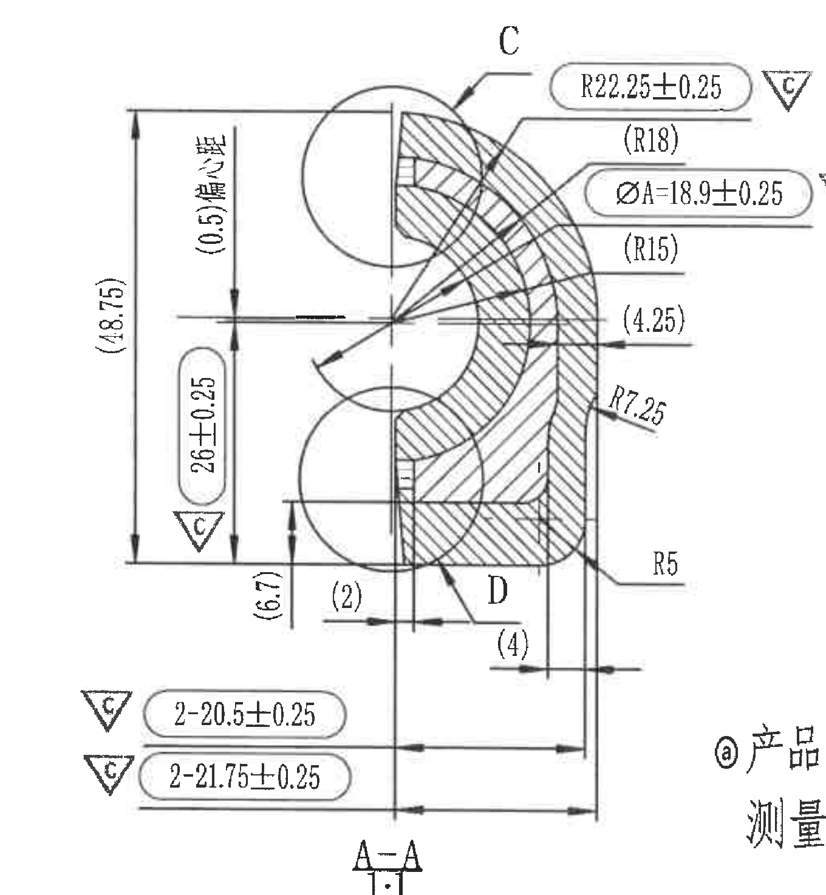

- 原图位置/视图名称：第1页；A-A剖视图 1:1；bbox=[1900, 1240, 3260, 2715]。
| 提取项 | 原图数值或文本 | 含义说明 |
|---|---|---|
| 视图名/比例 | A-A 1:1 | A-A剖视图，比例1:1。 |
| 局部索引 | C | 指向需在C局部详图中放大的区域。 |
| 局部索引 | D | 指向需在D局部详图中放大的区域。 |
| 参考总高度 | (48.75) | 剖视图左侧总高度参考尺寸。 |
| 参考偏移量 | (0.5)偏之量 | 剖视图左侧偏移量参考说明。 |
| 关键高度 | 26±0.25 △C | 剖视图左侧带公差高度尺寸，△C为关键特性。 |
| 参考高度 | (6.7) | 下部局部高度参考尺寸。 |
| 关键半径 | R22.25±0.25 △C | 外部圆弧半径，带±0.25公差和关键特性△C。 |
| 参考半径 | (R18) | 内部圆弧参考半径。 |
| 关键直径 | ØA=18.9±0.25 △C | 孔径A的直径尺寸，带±0.25公差和关键特性△C。 |
| 参考半径 | (R15) | 内部圆弧参考半径。 |
| 参考尺寸 | (4.25) | 右侧局部厚度/距离参考尺寸。 |
| 半径 | R7.25 | 过渡圆角半径。 |
| 半径 | R5 | 下右侧过渡圆角半径。 |
| 参考尺寸 | (2) | 下部左侧横向参考尺寸。 |
| 参考尺寸 | (4) | 下部右侧横向参考尺寸。 |
| 数量前缀关键尺寸 | 2-20.5±0.25 △C | 两处同类尺寸，数值20.5，公差±0.25，关键特性△C。 |
| 数量前缀关键尺寸 | 2-21.75±0.25 △C | 两处同类尺寸，数值21.75，公差±0.25，关键特性△C。 |

- 边界归属说明：第1页中部A-A剖视图。裁切包含剖面、剖面线、尺寸线、箭头、C/D局部索引和A-A 1:1标题；右下角相邻硬度测量位置文字边缘不属于本剖视图，未提取为本对象内容。底部C局部详图已另裁为object_9。

## object_7 - ⓐ产品硬度测量位置图

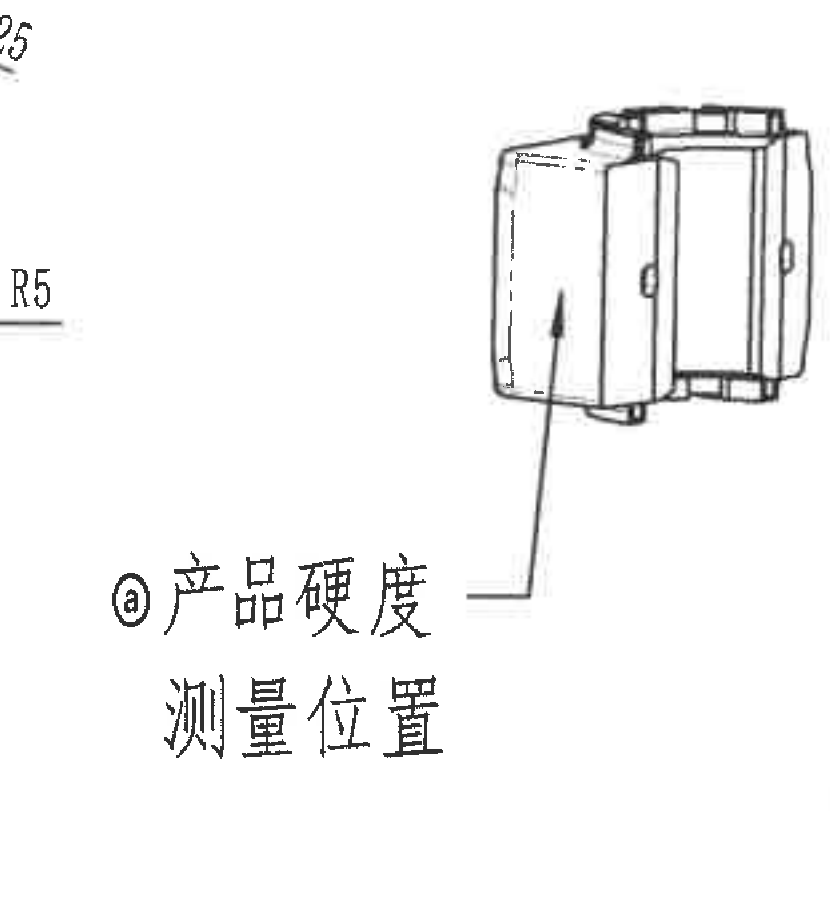

- 原图位置/视图名称：第1页；ⓐ产品硬度测量位置图；bbox=[2965, 1880, 3795, 2780]。
| 提取项 | 原图数值或文本 | 含义说明 |
|---|---|---|
| 测量对象 | ⓐ产品硬度 | 与材料/技术要求中的ⓐ硬度要求关联。 |
| 位置说明 | 测量位置 | 箭头指向产品硬度检测位置。 |
| 引线 | 箭头指向外侧表面 | 表示应在图示外侧面进行硬度测量。 |

- 边界归属说明：第1页中右部硬度测量位置示意。裁切包含小示意图、箭头和“ⓐ产品硬度/测量位置”文字；左侧少量R5尺寸文字边缘属于A-A剖视图，不作为本对象内容提取。

## object_8 - B-B剖视图 1:1

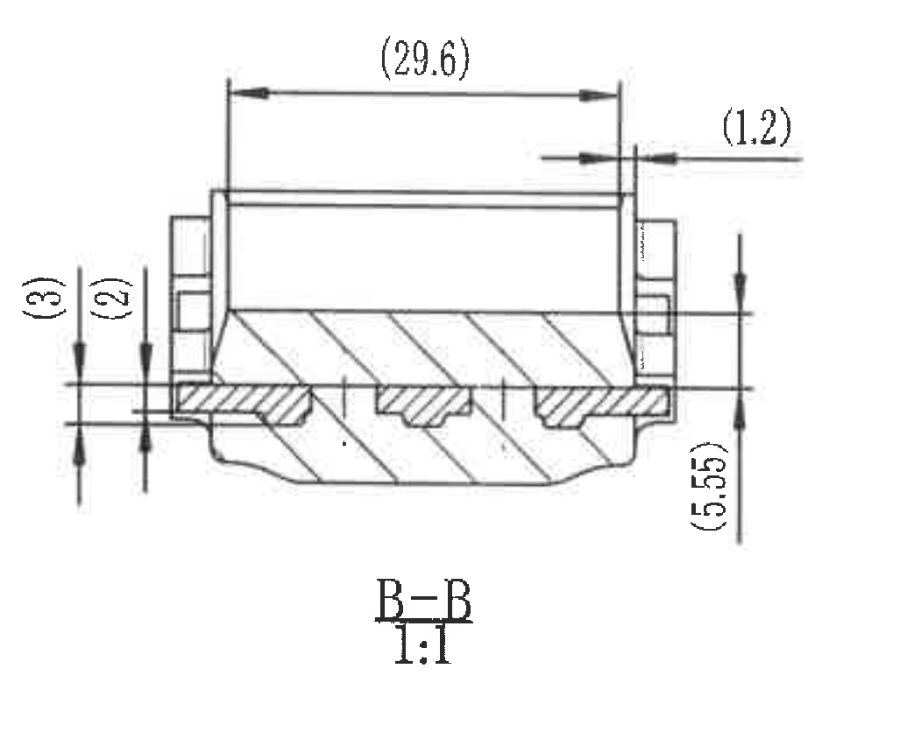

- 原图位置/视图名称：第1页；B-B剖视图 1:1；bbox=[765, 2785, 1800, 3645]。
| 提取项 | 原图数值或文本 | 含义说明 |
|---|---|---|
| 视图名/比例 | B-B 1:1 | B-B剖视图，比例1:1。 |
| 参考总长 | (29.6) | 剖视图上方总体长度参考尺寸。 |
| 参考尺寸 | (1.2) | 右上局部台阶/边距参考尺寸。 |
| 参考尺寸 | (3) | 左侧上部竖向参考尺寸。 |
| 参考尺寸 | (2) | 左侧下部竖向参考尺寸。 |
| 参考高度 | (5.55) | 右侧竖向参考高度。 |

- 边界归属说明：第1页左下中部B-B剖视图。裁切完整包含剖面、剖面线、所有尺寸线、箭头和B-B 1:1标题；没有混入C或D局部详图。

## object_9 - C局部详图 2:1

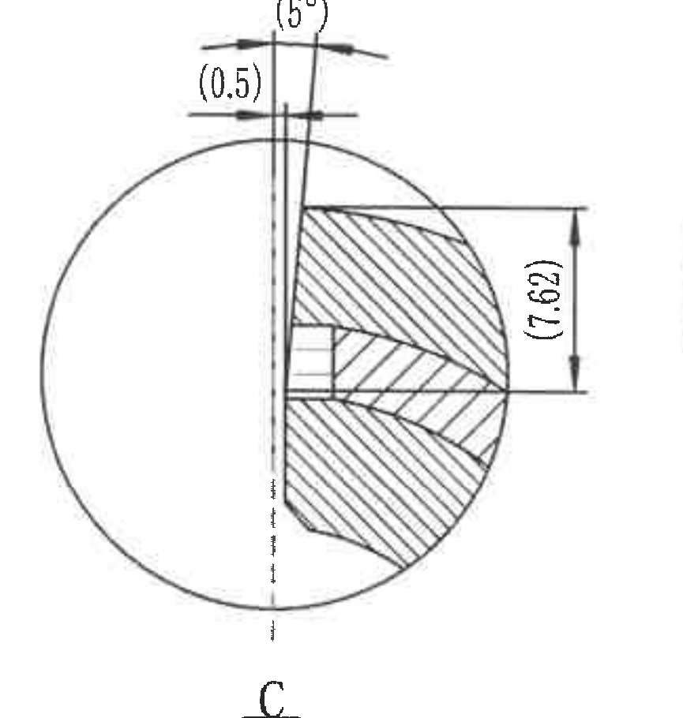

- 原图位置/视图名称：第1页；C局部详图 2:1；bbox=[1930, 2755, 2795, 3665]。
| 提取项 | 原图数值或文本 | 含义说明 |
|---|---|---|
| 视图名/比例 | C 2:1 | C局部放大图，比例2:1。 |
| 参考角度 | (5°) | 上方斜面/拔模角参考角度。 |
| 参考尺寸 | (0.5) | 上方局部偏移/厚度参考尺寸。 |
| 参考高度 | (7.62) | 右侧竖向参考尺寸。 |

- 边界归属说明：第1页下中部C局部详图。裁切包含C 2:1标题、圆形放大区域、剖面线及全部参考尺寸；右侧D局部详图已排除。

## object_10 - D局部详图 2:1

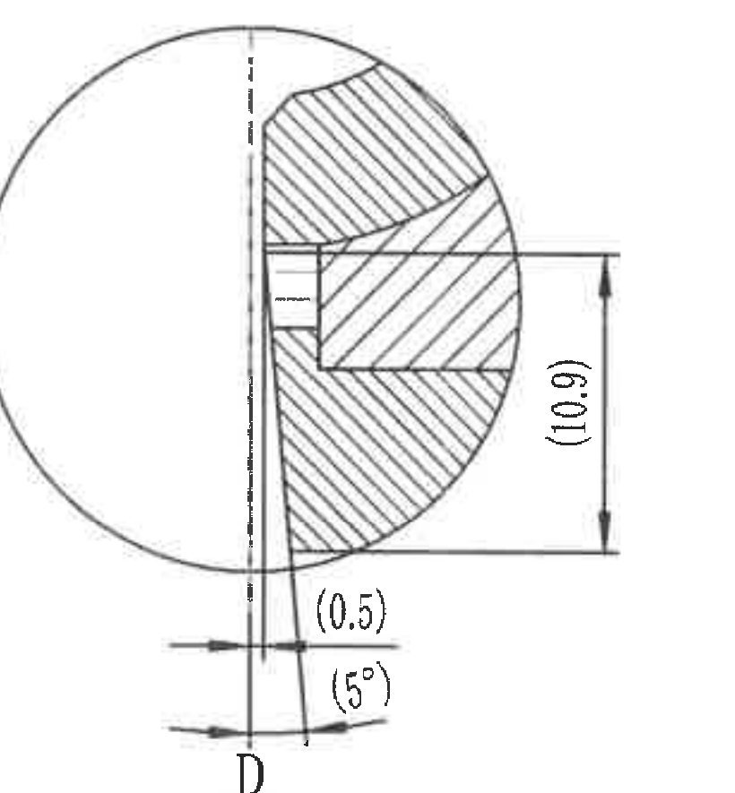

- 原图位置/视图名称：第1页；D局部详图 2:1；bbox=[2825, 2790, 3645, 3675]。
| 提取项 | 原图数值或文本 | 含义说明 |
|---|---|---|
| 视图名/比例 | D 2:1 | D局部放大图，比例2:1。 |
| 参考高度 | (10.9) | 右侧竖向参考尺寸。 |
| 参考尺寸 | (0.5) | 下方局部偏移/厚度参考尺寸。 |
| 参考角度 | (5°) | 下方斜面/拔模角参考角度。 |

- 边界归属说明：第1页下中右部D局部详图。裁切包含D 2:1标题、圆形放大区域、剖面线及全部参考尺寸；右侧明细表边线已尽量排除。

## object_11 - DIN ISO 3302-1 Class M2一般公差表

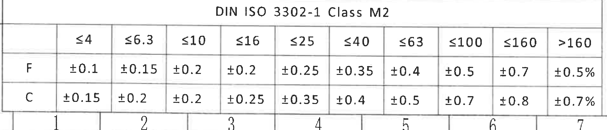

- 原图位置/视图名称：第1页；DIN ISO 3302-1 Class M2一般公差表；bbox=[515, 3980, 3050, 4525]。
- 原表行列还原：

| DIN ISO 3302-1 Class M2 | ≤4 | ≤6.3 | ≤10 | ≤16 | ≤25 | ≤40 | ≤63 | ≤100 | ≤160 | >160 |
| --- | --- | --- | --- | --- | --- | --- | --- | --- | --- | --- |
| F | ±0.1 | ±0.15 | ±0.2 | ±0.2 | ±0.25 | ±0.35 | ±0.4 | ±0.5 | ±0.7 | ±0.5% |
| C | ±0.15 | ±0.2 | ±0.2 | ±0.25 | ±0.35 | ±0.4 | ±0.5 | ±0.7 | ±0.8 | ±0.7% |

| 提取项 | 原图数值或文本 | 含义说明 |
|---|---|---|
| 标准 | DIN ISO 3302-1 Class M2 | 一般公差等级表。 |
| F行公差 | ±0.1/±0.15/±0.2/±0.2/±0.25/±0.35/±0.4/±0.5/±0.7/±0.5% | F类别各尺寸段公差。 |
| C行公差 | ±0.15/±0.2/±0.2/±0.25/±0.35/±0.4/±0.5/±0.7/±0.8/±0.7% | C类别各尺寸段公差。 |

- 边界归属说明：第1页左下角一般公差表。裁切完整包含表题、所有列宽范围、F/C两行公差；四周图框坐标不属于表格内容。

## object_12 - 明细表/BOM

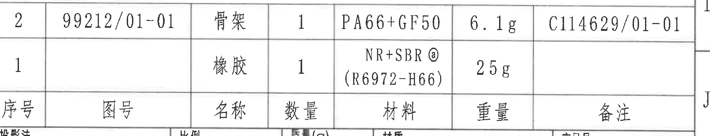

- 原图位置/视图名称：第1页；明细表/BOM；bbox=[3745, 3190, 6445, 3710]。
- 原表行列还原：

| 序号 | 图号 | 名称 | 数量 | 材料 | 重量 | 备注 |
| --- | --- | --- | --- | --- | --- | --- |
| 2 | 99212/01-01 | 骨架 | 1 | PA66+GF50 | 6.1g | C114629/01-01 |
| 1 |  | 橡胶 | 1 | NR+SBRⓐ (R6972-H66) | 25g |  |

| 提取项 | 原图数值或文本 | 含义说明 |
|---|---|---|
| 明细行2 | 2 / 99212/01-01 / 骨架 / 1 / PA66+GF50 / 6.1g / C114629/01-01 | 骨架件明细。 |
| 明细行1 | 1 / 橡胶 / 1 / NR+SBRⓐ (R6972-H66) / 25g | 橡胶件明细，材料与ⓐ技术要求关联。 |

- 边界归属说明：第1页右下明细表，上接技术要求区域、下接标题栏。原图表头在明细行下方，Markdown中按字段作为表头还原；裁切包含两行明细和表头。

## object_13 - 标题栏

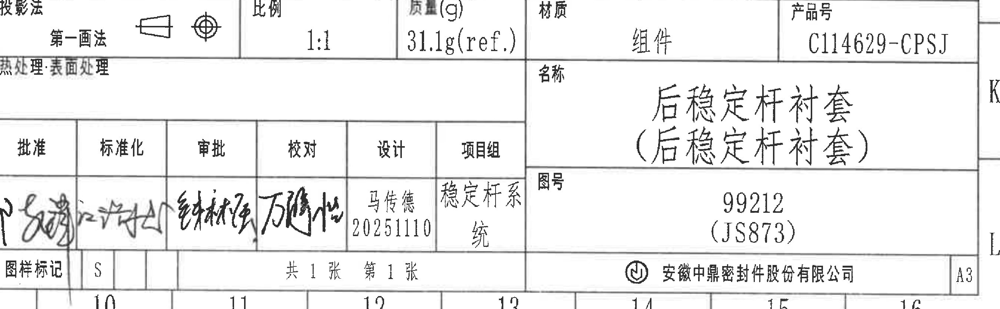

- 原图位置/视图名称：第1页；标题栏；bbox=[3745, 3690, 6445, 4525]。
- 原表行列还原：

| 字段 | 原图数值或文本 |
|---|---|
| 投影法 | 第一画法 |
| 比例 | 1:1 |
| 质量(g) | 31.1g(ref.) |
| 材质 | 组件 |
| 产品号 | C114629-CPSJ |
| 名称 | 后稳定杆衬套（后稳定杆衬套） |
| 图号 | 99212（JS873） |
| 设计 | 马传德 20251110 |
| 项组 | 稳定杆系统 |
| 图样标记 | S |
| 张数 | 共1张 第1张 |
| 公司 | 安徽中鼎密封件股份有限公司 |
| 图幅 | A3 |

| 签批字段 | 原图数值或文本 |
|---|---|
| 批准 | 手写签名，扫描不可可靠辨认 |
| 标准化 | 手写签名，扫描不可可靠辨认 |
| 审批 | 手写签名，扫描不可可靠辨认 |
| 校对 | 手写签名，扫描不可可靠辨认 |

| 提取项 | 原图数值或文本 | 含义说明 |
|---|---|---|
| 投影法 | 第一画法 | 投影方法标识。 |
| 比例 | 1:1 | 图样比例。 |
| 质量(g) | 31.1g(ref.) | 组件参考质量，ref.表示参考值。 |
| 材质 | 组件 | 标题栏材质/对象类型。 |
| 产品号 | C114629-CPSJ | 产品编号。 |
| 名称 | 后稳定杆衬套（后稳定杆衬套） | 图样名称。 |
| 图号 | 99212（JS873） | 图号及括号内参考/客户代号。 |
| 设计 | 马传德 20251110 | 设计人员和日期。 |
| 项组 | 稳定杆系统 | 项目组。 |
| 图样标记 | S | 图样标记。 |
| 张数 | 共1张 第1张 | 页数信息。 |
| 公司 | 安徽中鼎密封件股份有限公司 | 出图/公司名称。 |
| 图幅 | A3 | 图纸幅面。 |

- 边界归属说明：第1页右下标题栏。裁切包含标题栏全部主要字段、签批栏、名称、图号、公司和图幅；上方明细表已另裁为object_12。部分签名为手写，无法可靠转写姓名，按“手写签名/不可辨”记录。

## 裁切检查记录

| 对象 | 图片 | 检查记录 |
|---|---|---|
| object_1 | outputs/20C114629_assets/images/object_1.png | 完整包含完全代用品信息表表头和两行空白记录；未截断网格线；相邻白色点标识说明已排除。 |
| object_14 | outputs/20C114629_assets/images/object_14.png | 完整包含产品图号、孔径A、对应杆径B、材料、硬度、颜色标识及数据行；未带入装配示意图。 |
| object_2 | outputs/20C114629_assets/images/object_2.png | 完整包含白色点标识文字、引线、装配状态图、X/Y/Z坐标轴和图题；左侧残留表格边线不提取。 |
| object_3 | outputs/20C114629_assets/images/object_3.png | 完整包含修订履历表表头和A/B/C三行记录；无文字截断。 |
| object_4 | outputs/20C114629_assets/images/object_4.png | 完整包含技术要求标题和1至8条文本；未截断行尾主要文字；相邻硬度位置图与明细表另行裁切。 |
| object_5 | outputs/20C114629_assets/images/object_5.png | 完整包含主视图、A-A/B-B剖切箭头、(1.5)、32±0.35△C、37±0.35及尺寸线。 |
| object_6 | outputs/20C114629_assets/images/object_6.png | 完整包含A-A剖视图主体、尺寸线、箭头、C/D索引及A-A 1:1标题；右下硬度测量位置文字边缘不归属本对象。 |
| object_7 | outputs/20C114629_assets/images/object_7.png | 完整包含产品硬度测量位置图、引线和文字；左侧少量R5残边属于A-A剖视图，不提取。 |
| object_8 | outputs/20C114629_assets/images/object_8.png | 完整包含B-B剖视图、剖面线、(29.6)、(1.2)、(3)、(2)、(5.55)及标题。 |
| object_9 | outputs/20C114629_assets/images/object_9.png | 完整包含C局部详图、(5°)、(0.5)、(7.62)和C 2:1标题；未归入D详图尺寸。 |
| object_10 | outputs/20C114629_assets/images/object_10.png | 完整包含D局部详图、(10.9)、(0.5)、(5°)和D 2:1标题；未提取右侧明细表边线。 |
| object_11 | outputs/20C114629_assets/images/object_11.png | 完整包含DIN ISO 3302-1 Class M2一般公差表表题、列范围和F/C两行。 |
| object_12 | outputs/20C114629_assets/images/object_12.png | 完整包含明细表两行物料和表头；上接技术要求、下接标题栏但字段归属清楚。 |
| object_13 | outputs/20C114629_assets/images/object_13.png | 完整包含标题栏主要字段、签批栏、名称、图号、公司和A3图幅；上方明细表另为object_12。 |
