# 20C114641 PDF 内容识别

整页渲染图：`outputs/20C114641_assets/images/page_1.png`

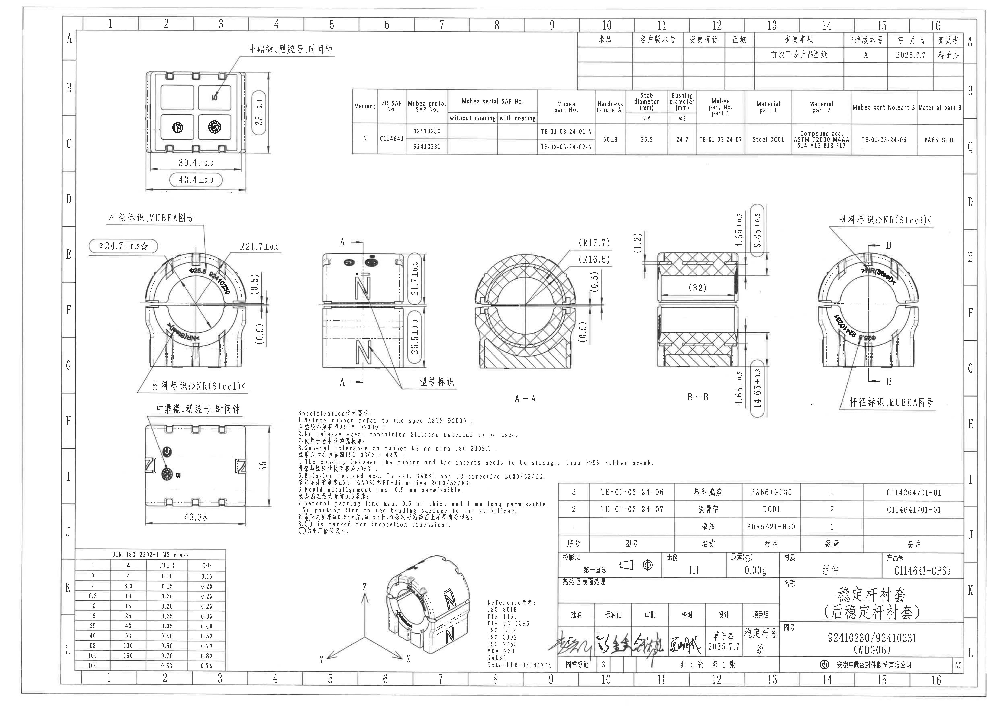

## object_1 顶部左侧俯视加工视图

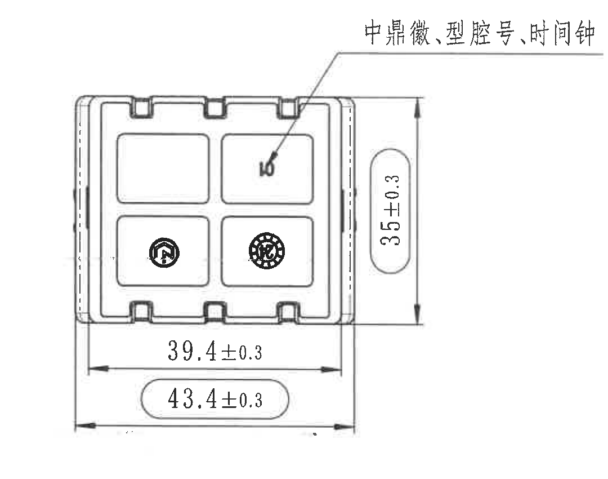

原图位置/视图名称：第 1 页，左上区域，俯视加工视图，带中鼎徽、型腔号、时间钟引出标识。

| 提取项 | 原图数值或文本 | 含义说明 |
|---|---|---|
| 竖向外形高度 | 35±0.3 | 该俯视方向的外形高度尺寸，公差 ±0.3。 |
| 内侧横向尺寸 | 39.4±0.3 | 视图下方内侧宽度尺寸，尺寸线箭头落在主体两侧内边界。 |
| 外侧横向尺寸 | 43.4±0.3 | 视图最下方外侧总宽度尺寸，带圆角框强调，公差 ±0.3。 |
| 引出文字 | 中鼎徽、型腔号、时间钟 | 引线指向零件表面标识位置，说明该处需要包含中鼎徽、型腔号和时间钟。 |
| 标识图案 | 中鼎徽、圆形时间钟/型腔图案 | 位于俯视图下方两个腔格内，为图案标识，不是尺寸。 |

边界归属说明：裁切包含完整 35±0.3、39.4±0.3、43.4±0.3 尺寸线、箭头和引出文字；下方左中主视图的“杆径标识、MUBEA图号”不归入本视图。

## object_2 右上修订履历表

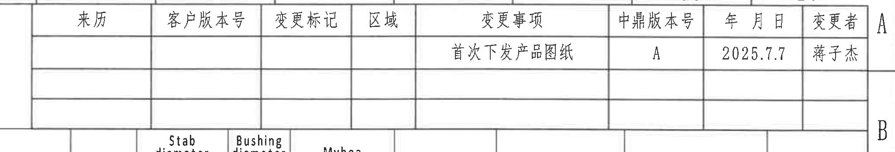

原图位置/视图名称：第 1 页，右上区域，修订履历表。

| 来历 | 客户版本号 | 变更标记 | 区域 | 变更事项 | 中鼎版本号 | 年 月 日 | 变更者 |
|---|---|---|---|---|---|---|---|
|  |  |  |  | 首次下发产品图纸 | A | 2025.7.7 | 蒋子杰 |
|  |  |  |  |  |  |  |  |
|  |  |  |  |  |  |  |  |

| 提取项 | 原图数值或文本 | 含义说明 |
|---|---|---|
| 表格对象 | 修订履历 | 记录版本、变更事项、版本号、日期和变更者。 |
| 中鼎版本号 | A | 本图当前中鼎版本为 A。 |
| 日期 | 2025.7.7 | 修订履历中的发布日期。 |
| 变更者 | 蒋子杰 | 修订履历中的变更人员。 |

边界归属说明：裁切仅覆盖右上修订履历表，底部参数表的表头不属于本对象。

## object_3 上方产品参数表

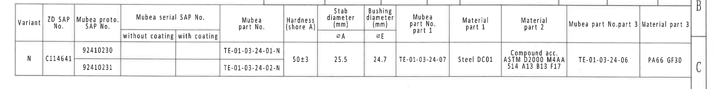

原图位置/视图名称：第 1 页，上方中右区域，产品参数/材料/零件号表。

| Variant | ZD SAP No. | Mubea proto. SAP No. | Mubea serial SAP No. without coating | Mubea serial SAP No. with coating | Mubea part No. | Hardness (shore A) | Stab diameter (mm) ØA | Bushing diameter (mm) ØE | Mubea part No. part 1 | Material part 1 | Material part 2 | Mubea part No.part 3 | Material part 3 |
|---|---|---|---|---|---|---|---|---|---|---|---|---|---|
| N | C114641 | 92410230 |  |  | TE-01-03-24-01-N | 50±3 | 25.5 | 24.7 | TE-01-03-24-07 | Steel DC01 | Compound acc. ASTM D2000 M4AA 514 A13 B13 F17 | TE-01-03-24-06 | PA66 GF30 |
| N | C114641 | 92410231 |  |  | TE-01-03-24-02-N | 50±3 | 25.5 | 24.7 | TE-01-03-24-07 | Steel DC01 | Compound acc. ASTM D2000 M4AA 514 A13 B13 F17 | TE-01-03-24-06 | PA66 GF30 |

| 提取项 | 原图数值或文本 | 含义说明 |
|---|---|---|
| Variant | N | 变型代号。 |
| ZD SAP No. | C114641 | 中鼎 SAP 编号。 |
| Mubea proto. SAP No. | 92410230 / 92410231 | Mubea 原型 SAP 编号，两行分别对应两个原型号。 |
| Mubea part No. | TE-01-03-24-01-N / TE-01-03-24-02-N | 两行对应的 Mubea 零件号。 |
| Hardness (shore A) | 50±3 | 橡胶硬度，邵氏 A，公差 ±3。 |
| Stab diameter ØA | 25.5 | 稳定杆直径，单位 mm。 |
| Bushing diameter ØE | 24.7 | 衬套内径/配合直径，单位 mm。 |
| Mubea part No. part 1 | TE-01-03-24-07 | 部件 1 Mubea 零件号。 |
| Material part 1 | Steel DC01 | 部件 1 材料。 |
| Material part 2 | Compound acc. ASTM D2000 M4AA 514 A13 B13 F17 | 部件 2 橡胶/胶料规范。 |
| Mubea part No.part 3 | TE-01-03-24-06 | 部件 3 Mubea 零件号。 |
| Material part 3 | PA66 GF30 | 部件 3 材料。 |

边界归属说明：裁切包含完整参数表外框、表头和两行数据；不包含右上修订履历表和中部视图尺寸。

## object_4 左中主加工视图

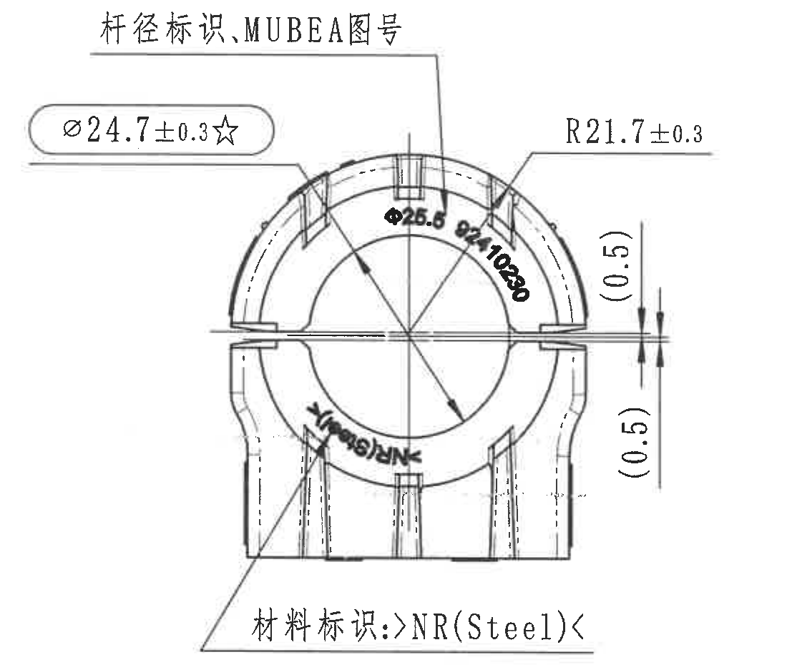

原图位置/视图名称：第 1 页，左中区域，开口圆形主加工视图。

| 提取项 | 原图数值或文本 | 含义说明 |
|---|---|---|
| 关键直径 | Ø24.7±0.3☆ | 带星号关键尺寸；引线指向内圆/衬套配合直径，公差 ±0.3。 |
| 半径 | R21.7±0.3 | 外圆弧半径标注，公差 ±0.3。 |
| 上侧缝隙参考尺寸 | (0.5) | 括号内参考尺寸，标注在右侧上半部开口附近，表示参考缝隙/间隙。 |
| 下侧缝隙参考尺寸 | (0.5) | 括号内参考尺寸，标注在右侧下半部开口附近，表示参考缝隙/间隙。 |
| 杆径标识、MUBEA图号 | 杆径标识、MUBEA图号 | 引线指向上部弧面印字区域，说明该处应有杆径标识和 MUBEA 图号。 |
| 材料标识 | 材料标识: >NR(Steel)< | 引线指向下部弧面材料标识位置，表示橡胶/钢件相关材料标识。 |
| 弧面印字 | Ø25.5、Ø24 10230、>NR(Steel)<（按图面可见文字记录） | 弧形印字在视图内部，不作为尺寸线；用于标识杆径、图号或材料。 |

边界归属说明：裁切包含本主视图的尺寸线、箭头、引线和上下标识文字；下方另一俯视视图的“中鼎徽、型腔号、时间钟”不属于本对象，未纳入最终裁切。

## object_5 中间侧视加工视图

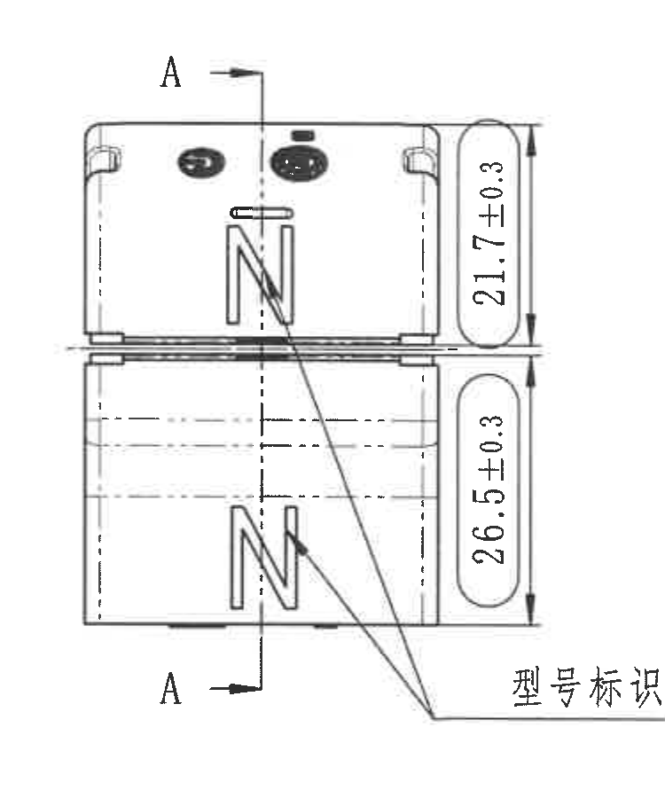

原图位置/视图名称：第 1 页，中部偏左，侧视加工视图，含 A-A 剖切位置。

| 提取项 | 原图数值或文本 | 含义说明 |
|---|---|---|
| 上部高度 | 21.7±0.3 | 上半部分高度尺寸，公差 ±0.3。 |
| 下部高度 | 26.5±0.3 | 下半部分高度尺寸，公差 ±0.3。 |
| 剖切标识 | A / A | A-A 剖切位置与方向标识，不是尺寸。 |
| 型号标识 | 型号标识 | 引线指向侧面“N”字形型号标识位置。 |
| 内部虚线 | 隐藏轮廓线 | 表示侧视内侧不可见结构轮廓。 |

边界归属说明：右边界重裁后未带入 A-A 剖面实体；21.7±0.3、26.5±0.3 及 A-A 剖切箭头完整保留。

## object_6 A-A 剖面视图

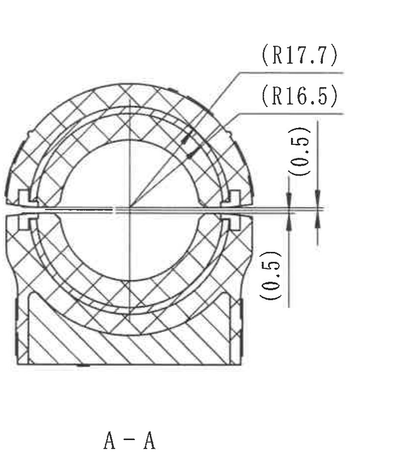

原图位置/视图名称：第 1 页，中部，A-A 剖面视图。

| 提取项 | 原图数值或文本 | 含义说明 |
|---|---|---|
| 剖面名称 | A-A | 对应 object_5 中的 A-A 剖切位置。 |
| 参考外圆半径 | (R17.7) | 括号内参考半径，表示剖面外侧弧形参考半径。 |
| 参考内侧半径 | (R16.5) | 括号内参考半径，表示剖面内侧弧形参考半径。 |
| 上侧缝隙参考尺寸 | (0.5) | 括号内参考尺寸，位于剖面右侧上半开口处。 |
| 下侧缝隙参考尺寸 | (0.5) | 括号内参考尺寸，位于剖面右侧下半开口处。 |
| 剖面填充 | 交叉剖面线/斜剖面线 | 表示不同材料或剖切实体区域。 |

边界归属说明：裁切左边界已重裁，去除相邻 B-B 标注残片；本对象只提取 A-A 剖面中的参考半径和缝隙参考尺寸。

## object_7 B-B 剖面视图

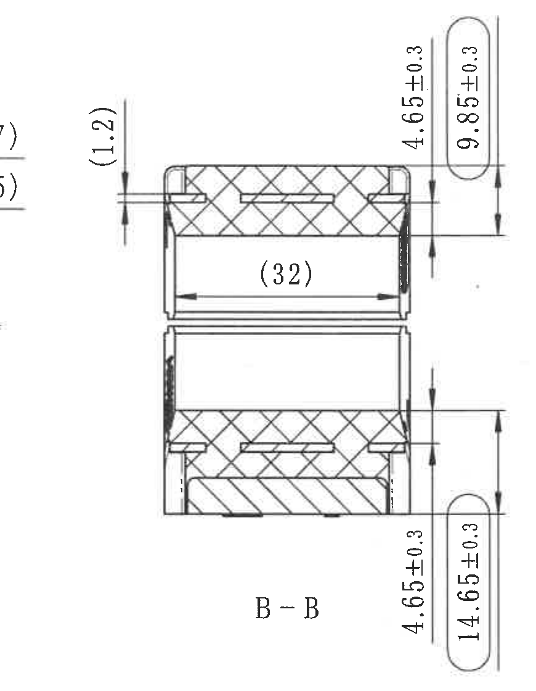

原图位置/视图名称：第 1 页，中右区域，B-B 剖面视图。

| 提取项 | 原图数值或文本 | 含义说明 |
|---|---|---|
| 剖面名称 | B-B | 对应 object_8 中的 B-B 剖切位置。 |
| 上侧局部厚度参考尺寸 | (1.2) | 括号内参考尺寸，标注在左上局部开槽/层厚附近。 |
| 上部局部高度 | 4.65±0.3 | 右上竖向尺寸，公差 ±0.3。 |
| 上部总高度 | 9.85±0.3 | 右上圆角框内竖向尺寸，公差 ±0.3。 |
| 内部宽度参考尺寸 | (32) | 括号内参考尺寸，表示剖面内部横向距离。 |
| 下部局部高度 | 4.65±0.3 | 右下竖向尺寸，公差 ±0.3。 |
| 下部总高度 | 14.65±0.3 | 右下圆角框内竖向尺寸，公差 ±0.3。 |
| 剖面填充 | 交叉剖面线/斜剖面线 | 表示不同材料或剖切实体区域。 |

边界归属说明：裁切包含完整 B-B 剖面、尺寸线和箭头；左侧 A-A 参考半径标注不归入 B-B，仅在边缘有局部空白分隔。

## object_8 右侧主加工视图

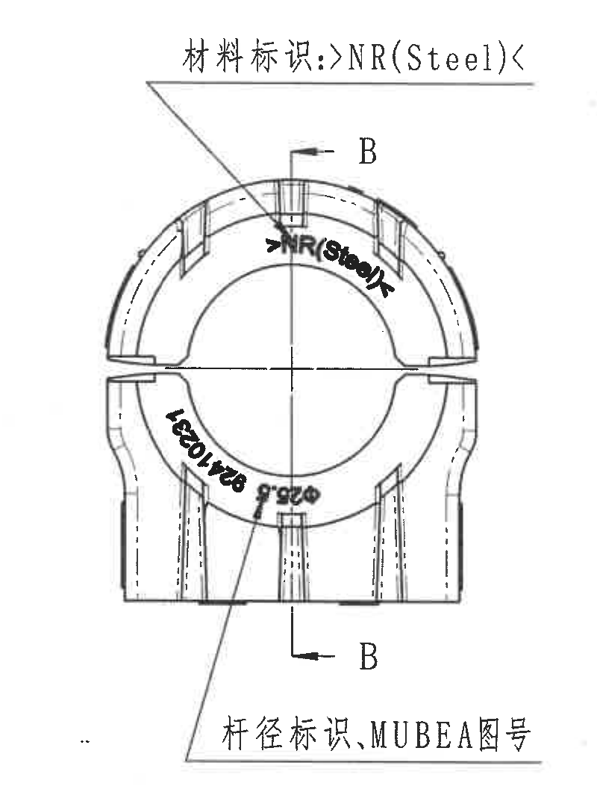

原图位置/视图名称：第 1 页，右中区域，带 B-B 剖切位置的主加工视图。

| 提取项 | 原图数值或文本 | 含义说明 |
|---|---|---|
| 剖切标识 | B / B | 指示 B-B 剖面位置和方向，对应 object_7。 |
| 材料标识 | 材料标识: >NR(Steel)< | 引线指向上部弧面材料标识。 |
| 杆径标识、MUBEA图号 | 杆径标识、MUBEA图号 | 引线指向下部弧面印字区域。 |
| 弧面印字 | >NR(Steel)<、Ø25.5、92410231（按图面可见文字记录） | 印在弧面上的标识文本，不作为尺寸线。 |
| 中心线 | 横向/纵向中心线 | 用于表达对称和剖切基准位置。 |

边界归属说明：右边界重裁后未带入图框边格；本对象只包含右侧主视图的标识、剖切字母和弧面印字，B-B 剖面尺寸归入 object_7。

## object_9 左下俯视加工视图

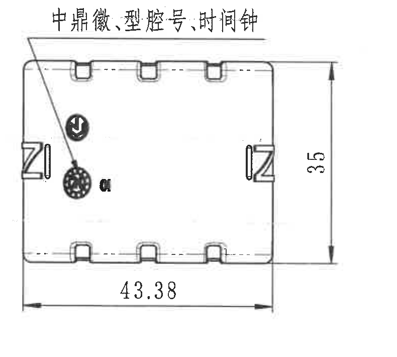

原图位置/视图名称：第 1 页，左下区域，俯视加工视图。

| 提取项 | 原图数值或文本 | 含义说明 |
|---|---|---|
| 竖向高度 | 35 | 右侧竖向尺寸，未在图面给出显式公差。 |
| 横向宽度 | 43.38 | 下方横向尺寸，未在图面给出显式公差。 |
| 引出文字 | 中鼎徽、型腔号、时间钟 | 引线指向左侧内部标识图案。 |
| 标识图案 | 中鼎徽、时间钟/型腔号图案 | 表面标识，不作为尺寸。 |

边界归属说明：底边重裁后去除下方 DIN ISO 3302-1 公差表表线；保留 43.38 尺寸线和 35 尺寸线完整。

## object_10 NOTES / Specification 技术要求

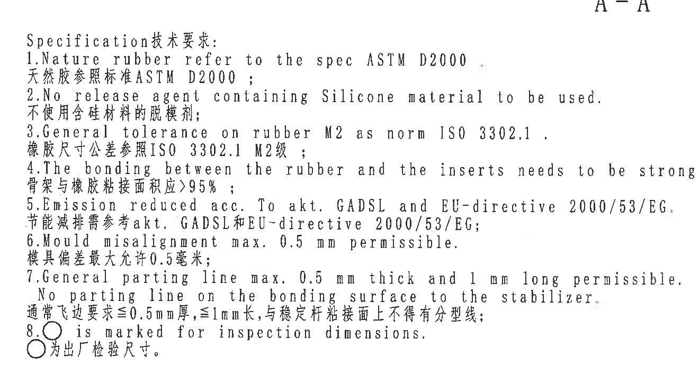

原图位置/视图名称：第 1 页，中下偏左，Specification 技术要求文本。

| 提取项 | 原图数值或文本 | 含义说明 |
|---|---|---|
| 标题 | Specification 技术要求: | 技术要求区标题。 |
| 1 | Nature rubber refer to the spec ASTM D2000 / 天然胶参照标准 ASTM D2000； | 天然胶按 ASTM D2000 规范。 |
| 2 | No release agent containing Silicone material to be used. / 不使用含硅材料的脱模剂； | 禁止使用含硅脱模剂。 |
| 3 | General tolerance on rubber M2 as norm ISO 3302.1. / 橡胶尺寸公差参照 ISO 3302.1 M2级； | 橡胶件一般公差采用 ISO 3302.1 M2。 |
| 4 | The bonding between the rubber and the inserts needs to be stronger than >95% rubber break. / 骨架与橡胶粘接面积应 >95%； | 橡胶与嵌件粘接强度/破坏面积要求。 |
| 5 | Emission reduced acc. To akt. GADSL and EU-directive 2000/53/EG. / 节能减排需参考 akt. GADSL 和 EU-directive 2000/53/EG； | 排放/法规符合性要求。 |
| 6 | Mould misalignment max. 0.5 mm permissible. / 模具偏差最大允许 0.5 毫米； | 模具错位允许值。 |
| 7 | General parting line max. 0.5 mm thick and 1 mm long permissible. No parting line on the bonding surface to the stabilizer. / 通常飞边要求 ≤0.5mm 厚，≤1mm 长，与稳定杆粘接面上不得有分型线； | 飞边/分型线要求。 |
| 8 | ○ is marked for inspection dimensions. / ○ 为出厂检验尺寸。 | 圆圈标识表示检验尺寸。 |

边界归属说明：裁切覆盖完整 1-8 条技术要求；上方 A-A 标题残留不参与本对象提取，右下等轴测图不归入 NOTES。

## object_11 DIN ISO 3302-1 M2 class 公差表

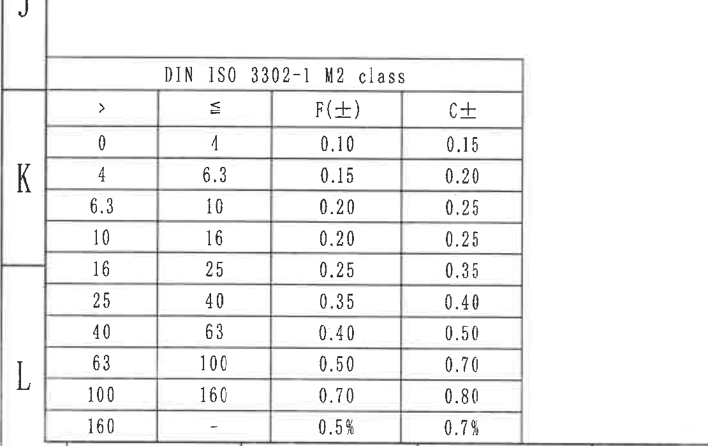

原图位置/视图名称：第 1 页，左下角，DIN ISO 3302-1 M2 class 公差表。

| DIN ISO 3302-1 M2 class |  |  |  |
|---|---|---|---|
| > | ≤ | F(±) | C± |
| 0 | 4 | 0.10 | 0.15 |
| 4 | 6.3 | 0.15 | 0.20 |
| 6.3 | 10 | 0.20 | 0.25 |
| 10 | 16 | 0.20 | 0.25 |
| 16 | 25 | 0.25 | 0.35 |
| 25 | 40 | 0.35 | 0.40 |
| 40 | 63 | 0.40 | 0.50 |
| 63 | 100 | 0.50 | 0.70 |
| 100 | 160 | 0.70 | 0.80 |
| 160 | - | 0.5% | 0.7% |

| 提取项 | 原图数值或文本 | 含义说明 |
|---|---|---|
| 表名 | DIN ISO 3302-1 M2 class | 橡胶尺寸一般公差表。 |
| F(±) | 0.10 至 0.70、末行 0.5% | F 级公差列。 |
| C± | 0.15 至 0.80、末行 0.7% | C 级公差列。 |

边界归属说明：裁切仅包含左下 DIN ISO 3302-1 M2 公差表，未包含上方俯视图尺寸。

## object_12 等轴测参考图 / Reference

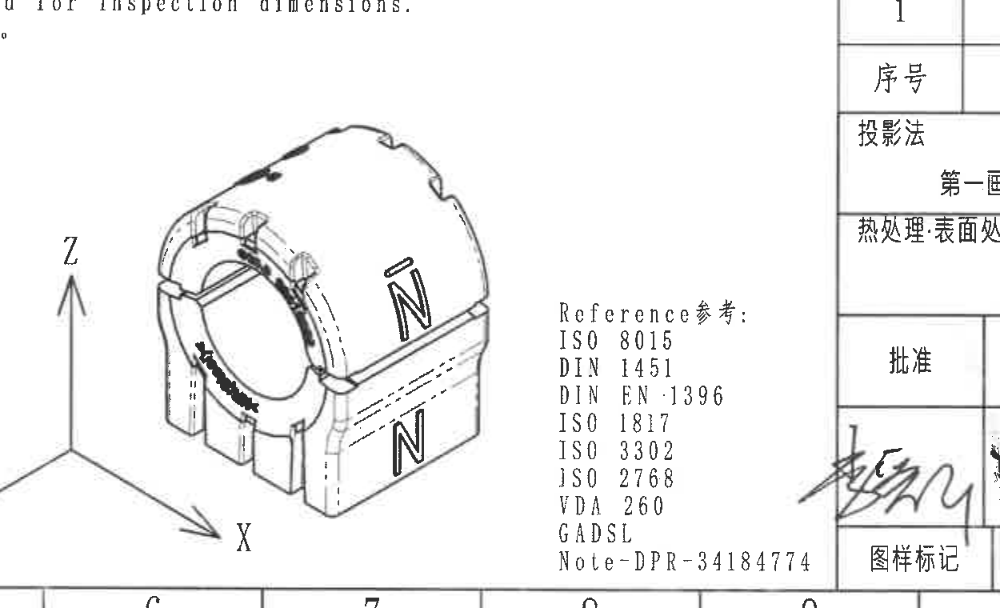

原图位置/视图名称：第 1 页，底部中间，等轴测参考图和标准参考列表。

| 提取项 | 原图数值或文本 | 含义说明 |
|---|---|---|
| 等轴测图 | 零件三维外形参考图 | 展示衬套组件外形、开口、侧面 N 标识和弧形轮廓。 |
| 坐标轴 | X / Y / Z | 等轴测方向指示。 |
| Reference参考 | ISO 8015; DIN 1451; DIN EN 1396; ISO 1817; ISO 3302; JSQ 2768; VDA 260; GADSL; Note-DPR-34184774 | 图面引用标准和参考文件列表。 |

边界归属说明：裁切包含完整等轴测图、XYZ 坐标和右侧 Reference 列表；不把上方 NOTES 或右侧标题栏内容归入该对象。

## object_13 右下明细表

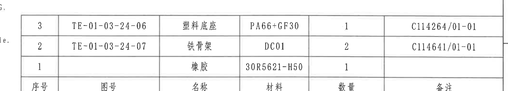

原图位置/视图名称：第 1 页，右下标题栏上方，BOM/明细表。

| 序号 | 图号 | 名称 | 材料 | 数量 | 备注 |
|---|---|---|---|---|---|
| 3 | TE-01-03-24-06 | 塑料底座 | PA66+GF30 | 1 | C114264/01-01 |
| 2 | TE-01-03-24-07 | 铁骨架 | DC01 | 2 | C114641/01-01 |
| 1 |  | 橡胶 | 30R5621-H50 | 1 |  |

| 提取项 | 原图数值或文本 | 含义说明 |
|---|---|---|
| 明细表 | 序号 1-3 | 组件由橡胶、铁骨架、塑料底座组成。 |
| 塑料底座 | TE-01-03-24-06 / PA66+GF30 / 数量 1 | 部件 3。 |
| 铁骨架 | TE-01-03-24-07 / DC01 / 数量 2 | 部件 2。 |
| 橡胶 | 30R5621-H50 / 数量 1 | 部件 1。 |

边界归属说明：裁切包含完整明细表三行及表头；下方投影法、比例、产品号等标题栏内容归入 object_14。

## object_14 右下标题栏

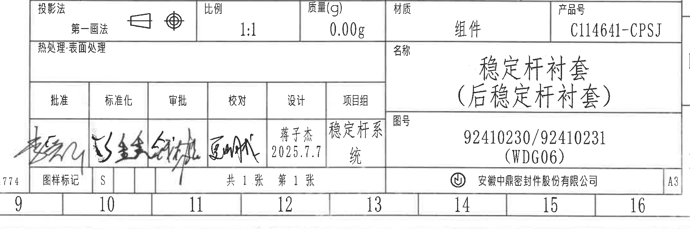

原图位置/视图名称：第 1 页，右下角标题栏和签批栏。

| 字段 | 原图数值或文本 | 含义说明 |
|---|---|---|
| 投影法 | 第一画法 | 第一角投影，旁有投影符号。 |
| 比例 | 1:1 | 图样比例。 |
| 质量(g) | 0.00g | 标注质量。 |
| 材质 | 组件 | 产品材质/对象类别为组件。 |
| 产品号 | C114641-CPSJ | 产品编号。 |
| 热处理·表面处理 | 空白 | 图面该栏未填写具体处理。 |
| 名称 | 稳定杆衬套（后稳定杆衬套） | 产品名称。 |
| 图号 | 92410230/92410231 (WDG06) | 图纸/产品图号。 |
| 批准 | 签名 | 签批栏。 |
| 标准化 | 签名 | 签批栏。 |
| 审批 | 签名 | 签批栏。 |
| 校对 | 签名 | 签批栏。 |
| 设计 | 蒋子杰 2025.7.7 | 设计人员和日期。 |
| 项目组 | 稳定杆系统 | 项目组名称。 |
| 图样标记 | S | 图样标记。 |
| 页数 | 共 1 张 第 1 张 | 图纸页数。 |
| 公司 | 安徽中鼎密封件股份有限公司 | 图纸所属公司。 |
| 图幅 | A3 | 图幅规格。 |

边界归属说明：裁切上边界收紧到标题栏起始行，避免带入明细表数据行；底部图框坐标 9-16 属于图框定位信息，不作为标题栏字段提取。

## 裁切检查记录

| 对象 | 图片路径 | 检查结果 |
|---|---|---|
| object_1 | outputs/20C114641_assets/images/object_1.png | 完整包含 35±0.3、39.4±0.3、43.4±0.3 尺寸线、箭头和引出文字；未混入左中主视图标注。 |
| object_2 | outputs/20C114641_assets/images/object_2.png | 完整包含修订履历表表头和三行表格；未混入参数表内容。 |
| object_3 | outputs/20C114641_assets/images/object_3.png | 完整包含参数表表头和两行数据；未混入中部视图尺寸。 |
| object_4 | outputs/20C114641_assets/images/object_4.png | 完整包含 Ø24.7±0.3☆、R21.7±0.3、两个 (0.5) 及标识引线；下方相邻视图未纳入。 |
| object_5 | outputs/20C114641_assets/images/object_5.png | 已重裁右边界，完整包含 A-A 剖切标识、21.7±0.3、26.5±0.3 和型号标识；未混入 A-A 剖面实体。 |
| object_6 | outputs/20C114641_assets/images/object_6.png | 已重裁左边界，完整包含 (R17.7)、(R16.5)、两个 (0.5) 和 A-A 标题；无 B-B 残片。 |
| object_7 | outputs/20C114641_assets/images/object_7.png | 完整包含 (1.2)、4.65±0.3、9.85±0.3、(32)、4.65±0.3、14.65±0.3 和 B-B 标题。 |
| object_8 | outputs/20C114641_assets/images/object_8.png | 已重裁右边界，完整包含 B-B 剖切标识和材料/杆径标识引线；未混入图框边格。 |
| object_9 | outputs/20C114641_assets/images/object_9.png | 已重裁底边，完整包含 35、43.38 和引出文字；未混入下方公差表。 |
| object_10 | outputs/20C114641_assets/images/object_10.png | 完整包含 Specification 技术要求 1-8 条；未把等轴测图归入 NOTES。 |
| object_11 | outputs/20C114641_assets/images/object_11.png | 完整包含 DIN ISO 3302-1 M2 class 表头和 10 行公差数据；未混入上方视图。 |
| object_12 | outputs/20C114641_assets/images/object_12.png | 完整包含等轴测图、XYZ 坐标和 Reference 列表；未混入标题栏。 |
| object_13 | outputs/20C114641_assets/images/object_13.png | 完整包含明细表表头和序号 1-3 数据；未混入标题栏字段。 |
| object_14 | outputs/20C114641_assets/images/object_14.png | 已重裁上边界，完整包含标题栏和签批栏主要字段；不提取图框坐标为业务字段。 |
