# 20C114642 PDF 内容识别与裁切提取

整页渲染图：

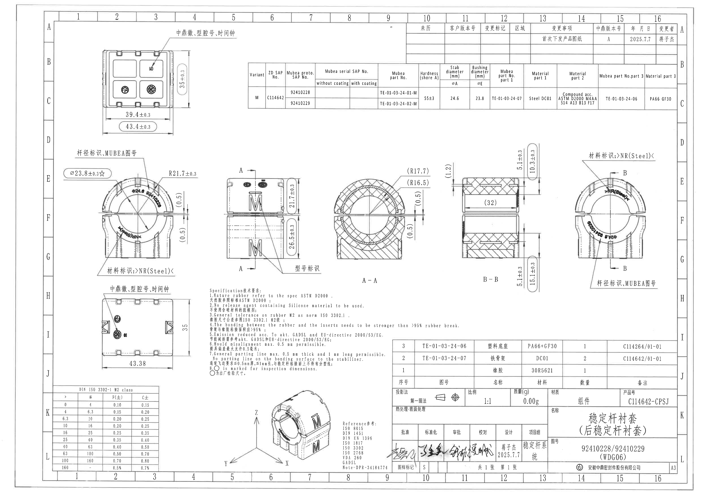

页面信息：1 页，整页 PNG `outputs/20C114642_assets/images/page_1.png`，尺寸 4959 x 3505 px。

## object_1 - 上方端面加工视图

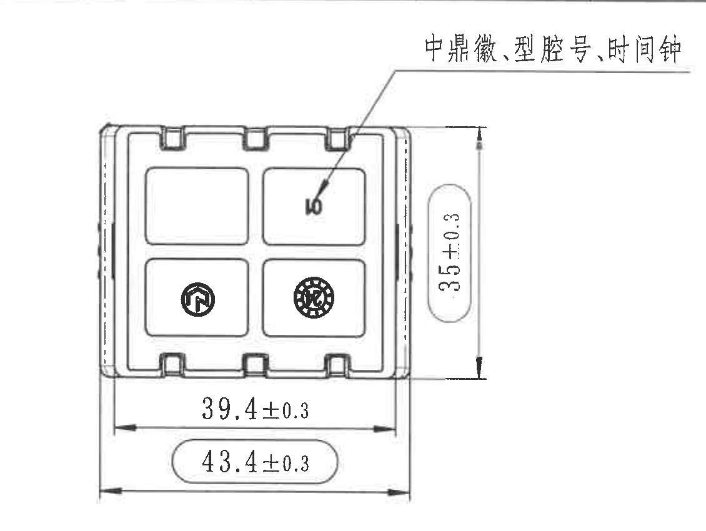

原图位置/视图名称：页 1，上方左侧，网格约 B-C / 2-4；上方端面加工视图。

提取表格：

| 提取项 | 原图数值或文本 | 含义说明 |
|---|---|---|
| 尺寸 | 35±0.3 | 右侧竖向总高度尺寸，表示该端面视图上下外缘高度，公差 ±0.3。 |
| 尺寸 | 39.4±0.3 | 下方内侧水平尺寸，表示内侧主体宽度，公差 ±0.3。 |
| 尺寸 | 43.4±0.3 | 下方外侧水平总宽度尺寸，椭圆圈出，表示外廓宽度，公差 ±0.3。 |
| 文字/引线 | 中鼎徽、型腔号、时间钟 | 引线指向端面内的标识区域，说明该处为中鼎徽、型腔号和时间钟标识。 |
| 图形标识 | 中鼎徽/时间钟图形 | 位于下排两个型腔内，为端面标识内容。 |

边界归属说明：裁切包含完整上方引线文字、右侧 35±0.3 尺寸线和底部 39.4±0.3、43.4±0.3 两条尺寸线；右侧未包含产品数据表，底部未包含下方主视图文字。

## object_2 - 修订履历表

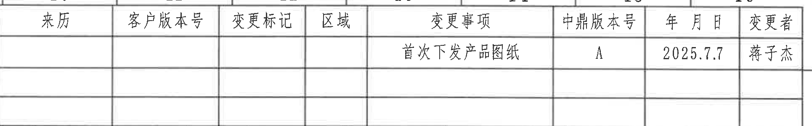

原图位置/视图名称：页 1，顶部右侧，网格约 A-B / 10-16；修订履历表。

原表还原：

| 来历 | 客户版本号 | 变更标记 | 区域 | 变更事项 | 中鼎版本号 | 年 月 日 | 变更者 |
|---|---|---|---|---|---|---|---|
|  |  |  |  | 首次下发产品图纸 | A | 2025.7.7 | 蒋子杰 |
|  |  |  |  |  |  |  |  |
|  |  |  |  |  |  |  |  |

提取表格：

| 提取项 | 原图数值或文本 | 含义说明 |
|---|---|---|
| 表头 | 来历 / 客户版本号 / 变更标记 / 区域 / 变更事项 / 中鼎版本号 / 年 月 日 / 变更者 | 修订履历字段。 |
| 修订记录 | 首次下发产品图纸；中鼎版本号 A；日期 2025.7.7；变更者 蒋子杰 | 当前图纸首发修订记录。 |

边界归属说明：裁切收在修订履历表底部边框内，未把下方产品数据表表头文字作为本表内容。

## object_3 - 产品数据表

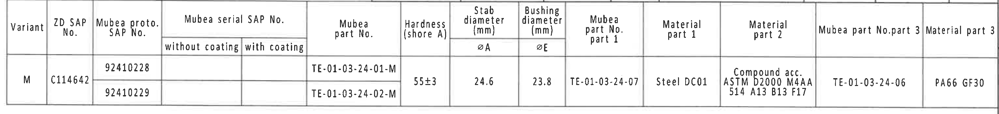

原图位置/视图名称：页 1，上方中右，网格约 B-C / 7-16；产品数据表。

原表还原：

| Variant | ZD SAP No. | Mubea proto. SAP No. | Mubea serial SAP No. without coating | Mubea serial SAP No. with coating | Mubea part No. | Hardness (shore A) | Stab diameter (mm) ØA | Bushing diameter (mm) ØE | Mubea part No. part 1 | Material part 1 | Material part 2 | Mubea part No.part 3 | Material part 3 |
|---|---|---|---|---|---|---|---|---|---|---|---|---|---|
| M | C114642 | 92410228 |  |  | TE-01-03-24-01-M | 55±3 | 24.6 | 23.8 | TE-01-03-24-07 | Steel DC01 | Compound acc. ASTM D2000 M4AA 514 A13 B13 F17 | TE-01-03-24-06 | PA66 GF30 |
| M | C114642 | 92410229 |  |  | TE-01-03-24-02-M | 55±3 | 24.6 | 23.8 | TE-01-03-24-07 | Steel DC01 | Compound acc. ASTM D2000 M4AA 514 A13 B13 F17 | TE-01-03-24-06 | PA66 GF30 |

提取表格：

| 提取项 | 原图数值或文本 | 含义说明 |
|---|---|---|
| Variant | M | 变型代号。 |
| ZD SAP No. | C114642 | 中鼎 SAP 编号。 |
| Mubea proto. SAP No. | 92410228 / 92410229 | Mubea 原型 SAP 号，两条记录分别对应两个图号。 |
| Mubea part No. | TE-01-03-24-01-M / TE-01-03-24-02-M | Mubea 零件号。 |
| Hardness (shore A) | 55±3 | 橡胶硬度，邵氏 A，公差 ±3。 |
| Stab diameter ØA | 24.6 | 稳定杆直径字段。 |
| Bushing diameter ØE | 23.8 | 衬套直径字段。 |
| Mubea part No. part 1 | TE-01-03-24-07 | 部件 1 编号。 |
| Material part 1 | Steel DC01 | 部件 1 材料。 |
| Material part 2 | Compound acc. ASTM D2000 M4AA 514 A13 B13 F17 | 部件 2 材料规范。 |
| Mubea part No.part 3 | TE-01-03-24-06 | 部件 3 编号。 |
| Material part 3 | PA66 GF30 | 部件 3 材料。 |

边界归属说明：裁切包含完整产品数据表头、两条数据行和底部边线；右侧接近图框字母但未把图框字母作为表格字段提取。

## object_4 - 左侧主视图

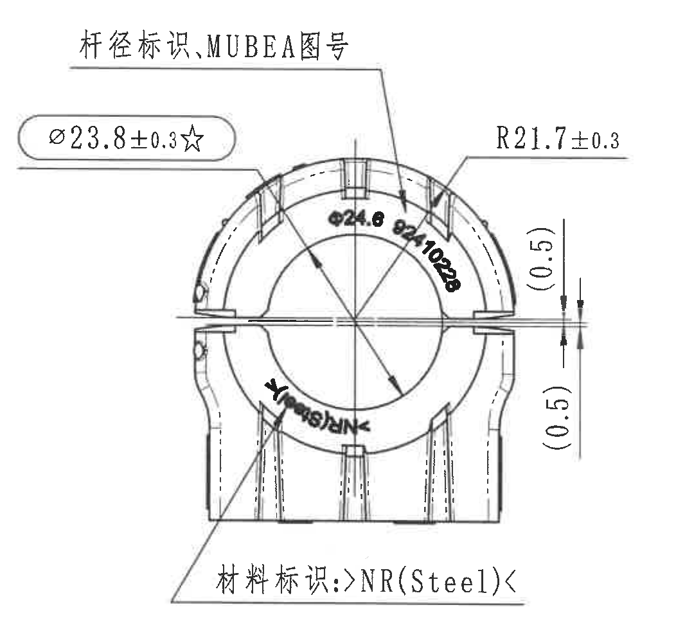

原图位置/视图名称：页 1，中部左侧，网格约 E-G / 1-4；左侧主视图。

提取表格：

| 提取项 | 原图数值或文本 | 含义说明 |
|---|---|---|
| 关键尺寸 | Ø23.8±0.3☆ | 左上椭圆框内直径尺寸，带星号，表示关键/检验尺寸；公差 ±0.3。 |
| 弧度/半径 | R21.7±0.3 | 右上弧形外缘半径，公差 ±0.3。 |
| 参考尺寸 | (0.5) | 右侧上下各一处括号尺寸，表示开口/缝隙附近参考间隙；括号说明为参考尺寸。 |
| 文字/引线 | 杆径标识、MUBEA图号 | 上方引线指向弧形外表面标识。 |
| 文字/引线 | 材料标识: >NR(Steel)< | 下方引线指向材料标识位置。 |
| 图形文字 | Ø24.6、Ø24.10228、>NR(Steel)< | 位于零件弧面上的模印/标识文字，按图面位置属于该主视图。 |

边界归属说明：裁切包含 Ø23.8±0.3☆、R21.7±0.3、两处 (0.5)、上下两条标识引线和文字；下边界收在该主视图材料标识下方，未包含下方平面视图标题。

## object_5 - 中部侧视图及 A-A 剖切指示

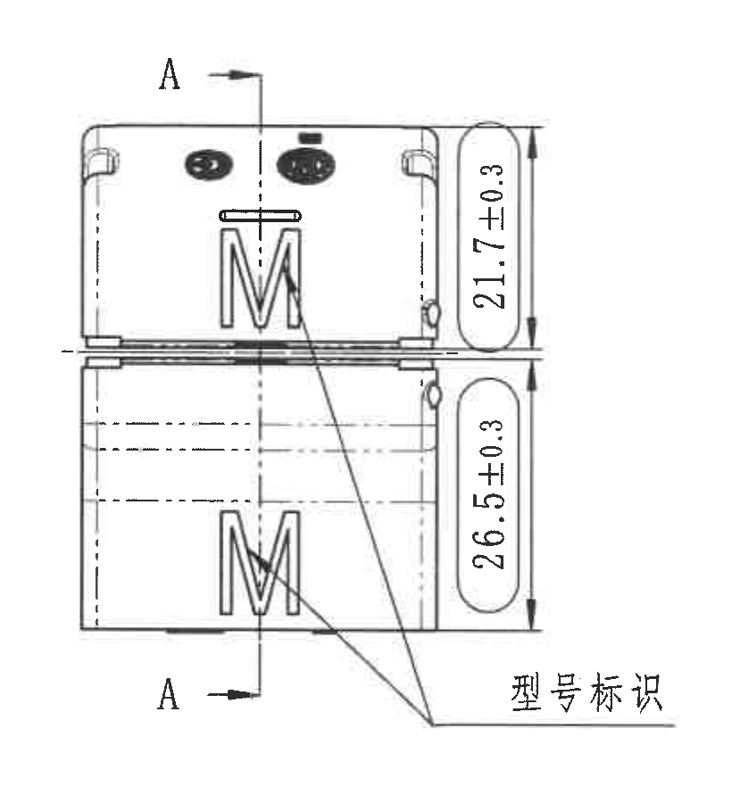

原图位置/视图名称：页 1，中部，网格约 E-G / 5-7；中部侧视图及 A-A 剖切指示。

提取表格：

| 提取项 | 原图数值或文本 | 含义说明 |
|---|---|---|
| 基准/剖切标识 | A / A | 竖向剖切线两端标注 A，箭头指示 A-A 剖切位置。 |
| 尺寸 | 21.7±0.3 | 上半部分竖向高度尺寸，公差 ±0.3。 |
| 尺寸 | 26.5±0.3 | 下半部分竖向高度尺寸，公差 ±0.3。 |
| 文字/引线 | 型号标识 | 引线指向两处 M 形型号标识。 |

边界归属说明：裁切包含 A-A 剖切线及箭头、两条右侧竖向尺寸线和“型号标识”引线；右侧 A-A 剖面图未混入。

## object_6 - A-A 剖面视图

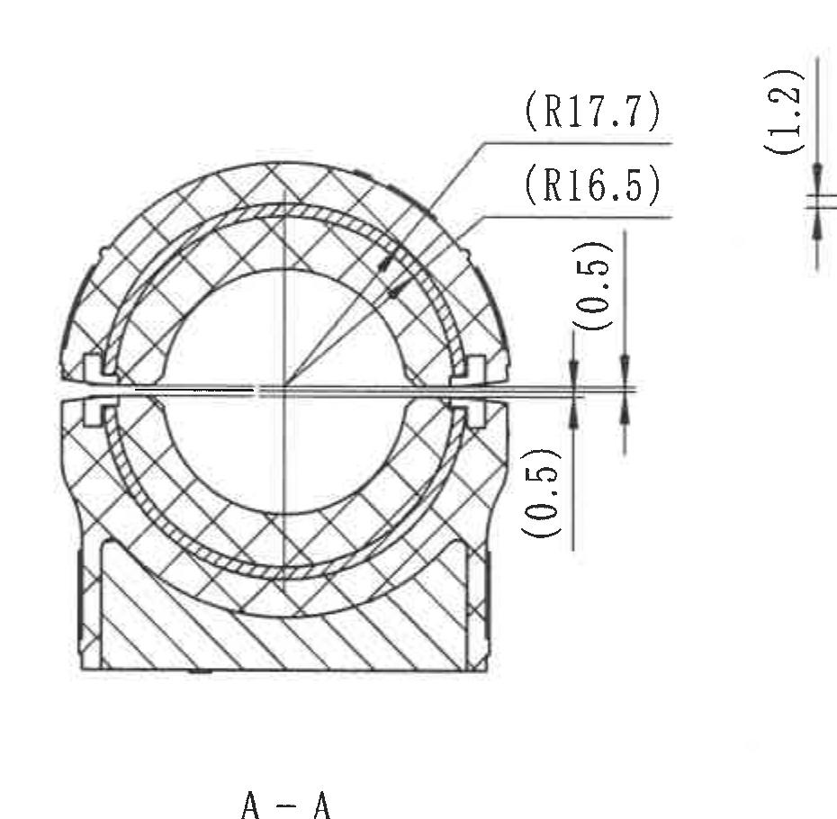

原图位置/视图名称：页 1，中部偏右，网格约 E-G / 8-10；A-A 剖面视图。

提取表格：

| 提取项 | 原图数值或文本 | 含义说明 |
|---|---|---|
| 参考半径 | (R17.7) | 右上外侧引线半径，括号内为参考尺寸。 |
| 参考半径 | (R16.5) | 右上内侧引线半径，括号内为参考尺寸。 |
| 参考尺寸 | (0.5) | 开口缝隙附近竖向参考尺寸，上下各一处，表示剖面缝隙/间隙参考值。 |
| 参考尺寸 | (1.2) | 右上水平缝隙处竖向参考尺寸，括号内为参考值。 |
| 剖面标识 | A-A | 视图下方剖面名称。 |

边界归属说明：裁切包含完整 A-A 剖面轮廓、剖面线、(R17.7)、(R16.5)、两处 (0.5)、右上 (1.2) 和 A-A 标题；未把右侧 B-B 剖面主体归入。

## object_7 - B-B 剖面视图

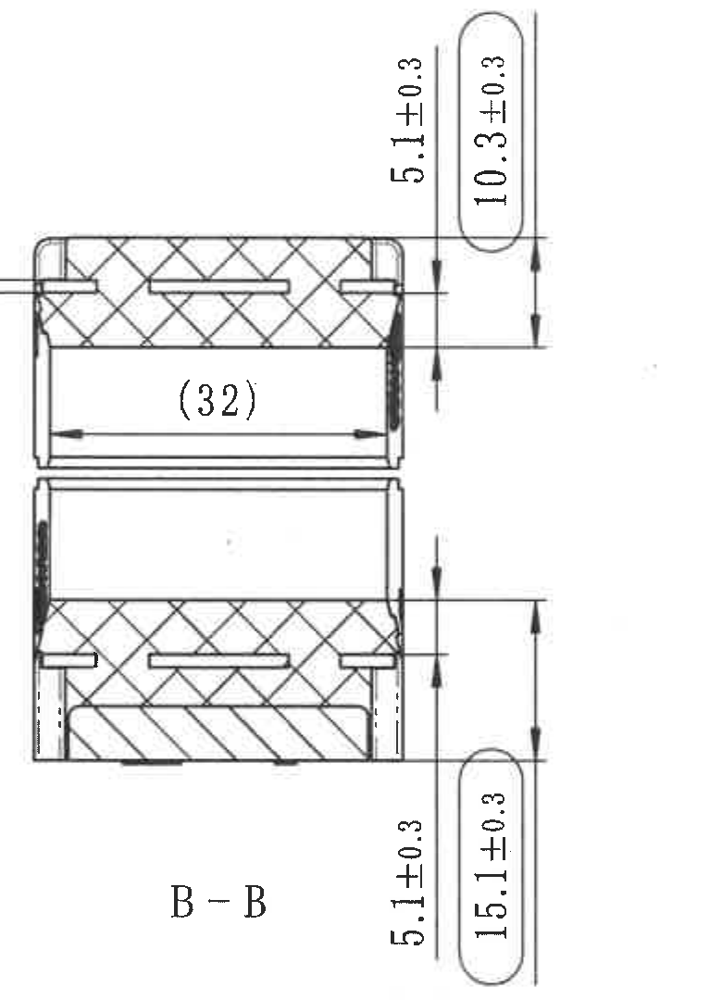

原图位置/视图名称：页 1，中部右侧，网格约 E-G / 11-13；B-B 剖面视图。

提取表格：

| 提取项 | 原图数值或文本 | 含义说明 |
|---|---|---|
| 尺寸 | 5.1±0.3 | 右上竖向局部高度/壁厚相关尺寸，公差 ±0.3。 |
| 尺寸 | 10.3±0.3 | 右上椭圆框竖向尺寸，公差 ±0.3。 |
| 参考尺寸 | (32) | 上半剖面内部水平参考长度，括号内为参考尺寸。 |
| 尺寸 | 5.1±0.3 | 右下竖向局部高度/壁厚相关尺寸，公差 ±0.3。 |
| 尺寸 | 15.1±0.3 | 右下椭圆框竖向尺寸，公差 ±0.3。 |
| 剖面标识 | B-B | 视图下方剖面名称。 |

边界归属说明：裁切左边界避开 A-A 的 (1.2)；包含 B-B 上下剖面、右侧四条竖向尺寸和内部 (32) 参考尺寸。

## object_8 - 右侧主视图及 B-B 剖切指示

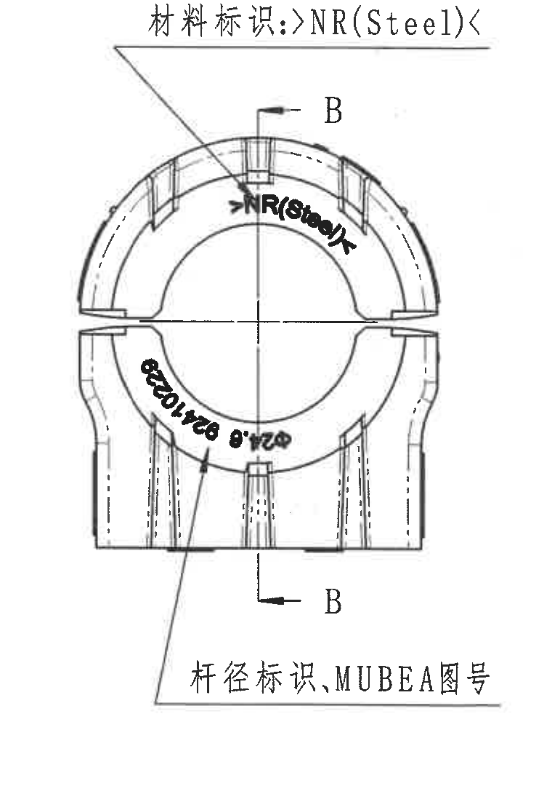

原图位置/视图名称：页 1，中部最右，网格约 E-G / 14-16；右侧主视图及 B-B 剖切指示。

提取表格：

| 提取项 | 原图数值或文本 | 含义说明 |
|---|---|---|
| 基准/剖切标识 | B / B | 竖向剖切线两端标注 B，箭头指示 B-B 剖切位置。 |
| 文字/引线 | 材料标识: >NR(Steel)< | 上方引线指向弧面材料标识。 |
| 文字/引线 | 杆径标识、MUBEA图号 | 下方引线指向弧面杆径/图号标识。 |
| 图形文字 | >NR(Steel)<、Ø24.6、Ø24.10228 | 弧面标识文字，按图面属于该右侧主视图。 |

边界归属说明：裁切包含完整 B-B 剖切指示、上下标识引线和视图本体；右侧图框字母被排除，不作为该视图内容。

## object_9 - 下方平面视图

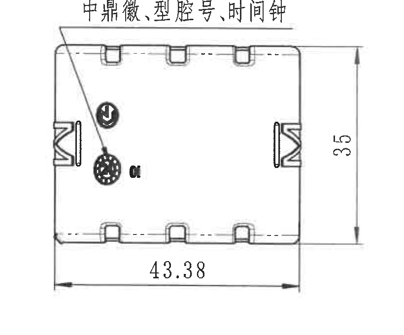

原图位置/视图名称：页 1，下方左侧，网格约 H-J / 2-4；下方平面视图。

提取表格：

| 提取项 | 原图数值或文本 | 含义说明 |
|---|---|---|
| 尺寸 | 35 | 右侧竖向高度尺寸，无单独公差标注；按一般公差或相关表处理。 |
| 尺寸 | 43.38 | 下方水平宽度尺寸，无单独公差标注；按一般公差或相关表处理。 |
| 文字/引线 | 中鼎徽、型腔号、时间钟 | 上方文字引线指向平面视图内的标识区域。 |
| 图形标识 | 中鼎徽/时间钟/腔号 | 位于平面视图内部左侧。 |

边界归属说明：裁切包含平面视图完整外轮廓、35 竖向尺寸、43.38 水平尺寸和标识引线；右侧 NOTES 未混入。

## object_10 - Specification 技术要求

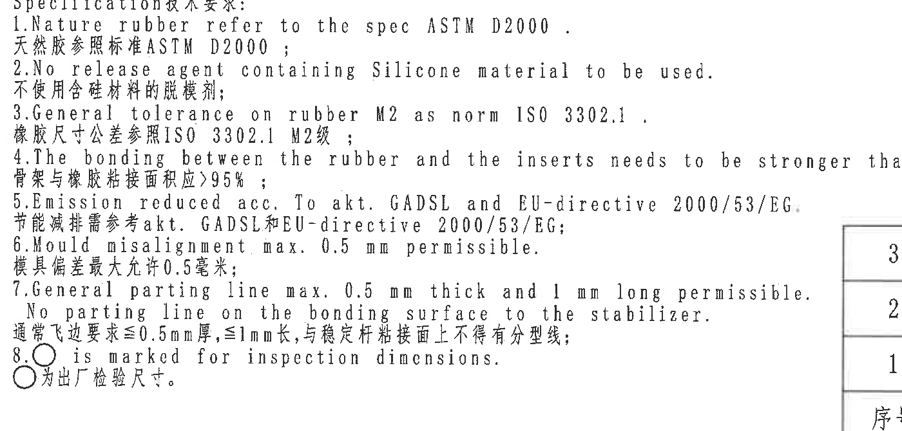

原图位置/视图名称：页 1，下方中部，网格约 H-J / 5-9；Specification 技术要求。

提取表格：

| 提取项 | 原图数值或文本 | 含义说明 |
|---|---|---|
| 标题 | Specification技术要求: | 技术要求标题。 |
| 1 | Nature rubber refer to the spec ASTM D2000. / 天然胶参照标准 ASTM D2000； | 天然橡胶材料按 ASTM D2000。 |
| 2 | No release agent containing Silicone material to be used. / 不使用含硅材料的脱模剂； | 禁止使用含硅脱模剂。 |
| 3 | General tolerance on rubber M2 as norm ISO 3302.1. / 橡胶尺寸公差参照 ISO 3302.1 M2级； | 橡胶件一般公差按 ISO 3302.1 M2。 |
| 4 | The bonding between the rubber and the inserts needs to be stronger than >95% rubber break. / 骨架与橡胶粘接面积应 >95%； | 橡胶与嵌件粘接强度要求，橡胶破坏比例大于 95%。 |
| 5 | Emission reduced acc. To akt. GADSL and EU-directive 2000/53/EG. / 节能减排需参考 akt. GADSL 和 EU-directive 2000/53/EG； | 排放/法规符合 GADSL 和欧盟 2000/53/EG。 |
| 6 | Mould misalignment max. 0.5 mm permissible. / 模具偏差最大允许 0.5 毫米； | 模具错位最大 0.5 mm。 |
| 7 | General parting line max. 0.5 mm thick and 1 mm long permissible. No parting line on the bonding surface to the stabilizer. / 通常飞边要求 ≤0.5mm厚，≤1mm长，与稳定杆粘接面上不得有分型线； | 飞边及分型线要求。 |
| 8 | ○ is marked for inspection dimensions. / ○为出厂检验尺寸。 | 圆圈标记表示出厂检验尺寸。 |

边界归属说明：裁切包含 1-8 条技术要求完整文字；右边界未提取相邻标题栏内容。

## object_11 - DIN ISO 3302-1 M2 class 公差表

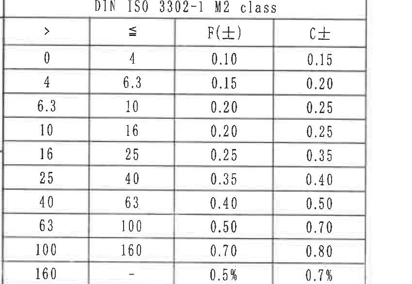

原图位置/视图名称：页 1，左下角，网格约 K-L / 1-3；DIN ISO 3302-1 M2 class 公差表。

原表还原：

| > | ≤ | F(±) | C± |
|---|---|---|---|
| 0 | 4 | 0.10 | 0.15 |
| 4 | 6.3 | 0.15 | 0.20 |
| 6.3 | 10 | 0.20 | 0.25 |
| 10 | 16 | 0.20 | 0.25 |
| 16 | 25 | 0.25 | 0.35 |
| 25 | 40 | 0.35 | 0.40 |
| 40 | 63 | 0.40 | 0.50 |
| 63 | 100 | 0.50 | 0.70 |
| 100 | 160 | 0.70 | 0.80 |
| 160 | - | 0.5% | 0.7% |

提取表格：

| 提取项 | 原图数值或文本 | 含义说明 |
|---|---|---|
| 表题 | DIN ISO 3302-1 M2 class | 橡胶件一般公差等级表。 |
| 列 | > / ≤ / F(±) / C± | 按尺寸区间给出 F、C 两类公差。 |
| 数据 | 0-4: F±0.10, C±0.15；...；160-: F±0.5%, C±0.7% | 各尺寸区间对应公差。 |

边界归属说明：裁切包含完整标准表标题、表头、10 行数据和外框；底部图框坐标已排除。

## object_12 - 等轴参考图与 Reference 参考标准

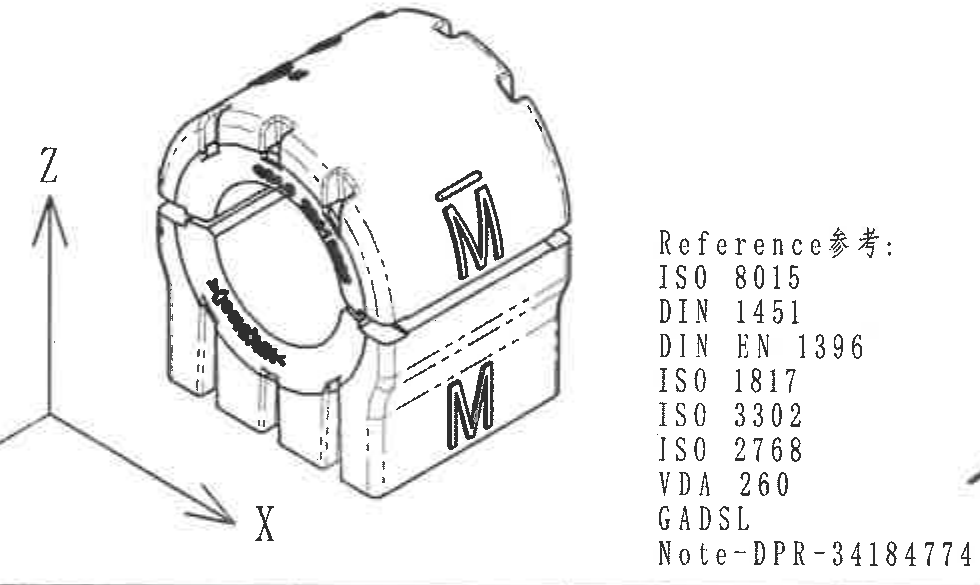

原图位置/视图名称：页 1，下方中部偏右，网格约 K-L / 6-9；等轴参考图与 Reference 参考标准。

提取表格：

| 提取项 | 原图数值或文本 | 含义说明 |
|---|---|---|
| 视图性质 | Reference参考 | 该区域为等轴参考图和参考标准列表，不作为加工尺寸视图。 |
| 坐标轴 | Z / X / Y | 左侧三向坐标箭头。 |
| 图形标识 | M、弧面文字/标识 | 等轴图上显示 M 标识和弧面标识位置。 |
| 参考标准 | ISO 8015 | 参考标准列表条目。 |
| 参考标准 | DIN 1451 | 参考标准列表条目。 |
| 参考标准 | DIN EN 1396 | 参考标准列表条目。 |
| 参考标准 | ISO 1817 | 参考标准列表条目。 |
| 参考标准 | ISO 3302 | 参考标准列表条目。 |
| 参考标准 | ISO 2768 | 参考标准列表条目。 |
| 参考标准 | VDA 260 | 参考标准列表条目。 |
| 参考标准 | GADSL | 参考标准列表条目。 |
| 参考标准 | Note-DPR-34184774 | 参考说明编号。 |

边界归属说明：裁切包含完整等轴参考图、Z/X/Y 坐标箭头和 Reference 参考标准列表；右侧标题栏和底部图框坐标已通过收边排除，不提取为本对象内容。

## object_13 - BOM 明细表

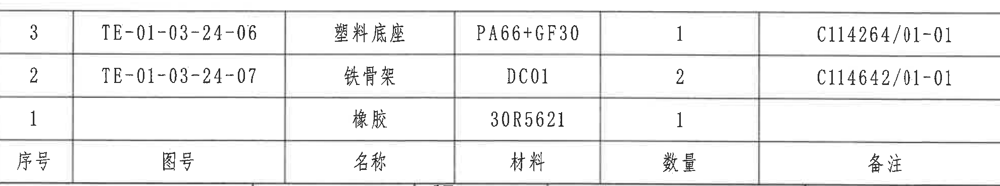

原图位置/视图名称：页 1，右下上部，网格约 I-J / 10-16；BOM 明细表。

原表还原：

| 序号 | 图号 | 名称 | 材料 | 数量 | 备注 |
|---|---|---|---|---|---|
| 3 | TE-01-03-24-06 | 塑料底座 | PA66+GF30 | 1 | C114264/01-01 |
| 2 | TE-01-03-24-07 | 铁骨架 | DC01 | 2 | C114642/01-01 |
| 1 |  | 橡胶 | 30R5621 | 1 |  |

提取表格：

| 提取项 | 原图数值或文本 | 含义说明 |
|---|---|---|
| 明细 3 | TE-01-03-24-06 / 塑料底座 / PA66+GF30 / 1 / C114264/01-01 | 塑料底座部件。 |
| 明细 2 | TE-01-03-24-07 / 铁骨架 / DC01 / 2 / C114642/01-01 | 铁骨架部件。 |
| 明细 1 | 橡胶 / 30R5621 / 1 | 橡胶部件。 |

边界归属说明：裁切包含完整 BOM 三条明细和表头；下方标题栏字段“投影法/比例/质量”等不归入 BOM。

## object_14 - 标题栏

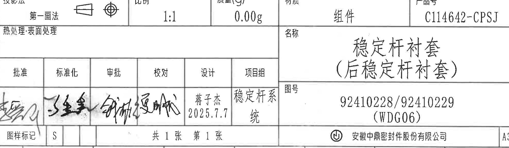

原图位置/视图名称：页 1，右下角，网格约 J-L / 10-16；标题栏。

提取表格：

| 提取项 | 原图数值或文本 | 含义说明 |
|---|---|---|
| 投影法 | 第一画法 | 投影法字段，旁有投影视图符号。 |
| 比例 | 1:1 | 图纸比例。 |
| 质量(g) | 0.00g | 质量字段。 |
| 材质 | 组件 | 材质/装配属性字段。 |
| 产品号 | C114642-CPSJ | 产品号。 |
| 热处理/表面处理 | 空白 | 该栏未填写内容。 |
| 名称 | 稳定杆衬套（后稳定杆衬套） | 零件/组件名称。 |
| 图号 | 92410228/92410229 (WDG06) | 图号字段。 |
| 批准/标准化/审批/校对/设计/项目组 | 签名/手写；设计：蒋子杰 2025.7.7；项目组：稳定杆系统 | 签审栏。 |
| 图样标记 | S | 图样标记字段。 |
| 页次 | 共 1 张 第 1 张 | 页数信息。 |
| 公司 | 安徽中鼎密封件股份有限公司 | 公司名称。 |
| 图幅 | A3 | 图幅。 |

边界归属说明：裁切从标题栏“投影法/比例/质量/材质/产品号”行开始，到公司与 A3 内框结束；上方 BOM 不归入本对象，底部外部图框坐标未提取。

## 裁切检查记录

| 对象 | 检查结果 |
|---|---|
| object_1 | 已检查。裁切包含完整上方引线文字、右侧 35±0.3 尺寸线和底部 39.4±0.3、43.4±0.3 两条尺寸线；右侧未包含产品数据表，底部未包含下方主视图文字。 |
| object_2 | 已检查。裁切收在修订履历表底部边框内，未把下方产品数据表表头文字作为本表内容。 |
| object_3 | 已检查。裁切包含完整产品数据表头、两条数据行和底部边线；右侧接近图框字母但未把图框字母作为表格字段提取。 |
| object_4 | 已检查。裁切包含 Ø23.8±0.3☆、R21.7±0.3、两处 (0.5)、上下两条标识引线和文字；下边界收在该主视图材料标识下方，未包含下方平面视图标题。 |
| object_5 | 已检查。裁切包含 A-A 剖切线及箭头、两条右侧竖向尺寸线和“型号标识”引线；右侧 A-A 剖面图未混入。 |
| object_6 | 已检查。裁切包含完整 A-A 剖面轮廓、剖面线、(R17.7)、(R16.5)、两处 (0.5)、右上 (1.2) 和 A-A 标题；未把右侧 B-B 剖面主体归入。 |
| object_7 | 已检查。裁切左边界避开 A-A 的 (1.2)；包含 B-B 上下剖面、右侧四条竖向尺寸和内部 (32) 参考尺寸。 |
| object_8 | 已检查。裁切包含完整 B-B 剖切指示、上下标识引线和视图本体；右侧图框字母被排除，不作为该视图内容。 |
| object_9 | 已检查。裁切包含平面视图完整外轮廓、35 竖向尺寸、43.38 水平尺寸和标识引线；右侧 NOTES 未混入。 |
| object_10 | 已检查。裁切包含 1-8 条技术要求完整文字；右边界未提取相邻标题栏内容。 |
| object_11 | 已检查。裁切包含完整标准表标题、表头、10 行数据和外框；底部图框坐标已排除。 |
| object_12 | 已检查。裁切包含完整等轴参考图、Z/X/Y 坐标箭头和 Reference 参考标准列表；右侧标题栏和底部图框坐标已通过收边排除，不提取为本对象内容。 |
| object_13 | 已检查。裁切包含完整 BOM 三条明细和表头；下方标题栏字段“投影法/比例/质量”等不归入 BOM。 |
| object_14 | 已检查。裁切从标题栏“投影法/比例/质量/材质/产品号”行开始，到公司与 A3 内框结束；上方 BOM 不归入本对象，底部外部图框坐标未提取。 |
