# 20C114648 PDF 内容识别结果

源文件：`input/20C114648.pdf`  
整页渲染图：`20C114648_assets/images/page_1.png`  
页面：1；整页 PNG 尺寸：4959 × 3505 px。本文中的 bbox 均按整页 PNG 像素坐标 `[x0, y0, x1, y1]` 记录。

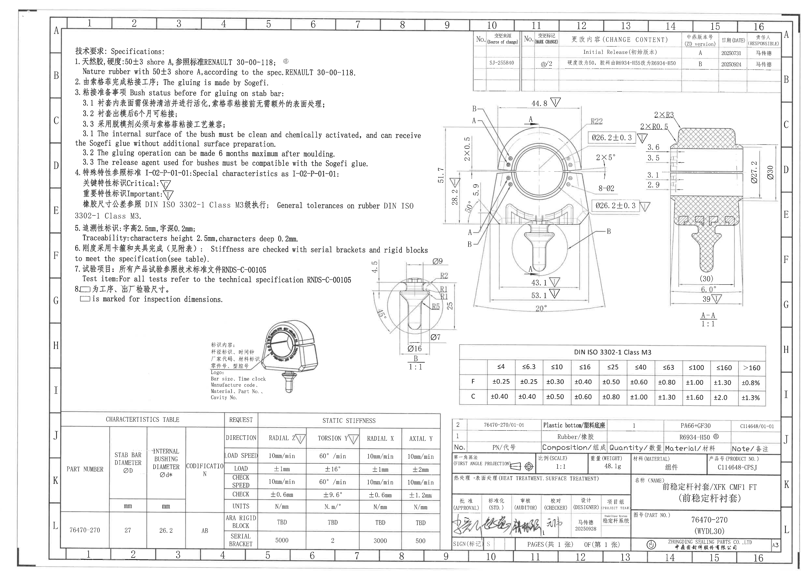

## object_1 - NOTES / 技术要求上半区

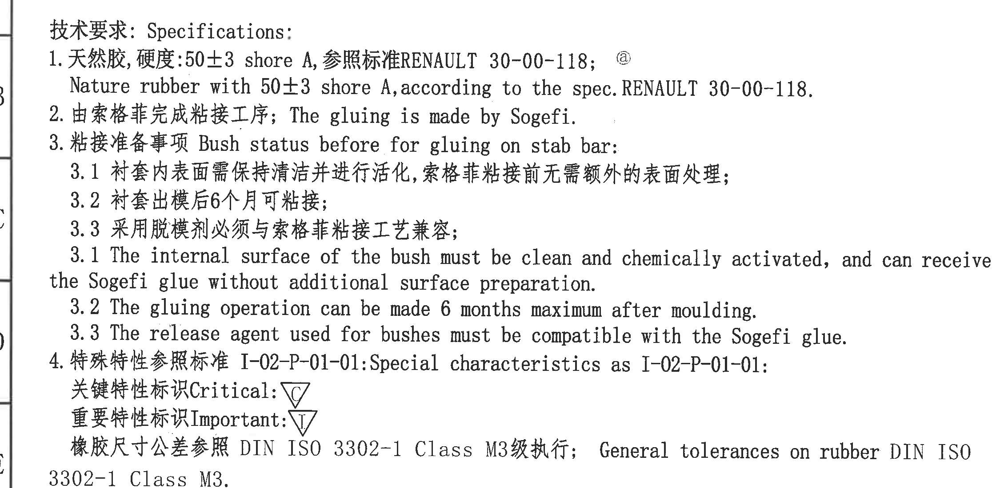

原图位置/视图名称：第 1 页左上 NOTES 技术要求区域，bbox `[350, 245, 2600, 1345]`。

| 提取项 | 原图数值或文本 | 含义说明 |
|---|---|---|
| 标题 | 技术要求: Specifications: | 图纸通用技术要求标题。 |
| 1 | 天然胶, 硬度: 50±3 shore A, 参照标准 RENAULT 30-00-118; @ | 橡胶材料为天然胶，硬度为 50±3 Shore A，按 RENAULT 30-00-118；`@` 为修订/材料相关标记。 |
| 1 英文 | Nature rubber with 50±3 shore A, according to the spec. RENAULT 30-00-118. | 第 1 条英文说明。 |
| 2 | 由索格菲完成粘接工序; The gluing is made by Sogefi. | 粘接工序由 Sogefi 完成。 |
| 3 | 粘接准备事项 Bush status before for gluing on stab bar: | 粘接前衬套状态要求。 |
| 3.1 中文 | 衬套内表面需保持清洁并进行活化，索格菲粘接前无需额外的表面处理; | 衬套内表面须清洁、活化。 |
| 3.2 中文 | 衬套出模后 6 个月可粘接; | 出模后最长 6 个月内可执行粘接。 |
| 3.3 中文 | 采用脱模剂必须与索格菲粘接工艺兼容; | 脱模剂须与 Sogefi 胶粘工艺兼容。 |
| 3.1 英文 | The internal surface of the bush must be clean and chemically activated, and can receive the Sogefi glue without additional surface preparation. | 第 3.1 条英文说明。 |
| 3.2 英文 | The gluing operation can be made 6 months maximum after moulding. | 第 3.2 条英文说明。 |
| 3.3 英文 | The release agent used for bushes must be compatible with the Sogefi glue. | 第 3.3 条英文说明。 |
| 4 | 特殊特性参照标准 I-02-P-01-01: Special characteristics as I-02-P-01-01: | 特殊特性符号和判定按 I-02-P-01-01。 |
| 4 Critical | 关键特性标识 Critical: △C | 三角形内 C 表示关键特性。 |
| 4 Important | 重要特性标识 Important: △I | 三角形内 I 表示重要特性。 |
| 公差标准 | 橡胶尺寸公差参照 DIN ISO 3302-1 Class M3 级执行; General tolerances on rubber DIN ISO 3302-1 Class M3. | 橡胶尺寸一般公差采用 DIN ISO 3302-1 Class M3。 |

边界归属说明：该裁切只提取 NOTES 文本。右侧靠近主视图的空白区域未作为视图尺寸读取；本对象不包含加工视图尺寸。

## object_2 - NOTES / 技术要求第 5 条

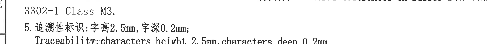

原图位置/视图名称：第 1 页左中 NOTES 第 5 条区域，bbox `[350, 1275, 2600, 1475]`。

| 提取项 | 原图数值或文本 | 含义说明 |
|---|---|---|
| 上接 | 3302-1 Class M3. | 上一条 DIN ISO 3302-1 Class M3 的续行。 |
| 5 中文 | 追溯性标识: 字高 2.5mm, 字深 0.2mm; | 追溯性标识字符高度和深度要求。 |
| 5 英文 | Traceability: characters height 2.5mm, characters deep 0.2mm. | 第 5 条英文说明。 |

边界归属说明：该裁切为 NOTES 连续文本的一段。右侧临近 B 剖视上方区域，但本对象仅提取第 5 条文字，不提取任何视图尺寸。

## object_3 - NOTES / 技术要求第 6 条

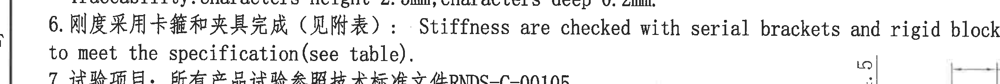

原图位置/视图名称：第 1 页左中 NOTES 第 6 条区域，bbox `[350, 1468, 2600, 1658]`。

| 提取项 | 原图数值或文本 | 含义说明 |
|---|---|---|
| 6 中文 | 刚度采用卡箍和夹具完成（见附表） | 刚度检测需使用卡箍和夹具，结果/设定见附表。 |
| 6 英文 | Stiffness are checked with serial brackets and rigid blocks to meet the specification (see table). | 刚度检验使用 serial brackets 和 rigid blocks，需满足表格中的规格。 |

边界归属说明：该裁切为第 6 条 NOTES 文本。右侧靠近 B 剖视，裁切中可见相邻尺寸线局部时不归入本对象；B 剖视尺寸只在 object_8 提取。

## object_4 - NOTES / 技术要求第 7-8 条

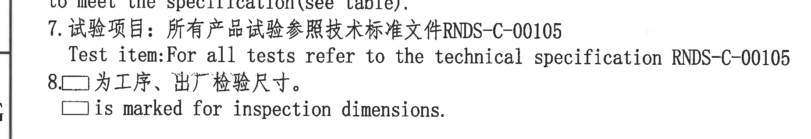

原图位置/视图名称：第 1 页左中 NOTES 第 7-8 条区域，bbox `[350, 1585, 2200, 1905]`。

| 提取项 | 原图数值或文本 | 含义说明 |
|---|---|---|
| 7 中文 | 试验项目: 所有产品试验参照技术标准文件 RNDS-C-00105 | 所有产品试验按 RNDS-C-00105。 |
| 7 英文 | Test item: For all tests refer to the technical specification RNDS-C-00105 | 第 7 条英文说明。 |
| 8 中文 | □ 为工序、出厂检验尺寸。 | 带方框符号的尺寸为工序/出厂检验尺寸。 |
| 8 英文 | □ is marked for inspection dimensions. | 第 8 条英文说明。 |

边界归属说明：该裁切仅覆盖 NOTES 文字，不提取下方标识局部图或右侧 B 剖视内容。

## object_5 - 修订履历表

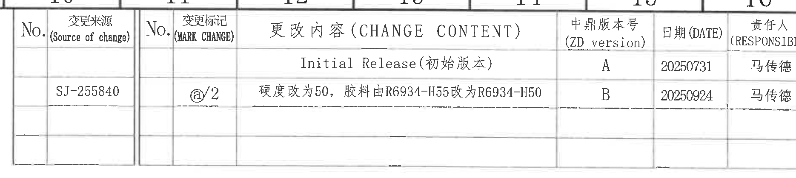

原图位置/视图名称：第 1 页右上修订履历表，bbox `[2870, 170, 4740, 590]`。

| No. | 变更来源 (Source of change) | No. | 变更标记 (MARK CHANGE) | 更改内容 (CHANGE CONTENT) | 中鼎版本号 (ZD version) | 日期 (DATE) | 责任人 (RESPONSIBLE) |
|---|---|---|---|---|---|---|---|
|  |  |  |  | Initial Release (初始版本) | A | 20250731 | 马传德 |
|  | SJ-255840 |  | @/2 | 硬度改为50，胶料由 R6934-H55 改为 R6934-H50 | B | 20250924 | 马传德 |

| 提取项 | 原图数值或文本 | 含义说明 |
|---|---|---|
| 表头 | No.; 变更来源; No.; 变更标记; 更改内容; 中鼎版本号; 日期; 责任人 | 修订履历字段。 |
| 版本 A | Initial Release (初始版本), A, 20250731, 马传德 | 初始发行记录。 |
| 版本 B | SJ-255840, @/2, 硬度改为50，胶料由 R6934-H55 改为 R6934-H50, B, 20250924, 马传德 | B 版修改硬度和橡胶牌号。 |

边界归属说明：裁切完整包含修订表外框、表头和两条记录；不读取表外网格坐标。

## object_6 - 主视图 / 正面加工视图

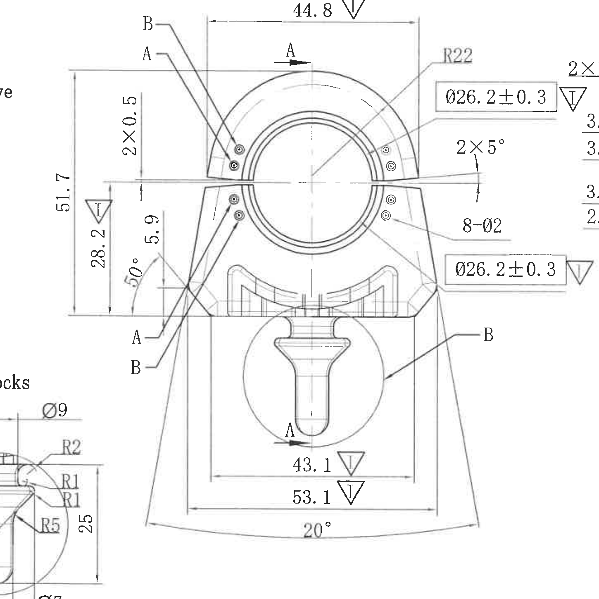

原图位置/视图名称：第 1 页中右主视图，bbox `[2550, 610, 4000, 2060]`。

| 提取项 | 原图数值或文本 | 含义说明 |
|---|---|---|
| 宽度 | 44.8 △I | 主视图上部外形宽度，三角 I 表示重要特性。 |
| 半径 | R22 | 上部圆弧外形半径。 |
| 内径/衬套孔径 | Ø26.2±0.3 △I | 圆孔/衬套内径尺寸，带公差 ±0.3；图中上下各有一处同值标注，均指向主视图内径相关位置。 |
| 槽口角度 | 2×5° | 左右两侧槽口/开口角度，各 5°。 |
| 小孔 | 8-Ø2 | 共 8 个直径 2 的孔/点位。 |
| 间隙/台阶 | 2×0.5 | 两处 0.5 的局部尺寸。 |
| 总高度 | 51.7 | 主视图左侧总高度。 |
| 局部高度 | 28.2 △I | 左侧中下部高度，三角 I 表示重要特性。 |
| 局部高度 | 5.9 | 左侧局部高度/台阶距离。 |
| 角度 | 50° | 左下斜边角度。 |
| 下部宽度 | 43.1 △I | 下部内侧宽度，三角 I 表示重要特性。 |
| 下部宽度 | 53.1 △I | 下部外侧宽度，三角 I 表示重要特性。 |
| 下部弧向角度 | 20° | 下部外轮廓弧向角度。 |
| 剖切/局部标记 | A, B | A 为 A-A 剖切方向标识；B 为局部剖视/局部详图索引。 |

边界归属说明：本对象提取完整箭头和尺寸线指向主视图的标注。右侧可见的 `2×R3`、`2×R0.5`、`3.6/3.5/3.1/2.9` 属于 A-A 剖视 object_7，不归入主视图；左下可见的 B 剖视片段属于 object_8，不归入主视图。

## object_7 - A-A 剖视图

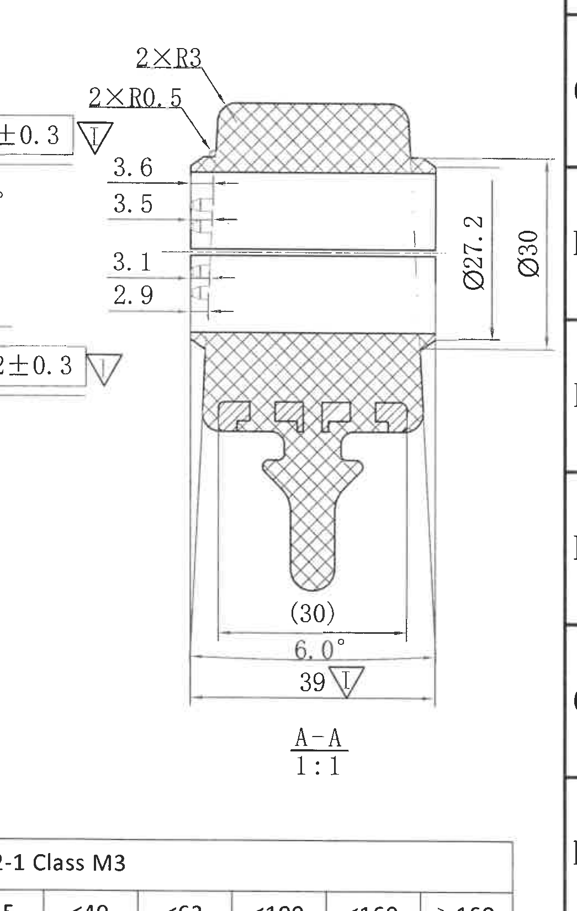

原图位置/视图名称：第 1 页右侧 A-A 剖视，bbox `[3765, 600, 4810, 2250]`。

| 提取项 | 原图数值或文本 | 含义说明 |
|---|---|---|
| 视图名/比例 | A-A; 1:1 | A-A 剖视图，比例 1:1。 |
| 圆角 | 2×R3 | 两处 R3 圆角。 |
| 圆角 | 2×R0.5 | 两处 R0.5 圆角。 |
| 局部厚度/距离 | 3.6 | 剖面左侧上部局部尺寸。 |
| 局部厚度/距离 | 3.5 | 剖面左侧上部第二处局部尺寸。 |
| 局部厚度/距离 | 3.1 | 剖面左侧中部局部尺寸。 |
| 局部厚度/距离 | 2.9 | 剖面左侧中部第二处局部尺寸。 |
| 直径 | Ø27.2 | 剖面右侧内侧直径/高度方向尺寸。 |
| 直径 | Ø30 | 剖面右侧外侧直径/高度方向尺寸。 |
| 参考尺寸 | (30) | 括号尺寸为参考尺寸，用于说明下部内部宽度位置，不作为控制尺寸。 |
| 弧向角度 | 6.0° | 下部弧形/开口角度。 |
| 下部宽度 | 39 △I | 下部外侧宽度，三角 I 表示重要特性。 |

边界归属说明：本对象只提取剖视 A-A 内部和直接指向剖视的尺寸。左侧来自主视图的 `Ø26.2±0.3` 框线局部不属于 A-A；底部公差表边缘不属于该剖视。

## object_8 - B 剖视/局部剖视

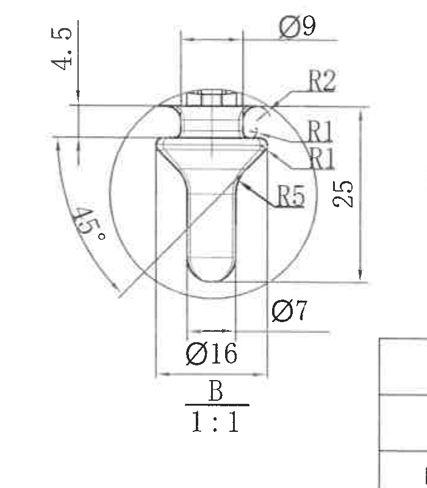

原图位置/视图名称：第 1 页中下 B 剖视，bbox `[2195, 1560, 2895, 2360]`。

| 提取项 | 原图数值或文本 | 含义说明 |
|---|---|---|
| 视图名/比例 | B; 1:1 | B 局部剖视，比例 1:1。 |
| 高度 | 4.5 | 顶部局部高度。 |
| 直径 | Ø9 | 顶部小圆/柱状部直径。 |
| 圆角 | R2 | 上部右侧圆角。 |
| 圆角 | R1 | 右侧上部过渡圆角。 |
| 圆角 | R1 | 右侧中部过渡圆角，原图单独列出。 |
| 圆角 | R5 | 右侧下部圆角/过渡半径。 |
| 高度 | 25 | 右侧整体局部高度。 |
| 角度 | 45° | 左侧斜向角度。 |
| 直径 | Ø7 | 下部内侧直径。 |
| 直径 | Ø16 | 下部外侧直径。 |

边界归属说明：本对象完整包含 B 剖视尺寸线、箭头、视图名和比例。右下角相邻表框线不是 B 剖视内容，不提取。

## object_9 - 标识局部图

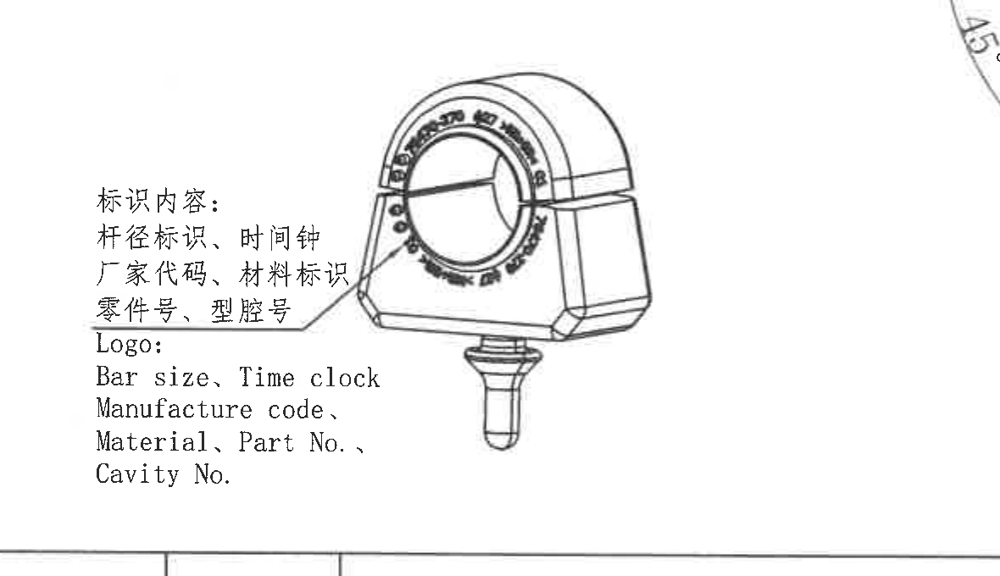

原图位置/视图名称：第 1 页左中下标识局部示意图，bbox `[1180, 1880, 2360, 2560]`。

| 提取项 | 原图数值或文本 | 含义说明 |
|---|---|---|
| 标识内容 | 杆径标识、时间钟 | 产品上需要标识杆径和时间钟。 |
| 标识内容 | 厂家代码、材料标识 | 产品上需要标识厂家代码和材料。 |
| 标识内容 | 零件号、型腔号 | 产品上需要标识零件号和型腔号。 |
| 英文 | Logo: Bar size, Time clock; Manufacture code; Material, Part No.; Cavity No. | 标识项目的英文说明。 |
| 示意图 | 带环形文字和箭头的产品标识位置示意 | 指示标识在产品正面环形区域及附近位置。 |

边界归属说明：该对象为标识示意，不包含控制尺寸。右上角可见的相邻 B 剖视弧线片段不属于本对象；底部表格边线不属于本对象。

## object_10 - CHARACTERISTICS TABLE / STATIC STIFFNESS 表

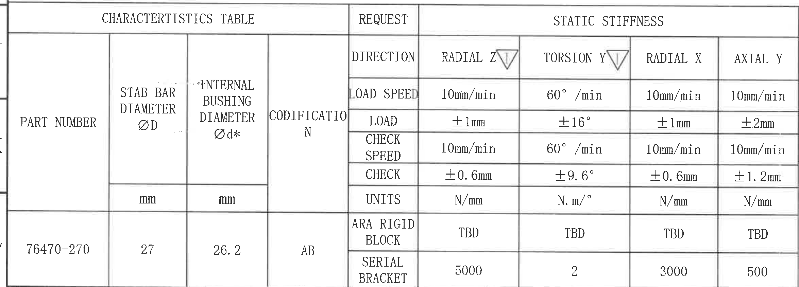

原图位置/视图名称：第 1 页左下特性和静刚度表，bbox `[350, 2520, 2700, 3365]`。

| PART NUMBER | STAB BAR DIAMETER ØD | INTERNAL BUSHING DIAMETER Ød* | CODIFICATION | REQUEST / DIRECTION | RADIAL Z △I | TORSION Y △I | RADIAL X | AXIAL Y |
|---|---:|---:|---|---|---|---|---|---|
|  | mm | mm |  | LOAD SPEED | 10mm/min | 60°/min | 10mm/min | 10mm/min |
|  |  |  |  | LOAD | ±1mm | ±16° | ±1mm | ±2mm |
|  |  |  |  | CHECK SPEED | 10mm/min | 60°/min | 10mm/min | 10mm/min |
|  |  |  |  | CHECK | ±0.6mm | ±9.6° | ±0.6mm | ±1.2mm |
|  |  |  |  | UNITS | N/mm | N.m/° | N/mm | N/mm |
| 76470-270 | 27 | 26.2 | AB | ARA RIGID BLOCK | TBD | TBD | TBD | TBD |
| 76470-270 | 27 | 26.2 | AB | SERIAL BRACKET | 5000 | 2 | 3000 | 500 |

| 提取项 | 原图数值或文本 | 含义说明 |
|---|---|---|
| PART NUMBER | 76470-270 | 对应零件号。 |
| STAB BAR DIAMETER ØD | 27 mm | 稳定杆直径。 |
| INTERNAL BUSHING DIAMETER Ød* | 26.2 mm | 衬套内径，带星号的关键/指定尺寸字段。 |
| CODIFICATION | AB | 编码。 |
| RADIAL Z | △I | 径向 Z 刚度方向为重要特性。 |
| TORSION Y | △I | 扭转 Y 刚度方向为重要特性。 |
| SERIAL BRACKET | 5000 / 2 / 3000 / 500 | 使用卡箍时四个方向的静刚度值。 |

边界归属说明：裁切完整包含表头、单位行和数据行。表格上方视图区不在本对象内；本对象不提取任何视图尺寸。

## object_11 - DIN ISO 3302-1 Class M3 公差表

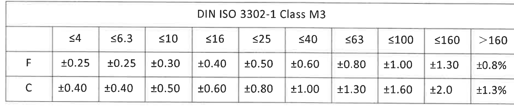

原图位置/视图名称：第 1 页右下公差表，bbox `[2795, 2110, 4685, 2500]`。

| DIN ISO 3302-1 Class M3 | ≤4 | ≤6.3 | ≤10 | ≤16 | ≤25 | ≤40 | ≤63 | ≤100 | ≤160 | >160 |
|---|---:|---:|---:|---:|---:|---:|---:|---:|---:|---:|
| F | ±0.25 | ±0.25 | ±0.30 | ±0.40 | ±0.50 | ±0.60 | ±0.80 | ±1.00 | ±1.30 | ±0.8% |
| C | ±0.40 | ±0.40 | ±0.50 | ±0.60 | ±0.80 | ±1.00 | ±1.30 | ±1.60 | ±2.0 | ±1.3% |

| 提取项 | 原图数值或文本 | 含义说明 |
|---|---|---|
| 表题 | DIN ISO 3302-1 Class M3 | 橡胶尺寸一般公差等级表。 |
| F 行 | ±0.25 至 ±1.30，>160 为 ±0.8% | F 级公差值。 |
| C 行 | ±0.40 至 ±2.0，>160 为 ±1.3% | C 级公差值。 |

边界归属说明：裁切完整包含公差表标题、列范围和 F/C 两行。上方 A-A 剖视不属于该表。

## object_12 - 物料表 / 投影比例材料产品号区

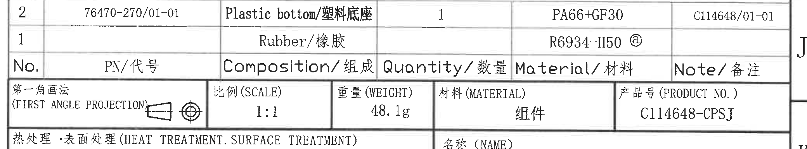

原图位置/视图名称：第 1 页右下物料表及标题栏上部，bbox `[2750, 2575, 4830, 2960]`。

| No. | PN/代号 | Composition/组成 | Quantity/数量 | Material/材料 | Note/备注 |
|---|---|---|---:|---|---|
| 2 | 76470-270/01-01 | Plastic bottom/塑料底座 | 1 | PA66+GF30 | C114648/01-01 |
| 1 |  | Rubber/橡胶 |  | R6934-H50 @ |  |

| 标题栏字段 | 原图数值或文本 | 含义说明 |
|---|---|---|
| 第一角画法 | 第一角画法 (FIRST ANGLE PROJECTION) | 投影法说明，旁有投影视图符号。 |
| 比例 | 1:1 | 图纸比例。 |
| 重量 | 48.1g | 产品/组件重量。 |
| 材料 | 组件 | 材料栏填写为组件。 |
| 产品号 | C114648-CPSJ | 产品号。 |

边界归属说明：该裁切完整包含 BOM 两行和标题栏上部的投影、比例、重量、材料、产品号字段；下方名称/图号等标题栏字段在 object_13 提取。

## object_13 - 标题栏 / 名称图号签字栏

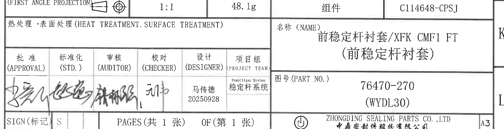

原图位置/视图名称：第 1 页右下标题栏下部，bbox `[2750, 2835, 4830, 3370]`。

| 提取项 | 原图数值或文本 | 含义说明 |
|---|---|---|
| 热处理/表面处理 | 热处理·表面处理 (HEAT TREATMENT. SURFACE TREATMENT) | 原图该栏未见填写具体处理内容。 |
| 名称 | 前稳定杆衬套/XFK CMF1 FT (前稳定杆衬套) | 零件/组件名称。 |
| 图号 | 76470-270 (WYDL30) | 图纸零件号及括号内代码。 |
| 批准 | APPROVAL，签名 | 批准签字栏。 |
| 标准化 | STD.，签名 | 标准化签字栏。 |
| 审核 | AUDITOR，签名 | 审核签字栏。 |
| 校对 | CHECKER，签名 | 校对签字栏。 |
| 设计 | DESIGNER: 马传德; 20250928 | 设计人和日期。 |
| 项目组 | PROJECT TEAM: Stabilizer System / 稳定杆系统 | 项目组信息。 |
| 标记 | SIGN(标记): S | 标记栏。 |
| 页数 | PAGES(共 1 张) OF(第 1 张) | 共 1 张，第 1 张。 |
| 公司 | ZHONGDING SEALING PARTS CO., LTD / 中鼎密封件股份有限公司 | 公司名称。 |
| 图幅 | A3 | 图纸幅面。 |

边界归属说明：该对象为标题栏下部，和 object_12 在标题栏中部共享边线；object_13 不重复提取 object_12 的 BOM 行。

## 裁切检查记录

| 对象 | 图片路径 | 检查结果 |
|---|---|---|
| page_1 | `20C114648_assets/images/page_1.png` | 整页 PNG 已渲染，包含完整图框、所有视图、表格、NOTES 和标题栏。 |
| object_1 | `20C114648_assets/images/object_1.png` | NOTES 上半区文字完整；无尺寸线需要提取。 |
| object_2 | `20C114648_assets/images/object_2.png` | 第 5 条文字完整；右侧靠近视图区但未将视图尺寸归入该对象。 |
| object_3 | `20C114648_assets/images/object_3.png` | 第 6 条文字可读；右侧相邻视图片段不归属本对象。 |
| object_4 | `20C114648_assets/images/object_4.png` | 第 7-8 条文字完整，方框符号可见。 |
| object_5 | `20C114648_assets/images/object_5.png` | 修订表表头、两条记录和边框完整。 |
| object_6 | `20C114648_assets/images/object_6.png` | 主视图尺寸线和文字可读；相邻 A-A/B 片段按边界归属排除。 |
| object_7 | `20C114648_assets/images/object_7.png` | A-A 剖视尺寸线、文字、参考尺寸 `(30)`、视图名和比例完整；相邻主视图尺寸片段排除。 |
| object_8 | `20C114648_assets/images/object_8.png` | B 剖视尺寸线、文字、视图名和比例完整；右下表框边线排除。 |
| object_9 | `20C114648_assets/images/object_9.png` | 标识说明文字和示意图完整；右上相邻弧线片段排除。 |
| object_10 | `20C114648_assets/images/object_10.png` | 特性/静刚度表表头、单位行、数据行完整。 |
| object_11 | `20C114648_assets/images/object_11.png` | DIN ISO 3302-1 Class M3 公差表完整。 |
| object_12 | `20C114648_assets/images/object_12.png` | BOM 两行和标题栏上部字段完整。 |
| object_13 | `20C114648_assets/images/object_13.png` | 标题栏下部名称、图号、签字、页数、公司和 A3 字段完整。 |
