# 20C114649 PDF 内容识别

源文件：`input/20C114649.pdf`

整页渲染图：`outputs/20C114649_assets/images/page_1.png`

页面信息：第 1 页，PNG 尺寸 `4959 x 3505` px。

## object_1：修订履历表

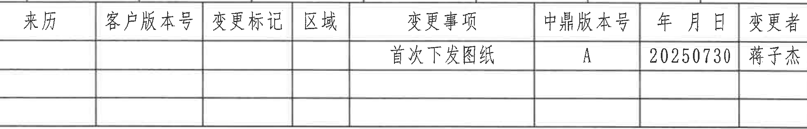

原图位置/视图名称：第 1 页右上角修订履历表，bbox `[2790, 155, 4750, 470]`。

### 原表还原

| 来历 | 客户版本号 | 变更标记 | 区域 | 变更事项 | 中鼎版本号 | 年月日 | 变更者 |
|---|---|---|---|---|---|---|---|
|  |  |  |  | 首次下发图纸 | A | 20250730 | 蒋子杰 |
|  |  |  |  |  |  |  |  |
|  |  |  |  |  |  |  |  |

### 提取表格

| 提取项 | 原图数值或文本 | 含义说明 |
|---|---|---|
| 表头 | 来历；客户版本号；变更标记；区域；变更事项；中鼎版本号；年月日；变更者 | 修订履历字段。 |
| 修订记录 1 | 变更事项：首次下发图纸；中鼎版本号：A；年月日：20250730；变更者：蒋子杰 | 首次发行/下发记录。 |
| 空白记录行 | 第 2、3 行为空白 | 预留后续变更记录。 |

边界归属说明：该裁切对象仅提取修订履历表。上方图框坐标数字已基本排除；表格外框和行列完整。

## object_2：左上主加工视图

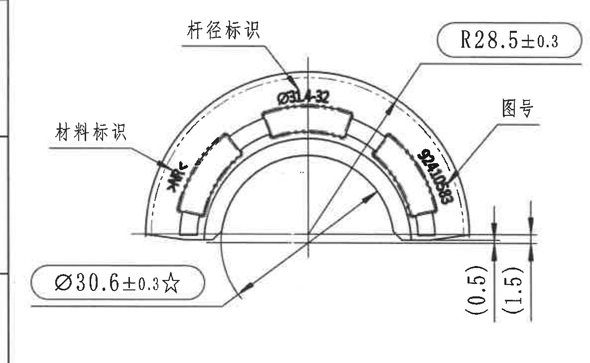

原图位置/视图名称：第 1 页左上半圆形主加工视图，bbox `[350, 855, 1535, 1585]`。

### 提取表格

| 提取项 | 原图数值或文本 | 含义说明 |
|---|---|---|
| 直径关键尺寸 | `Ø30.6±0.3☆` | 主视图下方引出框标注的直径尺寸；星号表示关键尺寸，技术要求第 9 条说明 `☆` 为关键尺寸。 |
| 外圆半径 | `R28.5±0.3` | 主视图外侧弧面半径尺寸，带公差 `±0.3`。 |
| 参考高度/厚度 | `(0.5)` | 右下侧竖向参考尺寸，括号表示参考尺寸；用于说明局部阶差/层厚关系。 |
| 参考高度/厚度 | `(1.5)` | 右下侧竖向参考尺寸，括号表示参考尺寸；与 `(0.5)` 同属主视图右下边界处。 |
| 杆径标识 | `杆径标识`；近旁标注 `Ø31.32` | 指向上中部标识区域；`Ø31.32` 为杆径标识相关直径文字，扫描较粗但可辨识。 |
| 材料标识 | `材料标识` | 左侧引出文字，指向左侧标识/刻字区域。 |
| 图号 | `图号` | 右侧引出文字，指向右侧图号标识区域。 |
| 弧向/刻字标注 | 左侧可见弧向刻字；右侧可见 `92410583` | 位于半圆外侧弧形区域，为刻字/标识内容，不是尺寸公差。 |

边界归属说明：该裁切对象只提取左上主加工视图中的尺寸和文字。右侧与中间侧视图相邻，但本裁切未提取相邻视图的 `A` 剖切或高度尺寸。

## object_3：中上侧向加工视图

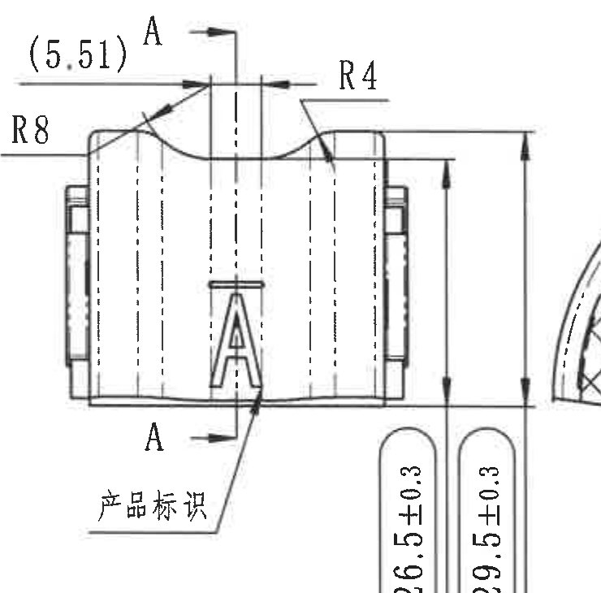

原图位置/视图名称：第 1 页中上侧向加工视图，bbox `[1565, 840, 2305, 1570]`。

### 提取表格

| 提取项 | 原图数值或文本 | 含义说明 |
|---|---|---|
| 剖切基准 | `A`、`A` | 上下箭头标明 A-A 剖切位置，属于本侧向视图。 |
| 参考宽度/偏移 | `(5.51)` | 顶部左侧参考尺寸，括号表示参考尺寸。 |
| 圆角半径 | `R8` | 左上局部圆角半径。 |
| 圆角半径 | `R4` | 右上局部圆角半径。 |
| 高度尺寸 | `26.5±0.3` | 右侧内侧竖向高度尺寸，公差 `±0.3`。 |
| 总高度尺寸 | `29.5±0.3` | 右侧外侧竖向总高度尺寸，公差 `±0.3`。 |
| 产品标识 | `产品标识` | 下方引出文字，指向正面 `A` 标识。 |
| 字母标识 | `A` | 视图中部产品标识字母。 |

边界归属说明：该裁切对象右侧可见 A-A 剖面视图边缘片段，但未将 A-A 的半径或剖面尺寸归入本对象。本对象只记录中上侧向视图及其 A-A 剖切指示。

## object_4：剖面 A-A

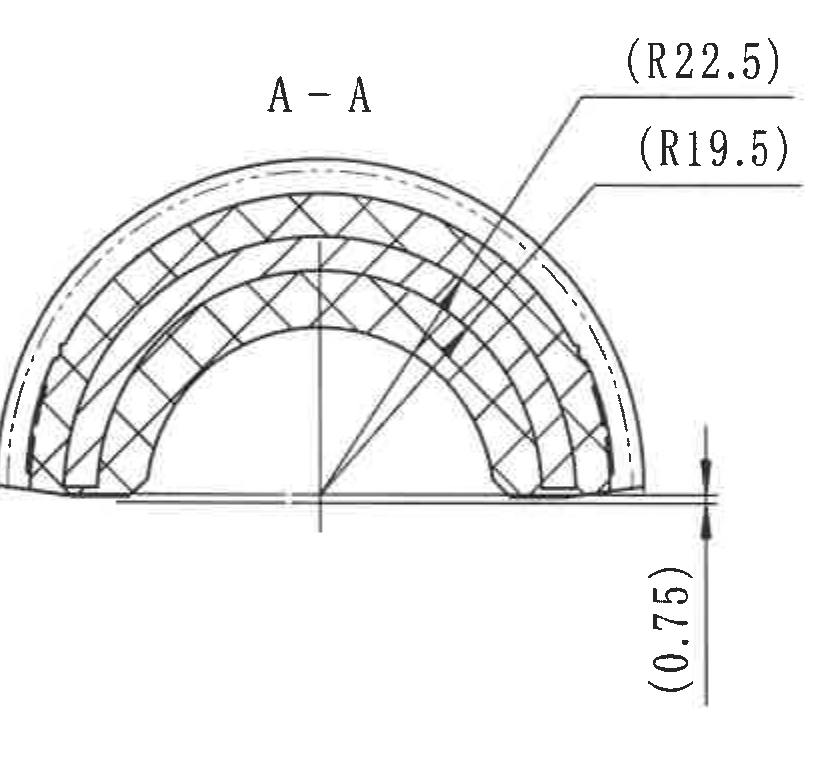

原图位置/视图名称：第 1 页中部剖面 `A-A`，bbox `[2250, 845, 3070, 1605]`。

### 提取表格

| 提取项 | 原图数值或文本 | 含义说明 |
|---|---|---|
| 剖面名称 | `A-A` | 由 object_3 中的 A-A 剖切位置生成的剖面视图。 |
| 参考外半径 | `(R22.5)` | 剖面外侧弧形参考半径，括号表示参考尺寸。 |
| 参考内半径 | `(R19.5)` | 剖面内侧弧形参考半径，括号表示参考尺寸。 |
| 参考厚度/间距 | `(0.75)` | 右下竖向参考尺寸，括号表示参考尺寸。 |
| 剖面材料表达 | 斜线剖面填充 | 表示该剖切截面内的材料区域。 |

边界归属说明：裁切已向右收紧，排除了相邻 B-B 剖面的 `6.75±0.3` 等尺寸。A-A 自身的引出线、文字和竖向参考尺寸完整。

## object_5：剖面 B-B

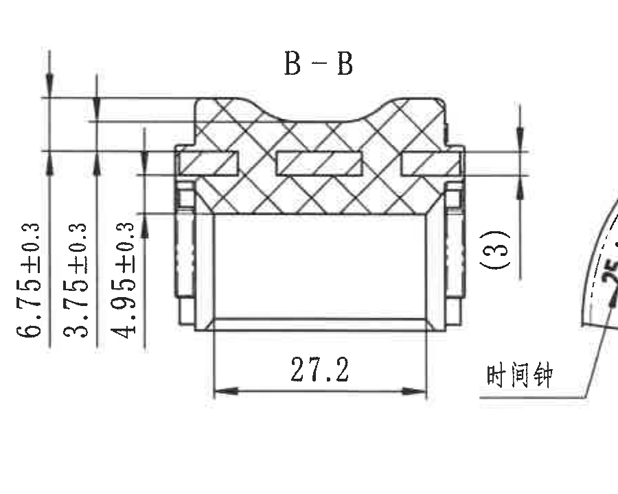

原图位置/视图名称：第 1 页中右部剖面 `B-B`，bbox `[3060, 830, 3960, 1550]`。

### 提取表格

| 提取项 | 原图数值或文本 | 含义说明 |
|---|---|---|
| 剖面名称 | `B-B` | 由右端视图中的 B-B 剖切位置生成的剖面视图。 |
| 总厚度/高度 | `6.75±0.3` | 左侧外层竖向尺寸，公差 `±0.3`。 |
| 台阶/层厚尺寸 | `3.75±0.3` | 左侧中间竖向尺寸，公差 `±0.3`。 |
| 局部高度尺寸 | `4.95±0.3` | 左侧内层竖向尺寸，公差 `±0.3`。 |
| 宽度尺寸 | `27.2` | 底部水平尺寸。 |
| 参考尺寸 | `(3)` | 右侧竖向参考尺寸，括号表示参考尺寸。 |

边界归属说明：该对象仅提取 B-B 剖面和其尺寸。右侧相邻的右端视图不属于本对象；“时间钟”引出线指向右端视图左下区域，不归入 B-B。

## object_6：右端加工视图

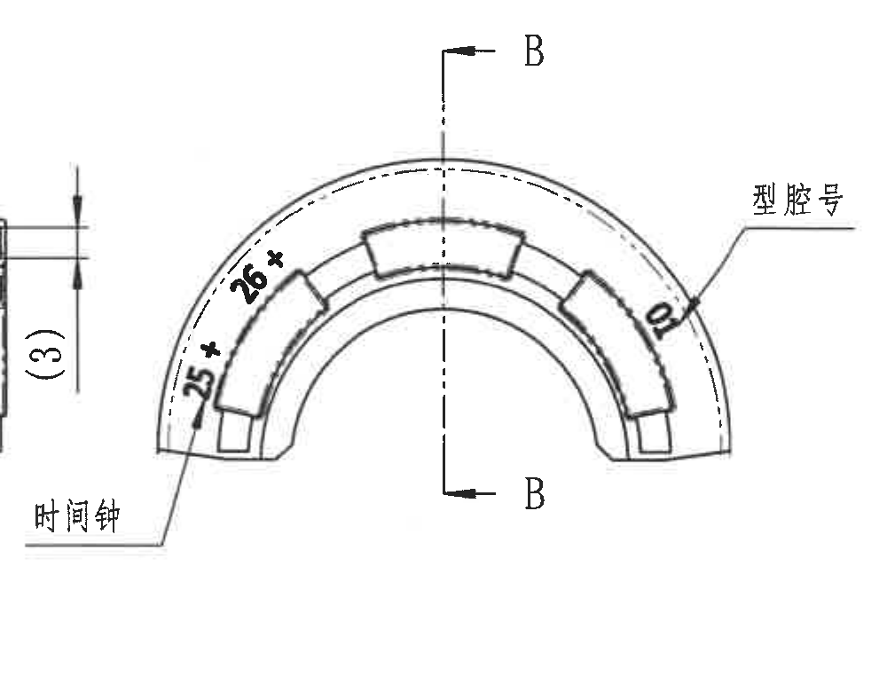

原图位置/视图名称：第 1 页右上半圆形端面/局部加工视图，bbox `[3730, 795, 4730, 1575]`。

### 提取表格

| 提取项 | 原图数值或文本 | 含义说明 |
|---|---|---|
| 剖切基准 | `B`、`B` | 竖向中心线两端箭头标明 B-B 剖切位置。 |
| 弧向关键尺寸 | `25*` | 左下弧形区域的弧向/节距标注，星号表示关键或特殊控制标注。 |
| 弧向关键尺寸 | `26*` | 左上弧形区域的弧向/节距标注，星号表示关键或特殊控制标注。 |
| 型腔号 | `型腔号` | 右侧引出文字，指向右侧弧面/刻字区域。 |
| 型腔/标记数字 | `0` | 右侧弧面附近可见数字标记，与“型腔号”引出线关联。 |
| 时间钟 | `时间钟` | 左下引出文字，箭头指向本右端视图左下刻字/标识区域。 |

边界归属说明：该视图左侧靠近 B-B 剖面；`(3)` 为 B-B 剖面尺寸，不归入本对象。裁切保留“时间钟”完整引出线，未提取 B-B 的 `27.2` 或厚度尺寸。

## object_7：左下展开/侧向加工视图

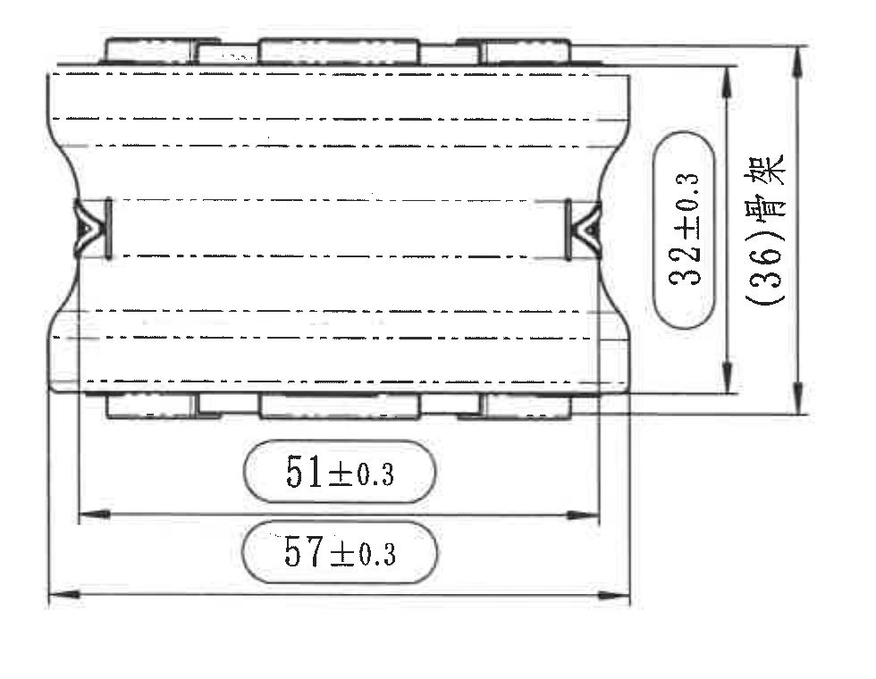

原图位置/视图名称：第 1 页左下展开/侧向加工视图，bbox `[590, 1670, 1570, 2430]`。

### 提取表格

| 提取项 | 原图数值或文本 | 含义说明 |
|---|---|---|
| 高度尺寸 | `32±0.3` | 右侧内侧竖向尺寸，公差 `±0.3`。 |
| 骨架参考高度 | `(36)骨架` | 右侧外侧竖向参考尺寸；括号表示参考尺寸，文字说明该尺寸与骨架相关。 |
| 长度尺寸 | `51±0.3` | 底部内侧水平长度尺寸，公差 `±0.3`。 |
| 总长度尺寸 | `57±0.3` | 底部外侧水平总长度尺寸，公差 `±0.3`。 |
| 内部虚线 | 多条水平虚线 | 表示隐藏轮廓/内部结构线。 |
| 两侧端部结构 | 左右端部对称轮廓 | 展开/侧向视图中端部卡扣或侧边结构。 |

边界归属说明：裁切完整包含上下外形、右侧高度尺寸线和底部两组长度尺寸线；未带入其他视图。

## object_8：技术要求 / NOTES

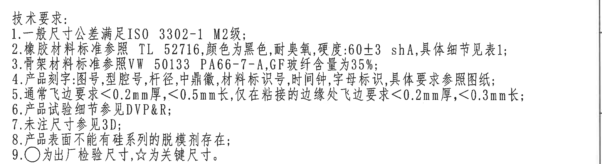

原图位置/视图名称：第 1 页中下部技术要求，bbox `[2720, 1855, 4770, 2415]`。

### 提取表格

| 提取项 | 原图数值或文本 | 含义说明 |
|---|---|---|
| 标题 | `技术要求:` | 技术要求/NOTES 区域标题。 |
| 1 | `一般尺寸公差满足ISO 3302-1 M2级;` | 未单独标注公差的一般尺寸按 ISO 3302-1 M2 级执行。 |
| 2 | `橡胶材料标准参照 TL 52716,颜色为黑色,耐臭氧,硬度:60±3 shA,具体细节见表1;` | 橡胶材料、颜色、耐臭氧和硬度要求；硬度为 `60±3 shA`。 |
| 3 | `骨架材料标准参照VW 50133 PA66-7-A,GF玻纤含量为35%;` | 骨架材料和玻纤含量要求。 |
| 4 | `产品刻字:图号,型腔号,杆径,中鼎徽,材料标识号,时间钟,字母标识,具体要求参照图纸;` | 产品刻字/标识项目说明。 |
| 5 | `通常飞边要求<0.2mm厚,<0.5mm长,仅在粘接的边缘处飞边要求<0.2mm厚,<0.3mm长;` | 飞边厚度和长度控制要求。 |
| 6 | `产品试验细节参见DVP&R;` | 试验细节引用 DVP&R。 |
| 7 | `未注尺寸参见3D;` | 未标注尺寸以 3D 数据为准。 |
| 8 | `产品表面不能有硅系列的脱模剂存在;` | 表面脱模剂限制。 |
| 9 | `○为出厂检验尺寸,☆为关键尺寸。` | 符号说明：圆圈为出厂检验尺寸，星号为关键尺寸。 |

边界归属说明：该对象只提取技术要求文本。下方 BOM 表已排除，右侧图框边线为页面边界，不作为技术要求内容。

## object_9：Table 1 Deviating

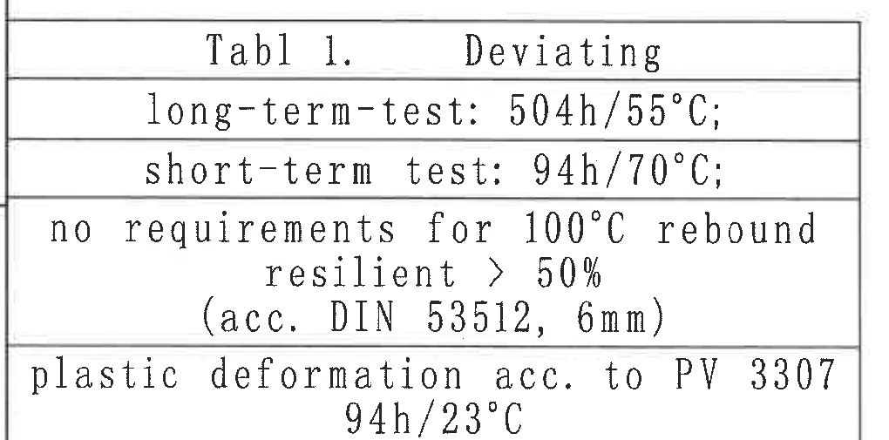

原图位置/视图名称：第 1 页左下角表格 `Tabl 1. Deviating`，bbox `[360, 2820, 1380, 3325]`。

### 原表还原

| Tabl 1. | Deviating |
|---|---|
| long-term-test | `504h/55°C;` |
| short-term test | `94h/70°C;` |
| rebound resilient | `no requirements for 100°C rebound resilient > 50% (acc. DIN 53512, 6mm)` |
| plastic deformation | `plastic deformation acc. to PV 3307 94h/23°C` |

### 提取表格

| 提取项 | 原图数值或文本 | 含义说明 |
|---|---|---|
| 表题 | `Tabl 1. Deviating` | 偏差/例外要求表。原图拼写为 `Tabl 1.`。 |
| 长期测试 | `long-term-test: 504h/55°C;` | 长期测试条件。 |
| 短期测试 | `short-term test: 94h/70°C;` | 短期测试条件。 |
| 回弹要求 | `no requirements for 100°C rebound resilient > 50% (acc. DIN 53512, 6mm)` | 对 100°C 回弹 resilience 的偏差说明，括号内为依据标准和试样厚度。 |
| 塑性变形 | `plastic deformation acc. to PV 3307 94h/23°C` | 塑性变形试验按 PV 3307，条件 `94h/23°C`。 |

边界归属说明：裁切底部已上移到表格底线，不提取下方图框坐标 `1 2 3 4`。

## object_10：3D 参考图和 References 标准清单

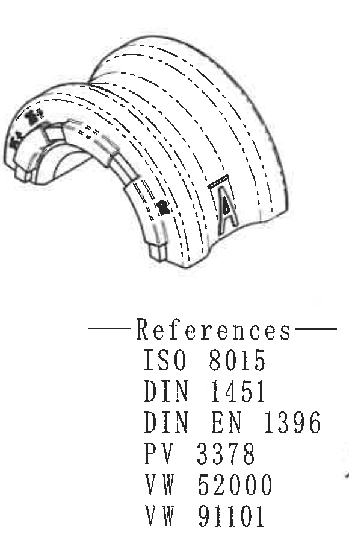

原图位置/视图名称：第 1 页下中部 3D 参考图与 `References` 清单，bbox `[2150, 2420, 2730, 3320]`。

### 提取表格

| 提取项 | 原图数值或文本 | 含义说明 |
|---|---|---|
| 3D 参考图 | 零件三维外观图 | 展示半圆套类零件的立体形态、外侧标识和 `A` 标记。 |
| 标题 | `References` | 引用标准清单标题。 |
| 引用标准 | `ISO 8015` | 引用标准。 |
| 引用标准 | `DIN 1451` | 引用标准。 |
| 引用标准 | `DIN EN 1396` | 引用标准。 |
| 引用标准 | `PV 3378` | 引用标准。 |
| 引用标准 | `VW 52000` | 引用标准。 |
| 引用标准 | `VW 91101` | 引用标准。 |

边界归属说明：该对象为参考图与 References 清单。右侧标题栏/明细表不属于该对象，裁切已尽量排除，仅保留清单完整所需空白边界。

## object_11：BOM / 明细表

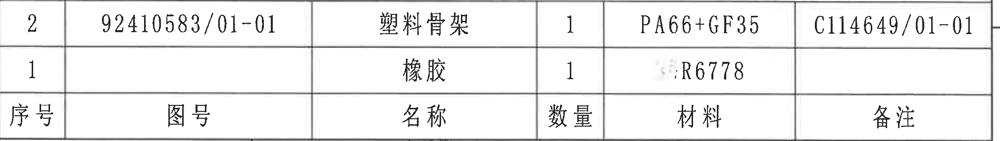

原图位置/视图名称：第 1 页右下上方 BOM/明细表，bbox `[2760, 2460, 4780, 2745]`。

### 原表还原

| 序号 | 图号 | 名称 | 数量 | 材料 | 备注 |
|---|---|---|---|---|---|
| 2 | `92410583/01-01` | 塑料骨架 | 1 | `PA66+GF35` | `C114649/01-01` |
| 1 |  | 橡胶 | 1 | `R6778` |  |

### 提取表格

| 提取项 | 原图数值或文本 | 含义说明 |
|---|---|---|
| 表头 | 序号；图号；名称；数量；材料；备注 | 明细表字段。 |
| 明细 2 | `92410583/01-01`；塑料骨架；数量 `1`；材料 `PA66+GF35`；备注 `C114649/01-01` | 塑料骨架零件条目。 |
| 明细 1 | 名称：橡胶；数量 `1`；材料 `R6778` | 橡胶零件条目，图号和备注为空白。 |

边界归属说明：裁切包含 BOM 三行原表内容，已去掉下方标题栏表格，不提取标题栏字段。

## object_12：标题栏

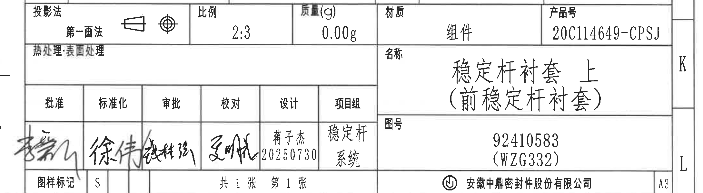

原图位置/视图名称：第 1 页右下角标题栏，bbox `[2680, 2730, 4860, 3330]`。

### 原表还原

| 字段 | 原图数值或文本 |
|---|---|
| 投影法 | 第一画法；投影符号 |
| 比例 | `2:3` |
| 质量(g) | `0.00g` |
| 材质 | 组件 |
| 产品号 | `20C114649-CPSJ` |
| 热处理 | 空白 |
| 表面处理 | 空白 |
| 名称 | 稳定杆衬套 上（前稳定杆衬套） |
| 图号 | `92410583 (WZG332)` |
| 批准 | 手写签名，无法可靠转写 |
| 标准化 | 手写签名，无法可靠转写 |
| 审批 | 手写签名，无法可靠转写 |
| 校对 | 手写签名，无法可靠转写 |
| 设计 | 蒋子杰 `20250730` |
| 项目组 | 稳定杆系统 |
| 图样标记 | `S` |
| 张数 | `共1张 第1张` |
| 公司 | 安徽中鼎密封件股份有限公司 |
| 图幅 | `A3` |

### 提取表格

| 提取项 | 原图数值或文本 | 含义说明 |
|---|---|---|
| 产品号 | `20C114649-CPSJ` | 产品编号。 |
| 名称 | `稳定杆衬套 上（前稳定杆衬套）` | 零件/组件名称。 |
| 图号 | `92410583 (WZG332)` | 图纸编号及括号内参考/关联编号。 |
| 材质 | `组件` | 标题栏材质/类型字段。 |
| 比例 | `2:3` | 图纸比例。 |
| 质量 | `0.00g` | 质量字段，单位 g。 |
| 投影法 | `第一画法` | 投影视图标准。 |
| 设计 | `蒋子杰 20250730` | 设计人员和日期。 |
| 项目组 | `稳定杆系统` | 项目组/系统归属。 |
| 公司 | `安徽中鼎密封件股份有限公司` | 出图单位。 |
| 图样标记 | `S` | 图样标记字段。 |
| 图幅 | `A3` | 图纸幅面。 |

边界归属说明：该对象为标题栏和签审栏。右侧 `K/L`、底部 `9-16` 是图框坐标，保留在裁切边缘以保证标题栏外框完整，但不作为标题栏字段提取。

## 裁切检查记录

| object_id | object_kind | image_path | 检查结论 |
|---|---|---|---|
| object_1 | table | `outputs/20C114649_assets/images/object_1.png` | 修订履历表行列和文字完整；未发现边缘文字被裁。 |
| object_2 | view | `outputs/20C114649_assets/images/object_2.png` | 主视图尺寸线、引出线和文字完整；右侧相邻视图内容未作为本对象提取。 |
| object_3 | view | `outputs/20C114649_assets/images/object_3.png` | A-A 剖切指示、R8、R4、`(5.51)`、高度尺寸和产品标识完整；右侧 A-A 剖面片段未提取。 |
| object_4 | section | `outputs/20C114649_assets/images/object_4.png` | A-A 剖面自身参考尺寸和引出线完整；已重裁排除 B-B 数值。 |
| object_5 | section | `outputs/20C114649_assets/images/object_5.png` | B-B 剖面、三条竖向尺寸、底部 `27.2` 和右侧 `(3)` 完整；右侧端面视图片段未提取。 |
| object_6 | view | `outputs/20C114649_assets/images/object_6.png` | `25*`、`26*`、B-B 剖切指示、型腔号和时间钟引出线完整；左侧 B-B 的 `(3)` 不归属本对象。 |
| object_7 | view | `outputs/20C114649_assets/images/object_7.png` | 左下视图四组尺寸线和文字完整，无其他视图混入。 |
| object_8 | notes | `outputs/20C114649_assets/images/object_8.png` | 技术要求 1-9 行完整；已扩展右边界以包含长句，未带入下方 BOM。 |
| object_9 | table | `outputs/20C114649_assets/images/object_9.png` | Deviating 表格外框、行线和文字完整；已重裁去掉底部图框坐标。 |
| object_10 | detail | `outputs/20C114649_assets/images/object_10.png` | 3D 参考图和 References 清单完整，`VW 52000`、`VW 91101` 已包含；右侧相邻表格不提取。 |
| object_11 | table | `outputs/20C114649_assets/images/object_11.png` | BOM 表头和两条明细记录完整；已重裁去掉下方标题栏。 |
| object_12 | title_block | `outputs/20C114649_assets/images/object_12.png` | 标题栏和签审栏字段完整；右侧/底部图框坐标仅作为边界背景，不提取。 |
