# 20C114650.pdf 内容识别与裁切提取

## 整页渲染

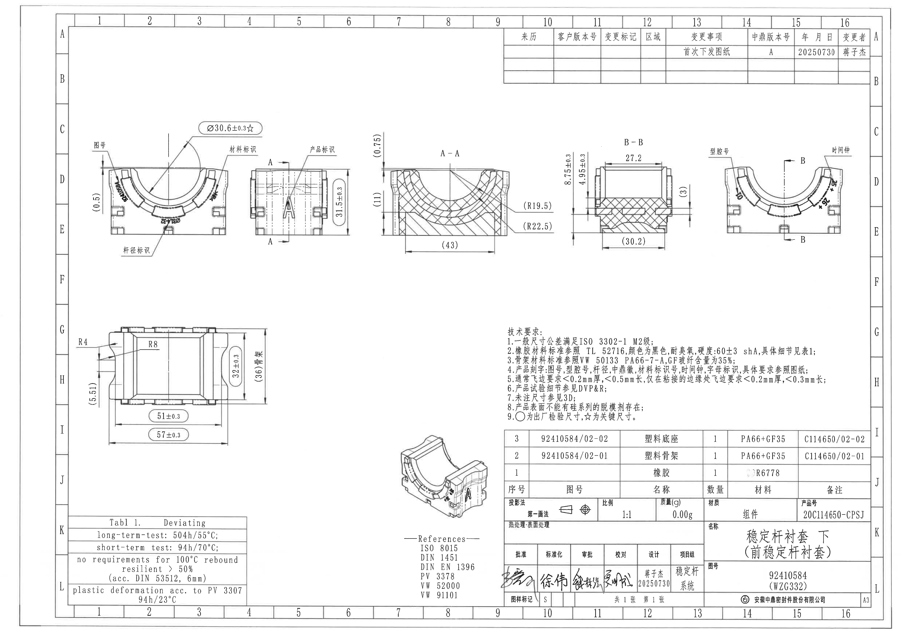

| 项目 | 值 |
|---|---|
| PDF | input/20C114650.pdf |
| 页数 | 1 |
| 整页 PNG | outputs/20C114650_assets/images/page_1.png |
| 图像尺寸 | 4959 x 3505 px |
| bbox | [0, 0, 4959, 3505] |

## object_1 - 上方左侧主视图 / 图号、材料标识、杆径标识区域

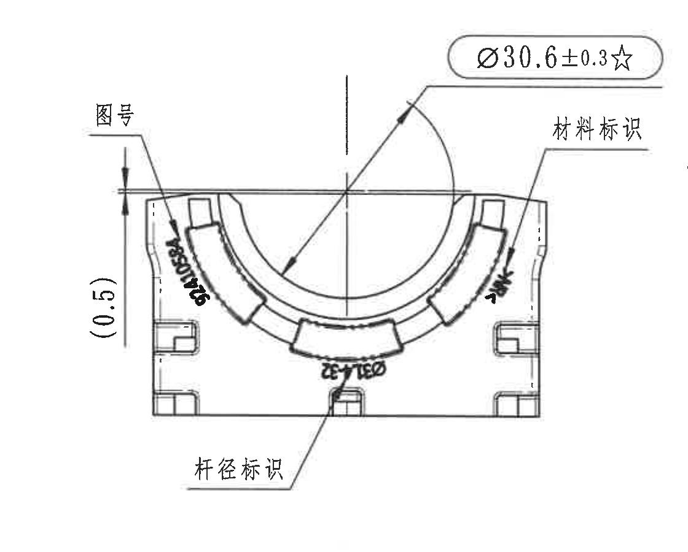

| 字段 | 内容 |
|---|---|
| 原图位置/视图名称 | 上方左侧主视图 / 图号、材料标识、杆径标识区域 |
| object_kind | view |
| page_number | 1 |
| bbox | [360, 610, 1120, 900] |
| image_path | outputs/20C114650_assets/images/object_1.png |

### 提取表格

| 提取项 | 原图数值或文本 | 含义说明 |
|---|---|---|
| 尺寸 | Ø30.6±0.3☆ | 半圆开口/内弧相关直径尺寸，带直径符号和星号；星号按技术要求第9条为关键尺寸。 |
| 参考尺寸 | (0.5) | 左侧竖向小尺寸，括号表示参考尺寸；位于本主视图左边界。 |
| 标识 | 图号 | 左上引线指向弧形标识区，表示该处需要产品刻字/图号标识。 |
| 标识 | 材料标识 | 右上引线指向弧形标识区，表示该处需要材料标识。 |
| 标识 | 杆径标识 | 下方引线指向底部弧形刻字区，表示该处为杆径标识。 |
| 弧向标识文字 | 弧边可见印字，包含类似“Ø31…/50…”等模糊字符 | 沿弧边布置的刻字/标识文字，扫描模糊，未作为确定尺寸读取；归属于主视图的标识信息。 |

### 边界归属说明

裁切范围保留主视图外形、直径标注框、左侧参考尺寸、三条中文引线；右侧相邻侧视图残片已遮除，未将侧视图尺寸归入本视图。

## object_2 - 上方中左侧侧视图 / A-A 剖切指示与产品标识

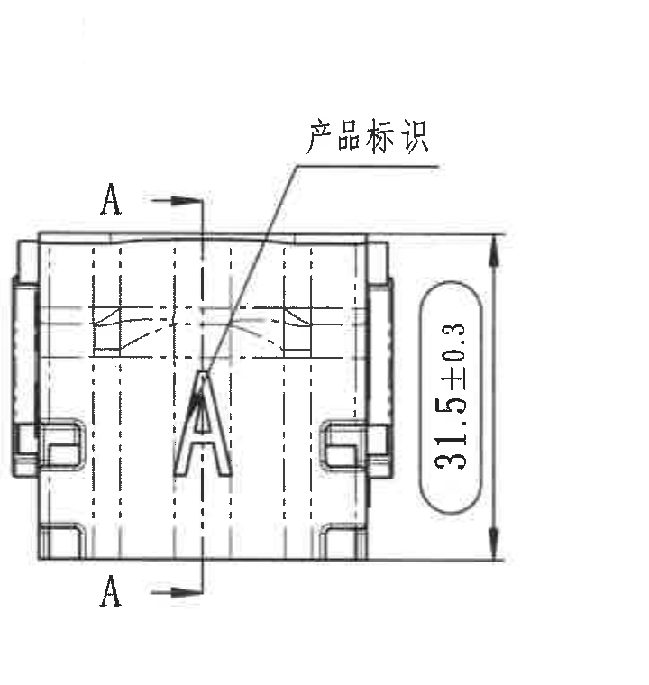

| 字段 | 内容 |
|---|---|
| 原图位置/视图名称 | 上方中左侧侧视图 / A-A 剖切指示与产品标识 |
| object_kind | view |
| page_number | 1 |
| bbox | [1360, 670, 720, 760] |
| image_path | outputs/20C114650_assets/images/object_2.png |

### 提取表格

| 提取项 | 原图数值或文本 | 含义说明 |
|---|---|---|
| 尺寸 | 31.5±0.3 | 右侧竖向总高尺寸，带±0.3公差；归属于该侧视图。 |
| 剖切标识 | A / A | 竖向剖切线两端的 A 标号与箭头，指示 A-A 剖面来源。 |
| 标识 | 产品标识 | 上方引线指向大写 A 标识区域，表示产品标识位置。 |
| 结构线 | 多条虚线和中心线 | 表示内部隐藏结构和中心位置；不单独作为尺寸。 |

### 边界归属说明

裁切仅保留侧视图、A-A 剖切线和产品标识引线；左侧主视图标注尾部和右侧 A-A 剖面参考尺寸残片已遮除。

## object_3 - A-A 剖面视图

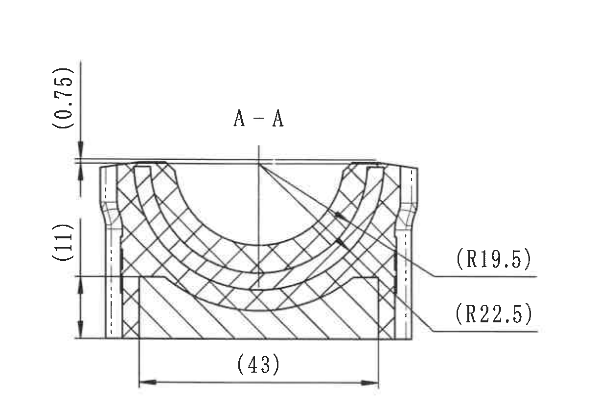

| 字段 | 内容 |
|---|---|
| 原图位置/视图名称 | A-A 剖面视图 |
| object_kind | section |
| page_number | 1 |
| bbox | [1940, 600, 1220, 860] |
| image_path | outputs/20C114650_assets/images/object_3.png |

### 提取表格

| 提取项 | 原图数值或文本 | 含义说明 |
|---|---|---|
| 视图名 | A-A | 剖面名称，来源于侧视图中的 A-A 剖切线。 |
| 参考尺寸 | (0.75) | 左上竖向参考尺寸，括号表示仅作参考。 |
| 参考尺寸 | (11) | 左侧竖向参考尺寸，表示剖面高度/层位相关参考值。 |
| 参考尺寸 | (43) | 底部水平参考尺寸，表示剖面总宽参考值。 |
| 参考半径 | (R19.5) | 右侧引线指向内侧弧面半径，括号表示参考半径。 |
| 参考半径 | (R22.5) | 右侧引线指向外侧弧面半径，括号表示参考半径。 |
| 剖面线 | 交叉剖面线与单向剖面线 | 区分材料截面区域/不同部件截面；不是尺寸。 |

### 边界归属说明

裁切保留 A-A 剖面本体、左侧参考尺寸、底部参考宽度和右侧两条半径引线；右侧 B-B 剖面竖向尺寸残片已遮除。

## object_4 - B-B 剖面视图

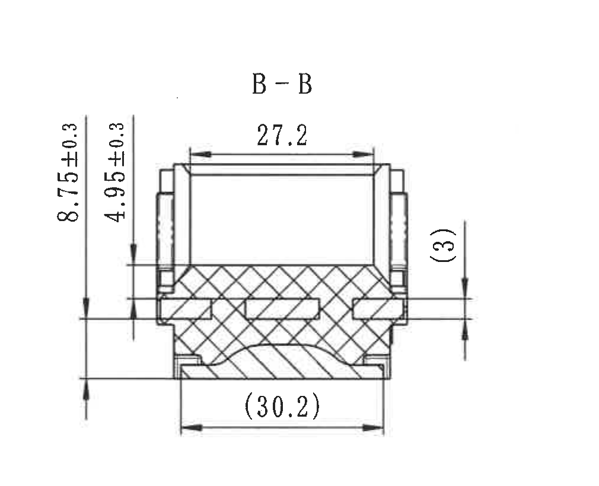

| 字段 | 内容 |
|---|---|
| 原图位置/视图名称 | B-B 剖面视图 |
| object_kind | section |
| page_number | 1 |
| bbox | [3000, 640, 1010, 820] |
| image_path | outputs/20C114650_assets/images/object_4.png |

### 提取表格

| 提取项 | 原图数值或文本 | 含义说明 |
|---|---|---|
| 视图名 | B-B | 剖面名称，来源于右侧视图中的 B-B 剖切线。 |
| 尺寸 | 27.2 | 上方水平尺寸，表示剖面上部开口/台阶宽度。 |
| 尺寸 | 8.75±0.3 | 左侧外侧竖向尺寸，带±0.3公差。 |
| 尺寸 | 4.95±0.3 | 左侧内侧竖向尺寸，带±0.3公差。 |
| 参考尺寸 | (3) | 右侧竖向参考尺寸。 |
| 参考尺寸 | (30.2) | 底部水平参考尺寸，表示底部宽度参考值。 |

### 边界归属说明

裁切保留 B-B 剖面完整尺寸线和文字；左侧 A-A 半径文字残片、右侧 B 向视图残片已遮除。

## object_5 - 上方右侧 B 向视图 / 型腔号与时间钟

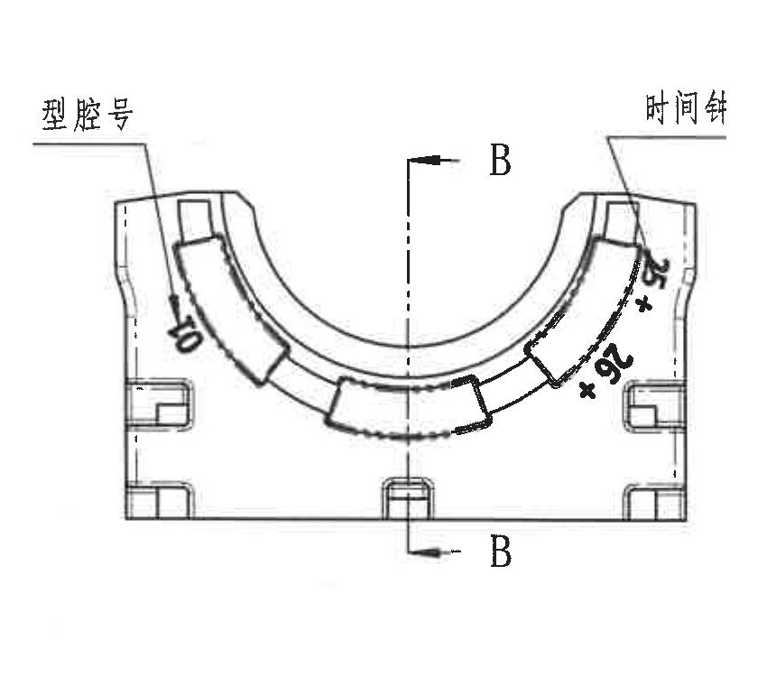

| 字段 | 内容 |
|---|---|
| 原图位置/视图名称 | 上方右侧 B 向视图 / 型腔号与时间钟 |
| object_kind | view |
| page_number | 1 |
| bbox | [3850, 705, 860, 750] |
| image_path | outputs/20C114650_assets/images/object_5.png |

### 提取表格

| 提取项 | 原图数值或文本 | 含义说明 |
|---|---|---|
| 剖切标识 | B / B | 竖向剖切线和上下箭头，指示 B-B 剖面来源。 |
| 标识 | 型腔号 | 左上引线指向左侧弧边标识区。 |
| 标识 | 时间钟 | 右上引线指向右侧弧边标识区。 |
| 弧向标识文字 | 左侧可见“50”样式字符；右侧可见“25”“26”等弧向字符 | 沿弧边布置的模具/时间相关刻字，扫描倾斜且局部模糊，按标识文字处理。 |

### 边界归属说明

裁切保留 B 向视图本体、B-B 剖切线、型腔号和时间钟引线；未带入右侧图框字母，也未把 B-B 剖面尺寸归入本视图。

## object_6 - 下方左侧平面/底向尺寸视图

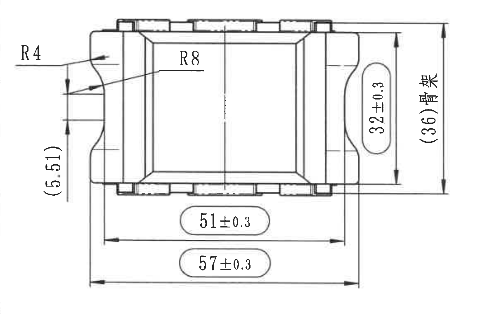

| 字段 | 内容 |
|---|---|
| 原图位置/视图名称 | 下方左侧平面/底向尺寸视图 |
| object_kind | view |
| page_number | 1 |
| bbox | [380, 1750, 1180, 780] |
| image_path | outputs/20C114650_assets/images/object_6.png |

### 提取表格

| 提取项 | 原图数值或文本 | 含义说明 |
|---|---|---|
| 半径 | R4 | 左上局部圆角/弧面半径。 |
| 半径 | R8 | 左上内侧引线所指圆角/弧面半径。 |
| 参考尺寸 | (5.51) | 左侧竖向参考尺寸，括号表示参考。 |
| 尺寸 | 32±0.3 | 右侧竖向尺寸，带±0.3公差。 |
| 参考尺寸 | (36)骨架 | 最右竖向参考总高，文字“骨架”说明该值对应骨架相关尺寸。 |
| 尺寸 | 51±0.3 | 下方内侧水平尺寸，带±0.3公差。 |
| 尺寸 | 57±0.3 | 下方外侧水平尺寸，带±0.3公差。 |

### 边界归属说明

裁切保留该平面/底向视图所有尺寸线、箭头和文字，未带入其他视图或表格。

## object_7 - 下方中部轴测参考图

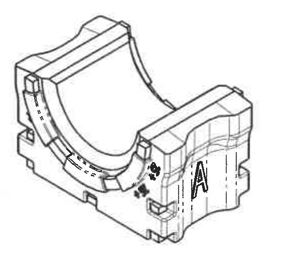

| 字段 | 内容 |
|---|---|
| 原图位置/视图名称 | 下方中部轴测参考图 |
| object_kind | detail |
| page_number | 1 |
| bbox | [2170, 2360, 600, 520] |
| image_path | outputs/20C114650_assets/images/object_7.png |

### 提取表格

| 提取项 | 原图数值或文本 | 含义说明 |
|---|---|---|
| 视图 | 轴测参考图 | 三维外观参考，显示半圆开口、侧面台阶、前侧 A 字母和局部弧形刻字。 |
| 标识 | A | 前侧面可见大写 A，与侧视图“产品标识”位置相呼应。 |
| 说明 | 无独立尺寸 | 该对象不含可读尺寸线，作为形状和标识位置参考。 |

### 边界归属说明

裁切只包含轴测图本体，右侧标题栏和下方 References 均未纳入。

## object_8 - 技术要求 / NOTES

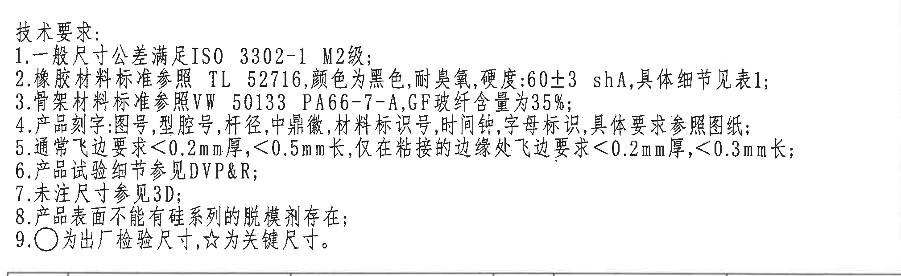

| 字段 | 内容 |
|---|---|
| 原图位置/视图名称 | 技术要求 / NOTES |
| object_kind | notes |
| page_number | 1 |
| bbox | [2750, 1750, 2020, 620] |
| image_path | outputs/20C114650_assets/images/object_8.png |

### 提取表格

| 提取项 | 原图数值或文本 | 含义说明 |
|---|---|---|
| 标题 | 技术要求: | 技术要求列表标题。 |
| 1 | 一般尺寸公差满足ISO 3302-1 M2级; | 未单独标注公差的尺寸按 ISO 3302-1 M2 级。 |
| 2 | 橡胶材料标准参照 TL 52716,颜色为黑色,耐臭氧,硬度:60±3 shA,具体细节见表1; | 橡胶材料、颜色、耐臭氧和硬度要求；硬度为 60±3 shA，并关联表1。 |
| 3 | 骨架材料标准参照VW 50133 PA66-7-A,GF玻纤含量为35%; | 骨架材料标准和玻纤含量要求。 |
| 4 | 产品刻字:图号,型腔号,杆径,中鼎徽,材料标识号,时间钟,字母标识,具体要求参照图纸; | 刻字项目要求，和多个视图中的图号/型腔号/杆径/材料/时间钟/A 标识对应。 |
| 5 | 通常飞边要求<0.2mm厚,<0.5mm长,仅在粘接的边缘处飞边要求<0.2mm厚,<0.3mm长; | 飞边厚度和长度限制，包含普通边缘与粘接边缘两类。 |
| 6 | 产品试验细节参见DVP&R; | 试验细节引用 DVP&R。 |
| 7 | 未注尺寸参见3D; | 未注尺寸以 3D 数据为准。 |
| 8 | 产品表面不能有硅系列的脱模剂存在; | 表面禁止硅系列脱模剂残留。 |
| 9 | ○为出厂检验尺寸,☆为关键尺寸。 | 圆圈符号表示出厂检验尺寸，星号表示关键尺寸。 |

### 边界归属说明

裁切保留技术要求 1-9 条完整文字；下缘仅可见相邻明细表上边界线，不提取该表内容。

## object_9 - 左下 Table 1 / Deviating

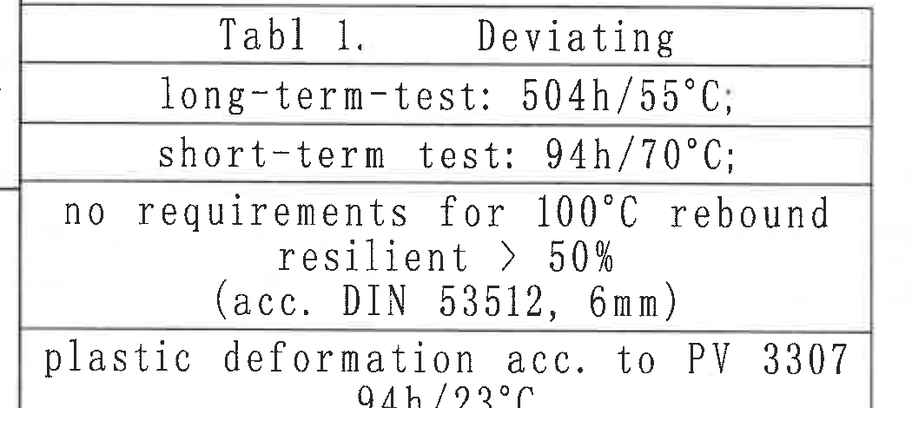

| 字段 | 内容 |
|---|---|
| 原图位置/视图名称 | 左下 Table 1 / Deviating |
| object_kind | table |
| page_number | 1 |
| bbox | [350, 2830, 1050, 500] |
| image_path | outputs/20C114650_assets/images/object_9.png |

### 原表还原

| Tabl 1. | Deviating |
| --- | --- |
| long-term-test: | 504h/55°C; |
| short-term test: | 94h/70°C; |
| no requirements for 100°C rebound resilient > 50% (acc. DIN 53512, 6mm) |  |
| plastic deformation acc. to PV 3307 | 94h/23°C |

### 提取表格

| 提取项 | 原图数值或文本 | 含义说明 |
|---|---|---|
| 表题 | Tabl 1. / Deviating | 按原图扫描文字还原表题。 |
| 试验条件 | long-term-test: 504h/55°C; | 长期试验条件。 |
| 试验条件 | short-term test: 94h/70°C; | 短期试验条件。 |
| 要求 | no requirements for 100°C rebound resilient > 50% (acc. DIN 53512, 6mm) | 100°C 回弹相关说明；原表为跨行文本。 |
| 要求 | plastic deformation acc. to PV 3307 / 94h/23°C | 塑性变形试验依据 PV 3307，条件 94h/23°C。 |

### 边界归属说明

裁切保留表格外框和全部行文字；底部图框数字行已遮除。

## object_10 - References 标准引用列表

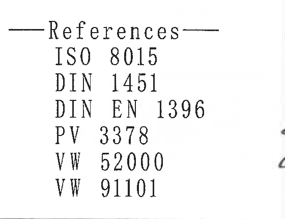

| 字段 | 内容 |
|---|---|
| 原图位置/视图名称 | References 标准引用列表 |
| object_kind | table |
| page_number | 1 |
| bbox | [2200, 2900, 560, 430] |
| image_path | outputs/20C114650_assets/images/object_10.png |

### 原表还原

| References |
| --- |
| ISO 8015 |
| DIN 1451 |
| DIN EN 1396 |
| PV 3378 |
| VW 52000 |
| VW 91101 |

### 提取表格

| 提取项 | 原图数值或文本 | 含义说明 |
|---|---|---|
| 标准 | ISO 8015 | 引用标准。 |
| 标准 | DIN 1451 | 引用标准。 |
| 标准 | DIN EN 1396 | 引用标准。 |
| 标准 | PV 3378 | 引用标准。 |
| 标准 | VW 52000 | 引用标准。 |
| 标准 | VW 91101 | 引用标准。 |

### 边界归属说明

裁切只包含 References 列表，右侧标题栏/签名区域未纳入。

## object_11 - 右上修订履历表

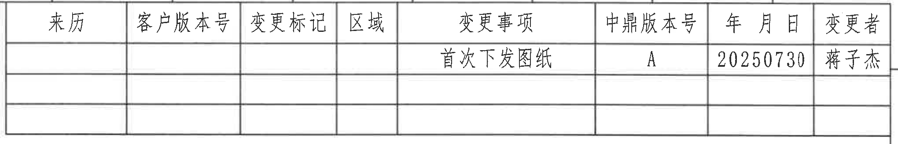

| 字段 | 内容 |
|---|---|
| 原图位置/视图名称 | 右上修订履历表 |
| object_kind | table |
| page_number | 1 |
| bbox | [2750, 150, 2040, 330] |
| image_path | outputs/20C114650_assets/images/object_11.png |

### 原表还原

| 来历 | 客户版本号 | 变更标记 | 区域 | 变更事项 | 中鼎版本号 | 年 月 日 | 变更者 |
| --- | --- | --- | --- | --- | --- | --- | --- |
|  |  |  |  | 首次下发图纸 | A | 20250730 | 蒋子杰 |
|  |  |  |  |  |  |  |  |
|  |  |  |  |  |  |  |  |

### 提取表格

| 提取项 | 原图数值或文本 | 含义说明 |
|---|---|---|
| 表头 | 来历 / 客户版本号 / 变更标记 / 区域 / 变更事项 / 中鼎版本号 / 年 月 日 / 变更者 | 修订履历列名。 |
| 记录 | 首次下发图纸 / A / 20250730 / 蒋子杰 | 首次发布记录，版本 A，日期 2025-07-30，变更者蒋子杰。 |

### 边界归属说明

裁切保留修订履历表全部行列和外框；上方图框坐标数字已排除。

## object_12 - 右下明细表与投影/比例/质量/产品号栏

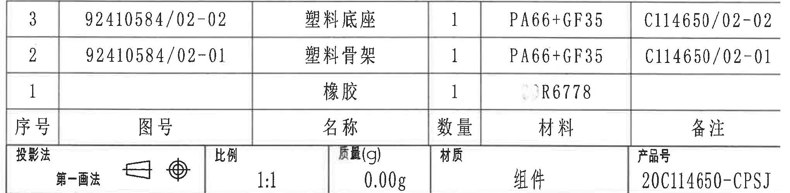

| 字段 | 内容 |
|---|---|
| 原图位置/视图名称 | 右下明细表与投影/比例/质量/产品号栏 |
| object_kind | table |
| page_number | 1 |
| bbox | [2750, 2360, 2040, 500] |
| image_path | outputs/20C114650_assets/images/object_12.png |

### 原表还原

| 序号 | 图号 | 名称 | 数量 | 材料 | 备注 |
| --- | --- | --- | --- | --- | --- |
| 3 | 92410584/02-02 | 塑料底座 | 1 | PA66+GF35 | C114650/02-02 |
| 2 | 92410584/02-01 | 塑料骨架 | 1 | PA66+GF35 | C114650/02-01 |
| 1 |  | 橡胶 | 1 | R6778（前缀痕迹不清） |  |
| 投影法 | 第一画法 | 比例 | 1:1 | 质量(g) | 0.00g |
| 材质 |  | 产品号 | 20C114650-CPSJ |  | 组件 |

### 提取表格

| 提取项 | 原图数值或文本 | 含义说明 |
|---|---|---|
| 明细 3 | 92410584/02-02 / 塑料底座 / 1 / PA66+GF35 / C114650/02-02 | 塑料底座零件信息。 |
| 明细 2 | 92410584/02-01 / 塑料骨架 / 1 / PA66+GF35 / C114650/02-01 | 塑料骨架零件信息。 |
| 明细 1 | 橡胶 / 1 / R6778（前缀痕迹不清） | 橡胶件信息；材料格前部有浅色痕迹，稳定可读为 R6778。 |
| 投影法 | 第一画法 | 投影方法栏，旁有第一角法投影视图符号。 |
| 比例 | 1:1 | 图样比例。 |
| 质量 | 0.00g | 质量栏数值。 |
| 产品号 | 20C114650-CPSJ | 产品号栏。 |
| 材质 | 组件 | 材质/组件栏。 |

### 边界归属说明

裁切保留明细表、投影法、比例、质量、材质和产品号栏；右侧图框边线残片已遮除，标题栏主体另列 object_13。

## object_13 - 右下标题栏 / 签审与图号名称

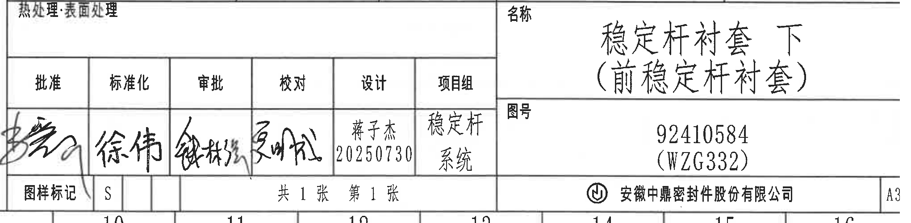

| 字段 | 内容 |
|---|---|
| 原图位置/视图名称 | 右下标题栏 / 签审与图号名称 |
| object_kind | title_block |
| page_number | 1 |
| bbox | [2750, 2860, 2040, 500] |
| image_path | outputs/20C114650_assets/images/object_13.png |

### 原表还原

| 区域 | 字段1 | 字段2 | 字段3 | 字段4 | 字段5 |
| --- | --- | --- | --- | --- | --- |
| 热处理:表面处理 |  | 名称 | 稳定杆衬套 下（前稳定杆衬套） |  |  |
| 批准 | 标准化 | 审批 | 校对 | 设计 | 项目组 |
| 签名/日期 |  |  |  | 蒋子杰 20250730 | 稳定杆系统 |
| 图号 | 92410584 (WZG332) |  |  |  |  |
| 图样标记 | S | 共1张 第1张 | 公司 | 安徽中鼎密封件股份有限公司 | A3 |

### 提取表格

| 提取项 | 原图数值或文本 | 含义说明 |
|---|---|---|
| 名称 | 稳定杆衬套 下（前稳定杆衬套） | 零件/组件名称。 |
| 图号 | 92410584 (WZG332) | 图纸编号。 |
| 设计 | 蒋子杰 20250730 | 设计栏签名/日期。 |
| 项目组 | 稳定杆系统 | 项目组栏。 |
| 图样标记 | S | 图样标记栏。 |
| 张数 | 共1张 第1张 | 页数栏。 |
| 公司 | 安徽中鼎密封件股份有限公司 | 出图公司。 |
| 幅面 | A3 | 图幅。 |
| 热处理/表面处理 | 热处理:表面处理 | 该栏标题存在，内容空白。 |
| 签审栏 | 批准/标准化/审批/校对/设计/项目组 | 签审分栏；部分手写签名不可稳定转写。 |

### 边界归属说明

裁切保留标题栏主体和签审栏；上方明细表尾部与底部图框坐标数字不作为标题栏内容提取。

## 裁切检查记录

| 对象 | 检查结果 |
|---|---|
| object_1 | 完整包含 Ø30.6±0.3☆ 标注框、左侧 (0.5)、三条引线和主视图轮廓；右侧侧视图残片已遮除。 |
| object_2 | 完整包含 31.5±0.3、高度尺寸线、A-A 剖切符号和产品标识引线；相邻主视图/A-A 残片已遮除。 |
| object_3 | 完整包含 A-A 剖面、(0.75)、(11)、(43)、(R19.5)、(R22.5) 及引线；B-B 竖向尺寸残片已遮除。 |
| object_4 | 完整包含 B-B 剖面、27.2、8.75±0.3、4.95±0.3、(3)、(30.2)；左右相邻视图片段已遮除。 |
| object_5 | 完整包含 B 向视图、B-B 剖切线、型腔号和时间钟引线；图框字母未纳入。 |
| object_6 | 完整包含 R4、R8、(5.51)、32±0.3、(36)骨架、51±0.3、57±0.3 及全部箭头/尺寸线。 |
| object_7 | 完整包含轴测参考图；右侧标题栏和下方 References 未纳入。 |
| object_8 | 完整包含技术要求 1-9 条文字；下缘仅保留少量相邻表格上边界线，没有提取相邻表格内容。 |
| object_9 | 完整包含 Table 1 外框和所有行文字；底部图框数字行已遮除。 |
| object_10 | 完整包含 References 标题和 6 条标准编号；右侧标题栏/签名残片未纳入。 |
| object_11 | 完整包含修订履历表表头、记录行和空行；上方图框坐标数字已排除。 |
| object_12 | 完整包含明细表、投影法、比例、质量、材质、产品号栏；右侧图框边线残片已遮除。 |
| object_13 | 完整包含标题栏名称、图号、签审、页数、公司和 A3 信息；上方明细表尾部和底部图框坐标数字未作为内容提取。 |

## 全部实体归属说明

所有尺寸、参考尺寸、带星号关键尺寸、直径符号、半径、剖切字母、标识文字、技术要求、表格字段和标题栏字段均同时写入 outputs/20C114650_manifest.json 的 objects.text、objects.context 与 entities。
