# 20C114651.pdf 内容识别结果

说明：坐标 bbox 以整页 PNG 左上角为原点，单位为像素，格式为 `[x1, y1, x2, y2]`。所有裁切图路径均为相对当前目录路径。

整页渲染图：`outputs/20C114651_assets/images/page_1.png`，尺寸 4959 x 3505 px。

## object_1 - 修订履历表

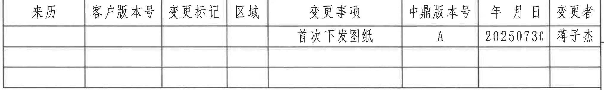

- 原图位置/视图名称：页面右上角修订履历表，bbox `[2740, 165, 4770, 470]`
- object_kind：table

原表行列还原：

| 来历 | 客户版本号 | 变更标记 | 区域 | 变更事项 | 中鼎版本号 | 年 月 日 | 变更者 |
|---|---|---|---|---|---|---|---|
|  |  |  |  | 首次下发图纸 | A | 20250730 | 蒋子杰 |
|  |  |  |  |  |  |  |  |
|  |  |  |  |  |  |  |  |

提取表：

| 提取项 | 原图数值或文本 | 含义说明 |
|---|---|---|
| 表头 | 来历、客户版本号、变更标记、区域、变更事项、中鼎版本号、年 月 日、变更者 | 修订履历字段 |
| 修订记录 1 | 变更事项：首次下发图纸；中鼎版本号：A；年 月 日：20250730；变更者：蒋子杰 | 图纸首次发布记录 |
| 空白记录行 | 2 行 | 预留修订记录行 |

边界归属说明：裁切仅包含右上角修订履历表；顶部图框分区编号未作为表格内容提取。

## object_2 - 主半圆端面视图

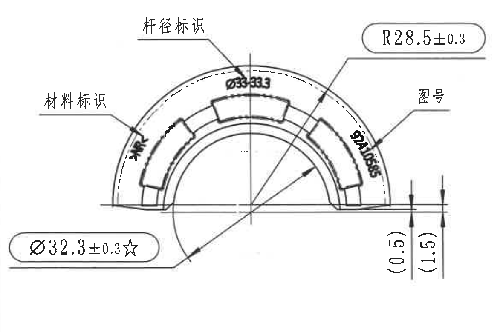

- 原图位置/视图名称：页面左上主半圆端面视图，bbox `[380, 850, 1560, 1630]`
- object_kind：view

提取表：

| 提取项 | 原图数值或文本 | 含义说明 |
|---|---|---|
| 半径尺寸 | R28.5±0.3 | 外侧圆弧半径，带 ±0.3 公差 |
| 直径尺寸 | Ø32.3±0.3☆ | 关键直径尺寸；☆表示关键尺寸，含 ±0.3 公差 |
| 参考高度 | (0.5) | 括号内参考尺寸，表示底部局部台阶/边缘相对高度参考值 |
| 参考高度 | (1.5) | 括号内参考尺寸，表示底部局部台阶/边缘另一高度参考值 |
| 杆径标识 | Ø33.33 | 箭头指向外弧上方刻字区域，表示杆径标识内容 |
| 材料标识 | 材料标识 | 箭头指向左侧外弧刻字区域；具体刻字因扫描模糊按标识位置记录 |
| 图号 | 图号 | 箭头指向右侧外弧刻字区域；具体刻字因扫描模糊按图号标识位置记录 |
| 中心线/径向线 | 竖向中心线、斜向半径引线 | 用于确定半径、直径和圆弧中心位置 |

边界归属说明：本裁切包含主半圆端面视图及其 R28.5、Ø32.3、(0.5)、(1.5) 等尺寸；右侧相邻投影视图和剖视图未纳入本对象提取。

## object_3 - 中上投影视图 / A-A 剖切位置视图

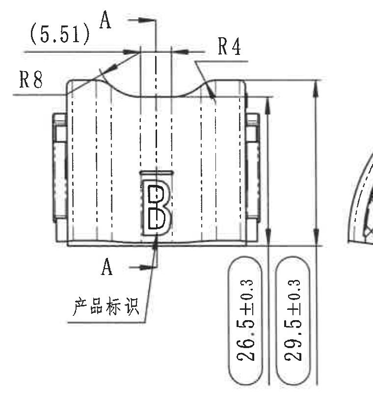

- 原图位置/视图名称：页面上方中左投影视图，bbox `[1540, 840, 2300, 1660]`
- object_kind：view

提取表：

| 提取项 | 原图数值或文本 | 含义说明 |
|---|---|---|
| 参考尺寸 | (5.51) | 括号内参考尺寸，位于顶部左侧，表示上部开口/槽相关参考距离 |
| 圆角半径 | R8 | 左上过渡圆角半径 |
| 圆角半径 | R4 | 右上过渡圆角半径 |
| 高度尺寸 | 26.5±0.3 | 内侧/主体高度尺寸，带 ±0.3 公差 |
| 总高尺寸 | 29.5±0.3 | 外侧总高度尺寸，带 ±0.3 公差 |
| 剖切标记 | A、A | 剖切位置标记，指向 A-A 剖面 |
| 字母标识 | B | 产品表面字母标识 |
| 产品标识 | 产品标识 | 箭头指向底部字母 B 标识区域 |

边界归属说明：右边缘因 29.5±0.3 尺寸线与 A-A 剖视图距离很近，保留了极窄相邻弧线片段；该片段不属于本视图，不提取其尺寸。A-A 剖面尺寸单独记录在 object_4。

## object_4 - A-A 剖面视图

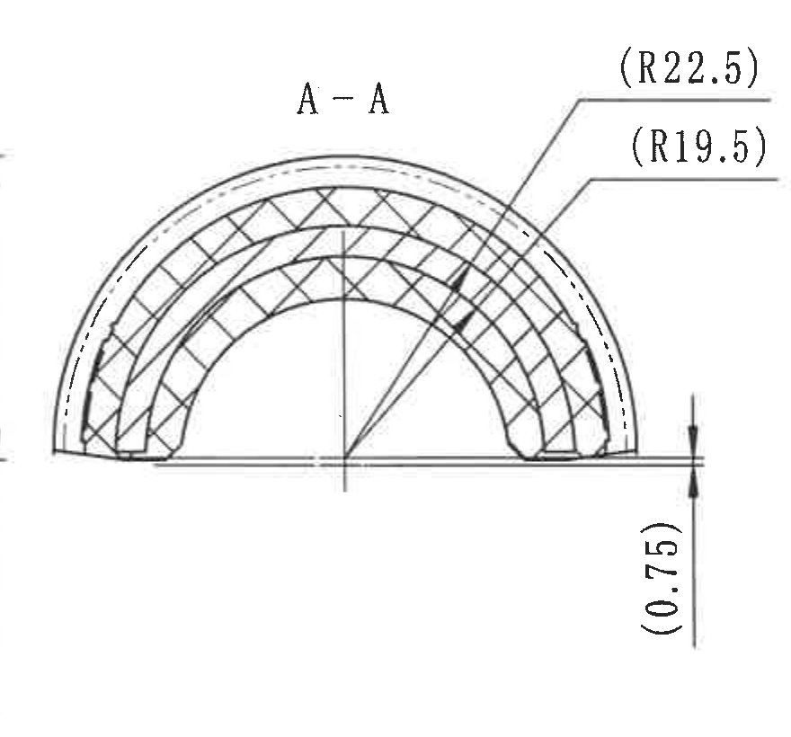

- 原图位置/视图名称：页面上方中部 A-A 剖面，bbox `[2190, 830, 3070, 1650]`
- object_kind：section

提取表：

| 提取项 | 原图数值或文本 | 含义说明 |
|---|---|---|
| 剖面名称 | A-A | 来自 object_3 的 A-A 剖切方向 |
| 参考半径 | (R22.5) | 括号内参考半径，指向外侧剖面圆弧 |
| 参考半径 | (R19.5) | 括号内参考半径，指向内侧剖面圆弧 |
| 参考高度 | (0.75) | 括号内参考尺寸，位于右侧底部局部高度 |
| 剖面填充 | 交叉剖面线 | 表示剖切到的材料实体区域 |

边界归属说明：本对象只记录 A-A 剖面内的括号参考半径和参考高度；右侧 B-B 高度尺寸未归入本对象。

## object_5 - B-B 剖面视图

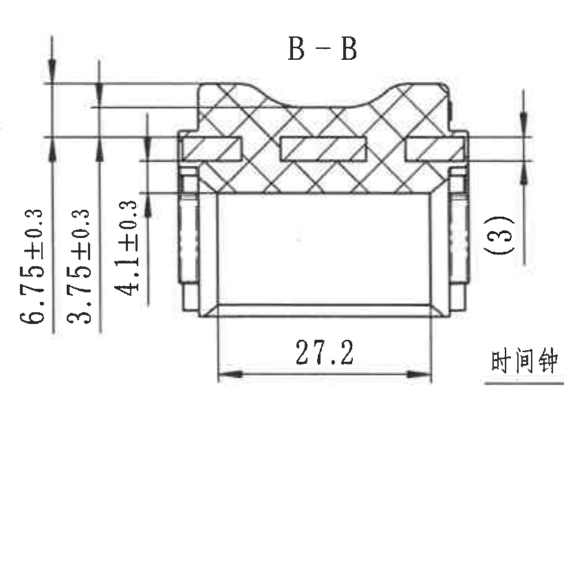

- 原图位置/视图名称：页面上方中右 B-B 剖面，bbox `[3060, 850, 3880, 1670]`
- object_kind：section

提取表：

| 提取项 | 原图数值或文本 | 含义说明 |
|---|---|---|
| 剖面名称 | B-B | 来自右侧局部半圆视图的 B-B 剖切方向 |
| 高度尺寸 | 6.75±0.3 | 左侧最外层高度尺寸，带 ±0.3 公差 |
| 高度尺寸 | 3.75±0.3 | 左侧中间高度尺寸，带 ±0.3 公差 |
| 高度尺寸 | 4.1±0.3 | 左侧内层高度尺寸，带 ±0.3 公差 |
| 参考尺寸 | (3) | 右侧局部参考高度/厚度尺寸 |
| 宽度尺寸 | 27.2 | 底部水平宽度尺寸 |
| 剖面填充 | 交叉剖面线 | 表示剖切到的橡胶/实体截面 |

边界归属说明：右下“时间钟”引线属于右侧局部半圆视图 object_6，未作为 B-B 剖面内容提取；B-B 的 6.75、3.75、4.1、(3)、27.2 尺寸线和文字完整保留。

## object_6 - 右侧局部半圆视图 / B-B 剖切位置视图

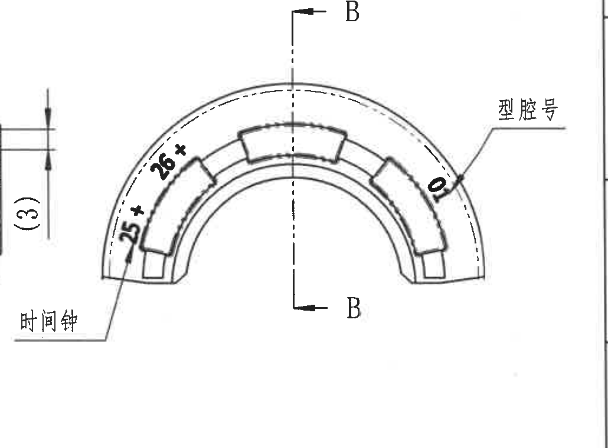

- 原图位置/视图名称：页面右上局部半圆视图，bbox `[3740, 830, 4770, 1590]`
- object_kind：detail

提取表：

| 提取项 | 原图数值或文本 | 含义说明 |
|---|---|---|
| 剖切标记 | B、B | 竖向剖切线，指向 B-B 剖面 |
| 弧向/刻字标记 | 25* | 位于左下外弧附近的带星号标记；按原图作为关键刻字/位置标记记录 |
| 弧向/刻字标记 | 26* | 位于左上外弧附近的带星号标记；按原图作为关键刻字/位置标记记录 |
| 型腔号 | 型腔号 | 箭头指向右侧外弧刻字区域 |
| 型腔号值 | 0 | 位于右侧外弧附近的型腔号/刻字值 |
| 时间钟 | 时间钟 | 左下引线指向局部半圆左下弧面位置，表示时间钟刻印 |

边界归属说明：左边缘有 B-B 剖面尺寸箭头的极小残片，为保留“时间钟”完整引线不可避免；该残片不属于本局部视图提取内容。B-B 剖面尺寸只记录在 object_5。

## object_7 - 下方侧向视图

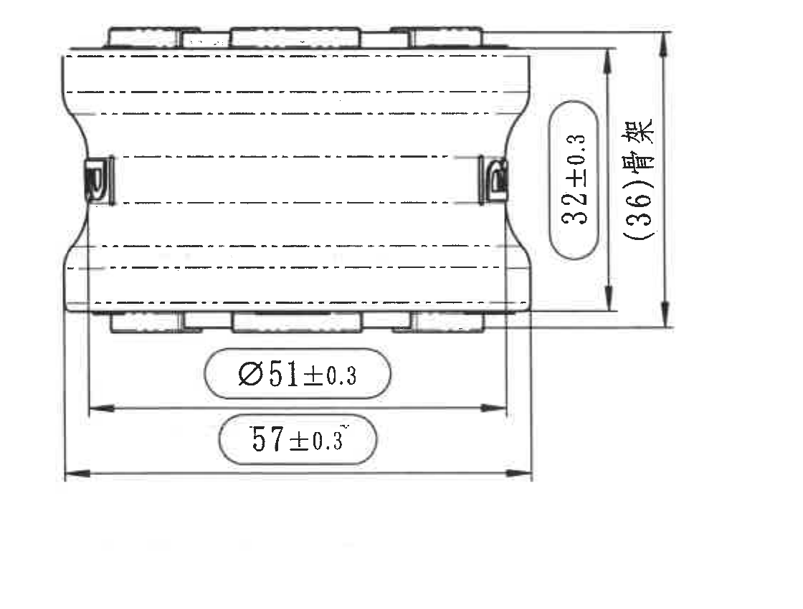

- 原图位置/视图名称：页面左下侧向视图，bbox `[560, 1680, 1680, 2530]`
- object_kind：view

提取表：

| 提取项 | 原图数值或文本 | 含义说明 |
|---|---|---|
| 高度尺寸 | 32±0.3 | 右侧内侧高度尺寸，带 ±0.3 公差 |
| 参考高度/骨架 | (36)骨架 | 括号内参考尺寸，标注骨架相关总高/外侧高度 |
| 直径尺寸 | Ø51±0.3 | 底部内侧水平直径/宽度尺寸，带 ±0.3 公差 |
| 水平总长 | 57±0.3 | 底部外侧总长度尺寸，带 ±0.3 公差 |
| 隐藏线 | 多条水平虚线 | 表示内部轮廓或隐藏结构 |

边界归属说明：裁切覆盖下方侧向视图及其右侧高度、底部水平尺寸；未包含左上主半圆视图或右侧等轴参考图。

## object_8 - 等轴参考图

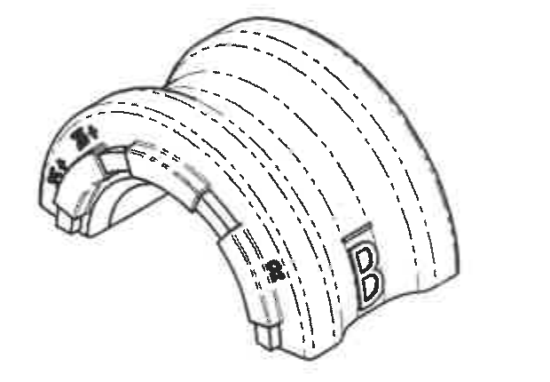

- 原图位置/视图名称：页面下方中部等轴参考图，bbox `[2120, 2460, 2740, 2890]`
- object_kind：detail

提取表：

| 提取项 | 原图数值或文本 | 含义说明 |
|---|---|---|
| 字母标识 | B | 立体图右侧表面字母标识 |
| 弧向/刻字标记 | 25* | 左前端外弧上的带星号标记 |
| 弧向/刻字标记 | 26* | 左前端外弧上的带星号标记 |
| 弧向/刻字标记 | 28* | 中部弧面附近可见带星号标记，扫描略模糊 |
| 参考作用 | 等轴外观参考 | 用于辅助理解刻字和外形分布，不含独立尺寸线 |

边界归属说明：已与下方 References 文本分离；本对象只提取等轴参考图中可见的字母和弧向标记。

## object_9 - 技术要求 / NOTES

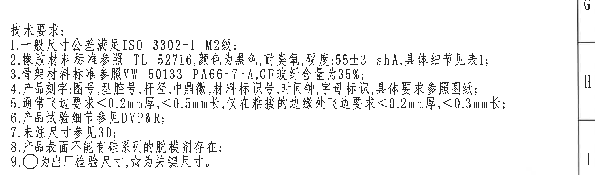

- 原图位置/视图名称：页面右下中部技术要求，bbox `[2730, 1810, 4830, 2430]`
- object_kind：notes

提取表：

| 提取项 | 原图数值或文本 | 含义说明 |
|---|---|---|
| 标题 | 技术要求： | 技术要求列表标题 |
| 1 | 一般尺寸公差满足ISO 3302-1 M2级； | 一般尺寸公差标准 |
| 2 | 橡胶材料标准参照 TL 52716，颜色为黑色，耐臭氧，硬度:55±3 shA，具体细节见表1； | 橡胶材料、颜色、耐臭氧和硬度要求 |
| 3 | 骨架材料标准参照VW 50133 PA66-7-A，GF玻纤含量为35%； | 骨架材料与玻纤含量要求 |
| 4 | 产品刻字:图号，型腔号，杆径，中鼎徽，材料标识号，时间钟，字母标识，具体要求参照图纸； | 刻字/标识内容要求 |
| 5 | 通常飞边要求<0.2mm厚，<0.5mm长，仅在粘接的边缘处飞边要求<0.2mm厚，<0.3mm长； | 飞边厚度和长度要求 |
| 6 | 产品试验细节参见DVP&R； | 试验文件引用 |
| 7 | 未注尺寸参见3D； | 未标注尺寸以 3D 数据为准 |
| 8 | 产品表面不能有硅系列的脱模剂存在； | 表面脱模剂限制 |
| 9 | ○为出厂检验尺寸，☆为关键尺寸。 | 符号含义：圆圈为出厂检验尺寸，星号为关键尺寸 |

边界归属说明：裁切完整包含 1-9 条技术要求；右侧可见图框分区字母不是技术要求内容，未提取。

## object_10 - References 标准清单

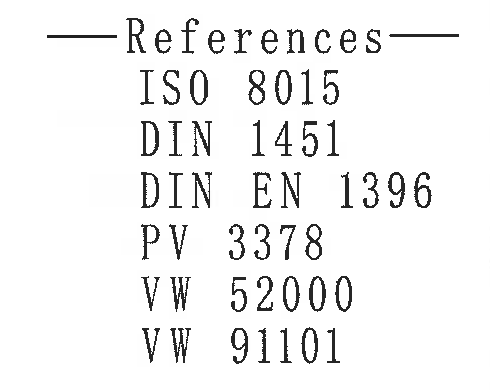

- 原图位置/视图名称：页面下方中部 References 标准清单，bbox `[2260, 2930, 2750, 3320]`
- object_kind：notes

提取表：

| 提取项 | 原图数值或文本 | 含义说明 |
|---|---|---|
| 标题 | References | 引用标准清单标题 |
| 引用标准 | ISO 8015 | 引用标准 |
| 引用标准 | DIN 1451 | 引用标准 |
| 引用标准 | DIN EN 1396 | 引用标准 |
| 引用标准 | PV 3378 | 引用标准 |
| 引用标准 | VW 52000 | 引用标准 |
| 引用标准 | VW 91101 | 引用标准 |

边界归属说明：裁切仅包含 References 标准清单；右侧签字栏和下方标题栏未纳入。

## object_11 - Tabl 1. Deviating 表

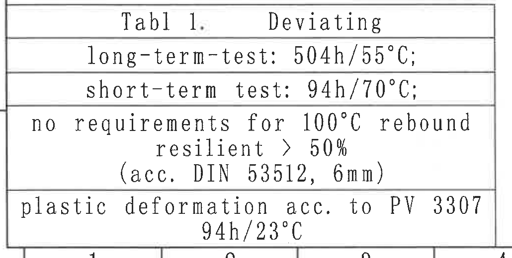

- 原图位置/视图名称：页面左下角 Tabl 1. Deviating 表，bbox `[360, 2840, 1390, 3360]`
- object_kind：table

原表行列还原：

| Tabl 1. | Deviating |
|---|---|
| long-term-test: 504h/55°C; |  |
| short-term test: 94h/70°C; |  |
| no requirements for 100°C rebound resilient > 50% (acc. DIN 53512, 6mm) |  |
| plastic deformation acc. to PV 3307 94h/23°C |  |

提取表：

| 提取项 | 原图数值或文本 | 含义说明 |
|---|---|---|
| 表标题 | Tabl 1. Deviating | 偏差/试验条件表标题 |
| 长期测试 | long-term-test: 504h/55°C; | 长期测试条件 |
| 短期测试 | short-term test: 94h/70°C; | 短期测试条件 |
| 100°C 回弹要求 | no requirements for 100°C rebound resilient > 50% (acc. DIN 53512, 6mm) | 100°C 回弹无要求；回弹率条件为 >50%，依据 DIN 53512，6mm |
| 塑性变形 | plastic deformation acc. to PV 3307 94h/23°C | 塑性变形依据 PV 3307，条件 94h/23°C |

边界归属说明：表格内容完整；底部可见图框分区线不属于表格字段，未提取。

## object_12 - 明细/材料表

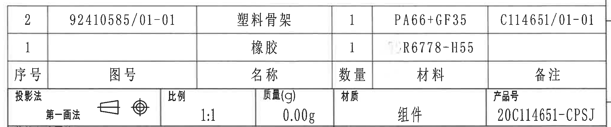

- 原图位置/视图名称：页面右下方明细/材料表，bbox `[2740, 2440, 4790, 2870]`
- object_kind：table

原表行列还原：

| 序号 | 图号 | 名称 | 数量 | 材料 | 备注 |
|---|---|---|---|---|---|
| 2 | 92410585/01-01 | 塑料骨架 | 1 | PA66+GF35 | C114651/01-01 |
| 1 |  | 橡胶 | 1 | R6778-H55 |  |

提取表：

| 提取项 | 原图数值或文本 | 含义说明 |
|---|---|---|
| 表头 | 序号、图号、名称、数量、材料、备注 | 明细/材料表字段 |
| 序号 2 | 图号 92410585/01-01；名称 塑料骨架；数量 1；材料 PA66+GF35；备注 C114651/01-01 | 塑料骨架明细 |
| 序号 1 | 图号空白；名称 橡胶；数量 1；材料 R6778-H55；备注空白 | 橡胶明细 |
| 投影法 | 第一画法 | 下方标题栏投影法字段与明细表相邻 |
| 比例 | 1:1 | 下方标题栏比例字段 |
| 质量(g) | 0.00g | 下方标题栏质量字段 |
| 材质 | 组件 | 下方标题栏材质/装配属性 |
| 产品号 | 20C114651-CPSJ | 下方标题栏产品号字段 |

边界归属说明：上半部为明细/材料表；下沿与标题栏首行相接，投影法、比例、质量、材质、产品号属于标题栏字段，最终归入 object_13，同时在此处记录其相邻位置。

## object_13 - 标题栏

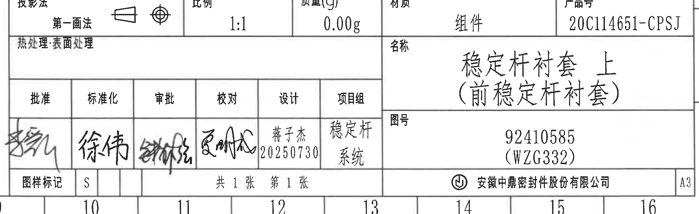

- 原图位置/视图名称：页面右下角标题栏，bbox `[2740, 2760, 4790, 3390]`
- object_kind：title_block

提取表：

| 提取项 | 原图数值或文本 | 含义说明 |
|---|---|---|
| 投影法 | 第一画法 | 第一角法投影标识，旁有投影视图符号 |
| 比例 | 1:1 | 图纸比例 |
| 质量(g) | 0.00g | 质量字段 |
| 材质 | 组件 | 材质/装配属性字段 |
| 产品号 | 20C114651-CPSJ | 产品号 |
| 热处理:表面处理 | 空白 | 热处理/表面处理未填写 |
| 名称 | 稳定杆衬套 上（前稳定杆衬套） | 零件/组件名称 |
| 图号 | 92410585（WZG332） | 图号及括号内附加编号 |
| 批准 | 手写签名，扫描不清 | 批准栏 |
| 标准化 | 徐伟 | 标准化栏 |
| 审批 | 手写签名，扫描不清 | 审批栏 |
| 校对 | 手写签名，扫描不清 | 校对栏 |
| 设计 | 蒋子杰 20250730 | 设计人员和日期 |
| 项目组 | 稳定杆系统 | 项目组 |
| 图样标记 | S | 图样标记 |
| 页数 | 共 1 张 第 1 张 | 页数信息 |
| 公司 | 安徽中鼎密封件股份有限公司 | 出图单位 |
| 图幅 | A3 | 图纸幅面 |

边界归属说明：本裁切包含标题栏主体及签字栏；上方明细/材料行与 object_12 相接，重复可见的投影法、比例、质量、材质、产品号按标题栏字段归属。

## 裁切检查记录

| 对象 | 检查结果 |
|---|---|
| object_1 修订履历表 | 表格边框、表头、首条修订记录完整；顶部图框编号已排除。 |
| object_2 主半圆端面视图 | R28.5、Ø32.3、(0.5)、(1.5) 尺寸线和文字完整；无相邻视图尺寸混入。 |
| object_3 中上投影视图 | (5.51)、R8、R4、26.5、29.5、A 剖切标记和 B 字母完整；右缘极窄相邻弧线片段不提取。 |
| object_4 A-A 剖面 | (R22.5)、(R19.5)、(0.75) 参考尺寸线和文字完整；未提取 B-B 尺寸。 |
| object_5 B-B 剖面 | 6.75、3.75、4.1、(3)、27.2 尺寸线和文字完整；右下时间钟引线归属 object_6，不在 B-B 中提取。 |
| object_6 右侧局部半圆视图 | B-B 剖切线、25*、26*、0、型腔号、时间钟文字和引线完整；左缘 B-B 尺寸残片不提取。 |
| object_7 下方侧向视图 | 32、(36)骨架、Ø51、57 尺寸线和文字完整；无其他视图信息混入。 |
| object_8 等轴参考图 | 等轴图完整，B、25*、26*、28* 可见；无尺寸线，已与 References 分离。 |
| object_9 技术要求 | 1-9 条文字完整；右侧图框分区字母不提取。 |
| object_10 References | References 标题和 6 条标准完整；无签字栏残片。 |
| object_11 Tabl 1. Deviating | 表格线、标题和各测试条件完整；底部图框线不提取。 |
| object_12 明细/材料表 | 表头、两条明细记录和相邻标题栏首行完整；标题栏字段按 object_13 归属。 |
| object_13 标题栏 | 标题栏、名称、图号、签字栏、公司和 A3 图幅完整；手写签名字迹按可见状态记录。 |
