# 20C114652.pdf 内容识别与裁切提取

- PDF已先渲染为整页PNG：`outputs/20C114652_assets/images/page_1.png`（4959 x 3505 px）。
- 坐标系统：bbox为整页PNG像素坐标 `[x1, y1, x2, y2]`。
- 说明：括号内尺寸按原图保留为参考尺寸；带`☆`的尺寸按技术要求第9条解释为关键尺寸。

## 整页图

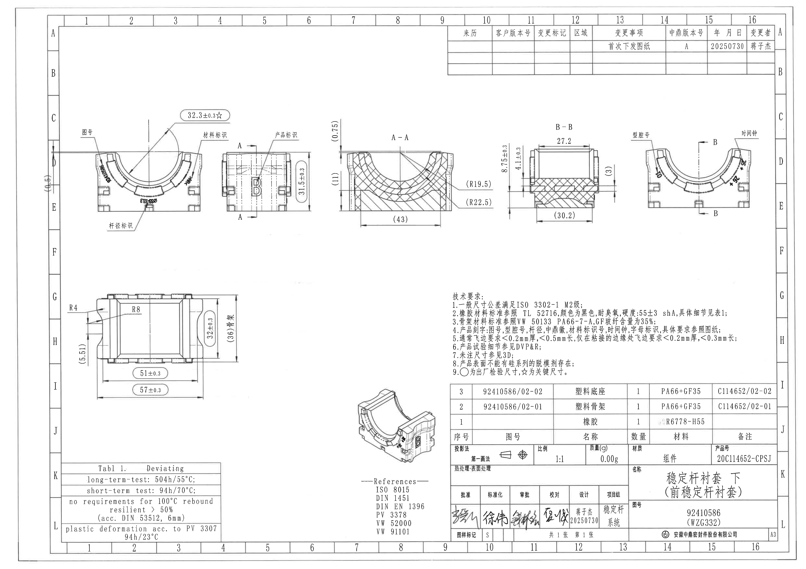

## object_1 修订履历表

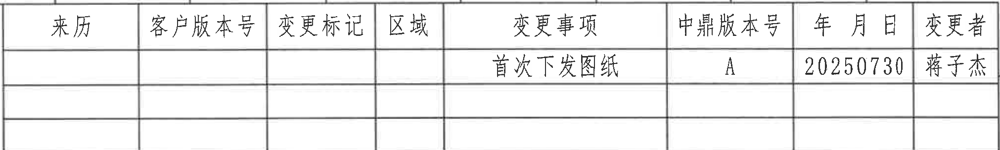

- 原图位置/视图名称：修订履历表；page 1；bbox `[2748, 150, 4770, 455]`。

| 提取项 | 原图数值或文本 | 含义说明 |
|---|---|---|
| 表头 | 来历 / 客户版本号 / 变更标记 / 区域 / 变更事项 / 中鼎版本号 / 年月日 / 变更者 | 修订履历字段。 |
| 记录1 | 首次下发图纸 / A / 20250730 / 蒋子杰 | 首次下发记录；其余来历、客户版本号、变更标记、区域为空。 |
| 空白记录行 | 2行空白 | 原表保留空白修订行。 |

边界归属说明：位于整页图上方右侧。对象只归属修订履历表，裁切包含完整表头、三条记录行和右侧变更者列；右侧图框坐标字母不作为表内容提取。

原表行列还原：

| 来历 | 客户版本号 | 变更标记 | 区域 | 变更事项 | 中鼎版本号 | 年月日 | 变更者 |
|---|---|---|---|---|---|---|---|
|  |  |  |  | 首次下发图纸 | A | 20250730 | 蒋子杰 |
|  |  |  |  |  |  |  |  |
|  |  |  |  |  |  |  |  |

## object_2 上左正视加工视图

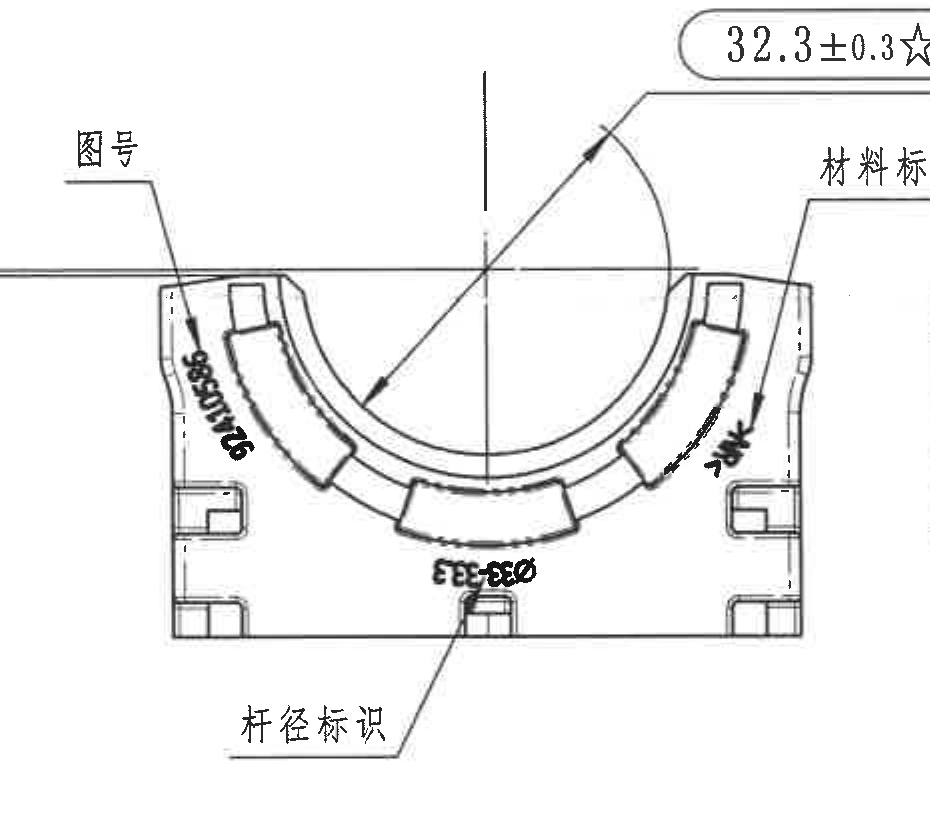

- 原图位置/视图名称：上左正视加工视图；page 1；bbox `[430, 665, 1360, 1490]`。

| 提取项 | 原图数值或文本 | 含义说明 |
|---|---|---|
| 尺寸 | 32.3±0.3☆ | 位于上方，箭头指向内弧/开口相关位置；`☆`表示关键尺寸。 |
| 标识 | 图号 | 左侧引出线指向图号刻字区域。 |
| 标识 | 材料标识 | 右侧引出线指向材料刻字区域。 |
| 标识 | 杆径标识 | 下方引出线指向杆径刻字区域。 |
| 可见刻字 | 20C114652 | 图号标识处可读；其余旋转刻字扫描较糊，仅按标识类别记录。 |

边界归属说明：位于上方左侧。32.3±0.3☆的尺寸线、箭头和文字完整归属本正视图；星号按技术要求第9条表示关键尺寸。图号、材料标识、杆径标识的引出线均指向本视图对应刻字。右侧相邻侧视图未纳入提取。

## object_3 上中侧视加工视图

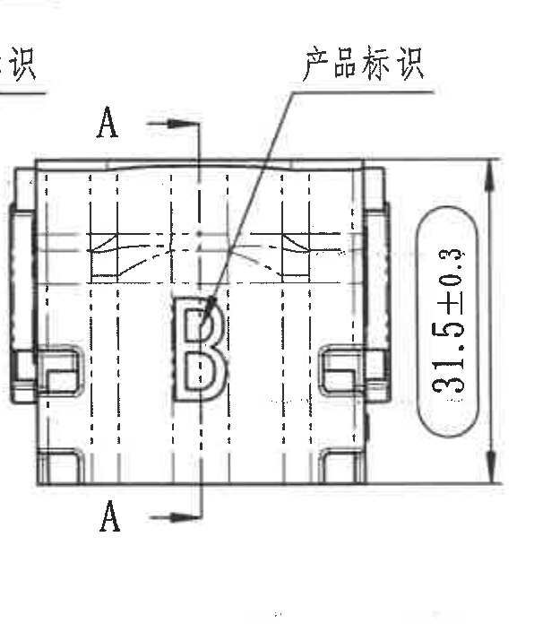

- 原图位置/视图名称：上中侧视加工视图；page 1；bbox `[1355, 760, 1980, 1465]`。

| 提取项 | 原图数值或文本 | 含义说明 |
|---|---|---|
| 尺寸 | 31.5±0.3 | 右侧竖向外形高度尺寸。 |
| 标识 | 产品标识 | 引出线指向侧面B字母产品标识。 |
| 剖切标识 | A-A | 上下A字母和箭头给出A-A剖面位置。 |

边界归属说明：位于上方中左。31.5±0.3为该侧视图右侧竖向外形高度，尺寸线和箭头完整。A-A剖切箭头属于从该视图引出的剖面定位信息。左上边缘可见极小相邻标识残边，不作为本对象内容提取。右侧A-A剖视图的(0.75)、(11)不归入本侧视图。

## object_4 A-A剖面视图

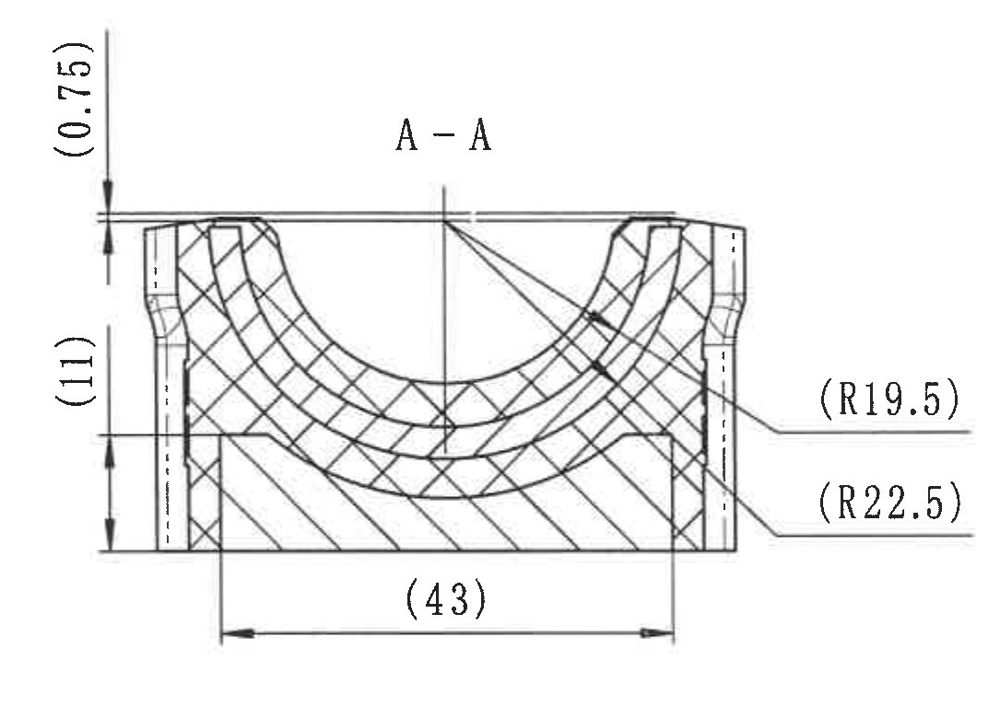

- 原图位置/视图名称：A-A剖面视图；page 1；bbox `[1980, 700, 3065, 1480]`。

| 提取项 | 原图数值或文本 | 含义说明 |
|---|---|---|
| 剖面标识 | A-A | 剖面名称。 |
| 参考尺寸 | (0.75) | 左上竖向局部厚度/距离参考值。 |
| 参考尺寸 | (11) | 左侧竖向参考高度。 |
| 参考尺寸 | (43) | 底部水平总宽参考值。 |
| 参考半径 | (R19.5) | 右侧上方引出至内侧弧面半径参考。 |
| 参考半径 | (R22.5) | 右侧下方引出至外侧弧面半径参考。 |

边界归属说明：位于上方中部。所有括号尺寸为参考尺寸，按图纸括号表达为参考信息；(0.75)位于左上竖向局部厚度，(11)位于左侧竖向参考高度，(43)位于底部总宽参考，(R19.5)/(R22.5)为右侧弧面参考半径。右边B-B视图的8.75±0.3和4.1±0.3未归入本剖面。

## object_5 B-B剖面视图

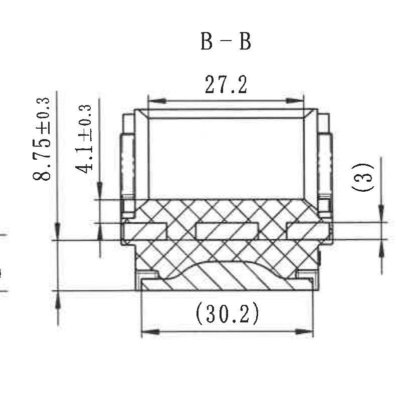

- 原图位置/视图名称：B-B剖面视图；page 1；bbox `[3020, 700, 3810, 1505]`。

| 提取项 | 原图数值或文本 | 含义说明 |
|---|---|---|
| 剖面标识 | B-B | 剖面名称。 |
| 尺寸 | 27.2 | 上方水平开口/宽度尺寸。 |
| 尺寸 | 8.75±0.3 | 左侧外竖向尺寸。 |
| 尺寸 | 4.1±0.3 | 左侧内竖向尺寸。 |
| 参考尺寸 | (3) | 右侧局部参考厚度/高度。 |
| 参考尺寸 | (30.2) | 底部水平参考宽度。 |

边界归属说明：位于上方中右。27.2为上口水平尺寸；8.75±0.3和4.1±0.3为左侧竖向尺寸；(3)为右侧局部参考厚度/高度；(30.2)为底部参考宽度。右侧“型腔号”引出文字属于相邻正视图，不归入本剖面。

## object_6 上右正视加工视图（B-B剖切定位）

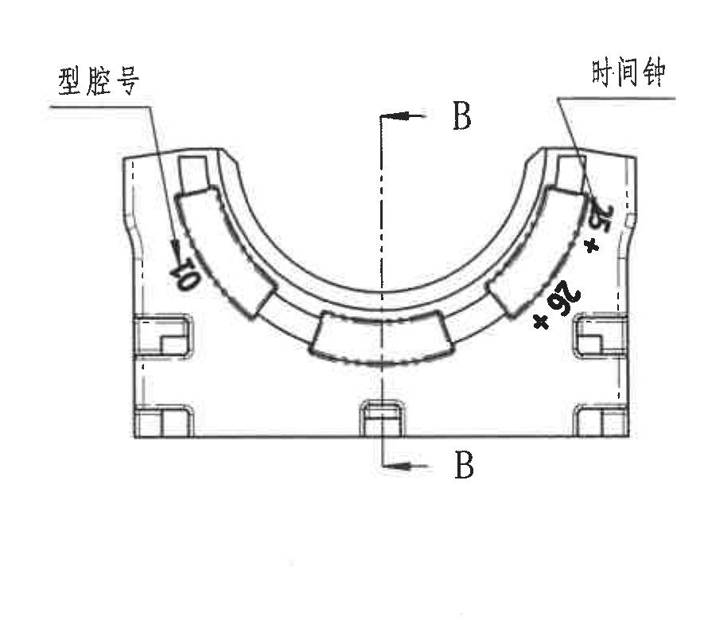

- 原图位置/视图名称：上右正视加工视图（B-B剖切定位）；page 1；bbox `[3820, 730, 4710, 1510]`。

| 提取项 | 原图数值或文本 | 含义说明 |
|---|---|---|
| 标识 | 型腔号 | 左侧引出线指向型腔号刻字。 |
| 刻字 | 10 | 型腔号区域可见刻字。 |
| 标识 | 时间钟 | 右侧引出线指向时间钟刻字区域。 |
| 可见刻字 | 约25与26 | 斜向刻字扫描较糊，按可见标识记录，不作为几何尺寸。 |
| 剖切标识 | B-B | 中部剖切线及上下B箭头给出B-B剖面位置。 |

边界归属说明：位于上方右侧。此对象为带B-B剖切线的正视/局部加工视图，包含完整B-B剖切线、箭头和型腔号/时间钟引出线。没有几何尺寸线归入该视图；相邻B-B剖面尺寸不归入本对象。右侧外图框未作为内容提取。

## object_7 左下底视/俯视加工视图

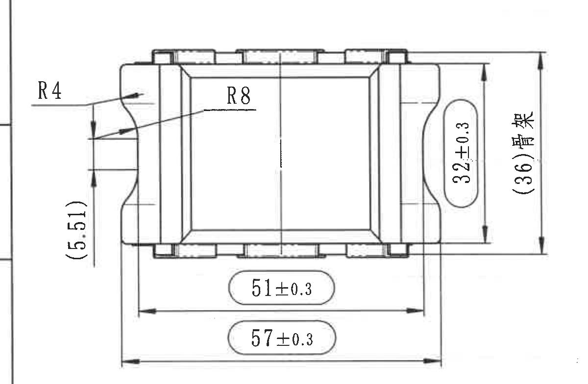

- 原图位置/视图名称：左下底视/俯视加工视图；page 1；bbox `[350, 1710, 1550, 2495]`。

| 提取项 | 原图数值或文本 | 含义说明 |
|---|---|---|
| 半径 | R4 | 左上圆角/侧边弧半径。 |
| 半径 | R8 | 左侧内凹弧半径。 |
| 参考尺寸 | (5.51) | 左侧竖向参考尺寸。 |
| 尺寸 | 32±0.3 | 右侧竖向外形尺寸。 |
| 参考尺寸 | (36)骨架 | 右侧骨架相关总宽/总高参考尺寸。 |
| 尺寸 | 51±0.3 | 底部内侧水平长度尺寸。 |
| 尺寸 | 57±0.3 | 底部外侧水平总长尺寸。 |

边界归属说明：位于左下区域。R4/R8为左侧圆弧半径；(5.51)为左侧参考竖向尺寸；32±0.3为右侧竖向尺寸；(36)骨架为右侧总宽/骨架参考尺寸；51±0.3和57±0.3为底部两条水平长度尺寸。括号内尺寸均为参考尺寸但已逐项提取。左侧图框坐标线未作为本视图内容。

## object_8 3D参考局部视图

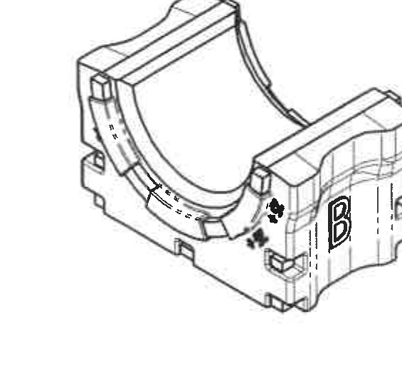

- 原图位置/视图名称：3D参考局部视图；page 1；bbox `[2095, 2410, 2660, 2930]`。

| 提取项 | 原图数值或文本 | 含义说明 |
|---|---|---|
| 视图类型 | 3D参考视图 | 用于结构和未注尺寸参考。 |
| 标识 | B | 侧面B产品标识可见。 |
| 尺寸 | 无独立尺寸数值 | 该裁切对象无尺寸线和尺寸文字。 |

边界归属说明：位于下方中部偏左。该对象为立体参考图，仅用于未注尺寸或结构理解；尺寸要求见技术要求第7条“未注尺寸参见3D”。裁切去除了右侧图框残片，不提取周围图框文字。

## object_9 References参考标准

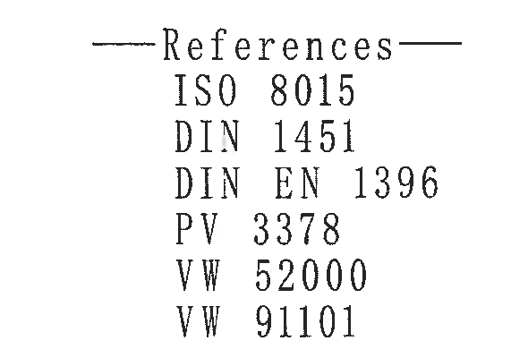

- 原图位置/视图名称：References参考标准；page 1；bbox `[2120, 2915, 2710, 3305]`。

| 提取项 | 原图数值或文本 | 含义说明 |
|---|---|---|
| 标题 | References | 参考标准清单标题。 |
| 标准 | ISO 8015 | 参考标准。 |
| 标准 | DIN 1451 | 参考标准。 |
| 标准 | DIN EN 1396 | 参考标准。 |
| 标准 | PV 3378 | 参考标准。 |
| 标准 | VW 52000 | 参考标准。 |
| 标准 | VW 91101 | 参考标准。 |

边界归属说明：位于3D参考图下方。对象只包含References参考标准清单，未包含表格或标题栏内容。

## object_10 技术要求 NOTES

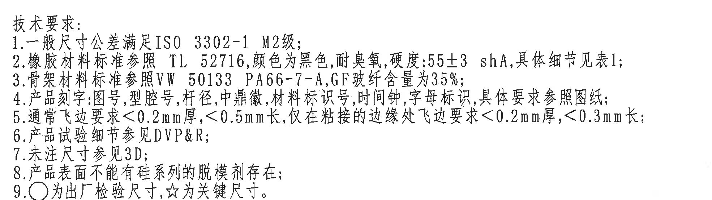

- 原图位置/视图名称：技术要求 NOTES；page 1；bbox `[2750, 1760, 4720, 2315]`。

| 提取项 | 原图数值或文本 | 含义说明 |
|---|---|---|
| 1 | 一般尺寸公差满足ISO 3302-1 M2级 | 通用尺寸公差等级。 |
| 2 | 橡胶材料标准参照TL 52716，颜色为黑色，耐臭氧，硬度:55±3 shA，具体细节见表1 | 橡胶材料、颜色、臭氧和硬度要求。 |
| 3 | 骨架材料标准参照VW 50133 PA66-7-A，GF玻纤含量为35% | 骨架材料及玻纤含量。 |
| 4 | 产品刻字:图号,型腔号,杆径,中鼎徽,材料标识号,时间钟,字母标识,具体要求参照图纸 | 刻字内容和参照要求。 |
| 5 | 通常飞边要求<0.2mm厚,<0.5mm长,仅在粘接的边缘处飞边要求<0.2mm厚,<0.3mm长 | 飞边厚度和长度限制。 |
| 6 | 产品试验细节参见DVP&R | 试验文件引用。 |
| 7 | 未注尺寸参见3D | 未注尺寸以3D数据为准。 |
| 8 | 产品表面不能有硅系列的脱模剂存在 | 表面污染/脱模剂限制。 |
| 9 | ○为出厂检验尺寸，☆为关键尺寸 | 符号含义；`32.3±0.3☆`因此为关键尺寸。 |

边界归属说明：位于右下技术要求区。裁切包含完整9条技术要求；下方材料明细表首行没有归入本notes对象。第9条解释圆圈和星号符号，适用于本图带星号的32.3±0.3☆等标注。

## object_11 Table 1 - Deviating

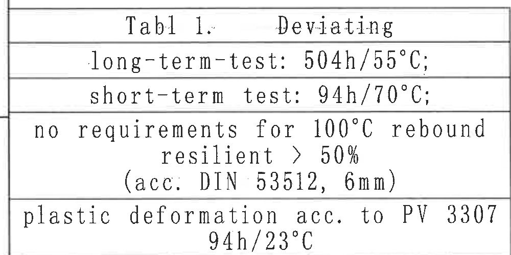

- 原图位置/视图名称：Table 1 - Deviating；page 1；bbox `[360, 2835, 1360, 3335]`。

| 提取项 | 原图数值或文本 | 含义说明 |
|---|---|---|
| 表题 | Table 1. Deviating | 偏离/特殊试验要求表。 |
| 行1 | long-term-test: 504h/55°C; | 长期试验条件。 |
| 行2 | short-term test: 94h/70°C; | 短期试验条件。 |
| 行3 | no requirements for 100°C rebound resilient > 50% (acc. DIN 53512, 6mm) | 100°C回弹性条件说明。 |
| 行4 | plastic deformation acc. to PV 3307 94h/23°C | 塑性变形试验条件。 |

边界归属说明：位于左下角。对象只包含Table 1单列表格及其行文本，左侧K/L和底部图框坐标不作为表格内容。

原表行列还原：

| Table 1. Deviating |
|---|
| long-term-test: 504h/55°C; |
| short-term test: 94h/70°C; |
| no requirements for 100°C rebound resilient > 50% (acc. DIN 53512, 6mm) |
| plastic deformation acc. to PV 3307 94h/23°C |

## object_12 材料明细表/BOM

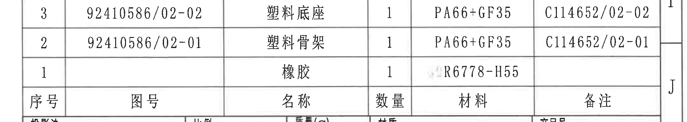

- 原图位置/视图名称：材料明细表/BOM；page 1；bbox `[2700, 2370, 4865, 2756]`。

| 提取项 | 原图数值或文本 | 含义说明 |
|---|---|---|
| 表头 | 序号 / 图号 / 名称 / 数量 / 材料 / 备注 | 材料明细字段。 |
| 行3 | 3 / 92410586/02-02 / 塑料底座 / 1 / PA66+GF35 / C114652/02-02 | 塑料底座物料。 |
| 行2 | 2 / 92410586/02-01 / 塑料骨架 / 1 / PA66+GF35 / C114652/02-01 | 塑料骨架物料。 |
| 行1 | 1 / [空] / 橡胶 / 1 / R6778-H55 / [空] | 橡胶物料。 |

边界归属说明：位于右下标题栏上方。对象仅包含材料明细表三条物料行和表头，不包含下方投影法/比例/产品号标题栏字段。右侧图框字母J不作为表格内容。

原表行列还原：

| 序号 | 图号 | 名称 | 数量 | 材料 | 备注 |
|---|---|---|---|---|---|
| 3 | 92410586/02-02 | 塑料底座 | 1 | PA66+GF35 | C114652/02-02 |
| 2 | 92410586/02-01 | 塑料骨架 | 1 | PA66+GF35 | C114652/02-01 |
| 1 |  | 橡胶 | 1 | R6778-H55 |  |

## object_13 标题栏

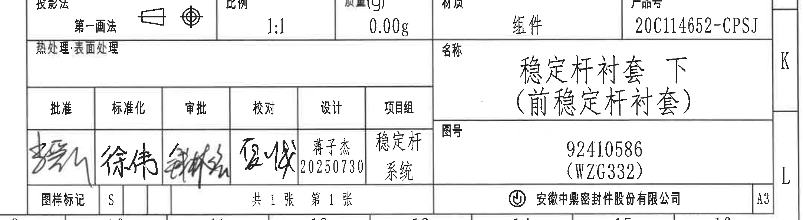

- 原图位置/视图名称：标题栏；page 1；bbox `[2700, 2756, 4865, 3350]`。

| 提取项 | 原图数值或文本 | 含义说明 |
|---|---|---|
| 投影法 | 第一画法 | 投影法字段，含投影视图符号。 |
| 比例 | 1:1 | 绘图比例。 |
| 质量(g) | 0.00g | 质量字段。 |
| 材质 | 组件 | 标题栏材质/总成属性。 |
| 产品号 | 20C114652-CPSJ | 产品编号。 |
| 热处理/表面处理 | [空] | 原栏为空。 |
| 名称 | 稳定杆衬套 下（前稳定杆衬套） | 零件/组件名称。 |
| 图号 | 92410586 (WZG332) | 图纸号。 |
| 批准 | 签名 | 批准签署栏。 |
| 标准化 | 徐伟 | 标准化签署栏。 |
| 审批 | 签名 | 审批签署栏。 |
| 校对 | 夏峻 | 校对签署栏。 |
| 设计 | 蒋子杰 20250730 | 设计人员和日期。 |
| 项目组 | 稳定杆系统 | 项目组字段。 |
| 图样标记 | S | 图样标记字段。 |
| 页数 | 共1张 第1张 | 图纸页数。 |
| 公司 | 安徽中鼎密封件股份有限公司 | 出图单位。 |
| 图幅 | A3 | 图幅规格。 |

边界归属说明：位于右下角标题栏区域。裁切从投影法行开始到公司/图幅底部，包含完整标题栏和签署栏；上方材料明细表不归入标题栏对象。右侧/底部图框坐标线不作为标题栏字段。

## 裁切检查记录

| 对象 | 裁切检查 | 归属/修正记录 |
|---|---|---|
| object_1 修订履历表 | 完整包含表头、记录行和右侧变更者列。 | 仅提取修订表；图框坐标不作为内容。 |
| object_2 上左正视加工视图 | 完整包含`32.3±0.3☆`尺寸线、箭头、图号/材料标识/杆径标识引线和文字。 | 未提取相邻侧视图内容。 |
| object_3 上中侧视加工视图 | 完整包含`31.5±0.3`尺寸线和A-A剖切箭头。 | 初裁混入相邻标识残片，已重裁；边缘极小残字不提取。 |
| object_4 A-A剖面视图 | 完整包含`(0.75)`、`(11)`、`(43)`、`(R19.5)`、`(R22.5)`及剖面标题。 | 右侧B-B尺寸未归入A-A。 |
| object_5 B-B剖面视图 | 完整包含`27.2`、`8.75±0.3`、`4.1±0.3`、`(3)`、`(30.2)`及剖面标题。 | 右侧型腔号标识未归入B-B。 |
| object_6 上右正视加工视图 | 完整包含B-B剖切线、型腔号、时间钟引线和文字。 | 没有几何尺寸线；B-B剖面尺寸不归入本视图。 |
| object_7 左下底视/俯视加工视图 | 完整包含R4、R8、`(5.51)`、`32±0.3`、`(36)骨架`、`51±0.3`、`57±0.3`尺寸线和文字。 | 左侧图框坐标线不作为视图内容。 |
| object_8 3D参考局部视图 | 完整包含立体参考视图主体和B标识。 | 初裁混入右侧图框残片，已重裁；无独立尺寸。 |
| object_9 References参考标准 | 完整包含References标题和6条标准。 | 仅提取参考标准清单。 |
| object_10 技术要求 NOTES | 完整包含技术要求1-9条。 | 下方材料明细表未归入notes。 |
| object_11 Table 1 | 完整包含表格边框、表题和全部文本行。 | 左侧K/L和底部图框坐标未作为表内容。 |
| object_12 材料明细表/BOM | 完整包含三条物料行和表头。 | 初裁带入标题栏投影法行，已重裁到明细表下边框。 |
| object_13 标题栏 | 完整包含投影法、比例、质量、材质、产品号、名称、图号、签署栏、公司和A3。 | 从投影法行开始裁切，不包含上方材料明细表。 |
