# 20C114654 内容识别

## 整页渲染

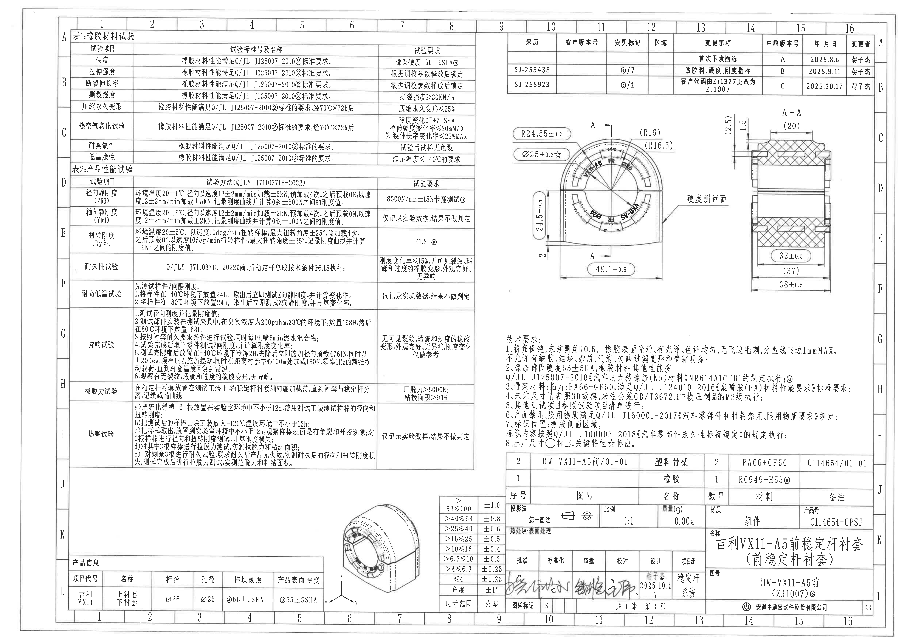

| 提取项 | 原图数值或文本 | 含义说明 |
|---|---|---|
| 文件 | input/20C114654.pdf | 原始 PDF，单页 A3 扫描图。 |
| 整页图 | outputs/20C114654_assets/images/page_1.png | 先将 PDF 渲染为整页 PNG 后，再按对象裁切。 |
| 页面像素 | 6612 x 4673 | 用于 manifest bbox 坐标体系。 |

边界归属说明：整页图包含全部图框、分区坐标、所有视图、表格、NOTES 和标题栏。

## object_1 - 表1:橡胶材料试验

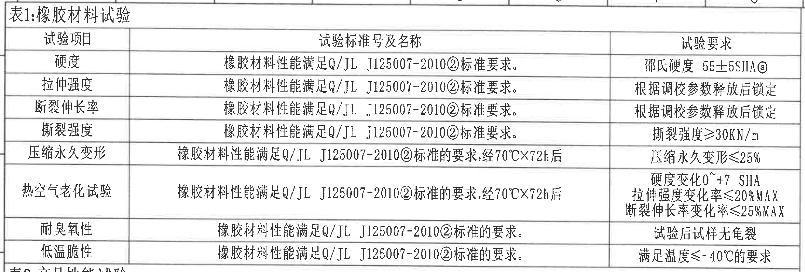

原图位置/视图名称：第 1 页左上，表1:橡胶材料试验。

| 试验项目 | 试验标准号及名称 | 试验要求 |
|---|---|---|
| 硬度 | 橡胶材料性能满足 Q/JL J125007-2010②标准要求。 | 邵氏硬度 55±5SHA@ |
| 拉伸强度 | 橡胶材料性能满足 Q/JL J125007-2010②标准要求。 | 根据调校参数释放后锁定 |
| 断裂伸长率 | 橡胶材料性能满足 Q/JL J125007-2010②标准要求。 | 根据调校参数释放后锁定 |
| 撕裂强度 | 橡胶材料性能满足 Q/JL J125007-2010②标准要求。 | 撕裂强度≥30KN/m |
| 压缩永久变形 | 橡胶材料性能满足 Q/JL J125007-2010②标准的要求,经70℃X72h后 | 压缩永久变形≤25% |
| 热空气老化试验 | 橡胶材料性能满足 Q/JL J125007-2010②标准的要求,经70℃X72h后 | 硬度变化0~+7 SHA；拉伸强度变化率≤20%MAX；断裂伸长率变化率≤25%MAX |
| 耐臭氧性 | 橡胶材料性能满足 Q/JL J125007-2010②标准的要求。 | 试验后试样无龟裂 |
| 低温脆性 | 橡胶材料性能满足 Q/JL J125007-2010②标准的要求。 | 满足温度≤-40℃的要求 |

| 提取项 | 原图数值或文本 | 含义说明 |
|---|---|---|
| 表标题 | 表1:橡胶材料试验 | 橡胶材料性能验证项目。 |
| 邵氏硬度 | 55±5SHA@ | 橡胶邵氏 A 硬度要求，@ 对应图中标记/修订关联。 |
| 撕裂强度 | ≥30KN/m | 橡胶材料撕裂强度下限。 |
| 压缩永久变形 | ≤25% | 70℃X72h 后压缩永久变形上限。 |
| 热空气老化硬度变化 | 0~+7 SHA | 老化后硬度允许变化范围。 |
| 热空气老化拉伸强度变化率 | ≤20%MAX | 老化后拉伸强度变化率最大值。 |
| 热空气老化断裂伸长率变化率 | ≤25%MAX | 老化后断裂伸长率变化率最大值。 |
| 低温脆性 | ≤-40℃ | 低温脆性满足温度要求。 |

边界归属说明：裁切沿表1外框截取，底部仅贴近表2标题线；表2内容不归入本对象。

## object_2 - 表2:产品性能试验

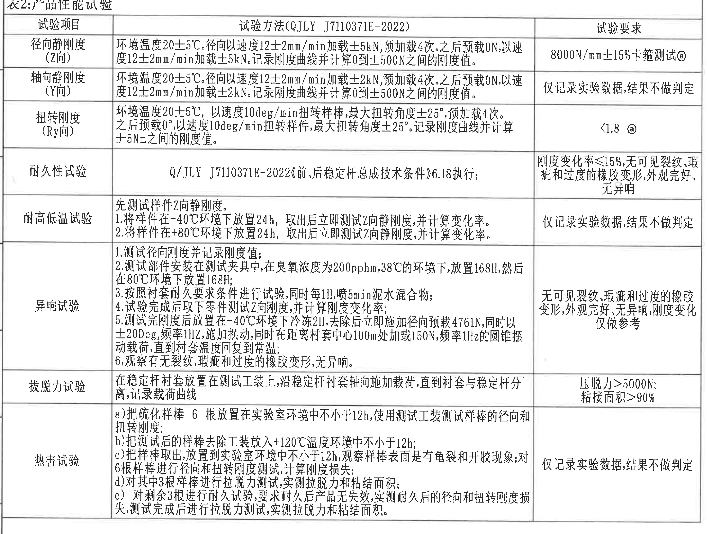

原图位置/视图名称：第 1 页左中，表2:产品性能试验。

| 试验项目 | 试验方法(QJLY J7110371E-2022) | 试验要求 |
|---|---|---|
| 径向静刚度(Z向) | 环境温度20±5℃。径向以速度12±2mm/min加载±5kN,预加载4次。之后预载0N,以速度12±2mm/min加载±5kN。记录刚度曲线并计算0到±500N之间的刚度值。 | 8000N/mm±15%卡箍测试@ |
| 轴向静刚度(Y向) | 环境温度20±5℃。径向以速度12±2mm/min加载±2kN,预加载4次。之后预载0N,以速度12±2mm/min加载±2kN。记录刚度曲线并计算0到±500N之间的刚度值。 | 仅记录实验数据,结果不做判定 |
| 扭转刚度(Ry向) | 环境温度20±5℃,以速度10deg/min扭转样棒,最大扭转角度±25°,预加载4次。之后预载0°,以速度10deg/min扭转样件,最大扭转角度±25°。记录刚度曲线并计算±5Nm之间的刚度值。 | <1.8 @ |
| 耐久性试验 | Q/JLY J7110371E-2022《前、后稳定杆总成技术条件》6.18执行; | 刚度变化率≤15%,无可见裂纹、瑕疵和过度的橡胶变形,外观完好、无异响 |
| 耐高低温试验 | 先测试样件Z向静刚度。1.将样件在-40℃环境下放置24h,取出后立即测试Z向静刚度,并计算变化率。2.将样件在+80℃环境下放置24h,取出后立即测试Z向静刚度,并计算变化率。 | 仅记录实验数据,结果不做判定 |
| 异响试验 | 1.测试径向刚度并记录刚度值; 2.测试部件安装在测试夹具中,在臭氧浓度为200pphm,38℃的环境下,放置168H,然后在80℃环境下放置168H; 3.按照衬套耐久要求条件进行试验,同时每1H,喷5min泥水混合物; 4.试验完成后取下零件测试Z向刚度,并计算刚度变化率; 5.测试完刚度后放置在-40℃环境下冷冻2H,去除后立即施加径向预载4761N,同时以±20Deg,频率1HZ,施加摆动,同时在距离衬套中心100mm处加载150N,频率1Hz的圆锥摆动载荷,直到衬套温度回复到常温; 6.观察有无裂纹,瑕疵和过度的橡胶变形,无异响。 | 无可见裂纹、瑕疵和过度的橡胶变形,外观完好,无异响,刚度变化仅做参考 |
| 拔脱力试验 | 在稳定杆衬套放置在测试工装上,沿稳定杆衬套轴向施加载荷,直到衬套与稳定杆分离,记录载荷曲线 | 压脱力>5000N; 粘接面积>90% |
| 热害试验 | a)把硫化样棒6根放置在实验室环境中不小于12h,使用测试工装测试样棒的径向和扭转刚度; b)把测试后的样棒去除工装放入+120℃温度环境中不小于12h; c)把样棒取出,放置到实验室环境中不小于12h,观察样棒表面是否有龟裂和开胶现象;对6根样棒进行径向和扭转刚度测试,计算刚度损失; d)对其中3根样棒进行拉脱力测试,实测拉脱力和粘结面积; e)对剩余3根进行耐久试验,要求耐久后产品无失效,实测耐久后的径向和扭转刚度损失,测试完成后进行拉脱力测试,实测拉脱力和粘结面积。 | 仅记录实验数据,结果不做判定 |

| 提取项 | 原图数值或文本 | 含义说明 |
|---|---|---|
| 表标题 | 表2:产品性能试验 | 成品衬套的刚度、耐久、温度、异响、拔脱和热害试验要求。 |
| 径向静刚度 | 8000N/mm±15% | Z 向径向静刚度目标值和公差。 |
| 卡箍测试标记 | 卡箍测试@ | 表示径向刚度按卡箍测试条件执行，@ 与图内修订/标识关联。 |
| 轴向加载 | ±2kN | Y 向静刚度试验加载范围。 |
| 径向加载 | ±5kN | Z 向静刚度试验加载范围。 |
| 加载速度 | 12±2mm/min | 径向、轴向静刚度加载速度。 |
| 扭转速度 | 10deg/min | 扭转刚度试验速度。 |
| 最大扭转角度 | ±25° | 扭转刚度试验角度范围。 |
| 扭转刚度要求 | <1.8 @ | Ry 向扭转刚度上限，@ 为图内标识。 |
| 耐久刚度变化率 | ≤15% | 耐久后刚度变化上限。 |
| 温度条件 | -40℃、+80℃、+120℃ | 分别出现在高低温试验和热害试验条件中。 |
| 异响试验载荷 | 径向预载4761N；100mm处加载150N | 异响试验的预载和摆动加载条件。 |
| 异响试验摆角/频率 | ±20Deg；1HZ/1Hz | 异响试验摆动条件。 |
| 拔脱力 | >5000N | 衬套与稳定杆分离载荷下限。 |
| 粘接面积 | >90% | 拔脱后粘接面积要求。 |

边界归属说明：裁切沿表2外框截取。右侧相邻 NOTES 的文字不纳入本对象；表格中仅提取表2三列内文本。

## object_3 - 修订履历表

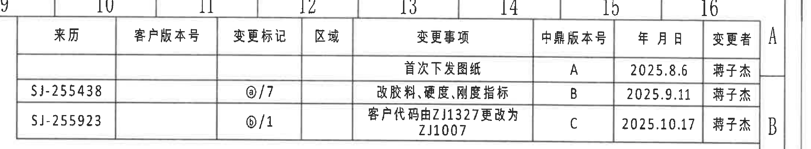

原图位置/视图名称：第 1 页右上，修订履历表。

| 来历 | 客户版本号 | 变更标记 | 区域 | 变更事项 | 中鼎版本号 | 年 月 日 | 变更者 |
|---|---|---|---|---|---|---|---|
|  |  |  |  | 首次下发图纸 | A | 2025.8.6 | 蒋子杰 |
| SJ-255438 |  | @/7 |  | 改胶料、硬度、刚度指标 | B | 2025.9.11 | 蒋子杰 |
| SJ-255923 |  | ⓑ/1 |  | 客户代码由ZJ1327更改为ZJ1007 | C | 2025.10.17 | 蒋子杰 |

| 提取项 | 原图数值或文本 | 含义说明 |
|---|---|---|
| 版本 A | 首次下发图纸；2025.8.6；蒋子杰 | 初始发布。 |
| 版本 B | SJ-255438；@/7；改胶料、硬度、刚度指标；2025.9.11；蒋子杰 | 修改胶料、硬度、刚度相关指标。 |
| 版本 C | SJ-255923；ⓑ/1；客户代码由ZJ1327更改为ZJ1007；2025.10.17；蒋子杰 | 客户代码变更。 |

边界归属说明：裁切包含完整修订履历表及右侧图框分区字母 A/B 的边缘；分区字母不属于修订表字段。

## object_4 - 主加工视图

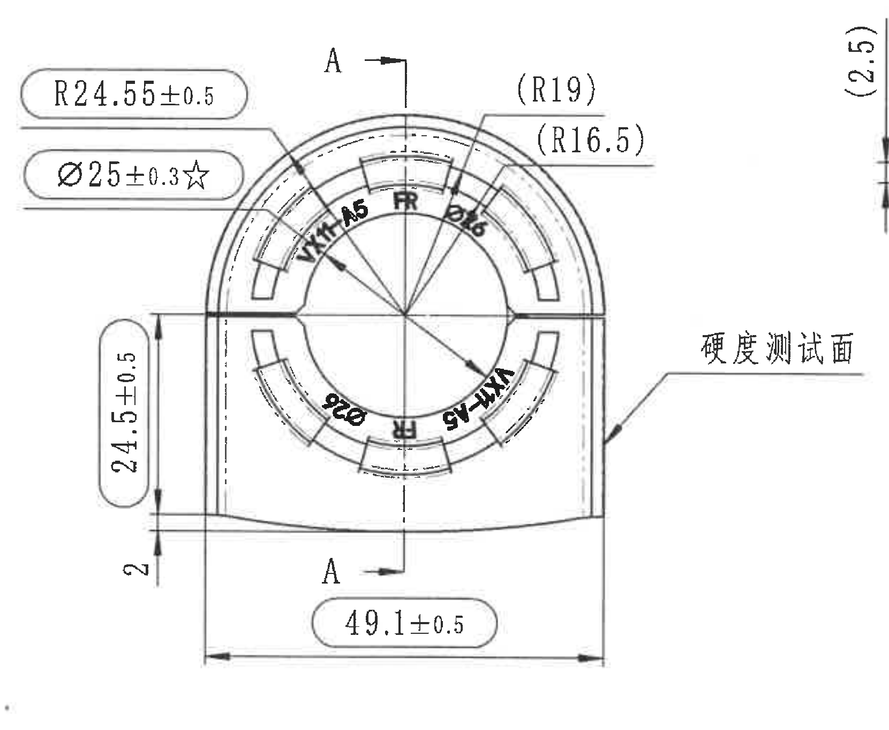

原图位置/视图名称：第 1 页右上中部主视图，带 A-A 剖切位置标注和硬度测试面引出。

| 提取项 | 原图数值或文本 | 含义说明 |
|---|---|---|
| 外圆/上部半径 | R24.55±0.5 | 主视图上部外轮廓圆角/圆弧半径尺寸，带 ±0.5 公差。 |
| 内孔直径关键尺寸 | Ø25±0.3☆ | 孔径尺寸，带直径符号和 ±0.3 公差；星号表示关键特性。 |
| 参考半径 | (R19) | 括号内参考半径，表示由设计/3D 或其他尺寸派生，不作为直接制造控制尺寸。 |
| 参考半径 | (R16.5) | 括号内参考半径，表示内部圆弧/孔周相关参考尺寸。 |
| 竖向高度 | 24.5±0.5 | 主视图左侧竖向尺寸，控制从底部基准到上部结构的高度。 |
| 底部台阶/边距 | 2 | 主视图左下局部竖向尺寸，表示底部小高度/边距。 |
| 总宽 | 49.1±0.5 | 主视图底部横向总宽，带 ±0.5 公差。 |
| 剖切标记 | A、A，箭头 | A-A 剖面位置与观察方向，对应 object_5。 |
| 硬度测试面 | 硬度测试面 | 右侧引出线指向外侧面，说明硬度测试位置。 |
| 标识文字 | VX11 A5、FR、Ø26、HW-A5 | 零件表面标识/字符位置，围绕孔周分布。 |

边界归属说明：主视图右边界为保证“硬度测试面”文字完整，保留了相邻 A-A 剖面左侧局部垂直尺寸线片段；该片段归属 object_5，不在本主视图尺寸中提取。主视图内 A-A 剖切字母仅作为剖面定位标识。

## object_5 - A-A 剖面视图

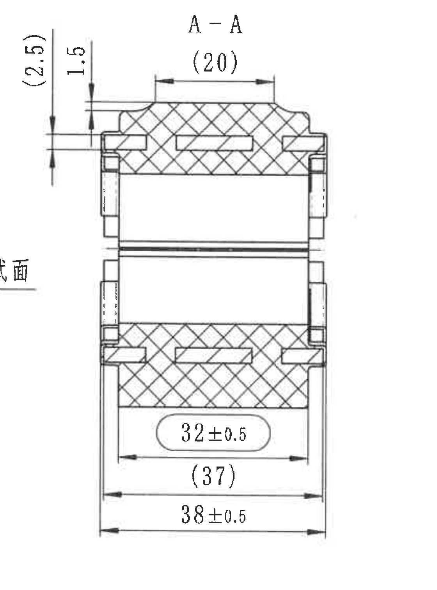

原图位置/视图名称：第 1 页右上，A-A 剖面视图。

| 提取项 | 原图数值或文本 | 含义说明 |
|---|---|---|
| 剖面名称 | A-A | 对应主视图中的 A-A 剖切位置。 |
| 上部参考宽度 | (20) | 括号内参考尺寸，表示顶部剖面局部宽度的参考值。 |
| 左侧参考高度 | (2.5) | 括号内参考尺寸，表示剖面左侧上部竖向参考高度。 |
| 左侧高度 | 1.5 | 剖面左侧上部竖向实际标注尺寸。 |
| 内部宽度 | 32±0.5 | 剖面下部内部宽度，带 ±0.5 公差。 |
| 参考宽度 | (37) | 括号内参考尺寸，表示外部/相关宽度参考值。 |
| 总宽 | 38±0.5 | 剖面最外侧横向总宽，带 ±0.5 公差。 |
| 剖面填充 | 交叉剖面线 | 表示被剖切的实体材料区域。 |

边界归属说明：裁切扩大左侧以完整包含 `(2.5)` 和 `1.5` 的尺寸线及箭头，因此左下角带入主视图“硬度测试面”的末尾文字片段；该片段归属 object_4，不作为 A-A 剖面文本提取。

## object_6 - 技术要求/NOTES

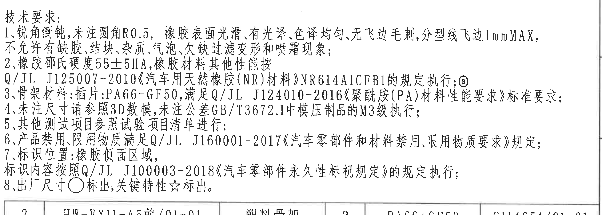

原图位置/视图名称：第 1 页右中，技术要求/NOTES 区域。

| 序号 | 原图文本 |
|---|---|
| 1 | 锐角倒钝,未注圆角R0.5,橡胶表面光滑、有光泽、色泽均匀、无飞边毛刺,分型线飞边1mmMAX,不允许有缺胶、结块、杂质、气泡、欠缺过滤变形和喷霜现象; |
| 2 | 橡胶邵氏硬度55±5HA,橡胶材料其他性能按 Q/JL J125007-2010《汽车用天然橡胶(NR)材料》NR614A1CFB1的规定执行;@ |
| 3 | 骨架材料:插件:PA66-GF50,满足 Q/JL J124010-2016《聚酰胺(PA)材料性能要求》标准要求; |
| 4 | 未注尺寸请参照3D数模,未注公差GB/T3672.1中模压制品的M3级执行; |
| 5 | 其他测试项目参照试验项目清单进行; |
| 6 | 产品禁用、限用物质满足 Q/JL J160001-2017《汽车零部件和材料禁用、限用物质要求》规定; |
| 7 | 标识位置:橡胶侧面区域,标识内容按照 Q/JL J100003-2018《汽车零部件永久性标视规定》的规定执行; |
| 8 | 出厂尺寸○标出,关键特性☆标出。 |

| 提取项 | 原图数值或文本 | 含义说明 |
|---|---|---|
| 未注圆角 | R0.5 | 未单独标注处默认圆角半径。 |
| 分型线飞边 | 1mmMAX | 分型线飞边最大允许值。 |
| 橡胶硬度 | 55±5HA | NOTES 中橡胶邵氏硬度要求。 |
| 橡胶标准 | Q/JL J125007-2010；NR614A1CFB1 | 橡胶材料执行标准和材料牌号/等级。 |
| 骨架材料 | PA66-GF50 | 塑料骨架材料。 |
| 骨架材料标准 | Q/JL J124010-2016 | 聚酰胺材料性能标准。 |
| 未注公差 | GB/T3672.1 中模压制品的 M3 级 | 未注公差执行等级。 |
| 禁限用物质标准 | Q/JL J160001-2017 | 禁用、限用物质要求。 |
| 标识标准 | Q/JL J100003-2018 | 永久性标识规定。 |
| 出厂尺寸符号 | ○ | 被圆圈符号标出的尺寸为出厂尺寸。 |
| 关键特性符号 | ☆ | 星号标出的尺寸或性能为关键特性。 |

边界归属说明：裁切包含完整技术要求文字区，下边界贴近 BOM 表上边框；BOM 表格行不归入 NOTES。

## object_7 - 产品信息表

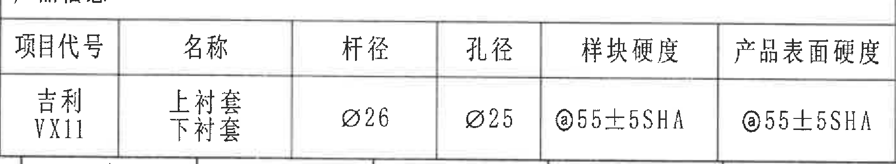

原图位置/视图名称：第 1 页左下，产品信息表。

| 项目代号 | 名称 | 杆径 | 孔径 | 样块硬度 | 产品表面硬度 |
|---|---|---|---|---|---|
| 吉利 VX11 | 上衬套 / 下衬套 | Ø26 | Ø25 | @55±5SHA | @55±5SHA |

| 提取项 | 原图数值或文本 | 含义说明 |
|---|---|---|
| 项目代号 | 吉利 VX11 | 对应车型/项目。 |
| 名称 | 上衬套、下衬套 | 产品由上下衬套组成。 |
| 杆径 | Ø26 | 稳定杆或装配杆直径。 |
| 孔径 | Ø25 | 衬套孔径。 |
| 样块硬度 | @55±5SHA | 样块邵氏硬度，@ 为图内标识。 |
| 产品表面硬度 | @55±5SHA | 产品表面邵氏硬度，@ 为图内标识。 |

边界归属说明：裁切沿产品信息表外框截取，右侧可见少量相邻坐标轴边缘不属于本表字段。

## object_8 - 等轴视图/局部立体视图

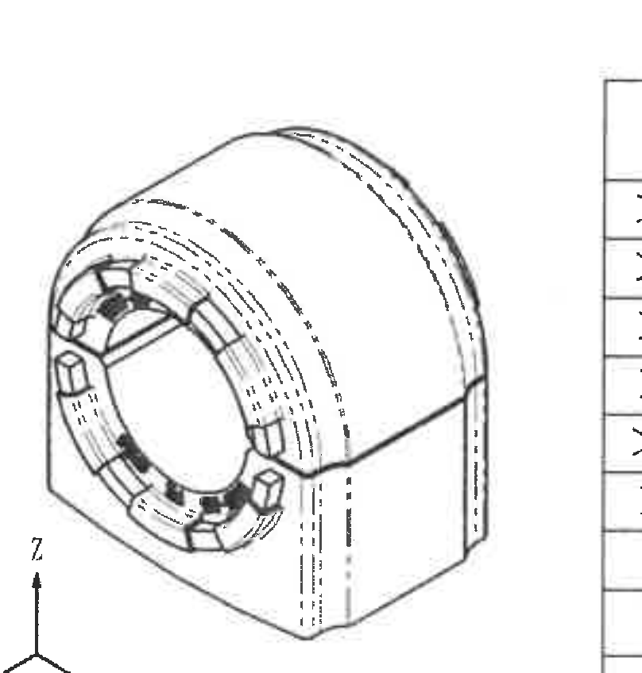

原图位置/视图名称：第 1 页下中，等轴视图/局部立体视图。

| 提取项 | 原图数值或文本 | 含义说明 |
|---|---|---|
| 立体视图 | 零件等轴外形 | 展示衬套的三维外观、孔周结构、侧面和顶部轮廓。 |
| 坐标轴 | X、Y、Z | 表示图中三维方向。 |
| 可见标识 | 孔周标识和局部凸台 | 对应主视图孔周标识和结构位置。 |
| 尺寸 | 无独立尺寸数值 | 本对象未给出独立尺寸线；尺寸归属主视图或 A-A 剖面。 |

边界归属说明：裁切包含完整立体图和坐标轴；右侧相邻公差表局部边线可见，但公差表字段归属 object_9。

## object_9 - 未注尺寸公差表

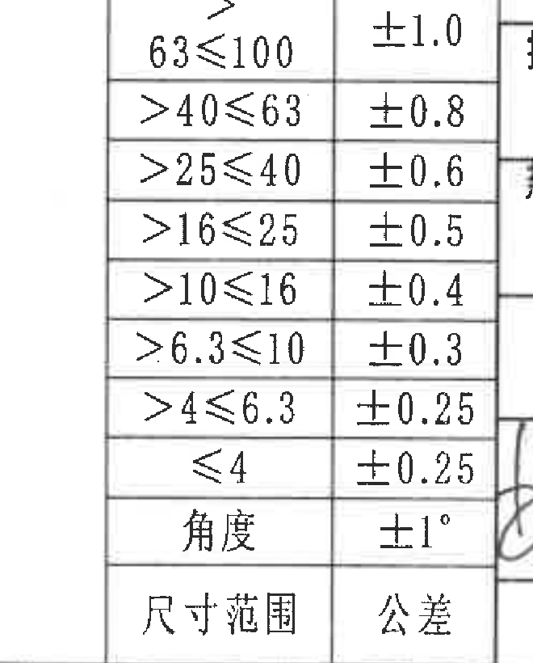

原图位置/视图名称：第 1 页下中偏右，未注尺寸公差表。

| 尺寸范围 | 公差 |
|---|---|
| >63≤100 | ±1.0 |
| >40≤63 | ±0.8 |
| >25≤40 | ±0.6 |
| >16≤25 | ±0.5 |
| >10≤16 | ±0.4 |
| >6.3≤10 | ±0.3 |
| >4≤6.3 | ±0.25 |
| ≤4 | ±0.25 |
| 角度 | ±1° |

| 提取项 | 原图数值或文本 | 含义说明 |
|---|---|---|
| 表头 | 尺寸范围 / 公差 | 未注尺寸按尺寸段取公差。 |
| 最大尺寸段 | >63≤100：±1.0 | 尺寸大于 63 且小于等于 100 时公差为 ±1.0。 |
| 最小尺寸段 | ≤4：±0.25 | 尺寸小于等于 4 时公差为 ±0.25。 |
| 角度公差 | ±1° | 未注角度公差。 |

边界归属说明：裁切覆盖完整尺寸范围和公差两列；右侧标题栏边线不属于本公差表。

## object_10 - 明细表/BOM

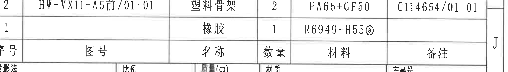

原图位置/视图名称：第 1 页右下上部，明细表/BOM。

| 序号 | 图号 | 名称 | 数量 | 材料 | 备注 |
|---|---|---|---|---|---|
| 2 | HW-VX11-A5前/01-01 | 塑料骨架 | 2 | PA66+GF50 | C114654/01-01 |
| 1 |  | 橡胶 | 1 | R6949-H55@ |  |

| 提取项 | 原图数值或文本 | 含义说明 |
|---|---|---|
| 塑料骨架 | 数量2；材料PA66+GF50；备注C114654/01-01 | 零件中的塑料骨架件。 |
| 橡胶 | 数量1；材料R6949-H55@ | 橡胶材料条目，@ 为图内标识。 |
| 图号 | HW-VX11-A5前/01-01 | 塑料骨架图号。 |

边界归属说明：裁切为标题栏上方的明细表区域，下边界与标题栏共用边框；标题栏投影法、比例等字段不归入 BOM 行。

## object_11 - 标题栏

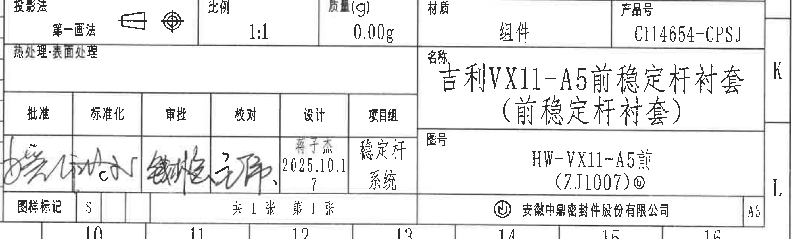

原图位置/视图名称：第 1 页右下，标题栏。

| 字段 | 原图数值或文本 |
|---|---|
| 投影法 | 第一画法 |
| 比例 | 1:1 |
| 质量(g) | 0.00g |
| 材质 | 组件 |
| 产品号 | C114654-CPSJ |
| 名称 | 吉利VX11-A5前稳定杆衬套（前稳定杆衬套） |
| 图号 | HW-VX11-A5前 (ZJ1007)ⓑ |
| 热处理/表面处理 | 热处理:表面处理 |
| 批准 | 签名/手写 |
| 标准化 | 签名/手写 |
| 审批 | 签名/手写 |
| 校对 | 签名/手写 |
| 设计 | 蒋子杰 2025.10.17 |
| 项目组 | 稳定杆系统 |
| 图样标记 | S |
| 页数 | 共1张 第1张 |
| 公司 | 安徽中鼎密封件股份有限公司 |
| 图幅 | A3 |

| 提取项 | 原图数值或文本 | 含义说明 |
|---|---|---|
| 产品名称 | 吉利VX11-A5前稳定杆衬套（前稳定杆衬套） | 图纸对应产品名称。 |
| 产品号 | C114654-CPSJ | 产品编号。 |
| 图号 | HW-VX11-A5前 (ZJ1007)ⓑ | 图纸编号/客户代码，带 ⓑ 标记。 |
| 材质 | 组件 | 标题栏材质字段。 |
| 质量 | 0.00g | 标题栏标注质量。 |
| 比例 | 1:1 | 绘图比例。 |
| 投影法 | 第一画法 | 采用第一角投影。 |
| 设计日期 | 2025.10.17 | 设计签署日期。 |
| 图幅 | A3 | 图纸幅面。 |

边界归属说明：裁切包含完整标题栏；上方 BOM 与标题栏共用边框，BOM 的序号/图号/材料行不归入本标题栏。

## 裁切检查记录

| 对象 | 图片路径 | 检查结果 |
|---|---|---|
| page_1 | outputs/20C114654_assets/images/page_1.png | 整页 PNG 完整包含图框和全部内容。 |
| object_1 | outputs/20C114654_assets/images/object_1.png | 表1外框、表头和各行文字完整；底部贴近表2标题线，未提取表2内容。 |
| object_2 | outputs/20C114654_assets/images/object_2.png | 表2外框、三列表头和各行文字完整；右侧相邻 NOTES 未纳入表格提取。 |
| object_3 | outputs/20C114654_assets/images/object_3.png | 修订履历表完整，`SJ-255438`、`SJ-255923` 未裁边；右侧图框分区字母为相邻图框信息。 |
| object_4 | outputs/20C114654_assets/images/object_4.png | 主视图尺寸线、箭头、标注文字完整；为包含“硬度测试面”带入 A-A 剖面左侧少量尺寸线片段，已在归属说明中排除。 |
| object_5 | outputs/20C114654_assets/images/object_5.png | A-A 剖面全部尺寸线、剖面线和文字完整；左下角带入主视图文字片段，已在归属说明中排除。 |
| object_6 | outputs/20C114654_assets/images/object_6.png | 技术要求 1-8 条完整，底部仅贴近 BOM 上边框。 |
| object_7 | outputs/20C114654_assets/images/object_7.png | 产品信息表表头和一行内容完整；右侧仅有少量相邻坐标轴边缘，不归入表格。 |
| object_8 | outputs/20C114654_assets/images/object_8.png | 等轴视图和 X/Y/Z 坐标轴完整；右侧相邻公差表边缘不归入本视图。 |
| object_9 | outputs/20C114654_assets/images/object_9.png | 公差表尺寸范围、公差列和角度行完整；右侧相邻标题栏边线不归入本表。 |
| object_10 | outputs/20C114654_assets/images/object_10.png | BOM 表两行和表头完整；下边界与标题栏共用边框。 |
| object_11 | outputs/20C114654_assets/images/object_11.png | 标题栏字段完整；上方 BOM 行不归入标题栏。 |
