# 20C114655 图纸内容识别与裁切提取
源文件: `input/20C114655.pdf`  
整页渲染图: `outputs/20C114655_assets/images/page_1.png`  
页面尺寸: 4959 x 3505 px。
说明: 本文按原图区域逐对象还原，不把相邻视图/表格内容合并整理。括号内尺寸按参考尺寸提取；带 `☆` 的尺寸按关键特性说明；`@` 按原图标识保留。
## object_1 表1:橡胶材料试验
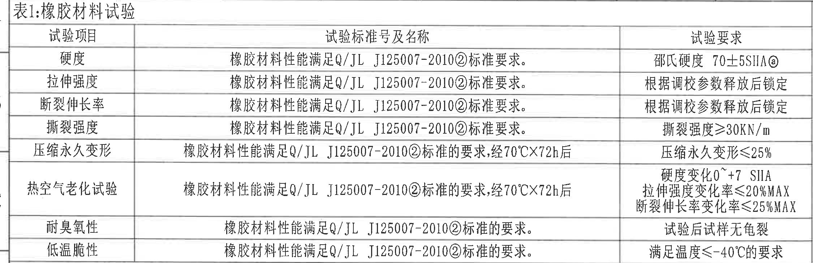
原图位置/视图名称: page 1，bbox `[350, 140, 2600, 870]`，左上表格。
| 试验项目 | 试验标准号及名称 | 试验要求 |
|---|---|---|
| 硬度 | 橡胶材料性能满足Q/JL J125007-2010②标准要求。 | 邵氏硬度 70±5SHA@ |
| 拉伸强度 | 橡胶材料性能满足Q/JL J125007-2010②标准要求。 | 根据调校参数释放后锁定 |
| 断裂伸长率 | 橡胶材料性能满足Q/JL J125007-2010②标准要求。 | 根据调校参数释放后锁定 |
| 撕裂强度 | 橡胶材料性能满足Q/JL J125007-2010②标准要求。 | 撕裂强度≥30KN/m |
| 压缩永久变形 | 橡胶材料性能满足Q/JL J125007-2010②标准的要求,经70℃×72h后 | 压缩永久变形≤25% |
| 热空气老化试验 | 橡胶材料性能满足Q/JL J125007-2010②标准的要求,经70℃×72h后 | 硬度变化0~+7 SHA；拉伸强度变化率≤20%MAX；断裂伸长率变化率≤25%MAX |
| 耐臭氧性 | 橡胶材料性能满足Q/JL J125007-2010②标准的要求。 | 试验后试样无龟裂 |
| 低温脆性 | 橡胶材料性能满足Q/JL J125007-2010②标准的要求。 | 满足温度≤-40℃的要求 |

| 提取项 | 原图数值或文本 | 含义说明 |
|---|---|---|
| 硬度要求 | 70±5SHA@ | 橡胶材料邵氏硬度范围，@为图纸标识。 |
| 撕裂强度 | ≥30KN/m | 材料撕裂性能下限。 |
| 老化条件 | 70℃×72h | 压缩永久变形和热空气老化试验条件。 |
| 压缩永久变形 | ≤25% | 老化后压缩永久变形限值。 |
| 热老化硬度变化 | 0~+7 SHA | 热空气老化后硬度变化范围。 |
| 热老化拉伸变化率 | ≤20%MAX | 热空气老化后拉伸强度变化率上限。 |
| 热老化断裂伸长率变化 | ≤25%MAX | 热空气老化后断裂伸长率变化率上限。 |
| 低温脆性 | ≤-40℃ | 低温脆性满足温度要求。 |

边界归属说明: 裁切下边界停在表1底线，未把下方“表2:产品性能试验”归入本对象；右侧没有主视图内容。

## object_2 表2:产品性能试验
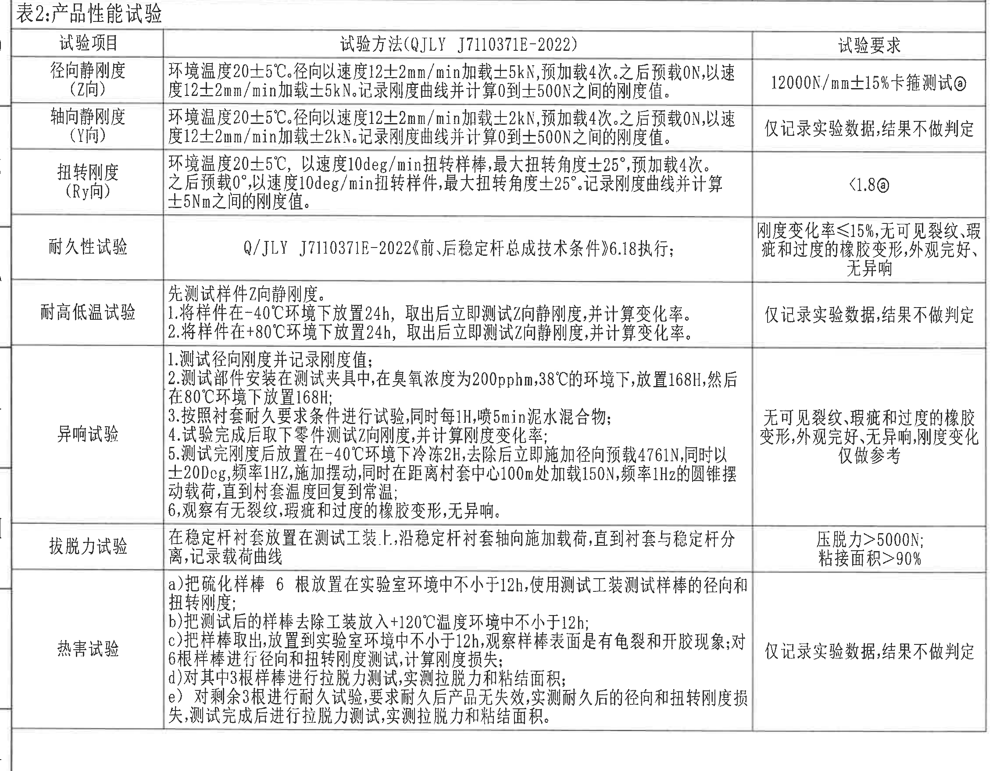
原图位置/视图名称: page 1，bbox `[350, 870, 2630, 2630]`，左侧中部产品性能试验表。
| 试验项目 | 试验方法(QJLY J7110371E-2022) | 试验要求 |
|---|---|---|
| 径向静刚度 (Z向) | 环境温度20±5℃。径向以速度12±2mm/min加载±5kN,预加载4次。之后预载0N,以速度12±2mm/min加载±5kN。记录刚度曲线并计算0到±500N之间的刚度值。 | 12000N/mm±15%卡箍测试@ |
| 轴向静刚度 (Y向) | 环境温度20±5℃。径向以速度12±2mm/min加载±2kN,预加载4次。之后预载0N,以速度12±2mm/min加载±2kN。记录刚度曲线并计算0到±500N之间的刚度值。 | 仅记录实验数据,结果不做判定 |
| 扭转刚度 (Ry向) | 环境温度20±5℃,以速度10deg/min扭转样棒,最大扭转角度±25°,预加载4次。之后预载0°,以速度10deg/min扭转样件,最大扭转角度±25°。记录刚度曲线并计算±5Nm之间的刚度值。 | <1.8@ |
| 耐久性试验 | Q/JLY J7110371E-2022《前、后稳定杆总成技术条件》6.18执行; | 刚度变化率≤15%,无可见裂纹、瑕疵和过度的橡胶变形,外观完好、无异响 |
| 耐高低温试验 | 先测试样件Z向静刚度。 1.将样件在-40℃环境下放置24h,取出后立即测试Z向静刚度,并计算变化率。 2.将样件在+80℃环境下放置24h,取出后立即测试Z向静刚度,并计算变化率。 | 仅记录实验数据,结果不做判定 |
| 异响试验 | 1.测试径向刚度并记录刚度值; 2.测试部件安装在测试夹具中,在臭氧浓度为200pphm,38℃的环境下,放置168H,然后在80℃环境下放置168H; 3.按照衬套耐久要求条件进行试验,同时每1H喷5min泥水混合物; 4.试验完成后取下零件测试Z向刚度,并计算刚度变化率; 5.测试完刚度后放置在-40℃环境下冷冻2H,去除后立即施加径向预载4761N,同时以±20Dcg,频率1HZ,施加摆动,同时在距离衬套中心100mm处加载150N,频率1HZ的圆锥摆动载荷,直到衬套温度回复到常温; 6.观察有无裂纹、瑕疵和过度的橡胶变形,无异响。 | 无可见裂纹、瑕疵和过度的橡胶变形,外观完好、无异响,刚度变化仅做参考 |
| 拔脱力试验 | 在稳定杆衬套放置在测试工装上,沿稳定杆衬套轴向施加载荷,直到衬套与稳定杆分离,记录载荷曲线 | 压脱力>5000N; 粘接面积>90% |
| 热害试验 | a)把硫化样棒6根放置在实验室环境中不小于12h,使用测试工装测试样棒的径向和扭转刚度; b)把测试后的样棒去除工装放入+120℃温度环境中不小于12h; c)把样棒取出,放置到实验室环境中不小于12h,观察样棒表面是否有龟裂和开胶现象,对6根样棒进行径向和扭转刚度测试,计算刚度损失; d)对其中3根样棒进行拉脱力测试,实测拉脱力和粘结面积; e)对剩余3根进行耐久试验,要求耐久后产品无失效,实测耐久后的径向和扭转刚度损失,测试完成后进行拉脱力测试,实测拉脱力和粘结面积。 | 仅记录实验数据,结果不做判定 |

| 提取项 | 原图数值或文本 | 含义说明 |
|---|---|---|
| 径向静刚度方向 | Z向 | 径向刚度测试方向。 |
| 轴向静刚度方向 | Y向 | 轴向刚度测试方向。 |
| 扭转刚度方向 | Ry向 | 绕Y方向的扭转刚度。 |
| 环境温度 | 20±5℃ | 刚度类试验环境条件。 |
| 加载速度 | 12±2mm/min | 径向/轴向静刚度加载速度。 |
| 径向载荷 | ±5kN | 径向静刚度加载载荷。 |
| 轴向载荷 | ±2kN | 轴向静刚度加载载荷。 |
| 刚度计算区间 | 0到±500N | 径向/轴向静刚度计算区间。 |
| 径向刚度要求 | 12000N/mm±15% | 卡箍测试刚度目标及允差。 |
| 扭转速度 | 10deg/min | 扭转刚度试验速度。 |
| 扭转角度 | ±25° | 最大扭转角度。 |
| 扭转计算区间 | ±5Nm | 扭矩区间内计算刚度。 |
| 扭转要求 | <1.8@ | 扭转刚度判定要求。 |
| 耐久刚度变化率 | ≤15% | 耐久后刚度变化率限制。 |
| 低温放置 | -40℃ 24h | 耐高低温试验低温条件。 |
| 高温放置 | +80℃ 24h | 耐高低温试验高温条件。 |
| 臭氧条件 | 200pphm,38℃,168H | 异响试验臭氧老化条件。 |
| 泥水喷淋 | 每1H喷5min | 异响试验喷淋周期。 |
| 冷冻条件 | -40℃ 2H | 异响试验低温冷冻条件。 |
| 径向预载 | 4761N | 异响试验预载。 |
| 摆动条件 | ±20Dcg, 1HZ | 异响试验摆动角/频率，按原图Dcg识读。 |
| 加载位置与载荷 | 100mm处加载150N,频率1HZ | 圆锥摆动载荷条件。 |
| 压脱力 | >5000N | 拔脱力试验下限。 |
| 粘接面积 | >90% | 拔脱力试验粘接面积下限。 |
| 热害温度 | +120℃ | 热害试验加热温度。 |
| 热害样棒 | 6根; 3根/3根 | 先测6根，后续分3根拉脱力和3根耐久。 |

边界归属说明: 裁切包含表2标题、表头和热害试验行，底边在热害试验外框线处；下方产品信息、轴测图、一般公差表不属于本表。

## object_3 修订履历表
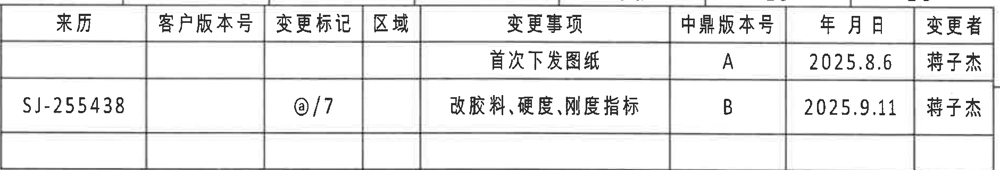
原图位置/视图名称: page 1，bbox `[2920, 135, 4800, 455]`，右上修订履历表。
| 来历 | 客户版本号 | 变更标记 | 区域 | 变更事项 | 中鼎版本号 | 年月日 | 变更者 |
|---|---|---|---|---|---|---|---|
|  |  |  |  | 首次下发图纸 | A | 2025.8.6 | 蒋子杰 |
| SJ-255438 |  | @/7 |  | 改胶料、硬度、刚度指标 | B | 2025.9.11 | 蒋子杰 |

| 提取项 | 原图数值或文本 | 含义说明 |
|---|---|---|
| 中鼎版本号 | A, B | 版本从首次下发A到变更B。 |
| 变更日期 | 2025.8.6; 2025.9.11 | 两次记录的年月日。 |
| 变更标记 | @/7 | 第二行变更标记。 |
| 变更事项 | 改胶料、硬度、刚度指标 | B版变更内容。 |
边界归属说明: 底边收在表格外框线内，未包含下方A-A剖面标题。

## object_4 主视图/端面加工视图
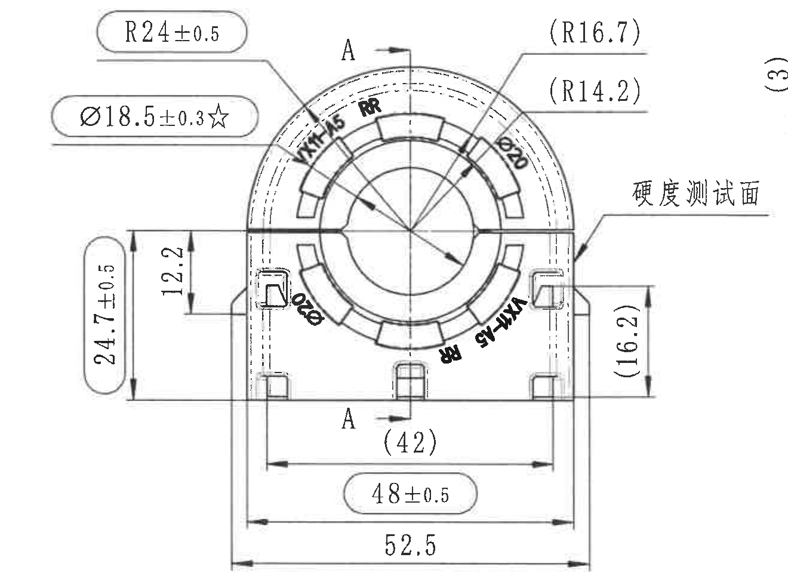
原图位置/视图名称: page 1，bbox `[2700, 580, 4020, 1560]`，右中主视图。
| 提取项 | 原图数值或文本 | 含义说明 |
|---|---|---|
| 圆弧半径 | R24±0.5 | 外轮廓顶部圆弧半径，带±0.5公差。 |
| 孔径关键尺寸 | Ø18.5±0.3☆ | 孔径尺寸，星号表示关键特性。 |
| 左侧竖向尺寸 | 24.7±0.5 | 主视图左侧总/局部高度尺寸，带公差。 |
| 内侧竖向尺寸 | 12.2 | 左侧内台阶/槽高度尺寸。 |
| 参考圆弧 | (R16.7) | 括号内参考半径，位于右上圆弧引出线。 |
| 参考圆弧 | (R14.2) | 括号内参考半径，位于右上内圆弧引出线。 |
| 直径标注 | Ø20 | 主视图内孔/杆径相关直径标注。 |
| 右侧参考高度 | (16.2) | 括号内参考竖向尺寸。 |
| 底部参考宽度 | (42) | 括号内参考尺寸，位于底部内宽。 |
| 底部宽度 | 48±0.5 | 底部宽度带±0.5公差。 |
| 底部总宽 | 52.5 | 主视图底部总宽尺寸。 |
| 剖切标识 | A / A | 上下A标识对应A-A剖面。 |
| 测试面标注 | 硬度测试面 | 右侧引出箭头指示硬度测试面位置。 |
| 图内标识 | VK1.45, RR | 图中橡胶/标识区域文字。 |
边界归属说明: 右侧靠近A-A剖面，裁切内可见剖面尺寸`(3)`的边缘片段；该片段只作为邻近干扰，不提取到主视图。主视图自己的尺寸线、箭头、文字均完整包含。

## object_5 A-A剖面视图
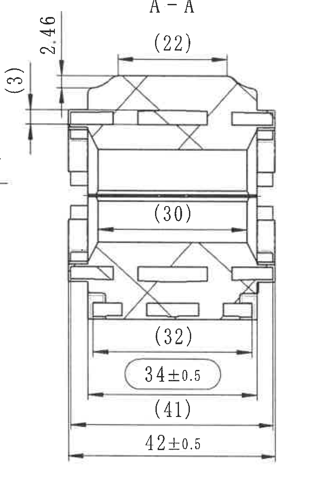
原图位置/视图名称: page 1，bbox `[3970, 520, 4730, 1640]`，右侧A-A剖面。
| 提取项 | 原图数值或文本 | 含义说明 |
|---|---|---|
| 剖面名称 | A-A | 由主视图A剖切线生成的剖面。 |
| 左侧参考竖向尺寸 | (3) | 括号内参考尺寸，位于剖面左侧。 |
| 左上竖向尺寸 | 2.46 | 剖面上部台阶/壁厚相关竖向尺寸。 |
| 顶部参考宽度 | (22) | 括号内参考尺寸，位于剖面顶部。 |
| 中部参考宽度 | (30) | 括号内参考尺寸，位于剖面中部孔/腔宽。 |
| 下部参考宽度 | (32) | 括号内参考尺寸，位于下部结构。 |
| 下部宽度 | 34±0.5 | 带±0.5公差的下部宽度。 |
| 底部参考宽度 | (41) | 括号内参考总宽/外侧宽度。 |
| 底部总宽 | 42±0.5 | 剖面最底部总宽，带±0.5公差。 |
边界归属说明: 左边界为保留`(3)`和`2.46`完整尺寸线而略向左扩，边缘有主视图引出线局部；主视图“硬度测试面”文字不归入A-A剖面。

## object_6 技术要求/NOTES
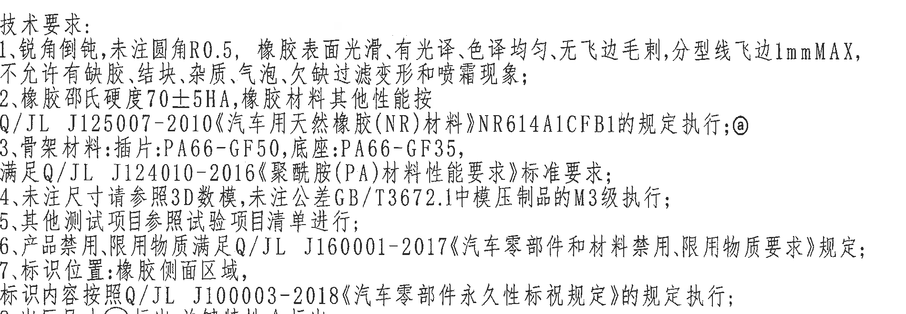
原图位置/视图名称: page 1，bbox `[2785, 1635, 4685, 2295]`，右中下技术要求文本块。
| 序号 | 原图文本 | 含义说明 |
|---|---|---|
| 1 | 锐角倒钝,未注圆角R0.5,橡胶表面光滑、有光泽、色泽均匀、无飞边毛刺,分型线飞边1mmMAX,不允许有缺胶、结块、杂质、气泡、欠缺过滤变形和喷霜现象; | 外观、圆角、飞边和缺陷要求。 |
| 2 | 橡胶邵氏硬度70±5HA,橡胶材料其他性能按Q/JL J125007-2010《汽车用天然橡胶(NR)材料》NR614A1CFB1的规定执行;@ | 橡胶硬度和材料标准。 |
| 3 | 骨架材料:插片:PA66-GF50,底座:PA66-GF35,满足Q/JL J124010-2016《聚酰胺(PA)材料性能要求》标准要求; | 塑料骨架/底座材料和PA标准。 |
| 4 | 未注尺寸请参照3D数模,未注公差GB/T3672.1中模压制品的M3级执行; | 未注尺寸和未注公差依据。 |
| 5 | 其他测试项目参照试验项目清单进行; | 其他试验执行依据。 |
| 6 | 产品禁用、限用物质满足Q/JL J160001-2017《汽车零部件和材料禁用、限用物质要求》规定; | 禁限用物质要求。 |
| 7 | 标识位置:橡胶侧面区域,标识内容按照Q/JL J100003-2018《汽车零部件永久性标识规定》的规定执行; | 永久性标识位置和标准。 |
| 8 | 出厂尺寸○标出,关键特性☆标出。 | 解释○和☆标识含义。 |

| 提取项 | 原图数值或文本 | 含义说明 |
|---|---|---|
| 未注圆角 | R0.5 | 未标注处圆角。 |
| 分型线飞边 | 1mmMAX | 飞边最大允许值。 |
| 橡胶硬度 | 70±5HA | 技术要求中的邵氏硬度。 |
| 插片材料 | PA66-GF50 | 骨架插片材料。 |
| 底座材料 | PA66-GF35 | 塑料底座材料。 |
| 未注公差 | GB/T3672.1 M3级 | 模压制品未注公差等级。 |
| 出厂尺寸符号 | ○ | 技术要求第8条说明。 |
| 关键特性符号 | ☆ | 技术要求第8条说明。 |
边界归属说明: 上边界在主视图下方空白处，下边界在明细表上方；没有把表格内容归入NOTES。

## object_7 明细表/BOM
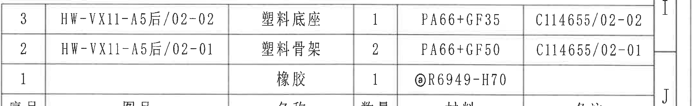
原图位置/视图名称: page 1，bbox `[2770, 2340, 4920, 2670]`，右下明细表。
| 序号 | 图号 | 名称 | 数量 | 材料 | 备注 |
|---|---|---|---|---|---|
| 3 | HW-VX11-A5后/02-02 | 塑料底座 | 1 | PA66+GF35 | C114655/02-02 |
| 2 | HW-VX11-A5后/02-01 | 塑料骨架 | 2 | PA66+GF50 | C114655/02-01 |
| 1 |  | 橡胶 | 1 | @R6949-H70 |  |

| 提取项 | 原图数值或文本 | 含义说明 |
|---|---|---|
| 塑料底座材料 | PA66+GF35 | 与技术要求底座材料对应。 |
| 塑料骨架材料 | PA66+GF50 | 与技术要求插片/骨架材料对应。 |
| 橡胶材料 | @R6949-H70 | 橡胶材料/硬度牌号标识。 |
| 数量 | 1, 2, 1 | 对应底座、骨架、橡胶数量。 |
边界归属说明: 下方投影法、比例、质量、材质、产品号等不归入BOM，另在标题栏对象提取。

## object_8 产品信息表
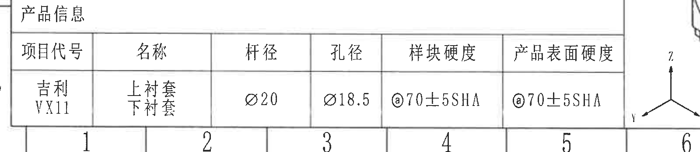
原图位置/视图名称: page 1，bbox `[350, 3025, 1950, 3375]`，左下产品信息表。
| 项目代号 | 名称 | 杆径 | 孔径 | 样块硬度 | 产品表面硬度 |
|---|---|---|---|---|---|
| 吉利VX11 | 上衬套 下衬套 | Ø20 | Ø18.5 | @70±5SHA | @70±5SHA |

| 提取项 | 原图数值或文本 | 含义说明 |
|---|---|---|
| 杆径 | Ø20 | 杆/配合杆径尺寸。 |
| 孔径 | Ø18.5 | 产品孔径，与主视图关键孔径相关。 |
| 样块硬度 | @70±5SHA | 样块硬度要求。 |
| 产品表面硬度 | @70±5SHA | 成品表面硬度要求。 |
边界归属说明: 右侧带入坐标轴局部但不属于产品信息表；表内六列完整。

## object_9 一般尺寸公差表
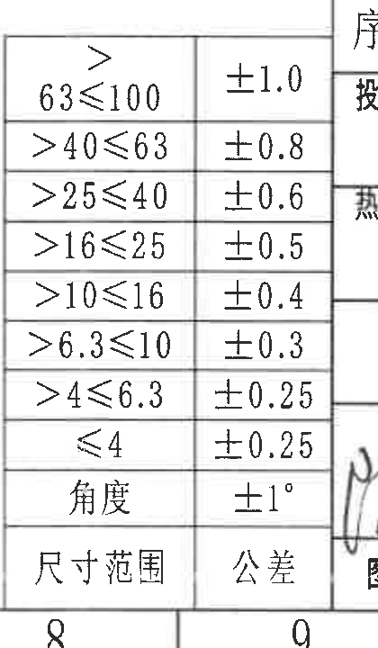
原图位置/视图名称: page 1，bbox `[2405, 2645, 2825, 3365]`，底部偏右一般公差表。
| 尺寸范围 | 公差 |
|---|---|
| >63≤100 | ±1.0 |
| >40≤63 | ±0.8 |
| >25≤40 | ±0.6 |
| >16≤25 | ±0.5 |
| >10≤16 | ±0.4 |
| >6.3≤10 | ±0.3 |
| >4≤6.3 | ±0.25 |
| ≤4 | ±0.25 |
| 角度 | ±1° |

| 提取项 | 原图数值或文本 | 含义说明 |
|---|---|---|
| 线性尺寸公差 | ±1.0 至 ±0.25 | 按尺寸范围分级给出一般公差。 |
| 角度公差 | ±1° | 未注角度公差。 |
边界归属说明: 只取左侧窄公差表；右侧投影法和签核栏属于标题栏区域。顶部贴近BOM下方，按可见完整行提取。

## object_10 轴测局部视图/三维外观图
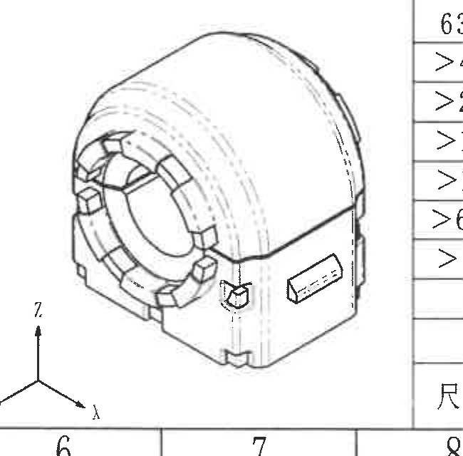
原图位置/视图名称: page 1，bbox `[1830, 2720, 2480, 3360]`，底部中间轴测图。
| 提取项 | 原图数值或文本 | 含义说明 |
|---|---|---|
| 轴测外观 | 衬套三维形态 | 展示零件外形、孔和外侧结构。 |
| 坐标轴 | X/Y/Z | 图中底部坐标方向。 |
| 标注 | 7 | 轴测图旁局部标号。 |
边界归属说明: 轴测图无独立尺寸线。左侧产品信息表和右侧一般公差表不属于本局部视图。

## object_11 右下标题栏
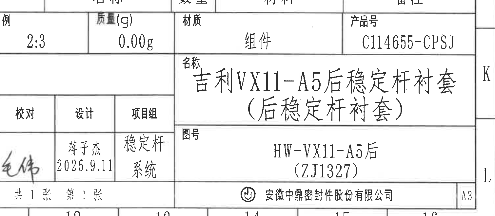
原图位置/视图名称: page 1，bbox `[3340, 2690, 4850, 3350]`，右下标题栏。
| 字段 | 原图数值或文本 | 含义说明 |
|---|---|---|
| 投影法 | 第一画法 | 投影方式。 |
| 比例 | 2:3 | 图纸比例。 |
| 质量(g) | 0.00g | 质量字段。 |
| 材质 | 组件 | 总成材质属性。 |
| 产品号 | C114655-CPSJ | 产品编号。 |
| 热处理 | 表面处理 | 热处理/表面处理栏文字。 |
| 名称 | 吉利VX11-A5后稳定杆衬套(后稳定杆衬套) | 零件/总成名称。 |
| 图号 | HW-VX11-A5后(ZJ1327) | 图纸编号。 |
| 设计 | 蒋子杰 2025.9.11 | 设计签核和日期。 |
| 项目组 | 稳定杆系统 | 项目组名称。 |
| 图样标记 | S | 图样标记栏。 |
| 页数 | 共1张 第1张 | 图纸页码。 |
| 公司 | 安徽中鼎密封件股份有限公司 | 出图单位。 |
| 图幅 | A3 | 图纸幅面。 |
边界归属说明: 上边界贴近BOM下方，左侧邻近一般公差表；BOM和公差表已分别单独提取。

## 裁切检查记录
| 对象 | 检查结果 | 说明 |
|---|---|---|
| object_1 | 完整 | 表1外框、表头、8行内容和试验要求完整；未带入表2。 |
| object_2 | 完整 | 表2标题、表头、8个试验项目和长文本完整；底边不含下方产品信息/轴测图。 |
| object_3 | 完整 | 修订履历表表头和两行记录完整；未带入A-A视图。 |
| object_4 | 完整，含边缘干扰 | 主视图尺寸线和文字完整；右侧可见A-A剖面`(3)`边缘片段，未作为主视图内容提取。 |
| object_5 | 完整，含边缘干扰 | A-A剖面的`(3)`、`2.46`和所有横向尺寸线完整；左边缘有主视图引出线局部，未提取为剖面内容。 |
| object_6 | 完整 | 技术要求1-8条完整；未带入下方明细表。 |
| object_7 | 完整 | BOM三行和六列表头完整；底边收紧，不提取投影法/标题栏字段。 |
| object_8 | 完整，含边缘干扰 | 产品信息表六列完整；右侧有轴测坐标轴局部，未作为表格内容提取。 |
| object_9 | 完整 | 可见一般公差范围和角度行完整；右侧标题栏未归入。 |
| object_10 | 完整 | 轴测图外观、坐标轴和标注7完整；无尺寸线。 |
| object_11 | 完整，含邻近栏位 | 标题栏名称、图号、产品号、比例、签核、公司和图幅完整；上/左邻近BOM、公差表已分开提取。 |
