# 20C114670 内容识别结果
整页 PNG：`outputs/20C114670_assets/images/page_1.png`
说明：以下内容按原图结构分区列出，不对原图顺序做重组；括号尺寸作为参考尺寸保留并说明参考含义。
## object_1 - 修订履历表
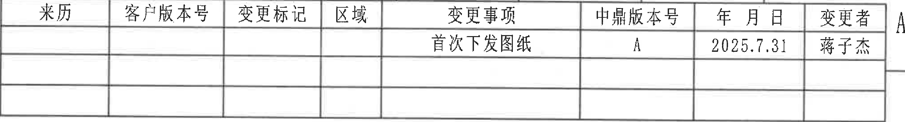
- 原图位置/视图名称：修订履历表
- bbox：[3720, 220, 6420, 585]

原表还原：
| 来源 | 客户版本号 | 变更标记 | 区域 | 变更事项 | 申鼎版本号 | 年月日 | 变更者 |
|---|---|---|---|---|---|---|---|
| （空） | （空） | （空） | （空） | 首次下发图纸 | A | 2025.7.31 | 蒋子杰 |

提取表格：
| 提取项 | 原图数值或文本 | 含义说明 |
|---|---|---|
| REV/申鼎版本号 | A | 图纸版本为 A。 |
| DESCRIPTION/变更事项 | 首次下发图纸 | 本次为首次下发。 |
| DATE/年月日 | 2025.7.31 | 变更日期。 |
| BY/变更者 | 蒋子杰 | 变更/发布人员。 |
| LOC/区域 | 空白 | 原表区域栏未填写。 |
| ECN NO | 未见 ECN NO 列 | 原修订栏表头为中文字段，未见单独 ECN NO 栏。 |

边界归属说明：裁切为右上修订履历栏，仅包含列 10-16 附近的修订表；右侧图框字母 A 的残边不作为表格内容。
## object_2 - 表1：试验项目清单
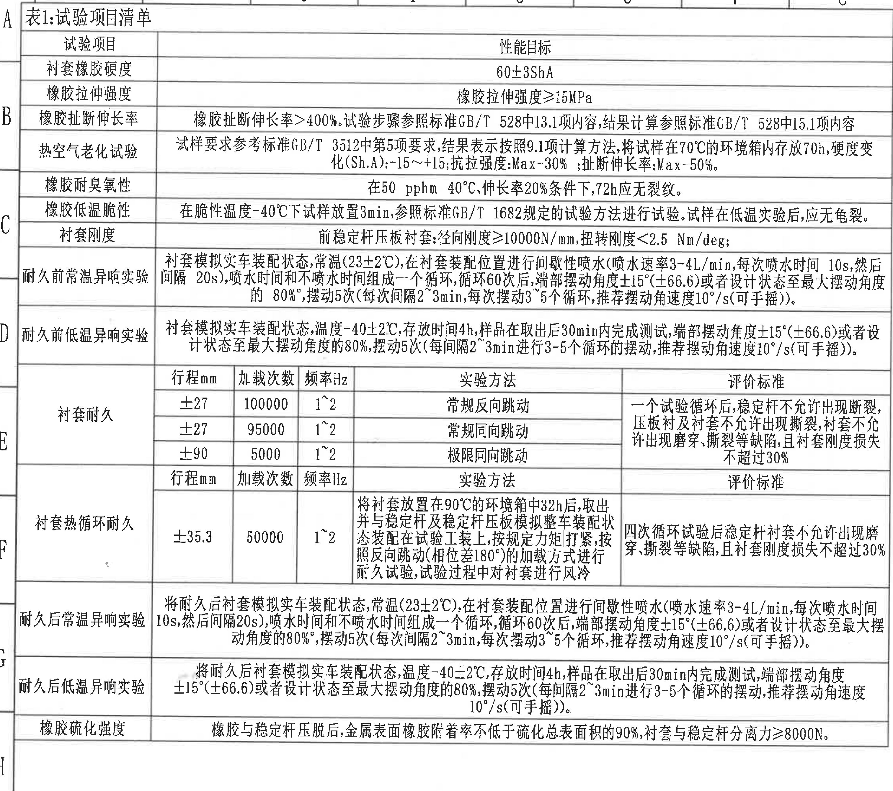
- 原图位置/视图名称：表1：试验项目清单
- bbox：[400, 180, 3425, 2860]

原表还原：
| 试验项目 | 性能目标 / 试验条件 / 评价标准 |
|---|---|
| 衬套橡胶硬度 | 60±3ShA |
| 橡胶拉伸强度 | 橡胶拉伸强度≥15MPa |
| 橡胶扯断伸长率 | 橡胶扯断伸长率>400%；试验步骤参照标准 GB/T 528 中 13.1 项内容；结果计算参照标准 GB/T 528 中 15.1 项内容 |
| 热空气老化试验 | 试样要求参考标准 GB/T 3512 中第 5 项要求；结果表示按照 9.1 项计算方法；将试样在 70℃ 的环境箱内存放 70h；硬度变化(Sh.A):-15~+15；抗拉强度:Max-30%；扯断伸长率:Max-50%。 |
| 橡胶耐臭氧性 | 在 50 pphm、40℃、伸长率 20% 条件下，72h 应无裂纹。 |
| 橡胶低温脆性 | 在脆性温度 -40℃ 下试样放置 3min；参照标准 GB/T 1682 规定的试验方法进行试验；试样在低温实验后，应无龟裂。 |
| 衬套刚度 | 前稳定杆压板衬套：径向刚度≥10000N/mm；扭转刚度<2.5 Nm/deg。 |
| 耐久前常温异响实验 | 衬套模拟实车装配状态；常温(23±2℃)；在衬套装配位置进行间歇性喷水，喷水速率 3-4L/min，每次喷水时间 10s，然后间隔 20s，喷水时间和不喷水时间组成一个循环；循环 60 次后，端部摆动角度 ±15°(±66.6) 或者设计状态至最大摆动角度的 80%；摆动 5 次(每次间隔 2~3min，每次摆动 3~5 个循环，推荐摆动角速度 10°/s，可手摇)。 |
| 耐久前低温异响实验 | 衬套模拟实车装配状态；温度 -40±2℃；存放时间 4h；样品取出后 30min 内完成测试；端部摆动角度 ±15°(±66.6) 或者设计状态至最大摆动角度的 80%；摆动 5 次(每间隔 2~3min 进行 3-5 个循环的摆动，推荐摆动角速度 10°/s，可手摇)。 |
| 衬套耐久 | 行程 mm / 加载次数 / 频率 Hz / 实验方法 / 评价标准：±27 / 100000 / 1~2 / 常规反向跳动 / 一个试验循环后，稳定杆不允许出现断裂，压板衬及衬套不允许出现撕裂，衬套不允许出现磨穿、撕裂等缺陷，且衬套刚度损失不超过 30%；±27 / 95000 / 1~2 / 常规同向跳动 / 同评价标准；±90 / 5000 / 1~2 / 极限同向跳动 / 同评价标准。 |
| 衬套热循环耐久 | 行程 ±35.3mm；加载次数 50000；频率 1~2Hz；实验方法：将衬套放置在 90℃ 的环境箱中 32h 后取出，并与稳定杆及稳定杆压板模拟整车装配状态装配在试验工装上，按规定力矩打紧，按照反向跳动(相位差 180°)的加载方式进行耐久试验，试验过程中对衬套进行风冷；评价标准：四次循环试验后稳定杆衬套不允许出现磨穿、撕裂等缺陷，且衬套刚度损失不超过 30%。 |
| 耐久后常温异响实验 | 将耐久后衬套模拟实车装配状态；常温(23±2℃)；在衬套装配位置进行间歇性喷水，喷水速率 3-4L/min，每次喷水时间 10s，然后间隔 20s；循环 60 次后，端部摆动角度 ±15°(±66.6) 或设计状态至最大摆动角度的 80%；摆动 5 次(每次间隔 2~3min，每次摆动 3~5 个循环，推荐摆动角速度 10°/s，可手摇)。 |
| 耐久后低温异响实验 | 将耐久后衬套模拟实车装配状态；温度 -40±2℃；存放时间 4h；样品取出后 30min 内完成测试；端部摆动角度 ±15°(±66.6) 或设计状态至最大摆动角度的 80%；摆动 5 次(每间隔 2~3min 进行 3-5 个循环的摆动，推荐摆动角速度 10°/s，可手摇)。 |
| 橡胶硫化强度 | 橡胶与稳定杆压脱后，金属表面橡胶附着率不低于硫化总表面积的 90%；衬套与稳定杆分离力≥8000N。 |

提取表格：
| 提取项 | 原图数值或文本 | 含义说明 |
|---|---|---|
| 60±3ShA | 衬套橡胶硬度目标 | 硬度性能目标，ShA 为邵氏 A 硬度。 |
| ≥15MPa | 橡胶拉伸强度 | 拉伸强度下限。 |
| >400% | 橡胶扯断伸长率 | 断裂伸长率下限。 |
| GB/T 528 13.1、15.1 | 扯断伸长率试验/计算 | 分别为试验步骤和结果计算依据。 |
| 70℃、70h | 热空气老化试验条件 | 高温环境箱存放条件。 |
| -15~+15 Sh.A | 老化后硬度变化 | 允许硬度变化范围。 |
| Max-30% / Max-50% | 老化后强度/伸长率变化 | 抗拉强度与扯断伸长率最大降低比例。 |
| 50 pphm、40℃、20%、72h | 耐臭氧条件 | 臭氧浓度、温度、拉伸率和暴露时间。 |
| -40℃、3min | 低温脆性条件 | 低温放置时间和温度。 |
| 径向刚度≥10000N/mm | 衬套刚度 | 径向刚度下限。 |
| 扭转刚度<2.5 Nm/deg | 衬套刚度 | 扭转刚度上限。 |
| 23±2℃ | 常温异响实验温度 | 常温环境条件。 |
| -40±2℃、4h、30min | 低温异响实验条件 | 低温存放和取出后测试时限。 |
| ±15°(±66.6)、80% | 异响实验端部摆角 | 端部摆动角度或设计状态最大摆角比例；括号内 ±66.6 为参考换算/对应值。 |
| 3-4L/min、10s、20s、60 次 | 喷水循环 | 喷水速率、喷/停时间和循环次数。 |
| 10°/s | 推荐摆动角速度 | 可手摇的推荐角速度。 |
| ±27/100000/1~2 | 衬套耐久 1 | 行程、加载次数、频率；常规反向跳动。 |
| ±27/95000/1~2 | 衬套耐久 2 | 行程、加载次数、频率；常规同向跳动。 |
| ±90/5000/1~2 | 衬套耐久 3 | 行程、加载次数、频率；极限同向跳动。 |
| ±35.3/50000/1~2 | 热循环耐久 | 行程、加载次数、频率。 |
| 90℃、32h、相位差180° | 热循环耐久条件 | 环境箱放置与反向跳动加载条件。 |
| 刚度损失不超过30% | 耐久评价 | 耐久后允许刚度损失上限。 |
| 分离力≥8000N | 硫化强度 | 衬套与稳定杆分离力下限。 |

边界归属说明：裁切为左侧表1整体，包含标题、性能目标、耐久子表和底部硫化强度行；上方/左侧图框坐标字母属于图框，不作为表格内容。
## object_3 - 主视图 / 正视加工视图
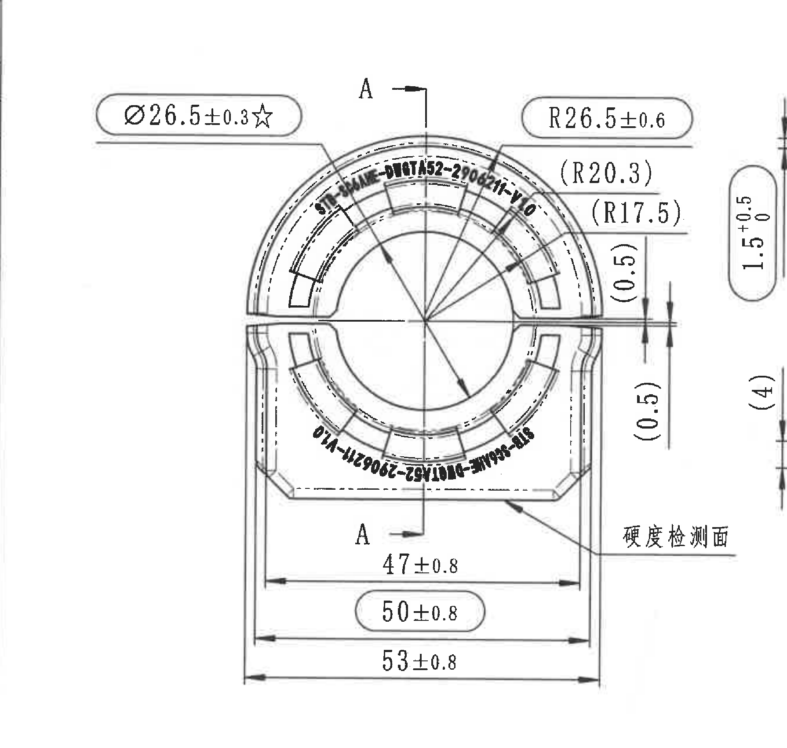
- 原图位置/视图名称：主视图 / 正视加工视图
- bbox：[3420, 640, 5210, 2340]

提取表格：
| 提取项 | 原图数值或文本 | 含义说明 |
|---|---|---|
| Ø26.5±0.3☆ | 内孔/孔径关键尺寸 | 带直径符号和星号，表示出厂关键特性；对应中心孔尺寸。 |
| R26.5±0.6 | 外圆弧半径 | 上部外圆弧加工半径，带公差 ±0.6。 |
| (R20.3) | 参考圆弧半径 | 括号内为参考尺寸，用于表达内侧圆弧关系，不作为直接检验控制尺寸。 |
| (R17.5) | 参考圆弧半径 | 括号内为参考尺寸，用于表达更内侧圆弧关系。 |
| (0.5) | 参考间隙/薄边尺寸 | 位于右侧开口附近的竖向参考尺寸，表示小间隙/壁厚关系。 |
| 47±0.8 | 内侧宽度 | 底部内侧两竖边之间尺寸。 |
| 50±0.8 | 中间宽度/关键宽度 | 圆角框内标注，表示中间外形宽度，带 ±0.8。 |
| 53±0.8 | 总宽度 | 主视图底部最大横向宽度。 |
| A-A / A | 剖切基准 | 主视图上下以 A 标出剖切位置，指向右侧 A-A 剖视图。 |
| 硬度检测面 | 检验面标注 | 引线指向下部斜面/外表面，说明该处为硬度检测面。 |
| STB-SC6AHE-DWGTA52-2906211-V1.0 | 产品表面标识 | 弧形文字标识的一部分，属于产品标识/永久标识内容。 |

边界归属说明：主视图裁切保留本视图主体、剖切符号、弧度/直径/宽度标注和硬度检测面引线。右侧边缘可见邻近 A-A 剖视图的竖向尺寸残片，未作为主视图内容提取；A-A 剖视图实体尺寸另列于 object_4。
## object_4 - A-A 剖视图
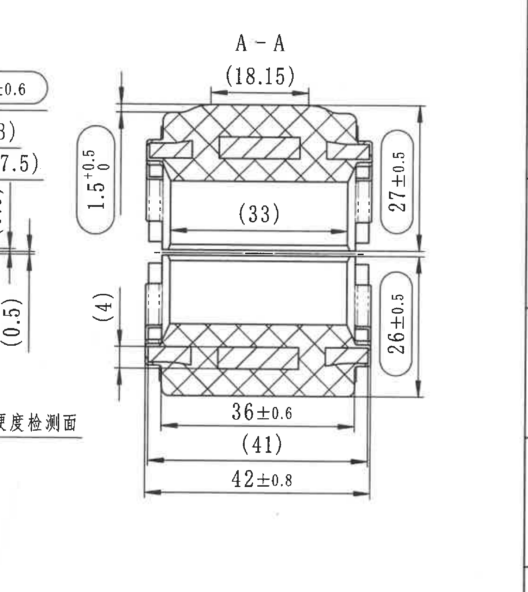
- 原图位置/视图名称：A-A 剖视图
- bbox：[4860, 660, 6360, 2340]

提取表格：
| 提取项 | 原图数值或文本 | 含义说明 |
|---|---|---|
| A-A | 剖视名称 | 对应主视图中的 A-A 剖切位置。 |
| (18.15) | 参考上部宽度 | 剖面顶部括号尺寸，为参考尺寸。 |
| (33) | 参考内腔宽度 | 剖面中部内腔水平参考尺寸。 |
| 27±0.5 | 上半剖面高度/外形尺寸 | 右侧上部竖向尺寸，带 ±0.5。 |
| 26±0.5 | 下半剖面高度/外形尺寸 | 右侧下部竖向尺寸，带 ±0.5。 |
| 36±0.6 | 下部内侧宽度 | 底部第一条水平尺寸，带 ±0.6。 |
| (41) | 参考下部宽度 | 底部第二条水平括号尺寸，为参考宽度。 |
| 42±0.8 | 下部总宽度 | 底部外侧总宽度，带 ±0.8。 |
| 1.5 +0.5/0 | 左侧台阶/厚度尺寸 | 剖视图左侧竖向尺寸，上偏差 +0.5、下偏差 0。 |
| (4) | 左侧参考高度/间距 | 剖视图左侧括号尺寸，为参考尺寸。 |

边界归属说明：裁切包含 A-A 剖面、剖面线、完整水平/竖向尺寸线和文字。左缘与主视图相邻，少量主视图标注残线不纳入本剖视内容；剖面尺寸按 A-A 图内尺寸线归属。
## object_5 - 技术要求 / NOTES
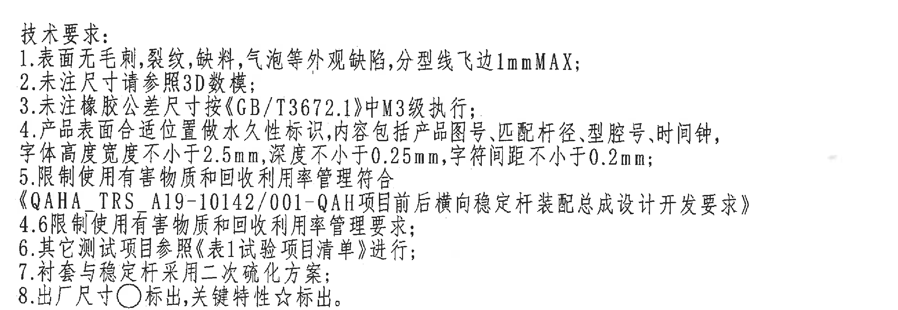
- 原图位置/视图名称：技术要求 / NOTES
- bbox：[3600, 2300, 6200, 3200]

提取表格：
| 提取项 | 原图数值或文本 | 含义说明 |
|---|---|---|
| 1 | 表面无毛刺、裂纹、缺料、气泡等外观缺陷，分型线飞边 1mm MAX | 外观和飞边要求。 |
| 2 | 未注尺寸请参照 3D 数模 | 未注尺寸来源。 |
| 3 | 未注橡胶公差尺寸按《GB/T3672.1》中 M3 级执行 | 未注橡胶公差等级。 |
| 4 | 产品表面合适位置做永久性标识，内容包括产品图号、匹配杆径、型腔号、时间钟；字体高度宽度不小于 2.5mm，深度不小于 0.25mm，字符间距不小于 0.2mm | 永久标识内容和字符尺寸要求。 |
| 5 | 限制使用有害物质和回收利用率管理符合《QAHA TRS A19-10142/001-QAH 项目前后横向稳定杆装配总成设计开发要求》 | 环保/回收管理要求。 |
| 4.6 | 限制使用有害物质和回收利用率管理要求 | 原图在第5条后续行出现 4.6 编号，按原图保留。 |
| 6 | 其它测试项目参照《表1试验项目清单》进行 | 测试项目引用表1。 |
| 7 | 衬套与稳定杆采用二次硫化方案 | 工艺方案。 |
| 8 | 出厂尺寸○标出，关键特性☆标出 | 符号含义：圆圈为出厂尺寸，星号为关键特性。 |

边界归属说明：裁切为主视图下方技术要求文字块，包含 1-8 条；不包含下方明细表和标题栏。
## object_6 - 明细表 / BOM
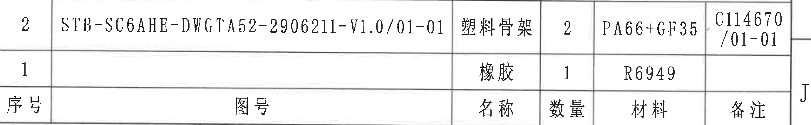
- 原图位置/视图名称：明细表 / BOM
- bbox：[3650, 3235, 6410, 3665]

原表还原：
| 序号 | 图号 | 名称 | 数量 | 材料 | 备注 |
|---|---|---|---|---|---|
| 2 | STB-SC6AHE-DWGTA52-2906211-V1.0/01-01 | 塑料骨架 | 2 | PA66+GF35 | C114670/01-01 |
| 1 | （空） | 橡胶 | 1 | R6949 | （空） |

提取表格：
| 提取项 | 原图数值或文本 | 含义说明 |
|---|---|---|
| 序号 2 | STB-SC6AHE-DWGTA52-2906211-V1.0/01-01 / 塑料骨架 / 数量2 / PA66+GF35 / C114670/01-01 | 塑料骨架明细。 |
| 序号 1 | 橡胶 / 数量1 / R6949 | 橡胶材料明细；图号和备注为空。 |

边界归属说明：裁切为右下明细表。上方技术要求第8条和右侧图框坐标 J 可能有极少边缘残片，不作为明细表字段；提取内容仅按明细表边框内行列。
## object_7 - 标题栏
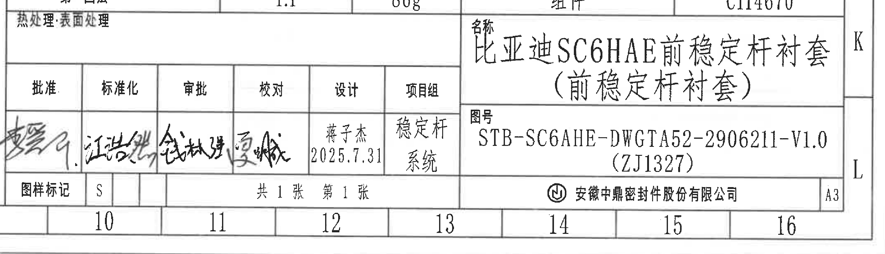
- 原图位置/视图名称：标题栏
- bbox：[3620, 3790, 6470, 4610]

提取表格：
| 提取项 | 原图数值或文本 | 含义说明 |
|---|---|---|
| 投影法 | 第一画法 | 标题栏投影法。 |
| 比例 | 1:1 | 图纸比例。 |
| 质量(g) | 86g | 组件质量。 |
| 材质 | 组件 | 标题栏材质栏。 |
| 产品号 | C114670 | 产品号。 |
| 名称 | 比亚迪 SC6HAE 前稳定杆衬套（前稳定杆衬套） | 零件/组件名称。 |
| 图号 | STB-SC6AHE-DWGTA52-2906211-V1.0 (ZJ1327) | 图纸编号和括号内编号。 |
| 热处理/表面处理 | 空白 | 该栏未填写。 |
| 批准/标准化/审批/校对 | 手写签名 | 签核栏。 |
| 设计 | 蒋子杰 2025.7.31 | 设计人员和日期。 |
| 项目组 | 稳定杆系统 | 项目组。 |
| 图样标记 | S | 图样标记。 |
| 页码 | 共1张 第1张 | 页数。 |
| 公司 | 安徽申鼎密封件股份有限公司 | 出图单位。 |
| 图幅 | A3 | 图幅规格。 |

边界归属说明：裁切为右下标题栏，包含投影、比例、质量、产品号、名称、图号、签核、公司和 A3 图幅；上方明细表边线不作为标题栏字段。
## object_8 - 等轴局部视图 / 3D 示意
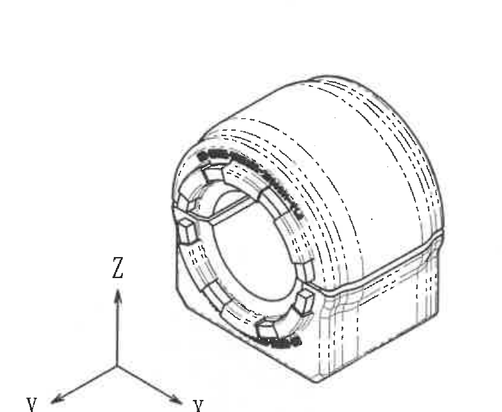
- 原图位置/视图名称：等轴局部视图 / 3D 示意
- bbox：[2500, 3120, 3620, 4040]

提取表格：
| 提取项 | 原图数值或文本 | 含义说明 |
|---|---|---|
| X/Y/Z | 坐标方向 | 三维示意方向标，说明模型方向。 |
| 弧形零件外观 | 等轴视图 | 显示衬套外形、开口、内孔、外圆弧和表面标识位置。 |
| 表面弧形标识 | 图形标识 | 示意表面永久标识分布，不给出独立尺寸值。 |

边界归属说明：裁切为左下等轴视图和坐标轴；左侧表2和右侧标题栏/明细栏残边不作为本局部视图内容。
## object_9 - 未注尺寸公差表
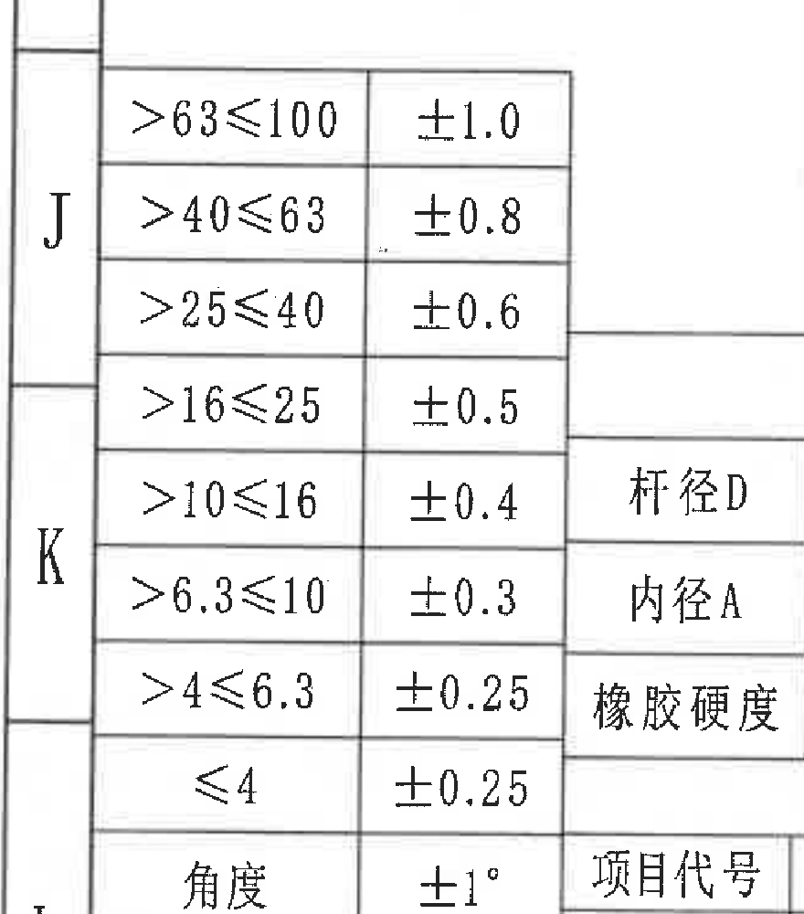
- 原图位置/视图名称：未注尺寸公差表
- bbox：[330, 3270, 1210, 4270]

原表还原：
| 尺寸范围 | 公差 |
|---|---|
| >63≤100 | ±1.0 |
| >40≤63 | ±0.8 |
| >25≤40 | ±0.6 |
| >16≤25 | ±0.5 |
| >10≤16 | ±0.4 |
| >6.3≤10 | ±0.3 |
| >4≤6.3 | ±0.25 |
| ≤4 | ±0.25 |
| 角度 | ±1° |
| 尺寸范围 | 公差 |

提取表格：
| 提取项 | 原图数值或文本 | 含义说明 |
|---|---|---|
| >63≤100 / ±1.0 | 一般线性尺寸公差 | 未注线性尺寸范围对应公差。 |
| >40≤63 / ±0.8 | 一般线性尺寸公差 | 未注线性尺寸范围对应公差。 |
| >25≤40 / ±0.6 | 一般线性尺寸公差 | 未注线性尺寸范围对应公差。 |
| >16≤25 / ±0.5 | 一般线性尺寸公差 | 未注线性尺寸范围对应公差。 |
| >10≤16 / ±0.4 | 一般线性尺寸公差 | 未注线性尺寸范围对应公差。 |
| >6.3≤10 / ±0.3 | 一般线性尺寸公差 | 未注线性尺寸范围对应公差。 |
| >4≤6.3 / ±0.25 | 一般线性尺寸公差 | 未注线性尺寸范围对应公差。 |
| ≤4 / ±0.25 | 一般线性尺寸公差 | 未注线性尺寸范围对应公差。 |
| 角度 / ±1° | 一般角度公差 | 未注角度公差。 |

边界归属说明：裁切为左下未注尺寸/角度公差表。右侧可见表2行名边缘，未作为本公差表内容；底部下一行“尺寸范围/公差”按原表结构保留。
## object_10 - 表2：杆径调数表
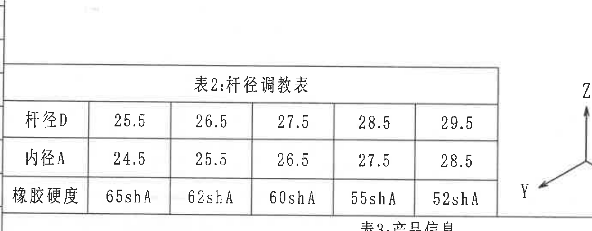
- 原图位置/视图名称：表2：杆径调数表
- bbox：[940, 3435, 2780, 4155]

原表还原：
| 项目 | 25.5 | 26.5 | 27.5 | 28.5 | 29.5 |
|---|---|---|---|---|---|
| 杆径D | 25.5 | 26.5 | 27.5 | 28.5 | 29.5 |
| 内径A | 24.5 | 25.5 | 26.5 | 27.5 | 28.5 |
| 橡胶硬度 | 65shA | 62shA | 60shA | 55shA | 52shA |

提取表格：
| 提取项 | 原图数值或文本 | 含义说明 |
|---|---|---|
| 杆径D 25.5 / 内径A 24.5 / 橡胶硬度 65shA | 杆径调数组 1 | 用于杆径 25.5 时的内径和硬度配置。 |
| 杆径D 26.5 / 内径A 25.5 / 橡胶硬度 62shA | 杆径调数组 2 | 用于杆径 26.5 时的内径和硬度配置。 |
| 杆径D 27.5 / 内径A 26.5 / 橡胶硬度 60shA | 杆径调数组 3 | 用于杆径 27.5 时的内径和硬度配置。 |
| 杆径D 28.5 / 内径A 27.5 / 橡胶硬度 55shA | 杆径调数组 4 | 用于杆径 28.5 时的内径和硬度配置。 |
| 杆径D 29.5 / 内径A 28.5 / 橡胶硬度 52shA | 杆径调数组 5 | 用于杆径 29.5 时的内径和硬度配置。 |

边界归属说明：裁切为表2主表区域，包含表头、杆径D、内径A、橡胶硬度三行。右侧临近等轴图坐标轴不作为表2内容；左侧一般公差表残边不提取。
## object_11 - 表3：产品信息
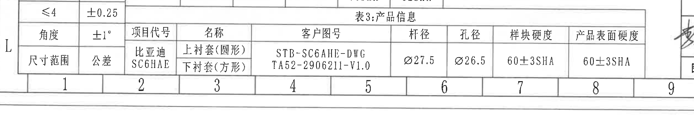
- 原图位置/视图名称：表3：产品信息
- bbox：[340, 4070, 3700, 4630]

原表还原：
| 项目代号 | 名称 | 客户图号 | 杆径 | 孔径 | 样块硬度 | 产品表面硬度 |
|---|---|---|---|---|---|---|
| 比亚迪 SC6HAE | 上衬套(圆形) / 下衬套(方形) | STB-SC6AHE-DWGTA52-2906211-V1.0 | Ø27.5 | Ø26.5 | 60±3SHA | 60±3SHA |

提取表格：
| 提取项 | 原图数值或文本 | 含义说明 |
|---|---|---|
| 项目代号 | 比亚迪 SC6HAE | 客户/项目代号。 |
| 名称 | 上衬套(圆形)；下衬套(方形) | 产品上下衬套形状信息。 |
| 客户图号 | STB-SC6AHE-DWGTA52-2906211-V1.0 | 客户图号。 |
| 杆径 | Ø27.5 | 稳定杆杆径，直径符号。 |
| 孔径 | Ø26.5 | 衬套孔径，直径符号。 |
| 样块硬度 | 60±3SHA | 样块硬度要求。 |
| 产品表面硬度 | 60±3SHA | 产品表面硬度要求。 |

边界归属说明：裁切为表3产品信息表。左侧一般公差表尾行和右侧签字栏边缘可能可见，不作为表3字段；表3字段按表格横向表头和单行数据归属。
## 裁切检查记录
| 对象 | 名称 | 检查记录 |
|---|---|---|
| object_1 | 修订履历表 | 完整；表头和首行修订记录均在裁切内。右侧图框字母 A 残边排除。 |
| object_2 | 表1：试验项目清单 | 完整；标题、性能目标、耐久子表和底部硫化强度行均在裁切内。图框坐标残边排除。 |
| object_3 | 主视图 | 完整包含主视图尺寸线和文字；右缘邻近 A-A 剖视尺寸残片排除，不归入主视图。 |
| object_4 | A-A 剖视图 | 完整包含剖面、剖面名和左右/底部尺寸线文字；左缘主视图残线排除。 |
| object_5 | 技术要求 | 完整包含 1-8 条；没有截断下方明细表内容。 |
| object_6 | 明细表 | 完整包含序号、图号、名称、数量、材料、备注及两行数据；上方/右侧残边排除。 |
| object_7 | 标题栏 | 完整包含投影法、比例、质量、产品号、名称、图号、签核、公司和图幅。 |
| object_8 | 等轴局部视图 | 完整包含等轴零件和 X/Y/Z 坐标轴；相邻表格边缘排除。 |
| object_9 | 未注尺寸公差表 | 完整包含线性公差和角度公差；右侧表2残边排除。 |
| object_10 | 表2：杆径调数表 | 完整包含表题、杆径D、内径A、橡胶硬度三行和 5 个数值列；左右相邻对象残边排除。 |
| object_11 | 表3：产品信息 | 完整包含表题、表头和数据行；左右相邻公差表/签字栏残边排除。 |
