# 20C114676 内容识别与裁切提取

整页 PNG：`outputs/20C114676_assets/images/page_1.png`  
页面尺寸：4959 x 3505 px，bbox `[0, 0, 4959, 3505]`

## object_1 - 上左半圆加工视图

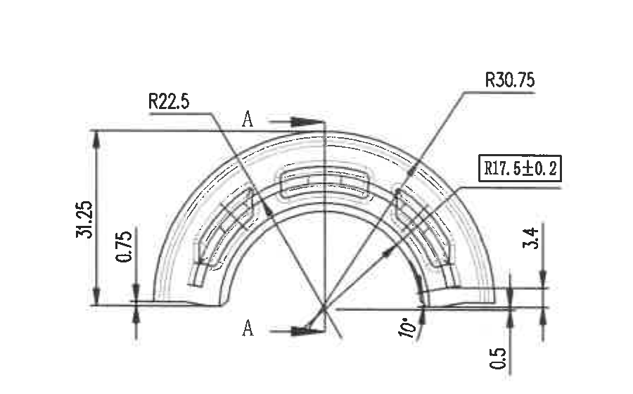

原图位置/视图名称：第 1 页左上，半圆主视图，bbox `[500, 260, 1400, 820]`。

| 提取项 | 原图数值或文本 | 含义说明 |
|---|---|---|
| 半径 | R22.5 | 左上指引线指向半圆外侧/槽形圆弧处的半径尺寸。 |
| 半径 | R30.75 | 右上指引线指向外侧圆弧半径。 |
| 方框标注半径 | R17.5±0.2 | 指向内侧弧形槽/轨迹的半径，带公差；方框表示该尺寸被重点框出，非括号参考尺寸。 |
| 竖向尺寸 | 31.25 | 左侧总高度/外轮廓至基准水平线的竖向尺寸。 |
| 竖向尺寸 | 0.75 | 左侧局部台阶/边缘高度尺寸。 |
| 竖向尺寸 | 3.4 | 右侧局部高度尺寸。 |
| 竖向尺寸 | 0.5 | 右下局部边缘厚度/间隙尺寸。 |
| 角度 | 10° | 从中心径向线到右侧局部边线的角度标注。 |
| 剖切标识 | A、A | A-A 剖面位置指示箭头，剖面图见 object_2。 |
| T 编号 | 未见 | 当前视图未标注 T 编号。 |
| 参考尺寸 | 未见括号参考尺寸 | 当前视图中未见括号形式参考尺寸。 |

边界归属说明：该裁切只包含上左半圆主视图和 A-A 剖切指示；A-A 剖面实体及其 14.25±0.3、1.5 尺寸归 object_2；下方其他视图的 R1 等标注未纳入本对象。

## object_2 - A-A 剖面视图

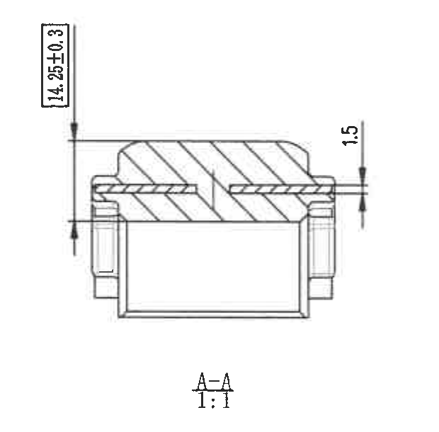

原图位置/视图名称：第 1 页上部偏左，A-A 剖面，比例 1:1，bbox `[1350, 250, 1970, 860]`。

| 提取项 | 原图数值或文本 | 含义说明 |
|---|---|---|
| 剖面名称 | A-A | 对应 object_1 中 A-A 剖切线。 |
| 比例 | 1:1 | 剖面视图比例。 |
| 竖向尺寸 | 14.25±0.3 | 左侧竖向总厚度/高度尺寸，带 ±0.3 公差。 |
| 竖向尺寸 | 1.5 | 右侧局部台阶/层厚尺寸。 |
| 剖面线 | 斜剖面线 | 表示切到的材料区域。 |
| T 编号 | 未见 | 当前剖面未标注 T 编号。 |
| 参考尺寸 | 未见括号参考尺寸 | 当前剖面未见括号形式参考尺寸。 |

边界归属说明：裁切完整包含 A-A 剖面、剖面名称、比例和两处尺寸线；半圆主视图中的 R22.5、R30.75、R17.5±0.2、10° 等尺寸不属于本剖面。

## object_3 - 中左外形加工视图

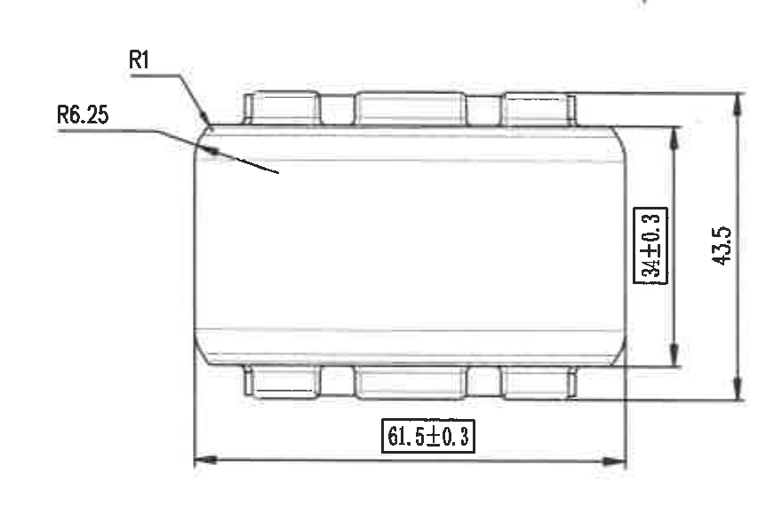

原图位置/视图名称：第 1 页左侧中上，外形侧视/正投影视图，bbox `[500, 790, 1380, 1360]`。

| 提取项 | 原图数值或文本 | 含义说明 |
|---|---|---|
| 圆角 | R1 | 左上角局部倒圆/圆角半径。 |
| 圆角 | R6.25 | 左上外轮廓过渡圆角半径。 |
| 横向尺寸 | 61.5±0.3 | 底部总长度尺寸，带 ±0.3 公差。 |
| 竖向尺寸 | 34±0.3 | 右侧内侧高度/主体高度尺寸，带 ±0.3 公差。 |
| 竖向尺寸 | 43.5 | 右侧外侧总高度尺寸。 |
| T 编号 | 未见 | 当前视图未标注 T 编号。 |
| 参考尺寸 | 未见括号参考尺寸 | 当前视图未见括号形式参考尺寸。 |

边界归属说明：裁切完整包含本外形视图的尺寸线和文字；下方半圆/B-B 视图的 0.5、3.4、28.5±0.3 等尺寸不归入本对象。

## object_4 - 中左半圆加工视图及 B-B 剖切指示

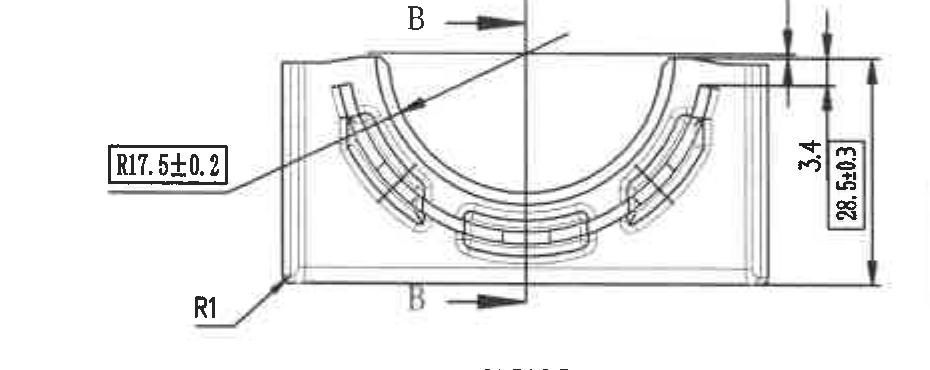

原图位置/视图名称：第 1 页左侧中部，半圆/开口方向加工视图，含 B-B 剖切线，bbox `[450, 1405, 1380, 1775]`。

| 提取项 | 原图数值或文本 | 含义说明 |
|---|---|---|
| 方框标注半径 | R17.5±0.2 | 左侧指引线指向弧形槽/内弧轨迹，带 ±0.2 公差。 |
| 圆角 | R1 | 左下外轮廓倒圆尺寸。 |
| 竖向尺寸 | 0.5 | 右上局部厚度/台阶高度尺寸。 |
| 竖向尺寸 | 3.4 | 右侧局部高度尺寸。 |
| 竖向尺寸 | 28.5±0.3 | 右侧总/局部高度尺寸，带 ±0.3 公差。 |
| 剖切标识 | B、B | B-B 剖面位置指示箭头，剖面图见 object_5。 |
| T 编号 | 未见 | 当前视图未标注 T 编号。 |
| 参考尺寸 | 未见括号参考尺寸 | 当前视图未见括号形式参考尺寸。 |

边界归属说明：下方 61.5±0.3、47.3±0.3 的完整尺寸线归属下方外形视图 object_6；本裁切已收紧到 B-B 视图本体和右侧竖向尺寸，不提取下方相邻视图尺寸。

## object_5 - B-B 剖面视图

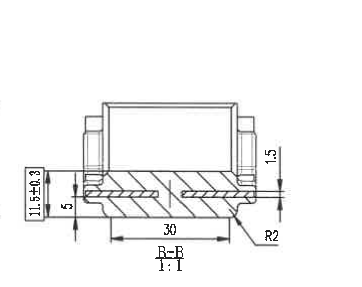

原图位置/视图名称：第 1 页中部偏左，B-B 剖面，比例 1:1，bbox `[1340, 1260, 2060, 1830]`。

| 提取项 | 原图数值或文本 | 含义说明 |
|---|---|---|
| 剖面名称 | B-B | 对应 object_4 中 B-B 剖切线。 |
| 比例 | 1:1 | 剖面视图比例。 |
| 竖向尺寸 | 11.5±0.3 | 左侧局部高度/厚度尺寸，带 ±0.3 公差。 |
| 竖向尺寸 | 5 | 左下局部层厚/台阶尺寸。 |
| 横向尺寸 | 30 | 底部内侧宽度尺寸。 |
| 竖向尺寸 | 1.5 | 右侧局部层厚/台阶尺寸。 |
| 圆角 | R2 | 右下局部圆角半径。 |
| T 编号 | 未见 | 当前剖面未标注 T 编号。 |
| 参考尺寸 | 未见括号参考尺寸 | 当前剖面未见括号形式参考尺寸。 |

边界归属说明：裁切完整包含 B-B 剖面、剖面名称、比例和剖面尺寸；左侧半圆视图的 R17.5±0.2、R1、0.5、3.4、28.5±0.3 不归入本剖面。

## object_6 - 下左外形加工视图

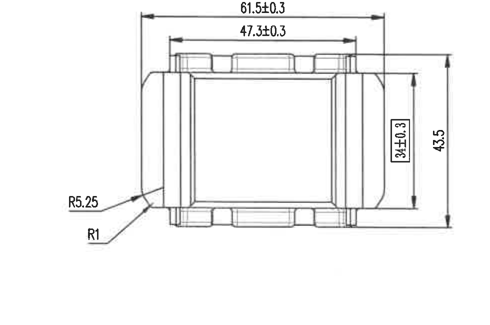

原图位置/视图名称：第 1 页左侧下部，外形俯视/底视投影视图，bbox `[450, 1770, 1430, 2420]`。

| 提取项 | 原图数值或文本 | 含义说明 |
|---|---|---|
| 横向尺寸 | 61.5±0.3 | 顶部外侧总长度尺寸，带 ±0.3 公差。 |
| 横向尺寸 | 47.3±0.3 | 顶部内侧/凸台间距尺寸，带 ±0.3 公差。 |
| 竖向尺寸 | 34±0.3 | 右侧内侧高度/主体高度尺寸，带 ±0.3 公差。 |
| 竖向尺寸 | 43.5 | 右侧外侧总高度尺寸。 |
| 圆角 | R5.25 | 左下外轮廓过渡圆角半径。 |
| 圆角 | R1 | 左下局部倒圆半径。 |
| T 编号 | 未见 | 当前视图未标注 T 编号。 |
| 参考尺寸 | 未见括号参考尺寸 | 当前视图未见括号形式参考尺寸。 |

边界归属说明：顶部 61.5±0.3 与 47.3±0.3 的完整尺寸线均指向本下方外形视图，归属 object_6；上方半圆/B-B 指示视图的 R17.5±0.2、0.5、3.4、28.5±0.3 不归入本对象。

## object_7 - 一般公差表

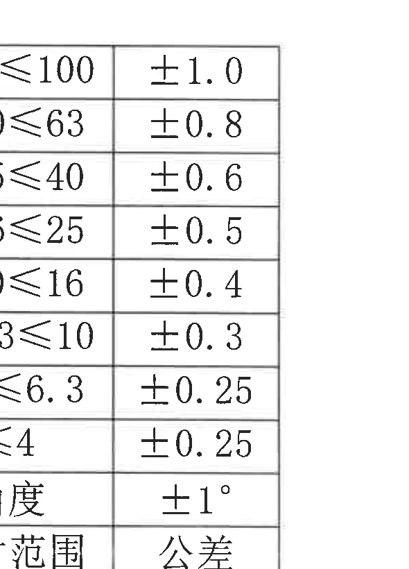

原图位置/视图名称：第 1 页左下，一般尺寸公差表，bbox `[530, 2500, 1120, 3320]`。

原表还原：

| 尺寸范围 | 公差 |
|---|---|
| >63≤100 | ±1.0 |
| >40≤63 | ±0.8 |
| >25≤40 | ±0.6 |
| >16≤25 | ±0.5 |
| >10≤16 | ±0.4 |
| >6.3≤10 | ±0.3 |
| >4≤6.3 | ±0.25 |
| ≤4 | ±0.25 |
| 角度 | ±1° |

| 提取项 | 原图数值或文本 | 含义说明 |
|---|---|---|
| 表头 | 尺寸范围 / 公差 | 未注线性尺寸和角度尺寸的一般公差对照。 |
| 线性尺寸公差 | >63≤100 / ±1.0 | 尺寸范围大于 63 且小于等于 100 时的公差。 |
| 线性尺寸公差 | >40≤63 / ±0.8 | 尺寸范围大于 40 且小于等于 63 时的公差。 |
| 线性尺寸公差 | >25≤40 / ±0.6 | 尺寸范围大于 25 且小于等于 40 时的公差。 |
| 线性尺寸公差 | >16≤25 / ±0.5 | 尺寸范围大于 16 且小于等于 25 时的公差。 |
| 线性尺寸公差 | >10≤16 / ±0.4 | 尺寸范围大于 10 且小于等于 16 时的公差。 |
| 线性尺寸公差 | >6.3≤10 / ±0.3 | 尺寸范围大于 6.3 且小于等于 10 时的公差。 |
| 线性尺寸公差 | >4≤6.3 / ±0.25 | 尺寸范围大于 4 且小于等于 6.3 时的公差。 |
| 线性尺寸公差 | ≤4 / ±0.25 | 尺寸范围小于等于 4 时的公差。 |
| 角度公差 | ±1° | 未注角度的一般公差。 |

边界归属说明：裁切只覆盖左下公差表本体，未纳入左侧图框坐标和相邻视图；表格外框和全部单元格文字完整。

## object_8 - Fig.3 径向 PX 方向挠度特性曲线

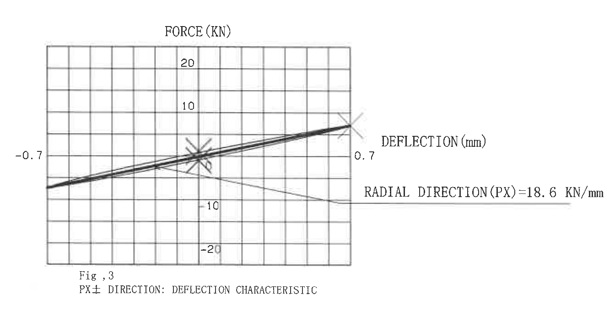

原图位置/视图名称：第 1 页中下，Fig.3 PX± DIRECTION: DEFLECTION CHARACTERISTIC，bbox `[1420, 1800, 2740, 2480]`。

| 提取项 | 原图数值或文本 | 含义说明 |
|---|---|---|
| 图名 | Fig, 3 / PX± DIRECTION: DEFLECTION CHARACTERISTIC | PX 正负方向挠度特性曲线。 |
| 纵轴 | FORCE (KN) | 力，单位 kN。 |
| 纵轴刻度 | 20、10、-10、-20 | 力方向正负刻度。 |
| 横轴 | DEFLECTION (mm) | 挠度/位移，单位 mm。 |
| 横轴端点 | -0.7、0.7 | 计算/读数范围端点，与 NOTES 中 ±0.7mm 一致。 |
| 性能值 | RADIAL DIRECTION(PX)=18.6 KN/mm | PX 径向静刚度，单位 kN/mm。 |
| 参考关系 | 参见 NOTES 6.1(1) | 技术要求中同值写为径向(PX)：18.6 kN/mm。 |

边界归属说明：裁切完整包含 Fig.3 曲线、坐标轴、标题、端点和右侧刚度说明；下方 Fig.4 的 TORQUE 曲线未纳入本对象。

## object_9 - Fig.4 扭转方向力矩-角度特性曲线

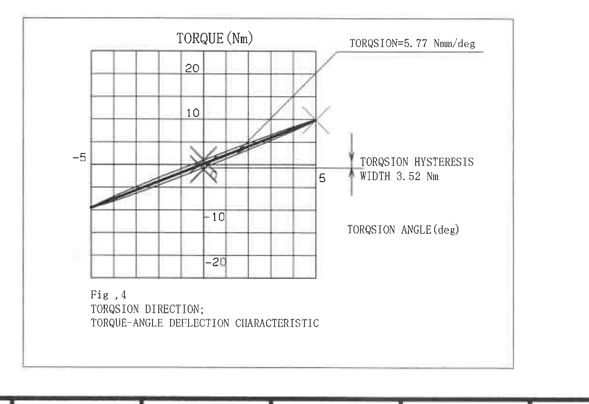

原图位置/视图名称：第 1 页下中，Fig.4 TORSION DIRECTION: TORQUE-ANGLE DEFLECTION CHARACTERISTIC，bbox `[1220, 2500, 2460, 3350]`。

| 提取项 | 原图数值或文本 | 含义说明 |
|---|---|---|
| 图名 | Fig, 4 / TORSION DIRECTION: TORQUE-ANGLE DEFLECTION CHARACTERISTIC | 扭转方向力矩-角度挠度特性曲线。 |
| 纵轴 | TORQUE (Nm) | 扭矩，单位 Nm。 |
| 纵轴刻度 | 20、10、-10、-20 | 扭矩方向正负刻度。 |
| 横轴 | TORSION ANGLE (deg) | 扭转角度，单位度。 |
| 横轴端点 | -5、5 | 扭转角计算/读数范围端点。 |
| 斜率标注 | TORSION=5.77 Nm/deg | 扭转刚度/斜率；NOTES 中同值为 5.77 Nm/deg（参考值）。 |
| 迟滞宽度 | TORSION HYSTERESIS WIDTH 3.52 Nm | 扭转迟滞宽度；NOTES 中同值为 3.52 Nm（参考值，0°时）。 |

边界归属说明：裁切完整包含 Fig.4 曲线、边框、坐标轴和右侧说明；未提取标题栏或 BOM 的内容。

## object_10 - 技术要求 / NOTES

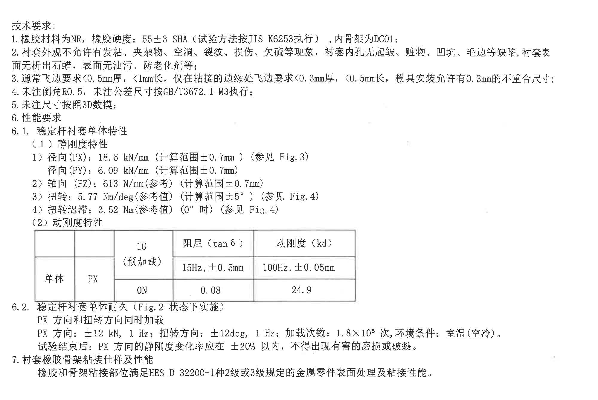

原图位置/视图名称：第 1 页右上至右中，技术要求文字区域，bbox `[2750, 520, 4750, 1860]`。

| 提取项 | 原图数值或文本 | 含义说明 |
|---|---|---|
| 标题 | 技术要求: | 技术说明区标题。 |
| 1 | 橡胶材料为NR，橡胶硬度：55±3 SHA（试验方法按JIS K6253执行），内骨架为DC01； | 材料、硬度、试验方法和内骨架材料要求。 |
| 2 | 衬套外观不允许有发粘、夹杂物、空洞、裂纹、损伤、欠硫等现象，衬套内孔无起皱、脏物、凹坑、毛边等缺陷，衬套表面无析出石蜡，表面无油污、防老化剂等； | 外观和缺陷限制。 |
| 3 | 通常飞边要求<0.5mm厚，<1mm长，仅在粘接的边缘处飞边要求<0.3mm厚，<0.5mm长，模具安装允许有0.3mm的不重合尺寸； | 飞边厚度、长度和模具安装不重合允许量。 |
| 4 | 未注倒角R0.5，未注公差尺寸按GB/T3672.1-M3执行； | 未注倒角和未注公差标准。 |
| 5 | 未注尺寸按照3D数模； | 未标注尺寸以 3D 数模为准。 |
| 6 | 性能要求 | 性能要求总项。 |
| 6.1 | 稳定杆衬套单体特性 | 单体特性要求。 |
| 6.1(1) | 静刚度特性 | 静刚度分类。 |
| 6.1(1)-1 | 径向(PX)：18.6 kN/mm（计算范围±0.7mm）（参见 Fig.3）；径向(PY)：6.09 kN/mm（计算范围±0.7mm） | PX、PY 径向静刚度，PX 关联 Fig.3。 |
| 6.1(1)-2 | 轴向(PZ)：613 N/mm(参考)（计算范围±0.7mm） | PZ 轴向刚度，参考值。 |
| 6.1(1)-3 | 扭转：5.77 Nm/deg(参考值)（计算范围±5°）（参见 Fig.4） | 扭转刚度参考值，关联 Fig.4。 |
| 6.1(1)-4 | 扭转迟滞：3.52 Nm(参考值)（0°时）（参见 Fig.4） | 0°时扭转迟滞参考值，关联 Fig.4。 |
| 6.1(2) | 动刚度特性 | 动刚度表见 object_11。 |
| 6.2 | 稳定杆衬套单体耐久（Fig.2 状态下实施） | 耐久试验条件，关联 Fig.2/object_13。 |
| 6.2 条件 | PX 方向和扭转方向同时加载；PX 方向：±12 kN，1 Hz；扭转方向：±12deg，1 Hz；加载次数：1.8×10^5 次，环境条件：室温（空冷）。 | 耐久加载方向、载荷、频率、次数和环境条件。 |
| 6.2 判定 | 试验结束后：PX 方向的静刚度变化率应在 ±20% 以内，不得出现有害的磨损或破裂。 | 耐久后判定要求。 |
| 7 | 衬套橡胶骨架粘接仕样及性能；橡胶和骨架粘接部位满足HES D 32200-1种2级或3级规定的金属零件表面处理及粘接性能。 | 粘接部位表面处理和粘接性能要求。 |

边界归属说明：object_10 包含技术要求文字区域；其中嵌入的动刚度表已另裁为 object_11 并按原表行列还原。Fig.2 图形、BOM 和标题栏均不归入本对象。

## object_11 - 动刚度特性表

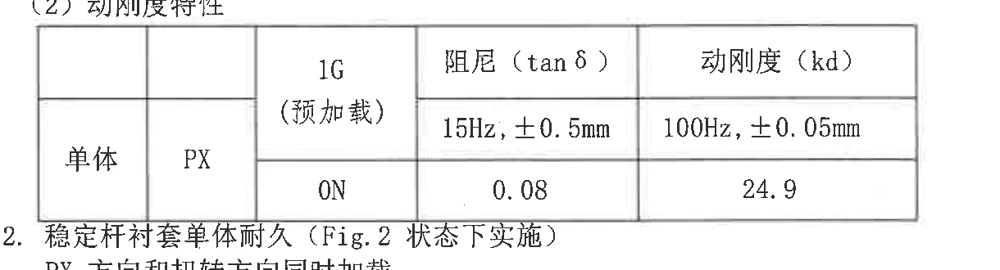

原图位置/视图名称：第 1 页右中，技术要求 6.1(2) 动刚度特性表，bbox `[2820, 1260, 4040, 1590]`。

原表还原：

| 对象 | 方向 | 1G（预加载） | 阻尼（tanδ）15Hz; ±0.5mm | 动刚度（kd）100Hz; ±0.05mm |
|---|---|---|---|---|
| 单体 | PX | ON | 0.08 | 24.9 |

| 提取项 | 原图数值或文本 | 含义说明 |
|---|---|---|
| 表题归属 | 6.1(2) 动刚度特性 | 技术要求中的动刚度性能表。 |
| 对象 | 单体 | 测试对象为稳定杆衬套单体。 |
| 方向 | PX | 测试方向为 PX。 |
| 预加载 | 1G / ON | 1G 预加载状态为 ON。 |
| 阻尼 | tanδ = 0.08，15Hz; ±0.5mm | 阻尼测试条件和值。 |
| 动刚度 | kd = 24.9，100Hz; ±0.05mm | 动刚度测试条件和值。 |

边界归属说明：裁切只覆盖动刚度表外框和单元格；上下技术要求段落属于 object_10，不作为本表格的行列内容。

## object_12 - 修订履历表

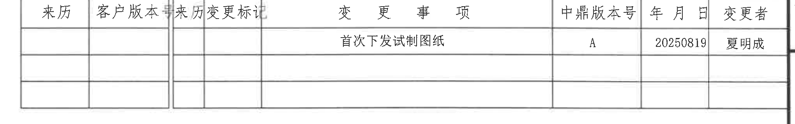

原图位置/视图名称：第 1 页右上，修订/变更履历表，bbox `[2750, 190, 4790, 510]`。

原表还原：

| 来历 | 客户版本号 | 来历变更标记 | 变更事项 | 中鼎版本号 | 年月日 | 变更者 |
|---|---|---|---|---|---|---|
|  |  |  | 首次下发试制图纸 | A | 20250819 | 夏明成 |
|  |  |  |  |  |  |  |
|  |  |  |  |  |  |  |

| 提取项 | 原图数值或文本 | 含义说明 |
|---|---|---|
| 表头 | 来历 / 客户版本号 / 来历变更标记 / 变更事项 / 中鼎版本号 / 年月日 / 变更者 | 修订履历列名。 |
| 修订记录 | 首次下发试制图纸 | 变更事项说明。 |
| 中鼎版本号 | A | 当前中鼎版本号。 |
| 年月日 | 20250819 | 修订日期。 |
| 变更者 | 夏明成 | 修订/变更人员。 |

边界归属说明：裁切已去除上方图框坐标数字，仅包含修订履历表；技术要求文字不属于本对象。

## object_13 - Fig.2 试验状态/局部说明图

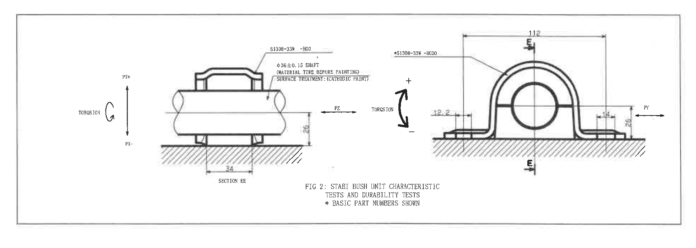

原图位置/视图名称：第 1 页右下偏中，FIG 2: STABI BUSH UNIT CHARACTERISTIC TESTS AND DURABILITY TESTS，bbox `[2770, 1835, 4730, 2535]`。

| 提取项 | 原图数值或文本 | 含义说明 |
|---|---|---|
| 图名 | FIG 2: STABI BUSH UNIT CHARACTERISTIC TESTS AND DURABILITY TESTS | 稳定杆衬套单体特性与耐久试验状态图。 |
| 注记 | * BASIC PART NUMBERS SHOWN | 带星号的基础件号说明。 |
| 左侧件号 | 51308-33W -H00 | 左侧试验/基础件号标注。 |
| 右侧件号 | *51308-33W-HC00 | 右侧带星号基础件号。 |
| 直径尺寸 | φ36±0.15 SHAFT | 轴/管材外径尺寸，带 ±0.15 公差。 |
| 材料/表面处理 | MATERIAL TUBE BEFORE PAINTING; SURFACE TREATMENT: (CATHODIC PAINT) | 试验用管材和阴极电泳/阴极涂装表面处理说明。 |
| 方向标识 | PX+、PX- | 左侧竖向径向加载方向。 |
| 方向标识 | PZ | 左图水平轴向方向。 |
| 方向标识 | PY | 右图水平径向方向。 |
| 扭转标识 | TORSION | 左右图均有扭转方向箭头。 |
| 剖面标识 | SECTION EE、E/E | 试验状态图的剖切/中心线标识。 |
| 横向尺寸 | 84 | 左图支承/接触区水平尺寸。 |
| 竖向尺寸 | 26 | 左图和右图中出现的竖向高度尺寸。 |
| 横向尺寸 | 112 | 右图顶部总宽尺寸。 |
| 横向尺寸 | 12.2 | 右图左侧局部水平尺寸。 |
| 横向尺寸 | 13 | 右图右侧局部水平尺寸。 |
| T 编号 | 未见 | Fig.2 中未见 T 编号。 |

边界归属说明：裁切包含 Fig.2 框内左右两个试验状态图、尺寸和注记；右侧外图框坐标字母已排除，BOM 与标题栏不属于本对象。

## object_14 - 明细/BOM 表

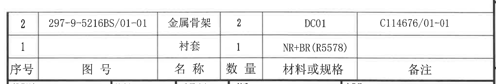

原图位置/视图名称：第 1 页右下，明细/BOM 表，bbox `[2750, 2510, 4790, 2860]`。

原表还原：

| 序号 | 图号 | 名称 | 数量 | 材料或规格 | 备注 |
|---|---|---|---|---|---|
| 2 | 297-9-5216BS/01-01 | 金属骨架 | 2 | DC01 | C114676/01-01 |
| 1 |  | 衬套 | 1 | NR+BR(R5578) |  |

| 提取项 | 原图数值或文本 | 含义说明 |
|---|---|---|
| 表头 | 序号 / 图号 / 名称 / 数量 / 材料或规格 / 备注 | 明细表列名。 |
| 明细 2 | 297-9-5216BS/01-01 / 金属骨架 / 2 / DC01 / C114676/01-01 | 金属骨架零件，数量 2，材料 DC01。 |
| 明细 1 | 衬套 / 1 / NR+BR(R5578) | 衬套零件，数量 1，材料/规格 NR+BR(R5578)。 |

边界归属说明：裁切仅包含 BOM 表及表头，不包含下方标题栏的投影法、比例、材质和产品号字段。

## object_15 - 标题栏

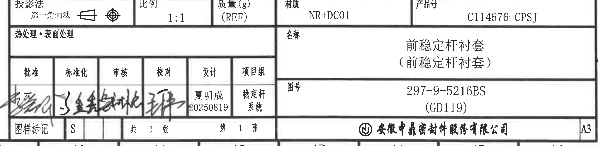

原图位置/视图名称：第 1 页右下角标题栏，bbox `[2750, 2860, 4790, 3360]`。

| 提取项 | 原图数值或文本 | 含义说明 |
|---|---|---|
| 投影法 | 第一角画法 | 标题栏投影法字段，含投影符号。 |
| 比例 | 1:1 | 图纸比例。 |
| 质量(g) | (REF) | 质量字段为参考项，未见具体数值。 |
| 材质 | NR+DC01 | 标题栏材质字段。 |
| 产品号 | C114676-CPSJ | 产品编号。 |
| 热处理・表面处理 | 空白 | 原栏位未填写具体内容。 |
| 名称 | 前稳定杆衬套（前稳定杆衬套） | 零件名称。 |
| 图号 | 297-9-5216BS (GD119) | 图纸/零件图号。 |
| 批准 | 签名 | 批准栏为手写签名。 |
| 标准化 | 签名 | 标准化栏为手写签名。 |
| 审核 | 签名 | 审核栏为手写签名。 |
| 校对 | 签名 | 校对栏为手写签名。 |
| 设计 | 夏明成 / 20250819 | 设计人员和日期。 |
| 项目组 | 稳定杆系统 | 项目组名称。 |
| 图样标记 | S | 图样标记字段。 |
| 张数 | 共 1 张 / 第 1 张 | 页数信息。 |
| 公司 | 安徽中鼎密封件股份有限公司 | 标题栏公司名称。 |
| 图幅 | A3 | 图幅规格。 |

边界归属说明：裁切从投影法/比例行开始，到公司名和 A3 图幅行结束；上方 BOM 表和下方图框坐标数字不归入标题栏。

## 裁切检查记录

| 对象 | 图片路径 | 检查结论 |
|---|---|---|
| page_1 | outputs/20C114676_assets/images/page_1.png | 整页 PNG 完整，尺寸 4959 x 3505 px。 |
| object_1 | outputs/20C114676_assets/images/object_1.png | 半圆主视图完整包含 R22.5、R30.75、R17.5±0.2、31.25、0.75、3.4、0.5、10° 和 A-A 指示；未带入下方视图文字。 |
| object_2 | outputs/20C114676_assets/images/object_2.png | A-A 剖面尺寸线、文字、剖面线、视图名和比例完整。 |
| object_3 | outputs/20C114676_assets/images/object_3.png | 中左外形视图完整包含 R1、R6.25、61.5±0.3、34±0.3、43.5；未带入下方 0.5 标注。 |
| object_4 | outputs/20C114676_assets/images/object_4.png | 半圆/B-B 指示视图完整包含 R17.5±0.2、R1、0.5、3.4、28.5±0.3 和 B-B 箭头；下方 object_6 尺寸未提取到本对象。 |
| object_5 | outputs/20C114676_assets/images/object_5.png | B-B 剖面完整包含 11.5±0.3、5、30、1.5、R2、视图名和比例。 |
| object_6 | outputs/20C114676_assets/images/object_6.png | 下左外形视图完整包含 61.5±0.3、47.3±0.3、34±0.3、43.5、R5.25、R1。 |
| object_7 | outputs/20C114676_assets/images/object_7.png | 一般公差表外框、表头和全部行完整；未带入视图内容。 |
| object_8 | outputs/20C114676_assets/images/object_8.png | Fig.3 曲线、坐标轴、端点和 RADIAL DIRECTION(PX)=18.6 KN/mm 完整；未带入 Fig.4。 |
| object_9 | outputs/20C114676_assets/images/object_9.png | Fig.4 曲线、边框、坐标轴、扭转斜率和迟滞宽度说明完整。 |
| object_10 | outputs/20C114676_assets/images/object_10.png | 技术要求文字首尾完整，表格区域在 object_11 单独裁切；未带入 Fig.2/BOM/标题栏。 |
| object_11 | outputs/20C114676_assets/images/object_11.png | 动刚度特性表外框、合并表头和数据行完整。 |
| object_12 | outputs/20C114676_assets/images/object_12.png | 修订履历表外框、表头和记录行完整；上方图框坐标已排除。 |
| object_13 | outputs/20C114676_assets/images/object_13.png | Fig.2 左右试验状态图、尺寸线、方向箭头和说明文字完整；右侧图框坐标已排除。 |
| object_14 | outputs/20C114676_assets/images/object_14.png | BOM 表头和两行明细完整；未带入标题栏字段。 |
| object_15 | outputs/20C114676_assets/images/object_15.png | 标题栏主要字段、签字栏、公司名和 A3 图幅完整；未带入 BOM 表和底部坐标数字。 |
