# 20C114683 内容识别

## 整页渲染

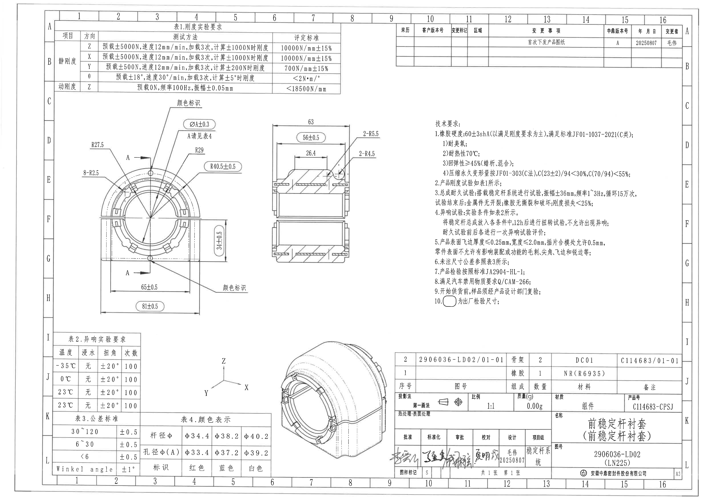

| 提取项 | 原图数值或文本 | 含义说明 |
|---|---|---|
| 页面 | A3 横向，1 页 | PDF 已先渲染为整页 PNG，再按对象裁切。 |
| 整页图片 | outputs/20C114683_assets/images/page_1.png | 后续所有 bbox 均基于该 PNG 的像素坐标。 |
| 特殊标注 | 圆角矩形框尺寸 | 按技术要求第 10 条，表示出厂检验尺寸。 |
| 参考尺寸/T 编号 | 未见加工视图内括号参考尺寸；未见 T 编号；未见星号关键尺寸 | 图中有括号文本如 NR(R6935)、(LN225)、C(23±2)/94，属于材料牌号、图号/平台代号或试验条件，不是加工视图参考尺寸。 |

边界归属说明：整页图仅用于定位；尺寸、文字和表格归属以各对象裁切图及其说明为准。

## object_4：表1.刚度实验要求

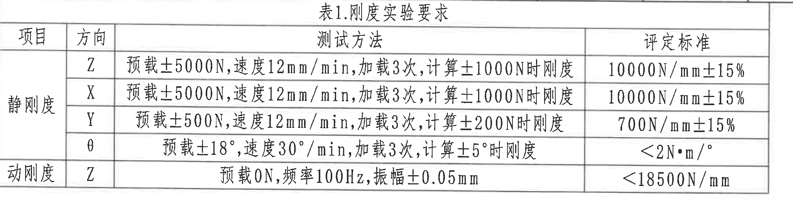

原图位置/视图名称：页面左上，表1.刚度实验要求。

原表还原：

| 项目 | 方向 | 测试方法 | 评定标准 |
|---|---|---|---|
| 静刚度 | Z | 预载±5000N, 速度12mm/min, 加载3次, 计算±1000N时刚度 | 10000N/mm±15% |
| 静刚度 | X | 预载±5000N, 速度12mm/min, 加载3次, 计算±1000N时刚度 | 10000N/mm±15% |
| 静刚度 | Y | 预载±500N, 速度12mm/min, 加载3次, 计算±200N时刚度 | 700N/mm±15% |
| 静刚度 | θ | 预载±18°, 速度30°/min, 加载3次, 计算±5°时刚度 | <2N·m/° |
| 动刚度 | Z | 预载0N, 频率100Hz, 振幅±0.05mm | <18500N/mm |

提取表格：

| 提取项 | 原图数值或文本 | 含义说明 |
|---|---|---|
| 表题 | 表1.刚度实验要求 | 产品刚度试验要求，技术要求第2条引用该表。 |
| 静刚度 Z | 10000N/mm±15% | Z 向静刚度评定标准；加载条件为预载±5000N、速度12mm/min、加载3次、计算±1000N时刚度。 |
| 静刚度 X | 10000N/mm±15% | X 向静刚度评定标准；加载条件同 Z 向。 |
| 静刚度 Y | 700N/mm±15% | Y 向静刚度评定标准；加载条件为预载±500N、速度12mm/min、加载3次、计算±200N时刚度。 |
| 静刚度 θ | <2N·m/° | 扭转静刚度评定标准；角度条件为预载±18°、速度30°/min、加载3次、计算±5°时刚度。 |
| 动刚度 Z | <18500N/mm | Z 向动刚度评定标准；条件为预载0N、频率100Hz、振幅±0.05mm。 |

边界归属说明：裁切区域只包含表1外框和全部表格文字；底部“动刚度 Z”行完整，未并入主视图或其他表格。

## object_5：右上变更履历表

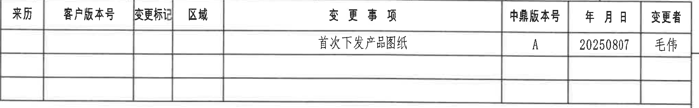

原图位置/视图名称：页面右上，变更履历/修订栏。

原表还原：

| 来历 | 客户版本号 | 变更标记 | 区域 | 变更事项 | 中鼎版本号 | 年月日 | 变更者 |
|---|---|---|---|---|---|---|---|
|  |  |  |  | 首次下发产品图纸 | A | 20250807 | 毛伟 |
|  |  |  |  |  |  |  |  |
|  |  |  |  |  |  |  |  |

提取表格：

| 提取项 | 原图数值或文本 | 含义说明 |
|---|---|---|
| 变更事项 | 首次下发产品图纸 | 本次记录为首次发放产品图纸。 |
| 中鼎版本号 | A | 中鼎内部版本号。 |
| 年月日 | 20250807 | 变更日期，格式为 YYYYMMDD。 |
| 变更者 | 毛伟 | 变更责任人。 |
| 空白字段 | 来历、客户版本号、变更标记、区域 | 原表对应单元格为空。 |

边界归属说明：裁切区域保留完整修订表表头、记录和空白行；右侧图框坐标 A/B 未作为表格内容提取。

## object_1：左侧正视加工视图

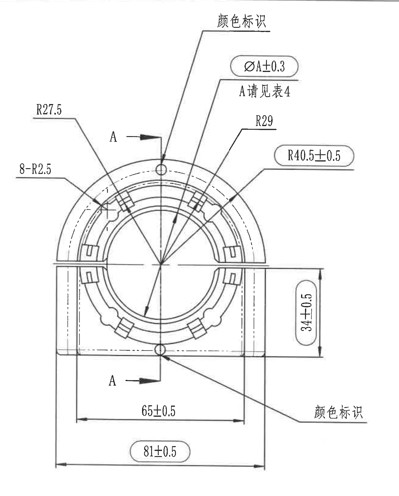

原图位置/视图名称：页面左中，零件正视加工视图，含 A-A 剖切位置标识。

提取表格：

| 提取项 | 原图数值或文本 | 含义说明 |
|---|---|---|
| 直径变量 | ØA±0.3 | 直径符号 Ø；A 为变量孔径，公差 ±0.3；圆角矩形框表示出厂检验尺寸，A 的具体值见表4。 |
| 表引用 | A请见表4 | 说明 ØA 的孔径值由颜色/杆径组合在表4中确定。 |
| 半径 | R27.5 | 左上外侧圆弧半径标注，归属正视图上半圆轮廓。 |
| 数量半径 | 8-R2.5 | 数量前缀 8，表示 8 处 R2.5 小圆角/圆弧。 |
| 半径 | R29 | 内侧圆弧半径标注。 |
| 出厂检验半径 | R40.5±0.5 | 右上外侧圆弧半径，公差 ±0.5；圆角矩形框表示出厂检验尺寸。 |
| 垂直尺寸 | 34±0.5 | 右侧垂直方向尺寸，公差 ±0.5；圆角矩形框表示出厂检验尺寸。 |
| 水平尺寸 | 65±0.5 | 下方内侧水平尺寸，公差 ±0.5。 |
| 总宽尺寸 | 81±0.5 | 下方外侧总宽尺寸，公差 ±0.5；圆角矩形框表示出厂检验尺寸。 |
| 颜色标识 | 颜色标识（上方、右下方各一处） | 指示零件颜色标识位置；颜色对应关系见表4。 |
| 剖切标识 | A、A（两处箭头） | 指示 A-A 剖面视图的剖切位置和视向；该字母不是尺寸值，剖面尺寸归 object_2。 |
| 参考尺寸/T 编号 | 未见括号参考尺寸；未见 T 编号 | 本视图内未发现用括号表示的参考尺寸，也未发现 T 编号。 |

边界归属说明：R27.5、8-R2.5、R29、R40.5±0.5、ØA±0.3、34±0.5、65±0.5、81±0.5 的文字、箭头、引线和尺寸线均在裁切内。A-A 剖面的实体和尺寸未并入本对象；下方表2未混入本对象。

## object_2：A-A 剖面视图

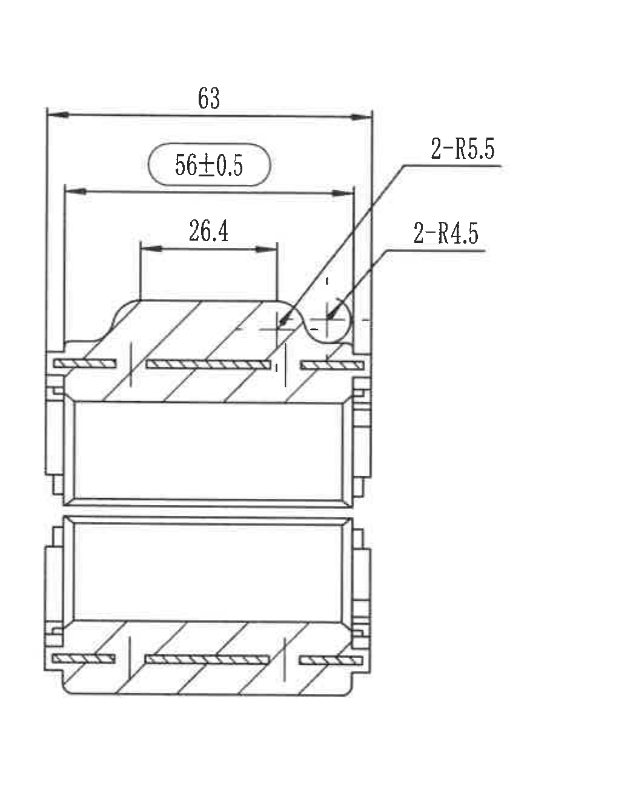

原图位置/视图名称：页面上中，A-A 剖面视图。

提取表格：

| 提取项 | 原图数值或文本 | 含义说明 |
|---|---|---|
| 总宽尺寸 | 63 | 剖面上方外侧水平总宽尺寸。 |
| 出厂检验水平尺寸 | 56±0.5 | 剖面上方内侧水平尺寸，公差 ±0.5；圆角矩形框表示出厂检验尺寸。 |
| 局部水平尺寸 | 26.4 | 上部局部结构宽度。 |
| 数量半径 | 2-R5.5 | 数量前缀 2，表示 2 处 R5.5 圆角/圆弧。 |
| 数量半径 | 2-R4.5 | 数量前缀 2，表示 2 处 R4.5 圆角/圆弧。 |
| 剖面线 | 斜线剖面填充 | 表示被剖切材料区域。 |
| 参考尺寸/T 编号 | 未见括号参考尺寸；未见 T 编号 | 本剖面视图内未发现括号参考尺寸或 T 编号。 |

边界归属说明：顶部 63、56±0.5、26.4 及右侧 2-R5.5、2-R4.5 的尺寸线、箭头、引线和文字均完整；该对象不包含正视图尺寸或右侧技术要求文字。

## object_6：技术要求 / NOTES

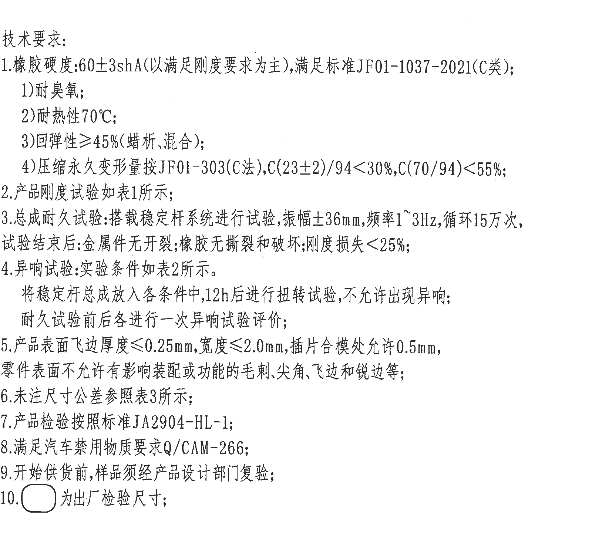

原图位置/视图名称：页面右中，技术要求文本区。

原文还原：

```text
技术要求:
1.橡胶硬度:60±3shA(以满足刚度要求为主),满足标准JF01-1037-2021(C类);
  1)耐臭氧;
  2)耐热性70℃;
  3)回弹性≥45%(蜡析、混合);
  4)压缩永久变形量按JF01-303(C法),C(23±2)/94<30%,C(70/94)<55%;
2.产品刚度试验如表1所示;
3.总成耐久试验:搭载稳定杆系统进行试验,振幅±36mm,频率1~3Hz,循环15万次,
  试验结束后:金属件无开裂;橡胶无撕裂和破坏;刚度损失<25%;
4.异响试验:实验条件如表2所示。
  将稳定杆总成放入各条件中,12h后进行扭转试验,不允许出现异响;
  耐久试验前后各进行一次异响试验评价;
5.产品表面飞边厚度≤0.25mm,宽度≤2.0mm,插件合模处允许0.5mm,
  零件表面不允许有影响装配或功能的毛刺,尖角,飞边和锐边等;
6.未注尺寸公差参照表3所示;
7.产品检验按照标准JA2904-HL-1;
8.满足汽车禁用物质要求Q/CAM-266;
9.开始供货前,样品须经产品设计部门复验;
10.圆角矩形框 为出厂检验尺寸;
```

提取表格：

| 提取项 | 原图数值或文本 | 含义说明 |
|---|---|---|
| 橡胶硬度 | 60±3shA | 橡胶硬度要求，且以满足刚度要求为主。 |
| 标准 | JF01-1037-2021(C类) | 硬度/材料相关满足标准。 |
| 耐热性 | 70℃ | 橡胶耐热性要求。 |
| 回弹性 | ≥45%(蜡析、混合) | 回弹性指标。 |
| 压缩永久变形 | C(23±2)/94<30%, C(70/94)<55% | 括号内为试验条件，不是视图参考尺寸。 |
| 耐久试验 | 振幅±36mm, 频率1~3Hz, 循环15万次 | 总成耐久试验条件。 |
| 刚度损失 | <25% | 耐久后允许刚度损失上限。 |
| 异响试验 | 表2；12h后进行扭转试验 | 异响试验条件引用表2。 |
| 飞边厚度 | ≤0.25mm | 产品表面飞边厚度上限。 |
| 飞边宽度 | ≤2.0mm | 产品表面飞边宽度上限。 |
| 插件合模处 | 允许0.5mm | 插件合模处允许值。 |
| 未注尺寸公差 | 参照表3 | 未注尺寸公差来源。 |
| 检验标准 | JA2904-HL-1 | 产品检验标准。 |
| 禁用物质要求 | Q/CAM-266 | 汽车禁用物质要求。 |
| 出厂检验尺寸 | 圆角矩形框 | 说明视图中圆角矩形框内尺寸的性质。 |

边界归属说明：技术要求文字从标题到第10条完整；右侧图框坐标列已排除，不作为 NOTES 内容提取。

## object_7：表2.异响实验要求

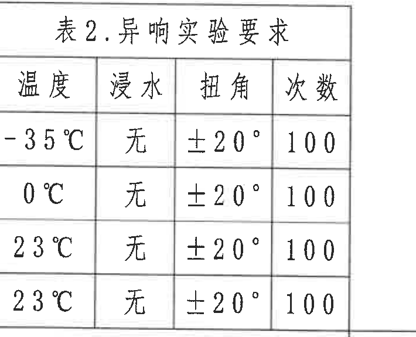

原图位置/视图名称：页面左下，表2.异响实验要求。

原表还原：

| 温度 | 浸水 | 扭角 | 次数 |
|---|---|---|---|
| -35℃ | 无 | ±20° | 100 |
| 0℃ | 无 | ±20° | 100 |
| 23℃ | 无 | ±20° | 100 |
| 23℃ | 无 | ±20° | 100 |

提取表格：

| 提取项 | 原图数值或文本 | 含义说明 |
|---|---|---|
| 表题 | 表2.异响实验要求 | 技术要求第4条引用。 |
| 温度条件 | -35℃、0℃、23℃、23℃ | 原表列出四组试验温度，其中 23℃ 出现两行。 |
| 浸水 | 无 | 四组条件均为不浸水。 |
| 扭角 | ±20° | 四组条件扭角相同。 |
| 次数 | 100 | 四组条件次数相同。 |

边界归属说明：裁切区域包含表2标题、表头和四条数据；下方表3标题未纳入本对象。

## object_11：轴测方向坐标标识

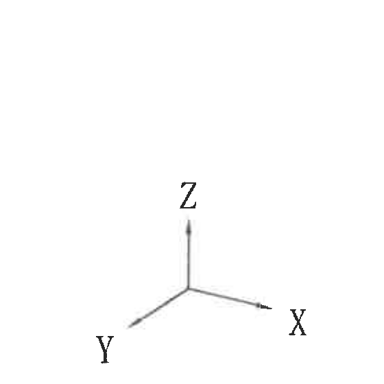

原图位置/视图名称：页面下中偏左，轴测图方向坐标标识。

提取表格：

| 提取项 | 原图数值或文本 | 含义说明 |
|---|---|---|
| 坐标方向 | X | 轴测图 X 方向。 |
| 坐标方向 | Y | 轴测图 Y 方向。 |
| 坐标方向 | Z | 轴测图 Z 方向。 |
| 尺寸 | 无尺寸标注 | 该局部对象只表达轴测方向，不承载加工尺寸。 |

边界归属说明：裁切区域仅包含 X/Y/Z 三叉坐标标识；未带入上方 A-A 剖面尺寸线或下方表格。

## object_3：轴测外形视图

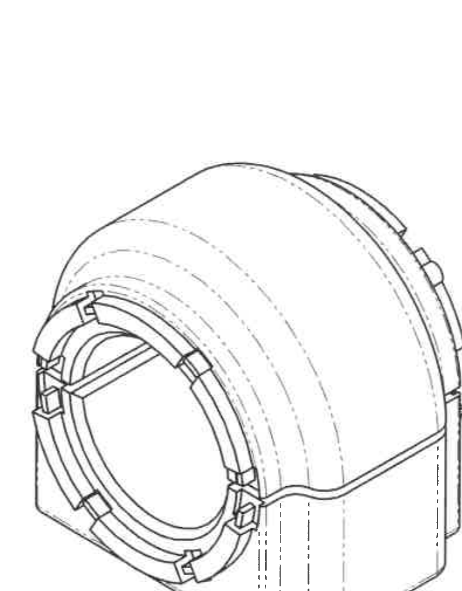

原图位置/视图名称：页面下中，零件轴测外形视图。

提取表格：

| 提取项 | 原图数值或文本 | 含义说明 |
|---|---|---|
| 外形 | 轴测零件主体 | 显示前稳定杆衬套的三维外形、开口、槽、凸台、圆弧外轮廓和隐藏线。 |
| 尺寸 | 无尺寸文字 | 该轴测图不包含独立尺寸、公差、半径、角度或 T 编号。 |
| 坐标方向 | 见 object_11 | X/Y/Z 坐标方向标识因与表格邻近，单独裁切为 object_11。 |

边界归属说明：裁切区域只保留轴测零件主体；左侧表4和右侧标题栏/明细栏内容未作为本对象提取。

## object_8：表3.公差标准

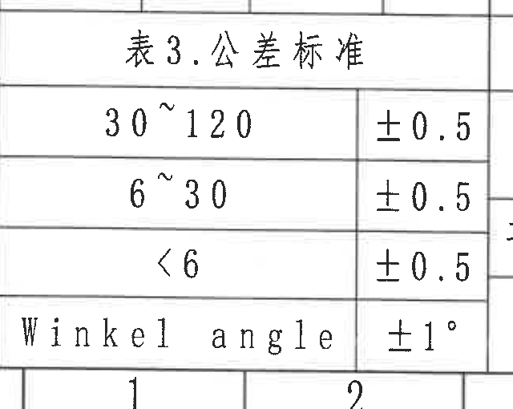

原图位置/视图名称：页面左下，表3.公差标准。

原表还原：

| 尺寸范围/项目 | 公差 |
|---|---|
| 30~120 | ±0.5 |
| 6~30 | ±0.5 |
| <6 | ±0.5 |
| Winkel angle | ±1° |

提取表格：

| 提取项 | 原图数值或文本 | 含义说明 |
|---|---|---|
| 表题 | 表3.公差标准 | 技术要求第6条引用，用于未注尺寸公差。 |
| 线性尺寸范围 | 30~120、6~30、<6 | 三个线性尺寸范围。 |
| 线性公差 | ±0.5 | 三个线性范围均采用 ±0.5。 |
| 角度公差 | Winkel angle ±1° | 未注角度公差。 |

边界归属说明：表3右侧与表4相邻，裁切保留相邻分隔线但未提取表4文字；底部英文 “Winkel angle” 和 “±1°” 完整。

## object_9：表4.颜色表示

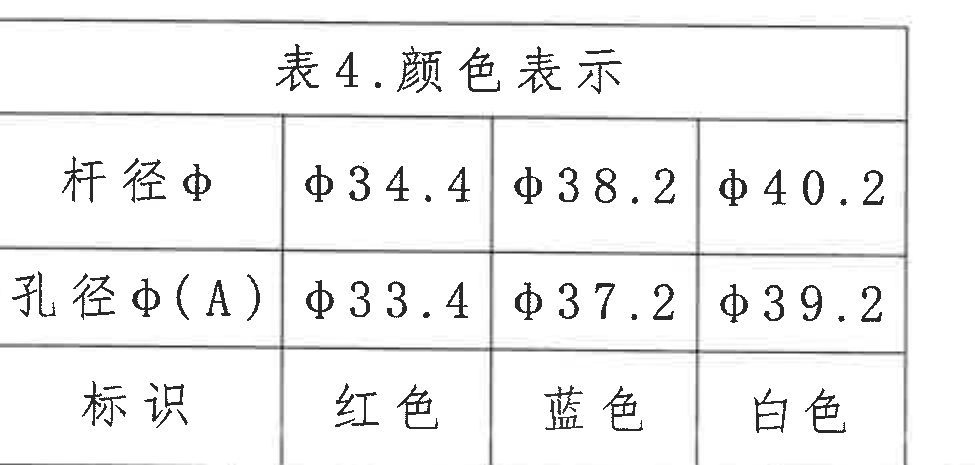

原图位置/视图名称：页面左下偏中，表4.颜色表示。

原表还原：

| 项目 | 选项1 | 选项2 | 选项3 |
|---|---|---|---|
| 杆径φ | φ34.4 | φ38.2 | φ40.2 |
| 孔径φ(A) | φ33.4 | φ37.2 | φ39.2 |
| 标识 | 红色 | 蓝色 | 白色 |

提取表格：

| 提取项 | 原图数值或文本 | 含义说明 |
|---|---|---|
| 表题 | 表4.颜色表示 | 主视图中 “A请见表4” 和 “颜色标识” 引用该表。 |
| 杆径φ | φ34.4 / φ38.2 / φ40.2 | 三种杆径规格。 |
| 孔径φ(A) | φ33.4 / φ37.2 / φ39.2 | ØA 的三种对应孔径。 |
| 标识 | 红色 / 蓝色 / 白色 | 颜色标识与对应杆径、孔径组合。 |
| 组合1 | 杆径φ34.4，孔径φ(A)33.4，红色 | 红色标识组合。 |
| 组合2 | 杆径φ38.2，孔径φ(A)37.2，蓝色 | 蓝色标识组合。 |
| 组合3 | 杆径φ40.2，孔径φ(A)39.2，白色 | 白色标识组合。 |

边界归属说明：裁切区域包含表4标题、三行项目和三列规格；未带入轴测图轮廓作为表格内容。

## object_10：标题栏、明细栏和签审栏

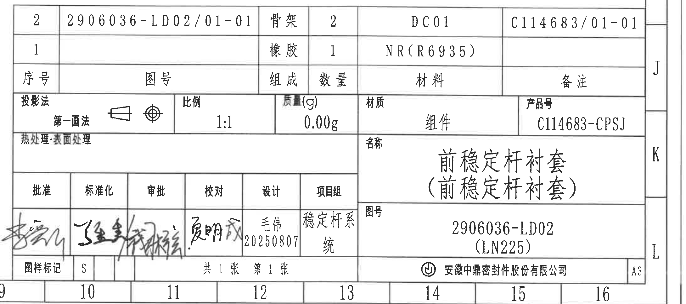

原图位置/视图名称：页面右下，标题栏、明细栏、签审栏。

明细栏原表还原：

| 序号 | 图号 | 组成 | 数量 | 材料 | 备注 |
|---|---|---|---|---|---|
| 2 | 2906036-LD02/01-01 | 骨架 | 2 | DC01 | C114683/01-01 |
| 1 |  | 橡胶 | 1 | NR(R6935) |  |

标题栏字段还原：

| 提取项 | 原图数值或文本 | 含义说明 |
|---|---|---|
| 投影法 | 第一画法 | 标题栏投影法字段。 |
| 比例 | 1:1 | 图纸比例。 |
| 质量(g) | 0.00g | 图样质量字段。 |
| 材质 | 组件 | 材质字段。 |
| 产品号 | C114683-CPSJ | 产品号。 |
| 热处理/表面处理 | 空白 | 原图该栏未填写值。 |
| 名称 | 前稳定杆衬套（前稳定杆衬套） | 零件/组件名称，括号内为原图重复名称文本。 |
| 图号 | 2906036-LD02 (LN225) | 图号与括号内平台/项目代号。 |
| 图样标记 | S | 图样标记字段。 |
| 张数 | 共1张 第1张 | 图纸张数和当前页。 |
| 幅面 | A3 | 图幅规格。 |
| 公司 | 安徽中鼎密封件股份有限公司 | 标题栏公司名称。 |

签审栏原表还原：

| 批准 | 标准化 | 审批 | 校对 | 设计 | 项目组 |
|---|---|---|---|---|---|
| 手写签名，扫描件难以可靠辨识 | 手写签名，扫描件难以可靠辨识 | 手写签名，扫描件难以可靠辨识 | 手写签名，扫描件难以可靠辨识 | 毛伟 20250807 | 稳定杆系统 |

提取表格：

| 提取项 | 原图数值或文本 | 含义说明 |
|---|---|---|
| 明细序号2 | 图号2906036-LD02/01-01；组成骨架；数量2；材料DC01；备注C114683/01-01 | 组件明细中的骨架记录。 |
| 明细序号1 | 组成橡胶；数量1；材料NR(R6935) | 组件明细中的橡胶记录，图号和备注为空。 |
| 产品号 | C114683-CPSJ | 标题栏产品号。 |
| 图号 | 2906036-LD02 (LN225) | 标题栏图号，括号内为原图括号文本。 |
| 设计 | 毛伟 20250807 | 设计责任人和日期。 |
| 项目组 | 稳定杆系统 | 项目组字段。 |

边界归属说明：标题栏与外侧图框坐标贴近，裁切保留完整标题栏、明细栏、签审栏和 A3 幅面字段；底部和右侧图框坐标不作为标题栏字段提取。

## 裁切检查记录

| 对象 | 文件 | bbox | 检查结果 | 重裁/边界记录 |
|---|---|---|---|---|
| page_1 | outputs/20C114683_assets/images/page_1.png | [0,0,4959,3505] | 整页完整 | 作为所有裁切对象的来源图。 |
| object_1 | outputs/20C114683_assets/images/object_1.png | [520,650,1840,2290] | 完整包含正视图尺寸线、箭头、引线和文字 | 未带入表2或 A-A 剖面实体；剖切标识 A-A 保留在主视图内。 |
| object_2 | outputs/20C114683_assets/images/object_2.png | [1830,690,2880,2010] | 完整包含 63、56±0.5、26.4、2-R5.5、2-R4.5 | 未混入技术要求或主视图尺寸。 |
| object_3 | outputs/20C114683_assets/images/object_3.png | [1910,2110,2700,3120] | 轴测主体完整，无尺寸文字 | 为避免表4/标题栏片段混入，坐标标识单独裁切为 object_11。 |
| object_4 | outputs/20C114683_assets/images/object_4.png | [390,155,2445,690] | 表1标题、表头和全部 5 条数据完整 | 首次候选截掉动刚度行，已重裁。 |
| object_5 | outputs/20C114683_assets/images/object_5.png | [2770,170,4795,485] | 变更表表头、记录和空白行完整 | 初次候选截到图框坐标，已收紧右边界。 |
| object_6 | outputs/20C114683_assets/images/object_6.png | [3040,760,4640,2220] | 技术要求第1至第10条完整 | 初次候选带入右侧图框并截断第10条，已重裁。 |
| object_7 | outputs/20C114683_assets/images/object_7.png | [385,2320,1095,2895] | 表2标题、表头和四条数据完整 | 已去除下方表3标题。 |
| object_8 | outputs/20C114683_assets/images/object_8.png | [370,2865,1010,3375] | 表3标题、三条线性公差和角度公差完整 | 右边界为与表4的相邻分隔线，未提取表4文字。 |
| object_9 | outputs/20C114683_assets/images/object_9.png | [990,2865,1965,3330] | 表4标题、三行项目和三列规格完整 | 初次候选截断左/右列并带入轴测图，已重裁。 |
| object_10 | outputs/20C114683_assets/images/object_10.png | [2720,2450,4900,3420] | 标题栏、明细栏、签审栏、A3 字段完整 | 因标题栏贴近图框，保留外框邻近线；图框坐标不提取为标题栏字段。 |
| object_11 | outputs/20C114683_assets/images/object_11.png | [1290,2240,1850,2800] | X/Y/Z 坐标标识完整 | 初次候选带入上方尺寸线，已重裁为独立坐标标识。 |
