# 20C114684 PDF 内容识别

整页渲染图：`20C114684_assets/images/page_1.png`。以下 bbox 均按整页 PNG 像素坐标记录，格式为 `[x, y, width, height]`。

## object_1 表 1.刚度试验要求

原图位置/视图名称：第 1 页，表 1.刚度试验要求，bbox `[350, 140, 2280, 700]`。

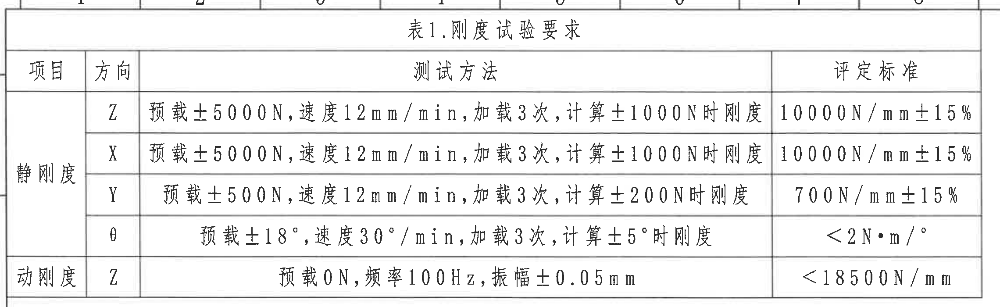

原表还原：

| 项目 | 方向 | 测试方法 | 评定标准 |
|---|---|---|---|
| 静刚度 | Z | 预载±5000N,速度12mm/min,加载3次,计算±1000N时刚度 | 10000N/mm±15% |
| 静刚度 | X | 预载±5000N,速度12mm/min,加载3次,计算±1000N时刚度 | 10000N/mm±15% |
| 静刚度 | Y | 预载±500N,速度12mm/min,加载3次,计算±200N时刚度 | 700N/mm±15% |
| 静刚度 | θ | 预载±18°,速度30°/min,加载3次,计算±5°时刚度 | <2N·m/° |
| 动刚度 | Z | 预载0N,频率100Hz,振幅±0.05mm | <18500N/mm |

提取表格：

| 提取项 | 原图数值或文本 | 含义说明 |
|---|---|---|
| 表名 | 表1.刚度试验要求 | 产品刚度试验的测试方法和判定标准，技术要求第 2 条引用本表。 |
| 静刚度 Z/X | 预载±5000N,速度12mm/min,加载3次,计算±1000N时刚度；10000N/mm±15% | Z、X 两个方向采用相同加载条件和刚度判定范围。 |
| 静刚度 Y | 预载±500N,速度12mm/min,加载3次,计算±200N时刚度；700N/mm±15% | Y 方向静刚度测试载荷和计算载荷低于 Z/X。 |
| 静刚度 θ | 预载±18°,速度30°/min,加载3次,计算±5°时刚度；<2N·m/° | 旋转方向刚度，以角度加载和扭矩/角度单位评定。 |
| 动刚度 Z | 预载0N,频率100Hz,振幅±0.05mm；<18500N/mm | Z 方向动态刚度要求。 |

边界归属说明：裁切包含表 1 的完整表头、静刚度四行、动刚度一行和外框；顶部仅带入图框分区数字的极小边缘，不作为表格内容提取。

## object_2 修订履历表

原图位置/视图名称：第 1 页，右上修订履历表，bbox `[2780, 190, 2040, 310]`。

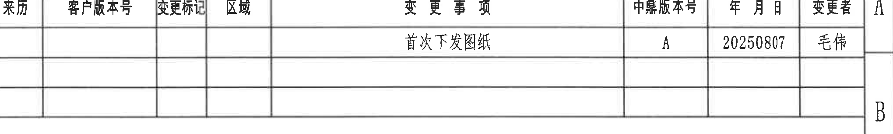

原表还原：

| 来历 | 客户版本号 | 变更标记 | 区域 | 变更事项 | 中鼎版本号 | 年月日 | 变更者 |
|---|---|---|---|---|---|---|---|
|  |  |  |  | 首次下发图纸 | A | 20250807 | 毛伟 |
|  |  |  |  |  |  |  |  |
|  |  |  |  |  |  |  |  |

提取表格：

| 提取项 | 原图数值或文本 | 含义说明 |
|---|---|---|
| 变更事项 | 首次下发图纸 | 当前记录为首次发布图纸。 |
| 中鼎版本号 | A | 中鼎内部版本为 A。 |
| 年月日 | 20250807 | 修订/发布日期。 |
| 变更者 | 毛伟 | 修订记录中的变更人。 |
| 空白字段 | 来历、客户版本号、变更标记、区域为空 | 原表对应字段未填写，未补写。 |

边界归属说明：裁切包含修订表完整外框和三行记录区；右侧轻微带入图框分区 A/B 字母，不属于修订表字段。

## object_3 主视图

原图位置/视图名称：第 1 页，左中主视图，bbox `[700, 850, 1260, 1230]`。

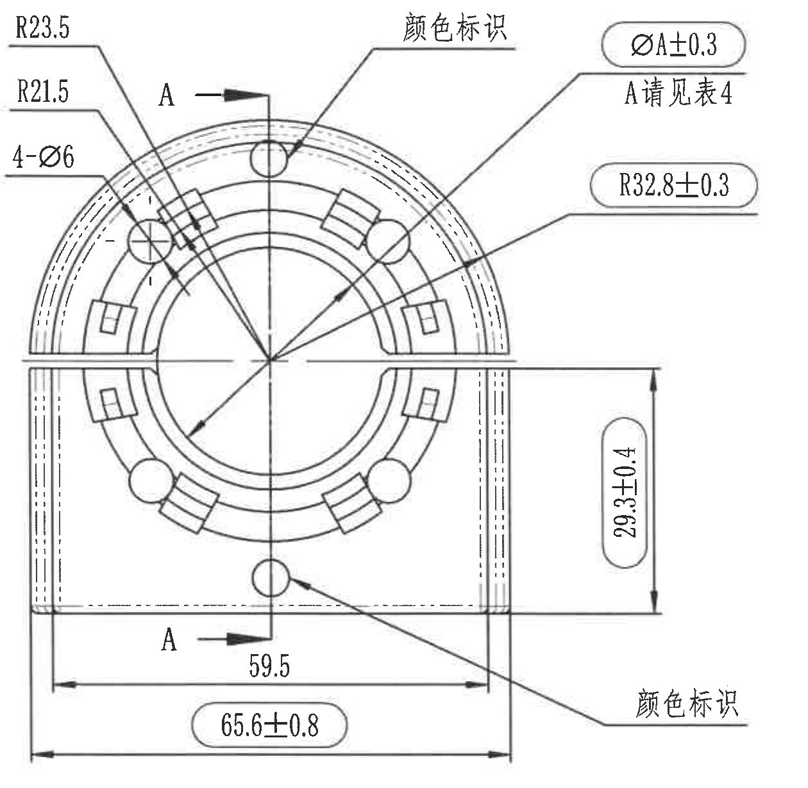

提取表格：

| 提取项 | 原图数值或文本 | 含义说明 |
|---|---|---|
| 圆弧半径 | R23.5 | 主视图上部外侧圆弧半径。 |
| 圆弧半径 | R21.5 | 主视图上部内侧圆弧半径。 |
| 孔/圆形特征数量和直径 | 4-Ø6 | 4 个直径 6 的圆孔或圆形特征。 |
| 剖切标记 | A-A | 主视图上下两处 A 箭头和中心剖切线，指向 object_4 的 A-A 剖视图。 |
| 颜色标识 | 颜色标识 | 上方和下方各一处引线标注，用于说明对应位置需按颜色标识要求识别。 |
| 变量直径 | ØA±0.3；A请见表4 | 直径 A 的公差为 ±0.3；A 的对应规格需查表 4 颜色标识。该尺寸为椭圆框出厂检验尺寸。 |
| 圆弧半径 | R32.8±0.3 | 主视图中心到外侧弧面的半径尺寸，公差 ±0.3；椭圆框表示出厂检验尺寸。 |
| 竖向尺寸 | 29.3±0.4 | 右侧竖向高度尺寸，公差 ±0.4；椭圆框表示出厂检验尺寸。 |
| 横向尺寸 | 59.5 | 下部内侧横向尺寸，无单独标注公差。 |
| 横向总宽 | 65.6±0.8 | 下部外侧总宽尺寸，公差 ±0.8；椭圆框表示出厂检验尺寸。 |
| 括号参考尺寸 | 未见 | 主视图未见括号内参考尺寸。 |
| 星号/T 编号/基准字母 | 未见星号和 T 编号；A 为剖视标记 | 图中 A 不作为基准字母使用，而是剖切方向标记。 |

边界归属说明：主视图裁切包含全部尺寸线、箭头、引线和文字；下方未带入左下表格，右侧未带入 A-A 剖视图。靠近右侧的 29.3±0.4 归属主视图，因为其尺寸线和箭头均连接主视图右侧高度。

## object_4 A-A 剖视图

原图位置/视图名称：第 1 页，中部 A-A 剖视图，bbox `[2110, 840, 900, 1190]`。

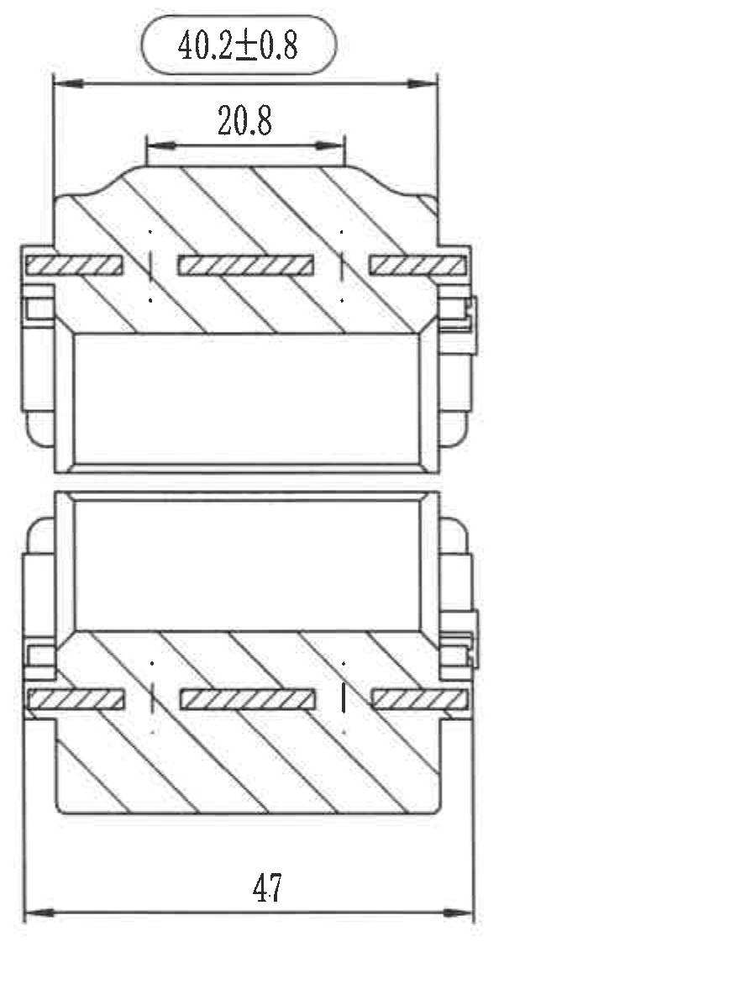

提取表格：

| 提取项 | 原图数值或文本 | 含义说明 |
|---|---|---|
| 剖视来源 | A-A | 与主视图中的 A-A 剖切线对应。 |
| 顶部总宽 | 40.2±0.8 | 剖视图上部总宽尺寸，公差 ±0.8；椭圆框表示出厂检验尺寸。 |
| 顶部内宽 | 20.8 | 剖视图上部局部内宽，无单独标注公差。 |
| 底部总宽 | 47 | 剖视图下部总宽，无单独标注公差。 |
| 剖面线 | 斜向剖面线 | 表示被剖切材料区域。 |
| 括号参考尺寸/星号/T 编号/基准字母 | 未见 | 该剖视图未见括号参考尺寸、星号关键尺寸、T 编号或基准字母。 |

边界归属说明：裁切仅包含 A-A 剖视图和其三条尺寸标注；未把主视图尺寸或右侧 NOTES 文本归入本对象。

## object_5 NOTES / 技术要求

原图位置/视图名称：第 1 页，右侧技术要求文本，bbox `[2960, 835, 1730, 1340]`。

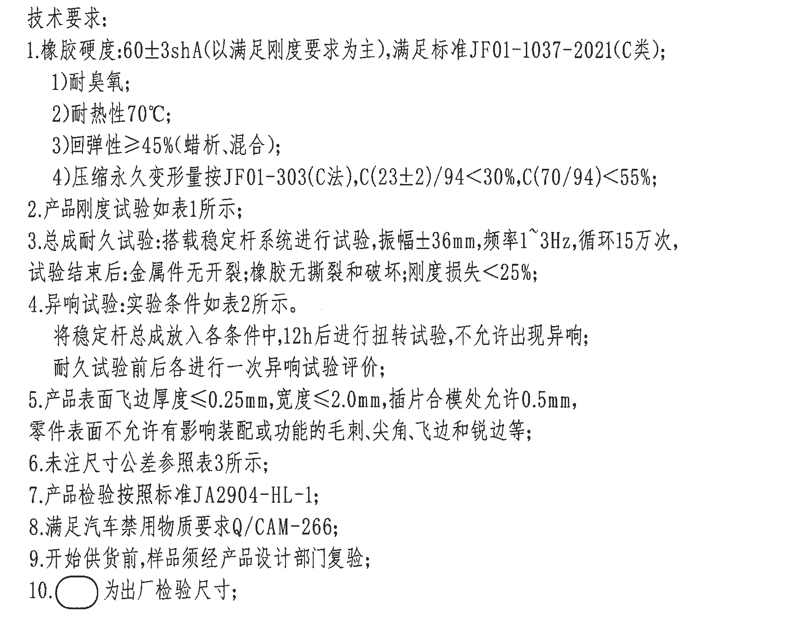

原文还原：

1. 橡胶硬度:60±3shA(以满足刚度要求为主),满足标准JF01-1037-2021(C类);
   1)耐臭氧;
   2)耐热性70℃;
   3)回弹性≥45%(蜡析,混合);
   4)压缩永久变形量按JF01-303(C法),C(23±2)/94<30%,C(70/94)<55%;
2. 产品刚度试验如表1所示;
3. 总成耐久试验:搭载稳定杆系统进行试验,振幅±36mm,频率1~3Hz,循环15万次,试验结束后:金属件无开裂;橡胶无撕裂和破坏;刚度损失<25%;
4. 异响试验:实验条件如表2所示。将稳定杆总成放入各条件中,12h后进行扭转试验,不允许出现异响;耐久试验前后各进行一次异响试验评价;
5. 产品表面飞边厚度≤0.25mm,宽度≤2.0mm,插片合模处允许0.5mm,零件表面不允许有影响装配或功能的毛刺,尖角,飞边和锐边等;
6. 未注尺寸公差参照表3所示;
7. 产品检验按照标准JA2904-HL-1;
8. 满足汽车禁用物质要求Q/CAM-266;
9. 开始供货前,样品须经产品设计部门复验;
10. 椭圆框符号为出厂检验尺寸;

提取表格：

| 提取项 | 原图数值或文本 | 含义说明 |
|---|---|---|
| 橡胶硬度 | 60±3shA | 橡胶硬度要求，以满足刚度要求为主。 |
| 标准 | JF01-1037-2021(C类) | 橡胶硬度及相关要求需满足的标准。 |
| 耐热性 | 70℃ | 橡胶耐热性要求。 |
| 回弹性 | ≥45%(蜡析,混合) | 回弹性能要求。 |
| 压缩永久变形量 | C(23±2)/94<30%,C(70/94)<55% | 按 JF01-303(C法)评定。 |
| 总成耐久试验 | 振幅±36mm,频率1~3Hz,循环15万次 | 稳定杆系统耐久试验条件。 |
| 耐久后判定 | 金属件无开裂;橡胶无撕裂和破坏;刚度损失<25% | 试验结束后的判定条件。 |
| 异响试验 | 表2;12h后扭转试验;不允许出现异响 | 异响评价条件和判定。 |
| 飞边/边缘 | 厚度≤0.25mm,宽度≤2.0mm,插片合模处允许0.5mm | 表面飞边与边缘缺陷要求。 |
| 未注公差 | 参照表3 | 未单独标注尺寸的公差来源。 |
| 出厂检验尺寸 | 椭圆框符号 | 图中椭圆框出的尺寸为出厂检验尺寸。 |

边界归属说明：裁切完整包含技术要求 1 至 10 条；右侧未带入图框分区字母。NOTES 中引用表 1、表 2、表 3，但表格行列在各自对象中还原。

## object_6 X/Y/Z 坐标轴局部图

原图位置/视图名称：第 1 页，下中局部坐标轴示意，bbox `[1600, 2010, 650, 390]`。

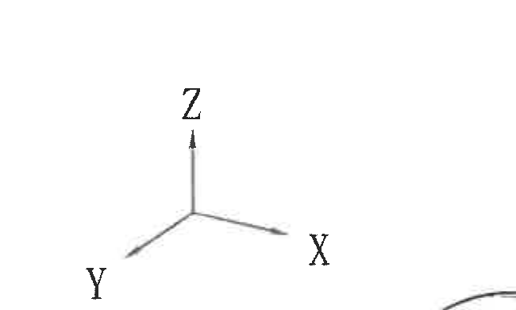

提取表格：

| 提取项 | 原图数值或文本 | 含义说明 |
|---|---|---|
| 坐标轴 | X | 右下方向坐标轴。 |
| 坐标轴 | Y | 左下方向坐标轴。 |
| 坐标轴 | Z | 竖直向上坐标轴。 |
| 尺寸/公差 | 未见 | 该局部图仅为方向示意，无尺寸、公差、参考尺寸、星号或 T 编号。 |

边界归属说明：裁切完整包含 X/Y/Z 三个字母和三向坐标线；右下角有极小轴测视图弧线边缘，不作为坐标轴局部图内容提取。

## object_7 表 3.公差标准

原图位置/视图名称：第 1 页，左下表 3 公差标准，bbox `[360, 2140, 640, 1190]`。

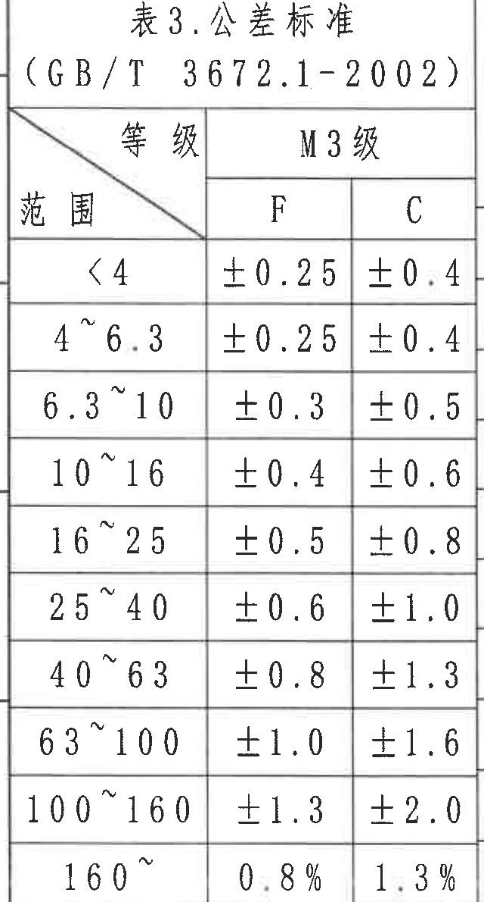

原表还原：

| 范围 | M3级 F | M3级 C |
|---|---|---|
| <4 | ±0.25 | ±0.4 |
| 4~6.3 | ±0.25 | ±0.4 |
| 6.3~10 | ±0.3 | ±0.5 |
| 10~16 | ±0.4 | ±0.6 |
| 16~25 | ±0.5 | ±0.8 |
| 25~40 | ±0.6 | ±1.0 |
| 40~63 | ±0.8 | ±1.3 |
| 63~100 | ±1.0 | ±1.6 |
| 100~160 | ±1.3 | ±2.0 |
| 160~ | 0.8% | 1.3% |

提取表格：

| 提取项 | 原图数值或文本 | 含义说明 |
|---|---|---|
| 表名 | 表3.公差标准(GB/T 3672.1-2002) | 未注尺寸公差引用的标准表。 |
| 等级 | M3级 | 表格公差等级。 |
| F/C 列 | F、C | 不同尺寸类型或公差类别的数值列。 |
| 范围行 | <4 到 160~ | 按尺寸范围给出未注公差。 |

边界归属说明：裁切保留表 3 标题、标准号、表头和全部范围行；右边界紧贴表 3，本对象不提取相邻表 2/表 4 内容。

## object_8 表 2.异响实验要求

原图位置/视图名称：第 1 页，下中表 2 异响实验要求，bbox `[960, 2380, 880, 570]`。

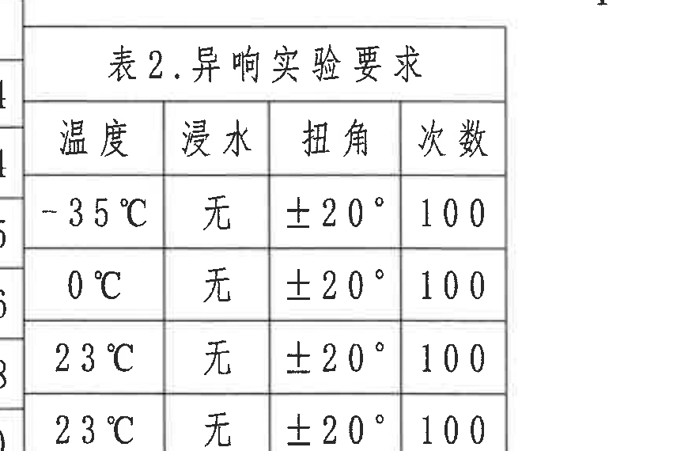

原表还原：

| 温度 | 浸水 | 扭角 | 次数 |
|---|---|---|---|
| -35℃ | 无 | ±20° | 100 |
| 0℃ | 无 | ±20° | 100 |
| 23℃ | 无 | ±20° | 100 |
| 23℃ | 无 | ±20° | 100 |

提取表格：

| 提取项 | 原图数值或文本 | 含义说明 |
|---|---|---|
| 表名 | 表2.异响实验要求 | 技术要求第 4 条引用的异响试验条件。 |
| 温度条件 | -35℃、0℃、23℃、23℃ | 四组温度条件，原图中 23℃ 出现两行。 |
| 浸水 | 无 | 各行均为无浸水条件。 |
| 扭角 | ±20° | 各行扭转角度条件。 |
| 次数 | 100 | 各行试验次数。 |

边界归属说明：表 2 与表 3、表 4 紧邻，裁切左侧有相邻表格细边；提取仅按表 2 标题、表头和四行数据，不把相邻表格字段归入本对象。

## object_9 表 4.颜色标识

原图位置/视图名称：第 1 页，下中表 4 颜色标识，bbox `[960, 2940, 880, 410]`。

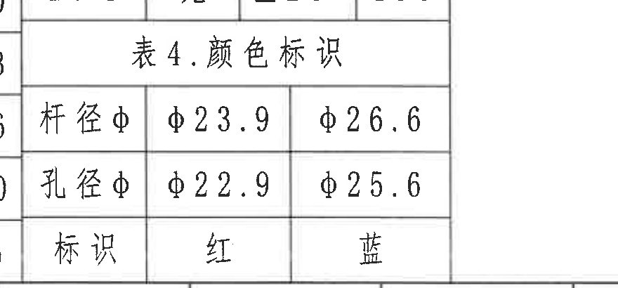

原表还原：

| 原表列1 | 原表列2 | 原表列3 |
|---|---|---|
| 杆径φ | φ23.9 | φ26.6 |
| 孔径φ | φ22.9 | φ25.6 |
| 标识 | 红 | 蓝 |

提取表格：

| 提取项 | 原图数值或文本 | 含义说明 |
|---|---|---|
| 表名 | 表4.颜色标识 | 主视图中 “ØA±0.3; A请见表4” 和颜色标识引线引用本表。 |
| 杆径φ | φ23.9、φ26.6 | 两种颜色标识对应的杆径尺寸。 |
| 孔径φ | φ22.9、φ25.6 | 两种颜色标识对应的孔径尺寸。 |
| 标识 | 红、蓝 | 原表第三行给出第 2 列和第 3 列的颜色标识。 |

边界归属说明：裁切完整包含表 4 标题和三行数据；顶部有相邻表 2 的极细边缘，左侧有相邻表 3 边线，均不作为表 4 字段提取。

## object_10 轴测视图

原图位置/视图名称：第 1 页，下中轴测视图，bbox `[1760, 2240, 1020, 1040]`。

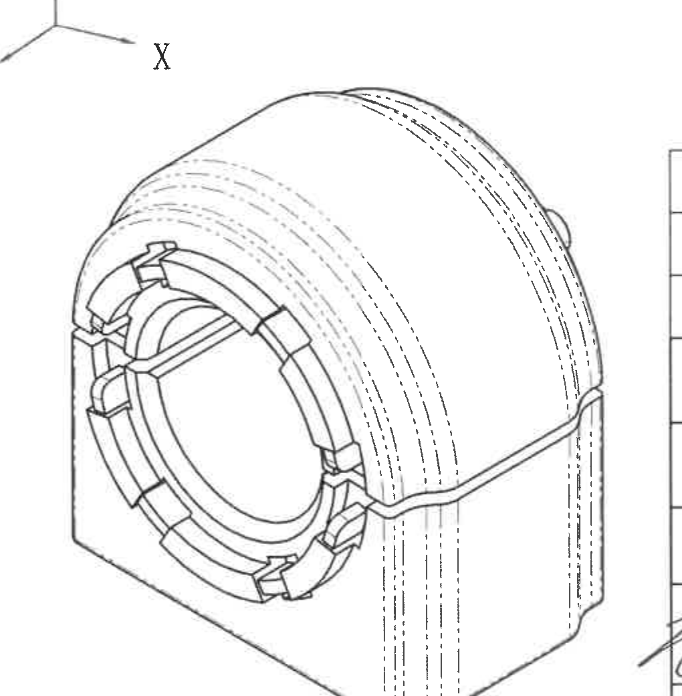

提取表格：

| 提取项 | 原图数值或文本 | 含义说明 |
|---|---|---|
| 视图类型 | 轴测视图 | 显示零件立体结构、半圆外壳、前端环形开口、内侧槽/凸台和侧壁轮廓。 |
| 尺寸标注 | 未见 | 该轴测视图无单独尺寸、半径、公差、括号参考尺寸、星号或 T 编号。 |
| 隐线/虚线 | 多条虚线弧线和竖向虚线 | 表示隐藏边界或内部轮廓。 |
| 与坐标轴关系 | 左上邻近 X/Y/Z 坐标轴 | 坐标轴作为单独 object_6 提取。 |

边界归属说明：裁切完整包含轴测图本体；左上角带入坐标轴一部分，右侧带入标题栏边线和极少手写线，提取时仅归属轴测图本体，不提取标题栏文字。

## object_11 标题栏 / BOM

原图位置/视图名称：第 1 页，右下标题栏和明细栏，bbox `[2770, 2470, 2070, 940]`。

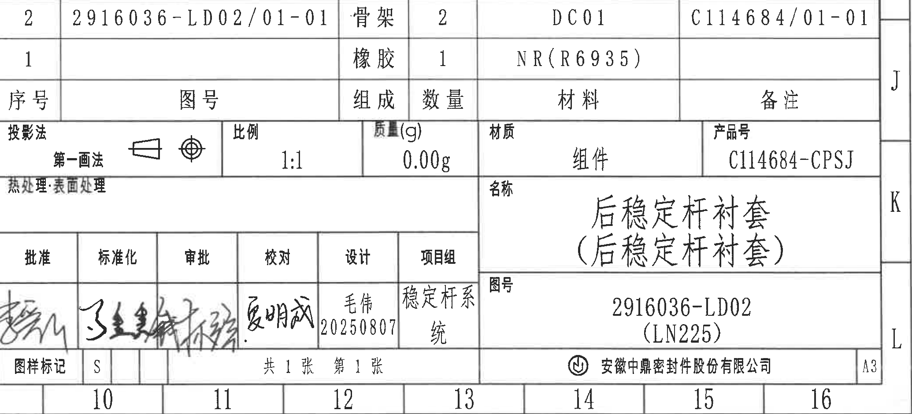

明细栏原表还原：

| 序号 | 图号 | 组成 | 数量 | 材料 | 备注 |
|---|---|---|---|---|---|
| 2 | 2916036-LD02/01-01 | 骨架 | 2 | DC01 | C114684/01-01 |
| 1 |  | 橡胶 | 1 | NR(R6935) |  |

标题栏字段还原：

| 字段 | 原图数值或文本 |
|---|---|
| 投影法 | 第一画法 |
| 比例 | 1:1 |
| 质量(g) | 0.00g |
| 材质 | 组件 |
| 产品号 | C114684-CPSJ |
| 热处理 | 表面处理 |
| 名称 | 后稳定杆衬套（后稳定杆衬套） |
| 图号 | 2916036-LD02 (LN225) |
| 批准 | 手写签名 |
| 标准化 | 手写签名 |
| 审批 | 手写签名 |
| 校对 | 夏明成 |
| 设计 | 毛伟 20250807 |
| 项目组 | 稳定杆系统 |
| 图样标记 | S |
| 张数 | 共1张 第1张 |
| 公司 | 安徽中鼎密封件股份有限公司 |
| 幅面 | A3 |

提取表格：

| 提取项 | 原图数值或文本 | 含义说明 |
|---|---|---|
| 产品号 | C114684-CPSJ | 标题栏产品编号。 |
| 名称 | 后稳定杆衬套（后稳定杆衬套） | 零件/组件名称。 |
| 图号 | 2916036-LD02 (LN225) | 标题栏图号。 |
| 比例/质量 | 1:1；0.00g | 图样比例和质量字段。 |
| BOM 序号 2 | 骨架，数量 2，材料 DC01，图号 2916036-LD02/01-01，备注 C114684/01-01 | 明细栏第 2 项。 |
| BOM 序号 1 | 橡胶，数量 1，材料 NR(R6935) | 明细栏第 1 项。 |
| 设计 | 毛伟 20250807 | 设计人员和日期。 |

边界归属说明：裁切完整包含标题栏、明细栏、审批栏和公司/幅面信息；右侧 J/K/L 和底部 10~16 为图框坐标，不作为标题栏字段。

## 裁切检查记录

| object_id | 裁切对象 | 检查结果 | 边界归属处理 |
|---|---|---|---|
| object_1 | 表 1.刚度试验要求 | 完整包含表头、全部行列和文字。 | 顶部少量图框分区数字不提取。 |
| object_2 | 修订履历表 | 完整包含表头、首条记录和空白记录行。 | 右侧图框 A/B 字母不提取。 |
| object_3 | 主视图 | 完整包含 R23.5、R21.5、4-Ø6、ØA±0.3、R32.8±0.3、29.3±0.4、59.5、65.6±0.8、A-A 标记和颜色标识引线。 | 不混入 A-A 剖视图和左下表格；29.3±0.4 归属主视图。 |
| object_4 | A-A 剖视图 | 完整包含 40.2±0.8、20.8、47 的尺寸线、箭头和文字。 | 未混入主视图尺寸或 NOTES。 |
| object_5 | NOTES / 技术要求 | 完整包含技术要求 1 至 10 条。 | 未带入右侧图框字母。 |
| object_6 | X/Y/Z 坐标轴局部图 | 完整包含 X、Y、Z 和三向坐标线。 | 右下极小轴测图弧线不提取。 |
| object_7 | 表 3.公差标准 | 完整包含表 3 标题、标准号、表头和全部范围行。 | 右边界紧贴表 3，不提取相邻表 2/表 4。 |
| object_8 | 表 2.异响实验要求 | 完整包含表名、表头和四行数据。 | 左侧相邻表格细边不提取。 |
| object_9 | 表 4.颜色标识 | 完整包含表名和三行数据。 | 顶部/左侧相邻表格边线不提取。 |
| object_10 | 轴测视图 | 完整包含轴测图本体轮廓和内部虚线。 | 左上坐标轴和右侧标题栏边线不作为轴测图文本提取。 |
| object_11 | 标题栏 / BOM | 完整包含明细栏、标题栏、审批栏、公司和幅面信息。 | 右侧和底部图框坐标不作为标题栏字段。 |
