# 20C114688 内容识别与裁切

坐标基准：`outputs/20C114688_assets/images/page_1.png`，整页渲染尺寸 `4959 x 3505` px；所有 bbox 均为 `[x0, y0, x1, y1]`。本页未识别到独立局部放大视图；已按修订表、主加工视图、A-A 剖面视图、技术要求、等轴测视图、产品信息表、杆径调教表、通用公差表、标题栏和标题栏内明细表分别裁切。

## 整页 PNG

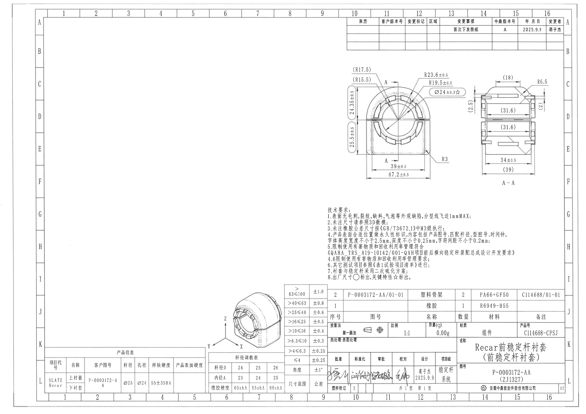

| 提取项 | 原图数值或文本 | 含义说明 |
|---|---|---|
| PDF 页数 | 1 页 | 已先渲染为整页 PNG 后再裁切。 |
| 页面图像 | `outputs/20C114688_assets/images/page_1.png` | A3 图纸整页，页面旋转已按渲染结果固定。 |

## object_1：修订履历表

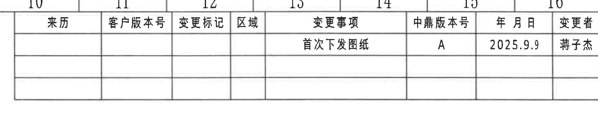

| 项目 | 内容 |
|---|---|
| 原图位置/视图名称 | 页面右上角修订履历表，bbox `[2890, 110, 4765, 500]` |
| object_kind | table |

原表还原：

| 来源 | 客户版本号 | 变更标记 | 区域 | 变更事项 | 中鼎版本号 | 年 月 日 | 变更者 |
|---|---|---|---|---|---|---|---|
|  |  |  |  | 首次下发图纸 | A | 2025.9.9 | 蒋子杰 |
|  |  |  |  |  |  |  |  |
|  |  |  |  |  |  |  |  |

| 提取项 | 原图数值或文本 | 含义说明 |
|---|---|---|
| 表头 | 来源、客户版本号、变更标记、区域、变更事项、中鼎版本号、年 月 日、变更者 | 修订履历字段。 |
| 修订记录 | 首次下发图纸；中鼎版本号 A；2025.9.9；蒋子杰 | 首次发布/下发记录。 |
| 空白行 | 2 行空白 | 原图保留的后续修订记录空行。 |

边界归属说明：裁切包含完整表格外框、表头和三条记录行；上方可见图框坐标编号边缘，不属于修订履历表内容，未提取。

## object_2：主加工视图

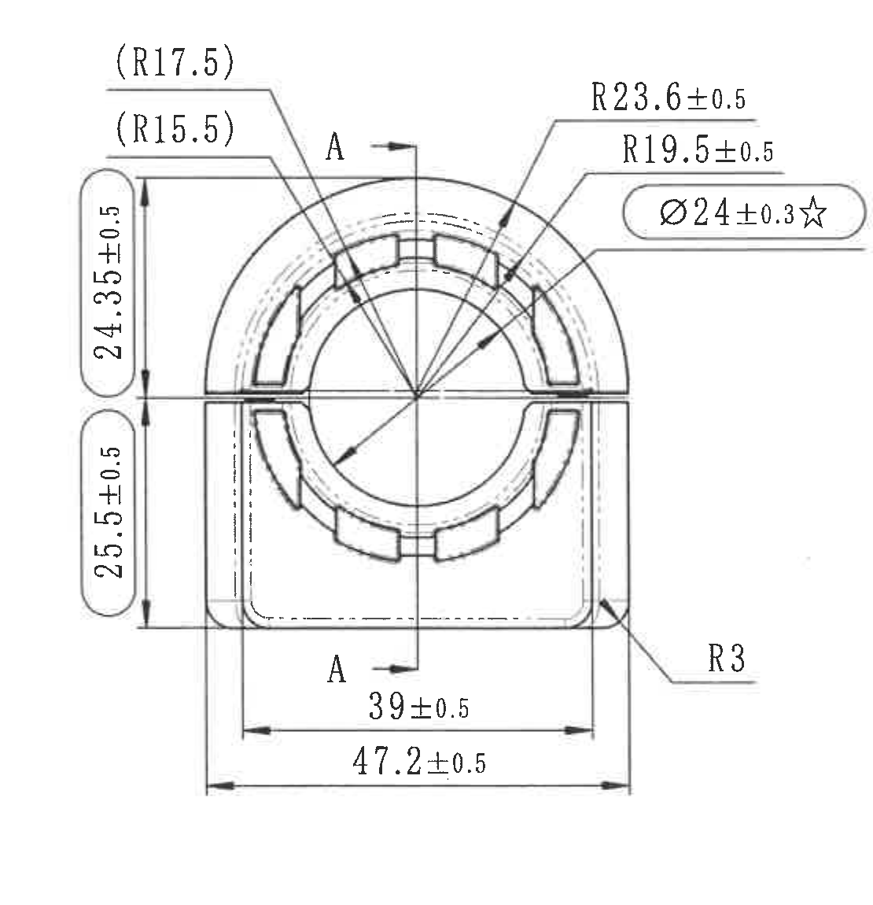

| 项目 | 内容 |
|---|---|
| 原图位置/视图名称 | 页面右上中部主加工视图，bbox `[2840, 510, 3950, 1660]` |
| object_kind | view |

| 提取项 | 原图数值或文本 | 含义说明 |
|---|---|---|
| 参考圆弧半径 | `(R17.5)` | 括号内参考半径，指向主视图上部圆弧特征；作为参考尺寸保留。 |
| 参考圆弧半径 | `(R15.5)` | 括号内参考半径，指向主视图内侧圆弧/槽形特征；作为参考尺寸保留。 |
| 圆弧半径 | `R23.6±0.5` | 指向上部外侧圆弧轮廓的控制半径，公差 ±0.5。 |
| 圆弧半径 | `R19.5±0.5` | 指向相邻内侧圆弧轮廓的控制半径，公差 ±0.5。 |
| 关键直径 | `Ø24±0.3☆` | 圆孔/内径控制尺寸，公差 ±0.3；带 `☆`，按技术要求为关键特性。 |
| 出厂竖向尺寸 | `24.35±0.5` | 左侧上段竖向尺寸，尺寸被圆形/椭圆标识框圈出，按技术要求为出厂尺寸。 |
| 出厂竖向尺寸 | `25.5±0.5` | 左侧下段竖向尺寸，尺寸被圆形/椭圆标识框圈出，按技术要求为出厂尺寸。 |
| 宽度尺寸 | `39±0.5` | 主视图底部内侧两竖向基准线之间宽度，公差 ±0.5。 |
| 总宽度尺寸 | `47.2±0.5` | 主视图最外侧底部总宽度，公差 ±0.5。 |
| 圆角半径 | `R3` | 右下角过渡圆角半径，指引线落在主视图外轮廓角部。 |
| 剖切标记 | `A`、`A` | 主视图中心竖向剖切线的上下端标记，指向 A-A 剖面；不是独立 datum 基准符号。 |
| 未见项目 | 数量前缀、角度尺寸、弧长尺寸、T 编号、独立基准框 | 主视图内未识别到这些标注。 |

边界归属说明：主视图右边界收在 A-A 剖面之前，未提取剖面中的 `(18)`、`(31.6)`、`34±0.5`、`(39)` 等尺寸。`R3` 的引线和箭头完整连接到主视图右下圆角，归属主视图。

## object_3：A-A 剖面视图

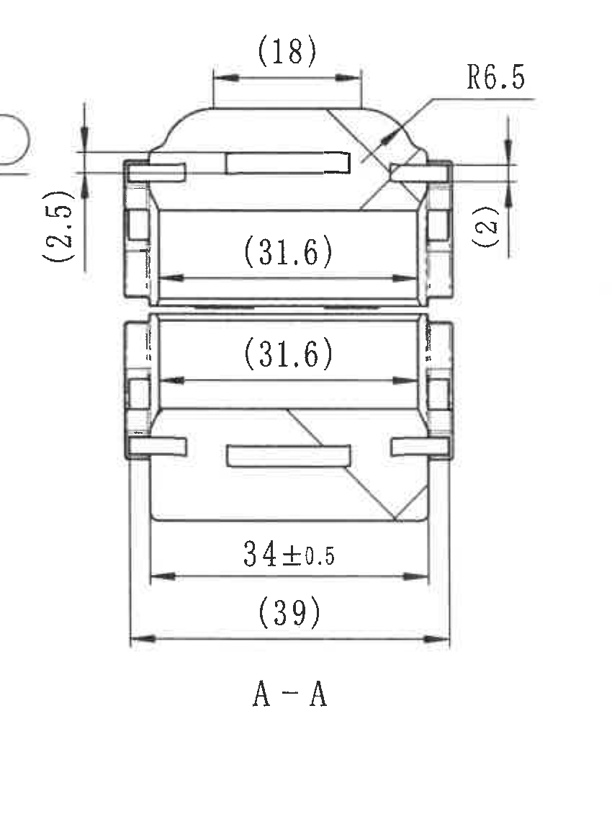

| 项目 | 内容 |
|---|---|
| 原图位置/视图名称 | 页面右上中部 A-A 剖面视图，bbox `[3900, 585, 4750, 1715]` |
| object_kind | section |

| 提取项 | 原图数值或文本 | 含义说明 |
|---|---|---|
| 参考顶部宽度 | `(18)` | 剖面上端凸台/顶部宽度参考尺寸，括号表示参考。 |
| 圆弧半径 | `R6.5` | 剖面右上圆弧过渡半径。 |
| 参考竖向尺寸 | `(2.5)` | 剖面左侧上部竖向参考厚度/台阶高度。 |
| 参考竖向尺寸 | `(2)` | 剖面右侧上部竖向参考厚度/台阶高度。 |
| 参考内宽 | `(31.6)` | 剖面上半部内侧水平参考宽度。 |
| 参考内宽 | `(31.6)` | 剖面下半部内侧水平参考宽度。 |
| 宽度尺寸 | `34±0.5` | 剖面下部控制宽度，公差 ±0.5。 |
| 参考总宽 | `(39)` | 剖面最外侧底部参考总宽。 |
| 剖面名称 | `A-A` | 与主视图中的 A 剖切标记对应。 |
| 未见项目 | 数量前缀、角度尺寸、弧长尺寸、T 编号、独立基准框 | A-A 剖面内未识别到这些标注。 |

边界归属说明：为完整保留剖面左侧 `(2.5)` 尺寸线，左边缘保留了主视图 `Ø24±0.3☆` 标注气泡的极小残片；该残片不属于 A-A 剖面，未纳入剖面尺寸提取。剖面内 `(31.6)`、`34±0.5`、`(39)` 均只归属 A-A 剖面。

## object_4：技术要求 NOTES

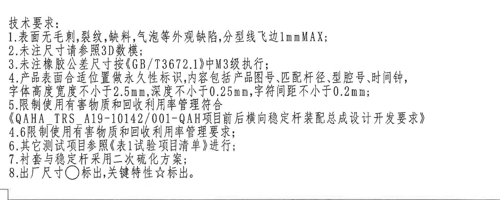

| 项目 | 内容 |
|---|---|
| 原图位置/视图名称 | 页面中下部技术要求，bbox `[2740, 1690, 4640, 2450]` |
| object_kind | notes |

原文还原：

```text
技术要求:
1.表面无毛刺,裂纹,缺料,气泡等外观缺陷,分型线飞边1mmMAX;
2.未注尺寸请参照3D数模;
3.未注橡胶公差尺寸按《GB/T3672.1》中M3级执行;
4.产品表面合适位置做永久性标识,内容包括产品图号、匹配杆径、型腔号、时间钟,
字体高度宽度不小于2.5mm,深度不小于0.25mm,字符间距不小于0.2mm;
5.限制使用有害物质和回收利用率管理符合
《QAHA_TRS_A19-10142/001-QAH项目前后横向稳定杆装配总成设计开发要求》
4.6限制使用有害物质和回收利用率管理要求;
6.其它测试项目参照《表1试验项目清单》进行;
7.衬套与稳定杆采用二次硫化方案;
8.出厂尺寸○标出,关键特性☆标出。
```

| 提取项 | 原图数值或文本 | 含义说明 |
|---|---|---|
| 外观要求 | 表面无毛刺、裂纹、缺料、气泡等外观缺陷；分型线飞边 `1mmMAX` | 外观缺陷和飞边上限要求。 |
| 未注尺寸 | 未注尺寸请参照 `3D数模` | 未标注尺寸以 3D 数模为依据。 |
| 未注橡胶公差 | 按《GB/T3672.1》中 `M3` 级执行 | 橡胶件未注公差标准。 |
| 永久标识内容 | 产品图号、匹配杆径、型腔号、时间钟 | 产品表面标识项目。 |
| 永久标识规格 | 字体高度宽度不小于 `2.5mm`，深度不小于 `0.25mm`，字符间距不小于 `0.2mm` | 标识几何要求。 |
| 有害物质/回收利用率 | 符合 `QAHA_TRS_A19-10142/001-QAH` 项目前后横向稳定杆装配总成设计开发要求中 4.6 要求 | 材料环保和回收利用管理要求。 |
| 测试项目 | 参照《表1试验项目清单》进行 | 测试项目来源。 |
| 工艺方案 | 衬套与稳定杆采用二次硫化方案 | 装配/成型工艺说明。 |
| 标识符号 | 出厂尺寸 `○` 标出，关键特性 `☆` 标出 | 解释主视图中圆形标注和星号标注的含义。 |

边界归属说明：裁切扩到右侧以完整保留第 4 条“型腔号、时间钟”及字体规格；底部标题栏和通用公差表未纳入 NOTES 文本提取。

## object_5：等轴测视图

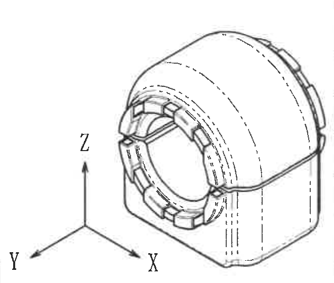

| 项目 | 内容 |
|---|---|
| 原图位置/视图名称 | 页面下中部等轴测视图，bbox `[1740, 2415, 2400, 2975]` |
| object_kind | view |

| 提取项 | 原图数值或文本 | 含义说明 |
|---|---|---|
| 视图类型 | 等轴测/三维示意视图 | 展示零件整体外形、开口、槽和外侧圆弧形态。 |
| 坐标方向 | `X`、`Y`、`Z` | 原图左下角坐标三轴方向指示。 |
| 尺寸标注 | 未见尺寸数值 | 此视图为形状和方向辅助说明，不含独立尺寸、公差、T 编号或基准框。 |

边界归属说明：裁切保留完整等轴测零件轮廓和 X/Y/Z 方向箭头；右侧相邻表格已基本排除，未从等轴测视图提取任何表格字段。

## object_6：产品信息表

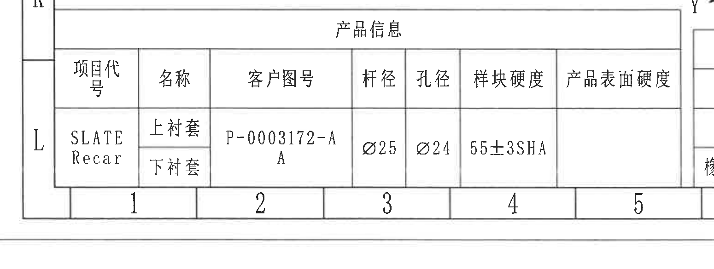

| 项目 | 内容 |
|---|---|
| 原图位置/视图名称 | 页面左下角产品信息表，bbox `[260, 2920, 1810, 3505]` |
| object_kind | table |

原表还原：

| 项目代号 | 名称 | 客户图号 | 杆径 | 孔径 | 样块硬度 | 产品表面硬度 |
|---|---|---|---|---|---|---|
| SLATE / Recar | 上衬套；下衬套 | P-0003172-AA | Ø25 | Ø24 | 55±3SHA |  |

| 提取项 | 原图数值或文本 | 含义说明 |
|---|---|---|
| 项目代号 | `SLATE Recar` | 产品项目/客户平台标识。 |
| 名称 | 上衬套、下衬套 | 同一产品信息表内上下两项名称。 |
| 客户图号 | `P-0003172-AA` | 原图中换行显示为 `P-0003172-A` 与下一行 `A`。 |
| 杆径 | `Ø25` | 匹配杆径。 |
| 孔径 | `Ø24` | 孔径/内径字段。 |
| 样块硬度 | `55±3SHA` | 样块硬度要求。 |
| 产品表面硬度 | 空白 | 原表此列未填写数值。 |

边界归属说明：裁切包含产品信息表完整外框和最右列“产品表面硬度”；右侧可见相邻杆径调教表边缘，未纳入产品信息表提取。底部图框坐标编号不作为表格内容。

## object_7：杆径调教表

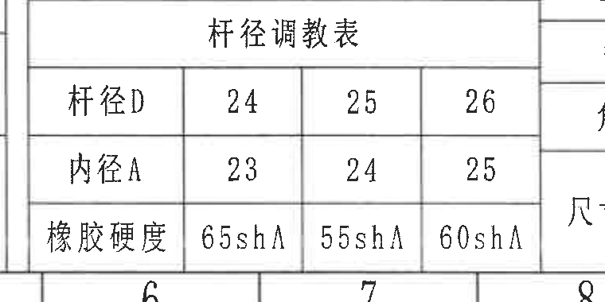

| 项目 | 内容 |
|---|---|
| 原图位置/视图名称 | 页面下中部杆径调教表，bbox `[1730, 2985, 2490, 3365]` |
| object_kind | table |

原表还原：

| 杆径调教表 |  |  |  |
|---|---:|---:|---:|
| 杆径D | 24 | 25 | 26 |
| 内径A | 23 | 24 | 25 |
| 橡胶硬度 | 65shA | 55shA | 60shA |

| 提取项 | 原图数值或文本 | 含义说明 |
|---|---|---|
| 杆径 D=24 | 内径 A=23；橡胶硬度=65shA | 杆径 24 对应调教参数。 |
| 杆径 D=25 | 内径 A=24；橡胶硬度=55shA | 杆径 25 对应调教参数。 |
| 杆径 D=26 | 内径 A=25；橡胶硬度=60shA | 杆径 26 对应调教参数。 |

边界归属说明：裁切包含表题和三行参数；右侧相邻通用公差表边缘不属于该对象，未提取。

## object_8：通用公差表

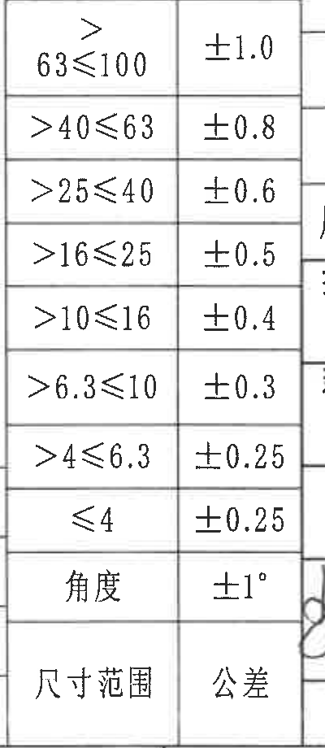

| 项目 | 内容 |
|---|---|
| 原图位置/视图名称 | 页面下中部通用公差表，bbox `[2400, 2410, 2800, 3330]` |
| object_kind | table |

原表按图中自上而下顺序还原：

| 原图行序 | 尺寸范围/项目 | 公差 |
|---:|---|---|
| 1 | >63≤100 | ±1.0 |
| 2 | >40≤63 | ±0.8 |
| 3 | >25≤40 | ±0.6 |
| 4 | >16≤25 | ±0.5 |
| 5 | >10≤16 | ±0.4 |
| 6 | >6.3≤10 | ±0.3 |
| 7 | >4≤6.3 | ±0.25 |
| 8 | ≤4 | ±0.25 |
| 9 | 角度 | ±1° |
| 10 | 尺寸范围 | 公差 |

| 提取项 | 原图数值或文本 | 含义说明 |
|---|---|---|
| 线性尺寸公差 | `>63≤100: ±1.0`；`>40≤63: ±0.8`；`>25≤40: ±0.6`；`>16≤25: ±0.5`；`>10≤16: ±0.4`；`>6.3≤10: ±0.3`；`>4≤6.3: ±0.25`；`≤4: ±0.25` | 未单独标注公差时的尺寸范围公差表。 |
| 角度公差 | `角度 ±1°` | 未注角度公差。 |
| 表头位置 | `尺寸范围 / 公差` 位于表格底部 | 原图表头在最下方，已按原图顺序保留。 |

边界归属说明：裁切完整包含公差表外框及底部“尺寸范围/公差”表头；右侧标题栏边线不属于通用公差表，未提取。

## object_9：右下标题栏

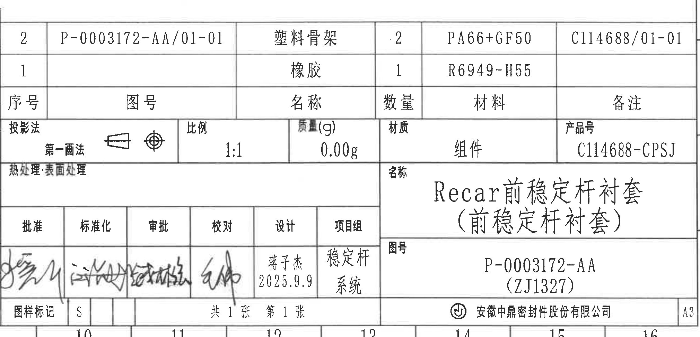

| 项目 | 内容 |
|---|---|
| 原图位置/视图名称 | 页面右下角标题栏，bbox `[2770, 2385, 4790, 3360]` |
| object_kind | title_block |

标题栏字段还原：

| 字段 | 原图数值或文本 |
|---|---|
| 投影法 | 第一画法；第一角投影符号 |
| 比例 | 1:1 |
| 质量(g) | 0.00g |
| 材质 | 组件 |
| 产品号 | C114688-CPSJ |
| 热处理·表面处理 | 空白 |
| 名称 | Recar前稳定杆衬套（前稳定杆衬套） |
| 图号 | P-0003172-AA（ZJ1327） |
| 批准 | 手写签名 |
| 标准化 | 手写签名 |
| 审批 | 手写签名 |
| 校对 | 手写签名 |
| 设计 | 蒋子杰；2025.9.9 |
| 项目组 | 稳定杆系统 |
| 图样标记 | S |
| 张数 | 共 1 张；第 1 张 |
| 公司 | 安徽中鼎密封件股份有限公司 |
| 图幅 | A3 |

| 提取项 | 原图数值或文本 | 含义说明 |
|---|---|---|
| 标题名称 | `Recar前稳定杆衬套（前稳定杆衬套）` | 零件/组件名称。 |
| 图号 | `P-0003172-AA（ZJ1327）` | 主图号与括号内编号。 |
| 产品号 | `C114688-CPSJ` | 产品号字段。 |
| 设计信息 | `蒋子杰 2025.9.9` | 设计者和日期。 |
| 项目组 | `稳定杆系统` | 归属项目组。 |
| 投影/比例/质量/材质 | 第一画法；1:1；0.00g；组件 | 制图和物料属性。 |

边界归属说明：裁切从标题栏左侧“序号/投影法”列起至右侧 `A3` 图幅栏，排除了左侧通用公差表；上方空白区域不作为 NOTES 内容提取。标题栏内明细/BOM 表另以 object_10 单独裁切和还原。

## object_10：标题栏内明细/BOM 表

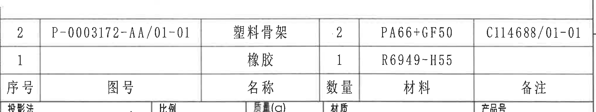

| 项目 | 内容 |
|---|---|
| 原图位置/视图名称 | 右下标题栏上部明细/BOM 表，bbox `[2770, 2385, 4790, 2765]` |
| object_kind | table |

原表还原（原图表头位于两条数据行下方）：

| 序号 | 图号 | 名称 | 数量 | 材料 | 备注 |
|---:|---|---|---:|---|---|
| 2 | P-0003172-AA/01-01 | 塑料骨架 | 2 | PA66+GF50 | C114688/01-01 |
| 1 |  | 橡胶 | 1 | R6949-H55 |  |

| 提取项 | 原图数值或文本 | 含义说明 |
|---|---|---|
| 明细行 2 | 序号 2；图号 `P-0003172-AA/01-01`；名称 `塑料骨架`；数量 `2`；材料 `PA66+GF50`；备注 `C114688/01-01` | 塑料骨架明细。 |
| 明细行 1 | 序号 1；图号空白；名称 `橡胶`；数量 `1`；材料 `R6949-H55`；备注空白 | 橡胶明细。 |
| 表头 | 序号、图号、名称、数量、材料、备注 | 明细表字段。 |

边界归属说明：裁切限定为标题栏上部明细/BOM 表，底部投影法/比例/产品号等标题栏字段不在本对象中提取；这些字段归入 object_9。

## 裁切检查记录

| 图像 | bbox | 检查结果 |
|---|---|---|
| page_1.png | `[0, 0, 4959, 3505]` | 整页完整，作为裁切坐标基准。 |
| object_1.png | `[2890, 110, 4765, 500]` | 修订表外框、表头和记录行完整；上方图框编号残留已排除。 |
| object_2.png | `[2840, 510, 3950, 1660]` | 主视图所有尺寸线、箭头和文字完整；未带入 A-A 剖面尺寸。 |
| object_3.png | `[3900, 585, 4750, 1715]` | A-A 剖面尺寸线和文字完整；左边缘有主视图气泡极小残片，为保留 `(2.5)` 完整尺寸线而保留，未提取为剖面内容。 |
| object_4.png | `[2740, 1690, 4640, 2450]` | 技术要求 1-8 条完整，尤其第 4 条右侧文字完整；未截断标题栏。 |
| object_5.png | `[1740, 2415, 2400, 2975]` | 等轴测图和 X/Y/Z 方向箭头完整；无尺寸文字裁切问题。 |
| object_6.png | `[260, 2920, 1810, 3505]` | 产品信息表外框和最右列完整；相邻杆径表边缘未纳入提取。 |
| object_7.png | `[1730, 2985, 2490, 3365]` | 杆径调教表题、三行字段和值完整；右侧相邻公差表残边未提取。 |
| object_8.png | `[2400, 2410, 2800, 3330]` | 通用公差表全部范围、公差和底部表头完整；右侧标题栏边线未提取。 |
| object_9.png | `[2770, 2385, 4790, 3360]` | 标题栏从左侧“序号/投影法”到右侧 A3 完整；左侧通用公差表已排除。 |
| object_10.png | `[2770, 2385, 4790, 2765]` | 明细/BOM 表两条数据行和表头完整；底部标题栏其他字段未提取到本对象。 |
