# 20C114691 内容识别与裁切提取

## 整页渲染

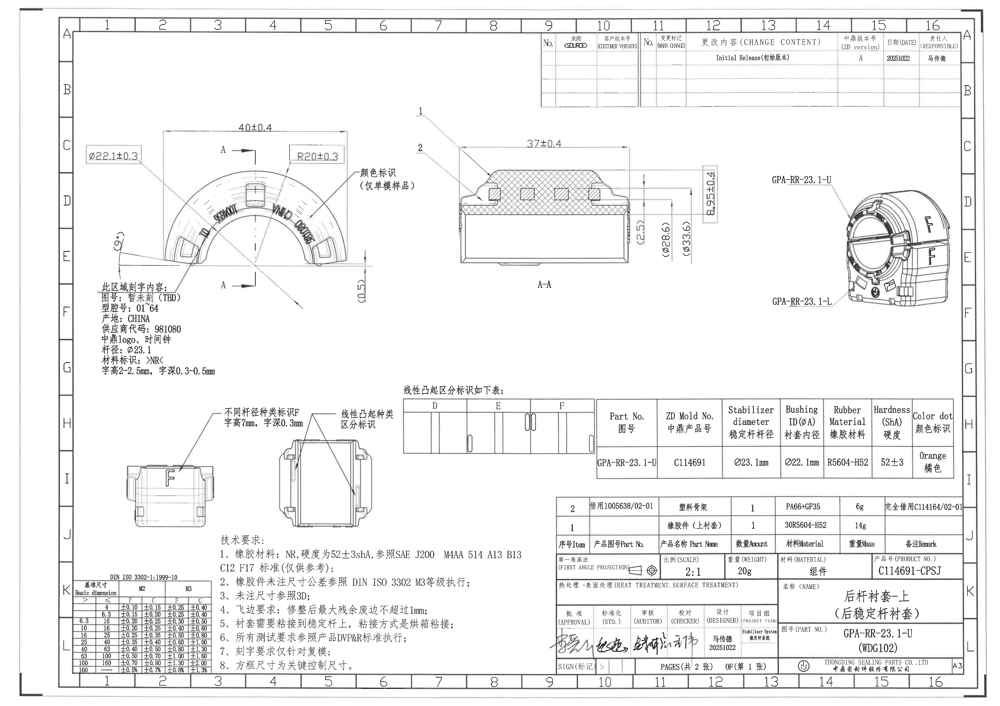

| 项目 | 内容 |
|---|---|
| 原始文件 | input/20C114691.pdf |
| 整页 PNG | outputs/20C114691_assets/images/page_1.png |
| 页面尺寸 | 4959 x 3505 px |
| 页面 bbox | [0, 0, 4959, 3505] |
| 结构说明 | 按原图位置分为顶部变更栏、左上主视图、中上 A-A 剖面、右上等轴测视图、中下局部视图与标识/规格表、左下公差表、下中技术要求、右下 BOM 和标题栏。 |

## object_9 - 顶部变更履历/来源客户版本栏

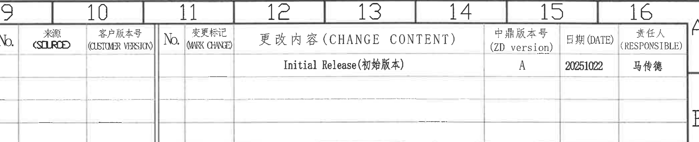

- object_kind: `table`
- 原图位置/视图名称: 页面上方，图框坐标 9-16/A-B 区域；顶部变更履历/来源客户版本栏
- bbox: `[2700, 90, 4800, 520]`
- 边界归属说明: 上边界包含图框坐标 9-16，仅作位置参照；表格数据从 No./来源/客户版本号/变更标记/更改内容/中鼎版本号/日期/责任人表头开始。下方空白修订行属于同一表格。

### 原表还原
| No. | 来源 (SOURCE) | 客户版本号 (CUSTOMER VERSION) | No. | 变更标记 (MARK CHANGE) | 更改内容 (CHANGE CONTENT) | 中鼎版本号 (ZD version) | 日期 (DATE) | 责任人 (RESPONSIBLE) |
| --- | --- | --- | --- | --- | --- | --- | --- | --- |
|  |  |  |  |  | Initial Release(初始版本) | A | 20251022 | 马传德 |
|  |  |  |  |  |  |  |  |  |
|  |  |  |  |  |  |  |  |  |

### 提取表格
| 提取项 | 原图数值或文本 | 含义说明 |
|---|---|---|
| 表头 | No.; 来源(SOURCE); 客户版本号(CUSTOMER VERSION); No.; 变更标记(MARK CHANGE); 更改内容(CHANGE CONTENT); 中鼎版本号(ZD version); 日期(DATE); 责任人(RESPONSIBLE) | 顶部变更履历和版本来源栏的原始列结构。 |
| 更改内容 | Initial Release(初始版本) | 该版本为初始发布。 |
| 中鼎版本号 | A | 当前中鼎版本为 A。 |
| 日期 | 20251022 | 修订/发布日期。 |
| 责任人 | 马传德 | 该条记录责任人。 |
| 空白行 | 后续多行为空 | 图中保留未填写的修订记录行。 |

## object_1 - 左上主加工视图

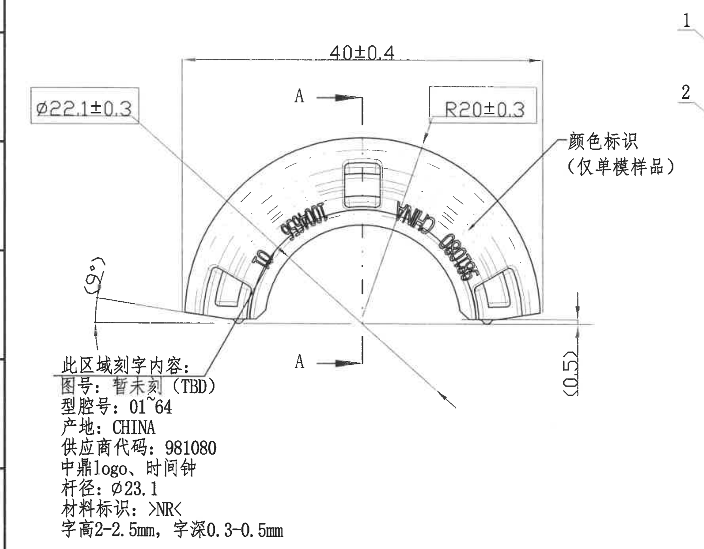

- object_kind: `view`
- 原图位置/视图名称: 页面左上，图框坐标约 1-7/C-F 区域；左上主加工视图
- bbox: `[350, 500, 2130, 1890]`
- 边界归属说明: 右侧为保留“颜色标识（仅单模样品）”完整文字而略带入 A-A 剖面编号 1/2 的局部线头；A-A 剖面尺寸 37±0.4、8.95±0.4、(25)、(Ø28.6)、(Ø33.6) 不归入本主视图。

### 提取表格
| 提取项 | 原图数值或文本 | 含义说明 |
|---|---|---|
| 直径尺寸 | Ø22.1±0.3 | 带直径符号和公差，指向衬套内孔/内径相关轮廓；与右下规格表 Bushing ID(ØA)=Ø22.1mm 一致。 |
| 水平总宽 | 40±0.4 | 主视图顶部水平尺寸，表示外形横向宽度/跨距，公差 ±0.4。 |
| 半径尺寸 | R20±0.3 | 外圆弧半径，R 表示半径，公差 ±0.3。 |
| 参考角度 | (9°) | 括号内参考角度，位于左下斜边与基准水平线附近；作为参考角度说明，不作为独立检验强制尺寸。 |
| 参考高度/台阶 | (0.5) | 括号内参考尺寸，位于右侧基准线附近，表示小高度/间隙参考值。 |
| 剖切基准 | A-A | 上下两个 A 箭头和剖切线指示 A-A 剖面位置；剖面实际尺寸在 object_2 提取。 |
| 颜色标识说明 | 颜色标识（仅单模样品） | 引线指向右侧弧面区域，说明颜色标识仅用于单模样品。 |
| 刻字区域标题 | 此区域刻字内容 | 下方文字框说明弧面区域刻字内容。 |
| 刻字内容 | 图号：暂未刻（TBD） | 图号刻字暂未确定。 |
| 刻字内容 | 型腔号：01~64 | 型腔号范围 01 到 64。 |
| 刻字内容 | 产地：CHINA | 产地刻字。 |
| 刻字内容 | 供应商代码：981080 | 供应商代码刻字。 |
| 刻字内容 | 中鼎logo、时间钟 | 要求刻中鼎 logo 和时间钟。 |
| 刻字内容 | 杆径：Ø23.1 | 杆径标识，带直径符号。 |
| 刻字内容 | 材料标识：>NR< | 材料标识为 NR，尖括号为原图标注形式。 |
| 刻字规格 | 字高2-2.5mm，字深0.3-0.5mm | 刻字高度和刻字深度范围。 |
| 关键/编号检查 | 未见星号关键尺寸；未见 T 编号 | 本主视图未出现星号关键尺寸或 T 编号。 |

## object_2 - A-A 剖面视图

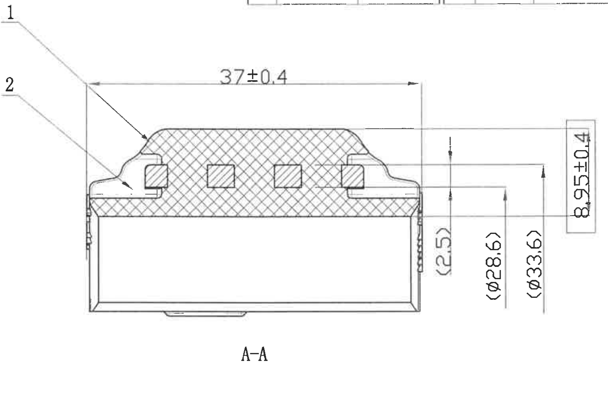

- object_kind: `section`
- 原图位置/视图名称: 页面上中，图框坐标约 7-12/C-F 区域；A-A 剖面视图
- bbox: `[2060, 520, 3590, 1520]`
- 边界归属说明: 左边界保留编号 1、2 的完整引线；主视图的颜色/刻字文字未纳入本对象。右侧所有竖向尺寸线和文字均属于 A-A 剖面，不归入右上等轴测视图。

### 提取表格
| 提取项 | 原图数值或文本 | 含义说明 |
|---|---|---|
| 剖面名称 | A-A | 与主视图 A-A 剖切箭头对应的剖面视图。 |
| 编号引线 | 1 | 编号 1 指向上部剖切/帽状区域。原图未给出独立明细解释，作为视图内编号保留。 |
| 编号引线 | 2 | 编号 2 指向左侧台阶/边缘结构。原图未给出独立明细解释，作为视图内编号保留。 |
| 水平尺寸 | 37±0.4 | 剖面顶部水平宽度尺寸，公差 ±0.4。 |
| 竖向尺寸 | 8.95±0.4 | 右侧框选竖向尺寸，公差 ±0.4。 |
| 参考尺寸 | (25) | 括号内参考尺寸，位于右侧竖向尺寸组内。 |
| 参考直径 | (Ø28.6) | 括号内参考直径尺寸，带直径符号。 |
| 参考直径 | (Ø33.6) | 括号内参考直径尺寸，带直径符号。 |
| 关键/编号检查 | 未见星号关键尺寸；未见 T 编号 | 本剖面未出现星号关键尺寸或 T 编号。 |

## object_3 - 右上等轴测视图

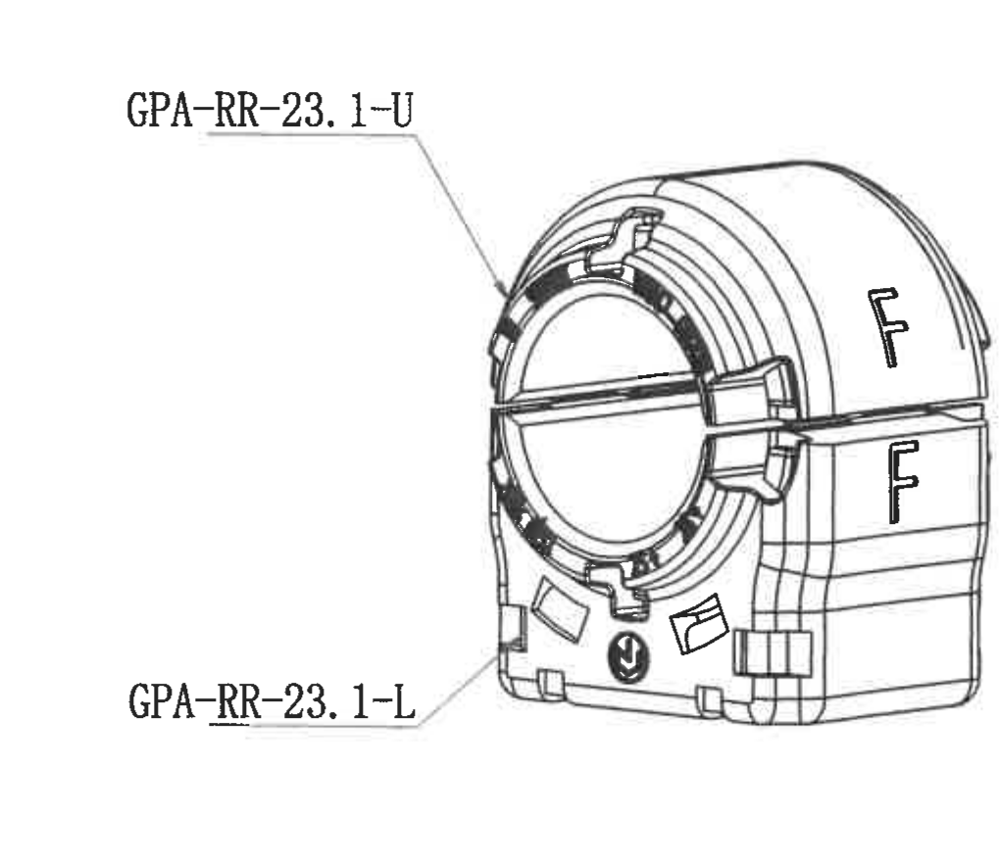

- object_kind: `view`
- 原图位置/视图名称: 页面右上，图框坐标约 13-16/D-F 区域；右上等轴测视图
- bbox: `[3700, 780, 4720, 1660]`
- 边界归属说明: 裁切完整包含两个零件号引线和模型外形；右侧图框边线只是图纸边框，不归属等轴测视图。

### 提取表格
| 提取项 | 原图数值或文本 | 含义说明 |
|---|---|---|
| 零件号引线 | GPA-RR-23.1-U | 引线指向上件/上衬套区域。 |
| 零件号引线 | GPA-RR-23.1-L | 引线指向下件/下衬套区域。 |
| 外观标识 | F | 等轴测外表面可见 F 字标识，和下方局部标识视图对应。 |
| 尺寸检查 | 未见尺寸线 | 本等轴测图用于形态/零件号说明，未标注加工尺寸。 |

## object_4 - 左下 F 字标识局部视图

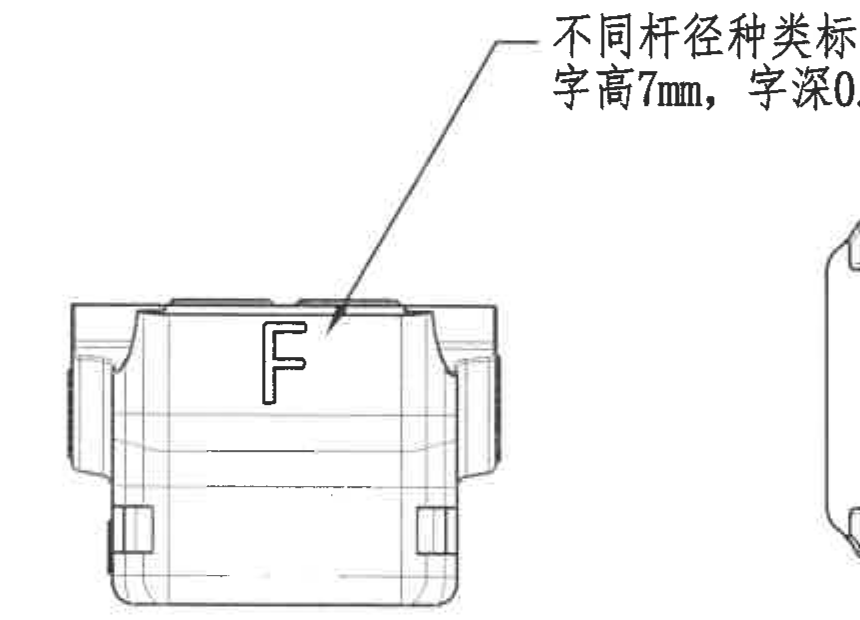

- object_kind: `detail`
- 原图位置/视图名称: 页面左下中部，图框坐标约 2-5/H-J 区域；左下 F 字标识局部视图
- bbox: `[560, 2010, 1420, 2630]`
- 边界归属说明: 引线文字在上方，箭头指向本视图 F 字位置；右侧相邻视图片段未作为本视图内容提取。

### 提取表格
| 提取项 | 原图数值或文本 | 含义说明 |
|---|---|---|
| 标识文字 | F | 位于外表面，用于不同杆径种类标识。 |
| 标识说明 | 不同杆径种类标识F | 引线说明 F 是杆径种类标识。 |
| 字高 | 7mm | F 字标识高度。 |
| 字深 | 0.3mm | F 字标识刻/凸深度。 |
| 关键/编号检查 | 未见星号关键尺寸；未见 T 编号 | 本局部视图未出现星号关键尺寸或 T 编号。 |

## object_5 - 右下线性凸起标识局部视图

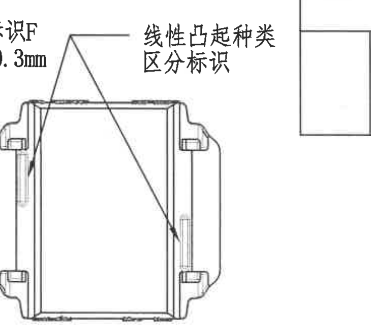

- object_kind: `detail`
- 原图位置/视图名称: 页面中下，图框坐标约 5-7/H-J 区域；右下线性凸起标识局部视图
- bbox: `[1410, 1985, 2140, 2625]`
- 边界归属说明: 左上边缘带入前一局部视图末尾文字片段，右侧带入 D/E/F 表格边线；两者均不提取到本对象。

### 提取表格
| 提取项 | 原图数值或文本 | 含义说明 |
|---|---|---|
| 标识说明 | 线性凸起种类区分标识 | 说明侧面线性凸起用于区分类型。 |
| 引线数量 | 2 条引线 | 两条引线分别指向左侧和右侧边部的线性凸起/标识位置。 |
| 尺寸检查 | 未见数值尺寸 | 本局部视图没有独立数值尺寸；分类信息在 object_6 的 D/E/F 表中体现。 |
| 关键/编号检查 | 未见星号关键尺寸；未见 T 编号 | 本局部视图未出现星号关键尺寸或 T 编号。 |

## object_6 - 线性凸起区分标识 D/E/F 示意表

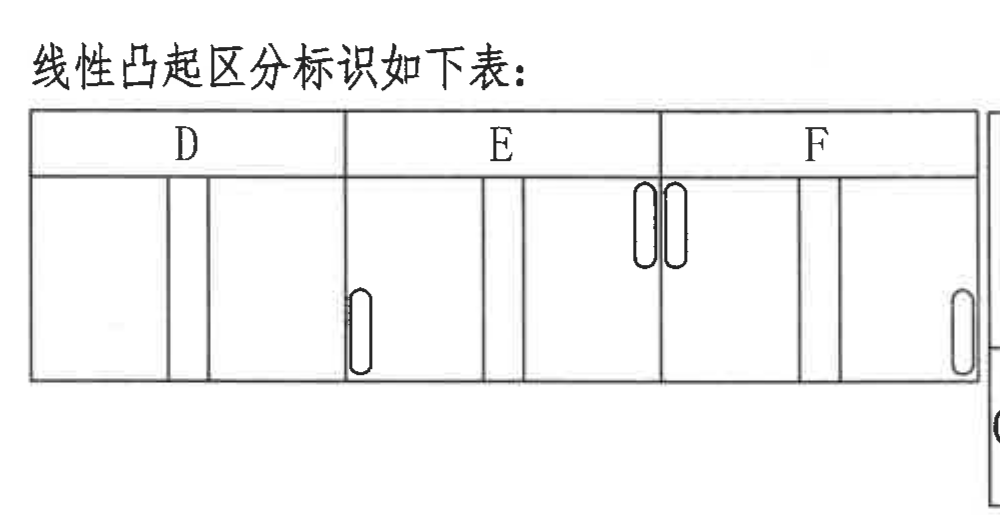

- object_kind: `table`
- 原图位置/视图名称: 页面中下，图框坐标约 7-10/H-I 区域；线性凸起区分标识 D/E/F 示意表
- bbox: `[1970, 1870, 2970, 2390]`
- 边界归属说明: 裁切保留 D/E/F 表题、表头和完整图示行；右侧相邻规格表边线不归入本对象。

### 原表还原
| D | E | F |
| --- | --- | --- |
| 图示：D 区内为纵向分隔线组合，无圆角长孔标识 | 图示：E 区左下有 1 个竖向圆角长孔标识，并有纵向分隔线 | 图示：F 区上部有 2 个并列竖向圆角长孔标识，右端有 1 个竖向圆角长孔标识 |

### 提取表格
| 提取项 | 原图数值或文本 | 含义说明 |
|---|---|---|
| 表题 | 线性凸起区分标识如下表： | 说明下表定义线性凸起分类标识。 |
| 列标识 | D | 一种线性凸起区分类型。 |
| 列标识 | E | 一种线性凸起区分类型。 |
| 列标识 | F | 一种线性凸起区分类型，与局部视图中的 F 标识相关。 |

## object_12 - 产品规格参数表

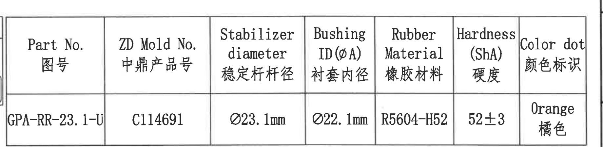

- object_kind: `table`
- 原图位置/视图名称: 页面中下右侧，图框坐标约 10-16/H-I 区域；产品规格参数表
- bbox: `[2940, 1930, 4780, 2380]`
- 边界归属说明: 裁切从 Part No. 列开始，到 Color dot 列结束；左侧 D/E/F 图示表不归属本对象。

### 原表还原
| Part No. 图号 | ZD Mold No. 中鼎产品号 | Stabilizer diameter 稳定杆杆径 | Bushing ID(ØA) 衬套内径 | Rubber Material 橡胶材料 | Hardness (ShA) 硬度 | Color dot 颜色标识 |
| --- | --- | --- | --- | --- | --- | --- |
| GPA-RR-23.1-U | C114691 | Ø23.1mm | Ø22.1mm | R5604-H52 | 52±3 | Orange / 橘色 |

### 提取表格
| 提取项 | 原图数值或文本 | 含义说明 |
|---|---|---|
| Part No. 图号 | GPA-RR-23.1-U | 规格表适用的上件图号。 |
| ZD Mold No. 中鼎产品号 | C114691 | 中鼎产品/模号。 |
| Stabilizer diameter 稳定杆杆径 | Ø23.1mm | 稳定杆杆径，带直径符号。 |
| Bushing ID(ØA) 衬套内径 | Ø22.1mm | 衬套内径，带直径符号，与主视图 Ø22.1±0.3 对应。 |
| Rubber Material 橡胶材料 | R5604-H52 | 橡胶材料牌号。 |
| Hardness (ShA) 硬度 | 52±3 | 邵氏 A 硬度公差。 |
| Color dot 颜色标识 | Orange / 橘色 | 颜色点/颜色标识要求。 |

## object_7 - DIN ISO 3302-1:1999-10 公差表

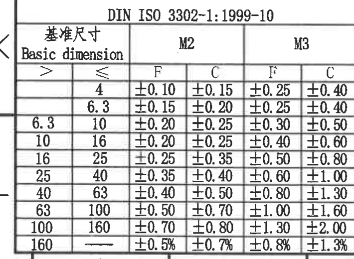

- object_kind: `table`
- 原图位置/视图名称: 页面左下，图框坐标约 1-3/K-L 区域；DIN ISO 3302-1:1999-10 公差表
- bbox: `[330, 2835, 1040, 3355]`
- 边界归属说明: 裁切包含完整表头、区间列和 M2/M3 的 F/C 公差列；右侧技术要求不归属本对象。

### 原表还原
| Basic dimension > | Basic dimension ≤ | M2 F | M2 C | M3 F | M3 C |
| --- | --- | --- | --- | --- | --- |
|  | 4 | ±0.10 | ±0.15 | ±0.25 | ±0.40 |
| 4 | 6.3 | ±0.15 | ±0.20 | ±0.25 | ±0.40 |
| 6.3 | 10 | ±0.20 | ±0.25 | ±0.30 | ±0.50 |
| 10 | 16 | ±0.20 | ±0.25 | ±0.40 | ±0.60 |
| 16 | 25 | ±0.25 | ±0.35 | ±0.50 | ±0.80 |
| 25 | 40 | ±0.35 | ±0.40 | ±0.60 | ±1.00 |
| 40 | 63 | ±0.40 | ±0.50 | ±0.80 | ±1.30 |
| 63 | 100 | ±0.50 | ±0.70 | ±1.00 | ±1.60 |
| 100 | 160 | ±0.70 | ±0.80 | ±1.30 | ±2.00 |
| 160 | — | ±0.5% | ±0.7% | ±0.8% | ±1.3% |

### 提取表格
| 提取项 | 原图数值或文本 | 含义说明 |
|---|---|---|
| 表题 | DIN ISO 3302-1:1999-10 | 橡胶制品尺寸公差标准表。 |
| 等级列 | M2 / M3 | 表内列出 M2 与 M3 两个等级。 |
| 分类列 | F / C | 每个等级下分 F 与 C 两类公差。 |
| 适用说明 | 未注尺寸公差参照 DIN ISO 3302 M3 等级执行 | 该适用说明来自技术要求第 2 条，表格提供对应公差值。 |

## object_8 - 技术要求 NOTES

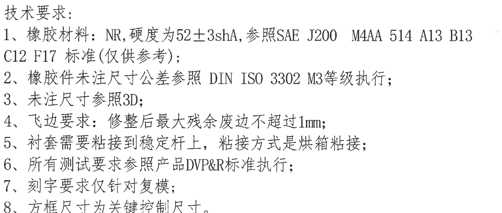

- object_kind: `notes`
- 原图位置/视图名称: 页面下中左侧，图框坐标约 4-9/J-L 区域；技术要求 NOTES
- bbox: `[1080, 2640, 2680, 3320]`
- 边界归属说明: 裁切完整包含“技术要求：”及第 1-8 条文字；不包含右侧标题栏字段。

### 提取表格
| 提取项 | 原图数值或文本 | 含义说明 |
|---|---|---|
| 技术要求 1 | 橡胶材料：NR，硬度为52±3shA，参照SAE J200 M4AA 514 A13 B13 C12 F17 标准(仅供参考)； | 定义橡胶材料、硬度和参考材料标准。 |
| 技术要求 2 | 橡胶件未注尺寸公差参照 DIN ISO 3302 M3等级执行； | 未标注公差尺寸按 DIN ISO 3302 M3。 |
| 技术要求 3 | 未注尺寸参照3D； | 图面未标注尺寸以 3D 数据为参考。 |
| 技术要求 4 | 飞边要求：修整后最大残余废边不超过1mm； | 飞边残余限制为不超过 1mm。 |
| 技术要求 5 | 衬套需要粘接到稳定杆上，粘接方式是烘箱粘接； | 装配/工艺要求。 |
| 技术要求 6 | 所有测试要求参照产品DVP&R标准执行； | 测试按产品 DVP&R 标准。 |
| 技术要求 7 | 刻字要求仅针对复模； | 刻字要求适用范围。 |
| 技术要求 8 | 方框尺寸为关键控制尺寸。 | 带方框尺寸属于关键控制尺寸。 |

## object_10 - 物料明细 BOM 表

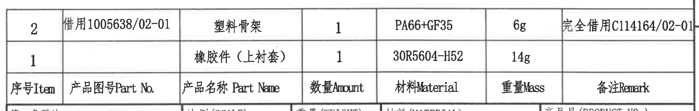

- object_kind: `table`
- 原图位置/视图名称: 页面右下上部，图框坐标约 10-16/I-J 区域；物料明细 BOM 表
- bbox: `[2740, 2440, 4790, 2770]`
- 边界归属说明: 裁切包含两条物料记录和表头；下方第一角画法/比例/重量等标题栏字段不属于 BOM。

### 原表还原
| 序号 Item | 产品图号 Part No. | 产品名称 Part Name | 数量 Amount | 材料 Material | 重量 Mass | 备注 Remark |
| --- | --- | --- | --- | --- | --- | --- |
| 2 | 借用1005638/02-01 | 塑料骨架 | 1 | PA66+GF35 | 6g | 完全借用C114164/02-01 |
| 1 |  | 橡胶件（上衬套） | 1 | 30R5604-H52 | 14g |  |

### 提取表格
| 提取项 | 原图数值或文本 | 含义说明 |
|---|---|---|
| BOM 表头 | 序号Item; 产品图号Part No.; 产品名称Part Name; 数量Amount; 材料Material; 重量Mass; 备注Remark | 物料明细列结构。 |
| 序号 2 | 借用1005638/02-01 / 塑料骨架 / 1 / PA66+GF35 / 6g / 完全借用C114164/02-01 | 塑料骨架借用件记录。 |
| 序号 1 | 橡胶件（上衬套） / 1 / 30R5604-H52 / 14g | 橡胶件上衬套记录。 |

## object_11 - 右下标题栏/签核栏

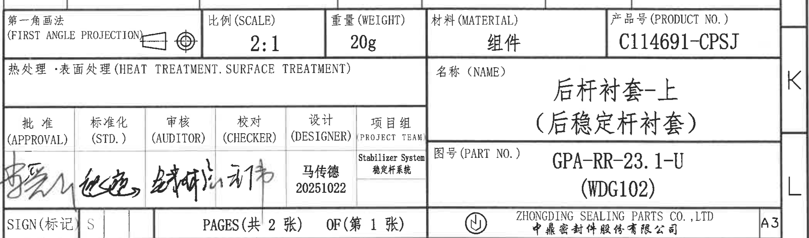

- object_kind: `title_block`
- 原图位置/视图名称: 页面右下，图框坐标约 10-16/J-L 区域；右下标题栏/签核栏
- bbox: `[2750, 2725, 4850, 3345]`
- 边界归属说明: 裁切从第一角画法/比例/重量/材料/产品号行开始，到公司名和 A3 图幅行结束；上方 BOM 行不提取到本对象。

### 提取表格
| 提取项 | 原图数值或文本 | 含义说明 |
|---|---|---|
| 投影法 | 第一角画法 (FIRST ANGLE PROJECTION) | 图纸采用第一角画法。 |
| 比例 | 2:1 | 图纸比例。 |
| 重量 | 20g | 产品/组件重量。 |
| 材料 | 组件 | 标题栏材料字段。 |
| 产品号 | C114691-CPSJ | 标题栏产品号。 |
| 热处理/表面处理 | 空白 | 标题栏该字段未填写。 |
| 名称 | 后杆衬套-上（后稳定杆衬套） | 零件/组件名称。 |
| 图号 | GPA-RR-23.1-U (WDG102) | 标题栏图号和括号内代号。 |
| 批准 | 手写签名，未能辨读为标准文本 | 签核栏批准签名。 |
| 标准化 | 手写签名，未能辨读为标准文本 | 签核栏标准化签名。 |
| 审核 | 手写签名，未能辨读为标准文本 | 签核栏审核签名。 |
| 校对 | 手写签名，未能辨读为标准文本 | 签核栏校对签名。 |
| 设计 | 马传德 / 20251022 | 设计人员和日期。 |
| 项目组 | Stabilizer System / 稳定杆系统 | 项目组名称。 |
| SIGN(标记) | S | 底部标记字段。 |
| 页码 | PAGES(共2张) OF(第1张) | 共 2 张，本页第 1 张。 |
| 公司 | ZHONGDING SEALING PARTS CO.,LTD / 中鼎密封件股份有限公司 | 出图公司。 |
| 图幅 | A3 | 图幅规格。 |

## 裁切检查记录

| 图片 | bbox | 裁切对象 | 检查结论 |
|---|---|---|---|
| outputs/20C114691_assets/images/page_1.png | [0, 0, 4959, 3505] | 整页 PNG | 完整，作为全页坐标基准。 |
| outputs/20C114691_assets/images/object_9.png | [2700, 90, 4800, 520] | 顶部变更履历/来源客户版本栏 | 完整包含表头和首条修订记录；上方坐标格作为定位参照。 |
| outputs/20C114691_assets/images/object_1.png | [350, 500, 2130, 1890] | 左上主加工视图 | 完整包含主视图尺寸线、箭头、刻字说明和颜色标识文字；右侧带入 A-A 编号 1/2 局部线头，已在归属说明中排除。 |
| outputs/20C114691_assets/images/object_2.png | [2060, 520, 3590, 1520] | A-A 剖面视图 | 完整包含剖面外形、编号 1/2、37±0.4、8.95±0.4 和全部括号参考尺寸；顶部有轻微表格边线，不提取。 |
| outputs/20C114691_assets/images/object_3.png | [3700, 780, 4720, 1660] | 右上等轴测视图 | 完整包含两个零件号引线和外观 F 标识；右侧图框边线不提取。 |
| outputs/20C114691_assets/images/object_4.png | [560, 2010, 1420, 2630] | 左下 F 字标识局部视图 | 完整包含 F 字、引线和字高/字深文字；右侧相邻局部轮廓残边不提取。 |
| outputs/20C114691_assets/images/object_5.png | [1410, 1985, 2140, 2625] | 右下线性凸起标识局部视图 | 完整包含双引线和线性凸起标识说明；左上文字残片和右侧表格边线不提取。 |
| outputs/20C114691_assets/images/object_6.png | [1970, 1870, 2970, 2390] | 线性凸起区分标识 D/E/F 示意表 | 完整包含表题、D/E/F 表头和示意图；右侧规格表边线不提取。 |
| outputs/20C114691_assets/images/object_12.png | [2940, 1930, 4780, 2380] | 产品规格参数表 | 完整包含所有列和数据行；左侧 D/E/F 示意表不提取到本对象。 |
| outputs/20C114691_assets/images/object_7.png | [330, 2835, 1040, 3355] | DIN ISO 3302-1:1999-10 公差表 | 完整包含标题、基准尺寸区间和 M2/M3 F/C 公差列；右侧技术要求已排除。 |
| outputs/20C114691_assets/images/object_8.png | [1080, 2640, 2680, 3320] | 技术要求 NOTES | 完整包含第 1-8 条技术要求文字；右侧标题栏边线已排除。 |
| outputs/20C114691_assets/images/object_10.png | [2740, 2440, 4790, 2770] | 物料明细 BOM 表 | 完整包含 BOM 表头和两条物料记录；下方标题栏字段不提取。 |
| outputs/20C114691_assets/images/object_11.png | [2750, 2725, 4850, 3345] | 右下标题栏/签核栏 | 完整包含标题栏、签核栏、页码、公司名和 A3 图幅；上方 BOM 不提取到本对象。 |
