# 20C114696 图纸内容识别
源文件: `input/20C114696.pdf`
整页渲染图: `outputs/20C114696_assets/images/page_1.png`
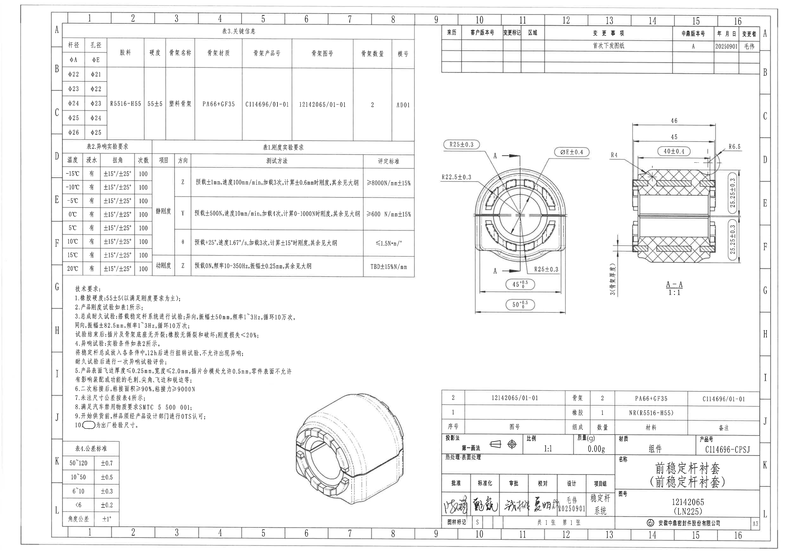
## object_1 - 表3.关键信息
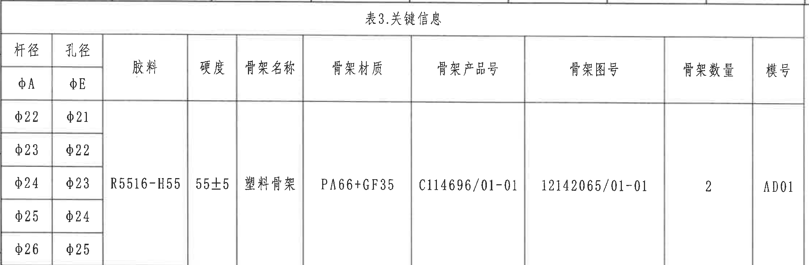
原图位置/视图名称: page 1, bbox [390, 145, 2625, 880], 表3.关键信息。
| 杆径 φA | 孔径 φE | 胶料 | 硬度 | 骨架名称 | 骨架材质 | 骨架产品号 | 骨架图号 | 骨架数量 | 模号 |
|---|---|---|---|---|---|---|---|---|---|
| φ22 | φ21 |  |  |  |  |  |  |  |  |
| φ23 | φ22 |  |  |  |  |  |  |  |  |
| φ24 | φ23 | R5516-H55 | 55±5 | 塑料骨架 | PA66+GF35 | C114696/01-01 | 12142065/01-01 | 2 | AD01 |
| φ25 | φ24 |  |  |  |  |  |  |  |  |
| φ26 | φ25 |  |  |  |  |  |  |  |  |

| 提取项 | 原图数值或文本 | 含义说明 |
|---|---|---|
| 杆径/孔径系列 | φ22/φ21, φ23/φ22, φ24/φ23, φ25/φ24, φ26/φ25 | 表示不同杆径 φA 与孔径 φE 的匹配系列。 |
| 胶料 | R5516-H55 | 橡胶材料牌号。 |
| 硬度 | 55±5 | 橡胶硬度要求，与技术要求第1条一致。 |
| 骨架信息 | 塑料骨架, PA66+GF35, C114696/01-01, 12142065/01-01, 数量2, 模号AD01 | 定义骨架名称、材质、产品号、图号、数量和模号。 |
边界归属说明: 裁切对象为左上关键信息表；上方轻微图框线不作为表格内容。

## object_2 - 修订履历表
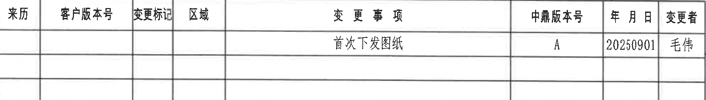
原图位置/视图名称: page 1, bbox [2795, 165, 4790, 450], 修订履历表。
| 来历 | 客户版本号 | 变更标记 | 区域 | 变更事项 | 中鼎版本号 | 年月日 | 变更者 |
|---|---|---|---|---|---|---|---|
|  |  |  |  | 首次下发图纸 | A | 20250901 | 毛伟 |
|  |  |  |  |  |  |  |  |
|  |  |  |  |  |  |  |  |

| 提取项 | 原图数值或文本 | 含义说明 |
|---|---|---|
| 变更事项 | 首次下发图纸 | 表示本版本首次发布/下发。 |
| 中鼎版本号 | A | 当前图纸内部版本。 |
| 年月日/变更者 | 20250901 / 毛伟 | 变更日期和变更人。 |
边界归属说明: 右上修订表单独裁切；外部图框坐标不作为表格字段。

## object_3 - 表2.异响实验要求
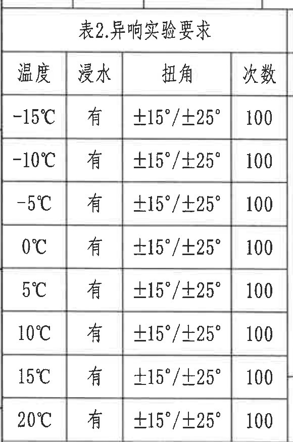
原图位置/视图名称: page 1, bbox [390, 865, 970, 1740], 表2.异响实验要求。
| 温度 | 浸水 | 扭角 | 次数 |
|---|---|---|---|
| -15°C | 有 | ±15°/±25° | 100 |
| -10°C | 有 | ±15°/±25° | 100 |
| -5°C | 有 | ±15°/±25° | 100 |
| 0°C | 有 | ±15°/±25° | 100 |
| 5°C | 有 | ±15°/±25° | 100 |
| 10°C | 有 | ±15°/±25° | 100 |
| 15°C | 有 | ±15°/±25° | 100 |
| 20°C | 有 | ±15°/±25° | 100 |

| 提取项 | 原图数值或文本 | 含义说明 |
|---|---|---|
| 温度条件 | -15°C 至 20°C 共8档 | 异响实验覆盖的环境温度档。 |
| 浸水 | 有 | 每档温度均要求浸水。 |
| 扭角 | ±15°/±25° | 扭转角度条件。 |
| 次数 | 100 | 每档测试次数。 |
边界归属说明: 右侧与表1相邻，裁切仅保留表2四列；表1项目/方向列不属于本对象。

## object_4 - 表1.刚度实验要求
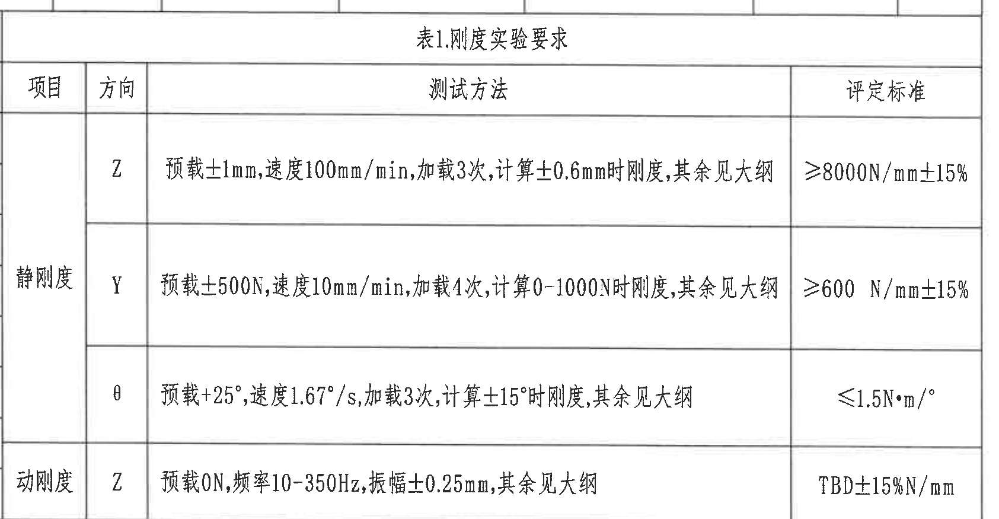
原图位置/视图名称: page 1, bbox [955, 865, 2640, 1740], 表1.刚度实验要求。
| 项目 | 方向 | 测试方法 | 评定标准 |
|---|---|---|---|
| 静刚度 | Z | 预载±1mm, 速度100mm/min, 加载3次, 计算±0.6mm时刚度, 其余见大纲 | ≥8000N/mm±15% |
| 静刚度 | Y | 预载±500N, 速度10mm/min, 加载4次, 计算0-1000N时刚度, 其余见大纲 | ≥600 N/mm±15% |
| 静刚度 | θ | 预载+25°, 速度1.67°/s, 加载3次, 计算±15°时刚度, 其余见大纲 | ≤1.5N·m/° |
| 动刚度 | Z | 预载0N, 频率10-350Hz, 振幅±0.25mm, 其余见大纲 | TBD±15%N/mm |

| 提取项 | 原图数值或文本 | 含义说明 |
|---|---|---|
| 静刚度 Z | 预载±1mm, 速度100mm/min, 加载3次, 计算±0.6mm时刚度 | Z向静刚度测试条件。 |
| 静刚度 Y | 预载±500N, 速度10mm/min, 加载4次, 计算0-1000N时刚度 | Y向静刚度测试条件。 |
| 静刚度 θ | 预载+25°, 速度1.67°/s, 加载3次, 计算±15°时刚度 | 扭转方向静刚度测试条件。 |
| 动刚度 Z | 预载0N, 频率10-350Hz, 振幅±0.25mm | Z向动态刚度测试条件。 |
边界归属说明: 左边界与表2共线；表1只提取项目、方向、测试方法和评定标准，不含表2温度条件。

## object_5 - 技术要求/NOTES
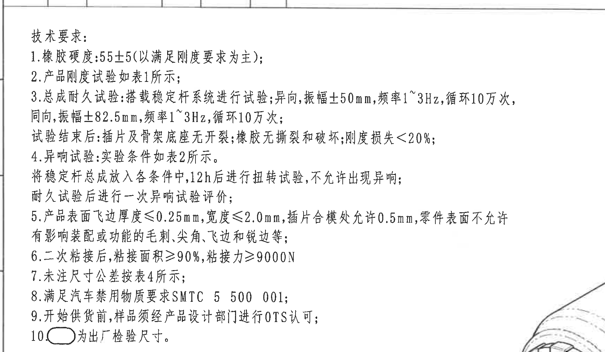
原图位置/视图名称: page 1, bbox [385, 1720, 2115, 2730], 技术要求/NOTES。
| 提取项 | 原图数值或文本 | 含义说明 |
|---|---|---|
| 技术要求1 | 橡胶硬度:55±5(以满足刚度要求为主) | 橡胶硬度以刚度满足为主。 |
| 技术要求2 | 产品刚度试验如表1所示 | 刚度试验条件引用表1。 |
| 技术要求3 | 总成耐久试验: 异向振幅±50mm, 频率1~3Hz, 循环10万次; 同向振幅±82.5mm, 频率1~3Hz, 循环10万次; 试验后无开裂/撕裂/破坏, 刚度损失<20% | 耐久试验条件和验收要求。 |
| 技术要求4 | 异响试验: 实验条件如表2所示; 放入各条件中12h后扭转试验, 不允许出现异响; 耐久试验后进行一次异响试验评价 | 异响试验流程与判定。 |
| 技术要求5 | 飞边厚度≤0.25mm, 宽度≤2.0mm; 插片合模处允许0.5mm; 表面不允许影响装配或功能的毛刺、尖角、飞边和锐边等 | 外观与飞边控制。 |
| 技术要求6 | 二次粘接后, 粘接面积≥90%, 粘接力≥9000N | 粘接质量要求。 |
| 技术要求7 | 未注尺寸公差按表4所示 | 未注公差引用表4。 |
| 技术要求8 | 满足汽车禁用物质要求 SMTC 5 500 001 | 禁用物质标准要求。 |
| 技术要求9 | 开始供货前, 样品须经产品设计部门进行OTS认可 | 量产/供货前认可要求。 |
| 技术要求10 | 椭圆圈符号为出厂检验尺寸 | 图中带椭圆圈的尺寸为出厂检验尺寸。 |
边界归属说明: 右下角可见相邻轴测图边缘，为保留第10条符号而纳入裁片边缘；该边缘不作为 NOTES 内容提取。

## object_6 - 表4.公差标准
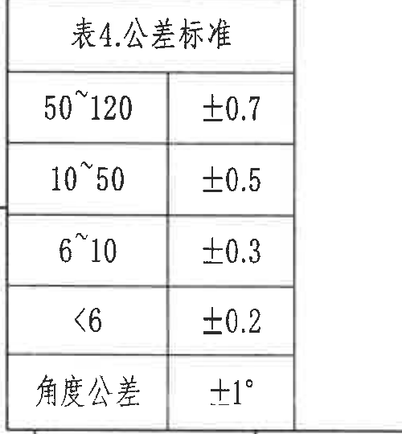
原图位置/视图名称: page 1, bbox [385, 2790, 885, 3330], 表4.公差标准。
| 尺寸范围 | 公差 |
|---|---|
| 50~120 | ±0.7 |
| 10~50 | ±0.5 |
| 6~10 | ±0.3 |
| <6 | ±0.2 |
| 角度公差 | ±1° |

| 提取项 | 原图数值或文本 | 含义说明 |
|---|---|---|
| 未注线性尺寸 | 50~120:±0.7; 10~50:±0.5; 6~10:±0.3; <6:±0.2 | 适用于图中未单独标注公差的线性尺寸。 |
| 未注角度 | ±1° | 适用于未注角度尺寸。 |
边界归属说明: 左下独立公差表，未混入 NOTES 或标题栏内容。

## object_7 - 主视图/正视加工视图
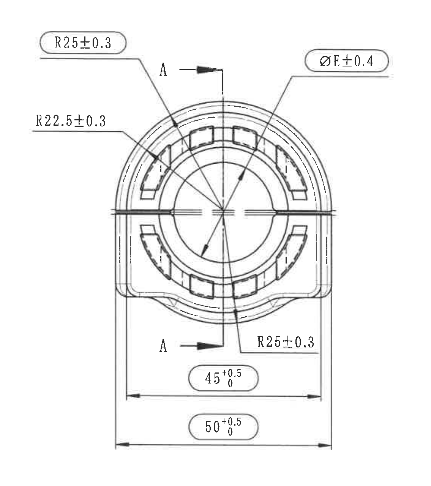
原图位置/视图名称: page 1, bbox [2690, 800, 3825, 2080], 主视图/正视加工视图。
| 提取项 | 原图数值或文本 | 含义说明 |
|---|---|---|
| 半径尺寸 | R25±0.3 | 上左外圆弧半径，椭圆圈关键/出厂检验尺寸。 |
| 半径尺寸 | R22.5±0.3 | 左侧内环/弧向半径尺寸。 |
| 直径尺寸 | ØE±0.4 | 孔径E直径尺寸；E的系列值由表3孔径列给出。 |
| 半径尺寸 | R25±0.3 | 下右外圆弧半径。 |
| 横向尺寸 | 45 +0.5/0 | 内侧底部宽度或相关横向尺寸，椭圆圈关键/出厂检验尺寸。 |
| 总宽尺寸 | 50 +0.5/0 | 外侧总宽度，椭圆圈关键/出厂检验尺寸。 |
| 剖切基准 | A-A | 两处A箭头定义A-A剖面切割方向。 |
边界归属说明: 主视图只提取正视方向尺寸。R4、3(骨架厚度)等箭头指向右侧剖面，归入 object_8；未把剖面尺寸归入主视图。

## object_8 - A-A 剖面视图 1:1
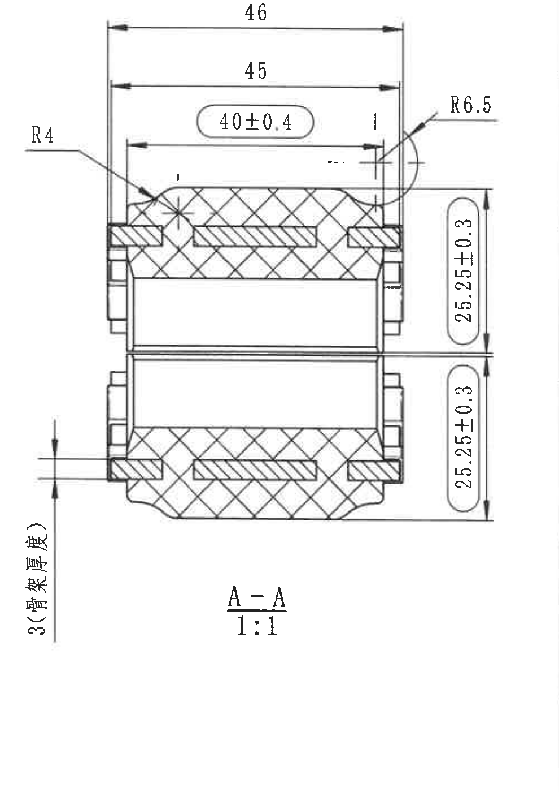
原图位置/视图名称: page 1, bbox [3795, 740, 4785, 2140], A-A 剖面视图。
| 提取项 | 原图数值或文本 | 含义说明 |
|---|---|---|
| 横向尺寸 | 46 | 顶部最大横向尺寸。 |
| 横向尺寸 | 45 | 顶部第二横向尺寸。 |
| 关键横向尺寸 | 40±0.4 | 内部横向宽度，椭圆圈关键/出厂检验尺寸。 |
| 半径尺寸 | R4 | 左上剖面局部圆角半径。 |
| 半径尺寸 | R6.5 | 右上外圆角半径。 |
| 竖向尺寸 | 25.25±0.3 | 上半部竖向高度/厚度尺寸，椭圆圈关键/出厂检验尺寸。 |
| 竖向尺寸 | 25.25±0.3 | 下半部竖向高度/厚度尺寸，椭圆圈关键/出厂检验尺寸。 |
| 厚度尺寸 | 3(骨架厚度) | 骨架厚度标注，箭头指向剖面局部厚度。 |
| 剖面标识 | A-A 1:1 | 剖面名称和比例。 |
边界归属说明: 该裁片完整包含剖面尺寸线、箭头和文字。左侧 3(骨架厚度)虽靠近主视图，但尺寸箭头指向剖面厚度，归本对象。

## object_9 - 轴测图/三维外形视图
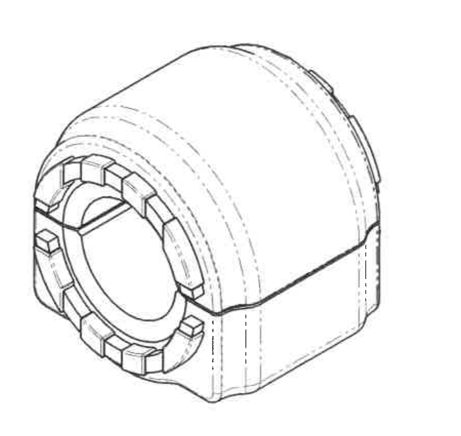
原图位置/视图名称: page 1, bbox [1800, 2400, 2700, 3250], 轴测图/三维外形视图。
| 提取项 | 原图数值或文本 | 含义说明 |
|---|---|---|
| 尺寸标注 | 无 | 该视图未标注尺寸、角度或公差。 |
| 三维结构 | 圆筒/套筒主体、前端内孔、环形齿/凸块、外侧壳体台阶、侧面分型线 | 用于表达零件立体外形和结构方向。 |
边界归属说明: 裁片只包含轴测图本体，未混入技术要求文字或标题栏。

## object_10 - BOM/标题栏
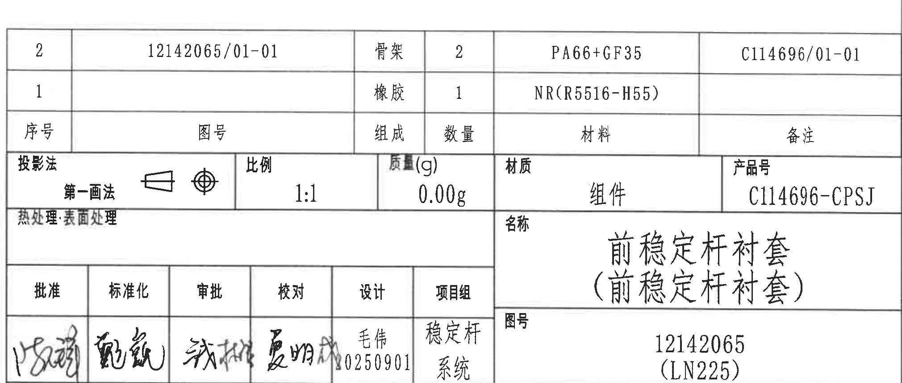
原图位置/视图名称: page 1, bbox [2768, 2398, 4788, 3258], BOM/标题栏。
| 序号 | 图号 | 组成 | 数量 | 材料 | 备注 |
|---|---|---|---|---|---|
| 2 | 12142065/01-01 | 骨架 | 2 | PA66+GF35 | C114696/01-01 |
| 1 |  | 橡胶 | 1 | NR(R5516-H55) |  |

| 标题栏字段 | 原图数值或文本 | 含义说明 |
|---|---|---|
| 投影法 | 第一画法 | 采用第一角法投影。 |
| 比例 | 1:1 | 图样比例。 |
| 质量(g) | 0.00g | 标题栏质量字段。 |
| 材质 | 组件 | 总成/组件材质栏。 |
| 产品号 | C114696-CPSJ | 产品编号。 |
| 热处理/表面处理 | 空白 | 原图未填写。 |
| 名称 | 前稳定杆衬套(前稳定杆衬套) | 零件/总成名称。 |
| 图号 | 12142065 (LN225) | 图纸编号及括号内项目/平台标识。 |
| 签字区 | 批准、标准化、审批、校对、设计、项目组; 设计 毛伟 0250901; 项目组 稳定杆系统 | 审批和责任栏。 |
| 图样标记/张数/图幅/公司 | S; 共1张 第1张; A3; 安徽中鼎密封件股份有限公司 | 图纸状态、页数、图幅和公司信息。 |
边界归属说明: 标题栏位于右下角，包含BOM明细、投影/比例/质量/产品号、名称图号和签字区；外部纸框坐标不提取。

## 裁切检查记录
| 对象 | 检查结果 | 是否完整包含尺寸线和文字 | 边界/归属处理 |
|---|---|---|---|
| object_1 表3.关键信息 | 表题、表头、杆径/孔径系列和主数据行完整。 | 是 | 上方仅有轻微图框线，未提取为内容。 |
| object_2 修订履历表 | 表头和首条修订记录完整，空白行保留。 | 是 | 外部坐标编号已排除；右侧图框未作为字段。 |
| object_3 表2.异响实验要求 | 四列和8个温度行完整。 | 是 | 右侧表1相邻内容已排除。 |
| object_4 表1.刚度实验要求 | 项目/方向/测试方法/评定标准完整。 | 是 | 左侧表2内容未提取到本对象。 |
| object_5 技术要求/NOTES | 1-10条文字完整，含第10条椭圆符号。 | 是 | 右下角有少量轴测图边缘，为避免切断第10条符号保留；不提取为NOTES内容。 |
| object_6 表4.公差标准 | 表题、范围和公差完整。 | 是 | 独立表格，无混入内容。 |
| object_7 主视图 | R25±0.3、R22.5±0.3、ØE±0.4、45+0.5/0、50+0.5/0和A-A箭头完整。 | 是 | R4和3(骨架厚度)归属剖面，不在主视图提取。 |
| object_8 A-A剖面 | 46、45、40±0.4、R4、R6.5、两处25.25±0.3、3(骨架厚度)、A-A 1:1完整。 | 是 | 左侧厚度标注归本剖面，右侧外部图框坐标已排除。 |
| object_9 轴测图 | 三维外形完整，无尺寸文字。 | 是 | 未混入NOTES或标题栏。 |
| object_10 BOM/标题栏 | BOM两行、投影法、比例、质量、材质、产品号、名称、图号、签字区和公司信息完整。 | 是 | 外部图框坐标未提取。 |
