# 20C114697 内容识别

PDF：`input/20C114697.pdf`

整页渲染图：`outputs/20C114697_assets/images/page_1.png`

页面信息：第 1 页，整页 PNG 尺寸 4959 x 3505 px。以下 bbox 均为整页 PNG 像素坐标，格式为 `[x1, y1, x2, y2]`。

## object_1 - 表3.关键信息

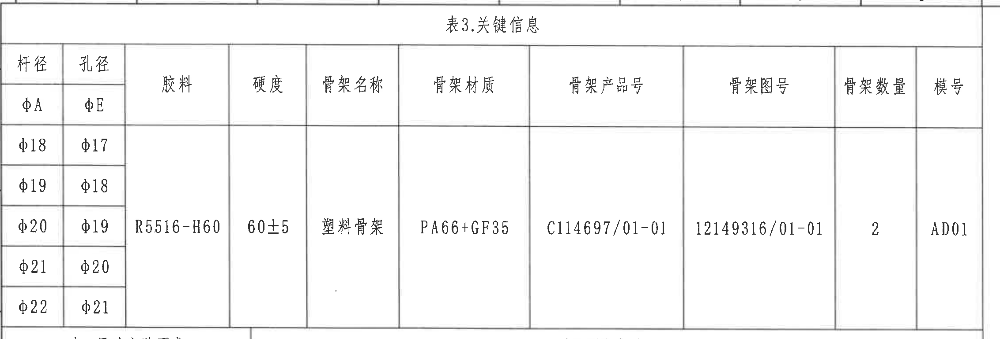

原图位置/视图名称：第 1 页左上，表3.关键信息，bbox `[380, 145, 2645, 915]`。

| 杆径 φA | 孔径 φE | 胶料 | 硬度 | 骨架名称 | 骨架材质 | 骨架产品号 | 骨架图号 | 骨架数量 | 模号 |
|---|---|---|---|---|---|---|---|---|---|
| φ18 | φ17 |  |  |  |  |  |  |  |  |
| φ19 | φ18 |  |  |  |  |  |  |  |  |
| φ20 | φ19 | R5516-H60 | 60±5 | 塑料骨架 | PA66+GF35 | C114697/01-01 | 12149316/01-01 | 2 | AD01 |
| φ21 | φ20 |  |  |  |  |  |  |  |  |
| φ22 | φ21 |  |  |  |  |  |  |  |  |

| 提取项 | 原图数值或文本 | 含义说明 |
|---|---|---|
| 表名 | 表3.关键信息 | 物料、骨架、孔径/杆径组合的关键信息表。 |
| 杆径/孔径组合 | φ18/φ17、φ19/φ18、φ20/φ19、φ21/φ20、φ22/φ21 | 适配杆径 φA 与孔径 φE 的组合；φ 为直径符号。 |
| 胶料 | R5516-H60 | 橡胶材料牌号。 |
| 硬度 | 60±5 | 橡胶硬度要求，允许偏差 ±5；技术要求第 1 条说明以满足刚度要求为主。 |
| 骨架名称 | 塑料骨架 | 骨架件名称。 |
| 骨架材质 | PA66+GF35 | 骨架材料为 PA66 加 35% 玻纤。 |
| 骨架产品号 | C114697/01-01 | 骨架产品号。 |
| 骨架图号 | 12149316/01-01 | 骨架图号。 |
| 骨架数量 | 2 | 每组件骨架数量。 |
| 模号 | AD01 | 模具编号。 |

边界归属说明：裁切仅包含表3主体和表名；下边界靠近表1/表2分界线，但未提取下方试验表内容。

## object_2 - 变更履历表

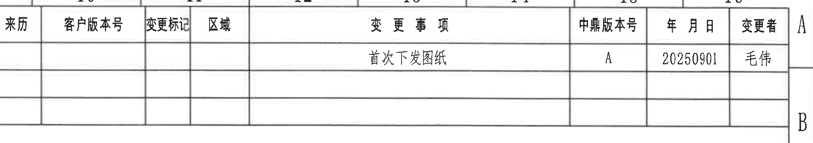

原图位置/视图名称：第 1 页右上，变更履历表，bbox `[2795, 145, 4840, 505]`。

| 来历 | 客户版本号 | 变更标记 | 区域 | 变更事项 | 中鼎版本号 | 年月日 | 变更者 |
|---|---|---|---|---|---|---|---|
|  |  |  |  | 首次下发图纸 | A | 20250901 | 毛伟 |
|  |  |  |  |  |  |  |  |
|  |  |  |  |  |  |  |  |

| 提取项 | 原图数值或文本 | 含义说明 |
|---|---|---|
| 表格类型 | 变更履历表 | 记录图纸版本变更。 |
| 变更事项 | 首次下发图纸 | 本次记录为首次下发。 |
| 中鼎版本号 | A | 当前中鼎版本。 |
| 年月日 | 20250901 | 变更日期。 |
| 变更者 | 毛伟 | 变更人员。 |

边界归属说明：裁切完整保留修订表头和三行记录框；右侧可见图框分区字母 A/B 属于图框边界，不作为履历字段。

## object_3 - 主加工视图

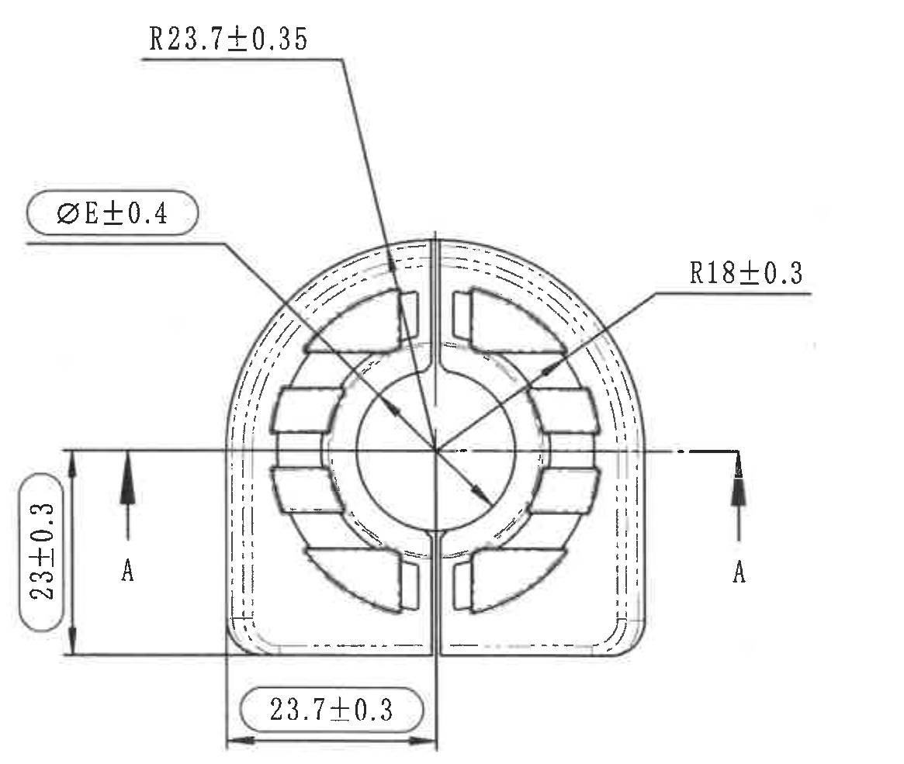

原图位置/视图名称：第 1 页右上主加工视图，bbox `[3250, 520, 4415, 1505]`。

| 提取项 | 原图数值或文本 | 含义说明 |
|---|---|---|
| 外圆/外弧半径 | R23.7±0.35 | 顶部外弧半径尺寸，带引出线指向外侧圆弧；R 表示半径，公差 ±0.35。 |
| 内圆/内弧半径 | R18±0.3 | 右侧引出线指向内侧圆弧/内轮廓；R 表示半径，公差 ±0.3。 |
| 孔径/配合直径 | φE±0.4 | 左上圆角框标注，指向中心孔/孔径相关尺寸；φE 与表3孔径列对应，公差 ±0.4。 |
| 左侧高度尺寸 | 23±0.3 | 左侧竖向尺寸，使用圆角框标注；表示左侧外形高度/局部高度，公差 ±0.3。 |
| 底部宽度尺寸 | 23.7±0.3 | 底部横向尺寸，使用圆角框标注；表示底部至中心分割线的局部宽度，公差 ±0.3。 |
| 剖切标识 | A、A | 主视图左右两侧剖切箭头和字母，定义 A-A 剖面位置。 |

边界归属说明：本裁切只包含主加工视图及其尺寸引线、箭头和 A-A 剖切标识；下方 A-A 剖视图标题未纳入本对象。靠近底部的 23.7±0.3 根据完整水平尺寸线和箭头归属于主加工视图。

## object_4 - A-A 剖面视图

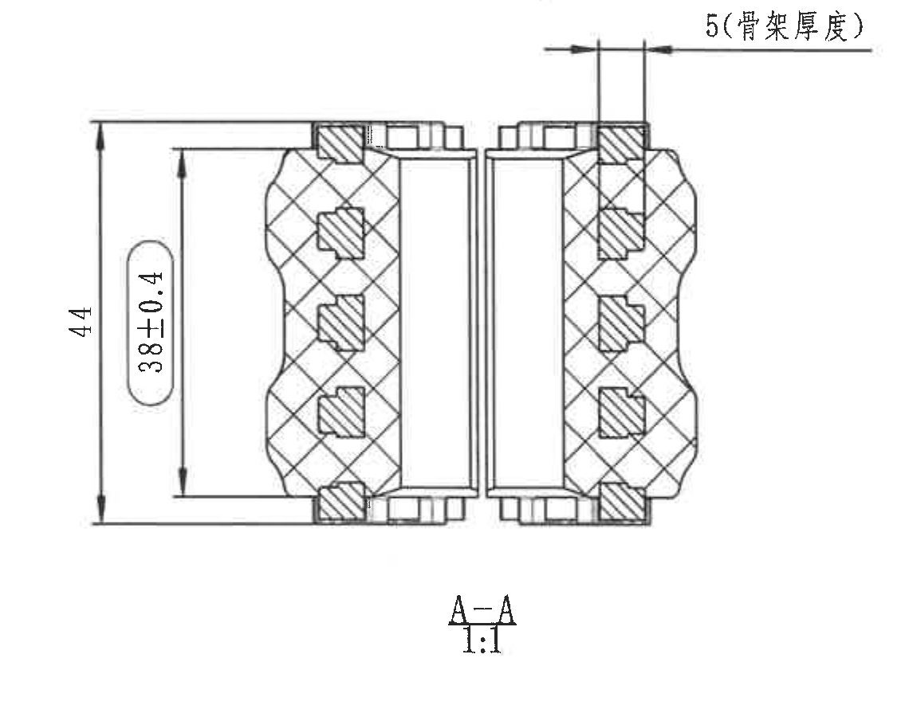

原图位置/视图名称：第 1 页右中，A-A 剖面视图，bbox `[3210, 1530, 4340, 2430]`。

| 提取项 | 原图数值或文本 | 含义说明 |
|---|---|---|
| 骨架厚度 | 5(骨架厚度) | 顶部横向尺寸，括号文字说明 5 为骨架厚度；括号表示说明性文字，不应忽略。 |
| 总高度 | 44 | 左侧外部竖向总高度尺寸。 |
| 内部高度 | 38±0.4 | 左侧内部竖向尺寸，圆角框标注；公差 ±0.4。 |
| 剖面编号 | A-A | 与主视图剖切标识对应的剖面名称。 |
| 比例 | 1:1 | 剖面视图比例。 |

边界归属说明：裁切包含完整剖面外形、剖面线、5(骨架厚度)、44、38±0.4、A-A 和 1:1。主加工视图尺寸未纳入本对象，剖面尺寸不归入主视图。

## object_5 - 轴测图

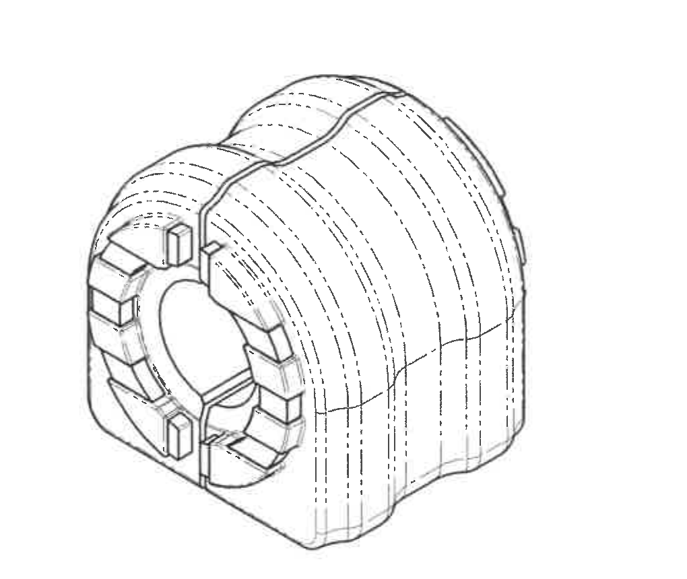

原图位置/视图名称：第 1 页下中偏右，轴测图，bbox `[1720, 2370, 2740, 3230]`。

| 提取项 | 原图数值或文本 | 含义说明 |
|---|---|---|
| 视图类型 | 轴测图/立体外观图 | 展示组件三维外形、波纹外轮廓、前端卡槽和内部孔。 |
| 尺寸标注 | 无 | 本裁切对象内未标注尺寸、公差、剖切符号或文字字段。 |

边界归属说明：裁切仅保留轴测图外形；右侧标题栏/表格线已避开，未将标题栏内容归入轴测图。

## object_6 - 表2.异响实验要求

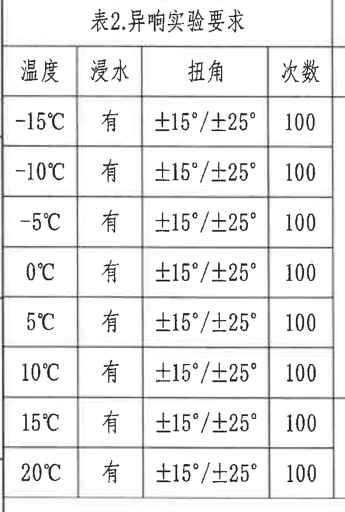

原图位置/视图名称：第 1 页左中，表2.异响实验要求，bbox `[380, 895, 970, 1770]`。

| 温度 | 浸水 | 扭角 | 次数 |
|---|---|---|---|
| -15℃ | 有 | ±15°/±25° | 100 |
| -10℃ | 有 | ±15°/±25° | 100 |
| -5℃ | 有 | ±15°/±25° | 100 |
| 0℃ | 有 | ±15°/±25° | 100 |
| 5℃ | 有 | ±15°/±25° | 100 |
| 10℃ | 有 | ±15°/±25° | 100 |
| 15℃ | 有 | ±15°/±25° | 100 |
| 20℃ | 有 | ±15°/±25° | 100 |

| 提取项 | 原图数值或文本 | 含义说明 |
|---|---|---|
| 温度范围 | -15℃、-10℃、-5℃、0℃、5℃、10℃、15℃、20℃ | 异响试验的温度点。 |
| 浸水 | 有 | 每个温度点均要求浸水。 |
| 扭角 | ±15°/±25° | 试验扭转角度条件，两个角度等级均需执行。 |
| 次数 | 100 | 每个温度点试验次数。 |

边界归属说明：裁切完整包含表2标题、四列表头和 8 行数据；右侧表1内容未纳入本对象。

## object_7 - 表1.刚度实验要求

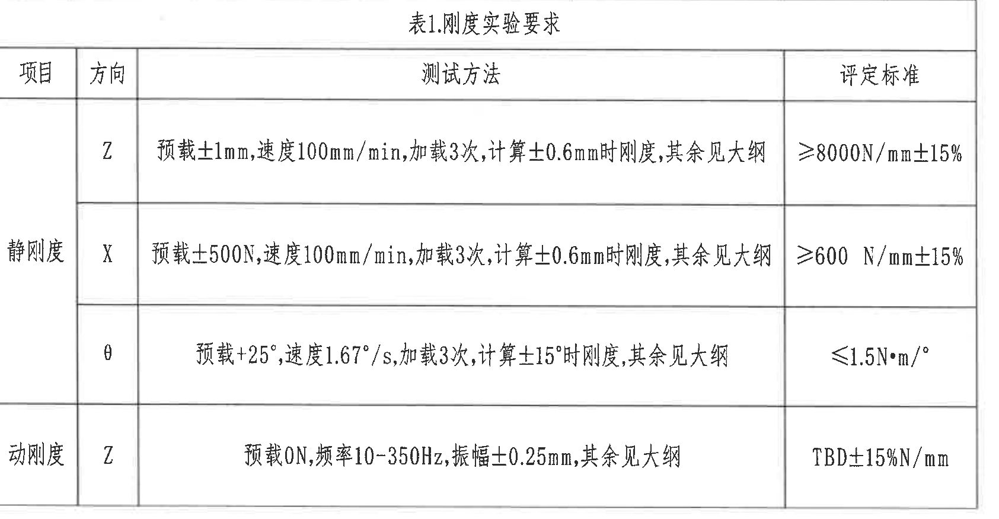

原图位置/视图名称：第 1 页中部，表1.刚度实验要求，bbox `[960, 895, 2645, 1770]`。

| 项目 | 方向 | 测试方法 | 评定标准 |
|---|---|---|---|
| 静刚度 | Z | 预载±1mm,速度100mm/min,加载3次,计算±0.6mm时刚度,其余见大纲 | ≥8000N/mm±15% |
| 静刚度 | X | 预载±500N,速度100mm/min,加载3次,计算±0.6mm时刚度,其余见大纲 | ≥600 N/mm±15% |
| 静刚度 | θ | 预载±25°,速度1.67°/s,加载3次,计算±15°时刚度,其余见大纲 | ≤1.5N·m/° |
| 动刚度 | Z | 预载0N,频率10-350Hz,振幅±0.25mm,其余见大纲 | TBD±15%N/mm |

| 提取项 | 原图数值或文本 | 含义说明 |
|---|---|---|
| 静刚度 Z | ≥8000N/mm±15% | Z 向静刚度评定标准；测试以 ±0.6mm 位移计算刚度。 |
| 静刚度 X | ≥600 N/mm±15% | X 向静刚度评定标准；测试以 ±0.6mm 位移计算刚度。 |
| 静刚度 θ | ≤1.5N·m/° | 扭转角方向静刚度评定标准；测试以 ±15° 计算刚度。 |
| 动刚度 Z | TBD±15%N/mm | Z 向动态刚度标准暂定；频率 10-350Hz，振幅 ±0.25mm。 |

边界归属说明：裁切完整包含表1标题、表头和四行测试要求；左侧表2内容未纳入本对象。

## object_8 - NOTES/技术要求

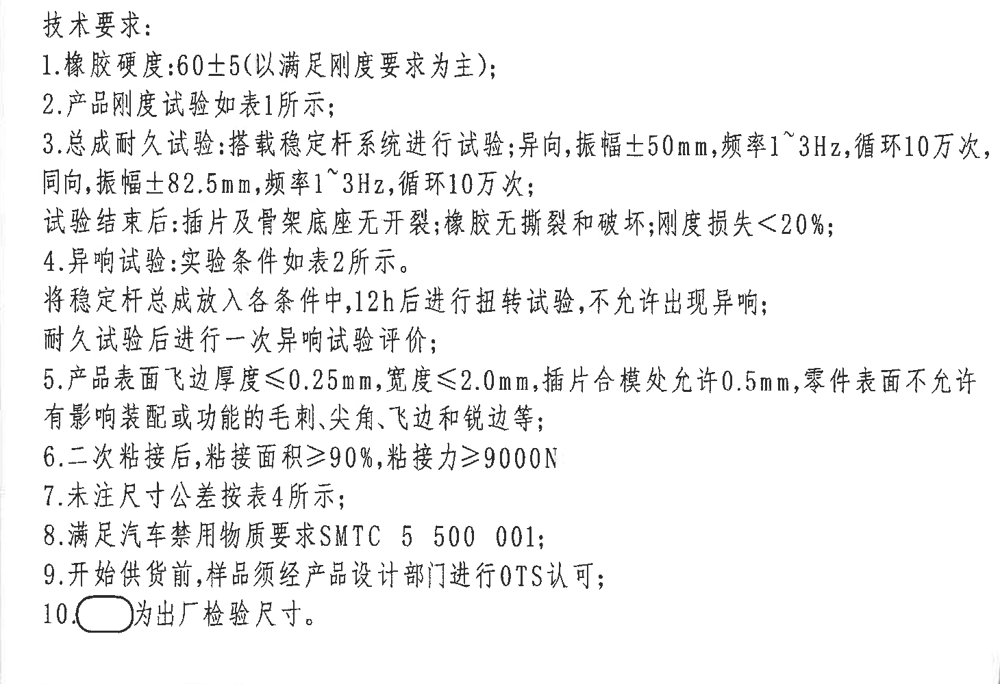

原图位置/视图名称：第 1 页左下，技术要求/NOTES，bbox `[390, 1785, 1850, 2785]`。

| 提取项 | 原图数值或文本 | 含义说明 |
|---|---|---|
| 标题 | 技术要求: | 技术说明区标题。 |
| 1 | 橡胶硬度:60±5(以满足刚度要求为主); | 橡胶硬度要求，括号说明以刚度满足为主要判定。 |
| 2 | 产品刚度试验如表1所示; | 刚度试验按表1执行。 |
| 3 | 总成耐久试验:搭载稳定杆系统进行试验;异向,振幅±50mm,频率1~3Hz,循环10万次,同向,振幅±82.5mm,频率1~3Hz,循环10万次;试验结束后:插片及骨架底座无开裂,橡胶无撕裂和破坏,刚度损失<20%; | 总成耐久试验条件和合格判定。 |
| 4 | 异响试验:实验条件如表2所示。将稳定杆总成放入各条件中,12h后进行扭转试验,不允许出现异响;耐久试验后进行一次异响试验评价; | 异响试验按表2条件，并包含耐久后复评。 |
| 5 | 产品表面飞边厚度≤0.25mm,宽度≤2.0mm,插片合模处允许0.5mm,零件表面不允许有影响装配或功能的毛刺、尖角、飞边和锐边等; | 外观/飞边/毛刺要求。 |
| 6 | 二次粘接后,粘接面积≥90%,粘接力≥9000N | 二次粘接面积和粘接力要求。 |
| 7 | 未注尺寸公差按表4所示; | 未注尺寸公差引用表4。 |
| 8 | 满足汽车禁用物质要求SMTC 5 500 001; | 材料/环保限制标准。 |
| 9 | 开始供货前,样品须经产品设计部门进行OTS认可; | 供货前样品认可要求。 |
| 10 | 圆角框符号为出厂检验尺寸。 | 圆角框内尺寸为出厂检验尺寸。 |

边界归属说明：裁切只包含技术要求 1-10 条；右下轴测图已避开。顶部保留少量上方表格边线用于定位，但未提取为 NOTES 内容。

## object_9 - 表4.公差标准

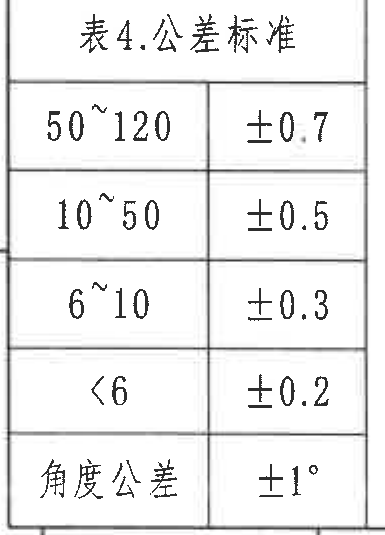

原图位置/视图名称：第 1 页左下角，表4.公差标准，bbox `[380, 2805, 765, 3340]`。

| 尺寸范围/项目 | 公差 |
|---|---|
| 50~120 | ±0.7 |
| 10~50 | ±0.5 |
| 6~10 | ±0.3 |
| <6 | ±0.2 |
| 角度公差 | ±1° |

| 提取项 | 原图数值或文本 | 含义说明 |
|---|---|---|
| 表名 | 表4.公差标准 | 未注尺寸公差标准。 |
| 50~120 | ±0.7 | 线性尺寸范围 50 到 120 的默认公差。 |
| 10~50 | ±0.5 | 线性尺寸范围 10 到 50 的默认公差。 |
| 6~10 | ±0.3 | 线性尺寸范围 6 到 10 的默认公差。 |
| <6 | ±0.2 | 小于 6 的线性尺寸默认公差。 |
| 角度公差 | ±1° | 未注角度尺寸默认公差。 |

边界归属说明：裁切完整包含表4标题和全部行；下方图框坐标数字残片不作为表4内容提取。

## object_10 - 明细/BOM 表

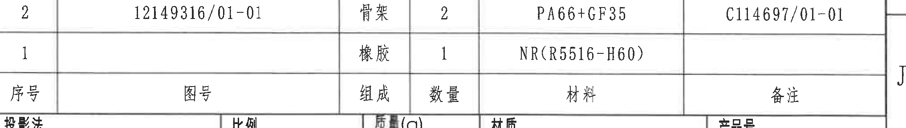

原图位置/视图名称：第 1 页右下，明细/BOM 表，bbox `[2795, 2485, 4830, 2775]`。

| 序号 | 图号 | 组成 | 数量 | 材料 | 备注 |
|---|---|---|---|---|---|
| 2 | 12149316/01-01 | 骨架 | 2 | PA66+GF35 | C114697/01-01 |
| 1 |  | 橡胶 | 1 | NR(R5516-H60) |  |

| 提取项 | 原图数值或文本 | 含义说明 |
|---|---|---|
| 序号 2 | 图号 12149316/01-01；组成 骨架；数量 2；材料 PA66+GF35；备注 C114697/01-01 | 骨架明细行。 |
| 序号 1 | 组成 橡胶；数量 1；材料 NR(R5516-H60) | 橡胶明细行。 |

边界归属说明：裁切完整包含 BOM 表头和两条物料记录；下方投影法、比例、质量等标题栏字段不归入此对象。

## object_11 - 标题栏

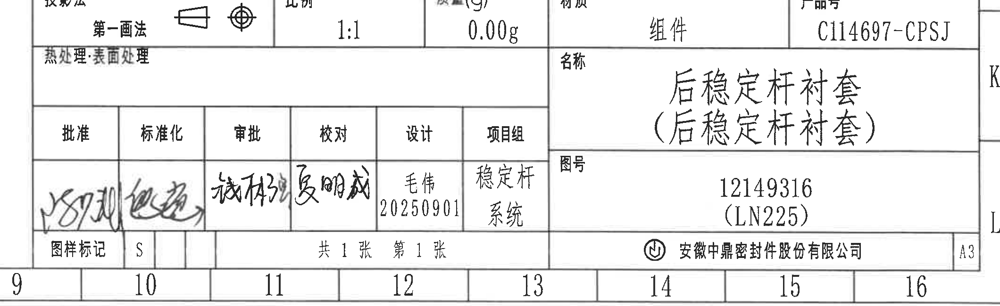

原图位置/视图名称：第 1 页右下标题栏，bbox `[2710, 2770, 4830, 3420]`。

| 提取项 | 原图数值或文本 | 含义说明 |
|---|---|---|
| 投影法 | 第一画法 | 图纸投影方法。 |
| 比例 | 1:1 | 图纸比例。 |
| 质量(g) | 0.00g | 标题栏质量字段。 |
| 材质 | 组件 | 标题栏材质字段显示为组件。 |
| 产品号 | C114697-CPSJ | 产品编号。 |
| 热处理/表面处理 | 热处理:表面处理 | 标题栏处理字段，原图未填写具体处理值。 |
| 名称 | 后稳定杆衬套（后稳定杆衬套） | 零件/组件名称。 |
| 图号 | 12149316 (LN225) | 图纸编号及括号内项目/平台代号。 |
| 签审栏 | 批准、标准化、审批、校对、设计、项目组 | 标题栏签审职责。 |
| 设计 | 毛伟 20250901 | 设计人员和日期。 |
| 项目组 | 稳定杆系统 | 项目组名称。 |
| 图样标记 | S | 图样标记字段。 |
| 张数 | 共1张 第1张 | 图纸页数信息。 |
| 公司 | 安徽中鼎密封件股份有限公司 | 出图单位。 |
| 图幅 | A3 | 图幅规格。 |

边界归属说明：裁切覆盖标题栏主体，左侧适度外扩以保留签审栏手写笔迹；上方 BOM 记录不归入标题栏，右侧图框字母 K/L 为边框定位信息。

## 裁切检查记录

| 对象 | 检查结果 |
|---|---|
| page_1 | 整页 PNG 已生成，尺寸 4959 x 3505 px，页面内容完整。 |
| object_1 | 表3标题、表头、5 个杆径/孔径行和中间物料字段完整；下方试验表未作为本对象提取。 |
| object_2 | 修订履历表头和记录行完整；右侧图框字母仅为边界定位，不作为表格字段。 |
| object_3 | 主加工视图尺寸线、箭头、文字 R23.7±0.35、φE±0.4、R18±0.3、23±0.3、23.7±0.3 和 A-A 标识完整；未带入下方剖视图标题。 |
| object_4 | A-A 剖面外形、剖面线、5(骨架厚度)、44、38±0.4、A-A、1:1 均完整。 |
| object_5 | 轴测图外形完整；无尺寸文字；右侧标题栏线已避开。 |
| object_6 | 表2标题、表头和 -15℃ 至 20℃ 全部 8 行完整。 |
| object_7 | 表1标题、表头、静刚度 Z/X/θ 和动刚度 Z 四行完整。 |
| object_8 | 技术要求 1-10 条文字完整；第 5 条右端经扩边重裁后完整；未带入轴测图主体。 |
| object_9 | 表4标题和全部公差行完整；下方图框坐标残片不作为内容提取。 |
| object_10 | BOM 表头、序号 2 和序号 1 两行完整；标题栏投影法/比例等字段不归入此对象。 |
| object_11 | 标题栏字段、名称、图号、签审栏、公司和 A3 图幅完整；左侧外扩用于保留签字笔迹。 |
