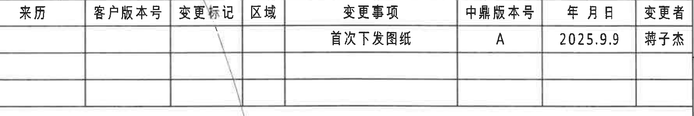
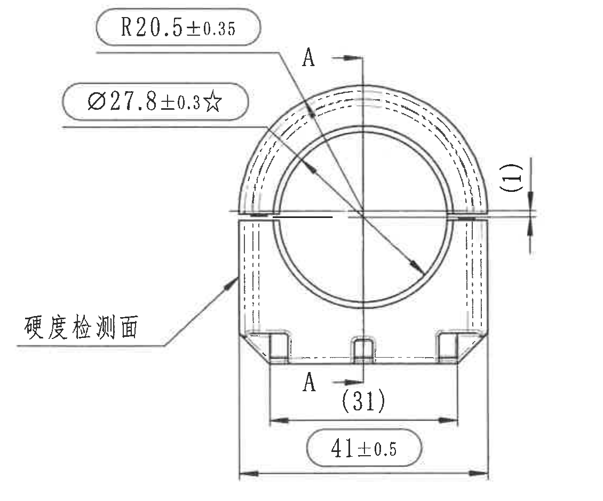
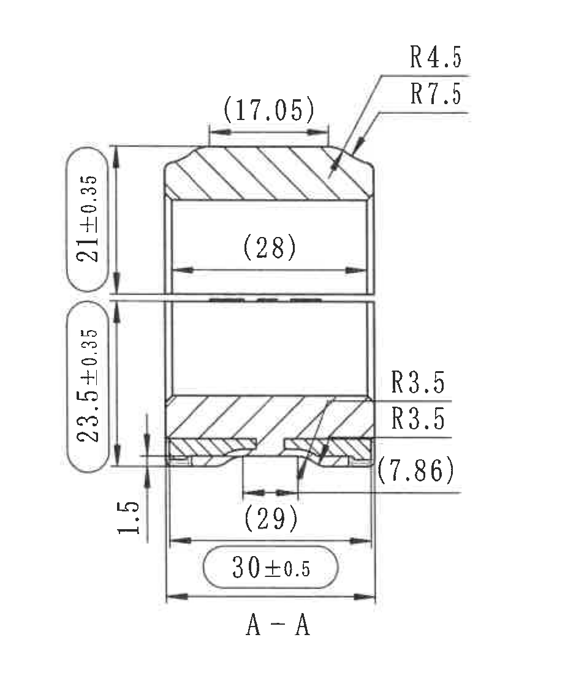
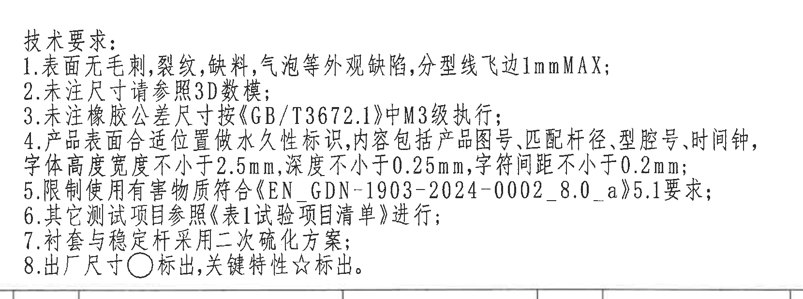
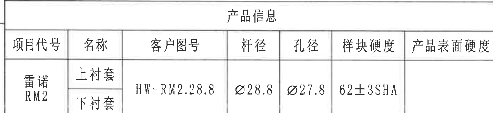
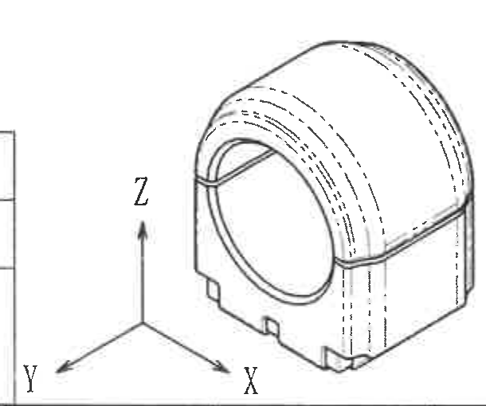
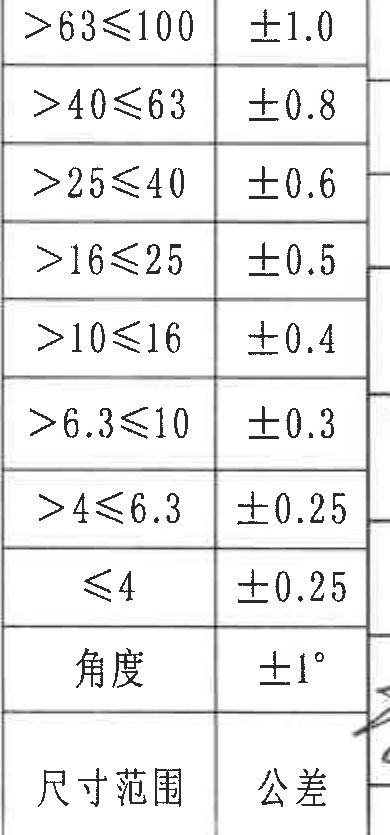
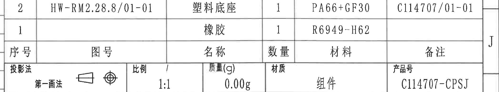
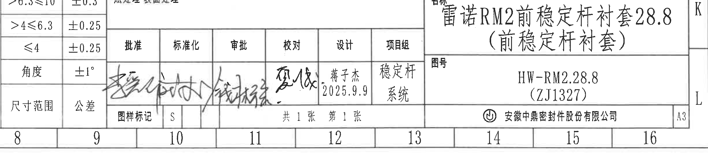

# 20C114707 内容识别

源文件：`input/20C114707.pdf`

整页 PNG：`outputs/20C114707_assets/images/page_1.png`

页面信息：1 页，整页渲染像素 4959 x 3505，页面 bbox `[0, 0, 4959, 3505]`。

## object_1 - 变更履历表

原图位置/视图名称：第 1 页右上角，变更履历表，bbox `[2990, 160, 4770, 460]`。

| 来源 | 客户版本号 | 变更标记 | 区域 | 变更事项 | 中鼎版本号 | 年月日 | 变更者 |
|---|---|---|---|---|---|---|---|
|  |  |  |  | 首次下发图纸 | A | 2025.9.9 | 蒋子杰 |
|  |  |  |  |  |  |  |  |
|  |  |  |  |  |  |  |  |

| 提取项 | 原图数值或文本 | 含义说明 |
|---|---|---|
| 表格标题/对象 | 变更履历表 | 图纸发行和变更记录区域。 |
| 变更事项 | 首次下发图纸 | 本图纸首次下发。 |
| 中鼎版本号 | A | 当前中鼎内部版本为 A 版。 |
| 年月日 | 2025.9.9 | 变更/下发日期。 |
| 变更者 | 蒋子杰 | 负责变更或下发人员。 |

边界归属说明：该裁切对象仅提取右上角变更履历表字段；右侧贴近图框分区字母，不作为表格内容。表格内没有尺寸、半径、角度或公差尺寸。

## object_2 - 主视图

原图位置/视图名称：第 1 页右上中部，主加工视图/正视图，bbox `[2530, 650, 3660, 1590]`。

| 提取项 | 原图数值或文本 | 含义说明 |
|---|---|---|
| 外圆弧半径 | R20.5±0.35 | 主视图上方外圆弧半径，带一般公差，表示外侧拱形半径为 20.5，允许偏差 ±0.35。 |
| 孔径/内圆直径 | Ø27.8±0.3☆ | 主视图内孔直径，星号表示关键特性；要求直径 27.8，允许偏差 ±0.3。 |
| 右侧台阶/缝隙高度 | (1) | 右侧靠近水平中线的参考尺寸，括号表示参考值，用于说明该台阶或间隙高度关系，不作为直接检验公差尺寸。 |
| 底部内跨距 | (31) | 底部两内侧基准/结构之间参考距离，括号表示参考尺寸。 |
| 总宽 | 41±0.5 | 主视图最外侧底部宽度，带公差 ±0.5。 |
| 剖切标记 | A-A | 主视图中部竖向剖切位置，箭头与字母 A 指示剖面 A-A 的观察方向和剖切线归属。 |
| 硬度检测面 | 硬度检测面 | 左侧引线指向侧面/斜面位置，表示硬度检测位置。 |
| 关键特性标识 | ☆ | 与 Ø27.8±0.3 同一尺寸框，表示该孔径为关键特性。 |

边界归属说明：主视图裁切包含完整尺寸框、尺寸线、箭头、剖切标记 A-A 和“硬度检测面”引线；右侧 A-A 剖视图的尺寸未混入。括号尺寸 `(1)`、`(31)` 归属主视图。

## object_3 - A-A 剖视图

原图位置/视图名称：第 1 页右侧，A-A 剖面视图，bbox `[3820, 570, 4760, 1695]`。

| 提取项 | 原图数值或文本 | 含义说明 |
|---|---|---|
| 剖面名称 | A-A | 与主视图剖切线 A-A 对应的剖视图。 |
| 顶部参考宽度 | (17.05) | 剖面顶部平台宽度参考值，括号表示参考尺寸。 |
| 上部高度 | 21±0.35 | 剖视图上段高度尺寸，允许偏差 ±0.35。 |
| 下部高度 | 23.5±0.35 | 剖视图下段高度尺寸，允许偏差 ±0.35。 |
| 底部台阶高度 | 1.5 | 剖视图底部局部台阶高度，未标单独公差，按一般尺寸公差表理解。 |
| 内腔参考宽度 | (28) | 剖视图中部内腔宽度参考值。 |
| 底部内槽/开口参考宽度 | (29) | 底部开口或内侧结构参考宽度。 |
| 总宽 | 30±0.5 | 剖视图底部总宽尺寸，允许偏差 ±0.5。 |
| 顶部圆角 | R4.5 | 顶部外侧圆角半径。 |
| 顶部内圆角/过渡圆角 | R7.5 | 顶部内侧或较大过渡圆角半径。 |
| 中下部圆角 | R3.5 | 剖视图右侧中下部两处圆角半径标注之一。 |
| 下部圆角 | R3.5 | 剖视图右侧下部第二处圆角半径标注。 |
| 底部参考高度/厚度 | (7.86) | 底部局部结构的参考尺寸，括号表示参考用途。 |
| 剖面材料填充 | 斜线剖面线 | 表示被剖切实体材料区域。 |

边界归属说明：该裁切对象只包含 A-A 剖视图的尺寸、半径、剖面线和标题；主视图中的 R20.5、Ø27.8、(31)、41±0.5 不归入本剖面。顶部 R4.5/R7.5 的文字和引线已完整包含。

## object_4 - 技术要求 / NOTES

原图位置/视图名称：第 1 页中下部右侧，技术要求/NOTES，bbox `[2740, 1860, 4400, 2480]`。

| 提取项 | 原图数值或文本 | 含义说明 |
|---|---|---|
| 标题 | 技术要求： | 图纸通用技术要求区域。 |
| 1 | 表面无毛刺，裂纹，缺料，气泡等外观缺陷，分型线飞边1mmMAX； | 外观缺陷限制；分型线飞边最大 1 mm。 |
| 2 | 未注尺寸请参照3D数模； | 图面未标注尺寸以 3D 数模为准。 |
| 3 | 未注橡胶公差尺寸按《GB/T3672.1》中M3级执行； | 未注橡胶件尺寸公差按 GB/T 3672.1 M3 级。 |
| 4 | 产品表面合适位置做永久性标识，内容包括产品图号，匹配杆径，型腔号，时间钟，字体高度宽度不小于2.5mm，深度不小于0.25mm，字符间距不小于0.2mm； | 表面永久标识要求；标识内容、字符尺寸和深度要求。 |
| 5 | 限制使用有害物质符合《EN GDN-1903-2024-0002_8.0_a》5.1要求； | 有害物质限制要求。 |
| 6 | 其它测试项目参照《表1试验项目清单》进行； | 其他测试依据试验项目清单。 |
| 7 | 衬套与稳定杆采用二次硫化方案； | 衬套和稳定杆的工艺方案要求。 |
| 8 | 出厂尺寸○标出，关键特性☆标出。 | 圆圈标识表示出厂尺寸；星号表示关键特性。 |

边界归属说明：该裁切对象仅包含技术要求文字，不包含下方标题栏或右上视图尺寸。第 8 条中的 ○ 与 ☆ 是图纸标识含义说明，分别关联出厂尺寸和关键特性。

## object_5 - 产品信息表

原图位置/视图名称：第 1 页左下角，产品信息表，bbox `[360, 2990, 1790, 3320]`。

| 项目代号 | 名称 | 客户图号 | 杆径 | 孔径 | 样块硬度 | 产品表面硬度 |
|---|---|---|---|---|---|---|
| 雷诺 RM2 | 上衬套 / 下衬套 | HW-RM2.28.8 | Ø28.8 | Ø27.8 | 62±3SHA |  |

| 提取项 | 原图数值或文本 | 含义说明 |
|---|---|---|
| 项目代号 | 雷诺 RM2 | 项目/车型或客户项目代号。 |
| 名称 | 上衬套、下衬套 | 产品包含上衬套与下衬套。 |
| 客户图号 | HW-RM2.28.8 | 客户图号。 |
| 杆径 | Ø28.8 | 匹配稳定杆直径。 |
| 孔径 | Ø27.8 | 衬套孔径，与主视图 Ø27.8 相关。 |
| 样块硬度 | 62±3SHA | 样块硬度要求，邵氏 A 硬度 62，允许偏差 ±3。 |
| 产品表面硬度 | 空白 | 原表该字段未填写。 |

边界归属说明：裁切对象包含完整产品信息表头和数据行；底部图框坐标数字被排除，不作为表格内容。表内 Ø28.8、Ø27.8 和 62±3SHA 归属产品信息表，不是加工视图尺寸线标注。

## object_6 - 轴测视图

原图位置/视图名称：第 1 页下方中左，轴测视图/三维示意，bbox `[1785, 2830, 2395, 3340]`。

| 提取项 | 原图数值或文本 | 含义说明 |
|---|---|---|
| 视图类型 | 轴测图 | 展示零件三维外形和开口结构。 |
| 坐标轴 | X、Y、Z | 三维方向标识，用于说明模型方向。 |
| 外形特征 | 拱形外壳、内孔、底部卡槽/缺口 | 轴测图用于直观表达主视图和剖视图中的结构关系。 |
| 尺寸标注 | 无单独尺寸值 | 该视图未标具体尺寸，尺寸需参考主视图、A-A 剖视图和产品信息表。 |

边界归属说明：该裁切对象只提取轴测图和 X/Y/Z 方向标识；右侧公差表边线与底部图框线不作为轴测图尺寸或字段。

## object_7 - 未注尺寸公差表

原图位置/视图名称：第 1 页下方中部，未注尺寸公差表，bbox `[2400, 2475, 2790, 3310]`。

| 尺寸范围 | 公差 |
|---|---|
| >63≤100 | ±1.0 |
| >40≤63 | ±0.8 |
| >25≤40 | ±0.6 |
| >16≤25 | ±0.5 |
| >10≤16 | ±0.4 |
| >6.3≤10 | ±0.3 |
| >4≤6.3 | ±0.25 |
| ≤4 | ±0.25 |
| 角度 | ±1° |

| 提取项 | 原图数值或文本 | 含义说明 |
|---|---|---|
| 表名/范围说明 | 尺寸范围 / 公差 | 未注线性尺寸和角度的通用公差表。 |
| >63≤100 | ±1.0 | 尺寸大于 63 且小于等于 100 时公差 ±1.0。 |
| >40≤63 | ±0.8 | 尺寸大于 40 且小于等于 63 时公差 ±0.8。 |
| >25≤40 | ±0.6 | 尺寸大于 25 且小于等于 40 时公差 ±0.6。 |
| >16≤25 | ±0.5 | 尺寸大于 16 且小于等于 25 时公差 ±0.5。 |
| >10≤16 | ±0.4 | 尺寸大于 10 且小于等于 16 时公差 ±0.4。 |
| >6.3≤10 | ±0.3 | 尺寸大于 6.3 且小于等于 10 时公差 ±0.3。 |
| >4≤6.3 | ±0.25 | 尺寸大于 4 且小于等于 6.3 时公差 ±0.25。 |
| ≤4 | ±0.25 | 尺寸小于等于 4 时公差 ±0.25。 |
| 角度 | ±1° | 未注角度公差。 |
| 底部表头 | 尺寸范围 / 公差 | 表格底部重复表头。 |

边界归属说明：该裁切对象只提取两列公差表；右侧有共享边线和极少相邻图框痕迹，不包含相邻标题栏字段。公差表为未注尺寸解释依据，与主视图和剖视图中未带单独公差的尺寸相关。

## object_8 - 明细栏 / 投影与材质信息

原图位置/视图名称：第 1 页右下方上部，明细栏及投影、比例、质量、材质、产品号信息，bbox `[2750, 2475, 4845, 2865]`。

| 序号 | 图号 | 名称 | 数量 | 材料 | 备注 |
|---|---|---|---|---|---|
| 2 | HW-RM2.28.8/01-01 | 塑料底座 | 1 | PA66+GF30 | C114707/01-01 |
| 1 |  | 橡胶 | 1 | R6949-H62 |  |

| 提取项 | 原图数值或文本 | 含义说明 |
|---|---|---|
| 明细栏表头 | 序号、图号、名称、数量、材料、备注 | 零件/材料明细表字段。 |
| 明细序号 2 | HW-RM2.28.8/01-01；塑料底座；数量 1；PA66+GF30；C114707/01-01 | 塑料底座明细项。 |
| 明细序号 1 | 名称 橡胶；数量 1；材料 R6949-H62 | 橡胶明细项。 |
| 投影法 | 第一画法 | 投影方式。 |
| 投影符号 | 第一画法符号 | 与“第一画法”对应的投影符号。 |
| 比例 | 1:1 | 图纸比例。 |
| 质量 | 0.00g | 图纸质量字段。 |
| 材质 | 组件 | 总体材质/类别字段。 |
| 产品号 | C114707-CPSJ | 产品号。 |
| 热处理/表面处理 | 空白 | 原图该栏未填写。 |

边界归属说明：该对象提取右下方明细栏及其下方投影/比例/质量/材质/产品号区域；右侧 J/K 图框字母和左侧少量共享边线不作为明细字段。下方“名称/图号/签审”归属 object_9。

## object_9 - 标题栏 / 签审栏

原图位置/视图名称：第 1 页右下方，标题栏、签审栏和图纸基本信息，bbox `[2400, 2895, 4845, 3430]`。

| 字段 | 原图数值或文本 |
|---|---|
| 名称 | 雷诺RM2前稳定杆衬套28.8（前稳定杆衬套） |
| 图号 | HW-RM2.28.8（ZJ1327） |
| 公司 | 安徽中鼎密封件股份有限公司 |
| 图幅 | A3 |
| 批准 | 手写签名 |
| 标准化 | 手写签名/空白不清 |
| 审批 | 手写签名 |
| 校对 | 手写签名 |
| 设计 | 蒋子杰 2025.9.9 |
| 项目组 | 稳定杆系统 |
| 图样标记 | S |
| 页码 | 共 1 张 第 1 张 |

| 提取项 | 原图数值或文本 | 含义说明 |
|---|---|---|
| 名称 | 雷诺RM2前稳定杆衬套28.8（前稳定杆衬套） | 图纸产品名称。 |
| 图号 | HW-RM2.28.8（ZJ1327） | 图纸编号及括号内编号。 |
| 公司名称 | 安徽中鼎密封件股份有限公司 | 出图单位。 |
| 图幅 | A3 | 图纸幅面。 |
| 设计 | 蒋子杰；2025.9.9 | 设计人员和日期。 |
| 项目组 | 稳定杆系统 | 项目归属。 |
| 图样标记 | S | 图样标记。 |
| 页数 | 共 1 张 第 1 张 | 图纸总页数和当前页。 |

边界归属说明：为完整保留手写签名和标题栏信息，裁切向左包含了部分相邻公差表边缘；左侧公差表内容不归入标题栏字段。上方投影、比例、质量、产品号等字段归属 object_8。

## 裁切检查记录

| 对象 | 图片路径 | 检查结果 |
|---|---|---|
| object_1 | outputs/20C114707_assets/images/object_1.png | 完整包含变更履历表表头、记录行和表格边线；右侧贴近图框分区字母，未作为字段提取。 |
| object_2 | outputs/20C114707_assets/images/object_2.png | 完整包含主视图全部尺寸线、箭头、文字、A-A 剖切标记和“硬度检测面”引线；未混入 A-A 剖视图尺寸。 |
| object_3 | outputs/20C114707_assets/images/object_3.png | 完整包含 A-A 剖视图、剖面线、尺寸线、箭头、R4.5/R7.5/R3.5 文字和底部 A-A 标题；不含主视图尺寸。 |
| object_4 | outputs/20C114707_assets/images/object_4.png | 完整包含技术要求 1-8 条，左侧序号和首字完整；底部只见相邻表格上边线，不提取为 NOTES 内容。 |
| object_5 | outputs/20C114707_assets/images/object_5.png | 完整包含产品信息表表头和数据行；底部图框坐标数字被排除。 |
| object_6 | outputs/20C114707_assets/images/object_6.png | 完整包含轴测图和 X/Y/Z 坐标轴；左侧和底部有图框边界线，不作为视图尺寸。 |
| object_7 | outputs/20C114707_assets/images/object_7.png | 完整包含未注尺寸公差表两列和所有公差行；右侧仅有共享边线/微量相邻痕迹，无相邻文字归入。 |
| object_8 | outputs/20C114707_assets/images/object_8.png | 完整包含明细栏、投影法、比例、质量、材质、产品号字段；下方标题栏名称字段未纳入本对象。 |
| object_9 | outputs/20C114707_assets/images/object_9.png | 完整包含标题栏名称、图号、公司、图幅、签审栏和页码；为保留手写签名，左侧包含少量相邻公差表边缘，已在归属说明中排除。 |
