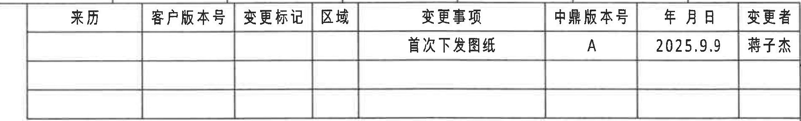
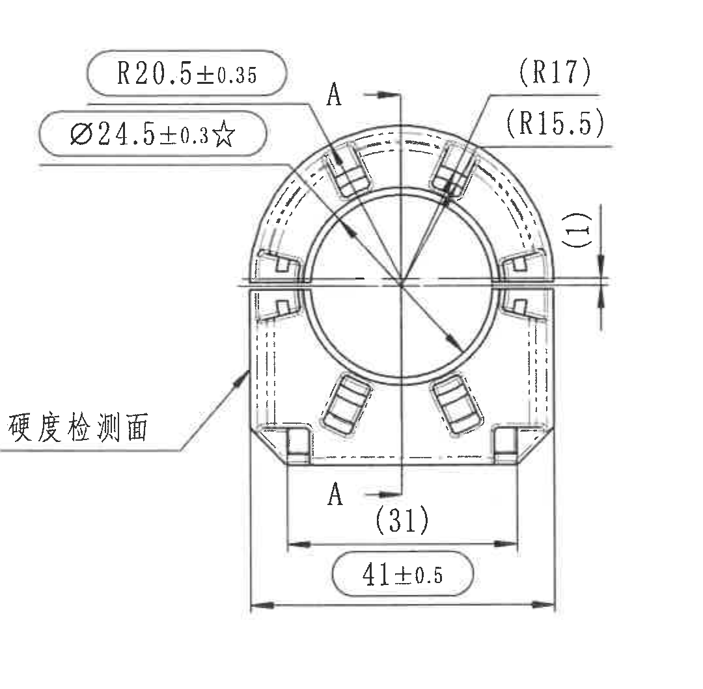
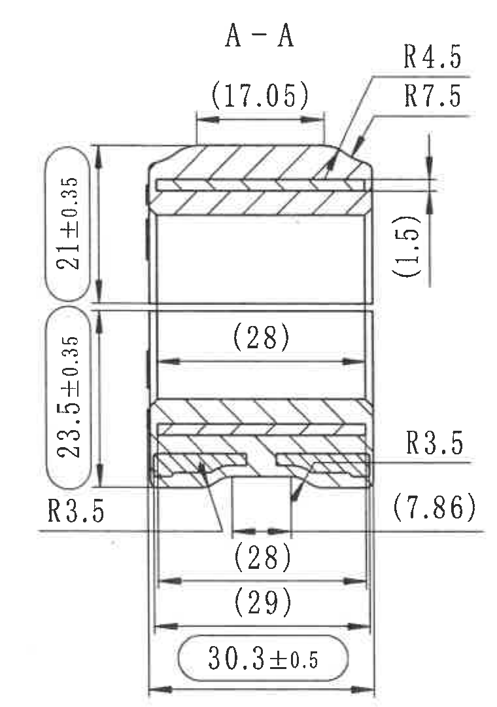
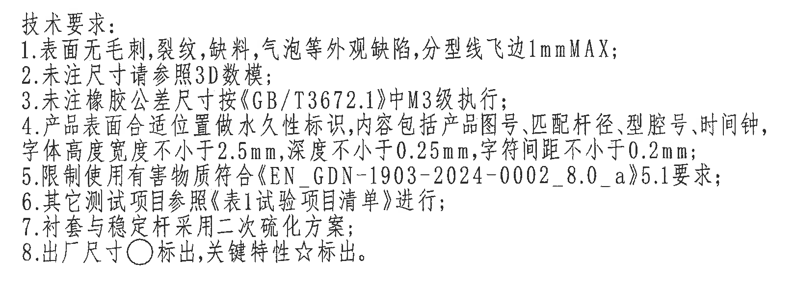
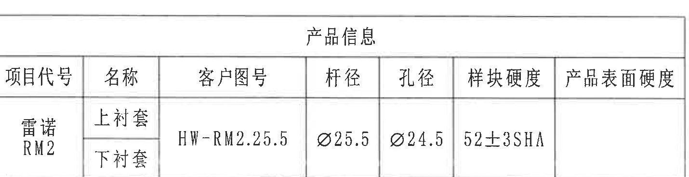
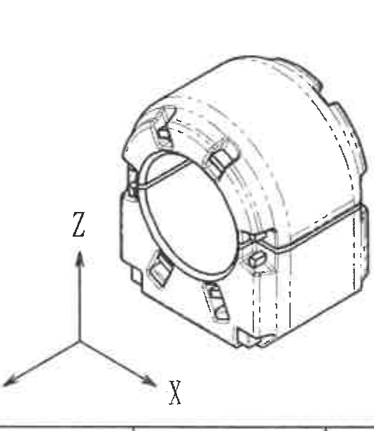
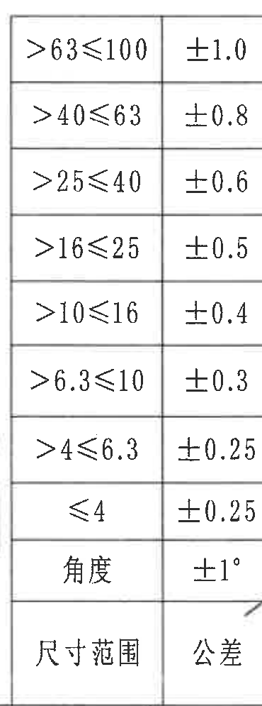
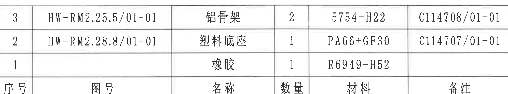
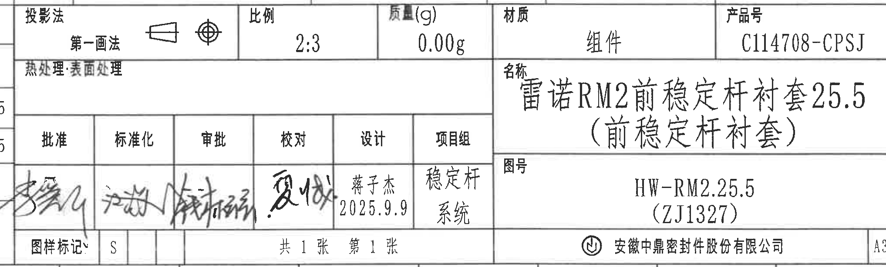

# 20C114708 内容识别与裁切记录

整页 PNG：`outputs/20C114708_assets/images/page_1.png`  
页面尺寸：4959 x 3505 px，bbox `[0, 0, 4959, 3505]`。  
说明：原 PDF 为扫描图，无可复制文本层；以下内容基于 300 DPI 渲染图逐项核读。

## object_1：修订履历表

原图位置/视图名称：第 1 页右上角修订履历表，bbox `[2875, 155, 4775, 445]`，约位于图框 A10-A16 区域。

### 原表还原

| 来历 | 客户版本号 | 变更标记 | 区域 | 变更事项 | 中鼎版本号 | 年 月 日 | 变更者 |
|---|---|---|---|---|---|---|---|
|  |  |  |  | 首次下发图纸 | A | 2025.9.9 | 蒋子杰 |
|  |  |  |  |  |  |  |  |
|  |  |  |  |  |  |  |  |

### 提取表

| 提取项 | 原图数值或文本 | 含义说明 |
|---|---|---|
| 表格名称 | 修订履历表 | 图纸版本/变更记录区域。 |
| 变更事项 | 首次下发图纸 | 本次记录为首次发放图纸。 |
| 中鼎版本号 | A | 当前中鼎版本为 A 版。 |
| 年月日 | 2025.9.9 | 变更日期。 |
| 变更者 | 蒋子杰 | 变更人员。 |

边界归属说明：裁切对象仅包含右上角修订履历表的网格和文字；顶部有相邻图框分区线的少量边线，但未混入其他视图或尺寸内容。

## object_2：主加工视图/正视图

原图位置/视图名称：第 1 页右中部主加工视图，bbox `[2780, 680, 3860, 1740]`，约位于图框 C10-F12 区域。

### 提取表

| 提取项 | 原图数值或文本 | 含义说明 |
|---|---|---|
| 半径尺寸 | R20.5±0.35 | 主视图上部圆弧外形半径，带 ±0.35 公差。 |
| 直径关键尺寸 | Ø24.5±0.3☆ | 中央孔径/内孔直径尺寸，带 ±0.3 公差；星号表示关键特性。 |
| 参考半径 | (R17) | 右上区域圆弧参考半径；括号表示参考尺寸，不作为直接制造控制尺寸。 |
| 参考半径 | (R15.5) | 右上区域内侧圆弧参考半径；括号表示参考尺寸。 |
| 参考尺寸 | (1) | 右侧水平分割/开口附近的局部间距参考尺寸；括号表示参考。 |
| 参考宽度 | (31) | 下部内侧宽度参考尺寸，位于 A-A 剖切线下方附近；括号表示参考。 |
| 宽度尺寸 | 41±0.5 | 主视图底部总体宽度/外侧宽度，带 ±0.5 公差。 |
| 剖切标识 | A-A，A | 剖切线及箭头标识，对应右侧 A-A 剖视图。 |
| 检测面文字 | 硬度检测面 | 箭头指向左下外侧面，标识硬度检测所在表面。 |
| T 编号 | 未见 | 主视图中未见 T 编号。 |
| 角度/弧向尺寸 | 未见角度值；弧度以 R20.5、(R17)、(R15.5) 表示 | 主视图未标注角度尺寸；圆弧相关信息以半径尺寸表达。 |

边界归属说明：裁切完整包含主视图所有可见尺寸线、箭头、剖切符号和文字；右侧 A-A 剖视图未被纳入，右侧的 `(1)` 归属于主视图，因为其尺寸线和箭头均指向主视图右侧开口位置。

## object_3：A-A 剖视图

原图位置/视图名称：第 1 页右侧 A-A 剖视图，bbox `[3830, 650, 4590, 1730]`，约位于图框 C14-F15 区域。

### 提取表

| 提取项 | 原图数值或文本 | 含义说明 |
|---|---|---|
| 视图标题 | A-A | 与主视图中的 A-A 剖切线对应。 |
| 参考宽度 | (17.05) | 剖视图顶部平直段/内侧宽度参考尺寸；括号表示参考。 |
| 半径尺寸 | R4.5 | 顶部右侧外圆角/过渡圆弧半径。 |
| 半径尺寸 | R7.5 | 顶部右侧内侧过渡圆弧半径。 |
| 高度尺寸 | 21±0.35 | 上部高度尺寸，带 ±0.35 公差。 |
| 参考尺寸 | (1.5) | 右侧上部局部厚度/台阶间距参考尺寸；括号表示参考。 |
| 高度尺寸 | 23.5±0.35 | 下部高度尺寸，带 ±0.35 公差。 |
| 参考宽度 | (28) | 剖视图中部内腔宽度参考尺寸；括号表示参考。 |
| 半径尺寸 | R3.5 | 左下区域圆角半径。 |
| 半径尺寸 | R3.5 | 右下区域圆角半径。 |
| 参考尺寸 | (7.86) | 右下局部结构参考尺寸；括号表示参考。 |
| 参考宽度 | (28) | 下部开口/局部宽度参考尺寸；括号表示参考。 |
| 参考宽度 | (29) | 下部外侧局部宽度参考尺寸；括号表示参考。 |
| 宽度尺寸 | 30.3±0.5 | 剖视图底部总体宽度，带 ±0.5 公差。 |
| 总高度 | 图中未单独标总高；由 21±0.35 与 23.5±0.35 分段构成，名义合计 44.5 | 此为基于原图分段高度的解释；原图没有单独给出总高度标注。 |
| T 编号 | 未见 | A-A 剖视图中未见 T 编号。 |
| 角度/弧向尺寸 | 未见角度值；弧度以 R4.5、R7.5、R3.5 表示 | 剖视图未标注角度尺寸；圆弧相关信息以半径尺寸表达。 |

边界归属说明：裁切完整包含 A-A 剖视图的剖面线、全部尺寸线、箭头和文字；左侧主视图尺寸未纳入，本对象只提取剖视图内部及其直接引出的尺寸。

## object_4：技术要求/NOTES

原图位置/视图名称：第 1 页中下部技术要求，bbox `[2785, 1760, 4405, 2340]`，约位于图框 G9-H14 区域。

### 原文还原

技术要求：

1. 表面无毛刺,裂纹,缺料,气泡等外观缺陷,分型线飞边1mmMAX;
2. 未注尺寸请参照3D数据;
3. 未注橡胶公差尺寸按《GB/T3672.1》中M3级执行;
4. 产品表面合适位置做永久性标识,内容包括产品图号,匹配杆径,型腔号,时间钟,字体高度宽度不小于2.5mm,深度不小于0.25mm,字符间距不小于0.2mm;
5. 限制使用有害物质符合《EN_GDN-1903-2024-0002_8.0_a》5.1要求;
6. 其它测试项目参照《表1试验项目清单》进行;
7. 衬套与稳定杆采用二次硫化方案;
8. 出厂尺寸○标出,关键特性☆标出。

### 提取表

| 提取项 | 原图数值或文本 | 含义说明 |
|---|---|---|
| 外观要求 | 表面无毛刺,裂纹,缺料,气泡等外观缺陷,分型线飞边1mmMAX | 表面缺陷限制，分型线飞边最大 1 mm。 |
| 未注尺寸依据 | 未注尺寸请参照3D数据 | 图中未标注尺寸以 3D 数据为准。 |
| 未注橡胶公差 | 按《GB/T3672.1》中M3级执行 | 橡胶未注尺寸公差等级为 M3。 |
| 永久性标识 | 产品图号、匹配杆径、型腔号、时间钟 | 产品表面合适位置需做永久性标识。 |
| 标识字体尺寸 | 高度宽度不小于2.5mm,深度不小于0.25mm,字符间距不小于0.2mm | 永久性标识的最小字高/字宽、深度和字符间距要求。 |
| 有害物质限制 | 《EN_GDN-1903-2024-0002_8.0_a》5.1要求 | 材料/产品需满足限制有害物质要求。 |
| 其它测试 | 参照《表1试验项目清单》进行 | 未列出的测试项目按表 1 执行。 |
| 工艺方案 | 衬套与稳定杆采用二次硫化方案 | 衬套与稳定杆的连接/成型工艺要求。 |
| 标注符号 | 出厂尺寸○标出,关键特性☆标出 | ○ 表示出厂尺寸；☆ 表示关键特性。 |

边界归属说明：裁切仅包含技术要求文字区域；底部靠近下方表格上边线，但该边线不属于 NOTES 文本，未作为内容提取。

## object_5：产品信息表

原图位置/视图名称：第 1 页左下角产品信息表，bbox `[385, 2965, 1815, 3335]`，约位于图框 K1-L5 区域。

### 原表还原

| 项目代号 | 名称 | 客户图号 | 杆径 | 孔径 | 样块硬度 | 产品表面硬度 |
|---|---|---|---|---|---|---|
| 雷诺 RM2 | 上衬套 | HW-RM2.25.5 | Ø25.5 | Ø24.5 | 52±3SHA |  |
| 雷诺 RM2 | 下衬套 | HW-RM2.25.5 | Ø25.5 | Ø24.5 | 52±3SHA |  |

### 提取表

| 提取项 | 原图数值或文本 | 含义说明 |
|---|---|---|
| 项目代号 | 雷诺 RM2 | 产品所属项目。 |
| 名称 | 上衬套、下衬套 | 表格列出同一项目下的上下衬套。 |
| 客户图号 | HW-RM2.25.5 | 客户图号/对应零件图号。 |
| 杆径 | Ø25.5 | 匹配稳定杆直径。 |
| 孔径 | Ø24.5 | 衬套孔径。 |
| 样块硬度 | 52±3SHA | 样块硬度范围，单位为 Shore A。 |
| 产品表面硬度 | 空白 | 原表未填写。 |

边界归属说明：裁切边界对准产品信息表外框，已去除左侧图框坐标字母；右侧无其他对象混入。

## object_6：等轴测辅助视图

原图位置/视图名称：第 1 页下部等轴测辅助视图，bbox `[1865, 2740, 2395, 3350]`，约位于图框 K6-L7 区域。

### 提取表

| 提取项 | 原图数值或文本 | 含义说明 |
|---|---|---|
| 视图类型 | 等轴测辅助视图 | 展示零件三维外观和结构方向。 |
| 坐标轴 | X、Y、Z | 视图中给出三维方向参考。 |
| 尺寸标注 | 未见 | 该视图未标注尺寸、公差、T 编号或角度值。 |
| 结构信息 | 中央孔、上部弧形外壳、两侧/下部凸台及局部槽形结构 | 用于辅助理解主视图和剖视图中的结构。 |

边界归属说明：裁切包含零件等轴测图和 X/Y/Z 坐标轴；右侧表格边线未纳入，底部靠近图框分区线但不作为视图内容提取。

## object_7：未注尺寸公差表

原图位置/视图名称：第 1 页底部中左侧未注尺寸公差表，bbox `[2390, 2350, 2760, 3345]`，约位于图框 I8-L9 区域。

### 原表还原

| 尺寸范围 | 公差 |
|---|---|
| >63≤100 | ±1.0 |
| >40≤63 | ±0.8 |
| >25≤40 | ±0.6 |
| >16≤25 | ±0.5 |
| >10≤16 | ±0.4 |
| >6.3≤10 | ±0.3 |
| >4≤6.3 | ±0.25 |
| ≤4 | ±0.25 |
| 角度 | ±1° |

### 提取表

| 提取项 | 原图数值或文本 | 含义说明 |
|---|---|---|
| 线性尺寸公差 | >63≤100：±1.0 | 适用于该尺寸范围的未注线性公差。 |
| 线性尺寸公差 | >40≤63：±0.8 | 适用于该尺寸范围的未注线性公差。 |
| 线性尺寸公差 | >25≤40：±0.6 | 适用于该尺寸范围的未注线性公差。 |
| 线性尺寸公差 | >16≤25：±0.5 | 适用于该尺寸范围的未注线性公差。 |
| 线性尺寸公差 | >10≤16：±0.4 | 适用于该尺寸范围的未注线性公差。 |
| 线性尺寸公差 | >6.3≤10：±0.3 | 适用于该尺寸范围的未注线性公差。 |
| 线性尺寸公差 | >4≤6.3：±0.25 | 适用于该尺寸范围的未注线性公差。 |
| 线性尺寸公差 | ≤4：±0.25 | 适用于该尺寸范围的未注线性公差。 |
| 角度公差 | ±1° | 未注角度尺寸公差。 |

边界归属说明：裁切只保留“尺寸范围/公差”两列；右下角共享边界处有极小相邻签名笔迹残留，未作为公差表内容提取。

## object_8：明细/BOM 表

原图位置/视图名称：第 1 页底部右上明细/BOM 表，bbox `[2780, 2350, 4775, 2720]`，约位于图框 I9-J16 区域。

### 原表还原

| 序号 | 图号 | 名称 | 数量 | 材料 | 备注 |
|---|---|---|---|---|---|
| 3 | HW-RM2.25.5/01-01 | 铝骨架 | 2 | 5754-H22 | C114708/01-01 |
| 2 | HW-RM2.28.8/01-01 | 塑料底座 | 1 | PA66+GF30 | C114707/01-01 |
| 1 |  | 橡胶 | 1 | R6949-H52 |  |

### 提取表

| 提取项 | 原图数值或文本 | 含义说明 |
|---|---|---|
| 明细行 3 | HW-RM2.25.5/01-01，铝骨架，数量 2，材料 5754-H22，备注 C114708/01-01 | 组件中的铝骨架零件。 |
| 明细行 2 | HW-RM2.28.8/01-01，塑料底座，数量 1，材料 PA66+GF30，备注 C114707/01-01 | 组件中的塑料底座零件。 |
| 明细行 1 | 图号空白，橡胶，数量 1，材料 R6949-H52，备注空白 | 组件中的橡胶材料/零件。 |

边界归属说明：裁切从明细表“序号”列左边界开始，避免混入左侧公差表；表头和三条明细记录完整。

## object_9：标题栏

原图位置/视图名称：第 1 页右下角标题栏，bbox `[2740, 2735, 4775, 3350]`，约位于图框 J9-L16 区域。

### 原表还原

| 字段 | 原图文本 |
|---|---|
| 投影法 | 第一画法，含投影符号 |
| 比例 | 2:3 |
| 质量(g) | 0.00g |
| 材质 | 组件 |
| 产品号 | C114708-CPSJ |
| 热处理/表面处理 | 空白 |
| 名称 | 雷诺RM2前稳定杆衬套25.5（前稳定杆衬套） |
| 图号 | HW-RM2.25.5（ZJ1327） |
| 批准 | 手写签名 |
| 标准化 | 手写签名 |
| 审批 | 手写签名 |
| 校对 | 手写签名 |
| 设计 | 蒋子杰，2025.9.9 |
| 项目组 | 稳定杆系统 |
| 图样标记 | S |
| 张数 | 共 1 张，第 1 张 |
| 公司 | 安徽中鼎密封件股份有限公司 |
| 图幅 | A3 |

### 提取表

| 提取项 | 原图数值或文本 | 含义说明 |
|---|---|---|
| 投影法 | 第一画法 | 使用第一角法投影。 |
| 比例 | 2:3 | 图样比例。 |
| 质量 | 0.00g | 标题栏质量字段。 |
| 材质 | 组件 | 表示图样对象为组件。 |
| 产品号 | C114708-CPSJ | 产品编号。 |
| 名称 | 雷诺RM2前稳定杆衬套25.5（前稳定杆衬套） | 零件/组件名称。 |
| 图号 | HW-RM2.25.5（ZJ1327） | 图纸编号。 |
| 设计 | 蒋子杰，2025.9.9 | 设计人员及日期。 |
| 项目组 | 稳定杆系统 | 所属项目组。 |
| 图样标记 | S | 标题栏图样标记。 |
| 张数 | 共 1 张，第 1 张 | 本图共 1 张，当前第 1 张。 |
| 公司 | 安徽中鼎密封件股份有限公司 | 图纸发布/所属公司。 |
| 图幅 | A3 | 图纸幅面。 |

边界归属说明：标题栏与左侧公差表/明细区域共享网格边界。为保留标题栏左侧签名与投影栏，裁切左缘包含极少量相邻公差列残片；这些残片不属于标题栏提取内容，已排除。

## 裁切检查记录

| 图片 | 对象 | 检查结论 |
|---|---|---|
| page_1.png | 整页 PNG | 完整渲染整页图纸，尺寸 4959 x 3505 px。 |
| object_1.png | 修订履历表 | 完整包含表格外框、表头和首条变更记录；无视图尺寸混入。 |
| object_2.png | 主加工视图 | 完整包含尺寸线、箭头、剖切 A-A 标识、硬度检测面文字；未把 A-A 剖视图尺寸并入。 |
| object_3.png | A-A 剖视图 | 完整包含剖面线、全部尺寸线、箭头、文字和括号参考尺寸；未混入主视图尺寸。 |
| object_4.png | 技术要求 | 完整包含 1-8 条技术要求文字；底部接近相邻表格边线，但未提取为 NOTES 内容。 |
| object_5.png | 产品信息表 | 完整包含产品信息表外框、表头和数据；已去除图纸坐标字母残片。 |
| object_6.png | 等轴测辅助视图 | 完整包含等轴测零件图和 X/Y/Z 坐标轴；无尺寸文字被裁断。 |
| object_7.png | 未注尺寸公差表 | 完整包含尺寸范围/公差两列和所有公差行；右下角共享边界处有极小签名笔迹残留，未作为本表内容提取。 |
| object_8.png | 明细/BOM 表 | 完整包含序号、图号、名称、数量、材料、备注列和三条记录；未混入左侧公差表。 |
| object_9.png | 标题栏 | 完整包含投影法、比例、质量、材质、产品号、名称、图号、签审、张数、公司、图幅等标题栏字段；左缘少量相邻公差列残片已排除。 |
