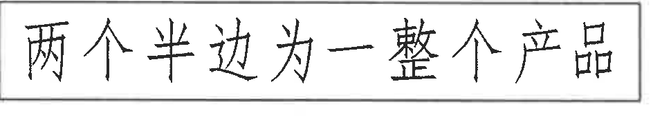
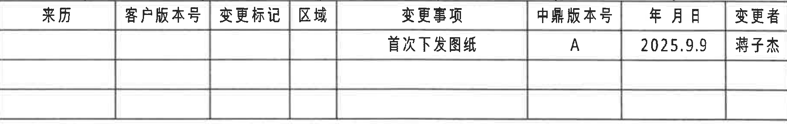
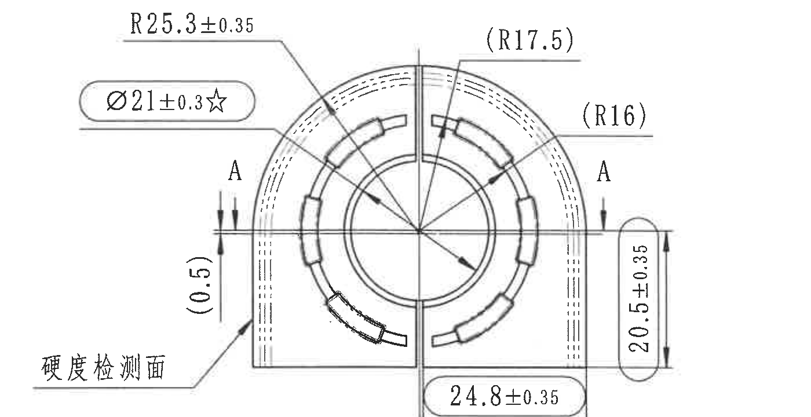
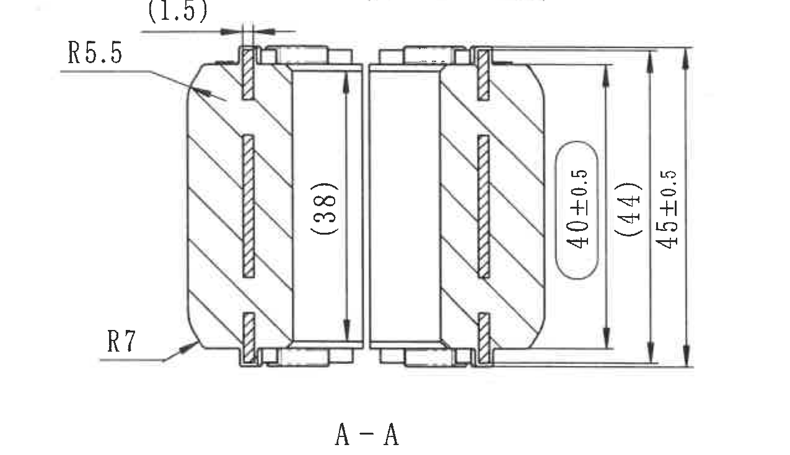
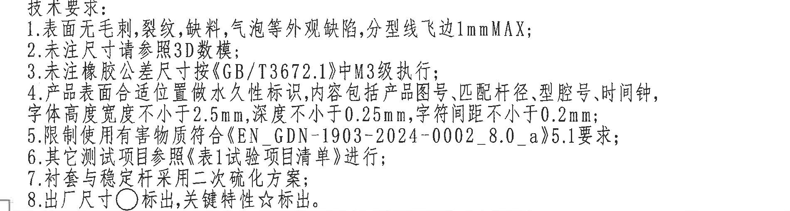
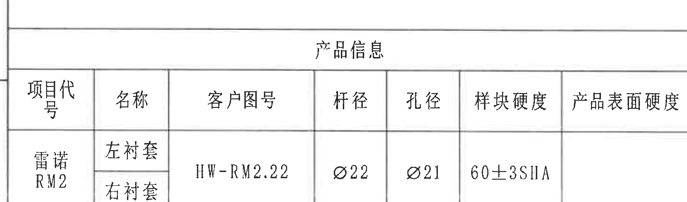
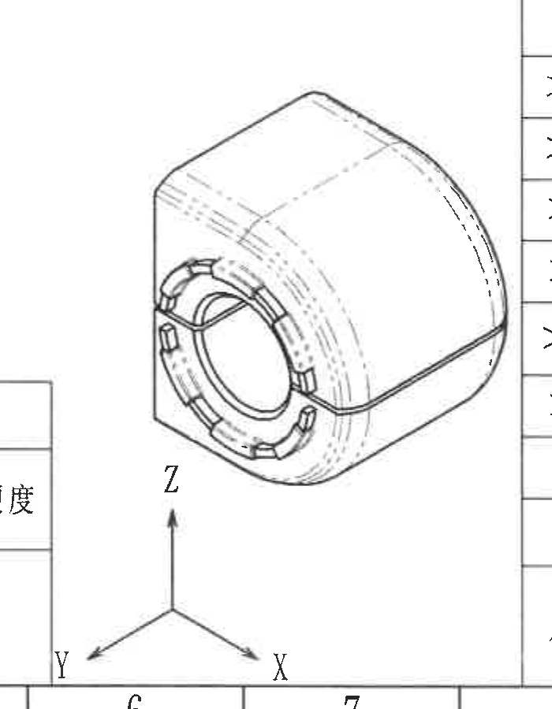
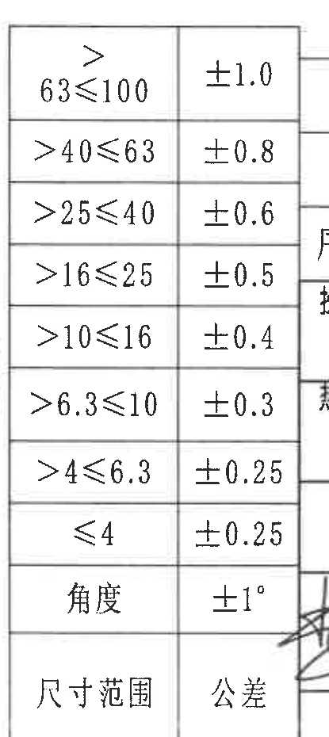
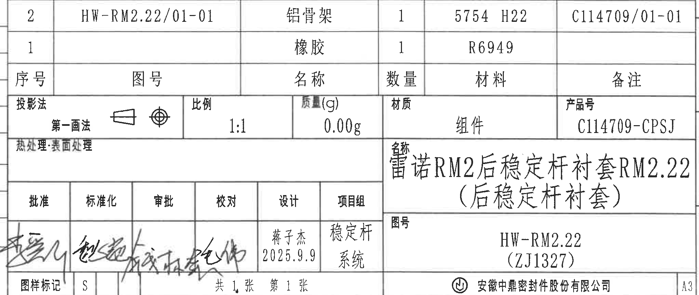

# 20C114709.pdf 内容识别

整页渲染图：`outputs/20C114709_assets/images/page_1.png`  
页面尺寸：4959 x 3505 px  
bbox 记录格式：`[x, y, width, height]`，坐标基于整页 PNG 左上角。

## object_1 - 顶部手写说明框

原图位置/视图名称：页面上方中部说明框，bbox `[1860, 250, 970, 180]`。

| 提取项 | 原图数值或文本 | 含义说明 |
|---|---|---|
| 手写说明 | 两个半边为一整个产品 | 说明图中左右两个半边件组合后构成一个完整产品。主视图与 A-A 剖视图中以中心分割线表示左右半边的装配关系。 |

边界归属说明：该裁切只包含顶部手写说明框及框线，不包含右上修订履历表、主视图或标题栏内容。

## object_2 - 修订履历表

原图位置/视图名称：页面右上角修订履历表，bbox `[2948, 160, 1825, 290]`。

| 来历 | 客户版本号 | 变更标记 | 区域 | 变更事项 | 中鼎版本号 | 年月日 | 变更者 |
|---|---|---|---|---|---|---|---|
|  |  |  |  | 首次下发图纸 | A | 2025.9.9 | 蒋子杰 |
|  |  |  |  |  |  |  |  |
|  |  |  |  |  |  |  |  |

| 提取项 | 原图数值或文本 | 含义说明 |
|---|---|---|
| 表头 | 来历、客户版本号、变更标记、区域、变更事项、中鼎版本号、年月日、变更者 | 修订履历字段。 |
| 修订记录 | 首次下发图纸 / A / 2025.9.9 / 蒋子杰 | 表示该版为首次下发图纸，中鼎版本号 A，日期 2025.9.9，变更者蒋子杰。 |
| 空白行 | 两行空白 | 预留后续变更记录。 |

边界归属说明：裁切按表格外框截取，右侧图框坐标字母不属于本表且未提取。

## object_3 - 右上主视图/端面加工视图

原图位置/视图名称：页面右上端面主视图，bbox `[3270, 455, 1400, 720]`。

| 提取项 | 原图数值或文本 | 含义说明 |
|---|---|---|
| 外圆弧半径 | R25.3±0.35 | 指向外侧圆弧轮廓的半径尺寸，带双向公差 ±0.35。 |
| 参考圆弧半径 | (R17.5) | 括号内参考尺寸，指向上部内侧圆弧/虚线圆弧位置，用于说明结构关系，不作为直接检验尺寸。 |
| 参考圆弧半径 | (R16) | 括号内参考尺寸，指向右侧内圆弧/槽分布圆弧，用于说明结构关系，不作为直接检验尺寸。 |
| 关键孔径/内径 | Ø21±0.3☆ | 直径尺寸，公差 ±0.3；星号表示关键特性，且被椭圆框标注。 |
| 参考小尺寸 | (0.5) | 括号内参考尺寸，位于左侧 A-A 剖切线附近的竖向局部尺寸，用于说明局部位置关系。 |
| 竖向尺寸 | 20.5±0.35 | 位于右侧的竖向尺寸，带公差 ±0.35，表示右侧外形高度/平直段高度相关尺寸。 |
| 横向尺寸 | 24.8±0.35 | 位于视图下方右半边的横向尺寸，带公差 ±0.35，表示中心分割线到右侧边界的宽度关系。 |
| 剖切标识 | A、A | 主视图左右两侧的 A-A 剖切位置和箭头，对应 object_4 的 A-A 剖视图。 |
| 表面说明 | 硬度检测面 | 引线指向左下侧外表面，说明该位置为硬度检测面。 |
| 数量前缀/T 编号 | 未见 | 当前主视图未见数量前缀和 T 编号。 |

边界归属说明：下边界收在 24.8±0.35 尺寸线下方，未纳入 A-A 剖视图主体；A-A 剖视图的 `(1.5)`、R5.5、R7、(38)、40±0.5、(44)、45±0.5 仅归属 object_4。

## object_4 - A-A 剖视图

原图位置/视图名称：页面右中 A-A 剖视图，bbox `[3405, 1200, 1275, 735]`。

| 提取项 | 原图数值或文本 | 含义说明 |
|---|---|---|
| 参考间隙尺寸 | (1.5) | 括号内参考尺寸，位于剖视图上方局部横向间隙/台阶处，用于说明局部结构关系。 |
| 圆角半径 | R5.5 | 指向剖面左上外圆角/过渡圆角的半径。 |
| 圆角半径 | R7 | 指向剖面左下外圆角/过渡圆角的半径。 |
| 参考内高 | (38) | 括号内参考尺寸，位于中部内腔竖向尺寸线，用于说明内腔高度关系。 |
| 竖向尺寸 | 40±0.5 | 位于右侧椭圆框内的竖向尺寸，公差 ±0.5。 |
| 参考总高 | (44) | 括号内参考尺寸，位于右侧竖向尺寸组中间，用于说明整体高度关系。 |
| 总高度 | 45±0.5 | 位于最右侧竖向尺寸，公差 ±0.5，表示剖视方向上的总高。 |
| 剖视名称 | A-A | 对应 object_3 中主视图的 A-A 剖切标识。 |
| 数量前缀/T 编号 | 未见 | 当前剖视图未见数量前缀和 T 编号。 |

边界归属说明：本裁切包含剖视图主体、剖面线、A-A 标题和全部剖视尺寸；未提取上方主视图尺寸，也未提取下方技术要求。

## object_5 - 技术要求 / NOTES

原图位置/视图名称：页面右下中部技术要求，bbox `[2750, 1940, 1900, 510]`。

| 提取项 | 原图数值或文本 | 含义说明 |
|---|---|---|
| 标题 | 技术要求： | 技术说明区标题。 |
| 1 | 表面无毛刺，裂纹，缺料，气泡等外观缺陷，分型线飞边1mmMAX； | 外观质量要求，分型线飞边最大 1 mm。 |
| 2 | 未注尺寸请参照3D数模； | 未标注尺寸以 3D 数模为准。 |
| 3 | 未注橡胶公差尺寸按《GB/T3672.1》中M3级执行； | 未注橡胶尺寸公差按 GB/T3672.1 的 M3 级执行。 |
| 4 | 产品表面合适位置做永久性标识，内容包括产品图号，匹配杆径，型腔号，时间钟，字体高度宽度不小于2.5mm，深度不小于0.25mm，字符间距不小于0.2mm； | 永久标识要求；必须包含产品图号、匹配杆径、型腔号、时间钟，并规定字高/字宽、深度和字符间距最小值。 |
| 5 | 限制使用有害物质符合《EN_GDN-1903-2024-0002_8.0_a》5.1要求； | 有害物质限制要求。 |
| 6 | 其它测试项目参照《表1试验项目清单》进行； | 其它测试项目按表 1 试验项目清单执行。 |
| 7 | 衬套与稳定杆采用二次硫化方案； | 工艺方案要求。 |
| 8 | 出厂尺寸○标出，关键特性☆标出。 | 圆圈标识出厂尺寸，星号标识关键特性；object_3 中 Ø21±0.3☆属于关键特性。 |

边界归属说明：本裁切只包含技术要求文本；上方 A-A 剖视图尺寸与标题不归入 NOTES。

## object_6 - 产品信息表

原图位置/视图名称：页面左下产品信息表，bbox `[360, 2890, 1445, 425]`。

| 项目代号 | 名称 | 客户图号 | 杆径 | 孔径 | 样块硬度 | 产品表面硬度 |
|---|---|---|---|---|---|---|
| 雷诺 RM2 | 左衬套 | HW-RM2.22 | Ø22 | Ø21 | 60±3SHA |  |
| 雷诺 RM2 | 右衬套 | HW-RM2.22 | Ø22 | Ø21 | 60±3SHA |  |

| 提取项 | 原图数值或文本 | 含义说明 |
|---|---|---|
| 表题 | 产品信息 | 产品基础参数表。 |
| 项目代号 | 雷诺 RM2 | 项目/车型代号。 |
| 名称 | 左衬套、右衬套 | 同一产品的左右衬套半件。 |
| 客户图号 | HW-RM2.22 | 客户图号。 |
| 杆径 | Ø22 | 匹配杆径直径。 |
| 孔径 | Ø21 | 孔径直径。 |
| 样块硬度 | 60±3SHA | 样块硬度要求，单位/标记为 SHA。 |
| 产品表面硬度 | 空白 | 原表中该栏未填写。 |

边界归属说明：裁切按产品信息表边框截取，底部图框坐标编号不属于本表且未提取。

## object_7 - 等轴测外形视图

原图位置/视图名称：页面底部中间等轴测外形视图，bbox `[1745, 2470, 700, 900]`。

| 提取项 | 原图数值或文本 | 含义说明 |
|---|---|---|
| 视图内容 | 衬套等轴测外形 | 显示产品三维外形、前端环形槽/分块特征、中心孔和外圆弧轮廓。 |
| 坐标轴 | X、Y、Z | 三维方向指示，用于说明模型方向。 |
| 尺寸/公差 | 未见 | 本等轴测视图没有独立尺寸、弧度、T 编号或公差标注。 |

边界归属说明：左侧和右侧可见相邻表格边线作为裁切上下文，不属于等轴测视图内容；未提取相邻产品信息表或公差表内容。

## object_8 - 一般公差表

原图位置/视图名称：页面底部偏右一般公差表，bbox `[2395, 2390, 415, 930]`。原图表头“尺寸范围 / 公差”位于表格底部，以下数据行按原图从上到下还原。

| 尺寸范围 | 公差 |
|---|---|
| >63≤100 | ±1.0 |
| >40≤63 | ±0.8 |
| >25≤40 | ±0.6 |
| >16≤25 | ±0.5 |
| >10≤16 | ±0.4 |
| >6.3≤10 | ±0.3 |
| >4≤6.3 | ±0.25 |
| ≤4 | ±0.25 |
| 角度 | ±1° |

| 提取项 | 原图数值或文本 | 含义说明 |
|---|---|---|
| 表头 | 尺寸范围、公差 | 一般线性尺寸和角度公差对照表。 |
| 最大范围 | >63≤100 / ±1.0 | 线性尺寸大于 63 且小于等于 100 时，公差 ±1.0。 |
| 最小范围 | ≤4 / ±0.25 | 线性尺寸小于等于 4 时，公差 ±0.25。 |
| 角度公差 | 角度 / ±1° | 未注角度公差为 ±1°。 |

边界归属说明：本裁切包含完整两列表格；右侧可见少量标题栏线迹，不属于公差表内容且未提取。

## object_9 - 标题栏 / 明细栏

原图位置/视图名称：页面右下标题栏、明细栏和签审栏，bbox `[2750, 2465, 2045, 865]`。

明细栏：

| 序号 | 图号 | 名称 | 数量 | 材料 | 备注 |
|---|---|---|---|---|---|
| 2 | HW-RM2.22/01-01 | 铝骨架 | 1 | 5754 H22 | C114709/01-01 |
| 1 |  | 橡胶 | 1 | R6949 |  |

标题栏与属性：

| 字段 | 原图数值或文本 | 含义说明 |
|---|---|---|
| 投影法 | 第一画法 | 投影方式为第一角法。 |
| 比例 | 1:1 | 图样比例。 |
| 质量(g) | 0.00g | 质量栏数值。 |
| 材质 | 组件 | 材质/对象属性为组件。 |
| 产品号 | C114709-CPSJ | 产品编号。 |
| 热处理·表面处理 | 空白 | 原栏未填写。 |
| 名称 | 雷诺RM2后稳定杆衬套RM2.22（后稳定杆衬套） | 图样名称。 |
| 图号 | HW-RM2.22 (ZJ1327) | 图样编号及括号内编号。 |
| 批准 | 手写签名 | 签审栏，原图为手写签名。 |
| 标准化 | 手写签名 | 签审栏，原图为手写签名。 |
| 审批 | 手写签名 | 签审栏，原图为手写签名。 |
| 校对 | 手写签名 | 签审栏，原图为手写签名。 |
| 设计 | 蒋子杰 / 2025.9.9 | 设计人员和日期。 |
| 项目组 | 稳定杆 系统 | 项目组/系统信息。 |
| 图样标记 | S | 图样标记。 |
| 张数 | 共1张 第1张 | 图纸页数信息。 |
| 公司 | 安徽中鼎密封件股份有限公司 | 出图公司。 |
| 图幅 | A3 | 图幅规格。 |

边界归属说明：裁切包含标题栏、明细栏、投影法/比例/质量/产品号、名称/图号、签审栏、公司和图幅信息；上方技术要求不归入标题栏。左侧签名笔迹跨栏但属于本标题栏签审区域，不提取为其它对象内容。

## 裁切检查记录

| object_id | 裁切对象 | 检查结果 |
|---|---|---|
| object_1 | 顶部手写说明框 | 完整包含说明文字和框线；未带入其他视图。 |
| object_2 | 修订履历表 | 完整包含表头、修订记录和空白行；右侧图框坐标未提取。 |
| object_3 | 主视图/端面加工视图 | 完整包含 R25.3±0.35、(R17.5)、(R16)、Ø21±0.3☆、(0.5)、20.5±0.35、24.8±0.35、A-A 标识和“硬度检测面”；下方剖视尺寸未归入主视图。 |
| object_4 | A-A 剖视图 | 完整包含 (1.5)、R5.5、R7、(38)、40±0.5、(44)、45±0.5 和 A-A 标题；未带入技术要求正文。 |
| object_5 | 技术要求 / NOTES | 完整包含“技术要求：”和 1-8 项；未提取剖视图尺寸。 |
| object_6 | 产品信息表 | 完整包含表题、表头和两行产品参数；底部图框编号未提取。 |
| object_7 | 等轴测外形视图 | 完整包含三维外形和 X/Y/Z 坐标轴；相邻表格边线仅作边界上下文，未提取。 |
| object_8 | 一般公差表 | 完整包含尺寸范围/公差两列及所有数据行；右侧相邻标题栏线迹未提取。 |
| object_9 | 标题栏 / 明细栏 | 完整包含明细栏、标题栏、签审栏、名称、图号、公司和 A3 图幅；未混入 NOTES 文本。 |
