# 20C114711 内容识别结果

## 整页 PNG

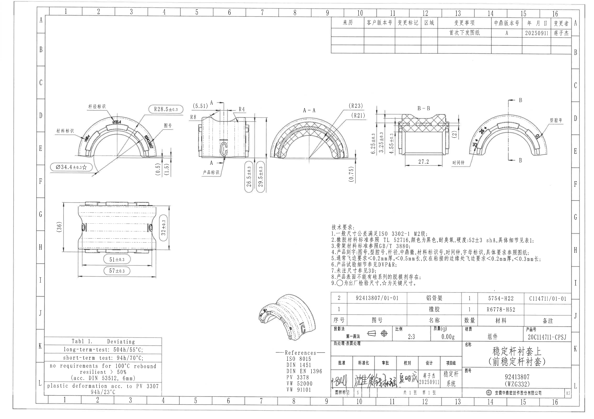

| 项目 | 内容 |
|---|---|
| 原 PDF | input/20C114711.pdf |
| 页码 | 1 |
| 整页 PNG | outputs/20C114711_assets/images/page_1.png |
| 图像尺寸 | 4959 × 3505 px |
| 说明 | 已先将 PDF 渲染为整页 PNG，再按加工视图、剖面视图、局部/参考视图、表格、NOTES、标题栏分别裁切。 |

## object_8 修订履历表

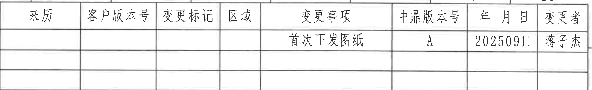

| 项目 | 内容 |
|---|---|
| 原图位置/视图名称 | 页面上方 A-B / 10-16 区域，修订履历表 |
| object_kind | table |
| bbox | [2765, 135, 4785, 445] |

原表行列还原：

| 来历 | 客户版本号 | 变更标记 | 区域 | 变更事项 | 中鼎版本号 | 年 月 日 | 变更者 |
|---|---|---|---|---|---|---|---|
|  |  |  |  | 首次下发图纸 | A | 20250911 | 蒋子杰 |
|  |  |  |  |  |  |  |  |
|  |  |  |  |  |  |  |  |

| 提取项 | 原图数值或文本 | 含义说明 |
|---|---|---|
| 表头 | 来历、客户版本号、变更标记、区域、变更事项、中鼎版本号、年 月 日、变更者 | 记录图纸版本、变更内容和责任人。 |
| 修订记录 | 首次下发图纸 / A / 20250911 / 蒋子杰 | 本图首次下发，中鼎版本号为 A，日期为 2025-09-11，变更者为蒋子杰。 |
| 空白记录行 | 2 行空白 | 原表保留空白行，未填写其他修订记录。 |

边界归属说明：裁切包含完整表格外框、列线、表头和 3 行记录；上边界靠近页框数字但不提取页框坐标文字。

## object_1 左上弧形主视图

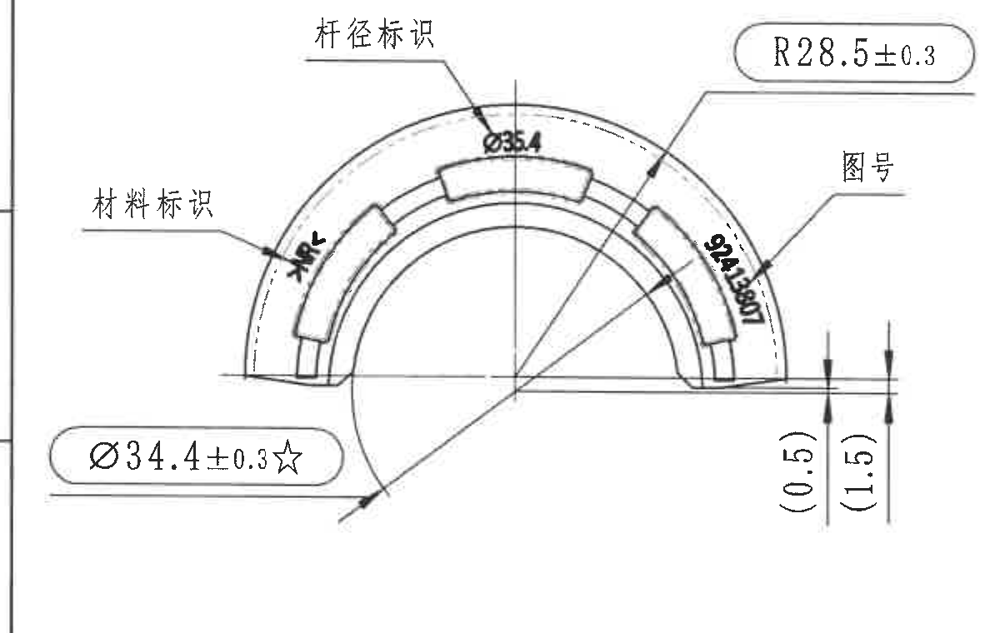

| 项目 | 内容 |
|---|---|
| 原图位置/视图名称 | 页面中左部 D-F / 2-5 区域，弧形主视图及标识引线 |
| object_kind | view |
| bbox | [360, 850, 1560, 1610] |

| 提取项 | 原图数值或文本 | 含义说明 |
|---|---|---|
| 半径尺寸 | R28.5±0.3 | 弧形外轮廓半径，带 ±0.3 公差。 |
| 关键直径尺寸 | Ø34.4±0.3☆ | 出厂/关键直径尺寸；☆按技术要求为关键尺寸，带 ±0.3 公差。 |
| 杆径标识文本 | Ø35.4 | 杆径标识位置的文字，属于产品刻字/标识要求。 |
| 材料标识 | 3×R | 材料标识引线指向左侧弧面刻字；带数量前缀 3×。 |
| 图号/弧面标识 | 324±50N | 图号引线指向右侧弧面刻字；原图为弧向布置文字。 |
| 参考尺寸 | (0.5) | 右侧竖向括号参考尺寸；括号表示参考尺寸，仅用于说明相对位置，不作为主控公差尺寸。 |
| 参考尺寸 | (1.5) | 右侧竖向括号参考尺寸；括号表示参考尺寸，仅用于说明相对位置。 |
| 标识引线 | 杆径标识、材料标识、图号 | 三条引线分别指向弧面刻字区域。 |
| T 编号 | 未见 | 当前视图未出现 T 编号。 |

边界归属说明：右侧边界收在相邻正视图标注之前；`(0.5)`、`(1.5)` 的完整尺寸线和文字属于本弧形主视图，未将相邻视图的 `(5.51)`、`R8` 纳入提取。

## object_2 中部正视图 / A-A 剖切指示

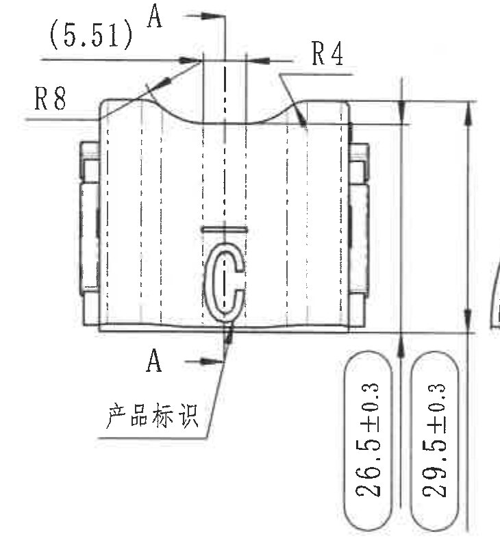

| 项目 | 内容 |
|---|---|
| 原图位置/视图名称 | 页面中部 D-F / 5-7 区域，正视图及 A-A 剖切位置 |
| object_kind | view |
| bbox | [1540, 835, 2270, 1625] |

| 提取项 | 原图数值或文本 | 含义说明 |
|---|---|---|
| 参考尺寸 | (5.51) | 顶部水平括号参考尺寸，说明剖切/槽口相关位置。 |
| 半径尺寸 | R8 | 左上圆角/曲面半径。 |
| 半径尺寸 | R4 | 右上圆角/曲面半径。 |
| 高度尺寸 | 26.5±0.3 | 内侧或局部高度控制尺寸，带 ±0.3 公差。 |
| 总高度尺寸 | 29.5±0.3 | 右侧整体高度控制尺寸，带 ±0.3 公差。 |
| 基准/剖切字母 | A、A | 上下两个 A 和箭头定义 A-A 剖切方向。 |
| 产品标识 | 产品标识、C 形标识 | 引线指向正面 C 形产品标识位置。 |
| T 编号 | 未见 | 当前视图未出现 T 编号。 |

边界归属说明：右侧裁切保留 `26.5±0.3` 和 `29.5±0.3` 的完整尺寸线、箭头和文字；最右侧只保留当前视图高度尺寸的外侧余量，不提取 A-A 剖面内容。

## object_3 A-A 剖面视图

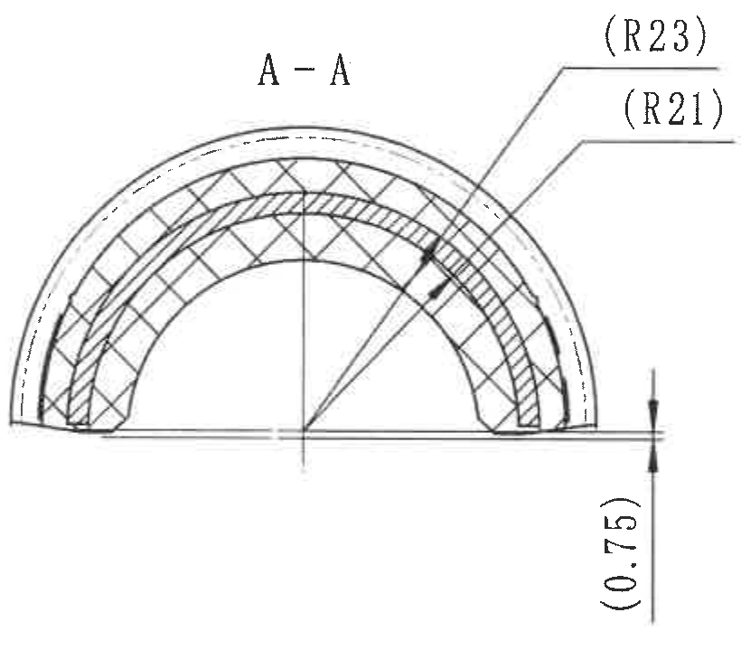

| 项目 | 内容 |
|---|---|
| 原图位置/视图名称 | 页面中部 D-F / 7-10 区域，A-A 剖面 |
| object_kind | section |
| bbox | [2245, 845, 3065, 1585] |

| 提取项 | 原图数值或文本 | 含义说明 |
|---|---|---|
| 剖面名称 | A-A | 对应 object_2 中 A-A 剖切线。 |
| 参考半径 | (R23) | 外侧弧形参考半径；括号表示参考尺寸。 |
| 参考半径 | (R21) | 内侧弧形参考半径；括号表示参考尺寸。 |
| 参考高度 | (0.75) | 右下竖向参考尺寸；括号表示参考尺寸。 |
| 剖面线 | 交叉剖面线 | 表示剖切材料/结构层次。 |
| T 编号 | 未见 | 当前剖面未出现 T 编号。 |

边界归属说明：右边界只保留 `(R23)`、`(R21)` 引线和 `(0.75)` 尺寸线；B-B 剖面中的 `6.25±0.3`、`3.25±0.3`、`4.55±0.3` 不归入本视图。

## object_4 B-B 剖面视图

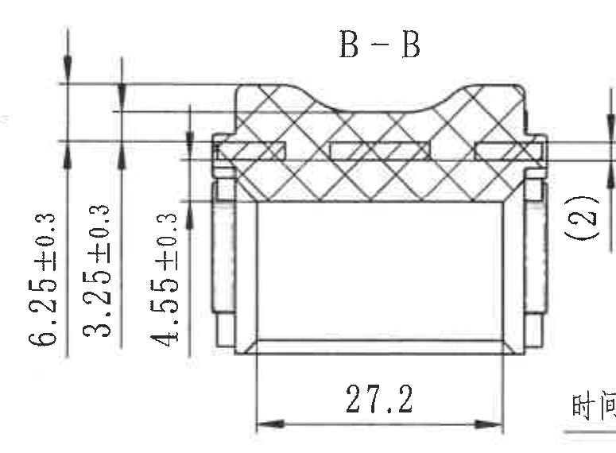

| 项目 | 内容 |
|---|---|
| 原图位置/视图名称 | 页面中部 D-F / 10-13 区域，B-B 剖面 |
| object_kind | section |
| bbox | [3060, 850, 3835, 1420] |

| 提取项 | 原图数值或文本 | 含义说明 |
|---|---|---|
| 剖面名称 | B-B | 对应 object_5 中 B-B 剖切线。 |
| 厚度/高度尺寸 | 6.25±0.3 | 左侧最外层竖向控制尺寸，带 ±0.3 公差。 |
| 厚度/高度尺寸 | 3.25±0.3 | 左侧中间竖向控制尺寸，带 ±0.3 公差。 |
| 厚度/高度尺寸 | 4.55±0.3 | 左侧内侧竖向控制尺寸，带 ±0.3 公差。 |
| 宽度尺寸 | 27.2 | 底部水平宽度尺寸，未标注显式公差。 |
| 参考尺寸 | (2) | 右侧竖向括号参考尺寸；括号表示参考尺寸。 |
| 剖面线 | 交叉剖面线 | 表示 B-B 截面处材料剖切区域。 |
| T 编号 | 未见 | 当前剖面未出现 T 编号。 |

边界归属说明：左侧 3 个竖向尺寸和底部 `27.2` 完整属于 B-B；右侧为保留 `(2)` 完整括号尺寸，边界附近可见相邻右弧视图“时间钟”引线的极少残边，该残边不作为 B-B 内容提取。

## object_5 右侧弧形视图 / B-B 剖切指示

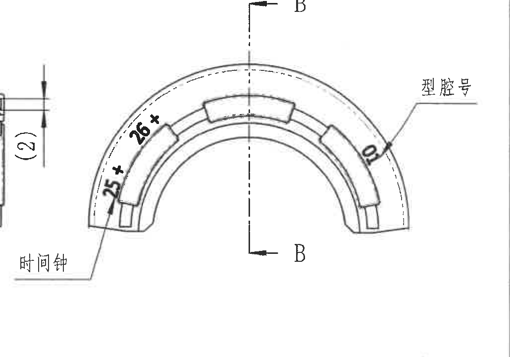

| 项目 | 内容 |
|---|---|
| 原图位置/视图名称 | 页面中右部 D-F / 13-16 区域，右侧弧形视图及 B-B 剖切位置 |
| object_kind | view |
| bbox | [3740, 830, 4770, 1550] |

| 提取项 | 原图数值或文本 | 含义说明 |
|---|---|---|
| 基准/剖切字母 | B、B | 上下两个 B 和箭头定义 B-B 剖切方向。 |
| 弧向/角度位置标注 | 25+、26+ | 左侧弧面上的弧向位置文字；原图未显示额外公差值。 |
| 型腔号 | 型腔号 | 引线指向右侧弧面刻字/型腔号位置。 |
| 时间钟 | 时间钟 | 引线指向左下弧面时间钟标识位置。 |
| 局部刻字 | D | 右侧弧面可见字母 D。 |
| T 编号 | 未见 | 当前视图未出现 T 编号。 |

边界归属说明：左侧为完整包含“时间钟”引线文字，保留了相邻 B-B 剖面 `(2)` 的局部边缘；该 `(2)` 已归入 object_4，不在本视图重复提取。右侧裁切未包含页框坐标列。

## object_6 左下展开/侧视图

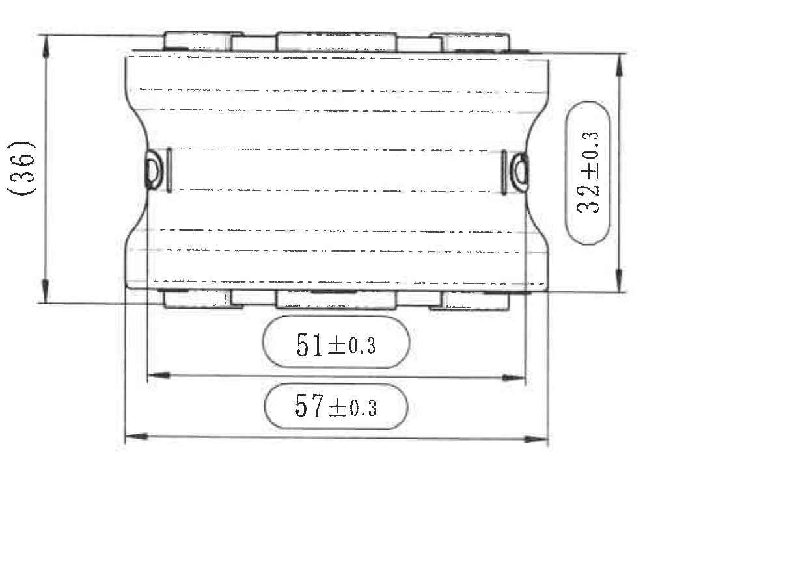

| 项目 | 内容 |
|---|---|
| 原图位置/视图名称 | 页面左下 G-I / 2-5 区域，展开/侧视图 |
| object_kind | view |
| bbox | [460, 1640, 1680, 2520] |

| 提取项 | 原图数值或文本 | 含义说明 |
|---|---|---|
| 参考高度 | (36) | 左侧总体参考高度；括号表示参考尺寸。 |
| 高度尺寸 | 32±0.3 | 右侧竖向高度控制尺寸，带 ±0.3 公差。 |
| 长度尺寸 | 51±0.3 | 底部内侧长度尺寸，带 ±0.3 公差。 |
| 总长度尺寸 | 57±0.3 | 底部外侧总长度尺寸，带 ±0.3 公差。 |
| 侧向特征 | 两侧圆/孔状结构 | 展开/侧视状态下显示两端侧向特征位置。 |
| T 编号 | 未见 | 当前视图未出现 T 编号。 |

边界归属说明：裁切完整包含 `(36)`、`32±0.3`、`51±0.3`、`57±0.3` 的尺寸线、箭头和文字；未混入下方测试表或右侧技术要求内容。

## object_9 技术要求 / NOTES

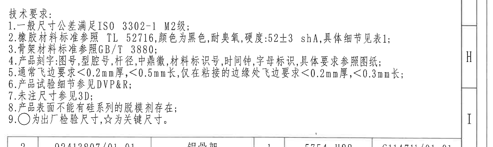

| 项目 | 内容 |
|---|---|
| 原图位置/视图名称 | 页面中右下 H-I / 10-16 区域，技术要求 |
| object_kind | notes |
| bbox | [2730, 1840, 4910, 2490] |

| 提取项 | 原图数值或文本 | 含义说明 |
|---|---|---|
| 标题 | 技术要求： | 该区域为图纸通用技术说明。 |
| 1 | 一般尺寸公差满足 ISO 3302-1 M2级； | 未单独标注的通用尺寸公差等级。 |
| 2 | 橡胶材料标准参照 TL 52716，颜色为黑色，耐臭氧，硬度:52±3 shA，具体细节见表1； | 橡胶材料、颜色、耐臭氧和硬度要求。 |
| 3 | 骨架材料标准参照 GB/T 3880； | 骨架材料执行标准。 |
| 4 | 产品刻字:图号,型腔号,杆径,中鼎徽,材料标识号,时间钟,字母标识,具体要求参照图纸； | 产品标识内容要求，对应各视图中的刻字引线。 |
| 5 | 通常飞边要求<0.2mm厚，<0.5mm长，仅在粘接的边缘处飞边要求<0.2mm厚，<0.3mm长； | 飞边厚度和长度限制。 |
| 6 | 产品试验细节参见 DVP&R； | 试验要求引用 DVP&R。 |
| 7 | 未注尺寸参见3D； | 未注尺寸由 3D 数据定义。 |
| 8 | 产品表面不能有硅系列的脱模剂存在； | 表面脱模剂限制。 |
| 9 | ○为出厂检验尺寸，☆为关键尺寸。 | 圆圈符号表示出厂检验尺寸，星号表示关键尺寸。 |

边界归属说明：右侧裁到图框坐标列以保证第 2、5 条完整；图框坐标 H/I 不属于 NOTES 内容。下边界可见 BOM 表顶线，不提取 BOM 字段。

## object_11 BOM / 明细表

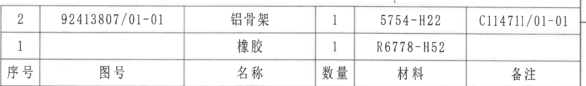

| 项目 | 内容 |
|---|---|
| 原图位置/视图名称 | 页面右下 J 区域，明细表 |
| object_kind | table |
| bbox | [2760, 2425, 4790, 2725] |

原表行列还原：

| 序号 | 图号 | 名称 | 数量 | 材料 | 备注 |
|---|---|---|---|---|---|
| 2 | 92413807/01-01 | 铝骨架 | 1 | 5754-H22 | C114711/01-01 |
| 1 |  | 橡胶 | 1 | R6778-H52 |  |

| 提取项 | 原图数值或文本 | 含义说明 |
|---|---|---|
| 表头 | 序号、图号、名称、数量、材料、备注 | 零件明细字段。 |
| 明细行 2 | 92413807/01-01 / 铝骨架 / 1 / 5754-H22 / C114711/01-01 | 铝骨架零件，数量 1，材料 5754-H22，备注为 C114711/01-01。 |
| 明细行 1 | 橡胶 / 1 / R6778-H52 | 橡胶件，数量 1，材料 R6778-H52。 |

边界归属说明：裁切包含明细表两行数据和表头；上方技术要求文字不在本对象内，下方标题栏从 object_12 单独裁切。

## object_12 标题栏

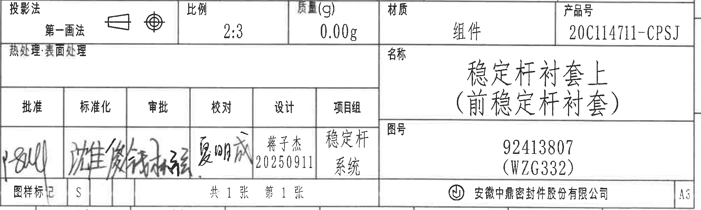

| 项目 | 内容 |
|---|---|
| 原图位置/视图名称 | 页面右下 K-L / 9-16 区域，标题栏 |
| object_kind | title_block |
| bbox | [2760, 2725, 4790, 3335] |

标题栏字段还原：

| 字段 | 原图数值或文本 |
|---|---|
| 投影法 | 第一画法 |
| 比例 | 2:3 |
| 质量(g) | 0.00g |
| 材质 | 组件 |
| 产品号 | 20C114711-CPSJ |
| 热处理/表面处理 | 原图字段存在，未填写具体值 |
| 名称 | 稳定杆衬套上（前稳定杆衬套） |
| 图号 | 92413807（WZG332） |
| 批准 | 手写签名 |
| 标准化 | 手写签名 |
| 审批 | 手写签名 |
| 校对 | 手写签名 |
| 设计 | 蒋子杰 / 20250911 |
| 项目组 | 稳定杆系统 |
| 图样标记 | S |
| 页数 | 共 1 张 第 1 张 |
| 公司 | 安徽中鼎密封件股份有限公司 |
| 图幅 | A3 |

| 提取项 | 原图数值或文本 | 含义说明 |
|---|---|---|
| 产品名称 | 稳定杆衬套上（前稳定杆衬套） | 图纸对应的组件/产品名称。 |
| 图号 | 92413807（WZG332） | 主图号及括号内代号。 |
| 产品号 | 20C114711-CPSJ | 标题栏产品号。 |
| 材质 | 组件 | 标题栏材质字段。 |
| 比例 | 2:3 | 图纸比例。 |
| 质量 | 0.00g | 标题栏质量字段。 |
| 设计信息 | 蒋子杰 / 20250911 | 设计者和日期。 |

边界归属说明：标题栏从投影法行开始，未混入上方 BOM 数据行；底部公司名、图样标记、页数和 A3 图幅完整。

## object_10 Tabl 1. Deviating

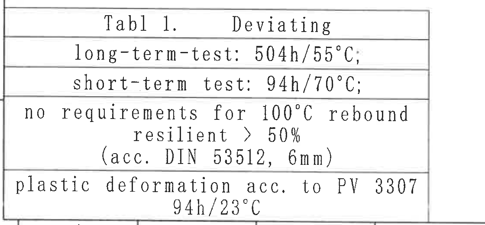

| 项目 | 内容 |
|---|---|
| 原图位置/视图名称 | 页面左下 K-L / 1-4 区域，Tabl 1. Deviating 表 |
| object_kind | table |
| bbox | [360, 2800, 1480, 3320] |

原表行列还原：

| Tabl 1. Deviating |
|---|
| long-term-test: 504h/55°C; |
| short-term test: 94h/70°C; |
| no requirements for 100°C rebound resilient > 50% (acc. DIN 53512, 6mm) |
| plastic deformation acc. to PV 3307 94h/23°C |

| 提取项 | 原图数值或文本 | 含义说明 |
|---|---|---|
| 表题 | Tabl 1. Deviating | 偏离/补充试验条件表。 |
| 长期试验 | long-term-test: 504h/55°C; | 长期试验时间和温度。 |
| 短期试验 | short-term test: 94h/70°C; | 短期试验时间和温度。 |
| 回弹要求 | no requirements for 100°C rebound; resilient > 50%; (acc. DIN 53512, 6mm) | 100°C 回弹无要求，弹性大于 50%，按 DIN 53512，6mm。 |
| 塑性变形 | plastic deformation acc. to PV 3307; 94h/23°C | 塑性变形按 PV 3307，条件 94h/23°C。 |

边界归属说明：表格外框、水平分隔线和最后一行 `94h/23°C` 完整；未混入下方图框坐标或右侧 References 文本。

## object_7 参考等轴视图与 References

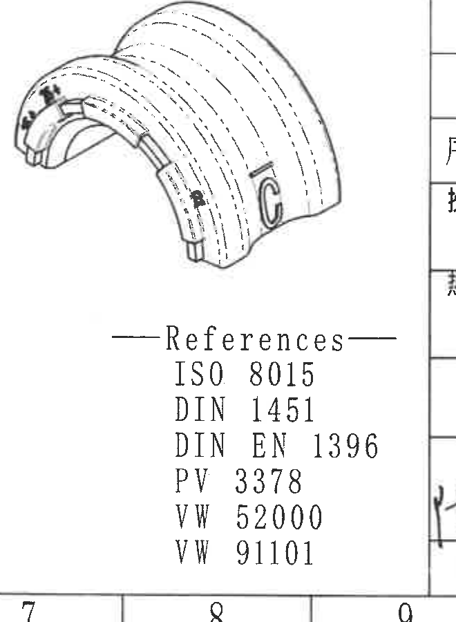

| 项目 | 内容 |
|---|---|
| 原图位置/视图名称 | 页面底部中间 J-L / 7-9 区域，参考等轴图和 References |
| object_kind | detail |
| bbox | [2140, 2460, 2800, 3360] |

| 提取项 | 原图数值或文本 | 含义说明 |
|---|---|---|
| 参考视图 | 等轴参考图 | 三维参考外观，显示弧形衬套、C 标识和局部弧面刻字位置。 |
| 参考标准 | ISO 8015 | 图纸引用标准。 |
| 参考标准 | DIN 1451 | 图纸引用标准。 |
| 参考标准 | DIN EN 1396 | 图纸引用标准。 |
| 参考标准 | PV 3378 | 图纸引用标准。 |
| 参考标准 | VW 52000 | 图纸引用标准。 |
| 参考标准 | VW 91101 | 图纸引用标准。 |
| 尺寸 | 未标注尺寸 | 当前参考图未给出独立尺寸线或公差。 |

边界归属说明：为完整保留 References 列表，右边界包含标题栏左侧分隔线和极少量相邻表格边缘；右侧标题栏字段不在本对象提取。底部页框坐标 7、8、9 不作为参考对象内容。

## 裁切检查记录

| 对象 | 图片路径 | 检查结果 |
|---|---|---|
| page_1 | outputs/20C114711_assets/images/page_1.png | 整页 PNG 完整，尺寸 4959×3505 px。 |
| object_1 | outputs/20C114711_assets/images/object_1.png | 完整包含左上弧形主视图、尺寸线、标识引线和文字；未混入相邻正视图标注。 |
| object_2 | outputs/20C114711_assets/images/object_2.png | 完整包含 `(5.51)`、`R8`、`R4`、`26.5±0.3`、`29.5±0.3` 和 A-A 剖切字母；右侧未提取 A-A 剖面内容。 |
| object_3 | outputs/20C114711_assets/images/object_3.png | 完整包含 A-A 剖面、`(R23)`、`(R21)`、`(0.75)`；未混入 B-B 尺寸。 |
| object_4 | outputs/20C114711_assets/images/object_4.png | 完整包含 B-B 剖面、`6.25±0.3`、`3.25±0.3`、`4.55±0.3`、`27.2`、`(2)`；右下有相邻“时间钟”引线残边，已排除不提取。 |
| object_5 | outputs/20C114711_assets/images/object_5.png | 完整包含右弧视图、B-B 剖切字母、`25+`、`26+`、“型腔号”、“时间钟”；左边缘有 B-B `(2)` 局部残片，已归属 object_4。 |
| object_6 | outputs/20C114711_assets/images/object_6.png | 完整包含侧视图和 `(36)`、`32±0.3`、`51±0.3`、`57±0.3` 尺寸线与文字。 |
| object_7 | outputs/20C114711_assets/images/object_7.png | 完整包含等轴参考图和 References 列表；右侧只保留分隔线/少量相邻表格边缘，不提取。 |
| object_8 | outputs/20C114711_assets/images/object_8.png | 修订履历表外框、列线、表头和记录完整。 |
| object_9 | outputs/20C114711_assets/images/object_9.png | 技术要求 1-9 条完整，右侧图框坐标列不提取。 |
| object_10 | outputs/20C114711_assets/images/object_10.png | Tabl 1. Deviating 表格所有行完整，最后一行未被截断。 |
| object_11 | outputs/20C114711_assets/images/object_11.png | BOM 明细表两行数据和表头完整，未混入标题栏。 |
| object_12 | outputs/20C114711_assets/images/object_12.png | 标题栏从投影法行开始，底部公司名、页数、图幅完整；未混入 BOM 数据行。 |
