# 20C114712 PDF 内容识别

整页渲染图：`outputs/20C114712_assets/images/page_1.png`  
页面尺寸：4959 x 3505 px，bbox `[0, 0, 4959, 3505]`

## object_1 左上主视图

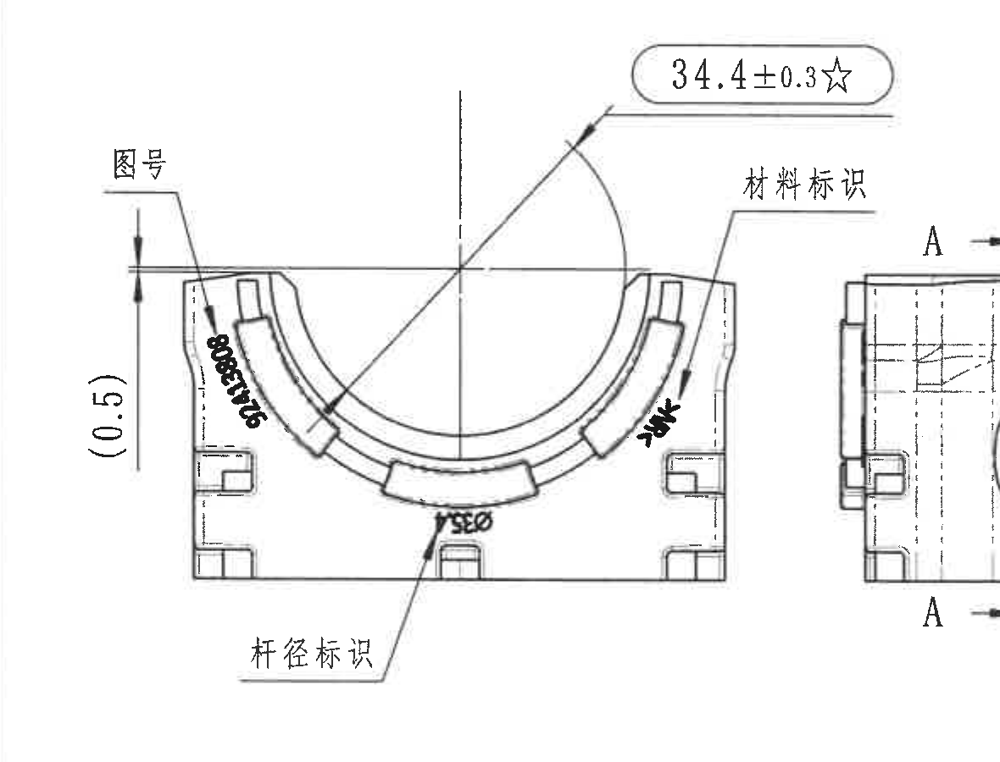

原图位置/视图名称：第 1 页左上主视图，bbox `[390, 585, 1570, 1485]`。

| 提取项 | 原图数值或文本 | 含义说明 |
|---|---|---|
| 关键尺寸 | `34.4±0.3☆` | 上部 U 形开口/弧形区域相关尺寸；`±0.3` 为尺寸公差；`☆` 按技术要求第 9 条为关键尺寸。 |
| 参考尺寸 | `(0.5)` | 左侧竖向括号尺寸，括号表示参考尺寸；用于说明左侧局部高度/位置关系，不作为普通控制尺寸。 |
| 图号标识 | `图号`；零件上竖排 `92413808` | 箭头指向零件左侧刻字位置；`92413808` 与标题栏图号一致。 |
| 材料标识 | `材料标识` | 箭头指向右侧弧形端部刻字/标识区域；具体黑色小字受扫描影响不完全清晰。 |
| 杆径标识 | `杆径标识`；零件底部疑似 `YSEØ` | 箭头指向底部中间标识位置；末位疑似直径符号 `Ø`，原图扫描有变形。 |
| 局部黑色标记 | 左侧竖排 `92413808`，右侧黑色小字疑似材料/字母标识 | 属于主视图上的刻字位置表达；右侧小字原图模糊，仅按可见形态记录。 |
| 基准字母/T 编号 | 未见 | 本主视图未见独立基准字母或 T 编号。 |
| 角度/弧向尺寸 | 未见角度值；弧形轮廓由相邻剖面半径补充表达 | 当前主视图没有角度数值，也没有明确弧长尺寸。 |

边界归属说明：为完整包含 `材料标识` 引线文字，右侧裁切边界靠近相邻侧视图，局部可见相邻 A-A 视图边缘；该相邻片段不纳入本对象提取。`34.4±0.3☆`、`(0.5)`、`图号`、`材料标识`、`杆径标识` 的箭头和文字均归属本主视图。

## object_2 侧视图 / A-A 剖切定位视图

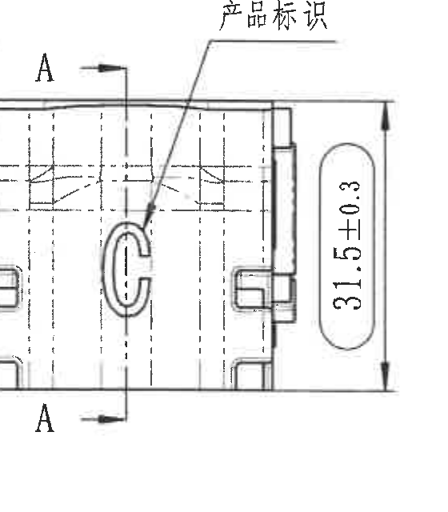

原图位置/视图名称：第 1 页上排中左侧视图，bbox `[1435, 785, 1995, 1425]`。

| 提取项 | 原图数值或文本 | 含义说明 |
|---|---|---|
| 总高度尺寸 | `31.5±0.3` | 右侧竖向总高度尺寸，带 `±0.3` 公差。 |
| 剖切基准 | `A`、`A` | 上下两处 A 标识和箭头定义 A-A 剖切方向；与 object_3 的 A-A 剖面对应。 |
| 产品标识 | `产品标识` | 引线指向中部 C 形凸/凹标识位置。 |
| 隐线/中心线 | 多条虚线 | 表示内部结构或被遮挡结构，不是独立尺寸数值。 |
| 参考尺寸/角度/R/T 编号 | 未见 | 当前侧视图未见括号参考尺寸、角度、半径或 T 编号。 |

边界归属说明：左边缘可见相邻主视图的少量断线，这是为保留 A 剖切箭头和主体外形产生的边界贴近现象；未把该残线作为本侧视图内容提取。`31.5±0.3` 与 A-A 剖切箭头完整归属本视图。

## object_3 A-A 剖面视图

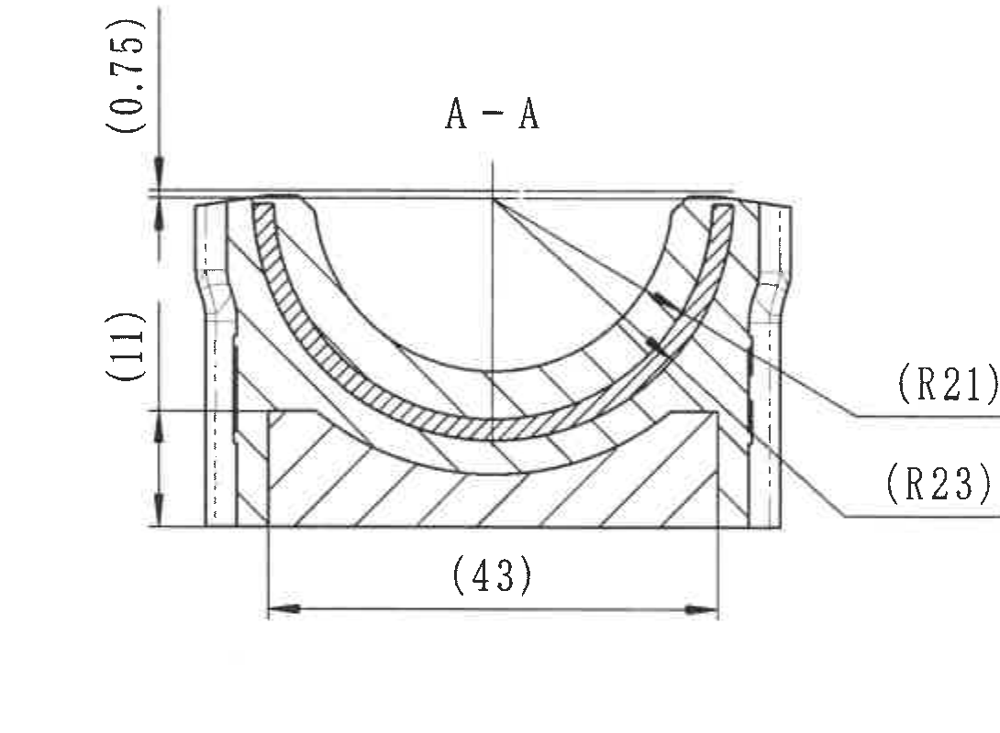

原图位置/视图名称：第 1 页上排中部 A-A 剖面，bbox `[1940, 700, 3030, 1500]`。

| 提取项 | 原图数值或文本 | 含义说明 |
|---|---|---|
| 剖面名称 | `A-A` | 与 object_2 中 A 剖切线对应。 |
| 参考尺寸 | `(0.75)` | 左上竖向小尺寸，括号表示参考尺寸。 |
| 参考尺寸 | `(11)` | 左侧竖向参考高度尺寸。 |
| 参考尺寸 | `(43)` | 底部水平参考总宽尺寸。 |
| 参考半径 | `(R21)` | 右侧引线指向内侧弧面，括号表示参考半径。 |
| 参考半径 | `(R23)` | 右侧引线指向外侧弧面，括号表示参考半径。 |
| 剖面线 | 斜线剖面填充 | 表示该视图为剖切所得实体截面。 |
| 公差/星号/角度/T 编号 | 未见 | 本剖面未见独立公差、关键星号、角度值或 T 编号。 |

边界归属说明：左侧 `(0.75)`、`(11)` 的尺寸线靠近 object_2，但箭头和尺寸线指向 A-A 剖面截面，归属 A-A 剖面；没有把 object_2 的 `31.5±0.3` 提入本对象。右侧 `(R21)`、`(R23)` 引线和文字完整包含。

## object_4 B-B 剖面视图

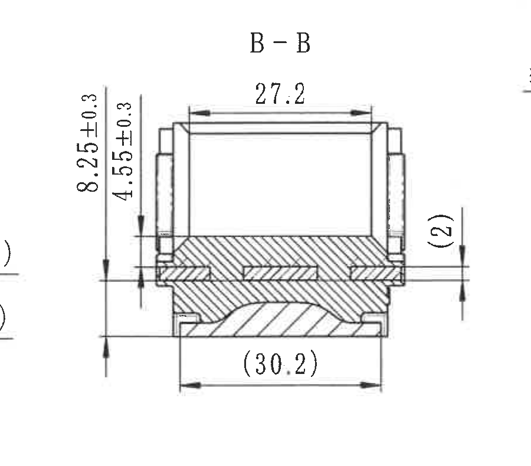

原图位置/视图名称：第 1 页上排中右 B-B 剖面，bbox `[3010, 690, 3910, 1480]`。

| 提取项 | 原图数值或文本 | 含义说明 |
|---|---|---|
| 剖面名称 | `B-B` | 与 object_5 中 B 剖切线对应。 |
| 水平尺寸 | `27.2` | 顶部水平宽度尺寸。 |
| 竖向尺寸 | `8.25±0.3` | 左侧竖向尺寸，带 `±0.3` 公差。 |
| 竖向尺寸 | `4.55±0.3` | 左侧局部竖向尺寸，带 `±0.3` 公差。 |
| 参考尺寸 | `(2)` | 右侧竖向括号参考尺寸。 |
| 参考尺寸 | `(30.2)` | 底部水平参考尺寸。 |
| 剖面线 | 斜线剖面填充 | 表示被剖材料区域。 |
| 星号/角度/R/T 编号 | 未见 | 本剖面未见关键星号、角度、半径或 T 编号。 |

边界归属说明：本裁切只提取 B-B 剖面自身的尺寸；右侧 object_5 的 B 剖切定位视图和型腔/时间钟标识不归入本对象。

## object_5 右上 B 剖切定位视图

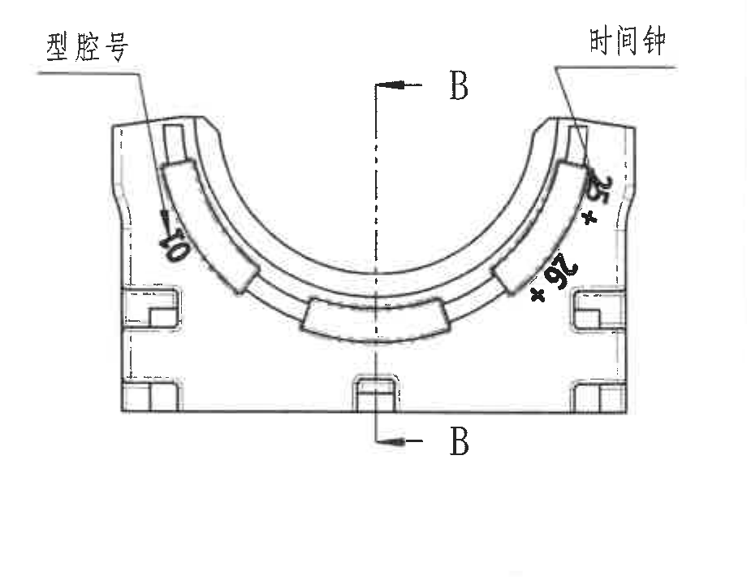

原图位置/视图名称：第 1 页右上 B 剖切定位视图，bbox `[3850, 755, 4770, 1465]`。

| 提取项 | 原图数值或文本 | 含义说明 |
|---|---|---|
| 剖切基准 | `B`、`B` | 上下两处 B 标识和箭头定义 B-B 剖切方向；与 object_4 的 B-B 剖面对应。 |
| 型腔号标识 | `型腔号` | 引线指向左侧弧形区域的型腔号刻字位置。 |
| 时间钟标识 | `时间钟` | 引线指向右上端部时间钟刻字/标识位置。 |
| 数量/字母类标识 | `×6`，另有星号和疑似字母/符号 | 右侧弧形区域可见黑色标识；扫描变形，除 `×6` 与星号外其余字符不完全清晰。 |
| 线性尺寸/R/角度/T 编号 | 未见 | 当前视图用于标识和 B-B 剖切定位，未标出独立线性尺寸、半径、角度或 T 编号。 |

边界归属说明：左侧边界为完整包含 `型腔号` 文字而外扩；未把左侧 B-B 剖面尺寸归入本对象。右侧图框索引列已排除，仅保留视图及其标识文字。

## object_6 中左下视图

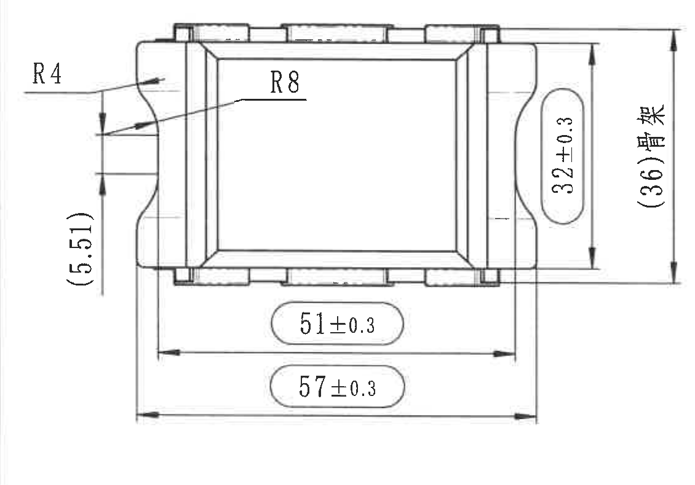

原图位置/视图名称：第 1 页中左下俯视/底面加工视图，bbox `[385, 1740, 1515, 2530]`。

| 提取项 | 原图数值或文本 | 含义说明 |
|---|---|---|
| 半径 | `R4` | 左上局部圆角/弧面半径。 |
| 半径 | `R8` | 内侧斜面/过渡弧半径。 |
| 参考尺寸 | `(5.51)` | 左侧竖向参考尺寸。 |
| 竖向尺寸 | `32±0.3` | 右侧内部竖向尺寸，带 `±0.3` 公差。 |
| 参考总尺寸 | `(36)臂长` | 右侧外部竖向参考尺寸；括号表示参考，后缀文字为“臂长”。 |
| 水平尺寸 | `51±0.3` | 底部内侧水平尺寸，带 `±0.3` 公差。 |
| 水平尺寸 | `57±0.3` | 底部外侧水平尺寸，带 `±0.3` 公差。 |
| 角度/T 编号/基准字母 | 未见 | 当前视图未见角度、T 编号或基准字母。 |

边界归属说明：该裁切完整包含 R4、R8、左侧 `(5.51)`、右侧 `32±0.3` 与 `(36)臂长`、底部 `51±0.3` 和 `57±0.3` 的尺寸线与文字；未带入其他视图。

## object_7 等轴测参考图

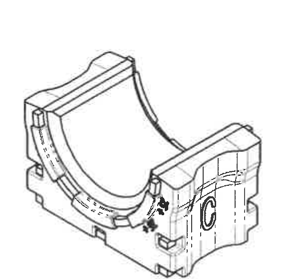

原图位置/视图名称：第 1 页下中等轴测参考图，bbox `[2160, 2270, 2745, 2830]`。

| 提取项 | 原图数值或文本 | 含义说明 |
|---|---|---|
| 视图类型 | 等轴测参考图 | 展示零件三维外观和局部标识位置。 |
| 可见标识 | 侧面可见 C 形/字母类标识及黑色标识 | 与二维视图的产品标识、材料/时间/字母类标识位置相互对应；未给出尺寸数值。 |
| 尺寸/R/角度/公差/T 编号 | 未见 | 本对象为参考外观图，不含独立尺寸标注。 |

边界归属说明：右侧 BOM/标题栏表格线已从最终裁切中排除；下方 References 另作为 object_11 提取，不归入本等轴测图。

## object_8 修订履历表

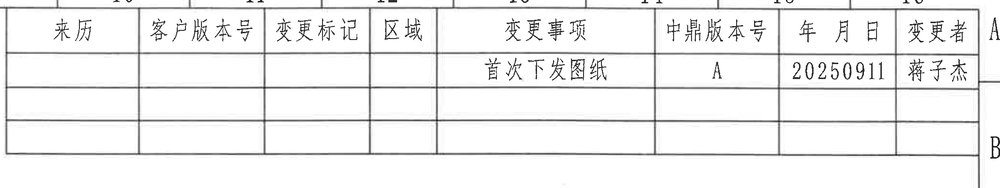

原图位置/视图名称：第 1 页右上修订履历表，bbox `[2760, 120, 4825, 510]`。

原表还原：

| 来历 | 客户版本号 | 变更标记 | 区域 | 变更事项 | 中鼎版本号 | 年 月 日 | 变更者 |
|---|---|---|---|---|---|---|---|
|  |  |  |  | 首次下发图纸 | A | 20250911 | 蒋子杰 |
|  |  |  |  |  |  |  |  |
|  |  |  |  |  |  |  |  |

| 提取项 | 原图数值或文本 | 含义说明 |
|---|---|---|
| 表头 | `来历 / 客户版本号 / 变更标记 / 区域 / 变更事项 / 中鼎版本号 / 年 月 日 / 变更者` | 修订履历字段。 |
| 修订记录 | `首次下发图纸`、`A`、`20250911`、`蒋子杰` | 表示首次下发图纸；中鼎版本号为 A；日期为 2025-09-11；变更者为蒋子杰。 |
| 空白行 | 两行空白 | 原表预留修订记录行。 |

边界归属说明：上方和右侧可见图框坐标编号/字母不是修订表字段；仅表格内列名和行内容归入 object_8。

## object_9 NOTES / 技术要求

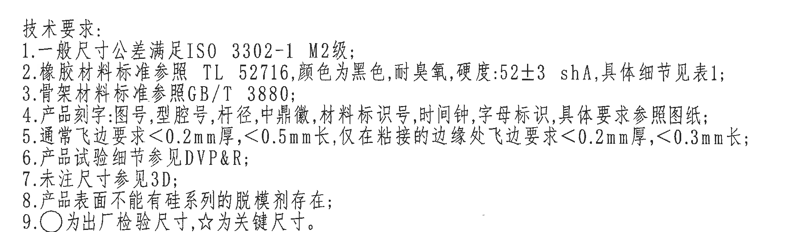

原图位置/视图名称：第 1 页右中技术要求文本，bbox `[2740, 1735, 4660, 2295]`。

| 提取项 | 原图数值或文本 | 含义说明 |
|---|---|---|
| 标题 | `技术要求:` | 技术说明区域标题。 |
| 1 | `一般尺寸公差满足ISO 3302-1 M2级;` | 未单独标注公差的普通尺寸按 ISO 3302-1 M2 级。 |
| 2 | `橡胶材料标准参照 TL 52716,颜色为黑色,耐臭氧,硬度:52±3 shA,具体细节见表1;` | 橡胶材料、颜色、耐臭氧和硬度要求；硬度公差为 `52±3 shA`。 |
| 3 | `骨架材料标准参照GB/T 3880;` | 骨架材料标准。 |
| 4 | `产品刻字:图号,型腔号,杆径,中鼎徽,材料标识号,时间钟,字母标识,具体要求参照图纸;` | 说明图纸中各标识的刻字项目。 |
| 5 | `通常飞边要求<0.2mm厚,<0.5mm长,仅在粘接的边缘处飞边要求<0.2mm厚,<0.3mm长;` | 飞边厚度和长度要求。 |
| 6 | `产品试验细节参见DVP&R;` | 试验细节引用 DVP&R。 |
| 7 | `未注尺寸参见3D;` | 未注尺寸由 3D 数据定义。 |
| 8 | `产品表面不能有硅系列的脱模剂存在;` | 表面脱模剂限制。 |
| 9 | `○为出厂检验尺寸,☆为关键尺寸。` | 说明圆圈符号和星号符号含义。 |

边界归属说明：下边界位于 BOM 表上方，未把 BOM 表格线纳入技术要求对象。技术要求第 1 至第 9 条文字完整。

## object_10 表 1 / Deviating

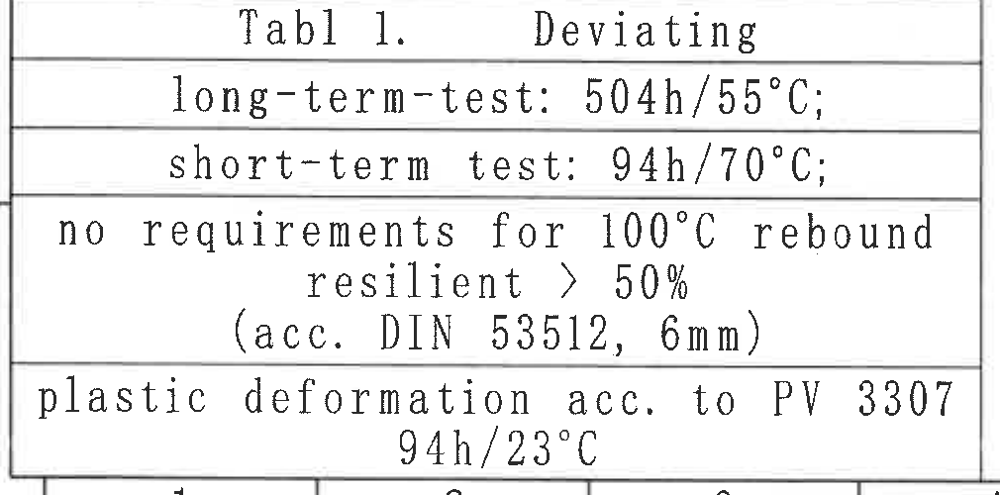

原图位置/视图名称：第 1 页左下表 1，bbox `[370, 2825, 1380, 3325]`。

原表还原：

| 原表行 | 文本 |
|---|---|
| 1 | `Tabl 1.        Deviating` |
| 2 | `long-term-test: 504h/55°C;` |
| 3 | `short-term test: 94h/70°C;` |
| 4 | `no requirements for 100°C rebound` |
| 5 | `resilient > 50%` |
| 6 | `(acc. DIN 53512, 6mm)` |
| 7 | `plastic deformation acc. to PV 3307` |
| 8 | `94h/23°C` |

| 提取项 | 原图数值或文本 | 含义说明 |
|---|---|---|
| 表题 | `Tabl 1. Deviating` | 材料/试验偏离条件表。 |
| 长期试验 | `504h/55°C` | 长期试验时间和温度。 |
| 短期试验 | `94h/70°C` | 短期试验时间和温度。 |
| 回弹要求 | `no requirements for 100°C rebound resilient > 50% (acc. DIN 53512, 6mm)` | 100°C 回弹相关要求和 DIN 53512 参考。 |
| 塑性变形 | `plastic deformation acc. to PV 3307 94h/23°C` | 按 PV 3307 的塑性变形测试条件。 |

边界归属说明：表格边框和全部行文字完整；底部靠近图框坐标线，但图框数字不归入表 1。

## object_11 References / 引用标准

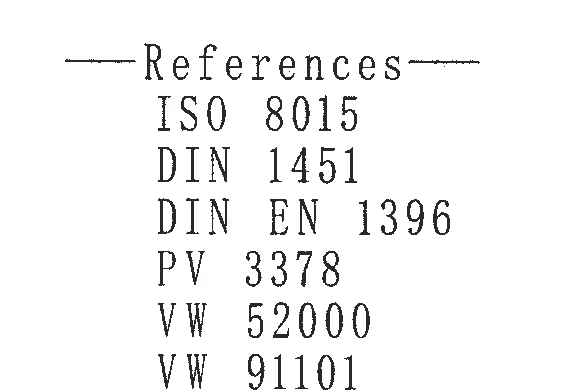

原图位置/视图名称：第 1 页下中 References 文本，bbox `[2160, 2880, 2730, 3270]`。

| 提取项 | 原图数值或文本 | 含义说明 |
|---|---|---|
| 标题 | `References` | 引用标准列表标题。 |
| 引用标准 | `ISO 8015` | 引用标准。 |
| 引用标准 | `DIN 1451` | 引用标准。 |
| 引用标准 | `DIN EN 1396` | 引用标准。 |
| 引用标准 | `PV 3378` | 引用标准。 |
| 引用标准 | `VW 52000` | 引用标准。 |
| 引用标准 | `VW 91101` | 引用标准。 |

边界归属说明：该对象只包含 References 标题和标准清单；上方等轴测图与下方图框坐标线已排除。

## object_12 BOM / 明细表

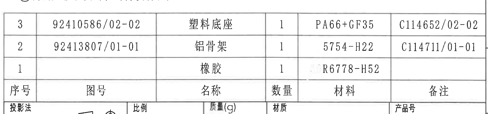

原图位置/视图名称：第 1 页右下 BOM/明细表，bbox `[2760, 2290, 4795, 2770]`。

原表还原：

| 序号 | 图号 | 名称 | 数量 | 材料 | 备注 |
|---|---|---|---|---|---|
| 3 | `92410586/02-02` | 塑料底座 | 1 | `PA66+GF35` | `C114652/02-02` |
| 2 | `92413807/01-01` | 铝骨架 | 1 | `5754-H22` | `C114711/01-01` |
| 1 |  | 橡胶 | 1 | `R6778-H52` |  |

| 提取项 | 原图数值或文本 | 含义说明 |
|---|---|---|
| 表头 | `序号 / 图号 / 名称 / 数量 / 材料 / 备注` | 明细表字段。 |
| 零件 3 | `92410586/02-02; 塑料底座; 1; PA66+GF35; C114652/02-02` | 塑料底座，材料 PA66+GF35。 |
| 零件 2 | `92413807/01-01; 铝骨架; 1; 5754-H22; C114711/01-01` | 铝骨架，材料 5754-H22。 |
| 零件 1 | `橡胶; 1; R6778-H52` | 橡胶件，图号和备注栏为空。 |

边界归属说明：明细表表头在原图位于底行，表格按原图字段还原；底部可见标题栏上缘，未把标题栏内容归入 BOM。

## object_13 标题栏

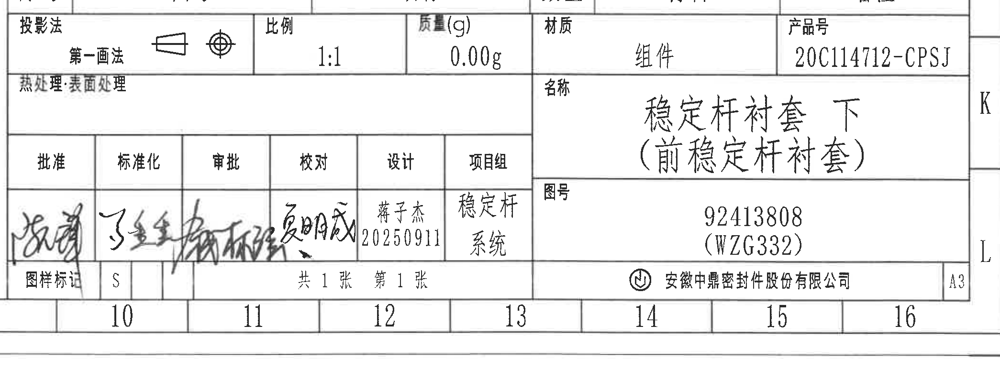

原图位置/视图名称：第 1 页右下标题栏，bbox `[2760, 2690, 4850, 3485]`。

原表还原：

| 字段 | 原图文本 |
|---|---|
| 投影法 | `第一画法`，配第一角法图符 |
| 比例 | `1:1` |
| 质量(g) | `0.00g` |
| 材质 | `组件` |
| 产品号 | `20C114712-CPSJ` |
| 热处理:表面处理 | 空白 |
| 名称 | `稳定杆衬套 下（前稳定杆衬套）` |
| 图号 | `92413808 (WZG332)` |
| 批准 | 手写签名，原图无法可靠转写 |
| 标准化 | 手写签名，原图无法可靠转写 |
| 审批 | 手写签名，原图无法可靠转写 |
| 校对 | 手写签名，原图无法可靠转写 |
| 设计 | `蒋子杰 20250911` |
| 项目组 | `稳定杆 系统` |
| 图样标记 | `S` |
| 张数 | `共 1 张  第 1 张` |
| 公司 | `安徽中鼎密封件股份有限公司` |
| 图幅 | `A3` |

| 提取项 | 原图数值或文本 | 含义说明 |
|---|---|---|
| 产品号 | `20C114712-CPSJ` | 标题栏产品编号。 |
| 名称 | `稳定杆衬套 下（前稳定杆衬套）` | 图纸零件/组件名称。 |
| 图号 | `92413808 (WZG332)` | 图纸编号及括号内代号。 |
| 材质 | `组件` | 标题栏材质栏。 |
| 比例 | `1:1` | 图纸比例。 |
| 质量 | `0.00g` | 标题栏质量栏。 |
| 设计 | `蒋子杰 20250911` | 设计者与日期。 |
| 项目组 | `稳定杆 系统` | 项目组信息。 |

边界归属说明：标题栏下方和右侧保留少量图框坐标数字/图框线，以确保公司名、A3 图幅和右侧边框完整；图框坐标数字不作为标题栏字段提取。BOM 明细表内容不归入本对象。

## 裁切检查记录

| 对象 | 检查结果 | 是否重裁/说明 |
|---|---|---|
| page_1 | 整页 PNG 已由 PDF 渲染，尺寸 4959 x 3505 px。 | 满足整页渲染要求。 |
| object_1 | `34.4±0.3☆`、`(0.5)`、图号/材料/杆径标识引线和文字完整。 | 已重裁；右侧为保留材料标识带入相邻视图边缘，归属已排除。 |
| object_2 | `31.5±0.3`、A-A 剖切箭头、产品标识完整。 | 已重裁；左边缘少量相邻断线不提取。 |
| object_3 | `(0.75)`、`(11)`、`(43)`、`(R21)`、`(R23)` 及 A-A 标题完整。 | 已重裁；未混入 object_2 的 `31.5±0.3`。 |
| object_4 | `27.2`、`8.25±0.3`、`4.55±0.3`、`(2)`、`(30.2)` 及 B-B 标题完整。 | 已重裁；与 object_5 分离。 |
| object_5 | `型腔号`、`时间钟`、B-B 剖切箭头和可见标识完整。 | 已重裁；不提取 B-B 剖面尺寸。 |
| object_6 | R4、R8、`(5.51)`、`32±0.3`、`(36)臂长`、`51±0.3`、`57±0.3` 完整。 | 无需再裁。 |
| object_7 | 等轴测参考图主体完整，未包含右侧表格。 | 已重裁；References 已拆出。 |
| object_8 | 修订履历表列头和记录完整。 | 已重裁；顶部/右侧图框索引不提取。 |
| object_9 | 技术要求第 1 至第 9 条完整。 | 已重裁；不包含 BOM 表格。 |
| object_10 | 表 1 全部行文字和边框完整。 | 已重裁；底部图框线不提取。 |
| object_11 | References 标题和 ISO/DIN/PV/VW 清单完整。 | 已重裁；不包含等轴测图和图框坐标。 |
| object_12 | BOM 表头和 3 条明细记录完整。 | 已重裁；底部标题栏上缘不提取。 |
| object_13 | 标题栏字段、公司名和 A3 图幅完整。 | 已重裁；底部图框坐标数字不提取。 |
