# 20C114713 PDF 内容识别

来源文件：`input/20C114713.pdf`  
整页渲染图：`outputs/20C114713_assets/images/page_1.png`  
整页 PNG 尺寸：4959 x 3505 px

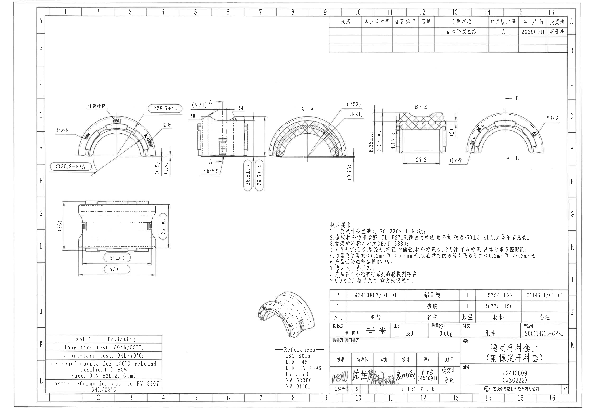

## object_10 - 顶部修订履历表

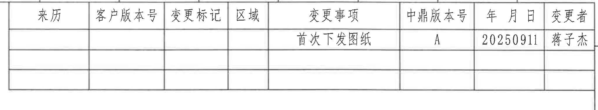

原图位置/视图名称：第 1 页上部，图区 10-16 / A-B 附近，修订履历表。  
object_kind：table  
bbox：`[2740, 130, 4790, 510]`

### 原表还原

| 来源 | 客户版本号 | 变更标记 | 区域 | 变更事项 | 中鼎版本号 | 年月日 | 变更者 |
|---|---|---|---|---|---|---|---|
|  |  |  |  | 首次下发图纸 | A | 20250911 | 蒋子杰 |
|  |  |  |  |  |  |  |  |
|  |  |  |  |  |  |  |  |

### 提取表格

| 提取项 | 原图数值或文本 | 含义说明 |
|---|---|---|
| 变更事项 | 首次下发图纸 | 本图首次发布/下发。 |
| 中鼎版本号 | A | 中鼎内部版本为 A。 |
| 年月日 | 20250911 | 修订/下发日期。 |
| 变更者 | 蒋子杰 | 变更执行人。 |

边界归属说明：裁切沿修订履历表外框截取，保留完整列线、表头和空白记录行；右侧图框字母未纳入表格提取。

## object_1 - 左上主弧形视图

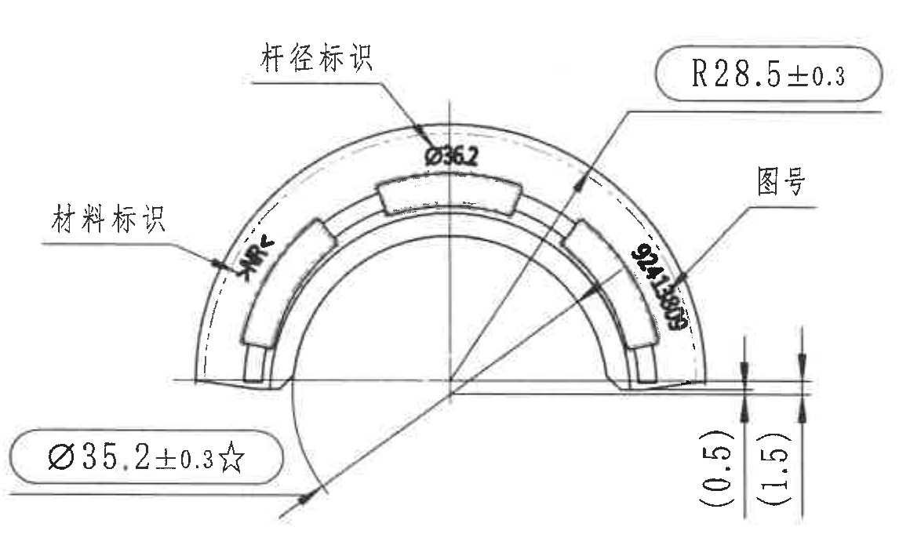

原图位置/视图名称：第 1 页左上，弧形主视图，图区 2-4 / D-F 附近。  
object_kind：view  
bbox：`[410, 820, 1570, 1520]`

### 提取表格

| 提取项 | 原图数值或文本 | 含义说明 |
|---|---|---|
| 杆径标识 | 杆径标识；`Ø36.2` | 顶部引线指向产品上的杆径刻字/标识位置，数值为直径符号 `Ø` 后接 36.2。 |
| 材料标识 | 材料标识；黑体材料符号 | 左侧引线指向材料标识刻字，扫描件中字母/符号局部模糊，按标识归属记录，不作为尺寸。 |
| 半径尺寸 | `R28.5±0.3` | 外弧半径尺寸，公差为 ±0.3。 |
| 图号标识 | 图号；`92413809` | 右侧引线指向产品弧面上的图号刻字，竖排显示，不作为尺寸。 |
| 关键直径尺寸 | `Ø35.2±0.3☆` | 直径尺寸，公差 ±0.3；星号按技术要求第 9 条解释为关键尺寸。 |
| 参考尺寸 | `(0.5)` | 右端台阶附近括号内尺寸，作为参考尺寸记录。 |
| 参考尺寸 | `(1.5)` | 右端台阶附近括号内尺寸，作为参考尺寸记录。 |
| T 编号 | 未见 | 本视图内未见 T 编号。 |

边界归属说明：裁切包含本主视图外弧、底部直径标注和右侧 `(0.5)/(1.5)` 参考尺寸的完整文字及尺寸线；未把相邻正视图、A-A 或 B-B 剖面尺寸归入本视图。

## object_2 - 上中正视图/剖切 A 位置

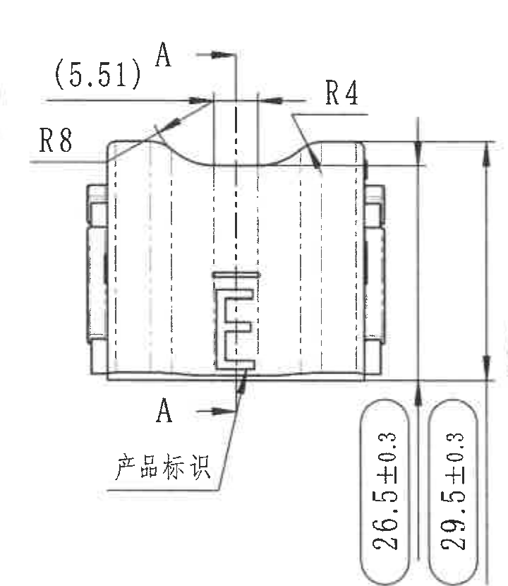

原图位置/视图名称：第 1 页上中，正视图及 A-A 剖切位置，图区 5-7 / D-F 附近。  
object_kind：view  
bbox：`[1540, 780, 2260, 1610]`

### 提取表格

| 提取项 | 原图数值或文本 | 含义说明 |
|---|---|---|
| 参考尺寸 | `(5.51)` | 顶部开口/定位处括号内尺寸，为参考尺寸。 |
| 剖切字母 | `A`、`A` | 上下两处 A 标识定义 A-A 剖面位置。 |
| 圆角半径 | `R8` | 左上过渡圆角半径。 |
| 圆角半径 | `R4` | 右上过渡圆角半径。 |
| 产品标识 | 产品标识 | 下方引线指向前面中部产品标识刻字区域。 |
| 高度尺寸 | `26.5±0.3` | 右侧竖向高度尺寸，公差 ±0.3。 |
| 总高度尺寸 | `29.5±0.3` | 右侧外侧总高度尺寸，公差 ±0.3。 |
| T 编号 | 未见 | 本视图内未见 T 编号。 |

边界归属说明：裁切完整包含上方 `(5.51)`、R8、R4、A-A 剖切字母和右侧两条竖向尺寸线；没有把左侧主视图或右侧 A-A 剖面尺寸混入。

## object_3 - A-A 剖面视图

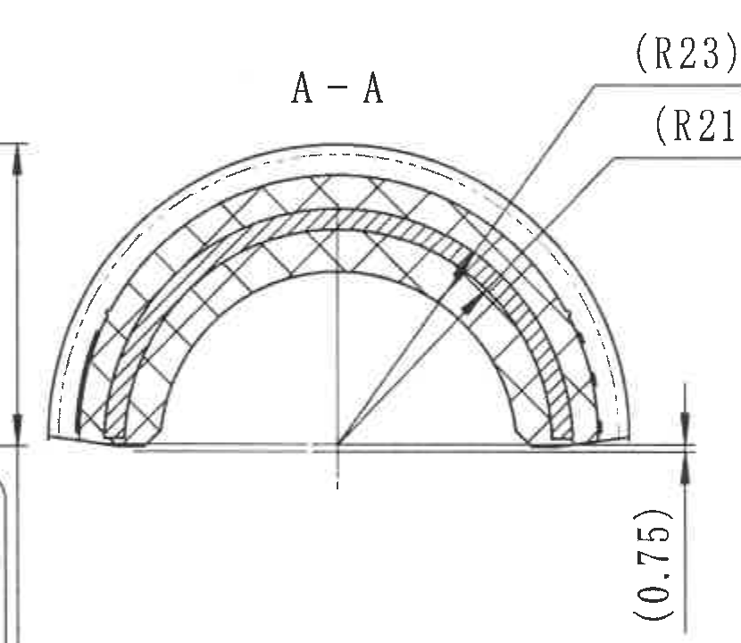

原图位置/视图名称：第 1 页中上，A-A 剖面，图区 8-10 / D-F 附近。  
object_kind：section  
bbox：`[2210, 820, 3040, 1540]`

### 提取表格

| 提取项 | 原图数值或文本 | 含义说明 |
|---|---|---|
| 剖面名称 | `A-A` | 与 object_2 中 A/A 剖切位置对应。 |
| 参考半径 | `(R23)` | 上方外层弧面参考半径，括号表示参考尺寸。 |
| 参考半径 | `(R21)` | 内层弧面参考半径，括号表示参考尺寸。 |
| 参考尺寸 | `(0.75)` | 右下竖向括号内尺寸，为参考尺寸。 |
| 剖面填充 | 交叉剖面线 | 表示剖切到的材料区域。 |
| T 编号 | 未见 | 本剖面内未见 T 编号。 |

边界归属说明：裁切覆盖完整 A-A 剖面、两条半径引线和右下 `(0.75)` 参考尺寸；未将右侧 B-B 剖面或左侧正视图尺寸归入本对象。

## object_4 - B-B 剖面视图

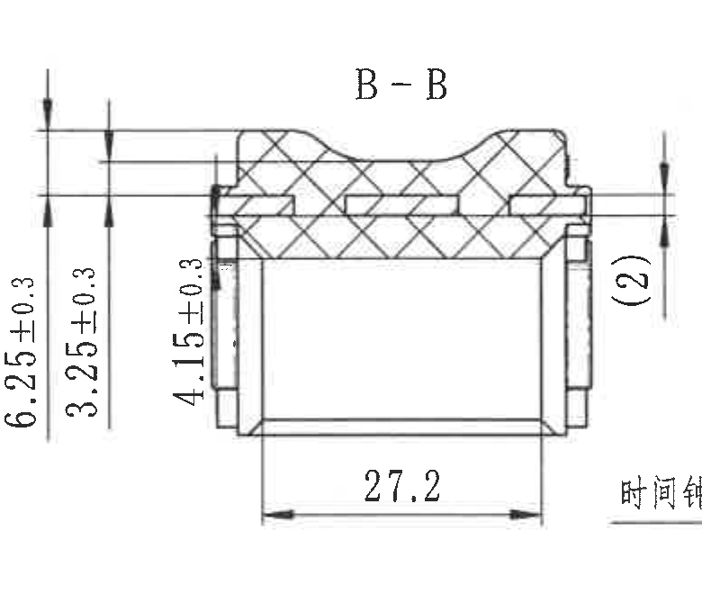

原图位置/视图名称：第 1 页中上偏右，B-B 剖面，图区 11-13 / D-F 附近。  
object_kind：section  
bbox：`[3100, 805, 3880, 1465]`

### 提取表格

| 提取项 | 原图数值或文本 | 含义说明 |
|---|---|---|
| 剖面名称 | `B-B` | 与 object_5 中 B/B 剖切位置对应。 |
| 竖向尺寸 | `6.25±0.3` | 左侧外层竖向尺寸，公差 ±0.3。 |
| 竖向尺寸 | `3.25±0.3` | 左侧内层竖向尺寸，公差 ±0.3。 |
| 竖向尺寸 | `4.15±0.3` | 左侧局部高度尺寸，公差 ±0.3。 |
| 水平尺寸 | `27.2` | 底部水平长度尺寸，未在该标注处给出单独公差；一般公差见技术要求第 1 条。 |
| 参考尺寸 | `(2)` | 右侧括号内竖向参考尺寸。 |
| T 编号 | 未见 | 本剖面内未见 T 编号。 |

边界归属说明：裁切完整包含 B-B 剖面自身尺寸线与文字。右下边缘可见相邻局部视图“时间钟”文字边缘，该文字不属于 B-B，未在本对象提取；左侧 A-A 的 `(R23)/(R21)` 未归入本对象。

## object_5 - 右侧局部标识视图 / B-B 剖切位置

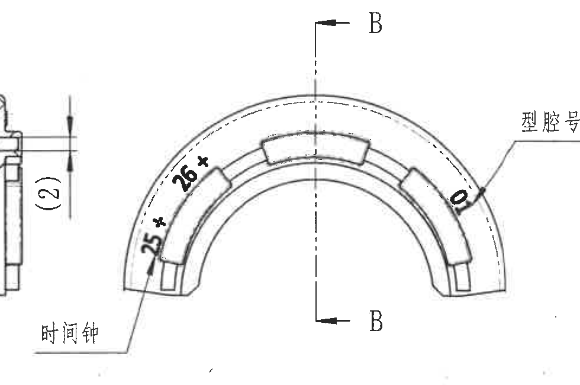

原图位置/视图名称：第 1 页右上，局部弧形标识视图，图区 14-16 / D-F 附近。  
object_kind：detail  
bbox：`[3720, 790, 4700, 1440]`

### 提取表格

| 提取项 | 原图数值或文本 | 含义说明 |
|---|---|---|
| 剖切字母 | `B`、`B` | 上下 B 标识定义 B-B 剖面位置，对应 object_4。 |
| 关键标识/尺寸 | `25*` | 左下弧段附近星号标注；星号按技术要求第 9 条归为关键尺寸/关键控制标注。 |
| 关键标识/尺寸 | `26*` | 左上弧段附近星号标注；星号按技术要求第 9 条归为关键尺寸/关键控制标注。 |
| 型腔号 | 型腔号；`10` | 右侧引线指向弧面上的型腔号位置，黑体数值为 10。 |
| 时间钟 | 时间钟 | 左下引线指向时间钟刻字/标识位置。 |
| T 编号 | 未见 | 本局部视图内未见 T 编号。 |

边界归属说明：为保留“时间钟”和“型腔号”引线文字，左边缘保留了相邻 B-B 剖面 `(2)` 的少量可见片段；该 `(2)` 已归属 object_4，不在本局部视图提取。右侧图框坐标栏未纳入提取。

## object_6 - 左下侧视图

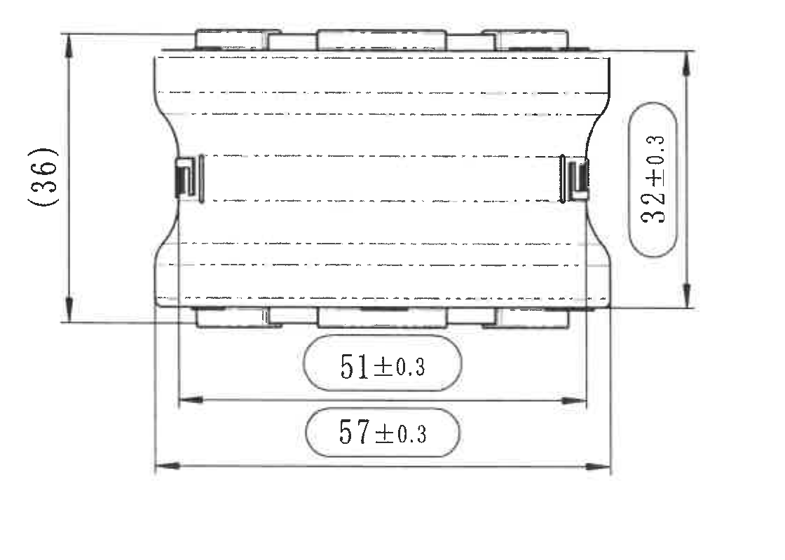

原图位置/视图名称：第 1 页左下，侧视图/长度高度视图，图区 2-4 / G-I 附近。  
object_kind：view  
bbox：`[440, 1650, 1560, 2450]`

### 提取表格

| 提取项 | 原图数值或文本 | 含义说明 |
|---|---|---|
| 参考总高 | `(36)` | 左侧括号内竖向总高度参考尺寸。 |
| 高度尺寸 | `32±0.3` | 右侧竖向高度尺寸，公差 ±0.3。 |
| 长度尺寸 | `51±0.3` | 下方内侧长度尺寸，公差 ±0.3。 |
| 总长度尺寸 | `57±0.3` | 下方外侧总长度尺寸，公差 ±0.3。 |
| T 编号 | 未见 | 本视图内未见 T 编号。 |

边界归属说明：裁切完整包含左右竖向尺寸线和下方两条长度尺寸线；未带入上方主视图或右侧技术要求区域。

## object_8 - 技术要求 NOTES

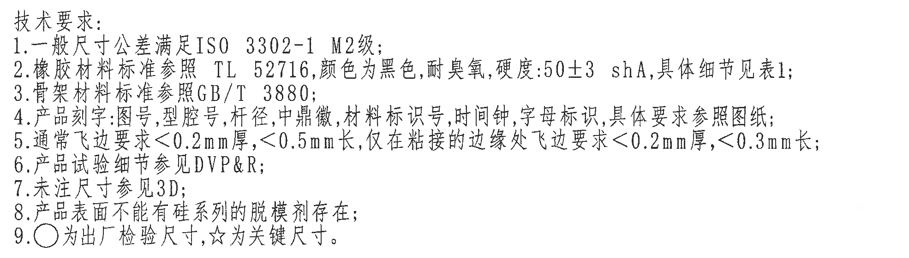

原图位置/视图名称：第 1 页右下中部，技术要求文本区，图区 9-15 / G-I 附近。  
object_kind：notes  
bbox：`[2750, 1850, 4720, 2410]`

### 文本还原

1. 一般尺寸公差满足 ISO 3302-1 M2级；  
2. 橡胶材料标准参照 TL 52716，颜色为黑色，耐臭氧，硬度:50±3 shA，具体细节见表1；  
3. 骨架材料标准参照 GB/T 3880；  
4. 产品刻字:图号，型腔号，杆径，中鼎徽，材料标识号，时间钟，字母标识，具体要求参照图纸；  
5. 通常飞边要求<0.2mm厚，<0.5mm长，仅在粘接的边缘处飞边要求<0.2mm厚，<0.3mm长；  
6. 产品试验细节参见 DVP&R；  
7. 未注尺寸参见3D；  
8. 产品表面不能有硅系列的脱模剂存在；  
9. ○为出厂检验尺寸，☆为关键尺寸。

### 提取表格

| 提取项 | 原图数值或文本 | 含义说明 |
|---|---|---|
| 一般公差 | ISO 3302-1 M2级 | 未单独标公差的一般尺寸按该标准等级处理。 |
| 橡胶材料 | TL 52716；黑色；耐臭氧；硬度 50±3 shA | 橡胶材料标准和性能要求。 |
| 骨架材料 | GB/T 3880 | 骨架材料标准。 |
| 刻字内容 | 图号、型腔号、杆径、中鼎徽、材料标识号、时间钟、字母标识 | 与各视图中的引线标识对应。 |
| 飞边要求 | <0.2mm厚，<0.5mm长；粘接边缘 <0.2mm厚，<0.3mm长 | 产品飞边控制要求。 |
| 试验 | DVP&R | 产品试验细节参考文件。 |
| 未注尺寸 | 参见3D | 图纸未注尺寸以 3D 数据为准。 |
| 表面要求 | 不能有硅系列脱模剂 | 表面污染/脱模剂限制。 |
| 符号说明 | ○ 出厂检验尺寸；☆ 关键尺寸 | 解释视图中圆圈/星号标注含义。 |

边界归属说明：裁切只包含技术要求 1-9 条文本，没有把右侧图框坐标或下方标题栏数据归入 NOTES。

## object_7 - 中下立体参考视图

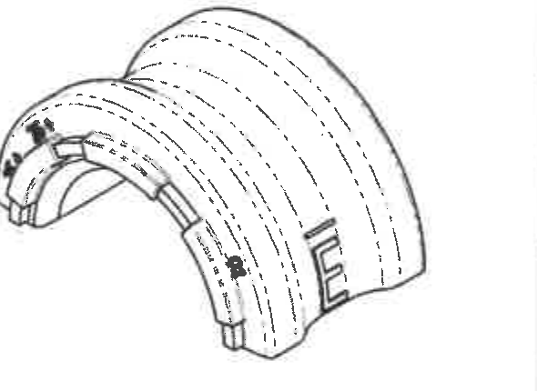

原图位置/视图名称：第 1 页中下，产品立体参考图，图区 7-9 / J-K 附近。  
object_kind：view  
bbox：`[2180, 2450, 2770, 2880]`

### 提取表格

| 提取项 | 原图数值或文本 | 含义说明 |
|---|---|---|
| 立体参考图 | 产品三维外观 | 用于显示稳定杆衬套上半环、槽、凸台、刻字位置和装配外形。 |
| 尺寸标注 | 未见单独尺寸数字 | 本立体图仅作形状/位置参考，未见需要单独提取的尺寸线、角度、半径或公差。 |
| T 编号 | 未见 | 本参考图内未见 T 编号。 |

边界归属说明：裁切仅包含立体参考图本体，未带入右侧标题栏或下方 References 文本。

## object_13 - References 标准列表

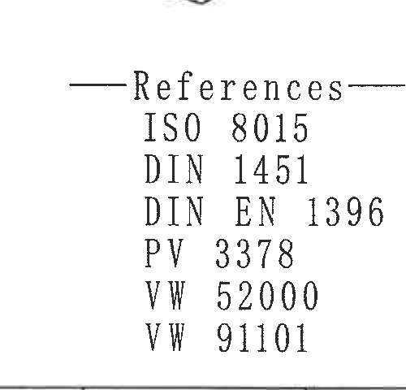

原图位置/视图名称：第 1 页中下偏右，References 文本列表，图区 8-9 / K-L 附近。  
object_kind：notes  
bbox：`[2230, 2840, 2730, 3320]`

### 文本还原

References

| 标准/文件 |
|---|
| ISO 8015 |
| DIN 1451 |
| DIN EN 1396 |
| PV 3378 |
| VW 52000 |
| VW 91101 |

### 提取表格

| 提取项 | 原图数值或文本 | 含义说明 |
|---|---|---|
| 参考标准 | ISO 8015 | 引用标准。 |
| 参考标准 | DIN 1451 | 引用标准。 |
| 参考标准 | DIN EN 1396 | 引用标准。 |
| 参考标准 | PV 3378 | 引用文件/标准。 |
| 参考标准 | VW 52000 | 引用文件/标准。 |
| 参考标准 | VW 91101 | 引用文件/标准。 |

边界归属说明：裁切收紧到 References 列表区域，避免把右侧标题栏签名格或底部图框坐标归入本对象。

## object_9 - 左下 Table 1

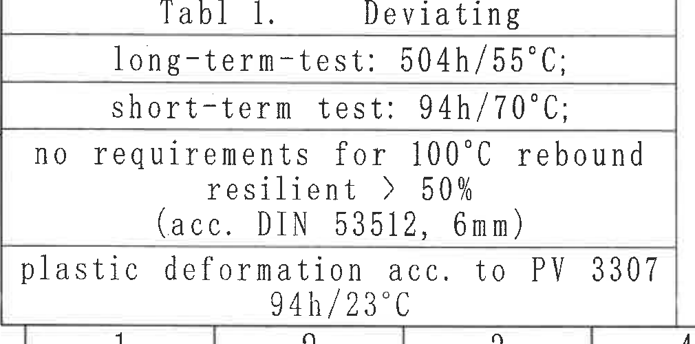

原图位置/视图名称：第 1 页左下，Table 1: Deviating，图区 1-4 / K-L 附近。  
object_kind：table  
bbox：`[380, 2840, 1390, 3340]`

### 原表还原

| Tabl 1. Deviating |
|---|
| long-term-test: 504h/55°C; |
| short-term test: 94h/70°C; |
| no requirements for 100°C rebound resilient > 50% (acc. DIN 53512, 6mm) |
| plastic deformation acc. to PV 3307 94h/23°C |

### 提取表格

| 提取项 | 原图数值或文本 | 含义说明 |
|---|---|---|
| 表题 | `Tabl 1. Deviating` | 表 1，偏离/补充试验条件说明。 |
| 长期试验 | `long-term-test: 504h/55°C;` | 长期试验条件。 |
| 短期试验 | `short-term test: 94h/70°C;` | 短期试验条件。 |
| 回弹要求 | `no requirements for 100°C rebound resilient > 50% (acc. DIN 53512, 6mm)` | 100°C 回弹相关要求及 DIN 53512、6mm 参考条件。 |
| 塑性变形 | `plastic deformation acc. to PV 3307 94h/23°C` | 按 PV 3307 的塑性变形试验条件。 |

边界归属说明：为完整保留最后一行 `94h/23°C` 和表格下边线，裁切底部可见少量图框坐标线；坐标数字不属于 Table 1，未提取为表格内容。

## object_11 - 右下明细/BOM 表

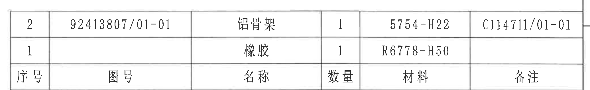

原图位置/视图名称：第 1 页右下上部，明细/BOM 表，图区 9-16 / J 附近。  
object_kind：table  
bbox：`[2740, 2400, 4810, 2720]`

### 原表还原

| 序号 | 图号 | 名称 | 数量 | 材料 | 备注 |
|---|---|---|---|---|---|
| 2 | 92413807/01-01 | 铝骨架 | 1 | 5754-H22 | C114711/01-01 |
| 1 |  | 橡胶 | 1 | R6778-H50 |  |

### 提取表格

| 提取项 | 原图数值或文本 | 含义说明 |
|---|---|---|
| BOM 行 2 | 序号 2；图号 92413807/01-01；名称 铝骨架；数量 1；材料 5754-H22；备注 C114711/01-01 | 铝骨架组成件信息。 |
| BOM 行 1 | 序号 1；图号空白；名称 橡胶；数量 1；材料 R6778-H50；备注空白 | 橡胶组成件信息。 |

边界归属说明：裁切覆盖 BOM 两条物料行和底部表头行；下方标题栏的投影法/比例/产品号等字段另归 object_12。

## object_12 - 右下标题栏

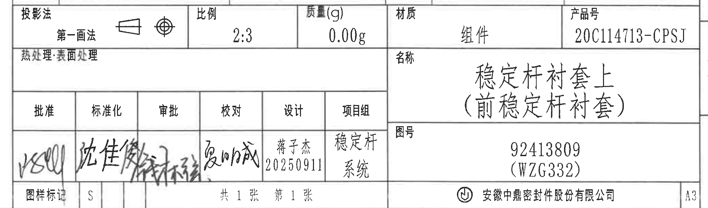

原图位置/视图名称：第 1 页右下，标题栏/签审栏，图区 9-16 / J-L 附近。  
object_kind：title_block  
bbox：`[2740, 2705, 4810, 3315]`

### 原表还原

| 字段 | 原图文本 |
|---|---|
| 投影法 | 第一画法 |
| 比例 | 2:3 |
| 质量(g) | 0.00g |
| 材质 | 组件 |
| 产品号 | 20C114713-CPSJ |
| 热处理/表面处理 | 空白 |
| 名称 | 稳定杆衬套上（前稳定杆衬套） |
| 图号 | 92413809 (WZG332) |
| 批准 | 手写签名，扫描件难以完整辨读 |
| 标准化 | 手写签名，扫描件难以完整辨读 |
| 审批 | 空白/未清晰填写 |
| 校对 | 夏帅成 |
| 设计 | 蒋子杰 20250911 |
| 项目组 | 稳定杆系统 |
| 图样标记 | S |
| 张数 | 共 1 张；第 1 张 |
| 公司 | 安徽中鼎密封件股份有限公司 |
| 图幅 | A3 |

### 提取表格

| 提取项 | 原图数值或文本 | 含义说明 |
|---|---|---|
| 产品名称 | 稳定杆衬套上（前稳定杆衬套） | 本图纸零件/组件名称。 |
| 图号 | 92413809 (WZG332) | 标题栏主图号，与主视图中的图号刻字一致。 |
| 产品号 | 20C114713-CPSJ | 产品号/客户或内部识别号。 |
| 比例 | 2:3 | 图纸比例。 |
| 质量 | 0.00g | 标题栏质量字段。 |
| 材质 | 组件 | 标题栏材质/对象类型字段。 |
| 设计 | 蒋子杰 20250911 | 设计人及日期。 |
| 项目组 | 稳定杆系统 | 归属项目组。 |
| 图幅 | A3 | 图纸幅面。 |

边界归属说明：裁切覆盖标题栏外框内部字段，未把底部图框坐标数字归入标题栏；上方 BOM 表另归 object_11。

## 裁切检查记录

| 对象 | 检查结果 | 说明 |
|---|---|---|
| page_1 | 完整 | PDF 已先渲染为整页 PNG，尺寸 4959 x 3505 px。 |
| object_1 | 完整 | 主弧形视图包含完整 `R28.5±0.3`、`Ø35.2±0.3☆`、`Ø36.2`、`(0.5)`、`(1.5)` 文字和尺寸/引线。 |
| object_2 | 完整 | 正视图包含完整 `(5.51)`、R8、R4、A/A、`26.5±0.3`、`29.5±0.3`。 |
| object_3 | 完整 | A-A 剖面包含完整 `(R23)`、`(R21)`、`(0.75)` 和剖面线。 |
| object_4 | 完整，有边界归属说明 | B-B 剖面尺寸完整；右下边缘可见相邻“时间钟”文字边缘，不提取到 B-B。 |
| object_5 | 完整，有边界归属说明 | 局部视图为保留“时间钟”和“型腔号”完整文字，左侧可见相邻 B-B 的 `(2)` 片段；该尺寸归 object_4。 |
| object_6 | 完整 | 侧视图包含完整 `(36)`、`32±0.3`、`51±0.3`、`57±0.3` 及尺寸线。 |
| object_7 | 完整 | 立体参考图完整，无单独尺寸线。 |
| object_8 | 完整 | 技术要求 1-9 条完整，未截断第 5 条末尾。 |
| object_9 | 完整，有边界归属说明 | Table 1 全部行完整；底部为保留末行带入少量图框坐标线，未提取为表内容。 |
| object_10 | 完整 | 修订履历表列线、表头、记录行完整。 |
| object_11 | 完整 | BOM 两条物料行和表头完整；下方标题栏另行裁切。 |
| object_12 | 完整 | 标题栏字段、签审栏、图号/名称/公司/A3 均完整。 |
| object_13 | 完整 | References 六条标准完整；底部 `VW 91101` 已保留。 |
