# 20C114714.pdf 内容识别结果

整页渲染图：`outputs/20C114714_assets/images/page_1.png`  
页面尺寸：4959 x 3505 px，bbox `[0, 0, 4959, 3505]`。

## object_1 顶部修订履历表

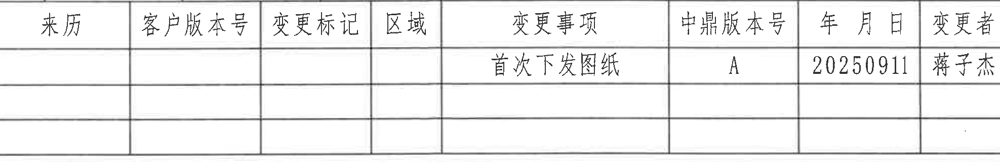

原图位置/视图名称：页面顶部右侧修订履历表，bbox `[2785, 130, 4760, 460]`。

| 来历 | 客户版本号 | 变更标记 | 区域 | 变更事项 | 中鼎版本号 | 年月日 | 变更者 |
|---|---|---|---|---|---|---|---|
|  |  |  |  | 首次下发图纸 | A | 20250911 | 蒋子杰 |
|  |  |  |  |  |  |  |  |
|  |  |  |  |  |  |  |  |

| 提取项 | 原图数值或文本 | 含义说明 |
|---|---|---|
| 变更事项 | 首次下发图纸 | 首次发行/下发图纸的修订记录。 |
| 中鼎版本号 | A | 内部版本标识。 |
| 年月日 | 20250911 | 修订/下发日期。 |
| 变更者 | 蒋子杰 | 变更责任人。 |

边界归属说明：表格上方接近图框坐标 10-16，但图框坐标不属于修订表字段，未作为表格内容提取。

## object_2 上排左侧主视图/正面加工视图

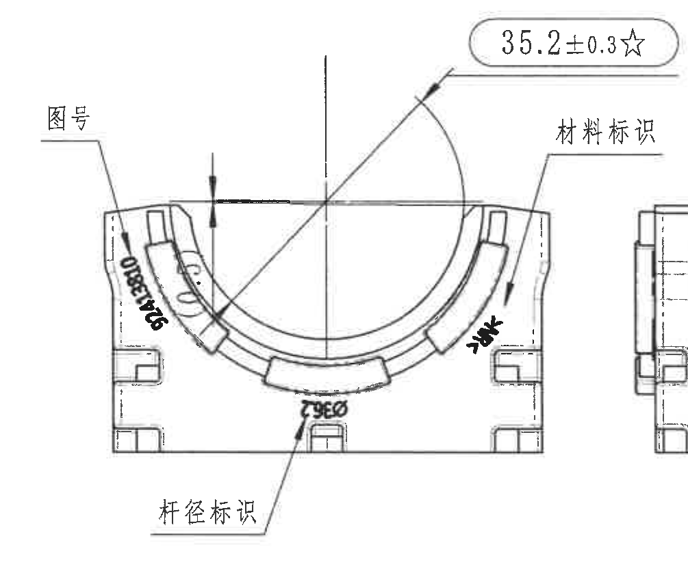

原图位置/视图名称：上排左侧主视图/正面加工视图，bbox `[450, 610, 1455, 1455]`。

| 提取项 | 原图数值或文本 | 含义说明 |
|---|---|---|
| 关键尺寸 | 35.2±0.3☆ | 上部圆弧开口相关尺寸，星号表示关键尺寸。 |
| 标识引线 | 图号 | 指向左侧旋转刻字区域，说明图号刻字位置。 |
| 标识引线 | 材料标识 | 指向右侧外弧附近，说明材料标识刻字位置。 |
| 标识引线 | 杆径标识 | 指向下方旋转刻字区域，说明杆径标识位置。 |
| 旋转刻字 | 92413810 | 视图左侧可见图号刻字。 |
| 旋转刻字 | M4 | 右侧弧边附近可见旋转刻字。 |
| 旋转刻字 | 9256/OP56（原图模糊） | 底部标识，原图扫描较模糊，按可见形状记录。 |

边界归属说明：右边缘为了保留“材料标识”引线完整，带入相邻侧视图一条窄边线；该窄边线不属于本主视图提取内容。剖切/侧视图尺寸不归入本对象。

## object_3 上排中部侧视图/A-A 剖切位置视图

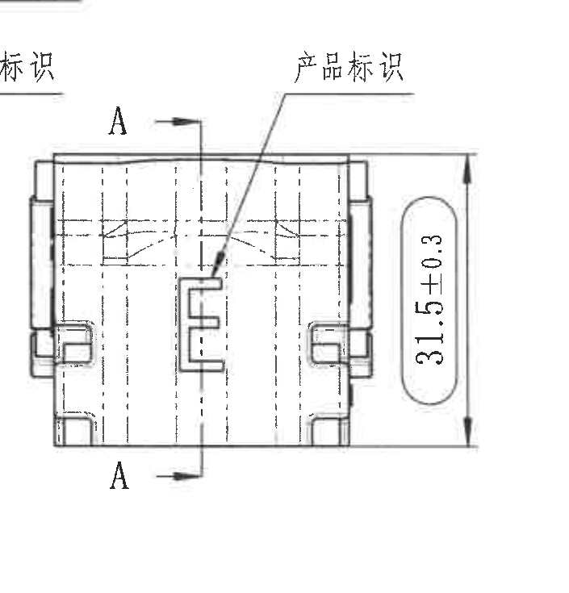

原图位置/视图名称：主视图右侧的侧视图，含 A-A 剖切位置，bbox `[1340, 720, 2045, 1455]`。

| 提取项 | 原图数值或文本 | 含义说明 |
|---|---|---|
| 剖切标识 | A-A | 上下 A 与箭头标示 object_4 的剖切方向和位置。 |
| 尺寸 | 31.5±0.3 | 右侧竖向总高/外形高度尺寸。 |
| 标识引线 | 产品标识 | 指向中部凸台/E 形区域，表示产品标识位置。 |

边界归属说明：左上角可见主视图“材料标识”的少量残字，不属于本侧视图；本对象只提取侧视图自身结构、31.5±0.3 和 A-A 剖切标识。

## object_4 A-A 剖视图

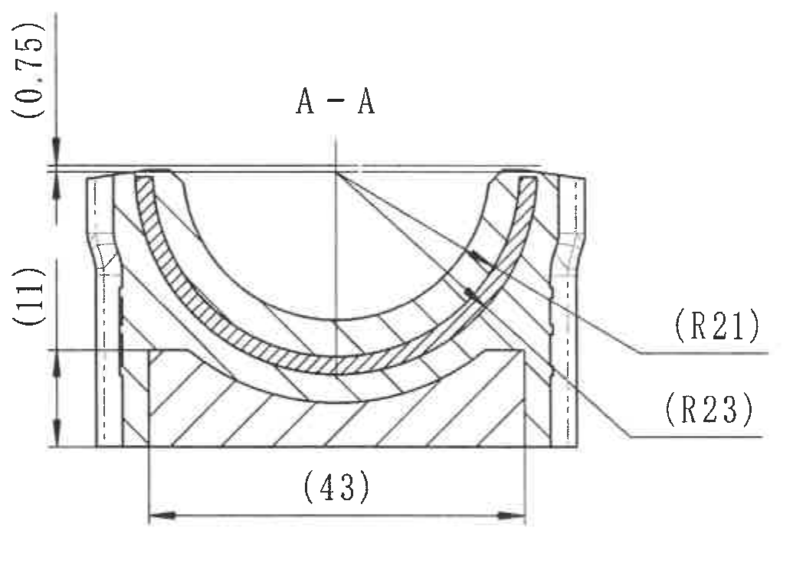

原图位置/视图名称：上排中部 A-A 剖视图，bbox `[2035, 690, 3070, 1425]`。

| 提取项 | 原图数值或文本 | 含义说明 |
|---|---|---|
| 剖视名称 | A-A | 对应 object_3 中 A-A 剖切标识。 |
| 参考尺寸 | (0.75) | 上缘局部参考厚度/间隙，括号表示参考尺寸。 |
| 参考尺寸 | (11) | 左侧竖向参考尺寸，括号表示参考尺寸。 |
| 参考尺寸 | (43) | 底部宽度参考尺寸，括号表示参考尺寸。 |
| 参考半径 | (R21) | 右侧引线指向内弧/局部弧面半径，参考半径。 |
| 参考半径 | (R23) | 右侧引线指向外弧/局部弧面半径，参考半径。 |

边界归属说明：右侧 R21/R23 引线完整属于 A-A；紧邻右侧 B-B 的 8.25±0.3、4.15±0.3 竖向尺寸不归入本对象。

## object_5 B-B 剖视图

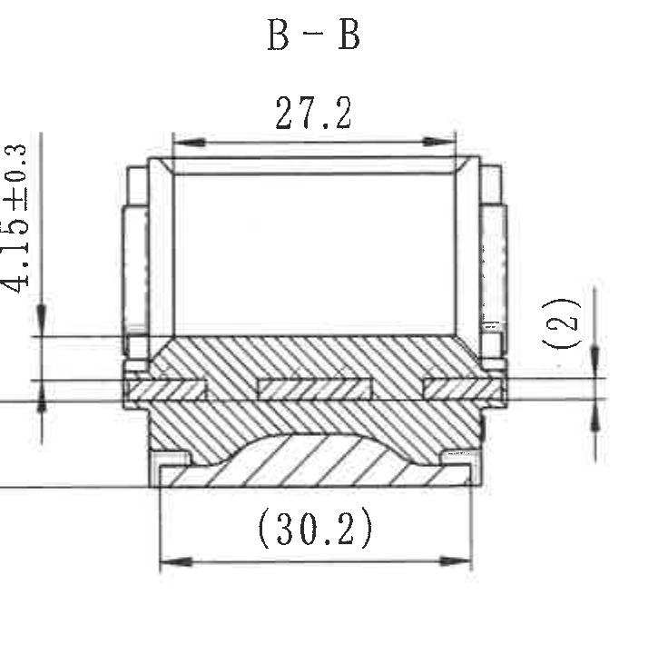

原图位置/视图名称：上排中右 B-B 剖视图，bbox `[3135, 720, 3860, 1430]`。

| 提取项 | 原图数值或文本 | 含义说明 |
|---|---|---|
| 剖视名称 | B-B | 对应 object_6 中 B-B 剖切标识。 |
| 尺寸 | 27.2 | 顶部横向内宽/开口宽度。 |
| 尺寸 | 8.25±0.3 | 左侧竖向台阶/高度控制尺寸。 |
| 尺寸 | 4.15±0.3 | 左侧较小竖向台阶/厚度控制尺寸。 |
| 参考尺寸 | (2) | 右侧局部厚度/台阶参考尺寸。 |
| 参考尺寸 | (30.2) | 底部横向参考宽度，括号表示参考尺寸。 |

边界归属说明：左侧 8.25±0.3、4.15±0.3 的完整箭头和尺寸线指向 B-B 截面，归入本对象；A-A 的 R21/R23 不归入本对象。

## object_6 上排右侧主视图/B-B 剖切位置视图

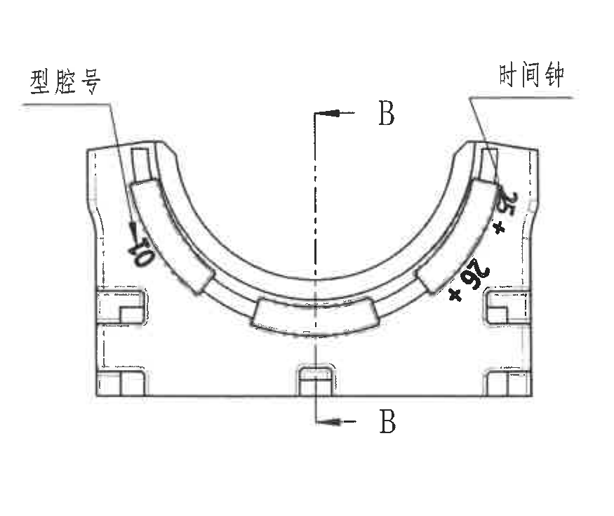

原图位置/视图名称：上排最右侧主视图，含 B-B 剖切位置，bbox `[3860, 690, 4735, 1425]`。

| 提取项 | 原图数值或文本 | 含义说明 |
|---|---|---|
| 剖切标识 | B-B | 上下 B 与箭头标示 object_5 的剖切方向和位置。 |
| 标识引线 | 型腔号 | 指向左侧旋转刻字区域，表示型腔号位置。 |
| 标识引线 | 时间钟 | 指向右上角时间钟/日期钟刻字区域。 |
| 旋转刻字 | 70 | 左侧弧边附近可见旋转刻字。 |
| 旋转刻字 | 26 | 右侧弧边附近可见旋转刻字。 |
| 旋转刻字 | +25 | 右侧弧边附近可见旋转刻字。 |

边界归属说明：该视图与 B-B 剖视图分离，剖面尺寸不归入本视图。右侧图框线不作为视图内容提取。

## object_7 左下俯视/底面加工视图

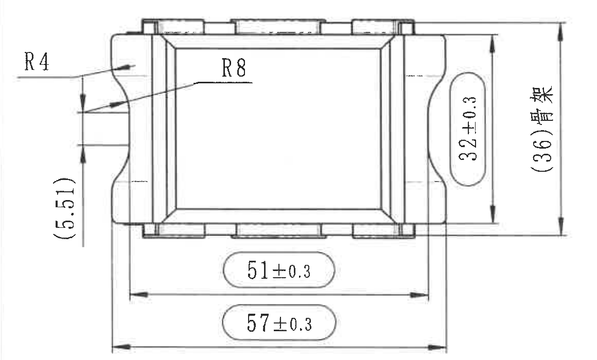

原图位置/视图名称：左下俯视/底面加工视图，bbox `[390, 1745, 1550, 2445]`。

| 提取项 | 原图数值或文本 | 含义说明 |
|---|---|---|
| 半径 | R4 | 左侧外圆角/局部圆弧半径。 |
| 半径 | R8 | 内侧斜面/倒圆区域半径。 |
| 参考尺寸 | (5.51) | 左侧局部参考高度，括号表示参考尺寸。 |
| 尺寸 | 32±0.3 | 右侧竖向内宽/局部高度控制尺寸。 |
| 参考尺寸 | (36)骨架 | 骨架相关参考总高度，括号表示参考尺寸。 |
| 尺寸 | 51±0.3 | 底部较短横向长度尺寸。 |
| 尺寸 | 57±0.3 | 底部较长横向总长尺寸。 |

边界归属说明：所有尺寸线、箭头和文字完整包含在裁切内；下方试验表不属于该视图。

## object_8 左下 Table 1 / Deviating 试验表

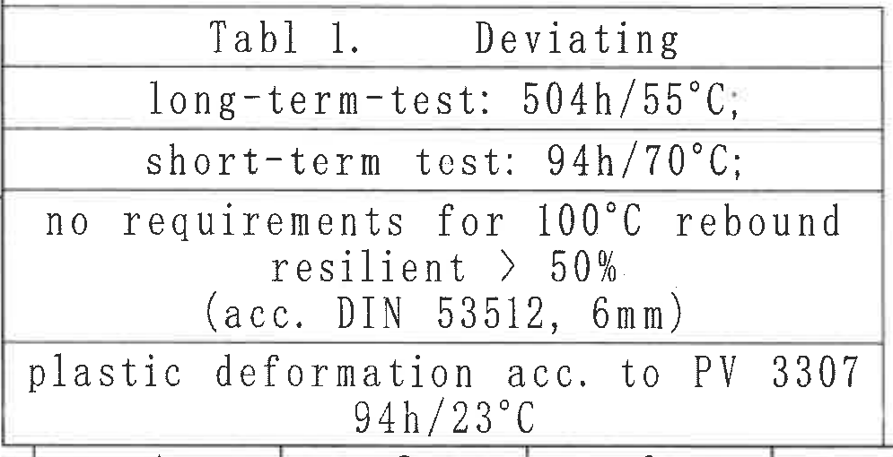

原图位置/视图名称：左下英文试验/偏离要求表，bbox `[380, 2815, 1375, 3325]`。

| Tabl 1. | Deviating |
|---|---|
| long-term-test: | 504h/55°C; |
| short-term test: | 94h/70°C; |
| no requirements for 100°C rebound resilient > 50% | (acc. DIN 53512, 6mm) |
| plastic deformation acc. to PV 3307 | 94h/23°C |

| 提取项 | 原图数值或文本 | 含义说明 |
|---|---|---|
| 表题 | Tabl 1. Deviating | 表 1，偏离/特殊试验条件。 |
| 长期试验 | 504h/55°C | 长期试验条件。 |
| 短期试验 | 94h/70°C | 短期试验条件。 |
| 100°C 回弹要求 | no requirements for 100°C rebound resilient > 50% (acc. DIN 53512, 6mm) | 100°C 回弹按 DIN 53512、6mm 条件，记录为无要求/偏离要求。 |
| 塑性变形 | plastic deformation acc. to PV 3307 94h/23°C | 按 PV 3307，94h/23°C。 |

边界归属说明：底部接近图框坐标编号，坐标编号不属于表格内容，未纳入表格还原。

## object_9 中下 3D 参考立体图

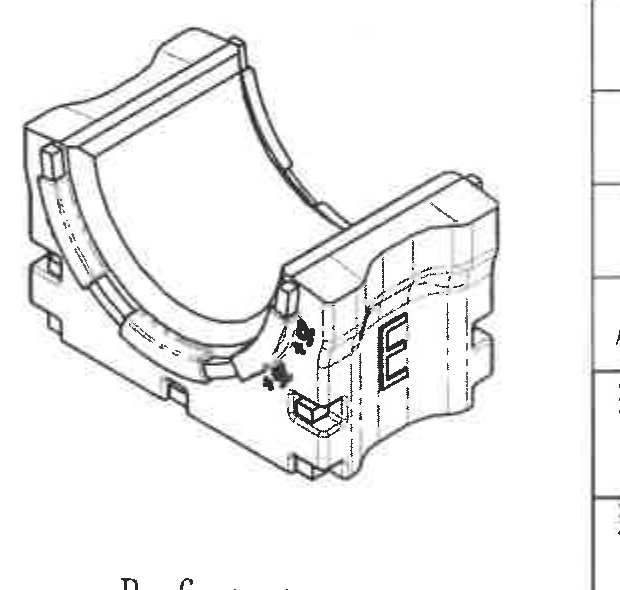

原图位置/视图名称：中下 3D 参考图，bbox `[2185, 2345, 2805, 2935]`。

| 提取项 | 原图数值或文本 | 含义说明 |
|---|---|---|
| 参考图 | 三维外形 | 显示半圆鞍形槽、侧面凸台、底部卡扣和正面 E 形标识区域。 |
| 尺寸 | 无独立尺寸线 | 该图用于形状参考，不提供独立尺寸。 |

边界归属说明：右侧靠近技术要求/标题栏区域，但本对象不提取表格或 NOTES 内容。

## object_10 References 标准引用列表

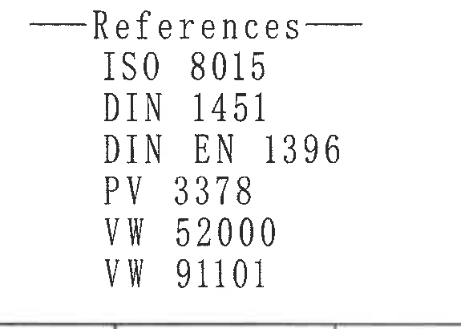

原图位置/视图名称：中下 References 列表，bbox `[2190, 2910, 2765, 3320]`。

| 提取项 | 原图数值或文本 | 含义说明 |
|---|---|---|
| 标准 | ISO 8015 | 引用标准。 |
| 标准 | DIN 1451 | 引用标准。 |
| 标准 | DIN EN 1396 | 引用标准。 |
| 标准 | PV 3378 | 引用标准。 |
| 标准 | VW 52000 | 引用标准。 |
| 标准 | VW 91101 | 引用标准。 |

边界归属说明：该对象为文字列表，不含尺寸线；底部图框线不作为列表内容提取。

## object_11 技术要求 NOTES

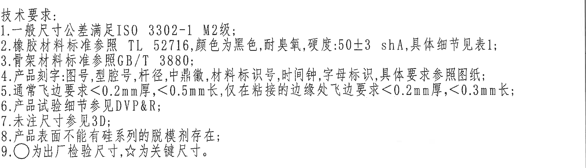

原图位置/视图名称：右中部技术要求/NOTES，bbox `[2790, 1750, 4785, 2325]`。

| 提取项 | 原图数值或文本 | 含义说明 |
|---|---|---|
| 1 | 一般尺寸公差满足 ISO 3302-1 M2级; | 未单独标注的一般尺寸公差依据。 |
| 2 | 橡胶材料标准参照 TL 52716, 颜色为黑色, 耐臭氧, 硬度:50±3 shA, 具体细节见表1; | 橡胶材料、颜色、耐臭氧和硬度要求。 |
| 3 | 骨架材料标准参照 GB/T 3880; | 骨架材料依据。 |
| 4 | 产品刻字: 图号, 型腔号, 杆径, 中鼎徽, 材料标识号, 时间钟, 字母标识, 具体要求参照图纸; | 产品刻字项目和位置依据。 |
| 5 | 通常飞边要求 <0.2mm 厚, <0.5mm 长, 仅在粘接的边缘处飞边要求 <0.2mm 厚, <0.3mm 长; | 飞边厚度、长度限制。 |
| 6 | 产品试验细节参见 DVP&R; | 试验细节引用 DVP&R。 |
| 7 | 未注尺寸参见 3D; | 未注尺寸以 3D 数据为准。 |
| 8 | 产品表面不能有硅系列的脱模剂存在; | 表面脱模剂限制。 |
| 9 | ○ 为出厂检验尺寸, ☆ 为关键尺寸。 | 符号含义说明：圆圈为出厂检验尺寸，星号为关键尺寸。 |

边界归属说明：技术要求右侧文字较长，裁切保留至右边界；未把下方 BOM 表格内容并入 NOTES。

## object_12 右下 BOM / 明细表

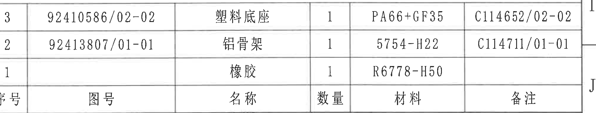

原图位置/视图名称：右下标题栏上方 BOM/明细表，bbox `[2820, 2330, 4835, 2715]`。

| 序号 | 图号 | 名称 | 数量 | 材料 | 备注 |
|---|---|---|---|---|---|
| 3 | 92410586/02-02 | 塑料底座 | 1 | PA66+GF35 | C114652/02-02 |
| 2 | 92413807/01-01 | 铝骨架 | 1 | 5754-H22 | C114711/01-01 |
| 1 |  | 橡胶 | 1 | R6778-H50 |  |

| 提取项 | 原图数值或文本 | 含义说明 |
|---|---|---|
| 明细表列 | 序号、图号、名称、数量、材料、备注 | 零件组成清单。 |
| 序号 3 | 塑料底座 / PA66+GF35 | 塑料底座件，数量 1，备注 C114652/02-02。 |
| 序号 2 | 铝骨架 / 5754-H22 | 铝骨架件，数量 1，备注 C114711/01-01。 |
| 序号 1 | 橡胶 / R6778-H50 | 橡胶件，数量 1。 |

边界归属说明：BOM 下方紧邻标题栏；标题栏的投影法、比例、产品号等字段不归入 BOM。

## object_13 右下完整标题栏

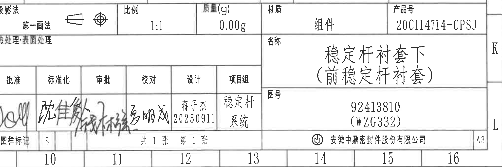

原图位置/视图名称：右下完整标题栏，bbox `[2815, 2700, 4850, 3380]`。

| 字段 | 原图数值或文本 | 含义说明 |
|---|---|---|
| 投影法 | 第一画法 | 投影视图方法。 |
| 比例 | 1:1 | 图纸比例。 |
| 质量(g) | 0.00g | 图样质量字段。 |
| 材质 | 组件 | 表示总成/组件。 |
| 产品号 | 20C114714-CPSJ | 产品编号。 |
| 名称 | 稳定杆衬套下（前稳定杆衬套） | 零件/组件名称。 |
| 图号 | 92413810 (WZG332) | 图纸/零件编号。 |
| 设计 | 蒋子杰 20250911 | 设计责任人与日期。 |
| 项目组 | 稳定杆系统 | 项目组名称。 |
| 图样标记 | S | 图样标记字段。 |
| 张数 | 共 1 张 第 1 张 | 页数信息。 |
| 公司 | 安徽中鼎密封件股份有限公司 | 出图单位。 |
| 图幅 | A3 | 图纸幅面。 |

边界归属说明：标题栏顶部与 BOM 表相邻；BOM 零件行不作为标题栏字段重复提取。左侧签署栏存在手写签名，按字段归属保留在标题栏对象中。

## 裁切检查记录

| 对象 | 检查结果 |
|---|---|
| object_1 修订履历表 | 表头、有效记录行和空白行完整；上方图框坐标未作为表格内容提取。 |
| object_2 主视图 | 35.2±0.3☆、三条标识引线和旋转刻字可见；右边缘有相邻侧视图窄片段，已明确不归属本对象。 |
| object_3 侧视图/A-A 标识 | 31.5±0.3 尺寸线、文字和 A-A 箭头完整；左侧残字不归属本对象。 |
| object_4 A-A 剖视图 | (0.75)、(11)、(43)、(R21)、(R23) 的尺寸文字和引线完整；B-B 尺寸未纳入提取。 |
| object_5 B-B 剖视图 | 27.2、8.25±0.3、4.15±0.3、(2)、(30.2) 的尺寸线和文字完整；左侧尺寸归属 B-B。 |
| object_6 右侧主视图/B-B 标识 | 型腔号、时间钟、B-B 箭头及旋转刻字完整；图框边线不作为内容。 |
| object_7 左下俯视/底面视图 | R4、R8、(5.51)、32±0.3、(36)骨架、51±0.3、57±0.3 均完整包含。 |
| object_8 Table 1 | 表格边框和各行文字完整；底部图框坐标未纳入表格。 |
| object_9 3D 参考图 | 立体图主体完整；无独立尺寸线。 |
| object_10 References | 标准列表文字完整。 |
| object_11 技术要求 | 1-9 条文字完整可辨；第 5 条长句保留到右边界并按可见内容提取。 |
| object_12 BOM | 六列表头和 1-3 行明细完整；下方标题栏不归入 BOM。 |
| object_13 标题栏 | 投影法、比例、质量、产品号、名称、图号、签署栏、公司和 A3 图幅完整。 |
