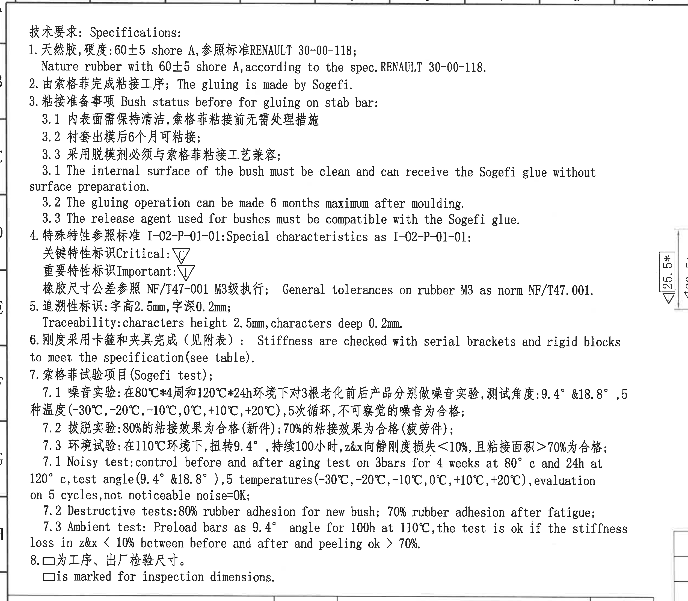
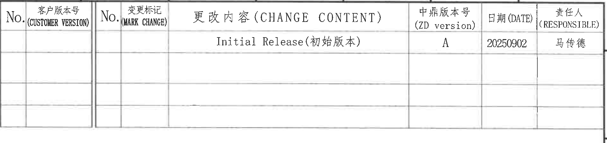
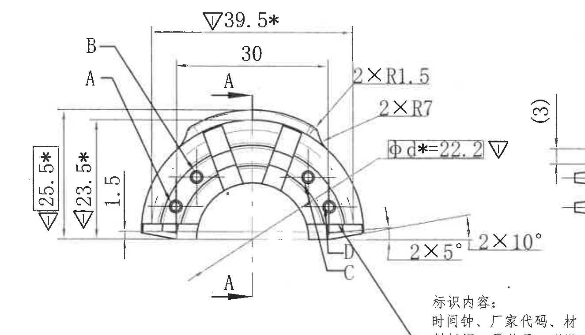
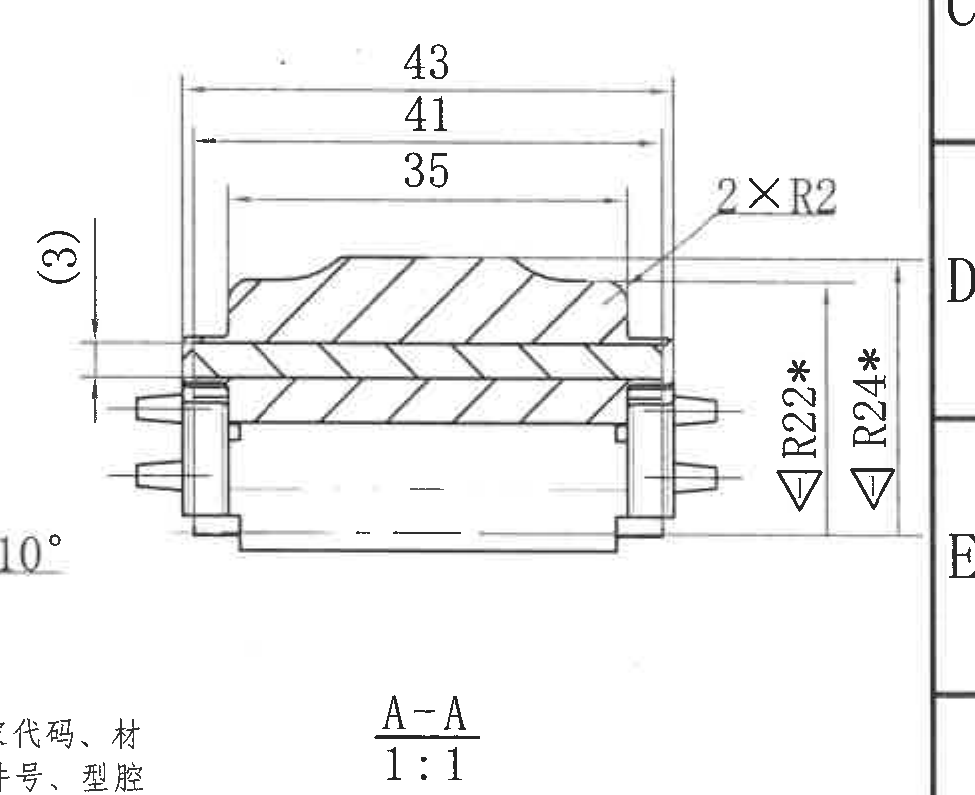
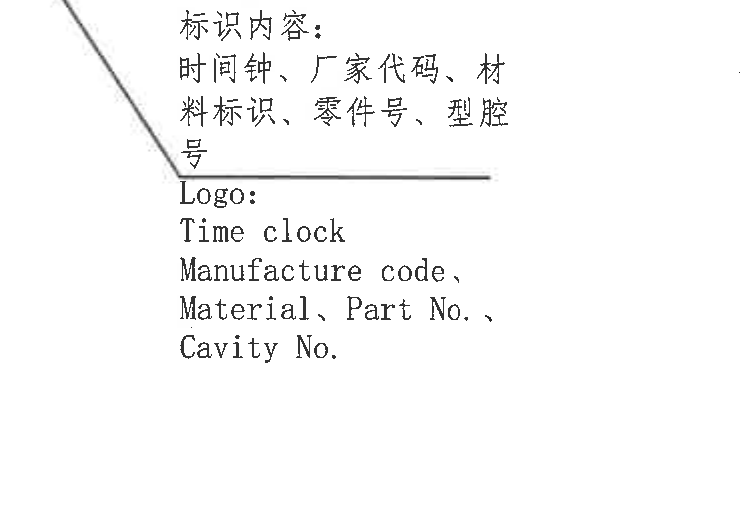
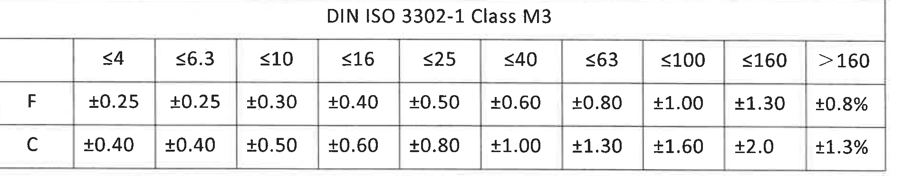
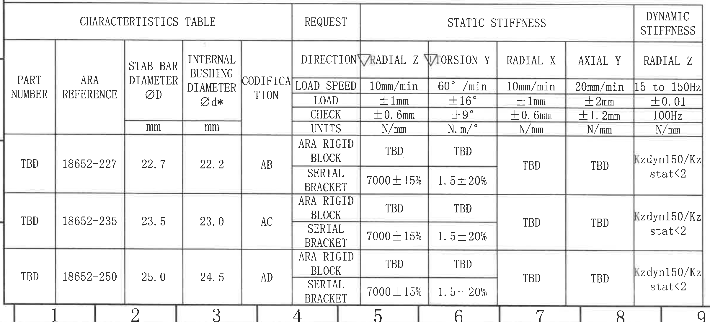
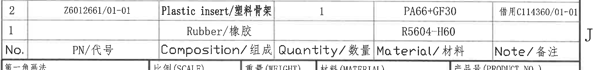
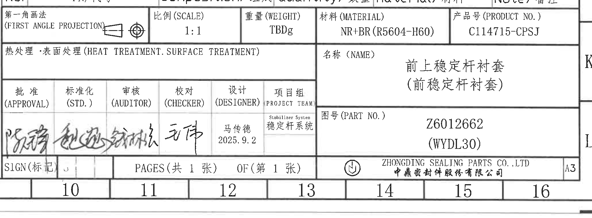

# 20C114715 PDF 内容识别

整页渲染图：`20C114715_assets/images/page_1.png`  
原始 PDF：`input/20C114715.pdf`  
页面：1 页，整页 PNG 尺寸 4959 x 3505 px。

以下对象按原图从左上到右下的结构顺序记录。尺寸、表格字段和边界归属同时写入 `20C114715_manifest.json`。

## object_1 - NOTES / 技术要求

原图位置/视图名称：第 1 页左上 NOTES 区，bbox `[360, 120, 2880, 2320]`。

| 提取项 | 原图数值或文本 | 含义说明 |
|---|---|---|
| 标题 | 技术要求: Specifications: | 技术要求/说明区标题。 |
| 1 | 天然胶,硬度:60±5 shore A,参照标准RENAULT 30-00-118; | 橡胶材料为天然胶，硬度 60±5 Shore A，按 RENAULT 30-00-118。 |
| 1 英文 | Nature rubber with 60±5 shore A,according to the spec.RENAULT 30-00-118. | 对第 1 条的英文说明。 |
| 2 | 由索格菲完成粘接工序; The gluing is made by Sogefi. | 粘接工序由 Sogefi 完成。 |
| 3 | 粘接准备事项 Bush status before for gluing on stab bar: | 稳定杆粘接前衬套状态要求。 |
| 3.1 中文 | 内表面需保持清洁,索格菲粘接前无需处理措施 | 衬套内表面应清洁，粘接前无需额外表面处理。 |
| 3.2 中文 | 衬套出模后6个月可粘接; | 出模后最长 6 个月内可粘接。 |
| 3.3 中文 | 采用脱模剂必须与索格菲粘接工艺兼容; | 脱模剂需兼容 Sogefi 粘接工艺。 |
| 3.1 英文 | The internal surface of the bush must be clean and can receive the Sogefi glue without surface preparation. | 对 3.1 的英文说明。 |
| 3.2 英文 | The gluing operation can be made 6 months maximum after moulding. | 对 3.2 的英文说明。 |
| 3.3 英文 | The release agent used for bushes must be compatible with the Sogefi glue. | 对 3.3 的英文说明。 |
| 4 | 特殊特性参照标准 I-02-P-01-01: Special characteristics as I-02-P-01-01: | 特殊特性标识执行标准。 |
| Critical 标识 | 关键特性标识 Critical: △C | 关键特性符号；原图为三角形内 C。 |
| Important 标识 | 重要特性标识 Important: ▽I | 重要特性符号；原图为倒三角形内 I。 |
| 橡胶公差 | 橡胶尺寸公差参照 NF/T47-001 M3级执行; General tolerances on rubber M3 as norm NF/T47.001. | 橡胶件一般尺寸公差按 NF/T47-001 M3。 |
| 5 | 追溯性标识:字高2.5mm,字深0.2mm; | 追溯性字符高度 2.5 mm、深度 0.2 mm。 |
| 5 英文 | Traceability: characters height 2.5mm,characters deep 0.2mm. | 对第 5 条的英文说明。 |
| 6 | 刚度采用卡箍和夹具完成（见附表）: Stiffness are checked with serial brackets and rigid blocks to meet the specification(see table). | 刚度检测使用串联支架和刚性块，见特性表。 |
| 7 | 索格菲试验项目(Sogefi test); | Sogefi 试验项目标题。 |
| 7.1 中文 | 噪音实验:在80℃*4周和120℃*24h环境下对3根老化前后产品分别做噪音实验,测试角度:9.4° &18.8°,5种温度(-30℃,-20℃,-10℃,0℃,+10℃,+20℃),5次循环,不可察觉的噪音为合格; | 噪音试验条件、角度、温度循环和合格判定。 |
| 7.2 中文 | 拔脱实验:80%的粘接效果为合格（新件）;70%的粘接效果为合格（疲劳件）; | 新件和疲劳件粘接面积/效果判定。 |
| 7.3 中文 | 环境试验:在110℃环境下,扭转9.4°,持续100小时,z&x向静刚度损失<10%,且粘接面积>70%为合格; | 环境试验温度、扭转角、持续时间、刚度损失和粘接面积判定。 |
| 7.1 英文 | Noisy test: control before and after aging test on 3 bars for 4 weeks at 80°C and 24h at 120°C, test angle(9.4° &18.8°), 5 temperatures(-30°C,-20°C,-10°C,0°C,+10°C,+20°C), evaluation on 5 cycles, not noticeable noise=OK; | 对噪音试验的英文说明。 |
| 7.2 英文 | Destructive tests: 80% rubber adhesion for new bush; 70% rubber adhesion after fatigue; | 对拔脱/破坏试验的英文说明。 |
| 7.3 英文 | Ambient test: Preload bars as 9.4° angle for 100h at 110°C, the test is ok if the stiffness loss in z&x < 10% between before and after and peeling ok > 70%. | 对环境试验的英文说明。 |
| 8 | □为工序、出厂检验尺寸。 □is marked for inspection dimensions. | 方框标识的尺寸为工序/出厂检验尺寸。 |

边界归属说明：该裁片保留 NOTES 全部文字和底部第 8 条。右侧边缘可见修订表、主视图和公差表的少量边界残片，这些残片不属于 NOTES；本区只提取技术要求文字，不提取右侧视图尺寸。

## object_2 - 修订履历表

原图位置/视图名称：第 1 页右上修订履历表，bbox `[2905, 135, 4805, 585]`。

| No. | 客户版本号 (CUSTOMER VERSION) | No. | 变更标记 (MARK CHANGE) | 更改内容 (CHANGE CONTENT) | 中鼎版本号 (ZD version) | 日期 (DATE) | 责任人 (RESPONSIBLE) |
|---|---|---|---|---|---|---|---|
|  |  |  |  | Initial Release(初始版本) | A | 20250902 | 马传德 |
|  |  |  |  |  |  |  |  |
|  |  |  |  |  |  |  |  |
|  |  |  |  |  |  |  |  |

| 提取项 | 原图数值或文本 | 含义说明 |
|---|---|---|
| 表头 | No.; 客户版本号; No.; 变更标记; 更改内容; 中鼎版本号; 日期; 责任人 | 修订履历列结构。 |
| 修订记录 | Initial Release(初始版本); ZD version A; DATE 20250902; RESPONSIBLE 马传德 | 初始发布记录，日期为 2025-09-02。 |
| 空白行 | 3 行空白 | 预留修订记录行，原图无内容。 |

边界归属说明：裁片完整包含修订表表头、首行记录、空白预留行和右侧外框。顶部和右边有图框边线，不作为表格字段。

## object_3 - 主加工视图

原图位置/视图名称：第 1 页右中主加工视图，bbox `[2700, 710, 4025, 1470]`。

| 提取项 | 原图数值或文本 | 含义说明 |
|---|---|---|
| 外部水平尺寸 | ▽39.5* | 上方外轮廓总体水平尺寸；带星号，为关键/特殊尺寸；带倒三角重要特性符号。 |
| 内部水平尺寸 | 30 | 上方内侧两竖向尺寸界线之间的水平尺寸。 |
| 总高度/外侧垂直尺寸 | □25.5* + ▽I | 主视图左侧外侧总高度尺寸；方框表示工序/出厂检验尺寸，星号表示关键尺寸，倒三角为重要特性符号。 |
| 左侧垂直尺寸 | 23.5* + ▽I | 左侧内侧垂直尺寸；星号关键尺寸，倒三角重要特性符号。 |
| 局部垂直尺寸 | 1.5 | 左下基准线附近的局部台阶/高度尺寸。 |
| 圆角 | 2×R1.5 | 两处 R1.5 小圆角。 |
| 圆角 | 2×R7 | 两处 R7 圆角，位于上侧外轮廓过渡处。 |
| 内孔/衬套直径 | Φd*=22.2 + ▽I | 内衬套直径 d* 为 22.2；带星号和重要特性符号。 |
| 角度 | 2×5° | 两处 5° 局部角度/斜面。 |
| 角度 | 2×10° | 两处 10° 局部角度/斜面，文字靠近右侧剖视图边界。 |
| 剖切标记 | A-A，箭头 A | 主视图中部和底部的 A 箭头定义 A-A 剖切方向，对应 object_4。 |
| 视图字母 | A、B、C | A、B 为左侧引出标记，C 位于右下局部特征附近，用于局部/特征识别。 |
| 弧向尺寸 | 未见独立弧向尺寸标注 | 本视图可见 R1.5、R7 半径标注，未见单独弧长/弧向尺寸。 |
| T 编号 | 未见 | 主视图中未识别到 T 编号。 |
| 单独公差框 | 未见 | 主视图尺寸旁未见单独数值公差框；一般公差按 NOTES 和 DIN ISO 3302-1 Class M3 表。 |

边界归属说明：该裁片保留主视图完整轮廓、尺寸线、箭头和文字。右侧可见 A-A 剖视图的 `(3)` 和零件端部边缘，底部可见标识内容局部说明的上缘；这些相邻对象不归入主视图。`2×10°` 虽靠近剖视图边界，但其尺寸文字、箭头和斜线均指向主视图右下斜面，归属主加工视图。

## object_4 - A-A 剖视图

原图位置/视图名称：第 1 页右中 A-A 剖视图，bbox `[3865, 705, 4840, 1500]`。

| 提取项 | 原图数值或文本 | 含义说明 |
|---|---|---|
| 剖面名称 | A-A | 与主视图 A-A 剖切箭头对应的剖视图。 |
| 比例 | 1:1 | 剖视图比例。 |
| 外部水平尺寸 | 43 | 剖视图上方最外侧总宽度尺寸。 |
| 中间水平尺寸 | 41 | 剖视图上方中间宽度尺寸。 |
| 内部水平尺寸 | 35 | 剖视图上方内侧台阶宽度尺寸。 |
| 参考尺寸 | (3) | 左侧括号尺寸，括号表示参考尺寸；用于说明端部局部高度/间隙参考，不作为主检尺寸。 |
| 圆角 | 2×R2 | 两处 R2 圆角，位于剖面上部台阶过渡处。 |
| 半径尺寸 | ▽R22* | 右侧内侧半径尺寸，带星号关键尺寸和重要特性符号。 |
| 半径尺寸 | ▽R24* | 右侧外侧半径尺寸，带星号关键尺寸和重要特性符号。 |
| 剖面线 | 斜剖面线 | 表示被剖切的材料截面。 |
| 弧向尺寸 | 未见独立弧向尺寸标注 | 本剖视图可见 R2、R22、R24 半径标注，未见单独弧长/弧向尺寸。 |
| T 编号 | 未见 | 剖视图中未识别到 T 编号。 |
| 单独公差框 | 未见 | 剖视图尺寸旁未见单独数值公差框；一般公差按 NOTES 和 DIN ISO 3302-1 Class M3 表。 |

边界归属说明：为了完整包含 `(3)` 参考尺寸、43/41/35 尺寸线和 R22*/R24* 尺寸箭头，裁片左下带入主视图 `10°` 的边缘和标识文字边缘，右侧带入图框坐标 C/D/E 边缘；这些均不提取为剖视图内容。`(3)` 的尺寸线和箭头完整位于剖视图左侧，归属 A-A 剖视图。

## object_5 - 局部标识内容说明

原图位置/视图名称：第 1 页主视图下方局部标识内容说明，bbox `[3500, 1370, 4240, 1890]`。

| 提取项 | 原图数值或文本 | 含义说明 |
|---|---|---|
| 中文标题 | 标识内容: | 标识/追溯内容说明标题。 |
| 中文内容 | 时间钟、厂家代码、材料标识、零件号、型腔号 | 需要在零件上标识的追溯内容。 |
| 英文标题 | Logo: | 英文说明标题。 |
| 英文内容 | Time clock; Manufacture code, Material, Part No., Cavity No. | 对中文标识内容的英文说明。 |
| 分隔线 | 横线 | 中文说明与英文说明之间的分隔线/标注线。 |
| 关联尺寸 | 字高2.5mm, 字深0.2mm | 该标识内容的字符高度和深度由 NOTES 第 5 条规定。 |

边界归属说明：左上斜线是从主视图引出的标识说明指引线，归属该局部说明。裁片没有提取 A-A 剖视图标题或主视图尺寸。

## object_6 - DIN ISO 3302-1 Class M3 公差表

原图位置/视图名称：第 1 页右中下 DIN ISO 3302-1 Class M3 公差表，bbox `[2845, 2075, 4745, 2470]`。

| DIN ISO 3302-1 Class M3 | ≤4 | ≤6.3 | ≤10 | ≤16 | ≤25 | ≤40 | ≤63 | ≤100 | ≤160 | >160 |
|---|---|---|---|---|---|---|---|---|---|---|
| F | ±0.25 | ±0.25 | ±0.30 | ±0.40 | ±0.50 | ±0.60 | ±0.80 | ±1.00 | ±1.30 | ±0.8% |
| C | ±0.40 | ±0.40 | ±0.50 | ±0.60 | ±0.80 | ±1.00 | ±1.30 | ±1.60 | ±2.0 | ±1.3% |

| 提取项 | 原图数值或文本 | 含义说明 |
|---|---|---|
| 表名 | DIN ISO 3302-1 Class M3 | 橡胶尺寸一般公差表。 |
| 尺寸分段 | ≤4, ≤6.3, ≤10, ≤16, ≤25, ≤40, ≤63, ≤100, ≤160, >160 | 按名义尺寸范围划分公差。 |
| F 行 | ±0.25, ±0.25, ±0.30, ±0.40, ±0.50, ±0.60, ±0.80, ±1.00, ±1.30, ±0.8% | F 级公差值。 |
| C 行 | ±0.40, ±0.40, ±0.50, ±0.60, ±0.80, ±1.00, ±1.30, ±1.60, ±2.0, ±1.3% | C 级公差值。 |

边界归属说明：裁片完整包含表名、表头、F/C 两行及全部单元格。周围无其他视图尺寸进入该对象。

## object_7 - CHARACTERISTICS TABLE / 特性表

原图位置/视图名称：第 1 页左下 CHARACTERISTICS TABLE，bbox `[375, 2290, 2780, 3380]`。

### 表头结构

| 分组 | 列名 | 原图数值或文本 |
|---|---|---|
| CHARACTERISTICS TABLE | PART NUMBER |  |
| CHARACTERISTICS TABLE | ARA REFERENCE |  |
| CHARACTERISTICS TABLE | STAB BAR DIAMETER ØD | mm |
| CHARACTERISTICS TABLE | INTERNAL BUSHING DIAMETER Ød* | mm |
| CHARACTERISTICS TABLE | CODIFICATION |  |
| REQUEST | DIRECTION | ARA RIGID BLOCK / SERIAL BRACKET |
| STATIC STIFFNESS | ▽RADIAL Z | LOAD SPEED 10mm/min; LOAD ±1mm; CHECK ±0.6mm; UNITS N/mm |
| STATIC STIFFNESS | ▽TORSION Y | LOAD SPEED 60°/min; LOAD ±16°; CHECK ±9°; UNITS N.m/° |
| STATIC STIFFNESS | RADIAL X | LOAD SPEED 10mm/min; LOAD ±1mm; CHECK ±0.6mm; UNITS N/mm |
| STATIC STIFFNESS | AXIAL Y | LOAD SPEED 20mm/min; LOAD ±2mm; CHECK ±1.2mm; UNITS N/mm |
| DYNAMIC STIFFNESS | RADIAL Z | LOAD SPEED 15 to 150Hz; LOAD ±0.01; CHECK 100Hz; UNITS N/mm |

### 原表行列还原

| PART NUMBER | ARA REFERENCE | STAB BAR DIAMETER ØD mm | INTERNAL BUSHING DIAMETER Ød* mm | CODIFICATION | DIRECTION | STATIC RADIAL Z | STATIC TORSION Y | STATIC RADIAL X | STATIC AXIAL Y | DYNAMIC RADIAL Z |
|---|---|---:|---:|---|---|---|---|---|---|---|
| TBD | 18652-227 | 22.7 | 22.2 | AB | ARA RIGID BLOCK | TBD | TBD | TBD | TBD | Kzdyn150/Kzstat<2 |
| TBD | 18652-227 | 22.7 | 22.2 | AB | SERIAL BRACKET | 7000±15% | 1.5±20% | TBD | TBD | Kzdyn150/Kzstat<2 |
| TBD | 18652-235 | 23.5 | 23.0 | AC | ARA RIGID BLOCK | TBD | TBD | TBD | TBD | Kzdyn150/Kzstat<2 |
| TBD | 18652-235 | 23.5 | 23.0 | AC | SERIAL BRACKET | 7000±15% | 1.5±20% | TBD | TBD | Kzdyn150/Kzstat<2 |
| TBD | 18652-250 | 25.0 | 24.5 | AD | ARA RIGID BLOCK | TBD | TBD | TBD | TBD | Kzdyn150/Kzstat<2 |
| TBD | 18652-250 | 25.0 | 24.5 | AD | SERIAL BRACKET | 7000±15% | 1.5±20% | TBD | TBD | Kzdyn150/Kzstat<2 |

| 提取项 | 原图数值或文本 | 含义说明 |
|---|---|---|
| ØD | 22.7 / 23.5 / 25.0 | 稳定杆直径，对应 ARA 18652-227 / 18652-235 / 18652-250。 |
| Ød* | 22.2 / 23.0 / 24.5 | 内衬套直径，带星号关键尺寸；对应编码 AB / AC / AD。 |
| CODIFICATION | AB / AC / AD | 三个规格的编码。 |
| 静刚度 RADIAL Z | 7000±15%（SERIAL BRACKET）; ARA RIGID BLOCK 为 TBD | 径向 Z 静刚度要求；表头带重要特性符号。 |
| 静刚度 TORSION Y | 1.5±20%（SERIAL BRACKET）; ARA RIGID BLOCK 为 TBD | 扭转 Y 静刚度要求；表头带重要特性符号。 |
| 静刚度 RADIAL X | TBD | 径向 X 静刚度待定。 |
| 静刚度 AXIAL Y | TBD | 轴向 Y 静刚度待定。 |
| 动刚度 RADIAL Z | Kzdyn150/Kzstat<2 | 动刚度与静刚度比值要求。 |

边界归属说明：裁片完整包含特性表外框、表头和 3 组 ARA 数据。底部可见图框坐标数字 1-9，这些属于图框坐标，不属于特性表内容。右侧没有混入 BOM 表内容。

## object_8 - 组成/材料表

原图位置/视图名称：第 1 页右下组成/材料表，bbox `[2780, 2520, 4850, 2765]`。

| No. | PN/代号 | Composition/组成 | Quantity/数量 | Material/材料 | Note/备注 |
|---|---|---|---|---|---|
| 2 | Z6012661/01-01 | Plastic insert/塑料骨架 | 1 | PA66+GF30 | 借用C114360/01-01 |
| 1 |  | Rubber/橡胶 |  | R5604-H60 |  |

| 提取项 | 原图数值或文本 | 含义说明 |
|---|---|---|
| 表头 | No.; PN/代号; Composition/组成; Quantity/数量; Material/材料; Note/备注 | BOM/组成材料表列结构。 |
| 行 2 | Z6012661/01-01; Plastic insert/塑料骨架; 1; PA66+GF30; 借用C114360/01-01 | 塑料骨架，数量 1，材料 PA66+GF30，备注为借用件号。 |
| 行 1 | Rubber/橡胶; R5604-H60 | 橡胶件材料 R5604-H60，PN、数量和备注栏为空。 |

边界归属说明：裁片完整包含 BOM 表头和 2 行内容。底部轻微带入标题栏第一行边界，右侧可见图框坐标 J；这些不属于组成表字段。

## object_9 - 标题栏

原图位置/视图名称：第 1 页右下标题栏，bbox `[2780, 2705, 4845, 3465]`。

| 字段 | 原图数值或文本 | 含义说明 |
|---|---|---|
| 第一角画法 | 第一角画法 / FIRST ANGLE PROJECTION | 投影视图方法，含第一角投影图示。 |
| 比例 | 1:1 | 图样比例。 |
| 重量 | TBDg | 重量待定。 |
| 材料 | NR+BR(R5604-H60) | 产品主体材料。 |
| 产品号 | C114715-CPSJ | 产品号。 |
| 热处理/表面处理 | 热处理·表面处理 (HEAT TREATMENT.SURFACE TREATMENT) | 原栏位为空，未填写处理要求。 |
| 名称 | 前上稳定杆衬套（前稳定杆衬套） | 产品名称。 |
| 图号 | Z6012662 (WYDL30) | 零件图号/型号。 |
| 批准 | 手写签名，扫描件不可准确识别 | 审批签名栏。 |
| 标准化 | 手写签名，扫描件不可准确识别 | 标准化签名栏。 |
| 审核 | 手写签名，扫描件不可准确识别 | 审核签名栏。 |
| 校对 | 手写签名，扫描件不可准确识别 | 校对签名栏。 |
| 设计 | 马传德 2025.9.2 | 设计人员和日期。 |
| 项目组 | Stabilizer System / 稳定杆系统 | 项目组名称。 |
| SIGN | SIGN(标记)，可见 J | 标记栏，扫描件中可见 J。 |
| 页数 | PAGES(共 1 张) OF(第 1 张) | 共 1 张，第 1 张。 |
| 公司 | ZHONGDING SEALING PARTS CO., LTD / 中鼎密封件股份有限公司 | 出图公司。 |
| 图幅 | A3 | 图幅规格。 |

边界归属说明：裁片完整包含标题栏主体、审批签名区、名称/图号区、公司栏、页数栏和 A3 图幅标记。顶部轻微带入组成表底边，右侧可见 K/L 图框坐标；这些不作为标题栏字段提取。

## 裁切检查记录

| 对象 | 图片路径 | 检查结论 | 边界处理 |
|---|---|---|---|
| object_1 | `outputs/20C114715_assets/images/object_1.png` | NOTES 全部文字完整，未裁掉第 8 条和英文说明。 | 右侧有相邻视图/表格边缘残片，已在归属说明中排除。 |
| object_2 | `outputs/20C114715_assets/images/object_2.png` | 修订表表头、首行记录和空白行完整。 | 仅保留图框边线，不提取为字段。 |
| object_3 | `outputs/20C114715_assets/images/object_3.png` | 主视图尺寸线、箭头和文字完整，包括 2×10°。 | 右侧 `(3)` 和剖视图端部为相邻剖视图残片，未归入主视图。 |
| object_4 | `outputs/20C114715_assets/images/object_4.png` | A-A 剖视图完整，包含 `(3)`, 43, 41, 35, 2×R2, R22*, R24*, A-A 1:1。 | 左下主视图 `10°` 边缘和右侧图框坐标为边界残片，未提取。 |
| object_5 | `outputs/20C114715_assets/images/object_5.png` | 局部标识内容中文和英文完整。 | 左上引线归属该说明，无其他视图尺寸提取。 |
| object_6 | `outputs/20C114715_assets/images/object_6.png` | DIN ISO 3302-1 Class M3 表名、表头、F/C 两行完整。 | 无尺寸线或相邻视图混入。 |
| object_7 | `outputs/20C114715_assets/images/object_7.png` | 特性表完整，包含 3 组 ARA 数据和所有刚度列。 | 底部图框坐标数字 1-9 不属于表格内容，已排除。 |
| object_8 | `outputs/20C114715_assets/images/object_8.png` | 组成表表头和 No.1/No.2 两行完整，备注 `借用C114360/01-01` 完整。 | 底部标题栏边界和右侧 J 坐标不作为组成表字段。 |
| object_9 | `outputs/20C114715_assets/images/object_9.png` | 标题栏主要字段完整，含公司栏、页数栏和 A3。 | 顶部组成表边界和右侧 K/L 图框坐标不作为标题栏字段。 |
