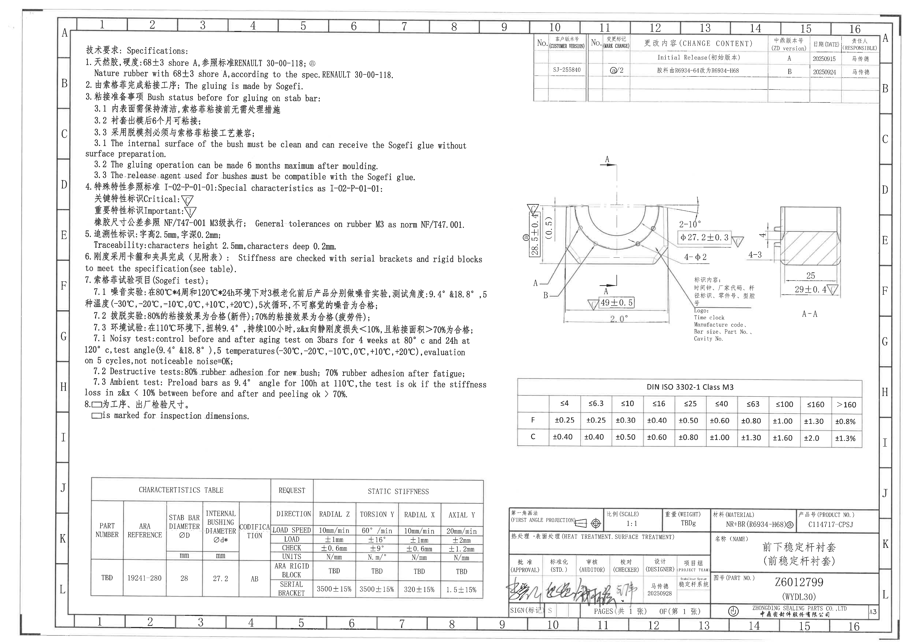
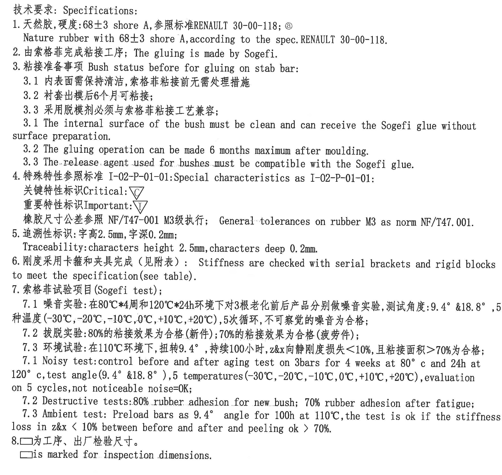
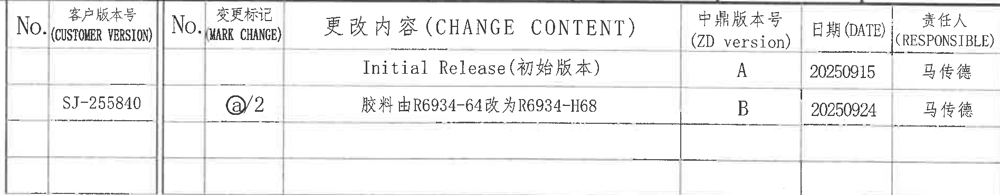
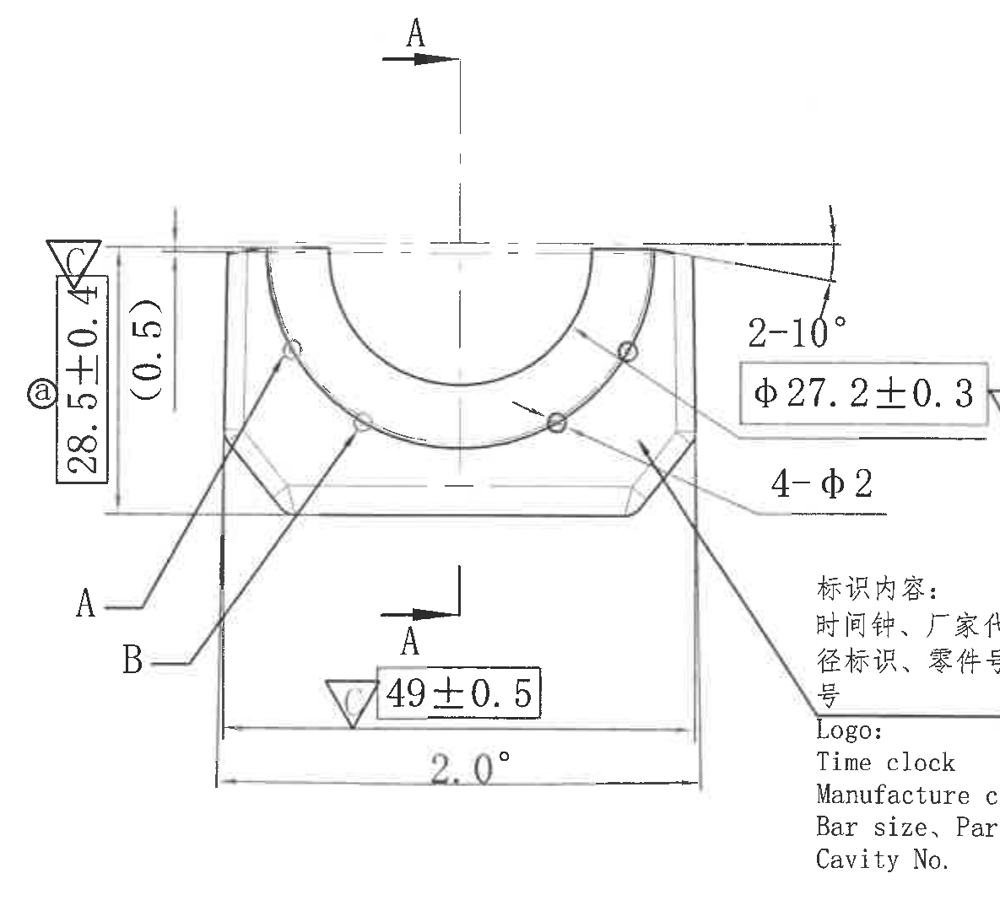
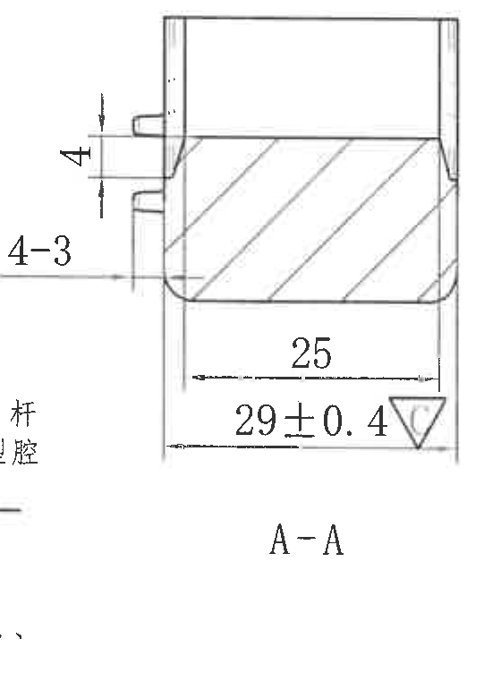
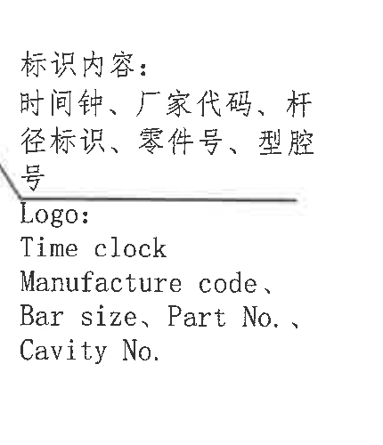
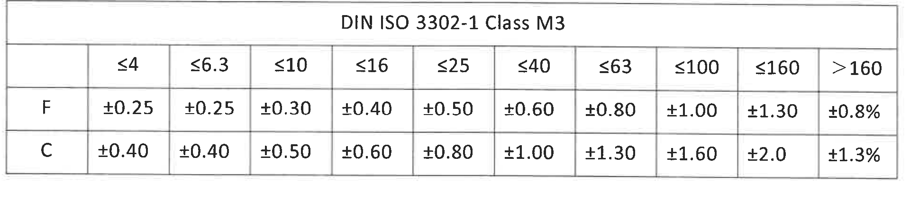
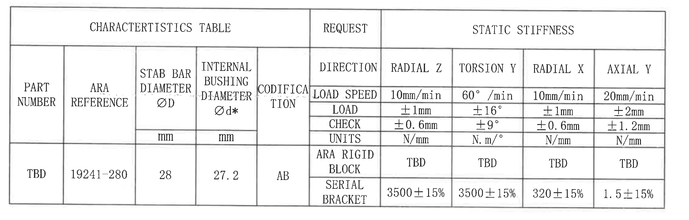
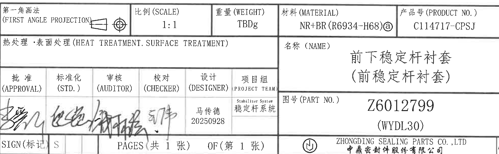

# 20C114717 PDF 内容识别结果

## 整页 PNG

页码：1  
整页 PNG：`outputs/20C114717_assets/images/page_1.png`  
整页尺寸：4959 x 3505 px  
整页 bbox：[0, 0, 4959, 3505]

## object_1 - NOTES / Specifications

原图位置/视图名称：page 1 左上至左中 NOTES / Specifications，bbox [410, 230, 2660, 2360]。

| 提取项 | 原图数值或文本 | 含义说明 |
|---|---|---|
| 标题 | 技术要求: Specifications: | 技术要求与英文说明区。 |
| 1 | 天然胶,硬度:68±3 shore A,参照标准RENAULT 30-00-118; @ | 材料为天然胶，硬度 68±3 Shore A；按 RENAULT 30-00-118；带 @ 标记。 |
| 1 英文 | Nature rubber with 68±3 shore A,according to the spec.RENAULT 30-00-118. | 上一条英文对应说明。 |
| 2 | 由索格菲完成粘接工序; The gluing is made by Sogefi. | 粘接工序由 Sogefi 完成。 |
| 3 | 粘接准备事项 Bush status before for gluing on stab bar: | 稳定杆粘接前的衬套状态要求。 |
| 3.1 中文 | 内表面需保持清洁,索格菲粘接前无需处理措施 | 内表面清洁即可接收 Sogefi 胶水。 |
| 3.2 中文 | 衬套出模后6个月可粘接; | 出模后最长 6 个月内可执行粘接。 |
| 3.3 中文 | 采用脱模剂必须与索格菲粘接工艺兼容; | 脱模剂需与 Sogefi 胶粘工艺兼容。 |
| 3.1 英文 | The internal surface of the bush must be clean and can receive the Sogefi glue without surface preparation. | 3.1 的英文对应说明。 |
| 3.2 英文 | The gluing operation can be made 6 months maximum after moulding. | 3.2 的英文对应说明。 |
| 3.3 英文 | The release agent used for bushes must be compatible with the Sogefi glue. | 3.3 的英文对应说明。 |
| 4 | 特殊特性参照标准 I-02-P-01-01:Special characteristics as I-02-P-01-01: | 特殊特性标识采用 I-02-P-01-01。 |
| 4 标识 | 关键特性标识 Critical: △C；重要特性标识 Important: △I | 视图中的三角 C / 三角 I 是关键/重要特性符号。 |
| 4 公差 | 橡胶尺寸公差参照 NF/T47-001 M3级执行; General tolerances on rubber M3 as norm NF/T47.001. | 橡胶尺寸公差按 NF/T47.001 的 M3 级，见 DIN ISO 3302-1 Class M3 表。 |
| 5 | 追溯性标识:字高2.5mm,字深0.2mm; Traceability:characters height 2.5mm,characters deep 0.2mm. | 追溯字符高度 2.5 mm、深度 0.2 mm。 |
| 6 | 刚度采用卡箍和夹具完成（见附表）: Stiffness are checked with serial brackets and rigid blocks to meet the specification(see table). | 刚度检测方式与夹具/刚性块有关，数据见特性表。 |
| 7 | 索格菲试验项目(Sogefi test); | Sogefi 试验项目标题。 |
| 7.1 中文 | 噪音实验:在80°C*4周和120°C*24h环境下对3根老化前后产品分别做噪音实验,测试角度:9.4° &18.8°,5种温度(-30°C,-20°C,-10°C,0°C,+10°C,+20°C),5次循环,不可察觉的噪音为合格; | 噪音试验条件：3 根样件、老化前后，角度 9.4° 和 18.8°，6 个温度点，5 次循环。 |
| 7.2 中文 | 拔脱实验:80%的粘接效果为合格(新件);70%的粘接效果为合格(疲劳件); | 拔脱/粘接合格判据：新件 80%，疲劳件 70%。 |
| 7.3 中文 | 环境试验:在110°C环境下,扭转9.4°,持续100小时,z&x向静刚度损失<10%,且粘接面积>70%为合格; | 环境试验条件：110°C、扭转 9.4°、100 h；z&x 静刚度损失和粘接面积为判定依据。 |
| 7.1 英文 | Noisy test:control before and after aging test on 3bars for 4 weeks at 80° c and 24h at 120° c,test angle(9.4° &18.8°),5 temperatures(-30°C,-20°C,-10°C,0°C,+10°C,+20°C),evaluation on 5 cycles,not noticeable noise=OK; | 7.1 的英文对应说明。 |
| 7.2 英文 | Destructive tests:80% rubber adhesion for new bush; 70% rubber adhesion after fatigue; | 7.2 的英文对应说明。 |
| 7.3 英文 | Ambient test: Preload bars as 9.4° angle for 100h at 110°C,the test is ok if the stiffness loss in z&x < 10% between before and after and peeling ok > 70%. | 7.3 的英文对应说明。 |
| 8 | □为工序、出厂检验尺寸。□is marked for inspection dimensions. | 方框标识为工序/出厂检验尺寸。 |

边界归属说明：该裁切对象只包含 NOTES / Specifications 文本区；右侧为空白，没有主视图、表格或标题栏内容。文本第 8 条及英文说明完整保留，未裁掉边缘文字。

## object_2 - 更改内容表 / Change Content Table

原图位置/视图名称：page 1 右上更改履历表，bbox [2900, 185, 4795, 555]。

原表行列还原：

| No. | 客户版本号 (CUSTOMER VERSION) | No. | 变更标记 (MARK CHANGE) | 更改内容 (CHANGE CONTENT) | 中鼎版本号 (ZD version) | 日期 (DATE) | 责任人 (RESPONSIBLE) |
|---|---|---|---|---|---|---|---|
|  |  |  |  | Initial Release(初始版本) | A | 20250915 | 马传德 |
|  | SJ-255840 |  | @/2 | 胶料由R6934-64改为R6934-H68 | B | 20250924 | 马传德 |
|  |  |  |  |  |  |  |  |

| 提取项 | 原图数值或文本 | 含义说明 |
|---|---|---|
| 表头 | No.; 客户版本号(CUSTOMER VERSION); No.; 变更标记(MARK CHANGE); 更改内容(CHANGE CONTENT); 中鼎版本号(ZD version); 日期(DATE); 责任人(RESPONSIBLE) | 更改履历表的原始列结构。 |
| 初始版本 | Initial Release(初始版本); ZD version A; DATE 20250915; RESPONSIBLE 马传德 | 初始发行记录。 |
| 客户版本 | SJ-255840 | 第二条更改记录的客户版本号。 |
| 变更标记 | @/2 | 第二条更改记录的变更标记。 |
| 变更内容 | 胶料由R6934-64改为R6934-H68 | 胶料从 R6934-64 修改为 R6934-H68。 |
| 中鼎版本 | B | 第二条记录的中鼎版本号。 |
| 日期 | 20250924 | 第二条记录日期。 |
| 责任人 | 马传德 | 第二条记录责任人。 |

边界归属说明：裁切保留表格外框、表头和三行记录区域。右侧图框字母未纳入最终裁切；顶部紧邻图框线但表格文字和表格线完整。

## object_3 - 主加工视图

原图位置/视图名称：page 1 中右主加工视图，bbox [2820, 830, 4005, 1910]。

| 提取项 | 原图数值或文本 | 含义说明 |
|---|---|---|
| 视图名称 | 主加工视图；剖切方向 A-A 由上下两个 A 箭头标出 | 本视图定义零件正向轮廓、孔/圆弧位置和剖切方向。 |
| 基准/引线 | A、B | 左下两条引线分别指向零件局部边界/斜面位置，作为视图内特征指示。 |
| 关键/检验标识 | 28.5±0.4 左侧带 @，上方邻近 △C；49±0.5 前有三角特性符号；φ27.2±0.3 右侧有 △C | 三角符号按 NOTES 中定义解释；@ 与更改/材料标记关联。 |
| 总高度/竖向尺寸 | 28.5±0.4 | 主视图左侧竖向总高尺寸，公差 ±0.4。 |
| 参考尺寸 | (0.5) | 括号内参考尺寸；位于主视图左侧竖向局部，作为参考值还原，不作为主控公差尺寸。 |
| 角度 | 2-10° | 主视图右上斜面处角度标注，按原图写法为 2-10°，表示两处 10° 角度/倒角类特征。 |
| 直径尺寸 | φ27.2±0.3 | 主视图右侧框内直径尺寸，公差 ±0.3，并带关键特性 △C。 |
| 数量前缀直径 | 4-φ2 | 主视图右侧孔/小圆特征标注，表示 4 处直径 φ2。 |
| 底部横向尺寸 | 49±0.5 | 主视图底部横向尺寸，公差 ±0.5，前有特性三角符号。 |
| 底部角度 | 2.0° | 主视图底部斜度/角度标注。 |
| 圆弧/弧向尺寸 | 可见内外圆弧轮廓；未见 R 半径或弧长数值 | 圆弧形状在主视图中绘出，但本裁切未给出单独 R、弧长或弧度数值；相关圆形特征以 φ27.2±0.3 和 4-φ2 标注。 |
| T 编号 | 未见 T 编号 | 主视图区域未出现 T 编号。 |

边界归属说明：为完整保留 φ27.2±0.3、4-φ2、49±0.5 和 2.0° 的尺寸线、箭头和文字，右下角可见标识内容文字残片；该残片归属于 object_5，不作为主加工视图尺寸或文本提取。A-A 剖面尺寸未归入本对象。

## object_4 - 剖面视图 A-A

原图位置/视图名称：page 1 右中 A-A 剖面视图，bbox [4075, 1110, 4635, 1890]。

| 提取项 | 原图数值或文本 | 含义说明 |
|---|---|---|
| 视图名称 | A-A | 由主视图中 A-A 剖切箭头对应的剖面视图。 |
| 剖面线 | 斜向剖面线 | 表示被剖切的橡胶/衬套实体区域。 |
| 局部尺寸 | 4 | 剖面左侧上部凸台/局部高度尺寸。 |
| 局部标注 | 4-3 | 剖面左侧局部台阶/凸出特征标注，按原图值还原。 |
| 内部横向尺寸 | 25 | 剖面内部横向尺寸。 |
| 总宽/外部横向尺寸 | 29±0.4 △C | 剖面底部外部横向尺寸，公差 ±0.4，带关键特性 △C。 |
| 圆角/弧线 | 端部可见圆角轮廓；未见 R 半径数值 | 剖面端部圆角可见，但原图未给出单独 R 标注。 |
| T 编号 | 未见 T 编号 | A-A 剖面区域未出现 T 编号。 |

边界归属说明：左边界向外扩展是为了完整包含 4-3 标注及其指引线；左下角可见少量相邻标识说明文字残片，该文字归属 object_5，不在 A-A 剖面提取。剖面内 4、4-3、25、29±0.4 的尺寸线和文字均完整。

## object_5 - 标识内容局部说明

原图位置/视图名称：page 1 主视图右下标识内容局部说明，bbox [3765, 1455, 4195, 1955]。

| 提取项 | 原图数值或文本 | 含义说明 |
|---|---|---|
| 中文标题 | 标识内容: | 标识说明标题。 |
| 中文内容 | 时间钟、厂家代码、杆径标识、零件号、型腔号 | 零件需包含的追溯/标识内容。 |
| 分隔线 | 横线 | 中文说明与英文说明之间的分隔线。 |
| 英文标题 | Logo: | 英文标识说明标题。 |
| 英文内容 1 | Time clock | 时间钟标识。 |
| 英文内容 2 | Manufacture code, | 厂家代码。 |
| 英文内容 3 | Bar size, Part No., | 杆径、零件号。 |
| 英文内容 4 | Cavity No. | 型腔号。 |

边界归属说明：裁切对象只提取标识内容说明文字。左上角可见一小段来自主加工视图的引线，该引线不作为本对象文本内容；中文和英文说明均完整未截断。

## object_6 - DIN ISO 3302-1 Class M3 公差表

原图位置/视图名称：page 1 右中 DIN ISO 3302-1 Class M3 公差表，bbox [2810, 2065, 4730, 2485]。

原表行列还原：

| DIN ISO 3302-1 Class M3 | ≤4 | ≤6.3 | ≤10 | ≤16 | ≤25 | ≤40 | ≤63 | ≤100 | ≤160 | >160 |
|---|---|---|---|---|---|---|---|---|---|---|
| F | ±0.25 | ±0.25 | ±0.30 | ±0.40 | ±0.50 | ±0.60 | ±0.80 | ±1.00 | ±1.30 | ±0.8% |
| C | ±0.40 | ±0.40 | ±0.50 | ±0.60 | ±0.80 | ±1.00 | ±1.30 | ±1.60 | ±2.0 | ±1.3% |

| 提取项 | 原图数值或文本 | 含义说明 |
|---|---|---|
| 表名 | DIN ISO 3302-1 Class M3 | 橡胶尺寸一般公差表。 |
| 尺寸分档 | ≤4, ≤6.3, ≤10, ≤16, ≤25, ≤40, ≤63, ≤100, ≤160, >160 | 按尺寸范围分档。 |
| F 行 | ±0.25, ±0.25, ±0.30, ±0.40, ±0.50, ±0.60, ±0.80, ±1.00, ±1.30, ±0.8% | F 类公差。 |
| C 行 | ±0.40, ±0.40, ±0.50, ±0.60, ±0.80, ±1.00, ±1.30, ±1.60, ±2.0, ±1.3% | C 类公差。 |

边界归属说明：表格外框、表头和 F/C 两行均完整；没有混入主视图、标题栏或特性表内容。

## object_7 - CHARACTERISTICS TABLE / 静刚度特性表

原图位置/视图名称：page 1 左下 CHARACTERISTICS TABLE，bbox [465, 2585, 2715, 3305]。

原表行列还原：

| 分组 | PART NUMBER | ARA REFERENCE | STAB BAR DIAMETER ØD | INTERNAL BUSHING DIAMETER Ød* | CODIFICATION | DIRECTION | RADIAL Z | TORSION Y | RADIAL X | AXIAL Y |
|---|---|---|---|---|---|---|---|---|---|---|
| 表头 |  |  | mm | mm |  | LOAD SPEED | 10mm/min | 60°/min | 10mm/min | 20mm/min |
| REQUEST / STATIC STIFFNESS |  |  |  |  |  | LOAD | ±1mm | ±16° | ±1mm | ±2mm |
| REQUEST / STATIC STIFFNESS |  |  |  |  |  | CHECK | ±0.6mm | ±9° | ±0.6mm | ±1.2mm |
| REQUEST / STATIC STIFFNESS |  |  |  |  |  | UNITS | N/mm | N.m/° | N/mm | N/mm |
| CHARACTERISTICS TABLE / STATIC STIFFNESS | TBD | 19241-280 | 28 | 27.2 | AB | ARA RIGID BLOCK | TBD | TBD | TBD | TBD |
| CHARACTERISTICS TABLE / STATIC STIFFNESS | TBD | 19241-280 | 28 | 27.2 | AB | SERIAL BRACKET | 3500±15% | 3500±15% | 320±15% | 1.5±15% |

| 提取项 | 原图数值或文本 | 含义说明 |
|---|---|---|
| 表名 | CHARACTERISTICS TABLE | 产品特性与静刚度要求表。 |
| 分组表头 | REQUEST; STATIC STIFFNESS | REQUEST 下给出方向/检测条件；STATIC STIFFNESS 下给出 Z/Y/X/Y 方向刚度。 |
| PART NUMBER | TBD | 零件号在此表中待定。 |
| ARA REFERENCE | 19241-280 | ARA 参考号。 |
| STAB BAR DIAMETER ØD | 28 mm | 稳定杆直径。 |
| INTERNAL BUSHING DIAMETER Ød* | 27.2 mm | 内衬套直径，带星号 *，为星号标注尺寸。 |
| CODIFICATION | AB | 编码。 |
| RADIAL Z 条件 | LOAD SPEED 10mm/min; LOAD ±1mm; CHECK ±0.6mm; UNITS N/mm | 径向 Z 静刚度检测条件。 |
| TORSION Y 条件 | LOAD SPEED 60°/min; LOAD ±16°; CHECK ±9°; UNITS N.m/° | 扭转 Y 静刚度检测条件。 |
| RADIAL X 条件 | LOAD SPEED 10mm/min; LOAD ±1mm; CHECK ±0.6mm; UNITS N/mm | 径向 X 静刚度检测条件。 |
| AXIAL Y 条件 | LOAD SPEED 20mm/min; LOAD ±2mm; CHECK ±1.2mm; UNITS N/mm | 轴向 Y 静刚度检测条件。 |
| ARA RIGID BLOCK | RADIAL Z TBD; TORSION Y TBD; RADIAL X TBD; AXIAL Y TBD | 刚性块方式静刚度值待定。 |
| SERIAL BRACKET | RADIAL Z 3500±15%; TORSION Y 3500±15%; RADIAL X 320±15%; AXIAL Y 1.5±15% | 卡箍方式静刚度要求。 |

边界归属说明：表格外框、所有分组表头、单位行和两条刚度数据行完整。右侧没有裁入标题栏；上方没有裁入 NOTES 正文。

## object_8 - 标题栏 / Title Block

原图位置/视图名称：page 1 右下标题栏，bbox [2778, 2760, 4748, 3370]。

原表行列还原：

| 区域 | 原图文本 |
|---|---|
| 第一角画法 | 第一角画法 (FIRST ANGLE PROJECTION)；投影视图符号 |
| 比例 | 比例 (SCALE) 1:1 |
| 重量 | 重量 (WEIGHT) TBDg |
| 材料 | 材料 (MATERIAL) NR+BR(R6934-H68)@ |
| 产品号 | 产品号 (PRODUCT NO.) C114717-CPSJ |
| 热处理/表面处理 | 热处理・表面处理 (HEAT TREATMENT. SURFACE TREATMENT) |
| 名称 | 名称 (NAME) 前下稳定杆衬套 (前稳定杆衬套) |
| 批准 | 批准 (APPROVAL)，签名 |
| 标准化 | 标准化 (STD.)，签名 |
| 审核 | 审核 (AUDITOR)，签名 |
| 校对 | 校对 (CHECKER)，签名 |
| 设计 | 设计 (DESIGNER) 马传德 20250928 |
| 项目组 | 项目组 (PROJECT TEAM) Stabilizer System 稳定杆系统 |
| 图号 | 图号 (PART NO.) Z6012799 (WYDL30) |
| 标记/页码 | SIGN(标记) S；PAGES (共 1 张)；OF (第 1 张) |
| 公司 | ZHONGDING SEALING PARTS CO.,LTD；中鼎密封件股份有限公司 |
| 幅面 | A3 |

| 提取项 | 原图数值或文本 | 含义说明 |
|---|---|---|
| 投影法 | FIRST ANGLE PROJECTION | 第一角画法。 |
| 比例 | 1:1 | 图纸比例。 |
| 重量 | TBDg | 重量待定。 |
| 材料 | NR+BR(R6934-H68)@ | 材料字段，与更改履历中的 R6934-H68 和 @ 标记一致。 |
| 产品号 | C114717-CPSJ | 产品编号。 |
| 名称 | 前下稳定杆衬套（前稳定杆衬套） | 零件中文名称。 |
| 图号 | Z6012799 (WYDL30) | 图纸/零件图号。 |
| 设计 | 马传德 20250928 | 设计责任人与日期。 |
| 项目组 | Stabilizer System 稳定杆系统 | 项目组信息。 |
| 页数 | 共 1 张；第 1 张 | 总页数和当前页。 |
| 公司 | ZHONGDING SEALING PARTS CO.,LTD / 中鼎密封件股份有限公司 | 出图公司。 |
| 幅面 | A3 | 图纸幅面。 |

边界归属说明：标题栏裁切在右下标题栏外框内，文字、签名区、图号、公司名和 A3 幅面均完整。未把上方 DIN 公差表或左侧 CHARACTERISTICS TABLE 归入标题栏。

## 裁切检查记录

| object_id | object_kind | 图片路径 | bbox | 完整性检查 | 归属检查 |
|---|---|---|---|---|---|
| object_1 | notes | outputs/20C114717_assets/images/object_1.png | [410, 230, 2660, 2360] | NOTES 标题、1-8 条中文/英文说明完整；未见边缘文字截断。 | 仅 NOTES 文本区，右侧空白未提取为其他对象。 |
| object_2 | table | outputs/20C114717_assets/images/object_2.png | [2900, 185, 4795, 555] | 表头、两条记录和空白记录行完整；RESPONSIBLE 列完整。 | 未归入右侧图框字母；表格内容独立。 |
| object_3 | view | outputs/20C114717_assets/images/object_3.png | [2820, 830, 4005, 1910] | 28.5±0.4、(0.5)、2-10°、φ27.2±0.3、4-φ2、49±0.5、2.0° 尺寸线和文字完整。 | 右下标识文字残片归 object_5；A-A 剖面尺寸未归入本对象。 |
| object_4 | section | outputs/20C114717_assets/images/object_4.png | [4075, 1110, 4635, 1890] | 4、4-3、25、29±0.4、A-A 名称和剖面线完整。 | 左下相邻标识说明残字归 object_5；只提取剖面尺寸。 |
| object_5 | detail | outputs/20C114717_assets/images/object_5.png | [3765, 1455, 4195, 1955] | 中文和英文标识说明完整；未截掉文字。 | 左上主视图引线不作为本对象文本；标识说明归本对象。 |
| object_6 | table | outputs/20C114717_assets/images/object_6.png | [2810, 2065, 4730, 2485] | DIN ISO 3302-1 Class M3 表头、F/C 两行和全部公差值完整。 | 未混入主视图、标题栏或特性表。 |
| object_7 | table | outputs/20C114717_assets/images/object_7.png | [465, 2585, 2715, 3305] | CHARACTERISTICS TABLE 外框、所有列、条件行和两条数据行完整。 | 未混入 NOTES 或标题栏。 |
| object_8 | title_block | outputs/20C114717_assets/images/object_8.png | [2778, 2760, 4748, 3370] | 标题栏字段、签名区、图号、公司名、A3 幅面完整。 | 未归入 DIN 公差表或左下特性表。 |
