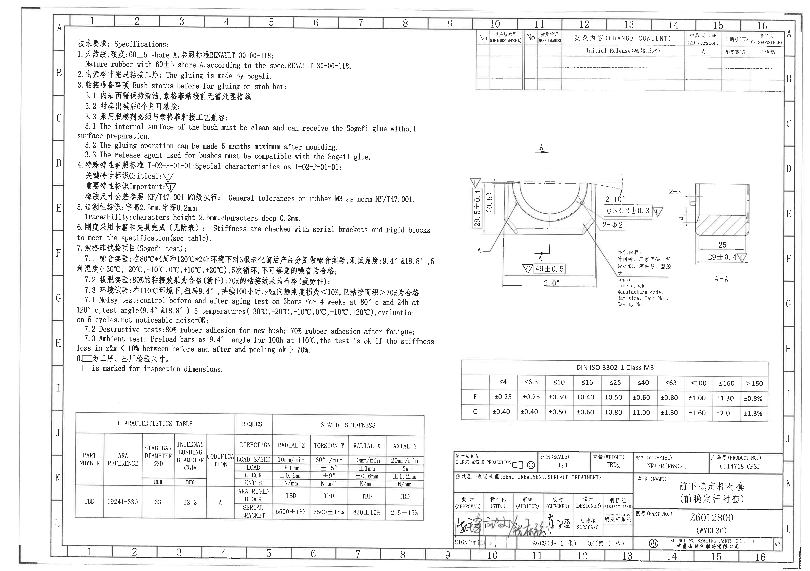
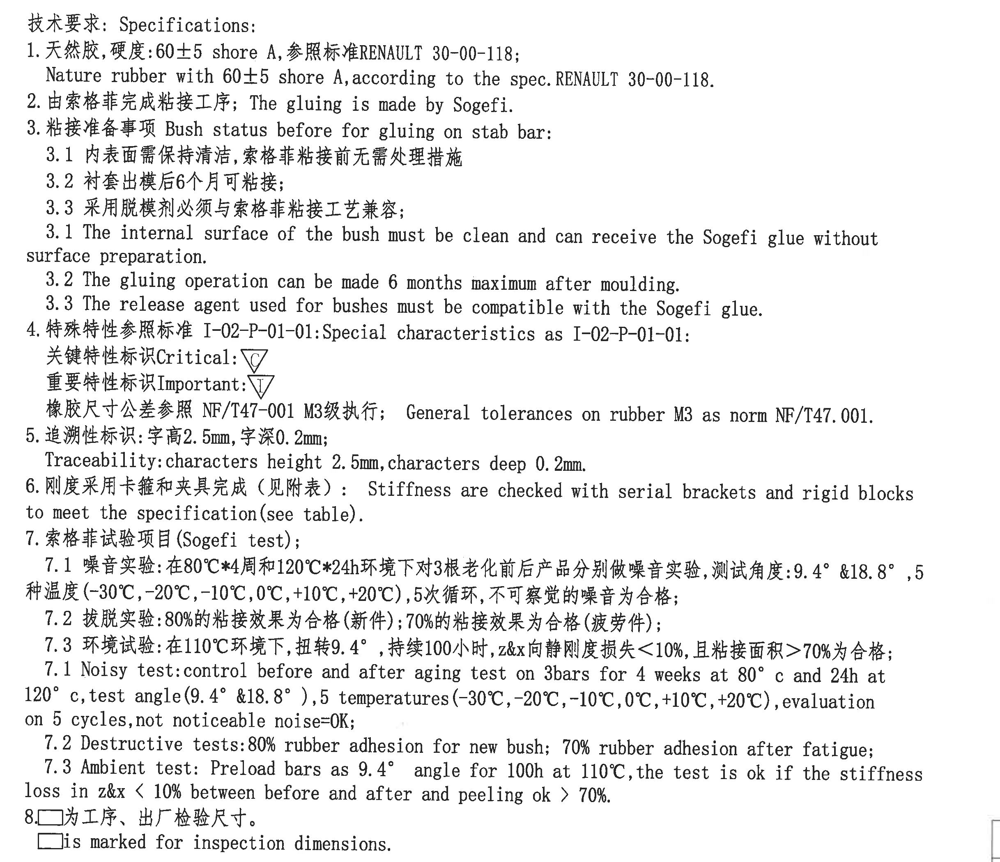
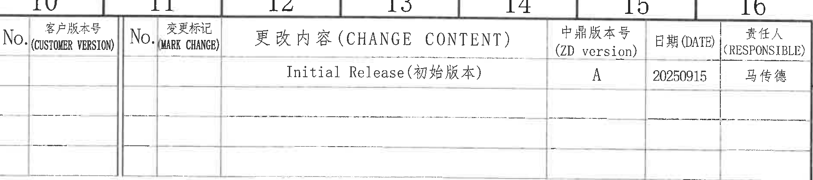
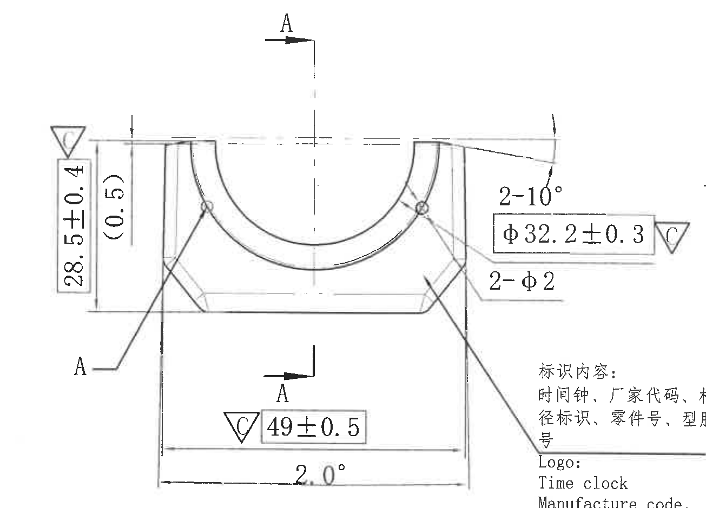
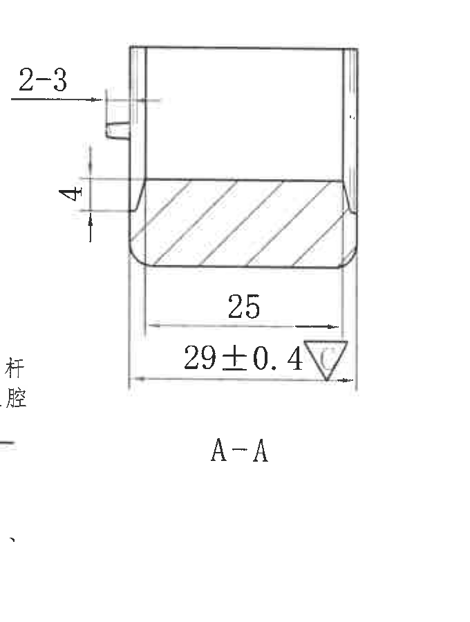
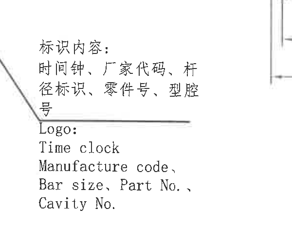
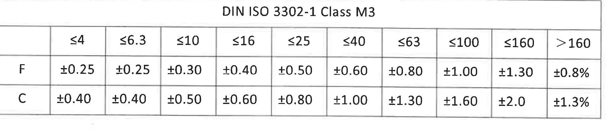
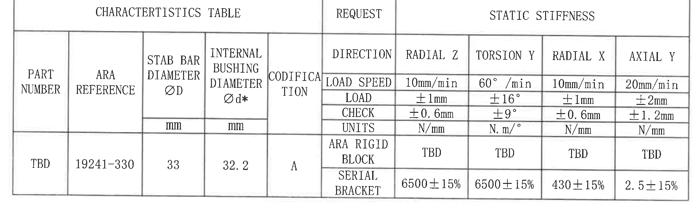
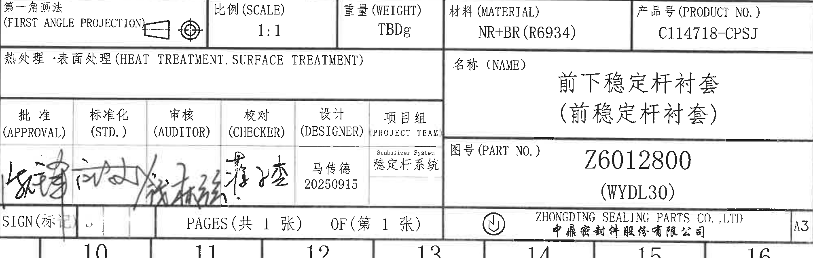

# 20C114718 PDF 内容识别

整页渲染图：`outputs/20C114718_assets/images/page_1.png`

坐标说明：bbox 使用整页 PNG 像素坐标 `[x_min, y_min, x_max, y_max]`，整页尺寸为 4959 x 3505。

## object_1 - NOTES / 技术要求

裁切图片：`outputs/20C114718_assets/images/object_1.png`

原图位置/视图名称：Page 1 左上区域，技术要求 / Specifications，bbox `[410, 210, 2845, 2310]`。

| 提取项 | 原图数值或文本 | 含义说明 |
|---|---|---|
| 标题 | 技术要求: Specifications: | 技术要求说明区标题。 |
| 1 | 天然胶, 硬度:60±5 shore A, 参照标准RENAULT 30-00-118; | 材料为天然胶，硬度要求 60±5 Shore A，引用 RENAULT 30-00-118。 |
| 1 英文 | Nature rubber with 60±5 shore A, according to the spec. RENAULT 30-00-118. | 与第 1 条中文对应。 |
| 2 | 由索格菲完成粘接工序; The gluing is made by Sogefi. | 粘接工序由 Sogefi 完成。 |
| 3 | 粘接准备事项 Bush status before for gluing on stab bar: | 粘接到稳定杆前的衬套状态要求。 |
| 3.1 中文 | 内表面需保持清洁, 索格菲粘接前无需处理措施 | 粘接前内表面清洁要求。 |
| 3.2 中文 | 衬套出模后6个月可粘接; | 出模后最长 6 个月内可粘接。 |
| 3.3 中文 | 采用脱模剂必须与索格菲粘接工艺兼容; | 脱模剂需与 Sogefi 粘接工艺兼容。 |
| 3.1 英文 | The internal surface of the bush must be clean and can receive the Sogefi glue without surface preparation. | 与 3.1 中文对应。 |
| 3.2 英文 | The gluing operation can be made 6 months maximum after moulding. | 与 3.2 中文对应。 |
| 3.3 英文 | The release agent used for bushes must be compatible with the Sogefi glue. | 与 3.3 中文对应。 |
| 4 | 特殊特性参照标准 I-02-P-01-01: Special characteristics as I-02-P-01-01: | 特殊特性标识引用标准。 |
| 4 关键特性 | 关键特性标识 Critical: △C | 图中三角形 C 表示关键特性；主视图和 A-A 剖面中带 C 的尺寸归入关键尺寸。 |
| 4 重要特性 | 重要特性标识 Important: △I | 图中三角形 I 表示重要特性。 |
| 4 橡胶公差 | 橡胶尺寸公差参照 NF/T47-001 M3级执行; General tolerances on rubber M3 as norm NF/T47.001. | 橡胶尺寸通用公差按 NF/T47-001 M3。 |
| 5 | 追溯性标识: 字高2.5mm, 字深0.2mm; | 追溯性字符高度 2.5 mm，字深 0.2 mm。 |
| 5 英文 | Traceability: characters height 2.5mm, characters deep 0.2mm. | 与第 5 条中文对应。 |
| 6 | 刚度采用卡箍和夹具完成（见附表）: Stiffness are checked with serial brackets and rigid blocks to meet the specification(see table). | 刚度检查方法引用下方 CHARACTERISTICS TABLE。 |
| 7 | 索格菲试验项目(Sogefi test); | Sogefi 试验项目标题。 |
| 7.1 中文 | 噪音实验: 在80℃*4周和120℃*24h环境下对3根老化前后产品分别做噪音实验, 测试角度:9.4° &18.8°, 5种温度(-30℃,-20℃,-10℃,0℃,+10℃,+20℃), 5次循环, 不可察觉的噪音为合格; | 噪音试验条件、角度、温度循环和合格判定。 |
| 7.2 中文 | 剥脱实验:80%的粘接效果为合格(新件);70%的粘接效果为合格(疲劳件); | 新件/疲劳件粘接面积合格判定。 |
| 7.3 中文 | 环境试验: 在110℃环境下, 扭转9.4°, 持续100小时, z&x向静刚度损失<10%, 且粘接面积>70%为合格; | 环境试验温度、扭转角、持续时间、刚度损失和粘接面积判定。 |
| 7.1 英文 | Noisy test: control before and after aging test on 3bars for 4 weeks at 80°c and 24h at 120°c, test angle(9.4° &18.8°), 5 temperatures(-30℃,-20℃,-10℃,0℃,+10℃,+20℃), evaluation on 5 cycles, not noticeable noise=OK; | 与 7.1 中文对应。 |
| 7.2 英文 | Destructive tests: 80% rubber adhesion for new bush; 70% rubber adhesion after fatigue; | 与 7.2 中文对应。 |
| 7.3 英文 | Ambient test: Preload bars as 9.4° angle for 100h at 110℃, the test is ok if the stiffness loss in z&x < 10% between before and after and peeling ok > 70%. | 与 7.3 中文对应。 |
| 8 | □为工序、出厂检验尺寸。 | 方框标记表示工序、出厂检验尺寸。 |
| 8 英文 | □is marked for inspection dimensions. | 与第 8 条中文对应。 |

边界归属说明：该裁切对象只提取左上 NOTES 文字和符号说明；右侧主视图尺寸、剖面尺寸、表格内容不归入本对象。

## object_2 - Revision Table / 修订履历表

裁切图片：`outputs/20C114718_assets/images/object_2.png`

原图位置/视图名称：Page 1 右上修订履历表，bbox `[2928, 145, 4805, 560]`。

原表还原：

| No. | 客户版本号 (CUSTOMER VERSION) | No. | 变更标记 MARK CHANGE | 更改内容 (CHANGE CONTENT) | 中鼎版本号 (ZD version) | 日期 (DATE) | 责任人 (RESPONSIBLE) |
|---|---|---|---|---|---|---|---|
|  |  |  |  | Initial Release(初始版本) | A | 20250915 | 马传德 |
|  |  |  |  |  |  |  |  |
|  |  |  |  |  |  |  |  |
|  |  |  |  |  |  |  |  |

| 提取项 | 原图数值或文本 | 含义说明 |
|---|---|---|
| 修订记录 | Initial Release(初始版本) | 初始发布记录。 |
| ZD version | A | 中鼎版本号为 A。 |
| DATE | 20250915 | 修订日期。 |
| RESPONSIBLE | 马传德 | 责任人。 |
| 空白行 | 3 行空白修订行 | 原表保留空白行，未填记录。 |

边界归属说明：表格位于图纸右上并贴近外图框，裁切内包含上方坐标编号 10-16 的局部图框线；提取内容仅归入修订履历表列和有效记录，不把图框坐标作为修订字段。

## object_3 - Main Machining View / 主加工视图

裁切图片：`outputs/20C114718_assets/images/object_3.png`

原图位置/视图名称：Page 1 中右主加工视图，bbox `[2785, 860, 4090, 1800]`。

| 提取项 | 原图数值或文本 | 含义说明 |
|---|---|---|
| 左侧竖向关键尺寸 | 28.5±0.4，带 △C | 主视图左侧总高度/竖向控制尺寸，公差 ±0.4，关键特性。 |
| 左侧括号参考尺寸 | (0.5) | 主视图左侧括号内参考尺寸；括号表示参考信息，不作为独立公差控制尺寸。 |
| 右上角度 | 2-10° | 数量前缀 2-，表示两处 10° 角度/斜度标注，归属主视图右上侧。 |
| 内径关键尺寸 | φ32.2±0.3，带 △C | 主视图内弧/内孔直径控制尺寸，公差 ±0.3，关键特性；与特性表 INTERNAL BUSHING DIAMETER Ød* = 32.2 对应。 |
| 小孔/局部圆孔 | 2-φ2 | 数量前缀 2-，表示两处直径 φ2 的局部圆孔/标记。 |
| 底部水平关键尺寸 | 49±0.5，带 △C | 主视图底部横向控制尺寸，公差 ±0.5，关键特性。 |
| 底部角度 | 2.0° | 主视图底部斜度/角度标注，未见单独公差。 |
| 剖切指示 | A、A | 主视图中上下两个 A 向箭头和左侧 A 引出线定义 A-A 剖面方向。 |
| 弧度/半径标注 | 未见 R 或弧长数值；可见内弧由 φ32.2±0.3 控制 | 原图未给独立半径或弧长尺寸。 |
| T 编号 | 未见 | 主视图内未见 T 编号。 |

边界归属说明：本裁切完整保留主视图中的尺寸线、箭头、剖切符号和尺寸文字。右下方可见“标识内容/Logo”说明的部分文字，这是原图中标识说明与主视图引线相邻造成的边界重叠；该文字不作为主视图尺寸提取，完整文本归入 object_5。右侧 A-A 剖面尺寸 `2-3`、`4`、`25`、`29±0.4` 不归入主视图。

## object_4 - Section A-A / A-A 剖面视图

裁切图片：`outputs/20C114718_assets/images/object_4.png`

原图位置/视图名称：Page 1 中右 A-A 剖面视图，bbox `[4070, 1060, 4750, 1960]`。

| 提取项 | 原图数值或文本 | 含义说明 |
|---|---|---|
| 剖面名称 | A-A | 剖面视图名称，对应主视图中的 A 剖切箭头。 |
| 左上局部尺寸 | 2-3 | 数量前缀 2-，表示剖面左上局部特征两处尺寸 3。 |
| 左侧竖向尺寸 | 4 | 剖面左侧台阶/厚度方向尺寸。 |
| 底部内部水平尺寸 | 25 | 剖面底部内部水平尺寸，未见单独公差。 |
| 底部外侧关键尺寸 | 29±0.4，带 △C | 剖面底部外侧水平控制尺寸，公差 ±0.4，关键特性。 |
| 剖面线 | 斜剖面线 | 表示该区域为剖切材料截面。 |
| T 编号 | 未见 | A-A 剖面内未见 T 编号。 |

边界归属说明：本裁切完整保留 A-A 剖面本体及 `2-3`、`4`、`25`、`29±0.4` 的尺寸线、箭头和文字。左下边缘可见邻接标识说明的少量文字片段；该片段不归入 A-A 剖面提取。主视图中的 `28.5±0.4`、`(0.5)`、`φ32.2±0.3`、`2-φ2`、`49±0.5`、`2.0°` 不归入本剖面对象。

## object_5 - Marking Detail / 标识内容局部说明

裁切图片：`outputs/20C114718_assets/images/object_5.png`

原图位置/视图名称：Page 1 主视图右下侧标识内容说明，bbox `[3700, 1450, 4300, 1950]`。

| 提取项 | 原图数值或文本 | 含义说明 |
|---|---|---|
| 中文标题 | 标识内容: | 标识内容说明标题。 |
| 中文标识项 | 时间钟、厂家代码、杆径标识、零件号、型腔号 | 产品标识应包含的中文项目。 |
| 英文标题 | Logo: | 英文标识说明标题。 |
| 英文标识项 1 | Time clock | 时间钟。 |
| 英文标识项 2 | Manufacture code, | 厂家代码。 |
| 英文标识项 3 | Bar size, Part No., | 杆径/零件号。 |
| 英文标识项 4 | Cavity No. | 型腔号。 |

边界归属说明：该局部说明由主视图右侧引线关联到标识区域。裁切完整保留中文和英文标识文本；右侧可见 A-A 剖面尺寸线边缘，该边缘不归入本局部说明提取。

## object_6 - DIN ISO 3302-1 Class M3 Tolerance Table / 公差表

裁切图片：`outputs/20C114718_assets/images/object_6.png`

原图位置/视图名称：Page 1 右下上方 DIN ISO 3302-1 Class M3 公差表，bbox `[2840, 2220, 4740, 2650]`。

原表还原：

| DIN ISO 3302-1 Class M3 | ≤4 | ≤6.3 | ≤10 | ≤16 | ≤25 | ≤40 | ≤63 | ≤100 | ≤160 | >160 |
|---|---|---|---|---|---|---|---|---|---|---|
| F | ±0.25 | ±0.25 | ±0.30 | ±0.40 | ±0.50 | ±0.60 | ±0.80 | ±1.00 | ±1.30 | ±0.8% |
| C | ±0.40 | ±0.40 | ±0.50 | ±0.60 | ±0.80 | ±1.00 | ±1.30 | ±1.60 | ±2.0 | ±1.3% |

| 提取项 | 原图数值或文本 | 含义说明 |
|---|---|---|
| 表标题 | DIN ISO 3302-1 Class M3 | 橡胶件 M3 公差等级表。 |
| F 行 | ±0.25, ±0.25, ±0.30, ±0.40, ±0.50, ±0.60, ±0.80, ±1.00, ±1.30, ±0.8% | F 级在各尺寸范围的通用公差。 |
| C 行 | ±0.40, ±0.40, ±0.50, ±0.60, ±0.80, ±1.00, ±1.30, ±1.60, ±2.0, ±1.3% | C 级在各尺寸范围的通用公差。 |

边界归属说明：该裁切完整包含公差表标题、表头、F/C 两行及表格边框；未混入标题栏或特性表内容。

## object_7 - CHARACTERISTICS TABLE / 特性表

裁切图片：`outputs/20C114718_assets/images/object_7.png`

原图位置/视图名称：Page 1 左下 CHARACTERISTICS TABLE，bbox `[420, 2560, 2630, 3250]`。

原表还原：

| CHARACTERISTICS TABLE |  |  |  |  | REQUEST | STATIC STIFFNESS |  |  |  |
|---|---|---|---|---|---|---|---|---|---|
| PART NUMBER | ARA REFERENCE | STAB BAR DIAMETER ØD | INTERNAL BUSHING DIAMETER Ød* | CODIFICATION | DIRECTION | RADIAL Z | TORSION Y | RADIAL X | AXIAL Y |
|  |  | mm | mm |  | LOAD SPEED | 10mm/min | 60°/min | 10mm/min | 20mm/min |
|  |  |  |  |  | LOAD | ±1mm | ±16° | ±1mm | ±2mm |
|  |  |  |  |  | CHECK | ±0.6mm | ±9° | ±0.6mm | ±1.2mm |
|  |  |  |  |  | UNITS | N/mm | N.m/° | N/mm | N/mm |
| TBD | 19241-330 | 33 | 32.2 | A | ARA RIGID BLOCK | TBD | TBD | TBD | TBD |
|  |  |  |  |  | SERIAL BRACKET | 6500±15% | 6500±15% | 430±15% | 2.5±15% |

| 提取项 | 原图数值或文本 | 含义说明 |
|---|---|---|
| PART NUMBER | TBD | 零件号字段在特性表内为 TBD。 |
| ARA REFERENCE | 19241-330 | ARA 参考号。 |
| STAB BAR DIAMETER ØD | 33 mm | 稳定杆直径。 |
| INTERNAL BUSHING DIAMETER Ød* | 32.2 mm | 内衬套直径，带星号字段；与主视图 φ32.2±0.3 对应。 |
| CODIFICATION | A | 编码。 |
| RADIAL Z | LOAD SPEED 10mm/min; LOAD ±1mm; CHECK ±0.6mm; UNITS N/mm; ARA RIGID BLOCK TBD; SERIAL BRACKET 6500±15% | Z 向径向静刚度要求。 |
| TORSION Y | LOAD SPEED 60°/min; LOAD ±16°; CHECK ±9°; UNITS N.m/°; ARA RIGID BLOCK TBD; SERIAL BRACKET 6500±15% | Y 向扭转静刚度要求。 |
| RADIAL X | LOAD SPEED 10mm/min; LOAD ±1mm; CHECK ±0.6mm; UNITS N/mm; ARA RIGID BLOCK TBD; SERIAL BRACKET 430±15% | X 向径向静刚度要求。 |
| AXIAL Y | LOAD SPEED 20mm/min; LOAD ±2mm; CHECK ±1.2mm; UNITS N/mm; ARA RIGID BLOCK TBD; SERIAL BRACKET 2.5±15% | Y 向轴向静刚度要求。 |

边界归属说明：该裁切完整包含特性表外框、分组表头、单位行、ARA RIGID BLOCK 行和 SERIAL BRACKET 行；未混入 NOTES、标题栏或公差表内容。

## object_8 - Title Block / 标题栏

裁切图片：`outputs/20C114718_assets/images/object_8.png`

原图位置/视图名称：Page 1 右下标题栏，bbox `[2780, 2780, 4790, 3420]`。

| 提取项 | 原图数值或文本 | 含义说明 |
|---|---|---|
| 投影法 | 第一角画法 (FIRST ANGLE PROJECTION) | 图纸采用第一角画法；旁边包含投影视图符号。 |
| 比例 | 1:1 | 图纸比例。 |
| 重量 | TBDg | 重量未定，单位 g。 |
| 材料 | NR+BR (R6934) | 材料为 NR+BR，材料牌号/规格 R6934。 |
| 产品号 | C114718-CPSJ | 产品号。 |
| 热处理/表面处理 | 热处理·表面处理 (HEAT TREATMENT. SURFACE TREATMENT) | 标题栏字段存在，未见填写具体处理值。 |
| 名称 | 前下稳定杆衬套 (前稳定杆衬套) | 零件名称。 |
| 批准 | 批准 (APPROVAL) | 审批签名栏，图中为手写签名。 |
| 标准化 | 标准化 (STD.) | 标准化签名栏，图中为手写签名。 |
| 审核 | 审核 (AUDITOR) | 审核签名栏，图中为手写签名。 |
| 校对 | 校对 (CHECKER) | 校对签名栏，图中为手写签名。 |
| 设计 | 设计 (DESIGNER): 马传德 20250915 | 设计人和日期。 |
| 项目组 | 项目组 PROJECT TEAM: Stabilizer System / 稳定杆系统 | 项目组字段。 |
| 图号 | Z6012800 (WYDL30) | 零件图号。 |
| 页码 | PAGES(共 1 张) OF(第 1 张) | 共 1 张，第 1 张。 |
| 公司 | ZHONGDING SEALING PARTS CO., LTD / 中鼎密封件股份有限公司 | 出图公司。 |
| 幅面 | A3 | 图纸幅面。 |

边界归属说明：标题栏裁切完整包含右下标题栏所有主要字段；底部可见图框坐标线和编号 10-16 的一部分，作为标题栏贴近外框的边界上下文，不作为标题栏字段提取。

## 裁切检查记录

| 对象 | 图片路径 | 检查结果 | 边界/归属记录 |
|---|---|---|---|
| 整页 | outputs/20C114718_assets/images/page_1.png | 已由 PDF 渲染为整页 PNG，尺寸 4959 x 3505。 | 页面旋转已按渲染结果展开为横向图纸。 |
| object_1 | outputs/20C114718_assets/images/object_1.png | 完整包含 NOTES 文字、编号、特殊特性符号和方框检验符号。 | 不提取主视图、表格或标题栏内容。 |
| object_2 | outputs/20C114718_assets/images/object_2.png | 完整包含修订表表头、唯一有效记录和空白行。 | 因表格贴近图框，裁切带入上方坐标编号局部；坐标编号不作为修订表字段。 |
| object_3 | outputs/20C114718_assets/images/object_3.png | 完整包含主视图 `28.5±0.4`、`(0.5)`、`2-10°`、`φ32.2±0.3`、`2-φ2`、`49±0.5`、`2.0°` 及 A 剖切箭头。 | 右下可见标识说明片段，仅作为邻接边界，不归入主视图提取；A-A 剖面尺寸不归入本对象。 |
| object_4 | outputs/20C114718_assets/images/object_4.png | 完整包含 A-A 剖面、剖面线、`2-3`、`4`、`25`、`29±0.4` 和剖面名称。 | 左下少量标识说明文字片段不归入剖面提取。 |
| object_5 | outputs/20C114718_assets/images/object_5.png | 完整包含中文标识内容和英文 Logo 列表。 | 右侧 A-A 尺寸线边缘不归入标识说明内容。 |
| object_6 | outputs/20C114718_assets/images/object_6.png | 完整包含 DIN ISO 3302-1 Class M3 公差表标题、表头和 F/C 两行。 | 未混入标题栏或其他表格。 |
| object_7 | outputs/20C114718_assets/images/object_7.png | 完整包含 CHARACTERISTICS TABLE 全部表头、单位、ARA RIGID BLOCK 行和 SERIAL BRACKET 行。 | 未混入 NOTES 或标题栏内容。 |
| object_8 | outputs/20C114718_assets/images/object_8.png | 完整包含标题栏字段、签名栏、图号、产品号、材料、名称、公司和 A3。 | 底部图框坐标线作为边界上下文，不作为字段提取。 |
