# 20C114729 内容识别与裁切提取

整页渲染图：`20C114729_assets/images/page_1.png`  
页面尺寸：4959 x 3505 px，bbox `[0, 0, 4959, 3505]`

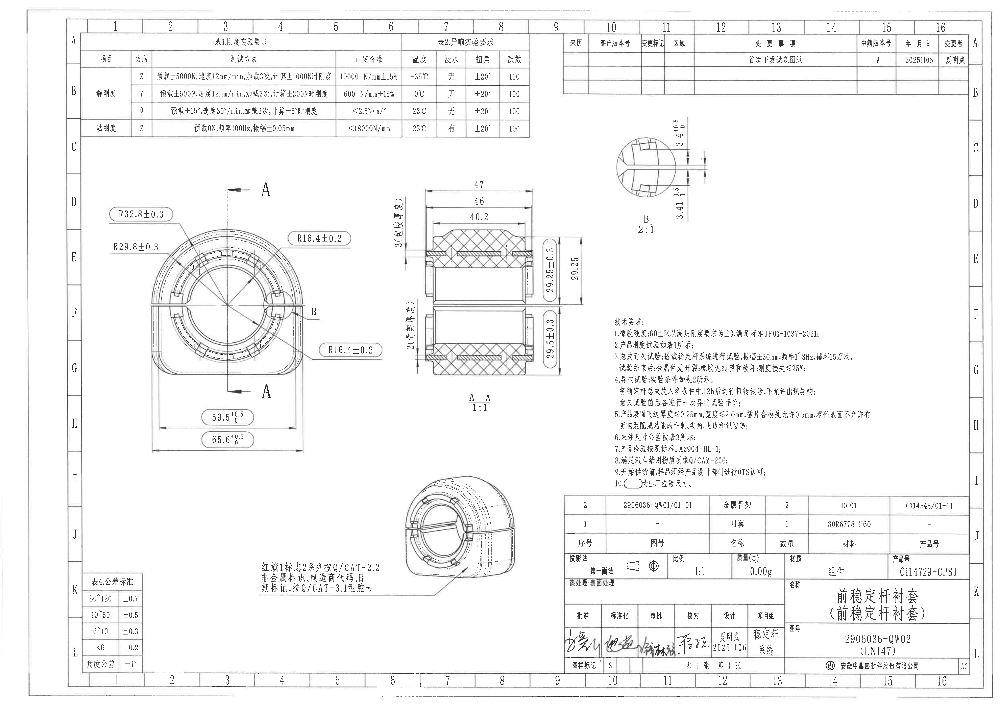

## object_5：表1/表2 实验要求表

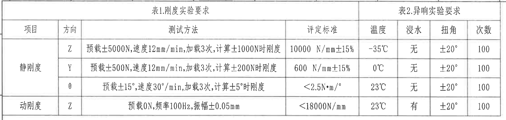

原图位置/视图名称：页面上方左侧，表1.刚度实验要求与表2.异响实验要求组合表，bbox `[390, 160, 2650, 700]`。

原表还原：

| 项目 | 方向 | 测试方法 | 评定标准 | 温度 | 浸水 | 扭角 | 次数 |
|---|---|---|---|---|---|---|---|
| 静刚度 | Z | 预载±5000N,速度12mm/min,加载3次,计算±1000N时刚度 | 10000 N/mm±15% | -35℃ | 无 | ±20° | 100 |
| 静刚度 | Y | 预载±500N,速度12mm/min,加载3次,计算±200N时刚度 | 600 N/mm±15% | 0℃ | 无 | ±20° | 100 |
| 静刚度 | θ | 预载±15°,速度30°/min,加载3次,计算±5°时刚度 | <2.5N*m/° | 23℃ | 无 | ±20° | 100 |
| 动刚度 | Z | 预载0N,频率100Hz,振幅±0.05mm | <18000N/mm | 23℃ | 有 | ±20° | 100 |

| 提取项 | 原图数值或文本 | 含义说明 |
|---|---|---|
| 表标题 | 表1.刚度实验要求 | 左半部分规定静刚度、动刚度的测试方法和评定标准。 |
| 表标题 | 表2.异响实验要求 | 右半部分规定温度、浸水、扭角、次数等异响试验条件。 |
| 静刚度 Z | 10000 N/mm±15%, -35℃, 无, ±20°, 100 | Z 向静刚度测试与异响条件组合要求。 |
| 静刚度 Y | 600 N/mm±15%, 0℃, 无, ±20°, 100 | Y 向静刚度测试与异响条件组合要求。 |
| 静刚度 θ | <2.5N*m/°, 23℃, 无, ±20°, 100 | 角向静刚度要求；单位为力矩/角度。 |
| 动刚度 Z | <18000N/mm, 23℃, 有, ±20°, 100 | Z 向动态刚度要求，包含浸水条件。 |

边界归属说明：裁切区域只包含顶部实验要求表，未包含下方视图。表格外框、表头、四行数据、右侧表2列均完整。

## object_6：变更履历表

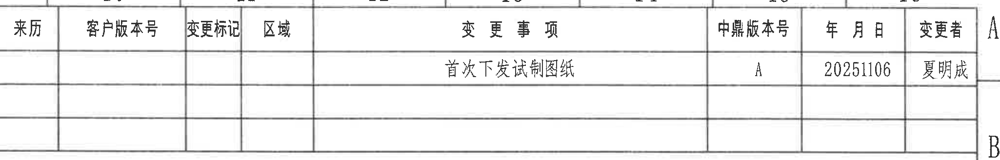

原图位置/视图名称：页面上方右侧变更履历表，bbox `[2800, 155, 4850, 485]`。

原表还原：

| 来历 | 客户版本号 | 变更标记 | 区域 | 变更事项 | 中鼎版本号 | 年月日 | 变更者 |
|---|---|---|---|---|---|---|---|
|  |  |  |  | 首次下发试制图纸 | A | 20251106 | 夏明成 |
|  |  |  |  |  |  |  |  |
|  |  |  |  |  |  |  |  |

| 提取项 | 原图数值或文本 | 含义说明 |
|---|---|---|
| 变更事项 | 首次下发试制图纸 | 图纸首次下发试制。 |
| 中鼎版本号 | A | 当前中鼎版本号。 |
| 年月日 | 20251106 | 变更日期。 |
| 变更者 | 夏明成 | 变更记录责任人。 |

边界归属说明：裁切区域包含完整表头和三条记录线。右侧图框字母 A/B 属于图纸坐标边框，不作为变更表字段提取。

## object_3：B 局部视图

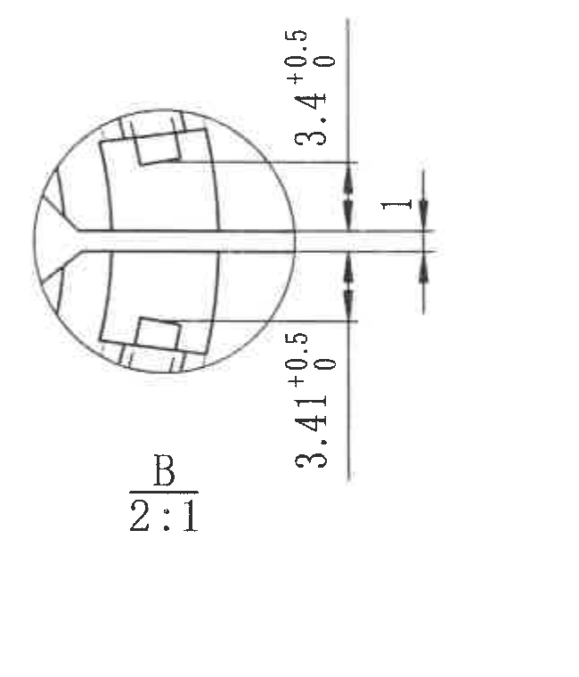

原图位置/视图名称：页面右上部局部视图 B，比例 2:1，bbox `[3020, 560, 3670, 1320]`。

| 提取项 | 原图数值或文本 | 含义说明 |
|---|---|---|
| 视图标识 | B | 对应主视图右侧的 B 局部放大位置。 |
| 比例 | 2:1 | 局部视图相对实物放大两倍。 |
| 上侧局部尺寸 | 3.4 +0.5/0 | 上侧局部厚度/台阶位置尺寸，下偏差 0，上偏差 +0.5。 |
| 下侧局部尺寸 | 3.41 +0.5/0 | 下侧局部厚度/台阶位置尺寸，下偏差 0，上偏差 +0.5。 |
| 中间开口/缝宽 | 1 | 中间水平开口的宽度尺寸，图中未单独给出公差。 |
| 参考尺寸 | 未见括号参考尺寸 | 本局部视图无括号内参考尺寸。 |
| 关键尺寸/直径/T 编号 | 未见星号、Φ、T 编号 | 本局部视图未见星号关键尺寸、直径符号或 T 编号。 |

边界归属说明：B 局部视图与主视图只通过主视图中的 B 引出标识关联；本裁切不包含主视图尺寸。右侧三条竖向尺寸线和文字完整。

## object_1：主视图

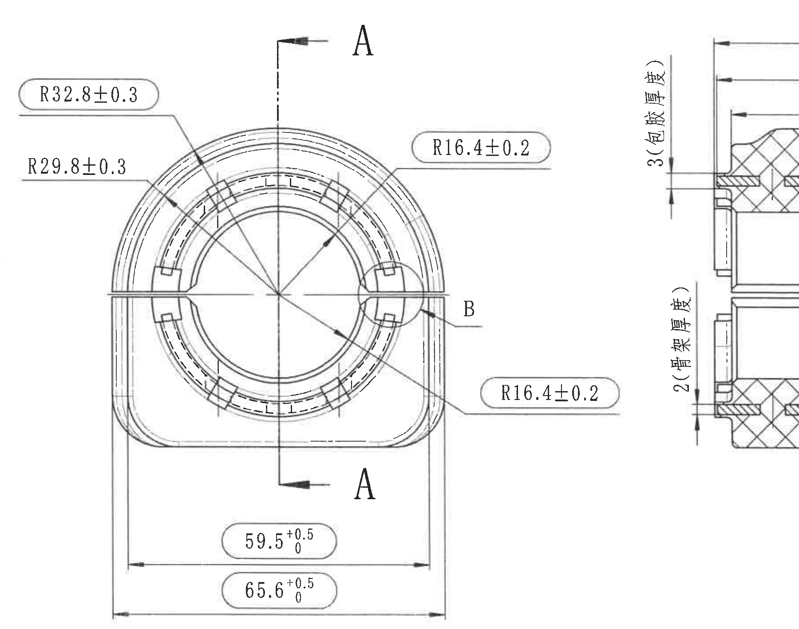

原图位置/视图名称：页面左中部主视图，含 A-A 剖切指示与 B 局部视图索引，bbox `[500, 850, 2300, 2270]`。

| 提取项 | 原图数值或文本 | 含义说明 |
|---|---|---|
| 半径尺寸 | R32.8±0.3 | 上部外圆弧半径尺寸，公差 ±0.3。R 表示半径。 |
| 半径尺寸 | R29.8±0.3 | 内侧/相邻圆弧半径尺寸，公差 ±0.3。R 表示半径。 |
| 半径尺寸 | R16.4±0.2 | 右上局部圆弧半径，公差 ±0.2。 |
| 半径尺寸 | R16.4±0.2 | 右下局部圆弧半径，公差 ±0.2。 |
| 总宽/横向尺寸 | 59.5 +0.5/0 | 内侧横向宽度尺寸，下偏差 0，上偏差 +0.5。 |
| 总宽/横向尺寸 | 65.6 +0.5/0 | 外侧横向总宽尺寸，下偏差 0，上偏差 +0.5。 |
| 剖切标识 | A-A | 垂直剖切方向，箭头上下各一处；对应 object_2。 |
| 局部视图索引 | B | 指向右侧局部结构；对应 object_3。 |
| 弧向/半径说明 | R32.8、R29.8、R16.4 | 原图给出半径尺寸，未见单独弧长尺寸。 |
| 胶囊框尺寸属性 | R32.8±0.3、R16.4±0.2、59.5 +0.5/0、65.6 +0.5/0 等 | 结合技术要求第 10 条，胶囊框标注为出厂检验尺寸。 |
| 参考尺寸 | 未见括号参考尺寸 | 主视图未见括号内参考尺寸。 |
| 关键尺寸/直径/T 编号 | 未见星号、Φ、T 编号 | 主视图未见星号关键尺寸、直径符号或 T 编号。 |

边界归属说明：主视图右侧紧邻 A-A 剖面图。为完整保留主视图右侧 R16.4 标注、B 引出线和底部 59.5/65.6 尺寸线，矩形裁切边界处可见少量 A-A 剖面邻近片段；这些片段不归入主视图提取，剖面尺寸只在 object_2 中提取。

## object_2：A-A 剖面视图

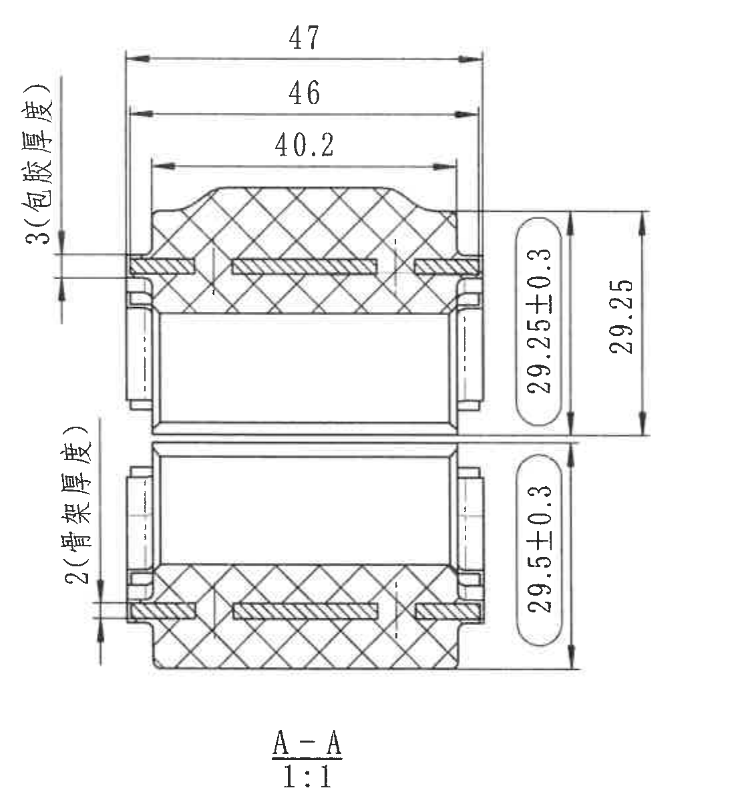

原图位置/视图名称：页面中部 A-A 剖面视图，比例 1:1，bbox `[1920, 860, 3040, 2040]`。

| 提取项 | 原图数值或文本 | 含义说明 |
|---|---|---|
| 剖面标识 | A-A | 对应主视图中的 A-A 剖切方向。 |
| 比例 | 1:1 | 剖面按实物比例绘制。 |
| 横向尺寸 | 47 | 剖面上方最大横向宽度尺寸，图中未单独标注公差。 |
| 横向尺寸 | 46 | 剖面上方第二级横向宽度尺寸，图中未单独标注公差。 |
| 横向尺寸 | 40.2 | 剖面上方内部横向宽度尺寸，图中未单独标注公差。 |
| 厚度说明 | 3(包胶厚度) | 左侧上部竖向厚度尺寸，标注为包胶厚度。 |
| 厚度说明 | 2(骨架厚度) | 左侧下部竖向厚度尺寸，标注为骨架厚度。 |
| 竖向尺寸 | 29.25 | 右侧上部竖向总高度/分段高度，图中未单独给出公差。 |
| 胶囊框竖向尺寸 | 29.25±0.3 | 右侧上部出厂检验尺寸，公差 ±0.3。 |
| 胶囊框竖向尺寸 | 29.5±0.3 | 右侧下部出厂检验尺寸，公差 ±0.3。 |
| 参考尺寸 | 未见括号参考尺寸 | 本剖面未见括号内参考尺寸；括号内文字为厚度属性说明。 |
| 关键尺寸/直径/T 编号 | 未见星号、Φ、T 编号 | 本剖面未见星号关键尺寸、直径符号或 T 编号。 |

边界归属说明：本裁切完整包含剖面视图、左侧 3/2 厚度标注、右侧 29.25/29.25±0.3/29.5±0.3 竖向尺寸线和底部 A-A 1:1 标识。左侧厚度标注虽然靠近主视图，但其尺寸线和箭头连接剖面结构，归属 A-A 剖面。

## object_9：技术要求 NOTES

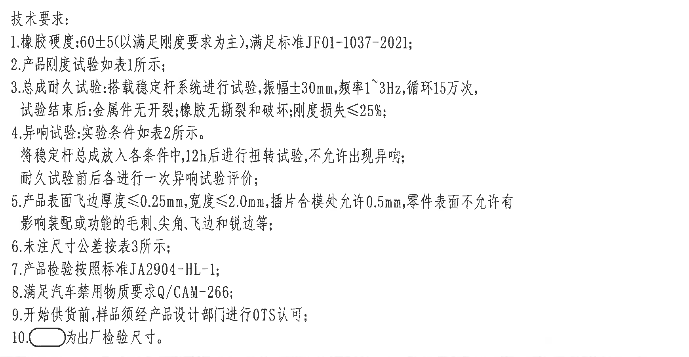

原图位置/视图名称：页面右中部技术要求文字区，bbox `[3020, 1550, 4760, 2450]`。

| 提取项 | 原图数值或文本 | 含义说明 |
|---|---|---|
| 标题 | 技术要求: | 技术要求列表标题。 |
| 1 | 橡胶硬度:60±5(以满足刚度要求为主),满足标准JF01-1037-2021; | 橡胶硬度要求及执行标准。括号内为硬度控制参考说明：以满足刚度要求为主。 |
| 2 | 产品刚度试验如表1所示; | 刚度试验引用 object_5 的表1。 |
| 3 | 总成耐久试验:搭载稳定杆系统进行试验,振幅±30mm,频率1~3Hz,循环15万次,试验结束后:金属件无开裂;橡胶无撕裂和破坏;刚度损失≤25%; | 耐久试验条件与判定要求。 |
| 4 | 异响试验:实验条件如表2所示。将稳定杆总成放入各条件中,12h后进行扭转试验,不允许出现异响;耐久试验前后各进行一次异响试验评价; | 异响试验引用 object_5 的表2，规定 12h 后扭转和耐久前后评价。 |
| 5 | 产品表面飞边厚度≤0.25mm,宽度≤2.0mm,插片合模处允许0.5mm,零件表面不允许有影响装配或功能的毛刺、尖角、飞边和锐边等; | 表面飞边、毛刺、尖角、锐边限制。 |
| 6 | 未注尺寸公差按表3所示; | 未注尺寸公差引用原图文字“表3”。左下角公差表标题为“表4.公差标准”，此处按原图转录。 |
| 7 | 产品检验按照标准JA2904-HL-1; | 产品检验标准。 |
| 8 | 满足汽车禁用物质要求Q/CAM-266; | 禁用物质要求。 |
| 9 | 开始供货前,样品须经产品设计部门进行OTS认可; | OTS 认可要求。 |
| 10 | 胶囊框符号为出厂检验尺寸。 | 图中长圆胶囊框内尺寸为出厂检验尺寸。 |

边界归属说明：裁切完整包含第 1-10 条技术要求，未包含下方明细表或标题栏。第 10 条的胶囊框符号解释适用于各视图中被胶囊框包围的尺寸。

## object_4：等轴测/标识要求视图

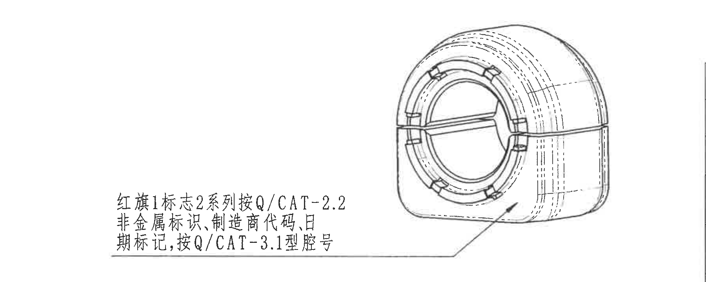

原图位置/视图名称：页面下中部等轴测视图和标识引出说明，bbox `[1000, 2300, 2800, 3020]`。

| 提取项 | 原图数值或文本 | 含义说明 |
|---|---|---|
| 等轴测视图 | 零件外形三维示意 | 展示衬套装配外观与标识位置。 |
| 标识说明第 1 行 | 红旗1标志2系列按Q/CAT-2.2 | 标志/系列标识按 Q/CAT-2.2 执行。 |
| 标识说明第 2 行 | 非金属标识,制造商代码,日期标记,按Q/CAT-3.1型腔号 | 非金属标识、制造商代码、日期标记和型腔号要求。 |
| 引出线 | 从文字指向等轴测下部表面 | 说明文字对应零件下部外表面标识区域。 |
| 尺寸 | 未见尺寸标注 | 本视图没有数值尺寸、半径、角度或弧长尺寸。 |
| 参考尺寸/关键尺寸/直径/T 编号 | 未见 | 未见括号参考尺寸、星号关键尺寸、Φ 或 T 编号。 |

边界归属说明：裁切只包含等轴测图和其左侧标识说明，引出线完整；未包含标题栏、明细表或主视图尺寸。

## object_7：表4 公差标准

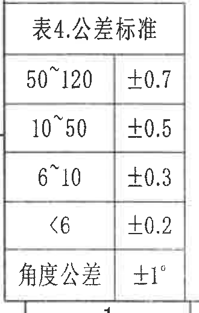

原图位置/视图名称：页面左下角公差表，bbox `[400, 2840, 730, 3360]`。

原表还原：

| 尺寸范围/项目 | 公差 |
|---|---|
| 50~120 | ±0.7 |
| 10~50 | ±0.5 |
| 6~10 | ±0.3 |
| <6 | ±0.2 |
| 角度公差 | ±1° |

| 提取项 | 原图数值或文本 | 含义说明 |
|---|---|---|
| 表标题 | 表4.公差标准 | 未注尺寸公差表。 |
| 线性尺寸范围 | 50~120, 10~50, 6~10, <6 | 对应不同尺寸范围的默认公差。 |
| 角度公差 | ±1° | 未注角度默认公差。 |

边界归属说明：裁切包含完整公差表外框、标题和五行内容。下方图框坐标线不作为表格内容提取。

## object_8：零件明细表

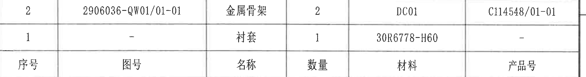

原图位置/视图名称：页面右下标题栏上方零件明细表，bbox `[2805, 2470, 4830, 2740]`。

原表还原：

| 序号 | 图号 | 名称 | 数量 | 材料 | 产品号 |
|---|---|---|---|---|---|
| 2 | 2906036-QW01/01-01 | 金属骨架 | 2 | DC01 | C114548/01-01 |
| 1 | - | 衬套 | 1 | 30R6778-H60 | - |

| 提取项 | 原图数值或文本 | 含义说明 |
|---|---|---|
| 明细行 2 | 图号 2906036-QW01/01-01, 名称 金属骨架, 数量 2, 材料 DC01, 产品号 C114548/01-01 | 金属骨架零件信息。 |
| 明细行 1 | 图号 -, 名称 衬套, 数量 1, 材料 30R6778-H60, 产品号 - | 衬套材料信息。 |

边界归属说明：原图中表头位于本裁切下部，数据行位于表头上方。裁切下边界收至明细表外框，未包含下方标题栏字段。

## object_10：标题栏

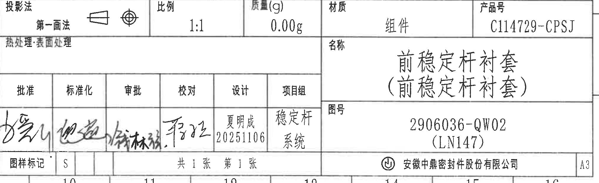

原图位置/视图名称：页面右下角标题栏，bbox `[2805, 2750, 4830, 3370]`。

| 提取项 | 原图数值或文本 | 含义说明 |
|---|---|---|
| 投影法 | 第一画法 | 第一角投影法，原图含投影符号。 |
| 比例 | 1:1 | 图纸比例。 |
| 质量(g) | 0.00g | 标题栏质量字段。 |
| 材质 | 组件 | 材质/属性字段。 |
| 产品号 | C114729-CPSJ | 产品编号。 |
| 热处理/表面处理 | 热处理:表面处理 | 原图该栏未见额外填写值。 |
| 名称 | 前稳定杆衬套(前稳定杆衬套) | 零件/组件名称；括号内为原图名称重复标注。 |
| 图号 | 2906036-QW02(LN147) | 图纸编号；括号内 LN147 为参考/平台标识。 |
| 批准 | 手写签名 | 原图为手写签名，无法稳定转录为印刷文字。 |
| 标准化 | 手写签名 | 原图为手写签名。 |
| 审批 | 手写签名 | 原图为手写签名。 |
| 校对 | 手写签名 | 原图为手写签名。 |
| 设计 | 夏明成 20251106 | 设计者与日期。 |
| 项目组 | 稳定杆系统 | 项目组信息，原图分两行“稳定杆 / 系统”。 |
| 图样标记 | S | 图样标记字段。 |
| 页数 | 共1张 第1张 | 总张数与当前张号。 |
| 公司 | 安徽中鼎密封件股份有限公司 | 标题栏公司名称。 |
| 图幅 | A3 | 图纸幅面。 |

边界归属说明：裁切完整包含标题栏，不包含上方零件明细表数据。标题栏内括号“(LN147)”按原图作为图号参考/平台标识记录。

## 裁切检查记录

| 图片 | 对象 | 检查结果 |
|---|---|---|
| page_1.png | 整页 PNG | 整页图完整，尺寸 4959 x 3505 px。 |
| object_1.png | 主视图 | 主视图尺寸线和文字完整；右侧边界为保留完整 R16.4 标注和 B 引出线可见少量邻近 A-A 剖面片段，剖面尺寸不归入主视图。 |
| object_2.png | A-A 剖面 | 横向、竖向、厚度尺寸线及 A-A 1:1 标识完整。 |
| object_3.png | B 局部视图 | B 2:1、3.4 +0.5/0、3.41 +0.5/0、1 的尺寸线和文字完整。 |
| object_4.png | 等轴测/标识视图 | 等轴测图、标识说明和引出线完整，未包含标题栏。 |
| object_5.png | 表1/表2 实验要求表 | 表格外框、表头和四行数据完整。 |
| object_6.png | 变更履历表 | 表头、有效变更行和空白记录行完整；图框坐标字母未作为表格字段提取。 |
| object_7.png | 表4 公差标准 | 表格标题、五行公差内容和外框完整。 |
| object_8.png | 零件明细表 | 两行明细数据、表头和外框完整；未带入下方标题栏字段。 |
| object_9.png | 技术要求 NOTES | 第 1-10 条技术要求完整，无边缘文字截断。 |
| object_10.png | 标题栏 | 标题栏字段、名称、图号、产品号、日期、公司和图幅完整。 |
