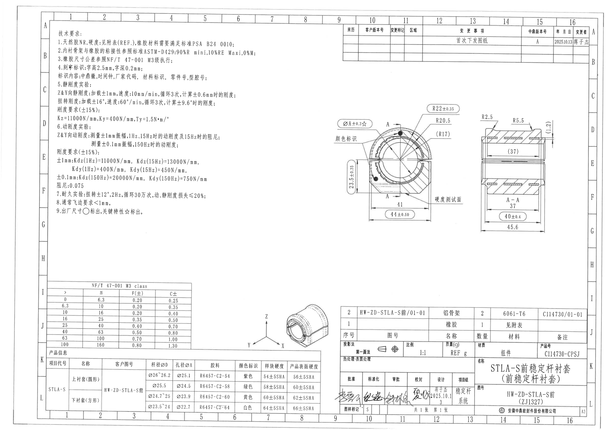
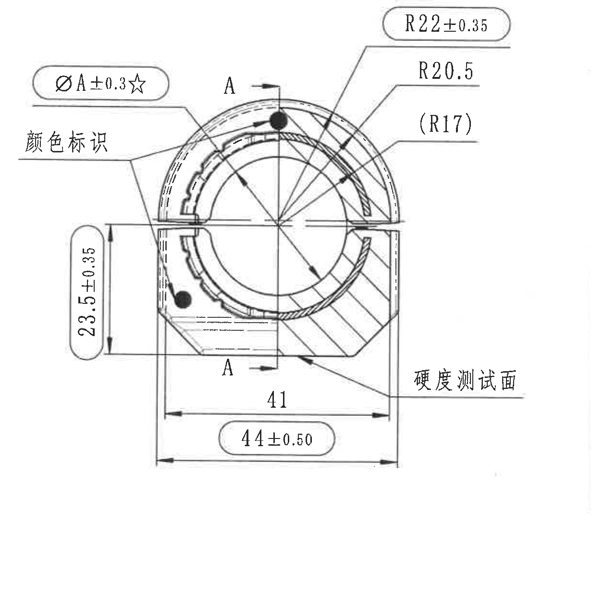
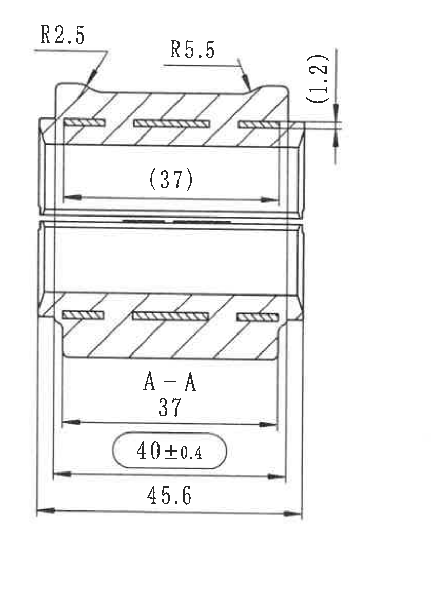
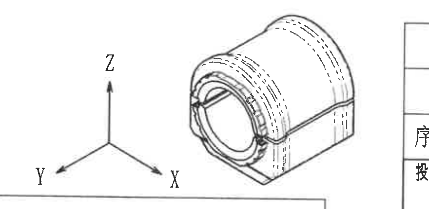
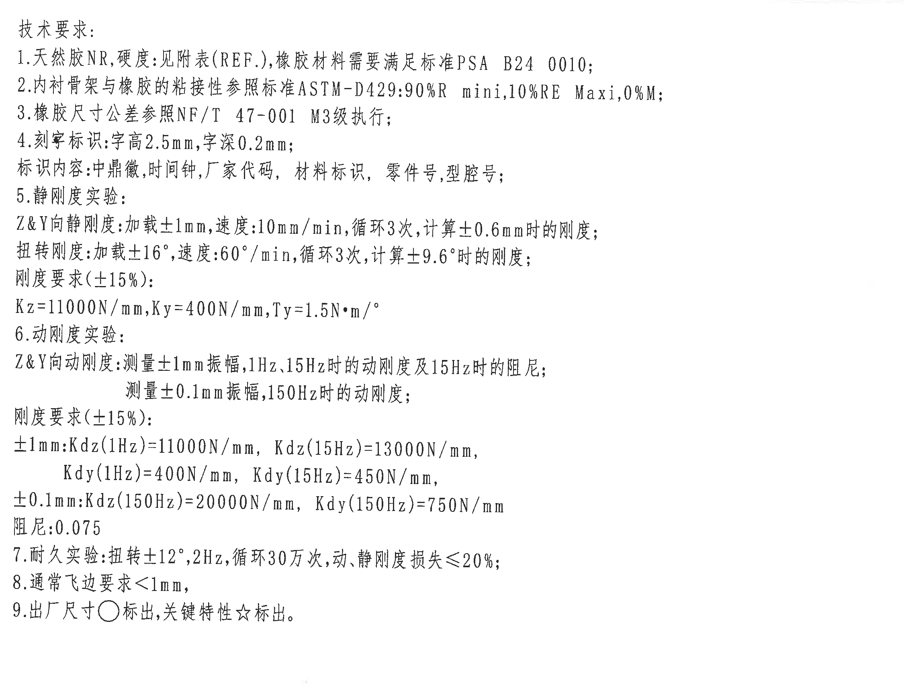
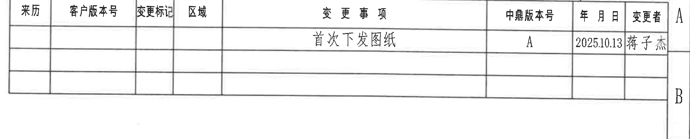
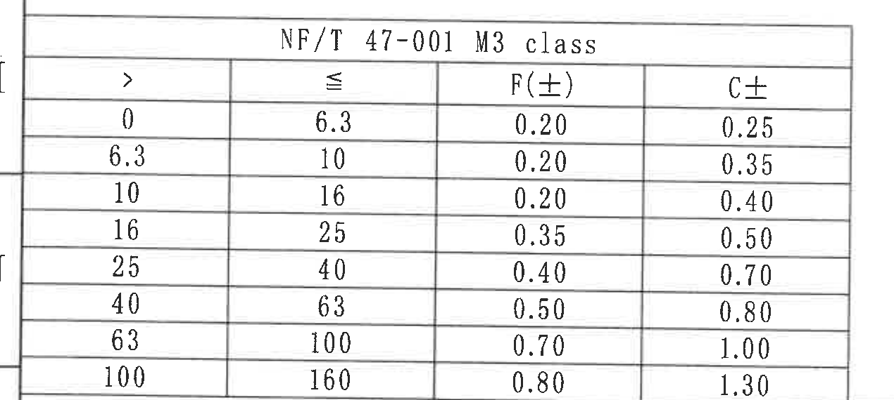
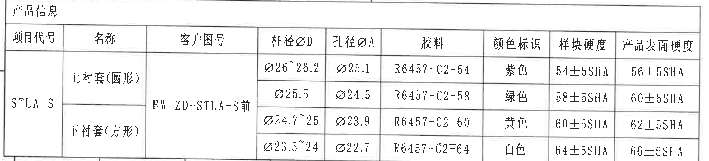
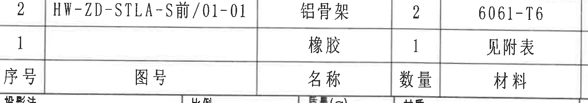
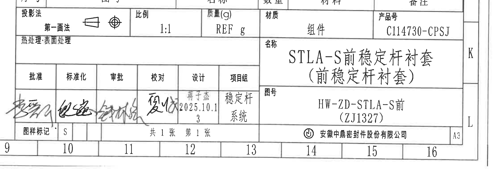

# 20C114730 内容识别提取

## 整页渲染

| 项目 | 原图数值或文本 | 含义说明 |
|---|---|---|
| PDF 页数 | 1 | 单页工程图。 |
| 整页 PNG | outputs/20C114730_assets/images/page_1.png | 由 `input/20C114730.pdf` 渲染得到。 |
| 整页尺寸 | 4959 x 3505 px | 300 dpi 渲染结果。 |

## object_1 - 主加工视图

**原图位置/视图名称**：第 1 页中右部，主加工视图，bbox `[2680, 835, 3910, 2085]`。

| 提取项 | 原图数值或文本 | 含义说明 |
|---|---|---|
| 关键直径尺寸 | `ØA±0.3☆` | A 孔径/直径尺寸，公差 ±0.3；星号表示关键特性，按技术要求第 9 条“关键特性☆标出”理解。 |
| 颜色标识 | `颜色标识` | 引线指向视图左上部槽/标识区域，表示该位置设置颜色识别标记。 |
| 剖切基准/剖面线 | `A`、`A` | A-A 剖切位置标识，剖切线穿过主视图中心竖向位置，对应 object_2 的 A-A 剖视图。 |
| 外弧半径 | `R22±0.35` | 主视图顶部外圆弧半径，带 ±0.35 公差。 |
| 内/中间弧半径 | `R20.5` | 主视图上部弧向结构半径。 |
| 参考弧半径 | `(R17)` | 括号内为参考尺寸，表示内侧弧半径参考值，不作为直接制造控制尺寸，但必须用于读图理解。 |
| 竖向尺寸 | `23.5±0.35` | 左侧竖向高度/槽位相关尺寸，带 ±0.35 公差。 |
| 下部水平尺寸 | `41` | 主视图下部内侧水平距离，未给显式公差，按图纸一般公差表/标准理解。 |
| 总宽关键尺寸 | `44±0.50` | 主视图底部外侧水平总宽尺寸，带 ±0.50 公差，标注在圆角框内。 |
| 硬度测试区域 | `硬度测试面` | 引线指向右下斜线填充面，表示该表面为硬度测试面。 |
| 出厂尺寸标识关联 | 圆圈/星号规则 | 视图中 `ØA±0.3☆` 的星号与技术要求第 9 条关联，说明是关键特性标注。 |

**边界归属说明**：本裁切包含主视图完整尺寸线、箭头和文字。右侧接近 A-A 剖视图，但未提取剖视图的 `R2.5`、`R5.5`、`(1.2)`、`37`、`40±0.4`、`45.6` 等尺寸；这些归入 object_2。`硬度测试面` 引线从主视图右下引出，归属 object_1。

## object_2 - A-A 剖视图

**原图位置/视图名称**：第 1 页右侧，A-A 剖视图，bbox `[3845, 885, 4695, 2035]`。

| 提取项 | 原图数值或文本 | 含义说明 |
|---|---|---|
| 左上圆角半径 | `R2.5` | 剖视图左上外形圆角/倒圆半径。 |
| 右上圆角半径 | `R5.5` | 剖视图右上外形圆角/倒圆半径。 |
| 参考壁厚/局部厚度 | `(1.2)` | 右侧竖向括号参考尺寸，表示局部厚度/间隙参考值。括号说明其为参考尺寸。 |
| 内腔参考长度 | `(37)` | 上半部内腔水平参考长度，括号内为参考尺寸。 |
| 剖面名称 | `A-A` | 表示该剖视图由 object_1 的 A-A 剖切位置生成。 |
| 剖面内侧长度 | `37` | 剖视图下半部内侧水平尺寸。 |
| 中间外宽尺寸 | `40±0.4` | 中部外宽/台阶距离，公差 ±0.4，标注在圆角框内。 |
| 总宽尺寸 | `45.6` | 剖视图底部最大外宽/总宽。 |
| 剖面填充 | 斜线剖面线 | 表示剖切到的材料实体区域。 |

**边界归属说明**：本裁切完整包含剖视图的上下端尺寸线、箭头和半径引线。左侧与主视图相邻，但主视图的 `R22±0.35`、`R20.5`、`(R17)`、`44±0.50` 等不归入本对象。

## object_3 - 三维参考视图

**原图位置/视图名称**：第 1 页下部偏中，三维参考视图，bbox `[1945, 2450, 2825, 2880]`。

| 提取项 | 原图数值或文本 | 含义说明 |
|---|---|---|
| 坐标轴 | `X`、`Y`、`Z` | 三维方向参考坐标，说明零件空间方位。 |
| 三维外形 | 半圆筒状衬套组件 | 显示零件整体形态、端部开口、槽形/凸台和底部支承结构。 |
| 尺寸标注 | 无独立尺寸文字 | 该视图为形状与方向参考，不含独立尺寸、公差或半径标注。 |

**边界归属说明**：裁切完整包含三维视图和 X/Y/Z 坐标轴。右侧露出相邻明细表边框和少量文字边缘，下方露出产品信息表上边线；这些仅为邻近边界，不提取为三维视图内容。

## object_4 - NOTES / 技术要求

**原图位置/视图名称**：第 1 页左上，技术要求/NOTES，bbox `[430, 200, 2680, 1920]`。

| 提取项 | 原图数值或文本 | 含义说明 |
|---|---|---|
| 标题 | `技术要求:` | 技术要求文本区标题。 |
| 1 | `天然胶NR,硬度:见附表(REF.),橡胶材料需要满足标准PSA B24 0010;` | 材料为天然胶 NR；硬度见附表，`REF.` 表示参考；橡胶材料需满足 PSA B24 0010。 |
| 2 | `内衬骨架与橡胶的粘接性参照标准ASTM-D429:90%R mini,10%RE Maxi,0%M;` | 内衬骨架与橡胶粘接性按 ASTM-D429；90%R 最小、10%RE 最大、0%M。 |
| 3 | `橡胶尺寸公差参照NF/T 47-001 M3级执行;` | 橡胶尺寸公差按 NF/T 47-001 M3 级。 |
| 4 | `刻字标识:字高2.5mm,字深0.2mm;` | 刻字标识的字高和字深要求。 |
| 4-标识内容 | `标识内容:中鼎徽,时间钟,厂家代码,材料标识,零件号,型腔号;` | 刻字/标识需包含的内容。 |
| 5 | `静刚度实验:` | 静刚度试验要求标题。 |
| 5-Z&Y 向静刚度 | `加载±1mm,速度:10mm/min,循环3次,计算±0.6mm时的刚度;` | Z/Y 向静刚度加载、速度、循环次数及计算位移。 |
| 5-扭转刚度 | `加载±16°,速度:60°/min,循环3次,计算±9.6°时的刚度;` | 扭转静刚度加载角度、速度、循环次数及计算角度。 |
| 5-刚度要求 | `刚度要求(±15%): Kz=11000N/mm, Ky=400N/mm, Ty=1.5N·m/°` | 静刚度目标值和允许偏差。 |
| 6 | `动刚度实验:` | 动刚度试验要求标题。 |
| 6-Z&Y 向动刚度 | `测量±1mm振幅,1Hz,15Hz时的动刚度及15Hz时的阻尼; 测量±0.1mm振幅,150Hz时的动刚度;` | 动刚度测量振幅、频率和阻尼要求。 |
| 6-刚度要求 | `刚度要求(±15%): ±1mm:Kdz(1Hz)=11000N/mm, Kdz(15Hz)=13000N/mm, Kdy(1Hz)=400N/mm, Kdy(15Hz)=450N/mm; ±0.1mm:Kdz(150Hz)=20000N/mm, Kdy(150Hz)=750N/mm; 阻尼:0.075` | 动刚度目标值、频率点和阻尼值。 |
| 7 | `耐久实验:扭转±12°,2Hz,循环30万次,动、静刚度损失≤20%;` | 耐久试验为扭转 ±12°、2Hz、30 万次，刚度损失上限 20%。 |
| 8 | `通常飞边要求<1mm,` | 飞边高度要求小于 1 mm。 |
| 9 | `出厂尺寸○标出,关键特性☆标出.` | 圆圈标出出厂尺寸，星号标出关键特性。 |

**边界归属说明**：裁切只提取技术要求正文。右侧与主视图相邻，未将主视图尺寸或引线归入 NOTES。第 1 条中的 `(REF.)` 为参考含义，不是视图尺寸。

## object_5 - 修订履历表

**原图位置/视图名称**：第 1 页右上，修订履历表，bbox `[2765, 210, 4865, 635]`。

| 来历 | 客户版本号 | 变更标记 | 区域 | 变更事项 | 中鼎版本号 | 年月日 | 变更者 |
|---|---|---|---|---|---|---|---|
|  |  |  |  | 首次下发图纸 | A | 2025.10.13 | 蒋子杰 |
|  |  |  |  |  |  |  |  |
|  |  |  |  |  |  |  |  |

| 提取项 | 原图数值或文本 | 含义说明 |
|---|---|---|
| 表格类型 | 修订履历表 | 记录版本、变更事项、日期和变更者。 |
| 当前记录 | `首次下发图纸 / A / 2025.10.13 / 蒋子杰` | 图纸首次下发，版本为 A。 |

**边界归属说明**：裁切完整包含修订履历表外框和三行记录区域。右侧图框坐标字母 `A`、`B` 贴近裁切边缘，不作为修订表字段。

## object_6 - NF/T 47-001 M3 class 公差表

**原图位置/视图名称**：第 1 页左下，NF/T 47-001 M3 class 公差表，bbox `[350, 2270, 1620, 2840]`。

| > | ≤ | F(±) | C± |
|---|---|---|---|
| 0 | 6.3 | 0.20 | 0.25 |
| 6.3 | 10 | 0.20 | 0.35 |
| 10 | 16 | 0.20 | 0.40 |
| 16 | 25 | 0.35 | 0.50 |
| 25 | 40 | 0.40 | 0.70 |
| 40 | 63 | 0.50 | 0.80 |
| 63 | 100 | 0.70 | 1.00 |
| 100 | 160 | 0.80 | 1.30 |

| 提取项 | 原图数值或文本 | 含义说明 |
|---|---|---|
| 表题 | `NF/T 47-001 M3 class` | 橡胶尺寸公差表，与技术要求第 3 条对应。 |
| `F(±)` | `0.20` 至 `0.80` | F 类正负公差列。 |
| `C±` | `0.25` 至 `1.30` | C 类正负公差列。 |

**边界归属说明**：裁切包含完整表题、表头、8 行公差数据和外框。下方产品信息表标题未作为本表内容提取。

## object_7 - 产品信息表

**原图位置/视图名称**：第 1 页左下，产品信息表，bbox `[360, 2840, 2640, 3360]`。

| 项目代号 | 名称 | 客户图号 | 杆径ØD | 孔径ØA | 胶料 | 颜色标识 | 样块硬度 | 产品表面硬度 |
|---|---|---|---|---|---|---|---|---|
| STLA-S | 上衬套(圆形) | HW-ZD-STLA-S前 | Ø26~26.2 | Ø25.1 | R6457-C2-54 | 紫色 | 54±5SHA | 56±5SHA |
| STLA-S | 上衬套(圆形) | HW-ZD-STLA-S前 | Ø25.5 | Ø24.5 | R6457-C2-58 | 绿色 | 58±5SHA | 60±5SHA |
| STLA-S | 下衬套(方形) | HW-ZD-STLA-S前 | Ø24.7~25 | Ø23.9 | R6457-C2-60 | 黄色 | 60±5SHA | 62±5SHA |
| STLA-S | 下衬套(方形) | HW-ZD-STLA-S前 | Ø23.5~24 | Ø22.7 | R6457-C2-64 | 白色 | 64±5SHA | 66±5SHA |

| 提取项 | 原图数值或文本 | 含义说明 |
|---|---|---|
| 表题 | `产品信息` | 零件不同胶料/颜色/硬度组合对应表。 |
| 杆径范围 | `Ø26~26.2`、`Ø25.5`、`Ø24.7~25`、`Ø23.5~24` | 杆径 D 的直径或直径范围。 |
| 孔径 | `Ø25.1`、`Ø24.5`、`Ø23.9`、`Ø22.7` | 孔径 A 的直径值。 |
| 胶料 | `R6457-C2-54`、`R6457-C2-58`、`R6457-C2-60`、`R6457-C2-64` | 胶料牌号与硬度等级关联。 |
| 颜色标识 | `紫色`、`绿色`、`黄色`、`白色` | 与主视图 `颜色标识` 位置对应。 |
| 样块硬度 | `54±5SHA`、`58±5SHA`、`60±5SHA`、`64±5SHA` | 样块硬度范围。 |
| 产品表面硬度 | `56±5SHA`、`60±5SHA`、`62±5SHA`、`66±5SHA` | 产品表面硬度范围。 |

**边界归属说明**：裁切包含产品信息表标题、表头和 4 行数据。下方图框坐标编号未进入裁切内容。

## object_8 - 明细表 / BOM

**原图位置/视图名称**：第 1 页右下上部，明细表/BOM，bbox `[2785, 2520, 4400, 2805]`。

| 序号 | 图号 | 名称 | 数量 | 材料 | 备注 |
|---|---|---|---|---|---|
| 2 | HW-ZD-STLA-S前/01-01 | 铝骨架 | 2 | 6061-T6 | C114730/01-01 |
| 1 |  | 橡胶 | 1 | 见附表 |  |

| 提取项 | 原图数值或文本 | 含义说明 |
|---|---|---|
| 表格类型 | 明细表 / BOM | 记录组件序号、图号、名称、数量、材料和备注。 |
| 序号 2 | `HW-ZD-STLA-S前/01-01 / 铝骨架 / 2 / 6061-T6 / C114730/01-01` | 铝骨架件，数量 2，材料 6061-T6。 |
| 序号 1 | `橡胶 / 1 / 见附表` | 橡胶件，数量 1，材料见附表。 |

**边界归属说明**：裁切包含 BOM 的数据行和表头。下边界与标题栏投影法区域相邻，裁切底部可见下一栏顶线/少量边缘，但投影法、比例、质量、材质、产品号等归入 object_9，不在本对象提取。

## object_9 - 标题栏

**原图位置/视图名称**：第 1 页右下，标题栏，bbox `[2700, 2745, 4959, 3505]`。

| 提取项 | 原图数值或文本 | 含义说明 |
|---|---|---|
| 投影法 | `第一画法` | 投影法字段，旁有投影符号。 |
| 比例 | `1:1` | 图纸比例。 |
| 质量 | `REF g` | 质量为参考值，单位 g；`REF` 表示参考。 |
| 材质 | `组件` | 标题栏材质字段，表示组件。 |
| 产品号 | `C114730-CPSJ` | 产品号。 |
| 热处理/表面处理 | `热处理:表面处理` | 处理字段标题，未见具体处理值。 |
| 名称 | `STLA-S前稳定杆衬套 (前稳定杆衬套)` | 图纸/零件名称。 |
| 图号 | `HW-ZD-STLA-S前 (ZJ1327)` | 图纸编号。 |
| 批准 | 签名 | 批准栏手写签名。 |
| 标准化 | 签名 | 标准化栏手写签名。 |
| 审批 | 签名 | 审批栏手写签名。 |
| 校对 | 签名 | 校对栏手写签名。 |
| 设计 | `蒋子杰 / 2025.10.13` | 设计者和日期。 |
| 项目组 | `稳定杆系统` | 项目组名称。 |
| 图样标记 | `S` | 图样标记字段。 |
| 页数 | `共1张 第1张` | 共 1 张，第 1 张。 |
| 公司 | `安徽中鼎密封件股份有限公司` | 出图公司名称。 |
| 图幅 | `A3` | 图幅规格。 |

**边界归属说明**：裁切包含标题栏主体、签署区、名称/图号/公司/A3 等字段。顶部与 BOM 表下沿相邻，可见少量明细表边界；BOM 行数据不在标题栏中重复提取。右侧图框字母 `K`、`L` 及底部图框数字为图框坐标，不作为标题栏业务字段。

## 裁切检查记录

| 对象 | 图片路径 | 检查结果 | 处理记录 |
|---|---|---|---|
| page_1 | outputs/20C114730_assets/images/page_1.png | 完整 | 整页 PNG，尺寸 4959 x 3505 px。 |
| object_1 | outputs/20C114730_assets/images/object_1.png | 完整 | 已重裁，完整包含 `ØA±0.3☆`、`R22±0.35`、`R20.5`、`(R17)`、`23.5±0.35`、`41`、`44±0.50` 和 `硬度测试面`；右侧剖视图尺寸未提取到本对象。 |
| object_2 | outputs/20C114730_assets/images/object_2.png | 完整 | 已重裁，完整包含 `R2.5`、`R5.5`、`(1.2)`、`(37)`、`A-A`、`37`、`40±0.4`、`45.6`。 |
| object_3 | outputs/20C114730_assets/images/object_3.png | 完整 | 已重裁，完整包含三维零件和 X/Y/Z 坐标轴；右侧邻表边框不作为内容。 |
| object_4 | outputs/20C114730_assets/images/object_4.png | 完整 | 已收窄右边界，完整包含技术要求 1-9 条；未提取主视图尺寸。 |
| object_5 | outputs/20C114730_assets/images/object_5.png | 完整 | 已重裁，完整包含修订履历表表头和记录；右侧图框 A/B 不作为表格字段。 |
| object_6 | outputs/20C114730_assets/images/object_6.png | 完整 | 已重裁，完整包含 NF/T 47-001 M3 class 表题、表头和 8 行数据。 |
| object_7 | outputs/20C114730_assets/images/object_7.png | 完整 | 已重裁，完整包含产品信息表标题、表头和 4 行数据。 |
| object_8 | outputs/20C114730_assets/images/object_8.png | 完整 | 已收紧底部，完整包含 BOM 表头和 2 行数据；底部相邻标题栏不提取。 |
| object_9 | outputs/20C114730_assets/images/object_9.png | 完整 | 已重裁，完整包含标题栏和签署区；图框坐标不作为业务字段。 |
