# 20C114747 PDF 内容识别与裁切提取

源文件：`input/20C114747.pdf`  
整页渲染图：`outputs/20C114747_assets/images/page_1.png`  
整页像素尺寸：4959 x 3505

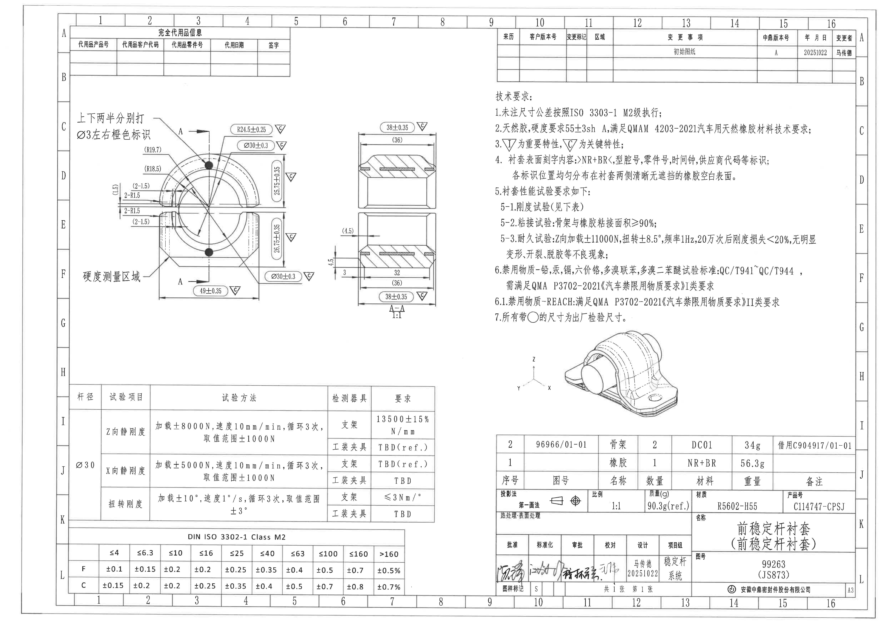

## object_1：主加工视图

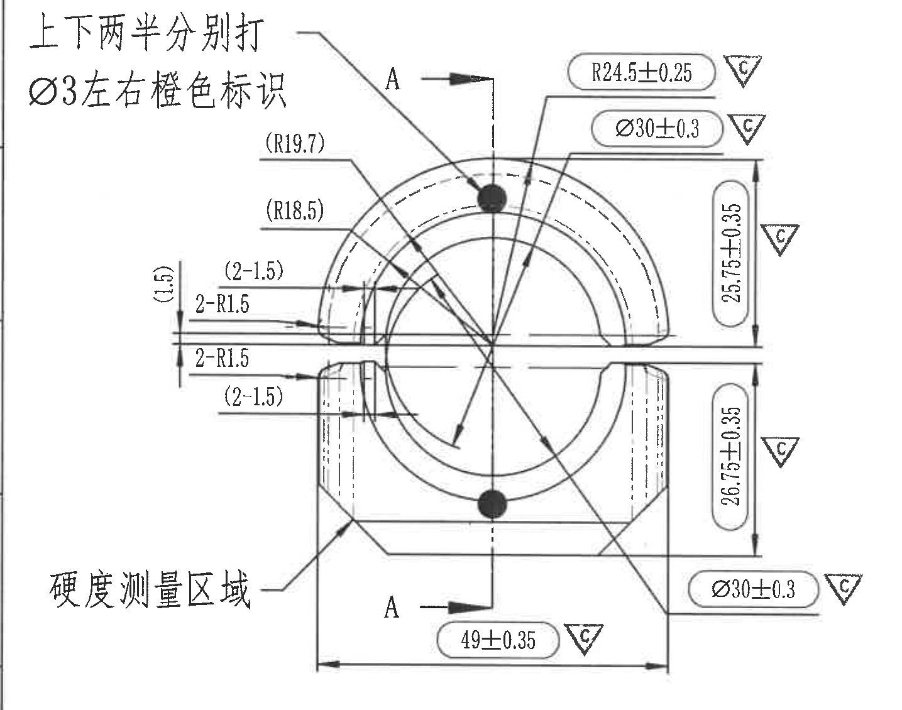

原图位置/视图名称：第 1 页左中区域，主加工视图，bbox `[385, 610, 1820, 1740]`。

| 提取项 | 原图数值或文本 | 含义说明 |
|---|---|---|
| 标识说明 | 上下两半分别打；Ø3左右橙色标识 | 上、下两半分别施加标识；Ø3 为左右橙色标识的直径要求。 |
| 硬度测量区域 | 硬度测量区域 | 箭头指向下半部左下区域，为硬度测量位置。 |
| 剖切标识 | A、A | 两个 A 和箭头表示 A-A 剖切位置，剖视结果见 object_2。 |
| 半径 | R24.5±0.25，△C | 上方圆弧外形半径，带公差 ±0.25，△C 表示关键特性。 |
| 直径 | Ø30±0.3，△C（上方标注） | 圆孔/衬套内径相关尺寸，带公差 ±0.3，关键特性。 |
| 垂直尺寸 | 25.75±0.35，△C | 从中间分模/中心线到上侧外形的垂直尺寸，关键特性。 |
| 垂直尺寸 | 26.75±0.35，△C | 从中间分模/中心线到下侧外形的垂直尺寸，关键特性。 |
| 直径 | Ø30±0.3，△C（右下标注） | 下半部对应圆孔/衬套内径相关尺寸，带公差 ±0.3，关键特性。 |
| 底部宽度 | 49±0.35，△C | 底部两端外侧之间的总宽度尺寸，关键特性。 |
| 参考半径 | (R19.7) | 括号内为参考半径，用于说明上部相关圆弧位置，不作为直接制造控制尺寸。 |
| 参考半径 | (R18.5) | 括号内为参考半径，用于说明内侧圆弧位置，不作为直接制造控制尺寸。 |
| 参考尺寸 | (1.5) | 左侧竖向括号参考尺寸，说明中部台阶/间隙位置关系。 |
| 数量前缀参考尺寸 | (2-1.5)（上侧） | 括号内参考尺寸，表示上侧 2 处 1.5 的位置/间隙说明。 |
| 数量前缀半径 | 2-R1.5（上侧） | 上侧 2 处 R1.5 圆角半径。 |
| 数量前缀半径 | 2-R1.5（下侧） | 下侧 2 处 R1.5 圆角半径。 |
| 数量前缀参考尺寸 | (2-1.5)（下侧） | 括号内参考尺寸，表示下侧 2 处 1.5 的位置/间隙说明。 |
| 总高度 | 未标注单一总高度 | 原图未给出单一总高度；只给出上段 25.75±0.35 和下段 26.75±0.35。 |
| 星号关键尺寸 | 未见星号尺寸 | 当前视图未出现带星号的尺寸。 |
| T 编号 | 未见 T 编号 | 当前视图未出现 T 编号。 |
| 弧向尺寸/角度 | 未见弧向尺寸和角度标注 | 当前视图只给出半径和线性尺寸，未见弧长、弧向或角度尺寸。 |

边界归属说明：右边界保留主视图右侧 25.75±0.35、26.75±0.35、Ø30±0.3 及其 △C 标记，未包含 A-A 剖视图的 4.5、3、32 等尺寸；剖切字母 A 归属于主视图的剖切指示。

## object_2：A-A 剖面视图

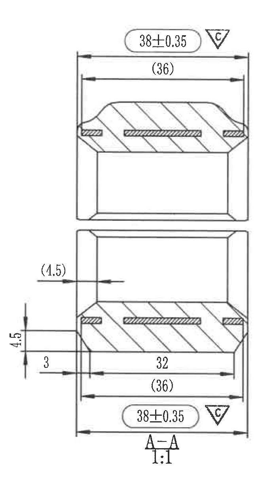

原图位置/视图名称：第 1 页中左区域，A-A 剖面视图，bbox `[1810, 610, 2510, 1835]`。

| 提取项 | 原图数值或文本 | 含义说明 |
|---|---|---|
| 剖面名称 | A-A | 主视图 A-A 剖切所得剖面。 |
| 比例 | 1:1 | 剖面视图比例。 |
| 上侧总宽 | 38±0.35，△C | 上半剖面外侧宽度，带公差 ±0.35，关键特性。 |
| 上侧参考宽 | (36) | 上半剖面内侧参考宽度，括号表示参考尺寸。 |
| 左侧参考尺寸 | (1.5) | 下半剖面左侧横向参考间距。 |
| 左侧局部高度 | 4.5 | 下半剖面左侧竖向局部高度。 |
| 左侧台阶尺寸 | 3 | 下半剖面左侧台阶/边距尺寸。 |
| 内部宽度 | 32 | 下半剖面内部水平宽度。 |
| 下侧参考宽 | (36) | 下半剖面内侧参考宽度，括号表示参考尺寸。 |
| 下侧总宽 | 38±0.35，△C | 下半剖面外侧宽度，带公差 ±0.35，关键特性。 |
| 星号关键尺寸 | 未见星号尺寸 | 当前剖面未出现带星号的尺寸。 |
| T 编号 | 未见 T 编号 | 当前剖面未出现 T 编号。 |
| 弧向尺寸/角度 | 未见弧向尺寸和角度标注 | 当前剖面仅给出线性尺寸和参考尺寸。 |

边界归属说明：左侧只保留 A-A 剖面自身的 (1.5)、4.5、3 等局部尺寸；主视图右侧 △C 标记和其他主视图尺寸未纳入本对象。

## object_3：等轴测参考视图

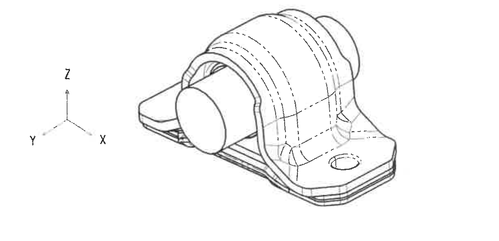

原图位置/视图名称：第 1 页右中下区域，等轴测参考视图，bbox `[2820, 1830, 4040, 2420]`。

| 提取项 | 原图数值或文本 | 含义说明 |
|---|---|---|
| 坐标轴 | X、Y、Z | 标明三维方向参考。 |
| 视图内容 | 三维等轴测外形，含虚线隐藏线 | 展示衬套与骨架装配外形，用于空间形状参考。 |
| 尺寸标注 | 未见尺寸标注 | 当前等轴测图未标注线性尺寸、半径、角度或公差。 |
| 星号关键尺寸/T 编号 | 未见 | 当前视图未出现星号尺寸或 T 编号。 |

边界归属说明：裁切下移后仅包含坐标轴和三维参考图本体，未包含上方技术要求文字。

## object_4：完全代用品信息表

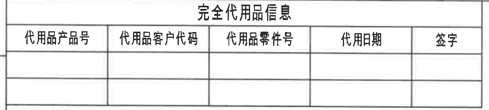

原图位置/视图名称：第 1 页左上区域，完全代用品信息表，bbox `[375, 150, 1640, 435]`。

原表行列还原：

| 代用品产品号 | 代用品客户代码 | 代用品零件号 | 代用日期 | 签字 |
|---|---|---|---|---|
|  |  |  |  |  |
|  |  |  |  |  |

| 提取项 | 原图数值或文本 | 含义说明 |
|---|---|---|
| 表题 | 完全代用品信息 | 代用品记录表。 |
| 表头 | 代用品产品号、代用品客户代码、代用品零件号、代用日期、签字 | 原表 5 个字段。 |
| 数据行 | 空白 | 原图中两行数据为空。 |

边界归属说明：裁切限制在表格边框内，不包含上方图框坐标数字。

## object_5：变更履历表

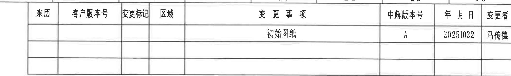

原图位置/视图名称：第 1 页右上区域，变更履历表，bbox `[2665, 150, 4775, 465]`。

原表行列还原：

| 来历 | 客户版本号 | 变更标记 | 区域 | 变更事项 | 中鼎版本号 | 年月日 | 变更者 |
|---|---|---|---|---|---|---|---|
|  |  |  |  | 初始图纸 | A | 20251022 | 马传德 |
|  |  |  |  |  |  |  |  |
|  |  |  |  |  |  |  |  |

| 提取项 | 原图数值或文本 | 含义说明 |
|---|---|---|
| 表头 | 来历、客户版本号、变更标记、区域、变更事项、中鼎版本号、年月日、变更者 | 修订/变更记录字段。 |
| 变更记录 | 初始图纸；中鼎版本号 A；20251022；马传德 | 初始图纸版本记录。 |
| 空白记录行 | 两行空白 | 原表保留后续变更记录空白行。 |

边界归属说明：右侧“变更者”列和表格右边框完整，未将技术要求正文纳入本表对象。

## object_6：技术要求 / NOTES

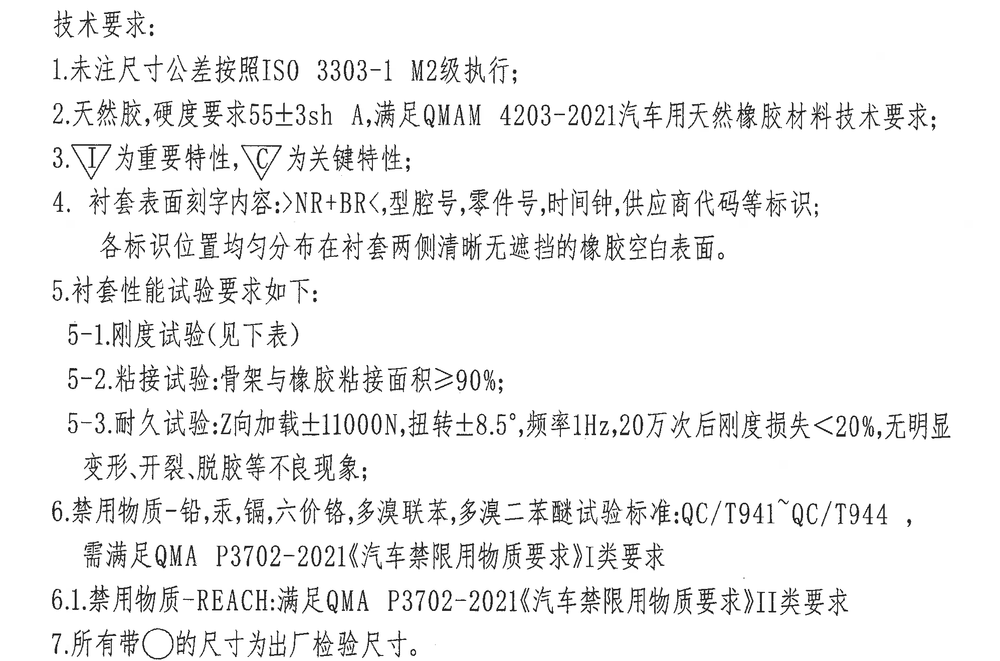

原图位置/视图名称：第 1 页右中区域，技术要求文字区，bbox `[2665, 490, 4660, 1810]`。

| 提取项 | 原图数值或文本 | 含义说明 |
|---|---|---|
| 标题 | 技术要求： | NOTES 标题。 |
| 1 | 未注尺寸公差按照 ISO 3303-1 M2 级执行； | 未单独标注的尺寸公差按 DIN/ISO 3302-1 Class M2 表执行。 |
| 2 | 天然胶，硬度要求 55±3sh A，满足 QMAM 4203-2021 汽车用天然橡胶材料技术要求； | 指定天然胶硬度和材料技术规范。 |
| 3 | △I 为重要特性，△C 为关键特性； | 符号含义说明，图中 △C 尺寸为关键特性。 |
| 4 | 衬套表面刻字内容：>NR+BR<，型腔号，零件号，时间钟，供应商代码等标识；各标识位置均匀分布在衬套两侧清晰无遮挡的橡胶空白表面。 | 表面刻字内容和位置要求。 |
| 5 | 衬套性能试验要求如下： | 引出性能试验要求。 |
| 5-1 | 刚度试验（见下表） | 对应 object_7 试验表。 |
| 5-2 | 粘接试验：骨架与橡胶粘接面积 ≥90%； | 粘接面积要求。 |
| 5-3 | 耐久试验：Z 向加载 ±11000N，扭转 ±8.5°，频率 1Hz，20 万次后刚度损失 <20%，无明显变形、开裂、脱胶等不良现象； | 耐久试验载荷、角度、频率、循环次数和判定要求。 |
| 6 | 禁用物质 - 铅、汞、镉、六价铬、多溴联苯、多溴二苯醚试验标准：QC/T941~QC/T944，需满足 QMA P3702-2021《汽车禁限用物质要求》I 类要求 | 禁限用物质及法规标准要求。 |
| 6.1 | 禁用物质 - REACH：满足 QMA P3702-2021《汽车禁限用物质要求》II 类要求 | REACH 禁限用物质要求。 |
| 7 | 所有带○的尺寸为出厂检验尺寸。 | 带圆圈标识的尺寸为出厂检验尺寸。 |

边界归属说明：裁切包含技术要求 1 至 7 的完整文字；下方等轴测图不归入本对象。

## object_7：衬套性能试验表

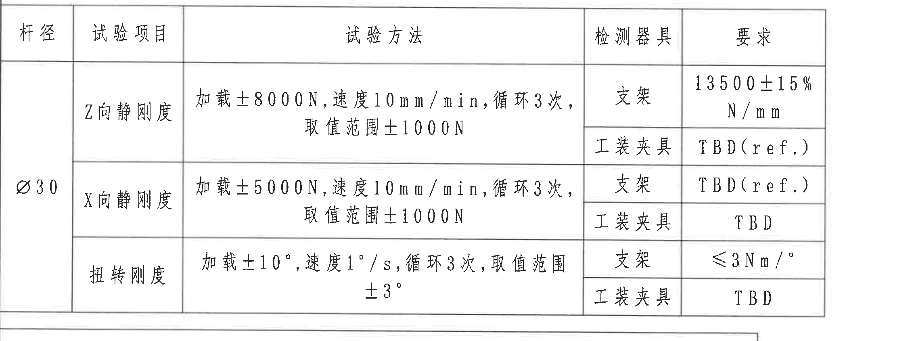

原图位置/视图名称：第 1 页左下中区域，衬套性能试验表，bbox `[385, 2140, 2650, 2985]`。

原表行列还原：

| 杆径 | 试验项目 | 试验方法 | 检测器具 | 要求 |
|---|---|---|---|---|
| Ø30 | Z向静刚度 | 加载±8000N，速度10mm/min，循环3次，取值范围±1000N | 支架 | 13500±15% N/mm |
| Ø30 | Z向静刚度 | 加载±8000N，速度10mm/min，循环3次，取值范围±1000N | 工装夹具 | TBD(ref.) |
| Ø30 | X向静刚度 | 加载±5000N，速度10mm/min，循环3次，取值范围±1000N | 支架 | TBD(ref.) |
| Ø30 | X向静刚度 | 加载±5000N，速度10mm/min，循环3次，取值范围±1000N | 工装夹具 | TBD |
| Ø30 | 扭转刚度 | 加载±10°，速度1°/s，循环3次，取值范围±3° | 支架 | ≤3Nm/° |
| Ø30 | 扭转刚度 | 加载±10°，速度1°/s，循环3次，取值范围±3° | 工装夹具 | TBD |

| 提取项 | 原图数值或文本 | 含义说明 |
|---|---|---|
| 杆径 | Ø30 | 试验适用杆径。 |
| Z向静刚度 | 13500±15% N/mm；TBD(ref.) | 支架检测要求为 13500±15% N/mm；工装夹具为参考 TBD。 |
| X向静刚度 | TBD(ref.)；TBD | 支架检测要求为参考 TBD；工装夹具为 TBD。 |
| 扭转刚度 | ≤3Nm/°；TBD | 支架检测要求不大于 3 Nm/°；工装夹具为 TBD。 |
| 角度尺寸 | ±10°、±3° | 扭转刚度试验加载角度和取值范围。 |
| 速度 | 10mm/min、1°/s | 静刚度与扭转刚度试验速度。 |

边界归属说明：右边界扩展到“要求”列完整右边框，未包含右侧标题栏内容；表格下边界仅到本试验表底线。

## object_8：DIN ISO 3302-1 Class M2 公差表

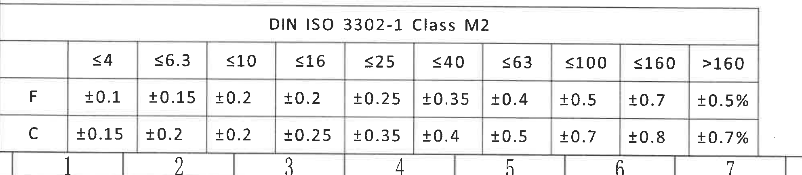

原图位置/视图名称：第 1 页左下区域，DIN ISO 3302-1 Class M2 公差表，bbox `[385, 2945, 2370, 3380]`。

原表行列还原：

| 级别 | ≤4 | ≤6.3 | ≤10 | ≤16 | ≤25 | ≤40 | ≤63 | ≤100 | ≤160 | >160 |
|---|---|---|---|---|---|---|---|---|---|---|
| F | ±0.1 | ±0.15 | ±0.2 | ±0.2 | ±0.25 | ±0.35 | ±0.4 | ±0.5 | ±0.7 | ±0.5% |
| C | ±0.15 | ±0.2 | ±0.2 | ±0.25 | ±0.35 | ±0.4 | ±0.5 | ±0.7 | ±0.8 | ±0.7% |

| 提取项 | 原图数值或文本 | 含义说明 |
|---|---|---|
| 表题 | DIN ISO 3302-1 Class M2 | 未注尺寸公差等级表。 |
| F 行 | ±0.1 至 ±0.5% | F 类公差按尺寸范围取值。 |
| C 行 | ±0.15 至 ±0.7% | C 类公差按尺寸范围取值。 |

边界归属说明：右侧 >160 列完整；底部可见少量图框坐标栏数字，不属于本表内容，未提取。

## object_9：BOM / 零部件明细表

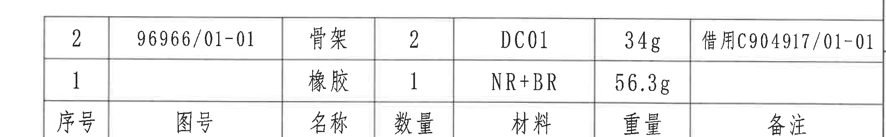

原图位置/视图名称：第 1 页右下中区域，BOM / 零部件明细表，bbox `[2670, 2395, 4790, 2725]`。

原表行列还原：

| 序号 | 图号 | 名称 | 数量 | 材料 | 重量 | 备注 |
|---|---|---|---|---|---|---|
| 2 | 96966/01-01 | 骨架 | 2 | DC01 | 34g | 借用C904917/01-01 |
| 1 |  | 橡胶 | 1 | NR+BR | 56.3g |  |

| 提取项 | 原图数值或文本 | 含义说明 |
|---|---|---|
| 表头 | 序号、图号、名称、数量、材料、重量、备注 | 零部件明细字段。 |
| 零件 2 | 96966/01-01；骨架；数量 2；DC01；34g；借用C904917/01-01 | 骨架件明细。 |
| 零件 1 | 橡胶；数量 1；NR+BR；56.3g | 橡胶件明细，图号和备注为空。 |

边界归属说明：裁切包含两条物料明细和表头行；下方投影法、比例、质量、材质、产品号等标题栏字段不归入本对象。

## object_10：标题栏

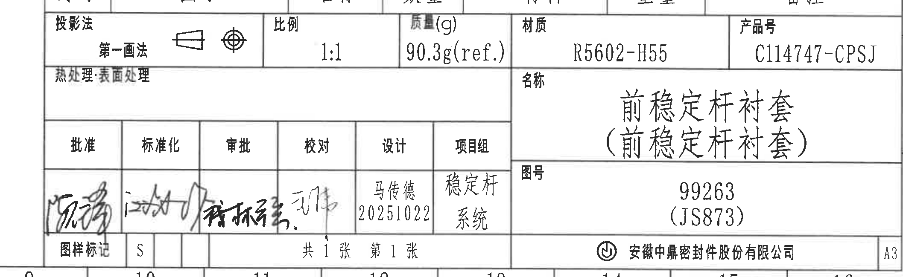

原图位置/视图名称：第 1 页右下区域，标题栏，bbox `[2670, 2710, 4785, 3360]`。

原表行列还原：

| 字段 | 原图文本 |
|---|---|
| 投影法 | 第一画法 |
| 比例 | 1:1 |
| 质量(g) | 90.3g(ref.) |
| 材质 | R5602-H55 |
| 产品号 | C114747-CPSJ |
| 热处理:表面处理 | 空白 |
| 名称 | 前稳定杆衬套（前稳定杆衬套） |
| 图号 | 99263（JS873） |
| 批准 | 手写签名，未能可靠辨认 |
| 标准化 | 手写签名，未能可靠辨认 |
| 审批 | 手写签名，未能可靠辨认 |
| 校对 | 手写签名，未能可靠辨认 |
| 设计 | 马传德 20251022 |
| 项目组 | 稳定杆系统 |
| 图样标记 | S |
| 页数 | 共1张 第1张 |
| 公司 | 安徽中鼎密封件股份有限公司 |
| 图幅 | A3 |

| 提取项 | 原图数值或文本 | 含义说明 |
|---|---|---|
| 产品号 | C114747-CPSJ | 图纸产品编号。 |
| 材质 | R5602-H55 | 标题栏材料牌号。 |
| 质量 | 90.3g(ref.) | 括号 ref. 表示参考质量。 |
| 名称 | 前稳定杆衬套（前稳定杆衬套） | 零件名称。 |
| 图号 | 99263（JS873） | 图纸编号及括号内参考/关联号。 |
| 设计 | 马传德 20251022 | 设计人员与日期。 |

边界归属说明：裁切包含标题栏完整字段和右侧 A3 图幅；顶部可见相邻 BOM 表底线残留，不作为标题栏字段提取。

## 裁切检查记录

| 图片 | 对象 | 检查结果 |
|---|---|---|
| page_1.png | 整页渲染图 | 完整包含第 1 页全部内容，尺寸 4959 x 3505。 |
| object_1.png | 主加工视图 | 完整包含主视图尺寸线、箭头、△C 标记和文字；未混入 A-A 剖面尺寸。 |
| object_2.png | A-A 剖面视图 | 完整包含剖面上下宽度、左侧局部尺寸、A-A 和 1:1；未混入主视图残片。 |
| object_3.png | 等轴测参考视图 | 完整包含三维参考图和 X/Y/Z 坐标轴；未混入技术要求文字。 |
| object_4.png | 完全代用品信息表 | 完整包含表题、表头、空白行和表格边框；未混入图框坐标数字。 |
| object_5.png | 变更履历表 | 完整包含全部表头、初始图纸记录和右侧变更者列。 |
| object_6.png | 技术要求 | 完整包含技术要求 1 至 7，文字未被边缘裁断。 |
| object_7.png | 衬套性能试验表 | 完整包含“要求”列和右边框；各行文字未被裁断。 |
| object_8.png | DIN ISO 3302-1 Class M2 公差表 | 完整包含标题、全部尺寸范围列和 F/C 行；底部少量图框坐标栏不提取。 |
| object_9.png | BOM / 零部件明细表 | 完整包含两条物料明细、备注列和表头；未提取下方标题栏字段。 |
| object_10.png | 标题栏 | 完整包含投影法、比例、质量、材质、产品号、名称、图号、签署栏、公司名和 A3；顶部 BOM 残留不提取。 |
