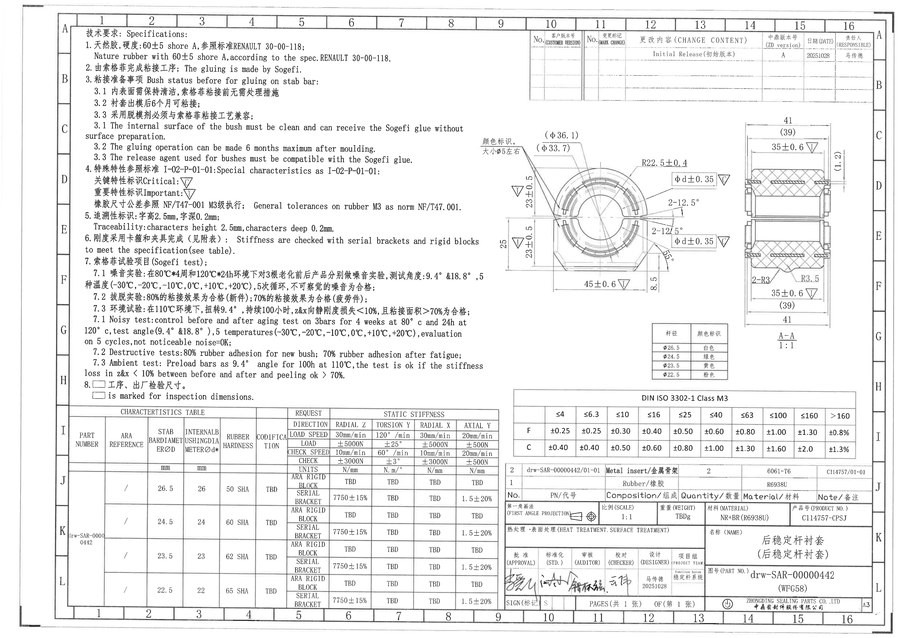
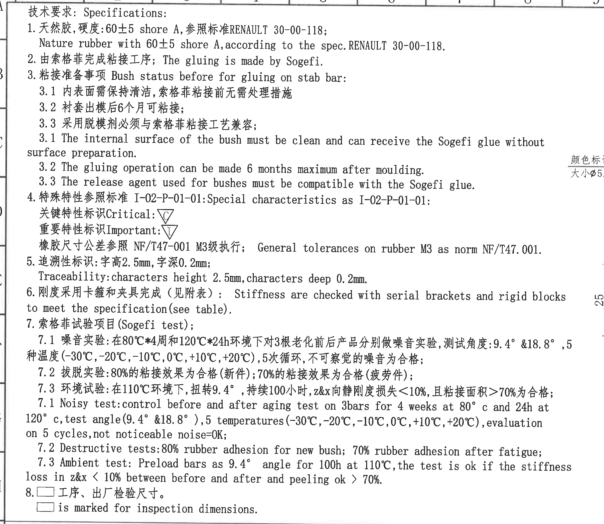
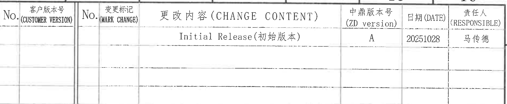
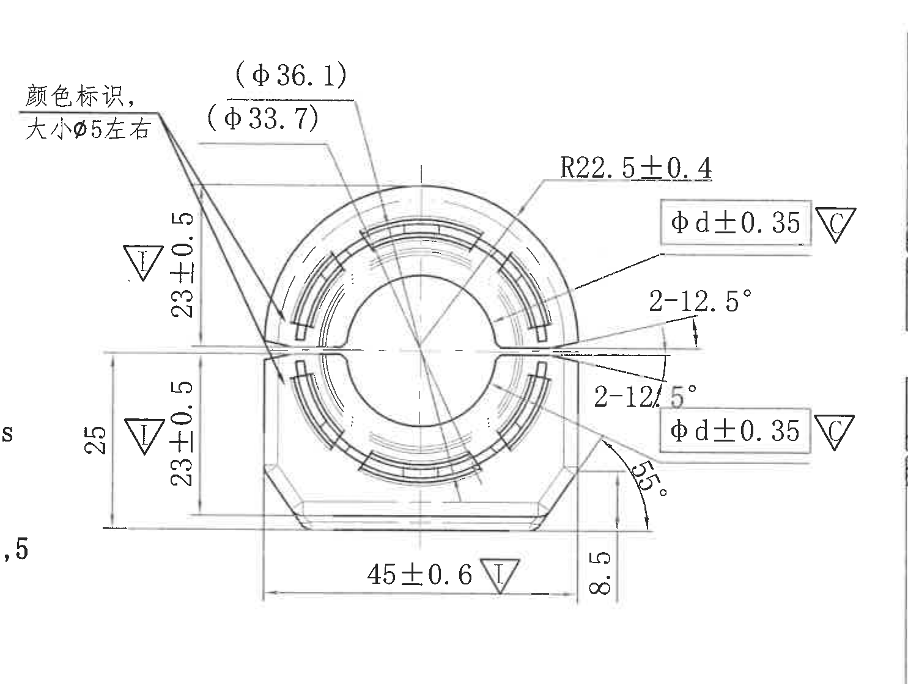
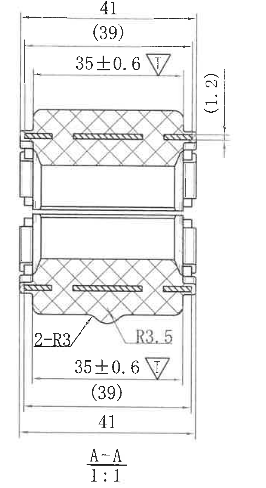
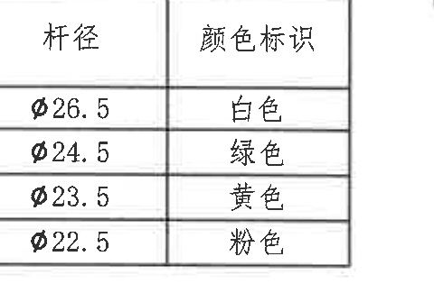
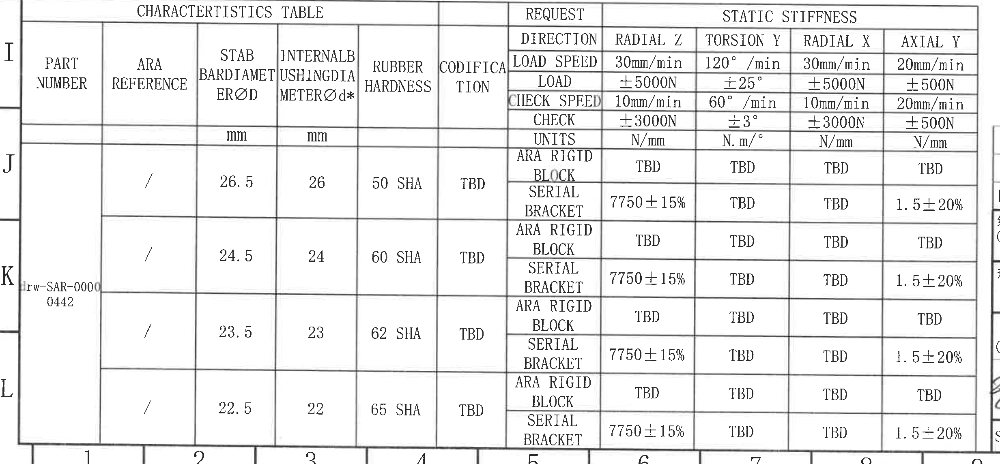
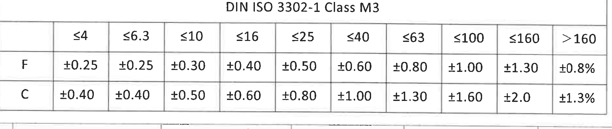
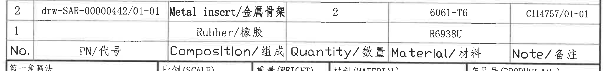
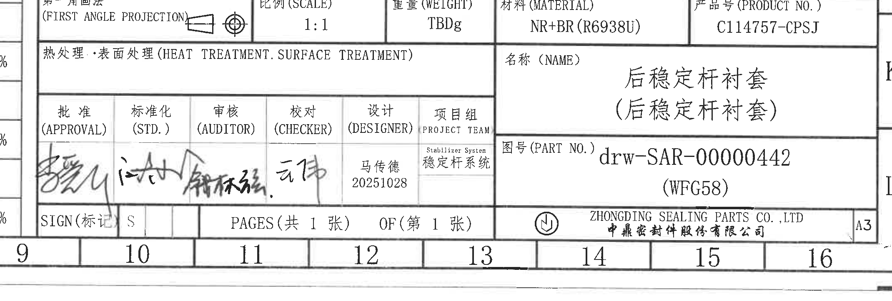

# 20C114757 内容识别

整页渲染图：`outputs/20C114757_assets/images/page_1.png`，尺寸 4959 x 3505 px。

| object_id | object_kind | 原图位置/视图名称 | bbox [x,y,w,h] |
|---|---|---|---|
| object_1 | notes | 左上 NOTES/技术要求 | [360, 135, 2420, 2105] |
| object_2 | table | 右上修订履历表 | [2915, 160, 1885, 390] |
| object_3 | view | 右中主加工视图 | [2605, 620, 1485, 1120] |
| object_4 | section | 右侧 A-A 剖面视图 | [4035, 640, 705, 1290] |
| object_5 | table | 主视图下方颜色标识表 | [3605, 1790, 480, 335] |
| object_6 | table | 左下 CHARACTERISTICS TABLE | [325, 2235, 2465, 1145] |
| object_7 | table | 右下 DIN ISO 3302-1 Class M3 公差表 | [2825, 2165, 1885, 400] |
| object_8 | table | 右下 BOM/组成表 | [2750, 2545, 2050, 245] |
| object_9 | title_block | 右下标题栏 | [2680, 2780, 2140, 725] |

## object_1 - NOTES / 技术要求

原图位置/视图名称：第 1 页左上 NOTES/技术要求区。

| 提取项 | 原图数值或文本 | 含义说明 |
|---|---|---|
| 标题 | 技术要求: Specifications: | 本区为零件技术要求和试验要求说明。 |
| 1 | 天然胶, 硬度: 60±5 shore A, 参照标准 RENAULT 30-00-118; | 材料为天然胶，硬度控制为 60±5 Shore A，并按 RENAULT 30-00-118 执行。 |
| 1 英文 | Nature rubber with 60±5 shore A, according to the spec. RENAULT 30-00-118. | 上述中文要求的英文说明。 |
| 2 | 由索格菲完成粘接工序; The gluing is made by Sogefi. | 粘接工序责任方为 Sogefi。 |
| 3 | 粘接准备事项 Bush status before for gluing on stab bar: | 粘接到稳定杆前的衬套状态要求。 |
| 3.1 中文 | 内表面需保持清洁, 索格菲粘接前无需处理措施 | 衬套内表面必须清洁，粘接前不需要额外表面处理。 |
| 3.2 中文 | 衬套出模后 6 个月可粘接; | 出模后最多 6 个月内可进行粘接。 |
| 3.3 中文 | 采用脱模剂必须与索格菲粘接工艺兼容; | 脱模剂必须与 Sogefi 粘接工艺兼容。 |
| 3.1 英文 | The internal surface of the bush must be clean and can receive the Sogefi glue without surface preparation. | 对 3.1 的英文说明。 |
| 3.2 英文 | The gluing operation can be made 6 months maximum after moulding. | 对 3.2 的英文说明。 |
| 3.3 英文 | The release agent used for bushes must be compatible with the Sogefi glue. | 对 3.3 的英文说明。 |
| 4 | 特殊特性参照标准 I-02-P-01-01: Special characteristics as I-02-P-01-01: | 特殊特性标识依据 I-02-P-01-01。 |
| 关键特性标识 | Critical: 三角框 C | C 标识代表关键特性。 |
| 重要特性标识 | Important: 三角框 I | I 标识代表重要特性。 |
| 橡胶尺寸公差 | 橡胶尺寸公差参照 NF/T47-001 M3级执行; General tolerances on rubber M3 as norm NF/T47.001. | 橡胶件一般尺寸公差按 NF/T47-001 M3。 |
| 5 | 追溯性标识: 字高 2.5mm, 字深 0.2mm; | 追溯字符高度 2.5mm，字符深度 0.2mm。 |
| 5 英文 | Traceability: characters height 2.5mm, characters deep 0.2mm. | 上述追溯要求的英文说明。 |
| 6 | 刚度采用卡箍和夹具完成（见附表）: Stiffness are checked with serial brackets and rigid blocks to meet the specification (see table). | 静刚度通过序列支架和刚性块夹具检验，具体要求见特性表。 |
| 7 | 索格菲试验项目 (Sogefi test); | Sogefi 试验项目总标题。 |
| 7.1 中文 | 噪音实验: 在 80°C*4周和 120°C*24h 环境下对 3 根老化前后产品分别做噪音实验, 测试角度: 9.4° & 18.8°, 5 种温度 (-30°C, -20°C, -10°C, 0°C, +10°C, +20°C), 5 次循环, 不可察觉的噪音为合格; | 噪音试验条件：老化条件、样件数量、角度、温度循环和判定准则。原文写“5 种温度”但列出 6 个温度点，按原图照录。 |
| 7.2 中文 | 拔脱实验: 80%的粘接效果为合格（新件）; 70%的粘接效果为合格（疲劳件）; | 新件和疲劳件拔脱后粘接面积合格标准。 |
| 7.3 中文 | 环境试验: 在 110°C 环境下, 扭转 9.4°, 持续 100 小时, z&x 向静刚度损失 <10%, 且粘接面积 >70% 为合格; | 环境试验温度、角度、持续时间、刚度损失和粘接面积判定。 |
| 7.1 英文 | Noisy test: control before and after aging test on 3bars for 4 weeks at 80°c and 24h at 120°c, test angle (9.4° & 18.8°), 5 temperatures (-30°C, -20°C, -10°C, 0°C, +10°C, +20°C), evaluation on 5 cycles, not noticeable noise=OK; | 噪音试验英文说明。 |
| 7.2 英文 | Destructive tests: 80% rubber adhesion for new bush; 70% rubber adhesion after fatigue; | 拔脱/破坏试验英文说明。 |
| 7.3 英文 | Ambient test: Preload bars as 9.4° angle for 100h at 110°C, the test is ok if the stiffness loss in z&x < 10% between before and after and peeling ok > 70%. | 环境试验英文说明。 |
| 8 | □ 工序、出厂检验尺寸。 □ is marked for inspection dimensions. | 方框标识为工序和出厂检验尺寸。 |

边界归属说明：该裁切保留 NOTES 全部文字。右侧靠近主视图处可见少量“颜色标识/φ5”标注片段及一条尺寸线边缘，这是主加工视图 object_3 的内容，不归入 NOTES 提取；底部接近特性表上边框但未提取表格内容。

## object_2 - 修订履历表

原图位置/视图名称：第 1 页右上修订履历表。

原表行列还原：

| No. | 客户版本号 (CUSTOMER VERSION) | No. | 变更标记 (MARK CHANGE) | 更改内容 (CHANGE CONTENT) | 中鼎版本号 (ZD version) | 日期 (DATE) | 责任人 (RESPONSIBLE) |
|---|---|---|---|---|---|---|---|
|  |  |  |  | Initial Release (初始版本) | A | 20251028 | 马传德 |
|  |  |  |  |  |  |  |  |
|  |  |  |  |  |  |  |  |
|  |  |  |  |  |  |  |  |

| 提取项 | 原图数值或文本 | 含义说明 |
|---|---|---|
| 修订记录 | Initial Release (初始版本) | 初始发布记录。 |
| 中鼎版本号 | A | 本图 ZD version 为 A。 |
| 日期 | 20251028 | 修订日期，格式按图纸原文。 |
| 责任人 | 马传德 | 该版本责任人。 |
| 空白行 | 下方多行为空 | 原表预留后续修订记录，未填写。 |

边界归属说明：裁切只覆盖修订履历表本体，顶部图框坐标栏和右侧边框字母不作为表格内容提取。

## object_3 - 主加工视图

原图位置/视图名称：第 1 页右中部主加工视图。

| 提取项 | 原图数值或文本 | 含义说明 |
|---|---|---|
| 视图名称 | 主加工视图 | 从端面方向表示衬套外形、内孔、颜色标识和开口角度。 |
| 颜色标识 | 颜色标识, 大小φ5左右 | 指向视图左上/左下局部标识位置，表示颜色标识尺寸约为直径 5。 |
| 参考直径 | (φ36.1) | 括号内参考尺寸，表示该圆周/外径相关位置的参考直径，不作为带公差主控尺寸。 |
| 参考直径 | (φ33.7) | 括号内参考尺寸，表示内部圆周相关位置的参考直径，不作为带公差主控尺寸。 |
| 半径 | R22.5±0.4 | 上方外弧半径，公差 ±0.4。 |
| 关键尺寸 | φd±0.35，三角框 C（上侧引线） | 指向上侧相关内径/圆弧特征；C 为关键特性标识。 |
| 关键尺寸 | φd±0.35，三角框 C（下侧引线） | 指向下侧相关内径/圆弧特征；同一 φd 尺寸在上下位置分别标注，C 为关键特性标识。 |
| 角度 | 2-12.5°（上侧） | 数量前缀 2 表示两处 12.5° 角度，位于右侧开口上方。 |
| 角度 | 2-12.5°（下侧） | 数量前缀 2 表示两处 12.5° 角度，位于右侧开口下方。 |
| 角度 | 55° | 右下斜边/局部外形角度。 |
| 高度/距离 | 8.5 | 右下局部竖向尺寸。 |
| 总宽/重要尺寸 | 45±0.6，三角框 I | 底部水平总宽尺寸，I 为重要特性标识。 |
| 总高 | 25 | 左侧整体竖向尺寸。 |
| 重要尺寸 | 23±0.5，三角框 I（上侧） | 左侧上半竖向局部尺寸，I 为重要特性标识。 |
| 重要尺寸 | 23±0.5，三角框 I（下侧） | 左侧下半竖向局部尺寸，I 为重要特性标识。 |
| 基准字母 | 未见独立基准字母 | 本视图未见 A/B/C 等基准框；三角框 C/I 是特殊特性标识，不是基准字母。 |
| T 编号 | 未见 T 编号 | 本视图未标出 T 编号。 |
| 弧向尺寸 | R22.5±0.4 与 55° | 本视图中弧/角相关尺寸为外弧半径和右下角度；未见单独弧长标注。 |

边界归属说明：本裁切包含主视图全部尺寸线、箭头、引线和标注文字。左边缘少量相邻 NOTES 残字不可避免，仅作为边界残影，不提取为本视图内容；右侧未包含 A-A 剖视图尺寸。

## object_4 - A-A 剖面视图

原图位置/视图名称：第 1 页右侧 A-A 剖面视图，比例 1:1。

| 提取项 | 原图数值或文本 | 含义说明 |
|---|---|---|
| 视图名称 | A-A | A-A 剖面视图，显示橡胶剖面、金属骨架/嵌件和剖面填充。 |
| 比例 | 1:1 | 剖面视图比例。 |
| 总宽 | 41（上侧） | 剖面上端外侧总宽尺寸。 |
| 参考宽度 | (39)（上侧） | 括号内参考宽度，位于上侧，非带公差主控尺寸。 |
| 重要尺寸 | 35±0.6，三角框 I（上侧） | 上侧内部宽度/配合宽度，I 为重要特性。 |
| 参考尺寸 | (1.2) | 右上侧竖向参考尺寸，表示局部台阶/间距参考值。 |
| 圆角 | 2-R3 | 两处 R3 圆角，数量前缀 2 表示两处。 |
| 圆角 | R3.5 | 下方中部局部圆角半径。 |
| 重要尺寸 | 35±0.6，三角框 I（下侧） | 下侧内部宽度/配合宽度，I 为重要特性。 |
| 参考宽度 | (39)（下侧） | 括号内参考宽度，位于下侧，非带公差主控尺寸。 |
| 总宽 | 41（下侧） | 剖面下端外侧总宽尺寸。 |
| 基准字母 | A-A | 剖切位置/剖面代号；未见额外基准框。 |
| T 编号 | 未见 T 编号 | 本剖面视图未标出 T 编号。 |
| 弧向尺寸 | 2-R3、R3.5 | 本剖面中的弧形特征以圆角半径表示。 |

边界归属说明：裁切收紧到 A-A 剖面及其尺寸，未带入右侧图框坐标栏。所有可见尺寸线、箭头、剖面名和比例均完整保留。

## object_5 - 颜色标识表

原图位置/视图名称：第 1 页主视图下方颜色标识表。

原表行列还原：

| 杆径 | 颜色标识 |
|---|---|
| φ26.5 | 白色 |
| φ24.5 | 绿色 |
| φ23.5 | 黄色 |
| φ22.5 | 粉色 |

| 提取项 | 原图数值或文本 | 含义说明 |
|---|---|---|
| 杆径 φ26.5 | 白色 | 稳定杆杆径 φ26.5 时使用白色标识。 |
| 杆径 φ24.5 | 绿色 | 稳定杆杆径 φ24.5 时使用绿色标识。 |
| 杆径 φ23.5 | 黄色 | 稳定杆杆径 φ23.5 时使用黄色标识。 |
| 杆径 φ22.5 | 粉色 | 稳定杆杆径 φ22.5 时使用粉色标识。 |

边界归属说明：裁切只包含颜色标识小表，不含上方主视图或下方标题栏内容；表格外框、表头和四行数据完整。

## object_6 - CHARACTERISTICS TABLE

原图位置/视图名称：第 1 页左下 CHARACTERISTICS TABLE。

静刚度表头条件还原：

| REQUEST / DIRECTION | RADIAL Z | TORSION Y | RADIAL X | AXIAL Y |
|---|---|---|---|---|
| LOAD SPEED | 30mm/min | 120°/min | 30mm/min | 20mm/min |
| LOAD | ±5000N | ±25° | ±5000N | ±500N |
| CHECK SPEED | 10mm/min | 60°/min | 10mm/min | 20mm/min |
| CHECK | ±3000N | ±3° | ±3000N | ±500N |
| UNITS | N/mm | N.m/° | N/mm | N/mm |

数据区还原（原图左侧 PART NUMBER 为合并单元格，表内按行重复写出）：

| PART NUMBER | ARA REFERENCE | STAB BAR DIAMETER ØD (mm) | INTERNAL BUSHING DIAMETER Ød* (mm) | RUBBER HARDNESS | CODIFICATION | REQUEST DIRECTION | RADIAL Z | TORSION Y | RADIAL X | AXIAL Y |
|---|---|---:|---:|---|---|---|---|---|---|---|
| drw-SAR-00000442 | / | 26.5 | 26 | 50 SHA | TBD | ARA RIGID BLOCK | TBD | TBD | TBD | TBD |
| drw-SAR-00000442 | / | 26.5 | 26 | 50 SHA | TBD | SERIAL BRACKET | 7750±15% | TBD | TBD | 1.5±20% |
| drw-SAR-00000442 | / | 24.5 | 24 | 60 SHA | TBD | ARA RIGID BLOCK | TBD | TBD | TBD | TBD |
| drw-SAR-00000442 | / | 24.5 | 24 | 60 SHA | TBD | SERIAL BRACKET | 7750±15% | TBD | TBD | 1.5±20% |
| drw-SAR-00000442 | / | 23.5 | 23 | 62 SHA | TBD | ARA RIGID BLOCK | TBD | TBD | TBD | TBD |
| drw-SAR-00000442 | / | 23.5 | 23 | 62 SHA | TBD | SERIAL BRACKET | 7750±15% | TBD | TBD | 1.5±20% |
| drw-SAR-00000442 | / | 22.5 | 22 | 65 SHA | TBD | ARA RIGID BLOCK | TBD | TBD | TBD | TBD |
| drw-SAR-00000442 | / | 22.5 | 22 | 65 SHA | TBD | SERIAL BRACKET | 7750±15% | TBD | TBD | 1.5±20% |

| 提取项 | 原图数值或文本 | 含义说明 |
|---|---|---|
| PART NUMBER | drw-SAR-00000442 | 特性表对应零件图号。 |
| ARA REFERENCE | / | ARA reference 未给出具体编号。 |
| STAB BAR DIAMETER ØD | 26.5, 24.5, 23.5, 22.5 mm | 稳定杆直径系列。 |
| INTERNAL BUSHING DIAMETER Ød* | 26, 24, 23, 22 mm | 衬套内径系列，原表头带星号 *，按关键/特别提示尺寸照录。 |
| RUBBER HARDNESS | 50 SHA, 60 SHA, 62 SHA, 65 SHA | 对应不同杆径/内径的橡胶硬度。 |
| CODIFICATION | TBD | 编码待定。 |
| RADIAL Z | ARA RIGID BLOCK: TBD; SERIAL BRACKET: 7750±15% | Z 向静刚度要求，串联支架条件下为 7750±15%。 |
| TORSION Y | TBD | Y 向扭转静刚度未定。 |
| RADIAL X | TBD | X 向径向静刚度未定。 |
| AXIAL Y | ARA RIGID BLOCK: TBD; SERIAL BRACKET: 1.5±20% | Y 向轴向静刚度要求，串联支架条件下为 1.5±20%。 |

边界归属说明：裁切包含特性表完整外框、表头和全部数据行。左边缘可见图框坐标栏 I/J/K/L，右边缘有相邻标题栏极窄残影，这些均不属于特性表，不作为表格字段提取。

## object_7 - DIN ISO 3302-1 Class M3 公差表

原图位置/视图名称：第 1 页右下 DIN ISO 3302-1 Class M3 公差表。

原表行列还原：

| DIN ISO 3302-1 Class M3 | ≤4 | ≤6.3 | ≤10 | ≤16 | ≤25 | ≤40 | ≤63 | ≤100 | ≤160 | >160 |
|---|---:|---:|---:|---:|---:|---:|---:|---:|---:|---:|
| F | ±0.25 | ±0.25 | ±0.30 | ±0.40 | ±0.50 | ±0.60 | ±0.80 | ±1.00 | ±1.30 | ±0.8% |
| C | ±0.40 | ±0.40 | ±0.50 | ±0.60 | ±0.80 | ±1.00 | ±1.30 | ±1.60 | ±2.0 | ±1.3% |

| 提取项 | 原图数值或文本 | 含义说明 |
|---|---|---|
| 标准 | DIN ISO 3302-1 Class M3 | 橡胶件尺寸公差等级表。 |
| F 行 | ±0.25 到 ±1.30，>160 为 ±0.8% | F 类尺寸公差带。 |
| C 行 | ±0.40 到 ±2.0，>160 为 ±1.3% | C 类尺寸公差带。 |

边界归属说明：裁切包含完整公差表，不含下方 BOM 表；表格标题、列标题和 F/C 两行均完整。

## object_8 - BOM / 组成表

原图位置/视图名称：第 1 页右下 BOM/组成表。

原表行列还原：

| No. | PN/代号 | Composition/组成 | Quantity/数量 | Material/材料 | Note/备注 |
|---:|---|---|---:|---|---|
| 2 | drw-SAR-00000442/01-01 | Metal insert/金属骨架 | 2 | 6061-T6 | C114757/01-01 |
| 1 |  | Rubber/橡胶 |  | R6938U |  |

| 提取项 | 原图数值或文本 | 含义说明 |
|---|---|---|
| No.2 | drw-SAR-00000442/01-01, Metal insert/金属骨架, Quantity 2, Material 6061-T6, Note C114757/01-01 | 金属骨架物料行。 |
| No.1 | Rubber/橡胶, Material R6938U | 橡胶物料行；PN、数量、备注栏未填写。 |

边界归属说明：裁切覆盖 BOM 表格的两条物料记录、表头和外框。底部可见下一行标题栏的上边缘/文字露出，不归入 BOM 提取。

## object_9 - 标题栏

原图位置/视图名称：第 1 页右下标题栏。

标题栏字段还原：

| 字段 | 原图数值或文本 |
|---|---|
| 第一角画法 (FIRST ANGLE PROJECTION) | 第一角画法符号 |
| 比例 (SCALE) | 1:1 |
| 重量 (WEIGHT) | TBDg |
| 材料 (MATERIAL) | NR+BR (R6938U) |
| 产品号 (PRODUCT NO.) | C114757-CPSJ |
| 热处理·表面处理 (HEAT TREATMENT. SURFACE TREATMENT) | 空白 |
| 名称 (NAME) | 后稳定杆衬套 (后稳定杆衬套) |
| 批准 (APPROVAL) | 手写签名，无法可靠辨读 |
| 标准化 (STD.) | 手写签名，无法可靠辨读 |
| 审核 (AUDITOR) | 手写签名，无法可靠辨读 |
| 校对 (CHECKER) | 手写签名，无法可靠辨读 |
| 设计 (DESIGNER) | 马传德 / 20251028 |
| 项目组 (PROJECT TEAM) | Stabilizer System / 稳定杆系统 |
| 图号 (PART NO.) | drw-SAR-00000442 |
| 图号附注 | (WFG58) |
| SIGN(标记) | S |
| PAGES | 共 1 张 |
| OF | 第 1 张 |
| 公司 | ZHONGDING SEALING PARTS CO., LTD / 中鼎密封件股份有限公司 |
| 图幅 | A3 |

| 提取项 | 原图数值或文本 | 含义说明 |
|---|---|---|
| Product No. | C114757-CPSJ | 产品号。 |
| Part No. | drw-SAR-00000442 | 图号。 |
| Material | NR+BR (R6938U) | 标题栏材料栏。 |
| Scale | 1:1 | 图纸比例。 |
| Weight | TBDg | 重量待定。 |
| Name | 后稳定杆衬套 (后稳定杆衬套) | 零件名称。 |
| Designer/date | 马传德 / 20251028 | 设计人及日期。 |
| Sheet | A3; 共 1 张; 第 1 张 | 图幅和页码。 |

边界归属说明：裁切覆盖标题栏主体。左侧边缘可见特性表/邻接栏的极窄残影，右侧可见图框坐标栏边缘，均不作为标题栏字段提取；标题栏内文字和签名框完整。

## 裁切检查记录

| 图片 | 检查结果 |
|---|---|
| page_1.png | 整页 PNG 渲染完整，页面尺寸 4959 x 3505 px，图框和所有对象均可见。 |
| object_1.png | NOTES 文字完整；右侧混入少量主视图标注残影，已在归属说明中排除。 |
| object_2.png | 修订表表头、唯一修订记录和空白预留行完整；顶部图框坐标未纳入表格提取。 |
| object_3.png | 主视图所有尺寸线、箭头、引线、参考尺寸和 C/I 特性符号完整；左边缘少量 NOTES 残字不归属本视图。 |
| object_4.png | A-A 剖面视图、剖面名、比例、全部水平/竖向尺寸和圆角标注完整；未混入右侧图框坐标栏。 |
| object_5.png | 颜色标识表外框、表头和四行数据完整，无相邻视图片段。 |
| object_6.png | CHARACTERISTICS TABLE 表头、测试条件、全部 8 行数据完整；左侧图框坐标栏和右侧极窄残影不作为表格内容。 |
| object_7.png | DIN ISO 3302-1 Class M3 公差表标题、列标题和 F/C 两行完整，无边缘文字截断。 |
| object_8.png | BOM 表头和两条物料记录完整；底部少量标题栏边缘露出不归属 BOM。 |
| object_9.png | 标题栏字段、签名区、图号区、公司栏、图幅栏完整；左/右边缘邻接残影不归属标题栏。 |
