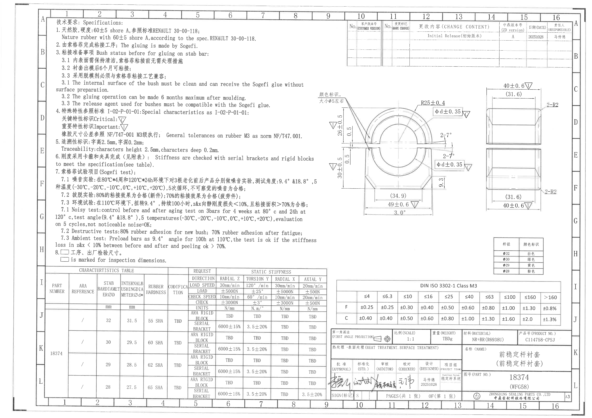
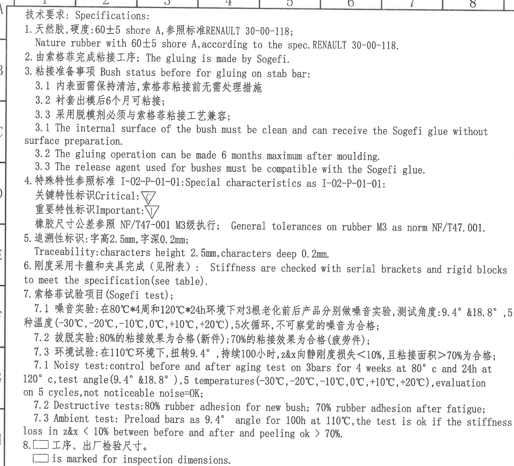
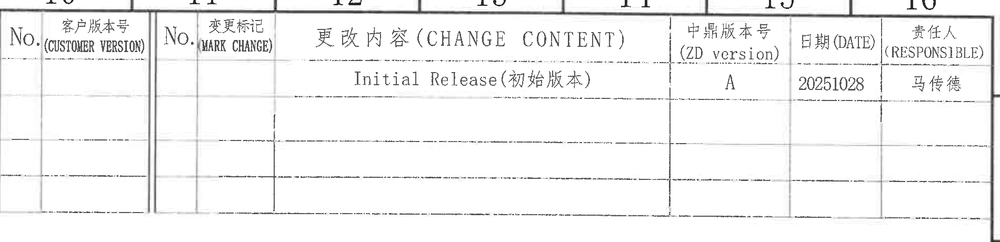
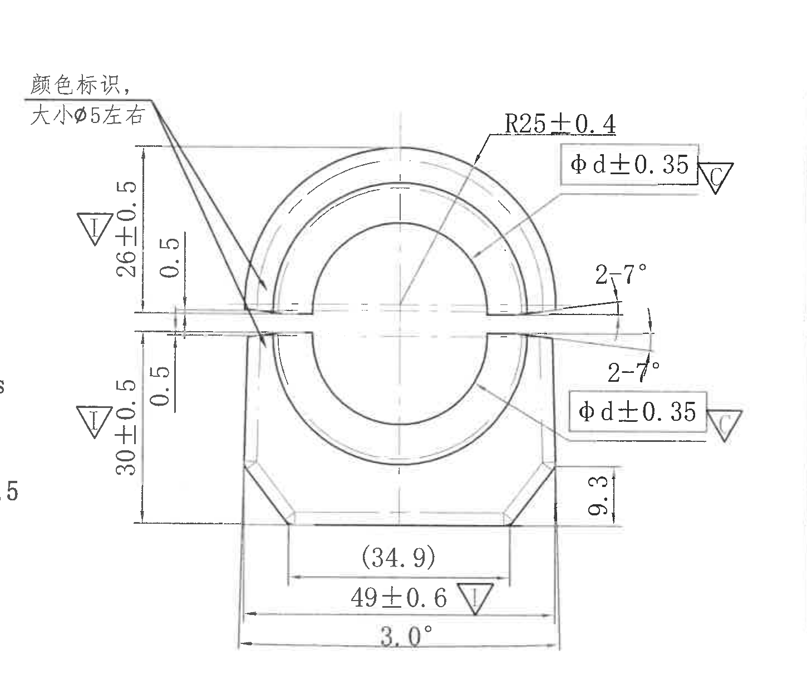
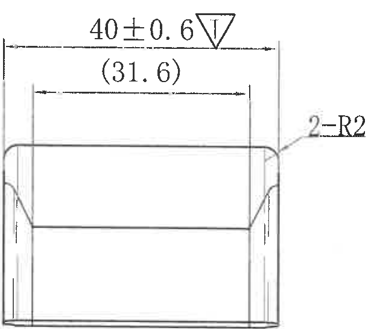
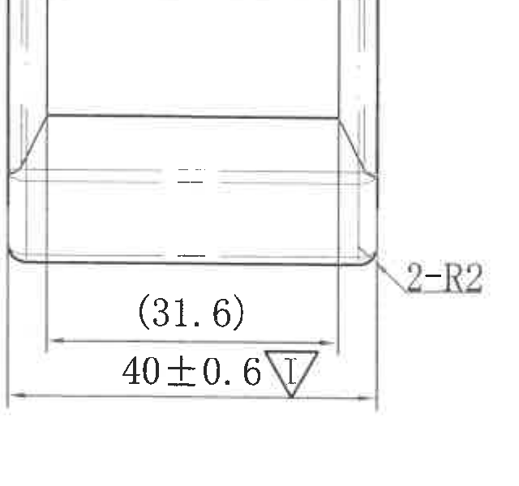
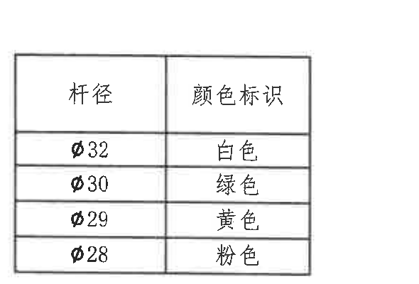
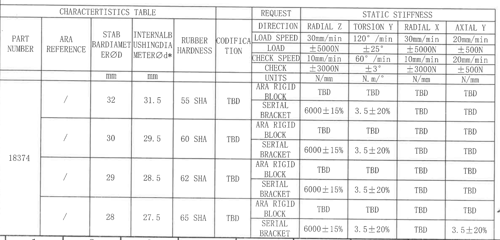
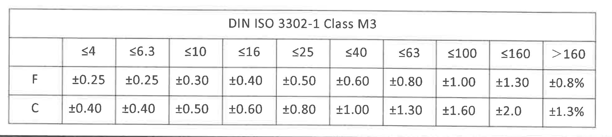
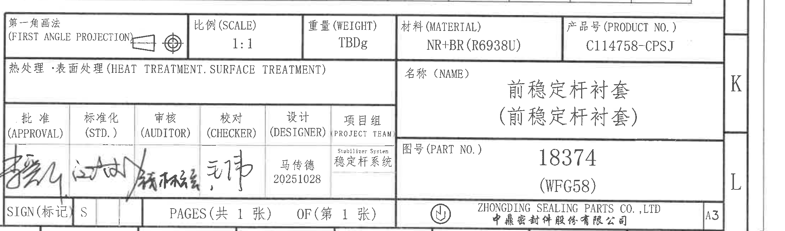

# 20C114758 内容识别结果

整页 PNG: 

坐标说明: bbox 使用整页 300 DPI PNG 像素坐标 `[x, y, width, height]`。

## object_1 - 技术要求 / Specifications / NOTES

- 原图位置/视图名称: 技术要求 / Specifications / NOTES；page 1；bbox `[360, 120, 2300, 2090]`
- 边界归属说明: 位于整页左上至左中区域。该对象为说明性 NOTES 文本区。右侧附近零件视图的颜色标识和尺寸标注不归入本对象；其尺寸在主视图 object_3 中提取。

| 提取项 | 原图数值或文本 | 含义说明 |
|---|---|---|
| 标题 | 技术要求 / Specifications | 整块为技术要求和检验说明。 |
| 1 | 天然胶, 硬度:60±5 shore A; RENAULT 30-00-118 | 材料为天然橡胶，硬度要求 60±5 Shore A，执行 Renault 规范。 |
| 2 | The gluing is made by Sogefi. | 粘接工序由 Sogefi 完成。 |
| 3 | Bush status before for gluing on stab bar | 装配到稳定杆前衬套粘接准备要求。 |
| 3.1 | 内表面需保持清洁; no surface preparation | 内表面清洁即可接收 Sogefi 胶，无需额外表面处理。 |
| 3.2 | 6 months maximum after moulding | 出模后最长 6 个月内可粘接。 |
| 3.3 | release agent ... compatible with Sogefi glue | 脱模剂必须与 Sogefi 粘接工艺兼容。 |
| 4 | I-02-P-01-01; ▽C Critical; ▽I Important; NF/T47-001 M3 | 特殊特性、关键/重要标识和橡胶尺寸公差等级。 |
| 5 | 字高2.5mm, 字深0.2mm | 追溯字符高度和深度。 |
| 6 | Stiffness ... serial brackets and rigid blocks | 刚度用卡箍和刚性块按附表检查。 |
| 7.1 | 80°C*4周, 120°C*24h, 9.4° & 18.8°, -30°C...+20°C, 5 cycles | 噪音试验条件和合格判据。 |
| 7.2 | 80% new bush; 70% after fatigue | 拔脱/粘接效果判定。 |
| 7.3 | 110°C, 9.4°, 100h, z&x <10%, peeling >70% | 环境试验和刚度/剥离判定。 |
| 8 | □ is marked for inspection dimensions | 方框标记表示工序、出厂检验尺寸。 |

## object_2 - 修订履历表 / Change Content

- 原图位置/视图名称: 修订履历表 / Change Content；page 1；bbox `[2910, 150, 1900, 460]`
- 边界归属说明: 位于图纸右上角 A-B 行、10-16 列附近。该表与右侧图框字母 A/B 相邻；图框坐标字母不作为表格内容。

| No. | 客户版本号 (CUSTOMER VERSION) | No. | 变更标记 (MARK CHANGE) | 更改内容 (CHANGE CONTENT) | 中鼎版本号 (ZD version) | 日期 (DATE) | 责任人 (RESPONSIBLE) |
|---|---|---|---|---|---|---|---|
|  |  |  |  | Initial Release(初始版本) | A | 20251028 | 马传德 |
|  |  |  |  |  |  |  |  |
|  |  |  |  |  |  |  |  |

| 提取项 | 原图数值或文本 | 含义说明 |
|---|---|---|
| 表头 | No.; CUSTOMER VERSION; No.; MARK CHANGE; CHANGE CONTENT; ZD version; DATE; RESPONSIBLE | 修订履历列名。 |
| 当前记录 | Initial Release(初始版本), A, 20251028, 马传德 | 初始版本发布记录。 |

## object_3 - 主加工视图 / 正视图

- 原图位置/视图名称: 主加工视图 / 正视图；page 1；bbox `[2620, 640, 1450, 1220]`
- 边界归属说明: 位于图纸中右部 C-G 行、约8-13列。左上颜色标识引出线指向主视图圆弧区域，归属主视图。右侧两个矩形侧视图尺寸不归入本对象。

| 提取项 | 原图数值或文本 | 含义说明 |
|---|---|---|
| 引出标注 | 颜色标识, 大小φ5左右 | 颜色识别标记直径约 φ5，位于/指向主视图上部圆弧附近。 |
| 左上竖向尺寸 | 26±0.5 ▽I | 重要特性尺寸，定义上侧槽/台阶相关高度。 |
| 左上局部尺寸 | 0.5 | 上侧局部小高度/间距尺寸。 |
| 左下竖向尺寸 | 30±0.5 ▽I | 重要特性尺寸，定义下侧主体高度。 |
| 左下局部尺寸 | 0.5 | 下侧局部小高度/间距尺寸。 |
| 圆弧半径 | R25±0.4 | 主圆弧外形半径及公差。 |
| 上侧直径尺寸 | φd±0.35 ▽C | 关键特性直径/内径尺寸，d 对应表格中的 INTERNAL BUSHING DIAMETER Ød*。 |
| 上侧角度 | 2-7° | 上侧斜口两处角度标注。 |
| 下侧角度 | 2-7° | 下侧斜口两处角度标注。 |
| 下侧直径尺寸 | φd±0.35 ▽C | 关键特性直径/内径尺寸，和上侧同类标注。 |
| 右下局部高度 | 9.3 | 右侧局部竖向尺寸。 |
| 底部参考尺寸 | (34.9) | 括号内参考尺寸，说明底部内侧/中间宽度参考值，不作为主要公差控制尺寸。 |
| 底部总宽 | 49±0.6 ▽I | 重要特性宽度尺寸。 |
| 底部角度 | 3.0° | 底部外形斜度/角度尺寸。 |

## object_4 - 右侧上加工视图 / 上侧视图

- 原图位置/视图名称: 右侧上加工视图 / 上侧视图；page 1；bbox `[4070, 670, 620, 545]`
- 边界归属说明: 位于图纸右中 C-D 行、14-16列附近。底部相邻下视图不属于本对象；裁切保留了上视图完整外形、上方尺寸线和右侧圆角引线。

| 提取项 | 原图数值或文本 | 含义说明 |
|---|---|---|
| 顶部总宽 | 40±0.6 ▽I | 重要特性，控制上侧视图外宽。 |
| 顶部参考宽度 | (31.6) | 括号内参考尺寸，控制内侧/可参考宽度。 |
| 圆角 | 2-R2 | 两处 R2 圆角。 |

## object_5 - 右侧下加工视图 / 下侧视图

- 原图位置/视图名称: 右侧下加工视图 / 下侧视图；page 1；bbox `[4065, 1265, 640, 600]`
- 边界归属说明: 位于图纸右中 E-G 行、14-16列附近。上方侧视图的底边不归入本对象；裁切从下视图主体开始，保留本视图完整尺寸线与文字。

| 提取项 | 原图数值或文本 | 含义说明 |
|---|---|---|
| 底部参考宽度 | (31.6) | 括号内参考尺寸，控制内侧/可参考宽度。 |
| 底部总宽 | 40±0.6 ▽I | 重要特性，控制下侧视图外宽。 |
| 圆角 | 2-R2 | 两处 R2 圆角。 |

## object_6 - 杆径颜色标识表

- 原图位置/视图名称: 杆径颜色标识表；page 1；bbox `[4115, 1915, 590, 400]`
- 边界归属说明: 位于右中下 H 行附近。该表为独立颜色识别表，与上方/左侧视图无共用尺寸线。

| 杆径 | 颜色标识 |
|---|---|
| φ32 | 白色 |
| φ30 | 绿色 |
| φ29 | 黄色 |
| φ28 | 粉色 |

| 提取项 | 原图数值或文本 | 含义说明 |
|---|---|---|
| 表头 | 杆径 / 颜色标识 | 按稳定杆直径选择颜色标识。 |
| φ32 | 白色 | 杆径 φ32 对应白色。 |
| φ30 | 绿色 | 杆径 φ30 对应绿色。 |
| φ29 | 黄色 | 杆径 φ29 对应黄色。 |
| φ28 | 粉色 | 杆径 φ28 对应粉色。 |

## object_7 - CHARACTERISTICS TABLE / 特性表

- 原图位置/视图名称: CHARACTERISTICS TABLE / 特性表；page 1；bbox `[380, 2210, 2380, 1145]`
- 边界归属说明: 位于左下 I-L 行、1-9列附近。裁切到表格外框，未提取右侧标题栏内容；底部图框坐标不作为表格字段。

| PART NUMBER | ARA REFERENCE | STAB BAR DIAMETER ØD (mm) | INTERNAL BUSHING DIAMETER Ød* (mm) | RUBBER HARDNESS | CODIFICATION | REQUEST | RADIAL Z | TORSION Y | RADIAL X | AXIAL Y |
|---|---|---:|---:|---|---|---|---|---|---|---|
| 18374 | / | 32 | 31.5 | 55 SHA | TBD | ARA RIGID BLOCK | TBD | TBD | TBD | TBD |
| 18374 | / | 32 | 31.5 | 55 SHA | TBD | SERIAL BRACKET | 6000±15% | 3.5±20% | TBD | TBD |
| 18374 | / | 30 | 29.5 | 60 SHA | TBD | ARA RIGID BLOCK | TBD | TBD | TBD | TBD |
| 18374 | / | 30 | 29.5 | 60 SHA | TBD | SERIAL BRACKET | 6000±15% | 3.5±20% | TBD | TBD |
| 18374 | / | 29 | 28.5 | 62 SHA | TBD | ARA RIGID BLOCK | TBD | TBD | TBD | TBD |
| 18374 | / | 29 | 28.5 | 62 SHA | TBD | SERIAL BRACKET | 6000±15% | 3.5±20% | TBD | TBD |
| 18374 | / | 28 | 27.5 | 65 SHA | TBD | ARA RIGID BLOCK | TBD | TBD | TBD | TBD |
| 18374 | / | 28 | 27.5 | 65 SHA | TBD | SERIAL BRACKET | 6000±15% | 3.5±20% | TBD | 3.5±20% |

REQUEST / STATIC STIFFNESS 表头还原:

| REQUEST | RADIAL Z | TORSION Y | RADIAL X | AXIAL Y |
|---|---|---|---|---|
| LOAD SPEED | 30mm/min | 120°/min | 30mm/min | 20mm/min |
| LOAD | ±5000N | ±25° | ±5000N | ±500N |
| CHECK SPEED | 10mm/min | 60°/min | 10mm/min | 20mm/min |
| CHECK | ±3000N | ±3° | ±3000N | ±500N |
| UNITS | N/mm | N.m/° | N/mm | N/mm |

| 提取项 | 原图数值或文本 | 含义说明 |
|---|---|---|
| PART NUMBER | 18374 | 本表适用零件号。 |
| ØD/Ød* 关系 | 32/31.5; 30/29.5; 29/28.5; 28/27.5 | 杆径与内衬套直径对应关系；Ød* 带星号为关键/特殊关注尺寸字段。 |
| 硬度 | 55 SHA; 60 SHA; 62 SHA; 65 SHA | 不同杆径对应橡胶硬度。 |
| RADIAL Z serial bracket | 6000±15% | 串联卡箍状态径向 Z 静刚度。 |
| TORSION Y serial bracket | 3.5±20% | 串联卡箍状态扭转 Y 静刚度。 |
| AXIAL Y serial bracket for D=28 | 3.5±20% | D=28 行轴向 Y 静刚度要求。 |

## object_8 - DIN ISO 3302-1 Class M3 公差表

- 原图位置/视图名称: DIN ISO 3302-1 Class M3 公差表；page 1；bbox `[2790, 2320, 1960, 440]`
- 边界归属说明: 位于右下 I-J 行、10-16列附近。该表独立于下方标题栏，裁切仅保留 DIN ISO 3302-1 Class M3 表格本体。

| DIN ISO 3302-1 Class M3 | ≤4 | ≤6.3 | ≤10 | ≤16 | ≤25 | ≤40 | ≤63 | ≤100 | ≤160 | >160 |
|---|---|---|---|---|---|---|---|---|---|---|
| F | ±0.25 | ±0.25 | ±0.30 | ±0.40 | ±0.50 | ±0.60 | ±0.80 | ±1.00 | ±1.30 | ±0.8% |
| C | ±0.40 | ±0.40 | ±0.50 | ±0.60 | ±0.80 | ±1.00 | ±1.30 | ±1.60 | ±2.0 | ±1.3% |

| 提取项 | 原图数值或文本 | 含义说明 |
|---|---|---|
| 表名 | DIN ISO 3302-1 Class M3 | 橡胶尺寸一般公差等级表。 |
| F 行 | ±0.25 到 ±0.8% | F 类尺寸段公差。 |
| C 行 | ±0.40 到 ±1.3% | C 类尺寸段公差。 |

## object_9 - 标题栏 / Title Block

- 原图位置/视图名称: 标题栏 / Title Block；page 1；bbox `[2760, 2720, 2199, 650]`
- 边界归属说明: 位于右下角 J-L 行、10-16列附近。裁切从标题栏上边框开始，不包含上方 DIN 公差表；右侧图框字母 K/L 与 A3 图幅相邻但不作为标题栏字段以外内容提取。

| 提取项 | 原图数值或文本 | 含义说明 |
|---|---|---|
| 投影法 | 第一角画法 / FIRST ANGLE PROJECTION | 图纸投影方式。 |
| 比例 | 1:1 | 绘图比例。 |
| 重量 | TBDg | 重量未定。 |
| 材料 | NR+BR(R6938U) | 材料为 NR+BR，牌号/配方 R6938U。 |
| 产品号 | C114758-CPSJ | 产品编号。 |
| 名称 | 前稳定杆衬套 (前稳定杆衬套) | 零件名称。 |
| 图号 | 18374 (WFG58) | 图纸/零件图号。 |
| 设计 | 马传德 20251028 | 设计责任人与日期。 |
| 项目组 | Stabilizer System 稳定杆系统 | 所属项目组。 |
| 页数 | PAGES 共1张; OF 第1张 | 总页数与当前页。 |
| 公司 | ZHONGDING SEALING PARTS CO., LTD / 中鼎密封件股份有限公司 | 出图公司。 |
| 图幅 | A3 | 纸张幅面。 |

## 裁切检查记录

| 对象 | 图片 | 检查结果 |
|---|---|---|
| object_1 | object_1.png | 完整包含 NOTES 可见文字；右侧不提取主视图尺寸，长行文字未被裁断。 |
| object_2 | object_2.png | 完整包含修订履历表表头和当前记录；右侧图框坐标字母未作为表内容提取。 |
| object_3 | object_3.png | 完整包含主视图轮廓、尺寸线、箭头、参考尺寸、▽I/▽C 标识和颜色标识引出线；右侧侧视图未归入主视图。 |
| object_4 | object_4.png | 完整包含右侧上视图外形、顶部尺寸线、(31.6) 和 2-R2 引线；下视图未归入本对象。 |
| object_5 | object_5.png | 完整包含右侧下视图外形、底部尺寸线、(31.6) 和 2-R2 引线；上视图未归入本对象。 |
| object_6 | object_6.png | 完整包含杆径颜色标识表外框、表头和四行记录。 |
| object_7 | object_7.png | 完整包含 CHARACTERISTICS TABLE 外框、表头、请求参数和四组杆径记录；未提取右侧标题栏。 |
| object_8 | object_8.png | 完整包含 DIN ISO 3302-1 Class M3 表格外框、表头和 F/C 两行所有列。 |
| object_9 | object_9.png | 完整包含标题栏字段；上方 DIN 公差表已排除。 |
