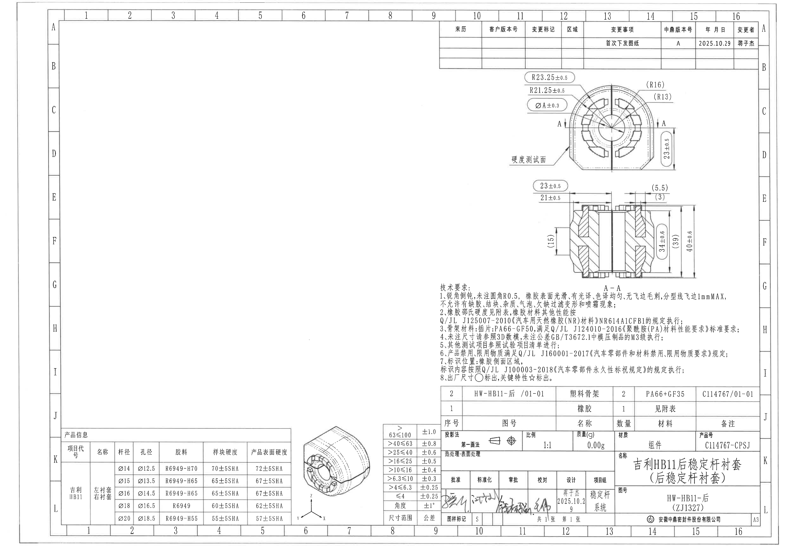
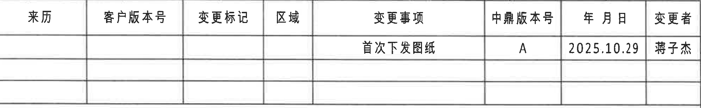
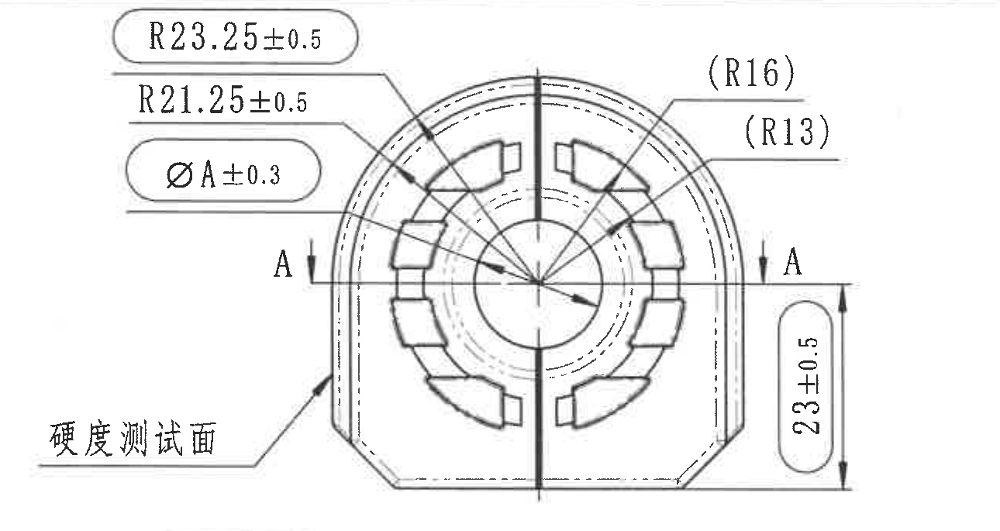
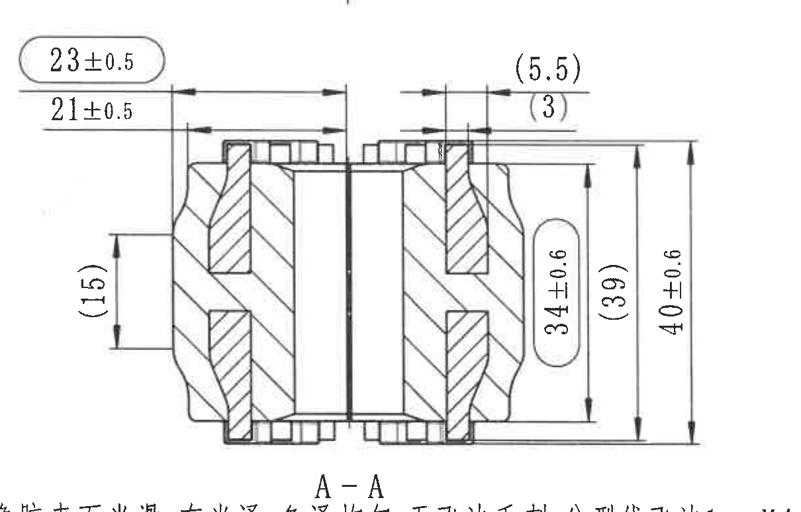
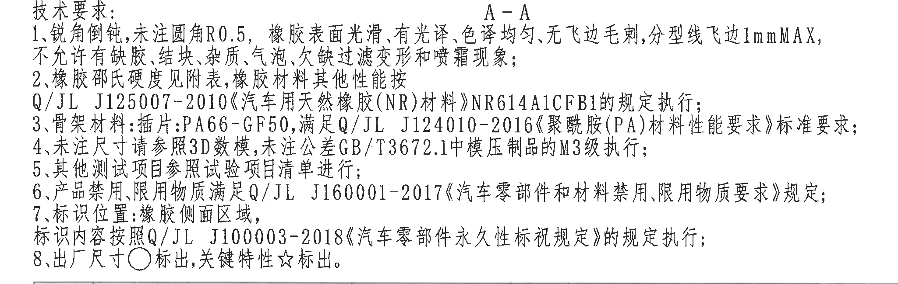
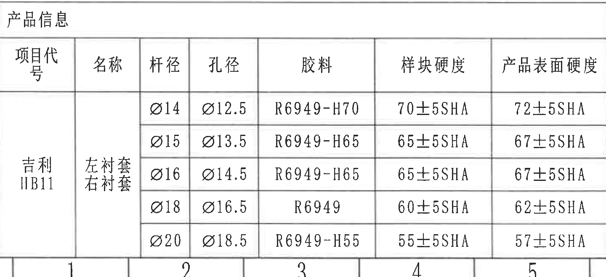
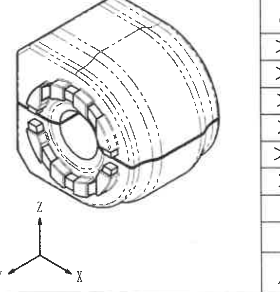
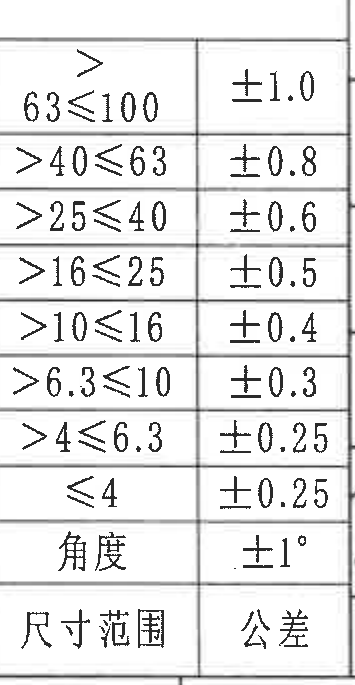
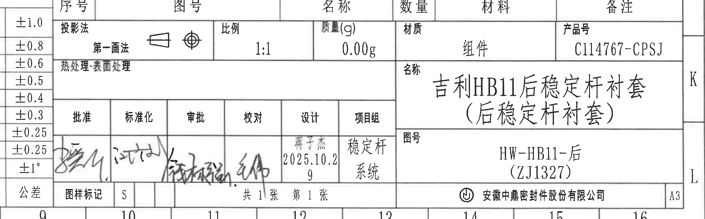
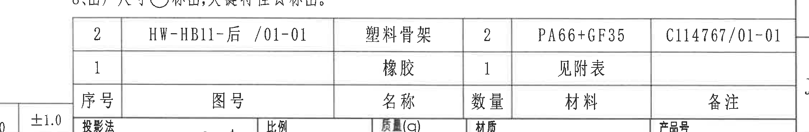

# 20C114767 内容识别

## 页面 1 整页图

| 提取项 | 原图数值或文本 | 含义说明 |
|---|---|---|
| 页面 | 1 | PDF 共 1 页，已先渲染为整页 PNG。 |
| 整页 PNG | `outputs/20C114767_assets/images/page_1.png` | 后续所有裁切对象均来自此整页图。 |
| 原图像素尺寸 | 4959 x 3505 | bbox 坐标以该 PNG 左上角为原点。 |

边界归属说明：整页图包含完整图框、所有视图、表格、技术要求和标题栏，不参与局部归属排除。

## object_1 - 修订履历表

原图位置/视图名称：页面 1 顶部右侧修订履历表，bbox `[2790, 135, 4780, 445]`。

| 来历 | 客户版本号 | 变更标记 | 区域 | 变更事项 | 中鼎版本号 | 年月日 | 变更者 |
|---|---|---|---|---|---|---|---|
|  |  |  |  | 首次下发图纸 | A | 2025.10.29 | 蒋子杰 |
|  |  |  |  |  |  |  |  |
|  |  |  |  |  |  |  |  |

| 提取项 | 原图数值或文本 | 含义说明 |
|---|---|---|
| 表头 | 来历、客户版本号、变更标记、区域、变更事项、中鼎版本号、年月日、变更者 | 修订履历字段。 |
| 变更事项 | 首次下发图纸 | 表示该版本为首次发行。 |
| 中鼎版本号 | A | 当前内部版本。 |
| 年月日 | 2025.10.29 | 发行/变更日期。 |
| 变更者 | 蒋子杰 | 变更责任人。 |

边界归属说明：裁切沿修订履历表外框取图；顶部图框坐标线已排除，表格下方不包含俯视图尺寸标注。

## object_2 - 俯视加工视图

原图位置/视图名称：页面 1 右上部俯视加工视图，含 A-A 剖切位置标记和硬度测试面指示，bbox `[3160, 440, 4450, 1125]`。

| 提取项 | 原图数值或文本 | 含义说明 |
|---|---|---|
| 半径尺寸 | R23.25±0.5 | 外侧圆弧半径，带公差 ±0.5；标注外框圆角表示关键/出厂尺寸标识。 |
| 半径尺寸 | R21.25±0.5 | 内侧同心圆弧半径，带公差 ±0.5。 |
| 直径/变量尺寸 | ØA±0.3 | 直径 A 尺寸，公差 ±0.3；A 为变量或由配套规格确定的直径值。 |
| 参考半径 | (R16) | 括号内参考尺寸，表示该圆弧半径仅供参考，不作为直接检验控制尺寸。 |
| 参考半径 | (R13) | 括号内参考尺寸，表示内侧相关圆弧半径仅供参考。 |
| 高度/宽度尺寸 | 23±0.5 | 右侧竖向总尺寸，带公差 ±0.5；标注外框圆角表示关键/出厂尺寸标识。 |
| 剖切标记 | A / A | 水平剖切线和箭头指向 A-A 剖视图；不属于主视图尺寸。 |
| 局部标注 | 硬度测试面 | 指向左下侧外表面，说明该处为硬度测试面位置。 |

边界归属说明：裁切保留本俯视图完整轮廓、剖切箭头、半径引出线、右侧 23±0.5 尺寸线和“硬度测试面”引出线；下方 A-A 剖视图的 23±0.5、21±0.5 等尺寸未纳入本视图提取。

## object_3 - A-A 剖视图

原图位置/视图名称：页面 1 右中部 A-A 剖视图，bbox `[3330, 1080, 4540, 1855]`。

| 提取项 | 原图数值或文本 | 含义说明 |
|---|---|---|
| 视图名称 | A-A | 由俯视图剖切线 A-A 得到的剖面视图。 |
| 横向尺寸 | 23±0.5 | 上方左侧横向总尺寸，带公差 ±0.5；标注外框圆角表示关键/出厂尺寸标识。 |
| 横向尺寸 | 21±0.5 | 上方左侧内侧横向尺寸，带公差 ±0.5。 |
| 参考横向尺寸 | (5.5) | 上方右侧参考尺寸，括号表示供参考。 |
| 参考横向尺寸 | (3) | 上方右侧参考尺寸，括号表示供参考。 |
| 参考竖向尺寸 | (15) | 左侧竖向参考尺寸，括号表示供参考。 |
| 竖向尺寸 | 34±0.6 | 右侧中部竖向尺寸，带公差 ±0.6；标注外框圆角表示关键/出厂尺寸标识。 |
| 参考竖向尺寸 | (39) | 右侧竖向参考总高，括号表示供参考。 |
| 竖向总尺寸 | 40±0.6 | 最右侧竖向总高度尺寸，带公差 ±0.6。 |

边界归属说明：裁切包含剖视图本体、全部剖面线、横向和竖向尺寸线及 A-A 标识；底部可见少量技术要求文字残边，仅因保留 A-A 标识，未计入剖视图提取。

## object_4 - 技术要求 / NOTES

原图位置/视图名称：页面 1 右中下部“技术要求”，bbox `[2700, 1788, 4750, 2438]`。

| 提取项 | 原图数值或文本 | 含义说明 |
|---|---|---|
| 标题 | 技术要求： | 本区域为 NOTES/技术要求。 |
| 1 | 锐角倒钝，未注圆角 R0.5，橡胶表面光滑、有光泽、色泽均匀、无飞边毛刺，分型线飞边 1mmMAX，不允许有缺胶、结块、杂质、气泡、欠缺过滤变形和喷霜现象； | 对倒角、未注圆角、橡胶表面质量、飞边上限和外观缺陷的要求。 |
| 2 | 橡胶邵氏硬度见附表，橡胶材料其他性能按 Q/JL J125007-2010《汽车用天然橡胶(NR)材料》NR614A1CFB1 的规定执行； | 橡胶硬度按附表，材料性能执行 Q/JL J125007-2010 和 NR614A1CFB1。 |
| 3 | 骨架材料：插件：PA66-GF50，满足 Q/JL J124010-2016《聚酰胺(PA)材料性能要求》标准要求； | 塑料骨架/插件材料及执行标准。 |
| 4 | 未注尺寸请参照 3D 数模，未注公差 GB/T3672.1 中模压制品的 M3 级执行； | 未标尺寸按 3D 数模，未注公差按 GB/T3672.1 M3 级。 |
| 5 | 其他测试项目参照试验项目清单进行； | 试验项目依据试验项目清单。 |
| 6 | 产品禁用、限用物质满足 Q/JL J160001-2017《汽车零部件和材料禁用、限用物质要求》规定； | 限用物质合规要求。 |
| 7 | 标识位置：橡胶侧面区域，标识内容按照 Q/JL J100003-2018《汽车零部件永久性标识规定》的规定执行； | 标识位置和永久性标识标准。 |
| 8 | 出厂尺寸 ○ 标出，关键特性 ☆ 标出。 | 圆圈标识为出厂尺寸；星号标识为关键特性。 |

边界归属说明：裁切仅覆盖技术要求文本区；上方 A-A 剖视图和下方零件清单/标题栏不归入本区域。

## object_5 - 产品信息表

原图位置/视图名称：页面 1 左下角“产品信息”表，bbox `[390, 2695, 1830, 3355]`。

| 项目代号 | 名称 | 杆径 | 孔径 | 胶料 | 样块硬度 | 产品表面硬度 |
|---|---|---|---|---|---|---|
| 吉利 HB11 | 左衬套 / 右衬套 | Ø14 | Ø12.5 | R6949-H70 | 70±5SHA | 72±5SHA |
| 吉利 HB11 | 左衬套 / 右衬套 | Ø15 | Ø13.5 | R6949-H65 | 65±5SHA | 67±5SHA |
| 吉利 HB11 | 左衬套 / 右衬套 | Ø16 | Ø14.5 | R6949-H65 | 65±5SHA | 67±5SHA |
| 吉利 HB11 | 左衬套 / 右衬套 | Ø18 | Ø16.5 | R6949 | 60±5SHA | 62±5SHA |
| 吉利 HB11 | 左衬套 / 右衬套 | Ø20 | Ø18.5 | R6949-H55 | 55±5SHA | 57±5SHA |

| 提取项 | 原图数值或文本 | 含义说明 |
|---|---|---|
| 表名 | 产品信息 | 对不同杆径/孔径规格的胶料和硬度要求汇总。 |
| 直径前缀 | Ø | 杆径、孔径均为直径尺寸。 |
| 硬度单位 | SHA | 邵氏 A 硬度。 |

边界归属说明：裁切包含产品信息表标题、表头、全部 5 行数据和外框；右侧等轴测视图坐标轴及底部图框坐标不计入本表。

## object_6 - 等轴测视图

原图位置/视图名称：页面 1 下部中间等轴测视图，bbox `[1880, 2700, 2455, 3300]`。

| 提取项 | 原图数值或文本 | 含义说明 |
|---|---|---|
| 视图类型 | 等轴测视图 | 展示零件三维外形、端面齿状/槽形结构和外圆轮廓。 |
| 坐标方向 | X、Y、Z | 辅助说明三维方向。 |
| 尺寸标注 | 无 | 本视图未给出独立尺寸、角度、弧度或公差。 |

边界归属说明：裁切保留完整三维零件外形和 X/Y/Z 坐标轴；右侧可见相邻公差表边框线，未提取为等轴测视图内容。

## object_7 - 未注尺寸公差表

原图位置/视图名称：页面 1 底部中间偏右尺寸范围/公差表，bbox `[2430, 2635, 2785, 3320]`。

| 尺寸范围 | 公差 |
|---|---|
| >63≤100 | ±1.0 |
| >40≤63 | ±0.8 |
| >25≤40 | ±0.6 |
| >16≤25 | ±0.5 |
| >10≤16 | ±0.4 |
| >6.3≤10 | ±0.3 |
| >4≤6.3 | ±0.25 |
| ≤4 | ±0.25 |
| 角度 | ±1° |

| 提取项 | 原图数值或文本 | 含义说明 |
|---|---|---|
| 表头 | 尺寸范围 / 公差 | 未注线性尺寸及角度的通用公差表。 |
| 线性尺寸范围 | >63≤100 到 ≤4 | 按尺寸区间给出通用公差。 |
| 角度公差 | ±1° | 未注角度尺寸公差。 |

边界归属说明：裁切只包含尺寸范围/公差两列，右侧标题栏签字格和下方图框坐标已排除。

## object_8 - 标题栏

原图位置/视图名称：页面 1 右下角标题栏，bbox `[2610, 2650, 4860, 3350]`。

| 提取项 | 原图数值或文本 | 含义说明 |
|---|---|---|
| 投影法 | 第一画法 | 图样投影方法；旁有第一角法投影符号。 |
| 比例 | 1:1 | 图样比例。 |
| 质量(g) | 0.00g | 图样质量字段。 |
| 材质 | 组件 | 标题栏材质字段。 |
| 产品号 | C114767-CPSJ | 产品编号。 |
| 热处理/表面处理 | 空白 | 未填写热处理或表面处理要求。 |
| 名称 | 吉利 HB11 后稳定杆衬套（后稳定杆衬套） | 零件/组件名称。 |
| 图号 | HW-HB11-后（ZJ1327） | 图样编号。 |
| 批准 | 手写签名 | 批准签署栏。 |
| 标准化 | 手写签名 | 标准化签署栏。 |
| 审批 | 手写签名 | 审批签署栏。 |
| 校对 | 手写签名 | 校对签署栏。 |
| 设计 | 蒋子杰 / 2025.10.29 | 设计人员和日期。 |
| 项目组 | 稳定杆系统 | 项目组名称。 |
| 图样标记 | S | 图样标记字段。 |
| 页数 | 共 1 张 第 1 张 | 图样总张数和当前张。 |
| 公司 | 安徽中鼎密封件股份有限公司 | 出图单位。 |
| 图幅 | A3 | 图纸幅面。 |

边界归属说明：裁切保留标题栏主体字段、签署栏、页码和公司栏；左侧可见相邻公差表边界值列残边，未作为标题栏内容提取；顶部清单表共享边界处的“序号/图号/名称/数量/材料/备注”属于 object_9。

## object_9 - 零件清单表

原图位置/视图名称：页面 1 右下角标题栏上方零件清单表，bbox `[2575, 2385, 4825, 2755]`。

| 序号 | 图号 | 名称 | 数量 | 材料 | 备注 |
|---|---|---|---|---|---|
| 2 | HW-HB11-后 /01-01 | 塑料骨架 | 2 | PA66+GF35 | C114767/01-01 |
| 1 |  | 橡胶 | 1 | 见附表 |  |

| 提取项 | 原图数值或文本 | 含义说明 |
|---|---|---|
| 表头 | 序号、图号、名称、数量、材料、备注 | 零件/材料清单字段。 |
| 序号 2 | HW-HB11-后 /01-01；塑料骨架；数量 2；PA66+GF35；C114767/01-01 | 塑料骨架明细。 |
| 序号 1 | 橡胶；数量 1；见附表 | 橡胶材料明细，材料参数见附表。 |

边界归属说明：裁切保留清单表的序号列、图号列、名称列、数量列、材料列和备注列；底部可见标题栏上沿“投影法/比例/质量(g)/材质/产品号”局部残边，未作为清单表内容提取。

## 裁切检查记录

| 对象 | 图片路径 | 检查结果 | 边界处理记录 |
|---|---|---|---|
| page_1 | `outputs/20C114767_assets/images/page_1.png` | 完整 | 整页渲染图包含完整图框和所有对象。 |
| object_1 | `outputs/20C114767_assets/images/object_1.png` | 完整 | 修订履历表外框、表头和记录完整；未混入下方俯视图。 |
| object_2 | `outputs/20C114767_assets/images/object_2.png` | 完整 | 重裁后包含所有半径、直径、高度尺寸线和硬度测试面引出线；未提取下方剖视图尺寸。 |
| object_3 | `outputs/20C114767_assets/images/object_3.png` | 完整 | 包含 A-A 标识、剖面线和全部尺寸文字/箭头；底部少量 NOTES 残边不归属本对象。 |
| object_4 | `outputs/20C114767_assets/images/object_4.png` | 完整 | 重裁扩展右边界后 1-8 条技术要求文字完整。 |
| object_5 | `outputs/20C114767_assets/images/object_5.png` | 完整 | 重裁后包含“产品信息”标题、列头和全部 5 行数据；排除等轴测视图坐标轴。 |
| object_6 | `outputs/20C114767_assets/images/object_6.png` | 完整 | 零件等轴测外形和 X/Y/Z 坐标完整；右侧仅邻接公差表边框线，未提取其内容。 |
| object_7 | `outputs/20C114767_assets/images/object_7.png` | 完整 | 重裁后两列表格完整，未混入标题栏签字格。 |
| object_8 | `outputs/20C114767_assets/images/object_8.png` | 完整 | 标题栏主体字段、签署栏、公司栏和 A3 图幅完整；左侧公差表残边排除。 |
| object_9 | `outputs/20C114767_assets/images/object_9.png` | 完整 | 清单表六列表头和两行明细完整；底部标题栏残边排除。 |
