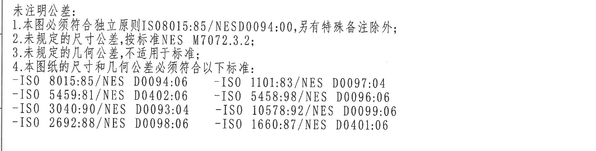
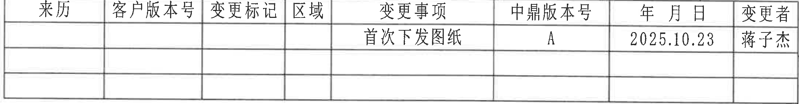
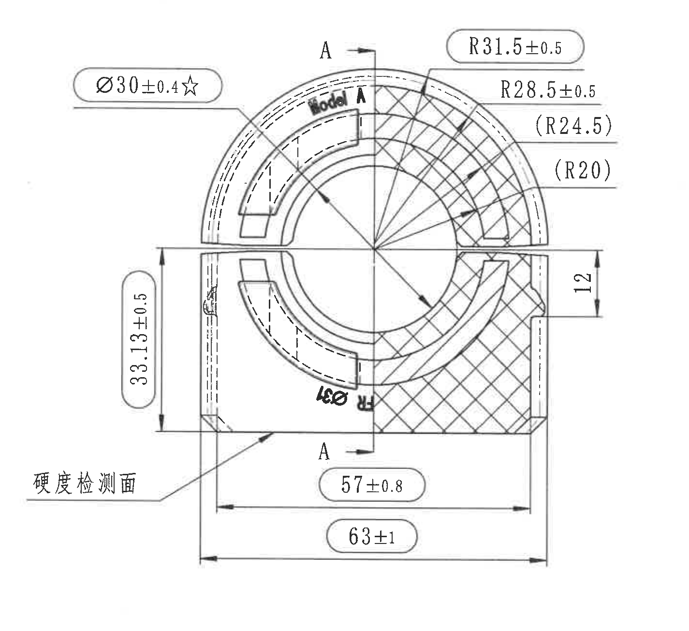
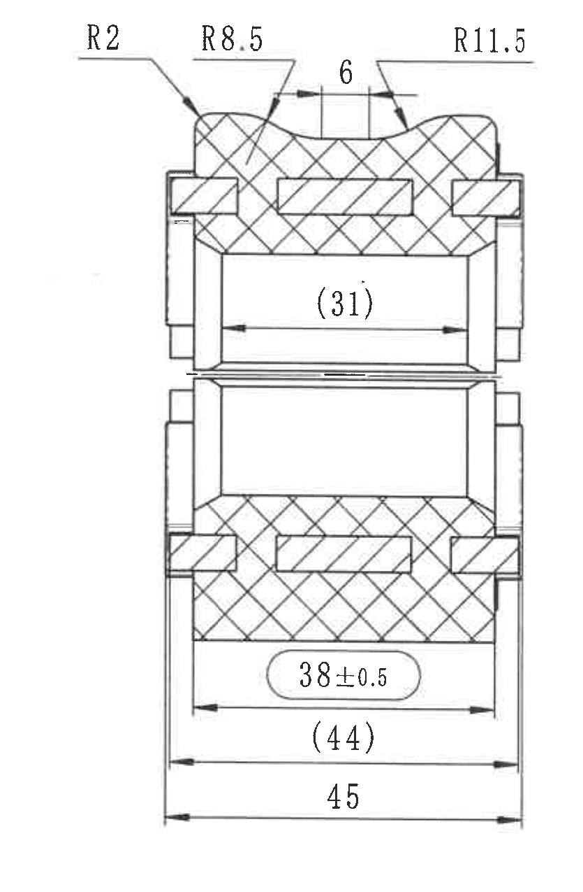
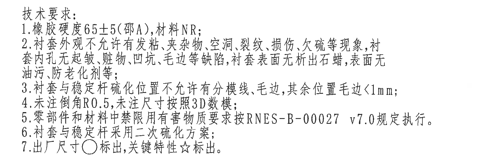
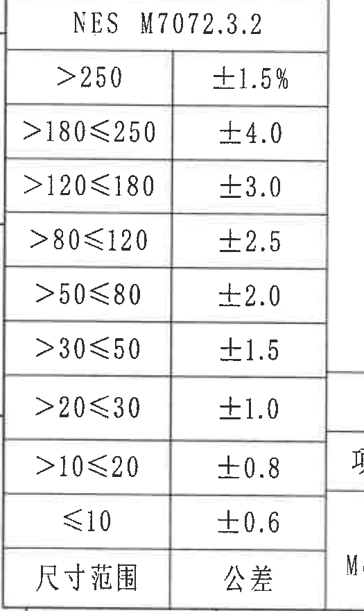
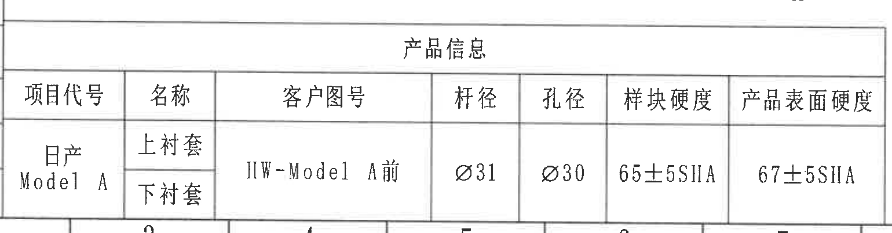
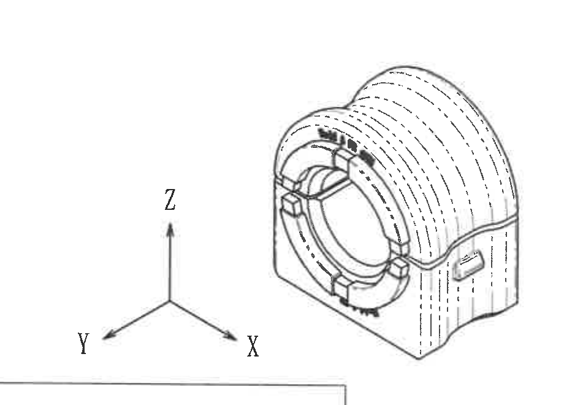
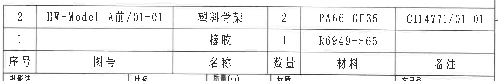
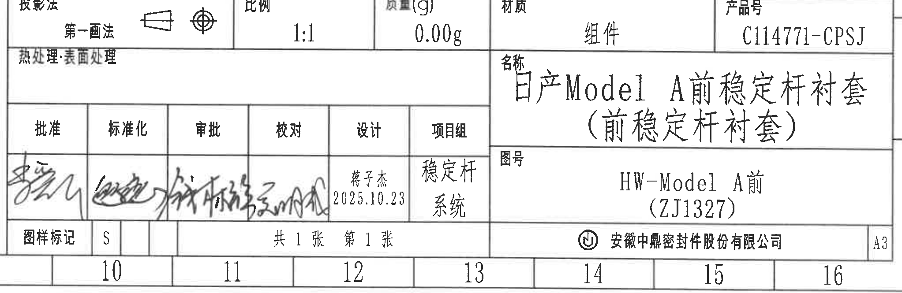

# 20C114771 图纸内容识别

PDF 已按 300 DPI 渲染为整页 PNG：`20C114771_assets/images/page_1.png`，整页像素尺寸 4959 x 3505。

## object_1：未注明公差 NOTES

原图位置/视图名称：第 1 页左上角说明区，bbox `[380, 180, 2200, 560]`。

| 提取项 | 原图数值或文本 | 含义说明 |
|---|---|---|
| 标题 | 未注明公差: | 该区规定本图未单独标出的尺寸、公差和几何公差引用规则。 |
| 1 | 本图必须符合独立原则 ISO8015:85/NESD0094:00, 另有特殊备注除外; | 图纸尺寸适用独立原则；除非另有特殊备注。 |
| 2 | 未规定的尺寸公差,按标准 NES M7072.3.2; | 未单独标注公差的尺寸按 NES M7072.3.2 执行。 |
| 3 | 未规定的几何公差,不适用于标准; | 未规定几何公差时不套用标准几何公差。 |
| 4 | 本图纸的尺寸和几何公差必须符合以下标准: | 下列 ISO/NES 标准为本图尺寸与几何公差的依据。 |
| 标准 | ISO 8015:85/NES D0094:06 | 独立原则/尺寸公差相关标准。 |
| 标准 | ISO 5459:81/NES D0402:06 | 基准和基准体系相关标准。 |
| 标准 | ISO 3040:90/NES D0093:04 | 倒角/边缘相关标准。 |
| 标准 | ISO 2692:88/NES D0098:06 | 最大实体要求等几何公差相关标准。 |
| 标准 | ISO 1101:83/NES D0097:04 | 几何公差标注标准。 |
| 标准 | ISO 5458:98/NES D0096:06 | 位置度/组合公差相关标准。 |
| 标准 | ISO 10578:92/NES D0099:06 | 方向/位置相关补充标准。 |
| 标准 | ISO 1660:87/NES D0401:06 | 轮廓度等几何公差相关标准。 |

边界归属说明：该裁切只包含左上角未注明公差文本区；未包含右侧修订履历表，未提取图框坐标字母或上边框格号。

## object_2：修订履历表

原图位置/视图名称：第 1 页右上角修订履历表，bbox `[2610, 185, 2175, 285]`。

原表还原：

| 来历 | 客户版本号 | 变更标记 | 区域 | 变更事项 | 中鼎版本号 | 年 月 日 | 变更者 |
|---|---|---|---|---|---|---|---|
|  |  |  |  | 首次下发图纸 | A | 2025.10.23 | 蒋子杰 |
|  |  |  |  |  |  |  |  |
|  |  |  |  |  |  |  |  |

| 提取项 | 原图数值或文本 | 含义说明 |
|---|---|---|
| 表头 | 来历、客户版本号、变更标记、区域、变更事项、中鼎版本号、年 月 日、变更者 | 修订履历字段。 |
| 修订记录 1 | 首次下发图纸 / A / 2025.10.23 / 蒋子杰 | 首次发布图纸，中鼎版本号为 A，变更者为蒋子杰。 |
| 空白记录行 | 两行空白 | 原表保留的未填写修订记录行。 |

边界归属说明：表格右侧紧邻图框坐标栏，裁切保留表格右外框和“变更者”列；右侧图框坐标字母 A/B 不属于修订履历表，未提取。

## object_3：主加工剖视/Model A 前方向端部视图

原图位置/视图名称：第 1 页中右部主加工剖视，bbox `[2485, 570, 1425, 1305]`。

| 提取项 | 原图数值或文本 | 含义说明 |
|---|---|---|
| 视图标识 | Model A | 该加工视图对应 Model A 方向/状态。 |
| 剖切标识 | A、A | 上下两处 A 与箭头表示 A-A 剖切方向/剖切位置。 |
| 关键直径 | Ø30±0.4☆ | 直径 30，公差 ±0.4，星号表示关键特性；与内孔/孔径控制相关。 |
| 外弧半径 | R31.5±0.5 | 上部外弧半径，公差 ±0.5。 |
| 中间弧半径 | R28.5±0.5 | 上部中间弧半径，公差 ±0.5。 |
| 参考弧半径 | (R24.5) | 括号内参考半径，用于表达几何关系，不作为独立检验控制尺寸。 |
| 参考弧半径 | (R20) | 括号内参考半径，用于表达内侧弧线几何关系。 |
| 右侧高度/槽口尺寸 | 12 | 右侧竖向尺寸，未单独给出公差，按未注明尺寸公差规则。 |
| 左侧高度 | 33.13±0.5 | 左侧竖向高度尺寸，公差 ±0.5。 |
| 下部宽度 | 57±0.8 | 下部内侧/局部宽度尺寸，公差 ±0.8。 |
| 总宽度 | 63±1 | 下部总体宽度尺寸，公差 ±1。 |
| 直径标注 | Ø31 | 底部旋转标注可见为 Ø31，未见单独公差；与产品信息表中的杆径 Ø31 对应。 |
| 检测面 | 硬度检测面 | 引出线指向底部平面，表示硬度检测位置。 |
| 局部模糊字符 | R | Ø31 附近可见旋转字符 R，但未见完整数值；不作为独立尺寸值提取。 |
| T 编号 | 未见 T 编号 | 当前视图未标出 T 编号。 |

边界归属说明：该裁切包含主加工剖视内所有可见尺寸线、箭头和文字；右侧独立剖视的尺寸未混入本对象。右边界靠近右侧剖视，但未提取其 `R2/R8.5/6/R11.5` 等标注。

## object_4：右侧剖面视图

原图位置/视图名称：第 1 页右侧剖面视图，bbox `[3820, 555, 835, 1275]`。

| 提取项 | 原图数值或文本 | 含义说明 |
|---|---|---|
| 顶部圆角 | R2 | 顶部左侧圆角半径。 |
| 顶部弧半径 | R8.5 | 顶部中间弧形凹/凸特征半径。 |
| 顶部槽宽 | 6 | 顶部中央凹槽/开口宽度尺寸，未单独给出公差。 |
| 顶部右侧弧半径 | R11.5 | 顶部右侧弧形特征半径。 |
| 上部参考宽度 | (31) | 括号内参考尺寸，表示上部内侧跨距关系，不作为独立检验控制尺寸。 |
| 下部宽度 | 38±0.5 | 下部内侧宽度，公差 ±0.5。 |
| 下部参考宽度 | (44) | 括号内参考尺寸，表示下部中间宽度关系。 |
| 总宽度 | 45 | 下部整体宽度，未单独给出公差，按未注明尺寸公差规则。 |
| T 编号 | 未见 T 编号 | 当前剖面视图未标出 T 编号。 |

边界归属说明：左侧边界扩展到完整包含 `R2` 引出线和文字；右侧裁到视图外侧，未包含图框坐标栏。该区域只提取右侧剖面视图尺寸，不把主视图半径标注归入此对象。

## object_5：技术要求 NOTES

原图位置/视图名称：第 1 页中下部技术要求文本，bbox `[2700, 1870, 1740, 570]`。

| 提取项 | 原图数值或文本 | 含义说明 |
|---|---|---|
| 标题 | 技术要求: | 制造、材料、外观和检验要求。 |
| 1 | 橡胶硬度65±5(邵A), 材料NR; | 橡胶硬度为 Shore A 65±5，材料为 NR。 |
| 2 | 衬套外观不允许有发粘、夹杂物、空洞、裂纹、损伤、欠硫等现象，衬套内孔无起皱、脏物、凹坑、毛边等缺陷，衬套表面无析出石蜡，表面无油污、防老化剂等; | 外观、内孔和表面缺陷限制。 |
| 3 | 衬套与稳定杆硫化位置不允许有分模线、毛边，其余位置毛边<1mm; | 硫化位置不得有分模线和毛边，其他位置毛边小于 1 mm。 |
| 4 | 未注倒角R0.5, 未注尺寸按照3D数模; | 未注明倒角按 R0.5；未注明尺寸以 3D 数模为准。 |
| 5 | 零部件和材料中禁限用有害物质要求按 RNES-B-00027 v7.0 规定执行。 | 有害物质限制按 RNES-B-00027 v7.0。 |
| 6 | 衬套与稳定杆采用二次硫化方案; | 工艺方案为二次硫化。 |
| 7 | 出厂尺寸○标出, 关键特性☆标出。 | 圆圈标识出厂尺寸，星号标识关键特性。 |

边界归属说明：该裁切只包含技术要求文字；右侧图框坐标栏已排除，下方 BOM/标题栏不属于该 NOTES 区域。

## object_6：NES M7072.3.2 尺寸公差表

原图位置/视图名称：第 1 页左下角尺寸公差表，bbox `[370, 2460, 525, 880]`。

原表还原：

| 尺寸范围 | 公差 |
|---|---|
| >250 | ±1.5% |
| >180≤250 | ±4.0 |
| >120≤180 | ±3.0 |
| >80≤120 | ±2.5 |
| >50≤80 | ±2.0 |
| >30≤50 | ±1.5 |
| >20≤30 | ±1.0 |
| >10≤20 | ±0.8 |
| ≤10 | ±0.6 |

| 提取项 | 原图数值或文本 | 含义说明 |
|---|---|---|
| 表题 | NES M7072.3.2 | 与未注明尺寸公差说明第 2 条对应。 |
| 表头 | 尺寸范围 / 公差 | 原图字段位于表格底部；此处按 Markdown 表头形式还原。 |
| 公差规则 | >250: ±1.5% | 大于 250 的尺寸按百分比公差。 |
| 公差规则 | >180≤250: ±4.0 | 尺寸大于 180 且小于等于 250。 |
| 公差规则 | >120≤180: ±3.0 | 尺寸大于 120 且小于等于 180。 |
| 公差规则 | >80≤120: ±2.5 | 尺寸大于 80 且小于等于 120。 |
| 公差规则 | >50≤80: ±2.0 | 尺寸大于 50 且小于等于 80。 |
| 公差规则 | >30≤50: ±1.5 | 尺寸大于 30 且小于等于 50。 |
| 公差规则 | >20≤30: ±1.0 | 尺寸大于 20 且小于等于 30。 |
| 公差规则 | >10≤20: ±0.8 | 尺寸大于 10 且小于等于 20。 |
| 公差规则 | ≤10: ±0.6 | 小于等于 10 的尺寸。 |

边界归属说明：该裁切保留完整公差表边框与全部行列；右侧相邻产品信息表边缘不属于本表，未提取。

## object_7：产品信息表

原图位置/视图名称：第 1 页底部偏左产品信息表，bbox `[835, 2960, 1540, 405]`。

原表还原：

| 项目代号 | 名称 | 客户图号 | 杆径 | 孔径 | 样块硬度 | 产品表面硬度 |
|---|---|---|---|---|---|---|
| 日产 Model A | 上衬套 | HW-Model A前 | Ø31 | Ø30 | 65±5SHA | 67±5SHA |
| 日产 Model A | 下衬套 | HW-Model A前 | Ø31 | Ø30 | 65±5SHA | 67±5SHA |

| 提取项 | 原图数值或文本 | 含义说明 |
|---|---|---|
| 表题 | 产品信息 | 产品项目、客户图号、直径和硬度信息。 |
| 项目代号 | 日产 Model A | 对应项目/车型。 |
| 名称 | 上衬套、下衬套 | 原图名称列分上下两行。 |
| 客户图号 | HW-Model A前 | 客户图号。 |
| 杆径 | Ø31 | 杆径直径尺寸。 |
| 孔径 | Ø30 | 孔径直径尺寸。 |
| 样块硬度 | 65±5SHA | 样块 Shore A 硬度。 |
| 产品表面硬度 | 67±5SHA | 产品表面 Shore A 硬度。 |

边界归属说明：表格主体完整；底部紧邻图框坐标编号，露出的少量坐标线/数字不属于产品信息表，未作为表格字段提取。

## object_8：等轴测视图

原图位置/视图名称：第 1 页底部中部等轴测图，bbox `[1800, 2380, 920, 660]`。

| 提取项 | 原图数值或文本 | 含义说明 |
|---|---|---|
| 视图类型 | 等轴测外观视图 | 用于显示零件三维外形、端部开口、外圆弧和侧面结构。 |
| 坐标轴 | X | 三维坐标方向标识。 |
| 坐标轴 | Y | 三维坐标方向标识。 |
| 坐标轴 | Z | 三维坐标方向标识。 |
| 尺寸标注 | 未见独立尺寸数值 | 该视图只用于形状展示，尺寸以主加工剖视和剖面视图为准。 |
| T 编号 | 未见 T 编号 | 当前等轴测视图未标出 T 编号。 |

边界归属说明：该裁切完整包含等轴测零件和 X/Y/Z 坐标轴；底部露出的产品信息表边线不属于等轴测视图，未提取。

## object_9：明细表/BOM 表

原图位置/视图名称：第 1 页右下标题栏上方明细表，bbox `[2755, 2455, 2035, 335]`。

原表还原：

| 序号 | 图号 | 名称 | 数量 | 材料 | 备注 |
|---|---|---|---|---|---|
| 2 | HW-Model A前/01-01 | 塑料骨架 | 2 | PA66+GF35 | C114771/01-01 |
| 1 |  | 橡胶 | 1 | R6949-H65 |  |

| 提取项 | 原图数值或文本 | 含义说明 |
|---|---|---|
| 表头 | 序号、图号、名称、数量、材料、备注 | 明细/BOM 字段。 |
| 明细 2 | HW-Model A前/01-01 / 塑料骨架 / 2 / PA66+GF35 / C114771/01-01 | 塑料骨架用量 2，材料 PA66+GF35，备注为 C114771/01-01。 |
| 明细 1 | 橡胶 / 1 / R6949-H65 | 橡胶用量 1，材料 R6949-H65；图号和备注为空。 |

边界归属说明：该裁切保留明细表完整主体；下方露出的标题栏投影法行不属于 BOM 表，未提取为 BOM 字段。

## object_10：标题栏主体

原图位置/视图名称：第 1 页右下角标题栏主体，bbox `[2750, 2775, 2045, 665]`。

标题栏字段还原：

| 字段 | 原图数值或文本 |
|---|---|
| 投影法 | 第一画法 |
| 比例 | 1:1 |
| 质量(g) | 0.00g |
| 材质 | 组件 |
| 产品号 | C114771-CPSJ |
| 热处理:表面处理 | 空白 |
| 名称 | 日产Model A前稳定杆衬套（前稳定杆衬套） |
| 图号 | HW-Model A前（ZJ1327） |
| 图样标记 | S |
| 页数 | 共 1 张 第 1 张 |
| 图幅 | A3 |
| 公司 | 安徽中鼎密封件股份有限公司 |

签审栏还原：

| 批准 | 标准化 | 审批 | 校对 | 设计 | 项目组 |
|---|---|---|---|---|---|
| 手写签名 | 手写签名 | 手写签名 | 手写签名 | 蒋子杰 2025.10.23 | 稳定杆系统 |

| 提取项 | 原图数值或文本 | 含义说明 |
|---|---|---|
| 投影法 | 第一画法 | 图样采用第一角投影法。 |
| 比例 | 1:1 | 图样比例为 1:1。 |
| 质量 | 0.00g | 标题栏质量字段。 |
| 材质 | 组件 | 标题栏材质字段。 |
| 产品号 | C114771-CPSJ | 产品编号。 |
| 名称 | 日产Model A前稳定杆衬套（前稳定杆衬套） | 零件/组件名称。 |
| 图号 | HW-Model A前（ZJ1327） | 图纸编号/项目编号。 |
| 图样标记 | S | 图样标记字段。 |
| 图幅 | A3 | 图纸幅面。 |
| 签审 | 批准、标准化、审批、校对、设计、项目组 | 签审责任栏；部分为手写签名。 |

边界归属说明：标题栏主体与外侧图框坐标编号相邻；裁切保留标题栏内 A3、公司名、图号、名称和签审栏。底部露出的图框坐标数字 10-16 不属于标题栏字段，未提取。

## 裁切检查记录

| 对象 | 检查结果 |
|---|---|
| object_1 | 完整包含未注明公差文字；无右侧文本截断；未混入修订表。 |
| object_2 | 完整包含修订履历表表头、有效记录和空白记录行；右侧图框坐标栏未提取。 |
| object_3 | 完整包含主加工剖视的尺寸线、箭头、半径/直径/参考尺寸文字和硬度检测面引出线；未混入右侧剖视尺寸。 |
| object_4 | 完整包含右侧剖面视图及 `R2/R8.5/6/R11.5/(31)/38±0.5/(44)/45` 的尺寸线和文字；未包含图框坐标栏。 |
| object_5 | 完整包含技术要求 1-7 条；未混入下方 BOM 表。 |
| object_6 | 完整包含 NES M7072.3.2 公差表全部行列和边框；右侧相邻表格未提取。 |
| object_7 | 完整包含产品信息表主体及字段；底部相邻图框坐标编号有少量露出，但未作为表格内容提取。 |
| object_8 | 完整包含等轴测零件和 X/Y/Z 坐标轴；底部产品信息表边线露出，未作为视图内容提取。 |
| object_9 | 完整包含明细表两条记录和表头；下方标题栏边缘露出，未作为 BOM 内容提取。 |
| object_10 | 完整包含标题栏主体、投影法/比例/质量/材质/产品号、名称、图号、签审栏、公司名和 A3；底部图框坐标数字露出，未作为标题栏字段提取。 |
