# 20C114772 PDF 内容识别

整页渲染图：`outputs/20C114772_assets/images/page_1.png`  
页面尺寸：4959 x 3505 px，bbox `[0, 0, 4959, 3505]`。

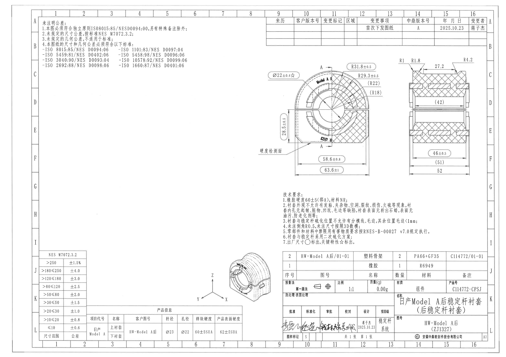

## object_1 - 未注明公差说明

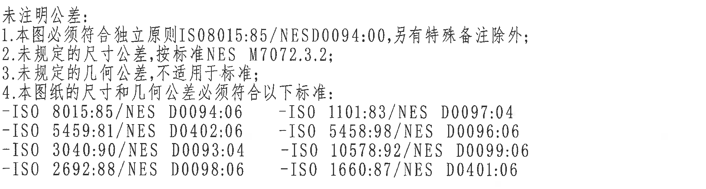

原图位置/视图名称：第 1 页左上说明区，bbox `[410, 185, 2310, 695]`，object_kind `notes`。

| 提取项 | 原图数值或文本 | 含义说明 |
|---|---|---|
| 标题 | 未注明公差: | 本块为图纸通用公差与标准说明。 |
| 1 | 本图必须符合独立原则ISO8015:85/NESD00094:00,另有特殊备注除外; | 尺寸独立原则要求，除特殊备注外执行。 |
| 2 | 未规定的尺寸公差,按标准NES M7072.3.2; | 未单独标注公差的尺寸按 NES M7072.3.2，左下 object_6 给出分档表。 |
| 3 | 未规定的几何公差,不适用于标准; | 未规定的几何公差不按通用标准补充适用。 |
| 4 | 本图纸的尺寸和几何公差必须符合以下标准: | 后续列出尺寸与几何公差相关标准。 |
| 标准 | ISO 8015:85/NES D0094:06 | 标准清单左列第 1 项。 |
| 标准 | ISO 5459:81/NES D0402:06 | 标准清单左列第 2 项。 |
| 标准 | ISO 3040:90/NES D0093:04 | 标准清单左列第 3 项。 |
| 标准 | ISO 2692:88/NES D0098:06 | 标准清单左列第 4 项。 |
| 标准 | ISO 1101:83/NES D0097:04 | 标准清单右列第 1 项。 |
| 标准 | ISO 5458:98/NES D0096:06 | 标准清单右列第 2 项。 |
| 标准 | ISO 10578:92/NES D0099:06 | 标准清单右列第 3 项。 |
| 标准 | ISO 1660:87/NES D0401:06 | 标准清单右列第 4 项。 |

边界归属说明：该裁切只包含左上说明文字；右上修订履历表和中部零件视图未纳入本对象。

## object_2 - 修订履历表

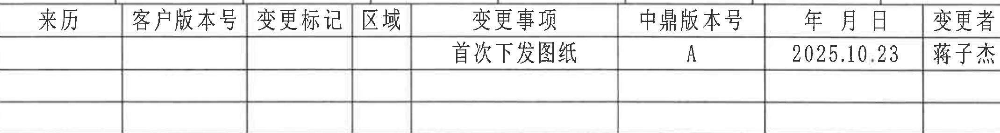

原图位置/视图名称：第 1 页右上修订履历表，bbox `[2620, 160, 4760, 445]`，object_kind `table`。

原表还原：

| 来历 | 客户版本号 | 变更标记 | 区域 | 变更事项 | 中鼎版本号 | 年 月 日 | 变更者 |
|---|---|---|---|---|---|---|---|
|  |  |  |  | 首次下发图纸 | A | 2025.10.23 | 蒋子杰 |
|  |  |  |  |  |  |  |  |
|  |  |  |  |  |  |  |  |

| 提取项 | 原图数值或文本 | 含义说明 |
|---|---|---|
| 表头 | 来历、客户版本号、变更标记、区域、变更事项、中鼎版本号、年 月 日、变更者 | 修订履历字段。 |
| 修订记录 | 变更事项: 首次下发图纸; 中鼎版本号: A; 年月日: 2025.10.23; 变更者: 蒋子杰 | 首次发图记录。 |
| 空白记录行 | 2 行空白 | 原图保留空白行，未填写内容。 |

边界归属说明：该裁切仅覆盖修订履历表格；下方侧向剖视图中的 R1、R1.8、R4.2 等尺寸未纳入本对象。

## object_3 - 主视图/半剖视图

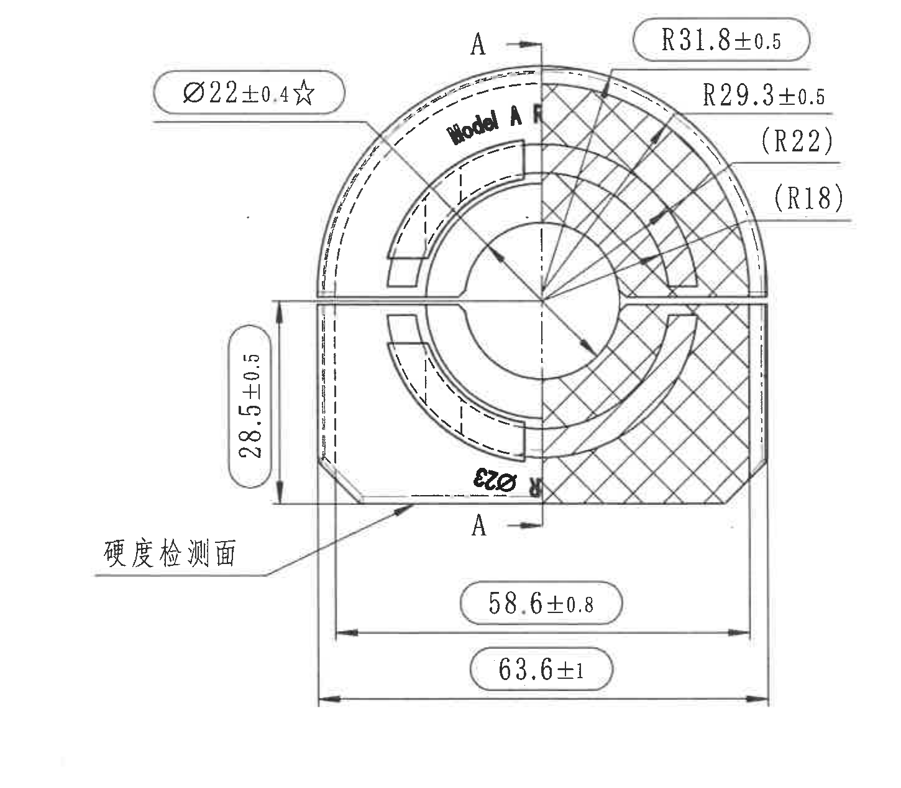

原图位置/视图名称：第 1 页中上主加工视图，bbox `[2380, 590, 3830, 1860]`，object_kind `section`。

| 提取项 | 原图数值或文本 | 含义说明 |
|---|---|---|
| 视图标识 | Model A 后 | 零件适用车型/方向标识，位于圆弧区域内。 |
| 剖切标识 | A-A | 上下两处 A 与箭头指示剖切/视图方向；不是带框 GD&T 基准字母。 |
| 直径尺寸 | Ø22±0.4☆ | 带直径符号和星号的关键尺寸；星号按技术要求 object_5 表示关键特性。 |
| 半径尺寸 | R31.8±0.5 | 外侧圆弧半径尺寸，外框标出，属于出厂尺寸标注样式。 |
| 半径尺寸 | R29.3±0.5 | 内侧/相邻圆弧半径尺寸，带 ±0.5 公差。 |
| 参考半径 | (R22) | 括号内参考半径，位于右侧上部引线；作为参考尺寸保留，不作为遗漏项。 |
| 参考半径 | (R18) | 括号内参考半径，位于右侧中部引线；作为参考尺寸保留。 |
| 垂直尺寸 | 28.5±0.5 | 左侧垂直方向高度/台阶尺寸，带 ±0.5 公差。 |
| 直径尺寸 | Ø23 | 视图内靠下、旋转文字标注的直径尺寸；未在该处显示单独公差，按未注尺寸规则关联 object_1/object_6。 |
| 水平尺寸 | 58.6±0.8 | 底部内侧水平尺寸，外框标出，属于出厂尺寸标注样式。 |
| 水平总尺寸 | 63.6±1 | 底部外侧总体水平尺寸，外框标出，带 ±1 公差。 |
| 检测面标识 | 硬度检测面 | 左下引线指向底部检测面。 |
| 角度 | 未见角度标注 | 本视图无角度数值。 |
| 数量前缀 | 未见数量前缀 | 本视图尺寸前未见 2X、4X 等数量前缀。 |
| T 编号 | 未见 T 编号 | 本视图未出现 T 编号。 |

边界归属说明：该裁切完整包含主视图的外形、剖面线、A-A 标识、左侧硬度检测面引线和底部 58.6±0.8、63.6±1 尺寸线；未包含右侧侧向剖视图的 R1/R1.8/R4.2/27.2/52 等尺寸。

## object_4 - 侧向剖视图

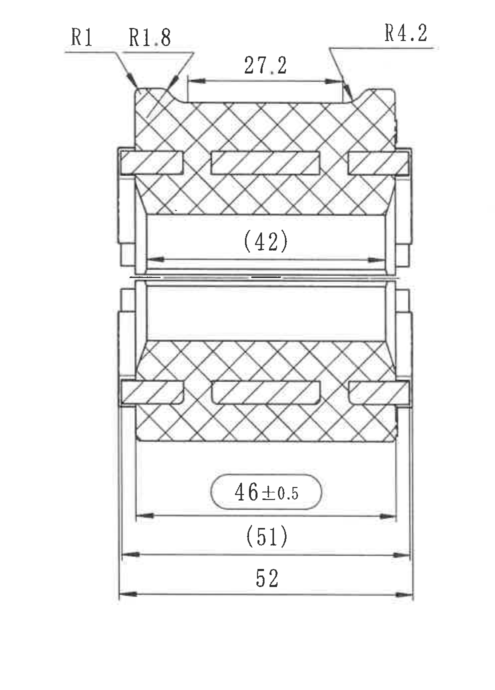

原图位置/视图名称：第 1 页右上侧向剖视图，bbox `[3775, 520, 4765, 1900]`，object_kind `section`。

| 提取项 | 原图数值或文本 | 含义说明 |
|---|---|---|
| 半径尺寸 | R1 | 顶部左侧小圆角半径。 |
| 半径尺寸 | R1.8 | 顶部左侧相邻小圆角半径。 |
| 半径尺寸 | R4.2 | 顶部右侧圆角半径。 |
| 水平尺寸 | 27.2 | 顶部槽口/开口水平距离。 |
| 参考尺寸 | (42) | 上半剖内侧宽度参考尺寸，括号标注。 |
| 水平尺寸 | 46±0.5 | 下部内侧宽度尺寸，外框标出，属于出厂尺寸标注样式，带 ±0.5 公差。 |
| 参考尺寸 | (51) | 下部中间宽度参考尺寸，括号标注。 |
| 水平总尺寸 | 52 | 底部最外侧总宽尺寸，未在该处显示单独公差，按未注尺寸规则关联 object_1/object_6。 |
| 角度 | 未见角度标注 | 本视图无角度数值。 |
| 数量前缀 | 未见数量前缀 | 本视图尺寸前未见 2X、4X 等数量前缀。 |
| T 编号 | 未见 T 编号 | 本视图未出现 T 编号。 |

边界归属说明：该裁切完整包含顶部 R1、R1.8、R4.2 与 27.2 标注、上下剖面、(42)、46±0.5、(51)、52 的尺寸线；未包含左侧主视图中的 R31.8±0.5、R29.3±0.5、Ø22±0.4☆ 等尺寸。

## object_5 - 技术要求

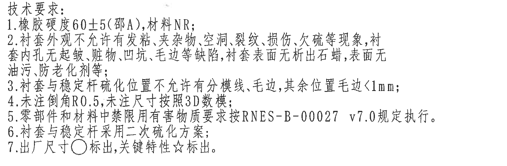

原图位置/视图名称：第 1 页中下技术要求文字块，bbox `[2750, 1880, 4450, 2440]`，object_kind `notes`。

| 提取项 | 原图数值或文本 | 含义说明 |
|---|---|---|
| 标题 | 技术要求: | 技术要求说明区。 |
| 1 | 橡胶硬度60±5(邵A),材料NR; | 橡胶材料为 NR，硬度 60±5 邵 A。 |
| 2 | 衬套外观不允许有发粘、夹杂物、空洞、裂纹、损伤、欠硫等现象,衬套内孔无起皱、脏物、凹坑、毛边等缺陷,衬套表面无析出石蜡,表面无油污、防老化剂等; | 外观、内孔和表面缺陷限制。 |
| 3 | 衬套与稳定杆硫化位置不允许有分模线、毛边,其余位置毛边<1mm; | 硫化位置不得有分模线/毛边，其余毛边小于 1 mm。 |
| 4 | 未注倒角R0.5;未注尺寸按照3D数模; | 未注倒角为 R0.5；未注尺寸参考 3D 数模。 |
| 5 | 零部件和材料中禁限用有害物质要求按RNES-B-00027 v7.0规定执行。 | 有害物质限制标准版本。 |
| 6 | 衬套与稳定杆采用二次硫化方案; | 制造/硫化工艺要求。 |
| 7 | 出厂尺寸○标出,关键特性☆标出。 | 圆圈/外框标注为出厂尺寸，星号为关键特性；用于解读 object_3 和 object_4 的外框尺寸与 Ø22±0.4☆。 |

边界归属说明：该裁切只包含技术要求文字；下方标题栏和右侧表格未纳入本对象。

## object_6 - NES M7072.3.2 未注尺寸公差表

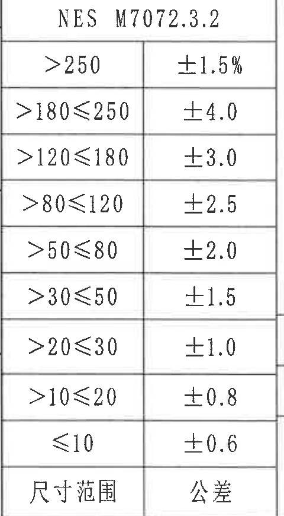

原图位置/视图名称：第 1 页左下公差表，bbox `[380, 2470, 860, 3340]`，object_kind `table`。

原表还原：

| NES M7072.3.2 |  |
|---|---|
| >250 | ±1.5% |
| >180≤250 | ±4.0 |
| >120≤180 | ±3.0 |
| >80≤120 | ±2.5 |
| >50≤80 | ±2.0 |
| >30≤50 | ±1.5 |
| >20≤30 | ±1.0 |
| >10≤20 | ±0.8 |
| ≤10 | ±0.6 |
| 尺寸范围 | 公差 |

| 提取项 | 原图数值或文本 | 含义说明 |
|---|---|---|
| 标准号 | NES M7072.3.2 | 与 object_1 第 2 条对应，用于未规定尺寸公差。 |
| 分档 | >250: ±1.5% | 尺寸范围大于 250 时公差为 ±1.5%。 |
| 分档 | >180≤250: ±4.0 | 尺寸范围大于 180 且小于等于 250 时公差为 ±4.0。 |
| 分档 | >120≤180: ±3.0 | 尺寸范围大于 120 且小于等于 180 时公差为 ±3.0。 |
| 分档 | >80≤120: ±2.5 | 尺寸范围大于 80 且小于等于 120 时公差为 ±2.5。 |
| 分档 | >50≤80: ±2.0 | 尺寸范围大于 50 且小于等于 80 时公差为 ±2.0。 |
| 分档 | >30≤50: ±1.5 | 尺寸范围大于 30 且小于等于 50 时公差为 ±1.5。 |
| 分档 | >20≤30: ±1.0 | 尺寸范围大于 20 且小于等于 30 时公差为 ±1.0。 |
| 分档 | >10≤20: ±0.8 | 尺寸范围大于 10 且小于等于 20 时公差为 ±0.8。 |
| 分档 | ≤10: ±0.6 | 尺寸范围小于等于 10 时公差为 ±0.6。 |

边界归属说明：该裁切只覆盖左下公差表；右侧产品信息表的字段未纳入本对象。

## object_7 - 产品信息表

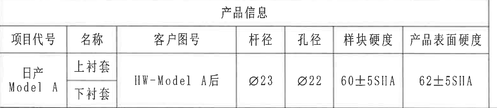

原图位置/视图名称：第 1 页下方产品信息表，bbox `[850, 3005, 2400, 3345]`，object_kind `table`。

原表还原：

| 项目代号 | 名称 | 客户图号 | 杆径 | 孔径 | 样块硬度 | 产品表面硬度 |
|---|---|---|---|---|---|---|
| 日产 Model A | 上衬套 | HW-Model A后 | Ø23 | Ø22 | 60±5SHA | 62±5SHA |
|  | 下衬套 |  |  |  |  |  |

| 提取项 | 原图数值或文本 | 含义说明 |
|---|---|---|
| 项目代号 | 日产 Model A | 产品项目代号，跨上衬套/下衬套两行。 |
| 名称 | 上衬套、下衬套 | 产品包含上下衬套。 |
| 客户图号 | HW-Model A后 | 客户图号，跨两行。 |
| 杆径 | Ø23 | 稳定杆直径信息，与 object_3 中 Ø23 标注对应。 |
| 孔径 | Ø22 | 孔径信息，与 object_3 中 Ø22±0.4☆ 对应。 |
| 样块硬度 | 60±5SHA | 样块硬度要求。 |
| 产品表面硬度 | 62±5SHA | 产品表面硬度要求。 |

边界归属说明：该裁切完整包含产品信息表，不包含左侧 NES M7072.3.2 公差表和右侧标题栏/签署栏。

## object_8 - 等轴测视图

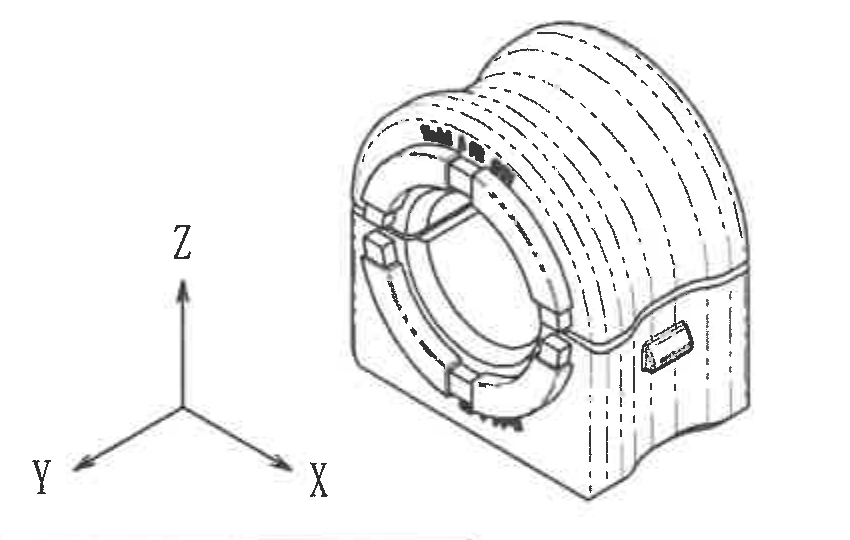

原图位置/视图名称：第 1 页下中等轴测图，bbox `[1900, 2460, 2750, 3000]`，object_kind `view`。

| 提取项 | 原图数值或文本 | 含义说明 |
|---|---|---|
| 视图类型 | 等轴测/三维外观视图 | 展示零件整体形状、外圆弧、内孔、端面凸台和侧面窗口。 |
| 坐标轴 | X、Y、Z | 左下坐标三轴用于视图方向识别。 |
| 尺寸 | 未见尺寸数值 | 该等轴测图无尺寸线和尺寸文字。 |
| 角度 | 未见角度标注 | 该等轴测图无角度数值。 |
| T 编号 | 未见 T 编号 | 该等轴测图未出现 T 编号。 |

边界归属说明：该裁切只包含等轴测图与 X/Y/Z 坐标轴；右侧标题栏和下方产品信息表未纳入本对象。

## object_9 - 明细栏/BOM 表

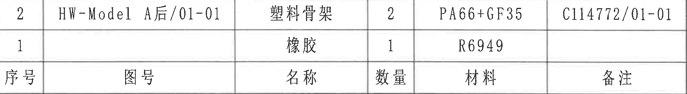

原图位置/视图名称：第 1 页右下明细栏上半，bbox `[2780, 2475, 4780, 2750]`，object_kind `table`。

原表还原：

| 序号 | 图号 | 名称 | 数量 | 材料 | 备注 |
|---|---|---|---|---|---|
| 2 | HW-Model A后/01-01 | 塑料骨架 | 2 | PA66+GF35 | C114772/01-01 |
| 1 |  | 橡胶 | 1 | R6949 |  |
| 序号 | 图号 | 名称 | 数量 | 材料 | 备注 |

| 提取项 | 原图数值或文本 | 含义说明 |
|---|---|---|
| 明细项 2 | 图号 HW-Model A后/01-01; 名称 塑料骨架; 数量 2; 材料 PA66+GF35; 备注 C114772/01-01 | 塑料骨架物料记录。 |
| 明细项 1 | 名称 橡胶; 数量 1; 材料 R6949 | 橡胶物料记录，图号和备注单元格为空。 |
| 表头 | 序号、图号、名称、数量、材料、备注 | 明细栏字段。 |

边界归属说明：该裁切只覆盖明细栏/BOM 表；下方投影法、比例、质量、名称、图号和签署栏归 object_10。

## object_10 - 标题栏/签署栏

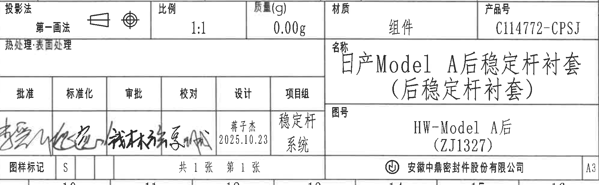

原图位置/视图名称：第 1 页右下标题栏下半，bbox `[2780, 2745, 4780, 3365]`，object_kind `title_block`。

| 提取项 | 原图数值或文本 | 含义说明 |
|---|---|---|
| 投影法 | 第一画法 | 标题栏投影法字段，旁有投影符号。 |
| 比例 | 1:1 | 图纸比例。 |
| 质量(g) | 0.00g | 标题栏质量字段。 |
| 材质 | 组件 | 标题栏材质字段。 |
| 产品号 | C114772-CPSJ | 产品号字段。 |
| 热处理/表面处理 | 热处理:表面处理 | 原图该栏显示字段文字，未见填写值。 |
| 名称 | 日产Model A后稳定杆衬套（后稳定杆衬套） | 图纸名称字段。 |
| 图号 | HW-Model A后（ZJ1327） | 图号字段。 |
| 签署栏表头 | 批准、标准化、审批、校对、设计、项目组 | 签署/责任字段。 |
| 设计 | 蒋子杰 2025.10.23 | 设计栏填写人和日期。 |
| 项目组 | 稳定杆系统 | 项目组字段。 |
| 手写签名 | 批准/标准化/审批/校对栏为手写签名 | 扫描件中为手写体，未在不猜测的前提下转成具体姓名。 |
| 图样标记 | S | 图样标记字段。 |
| 张数 | 共 1 张 第 1 张 | 页数信息。 |
| 公司 | 安徽中鼎密封件股份有限公司 | 图纸所属公司。 |
| 图幅 | A3 | 标题栏右下图幅。 |

边界归属说明：该裁切包含标题栏投影法、比例、质量、材质、产品号、名称、图号、签署栏、页数、公司和 A3 图幅；上方明细栏/BOM 的两条物料记录归 object_9。

## 裁切检查记录

| object_id | 图片路径 | 检查结果 |
|---|---|---|
| page_1 | outputs/20C114772_assets/images/page_1.png | 整页 PNG 渲染完整，包含图框、坐标网格、所有视图、表格、说明和标题栏。 |
| object_1 | outputs/20C114772_assets/images/object_1.png | 说明文字完整；未带入右上修订表和中部视图。 |
| object_2 | outputs/20C114772_assets/images/object_2.png | 修订表表头、首行记录和空白行完整；重裁后未带入下方侧向剖视图尺寸。 |
| object_3 | outputs/20C114772_assets/images/object_3.png | 主视图所有尺寸线、箭头、A-A、硬度检测面引线和文字完整；未带入右侧侧向剖视图。 |
| object_4 | outputs/20C114772_assets/images/object_4.png | 侧向剖视图顶部 R1/R1.8/R4.2、27.2 和底部 52 等尺寸线完整；重裁后无边缘文字裁断。 |
| object_5 | outputs/20C114772_assets/images/object_5.png | 技术要求 1-7 条完整；下方标题栏未纳入。 |
| object_6 | outputs/20C114772_assets/images/object_6.png | NES M7072.3.2 公差表完整包含标题、全部尺寸范围和底行“尺寸范围/公差”；未带入产品信息表。 |
| object_7 | outputs/20C114772_assets/images/object_7.png | 产品信息表标题、表头和数据完整；未带入左侧公差表、右侧标题栏。 |
| object_8 | outputs/20C114772_assets/images/object_8.png | 等轴测图与 X/Y/Z 坐标轴完整；未带入右侧标题栏表格内容。 |
| object_9 | outputs/20C114772_assets/images/object_9.png | 明细栏/BOM 的两条记录和底部表头完整；下方标题栏字段归 object_10。 |
| object_10 | outputs/20C114772_assets/images/object_10.png | 标题栏下半各字段、名称、图号、签署栏、页数、公司和 A3 图幅完整；上方 BOM 物料记录不归本对象。 |
