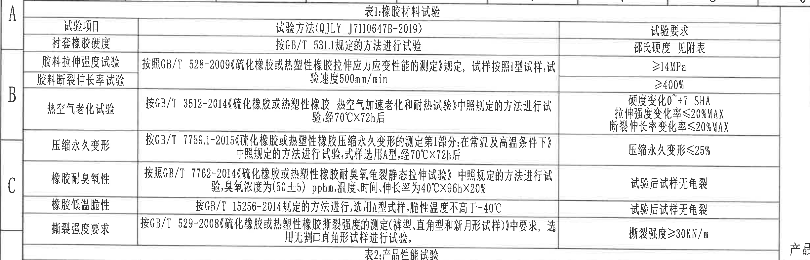
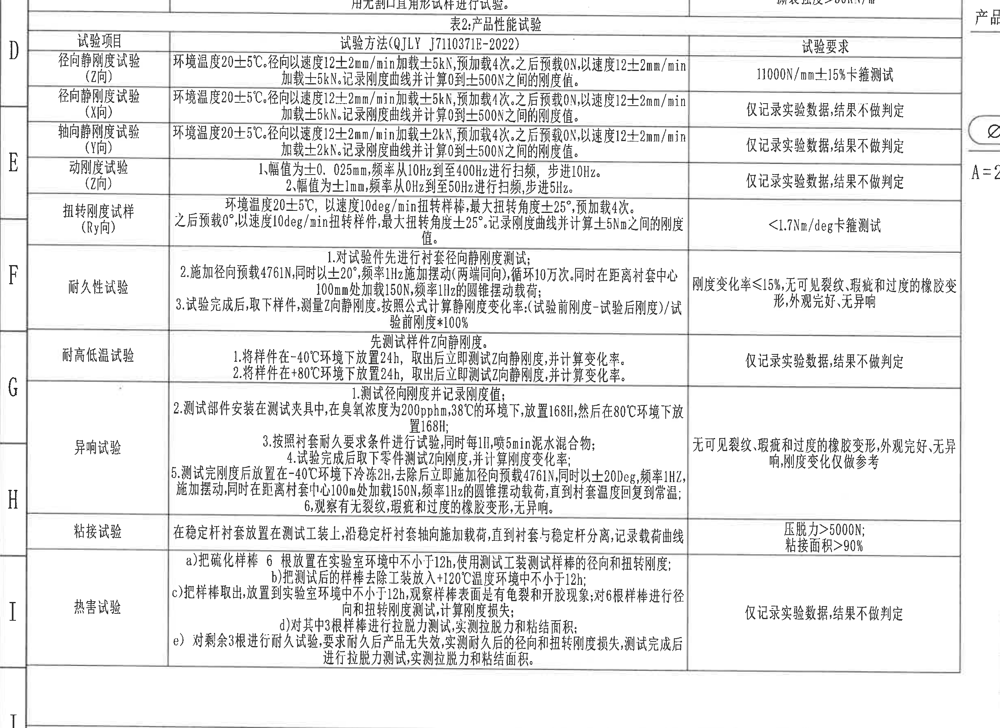
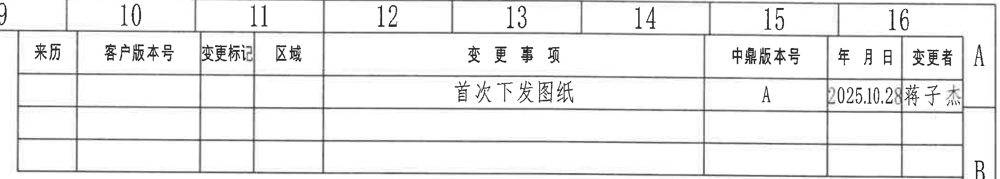
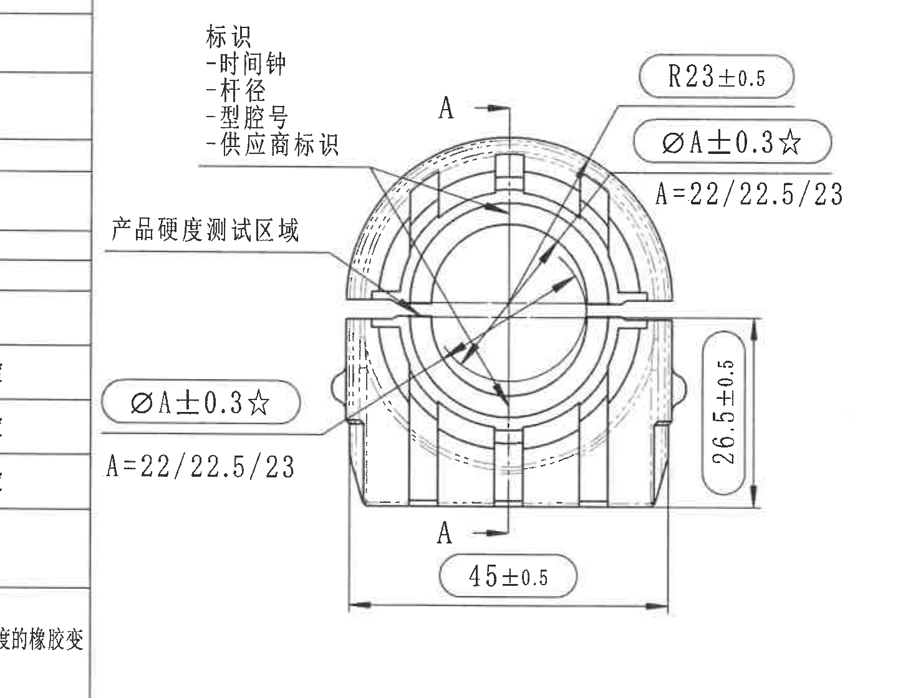
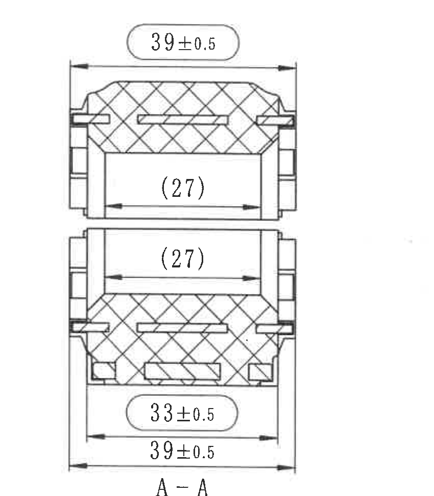
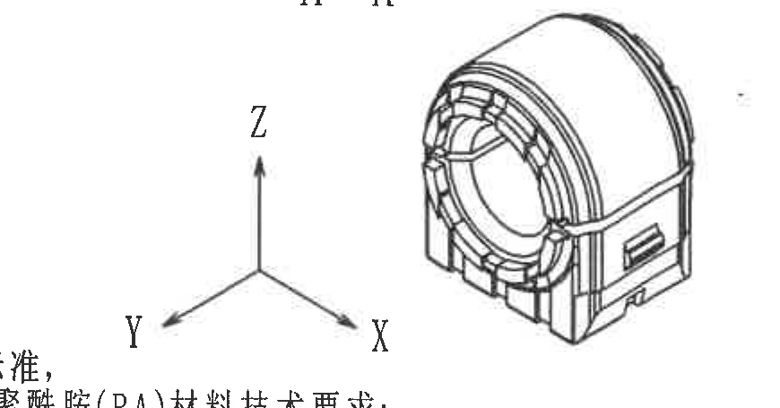
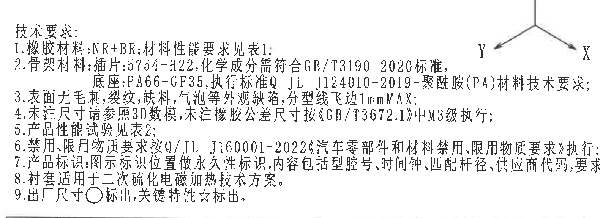
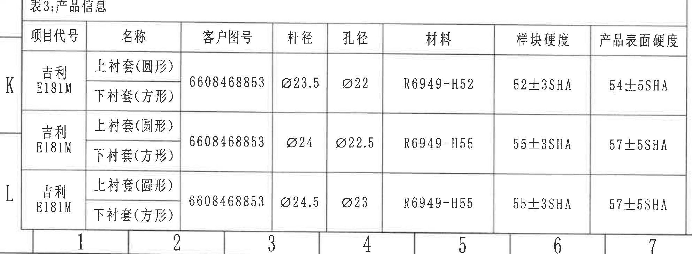
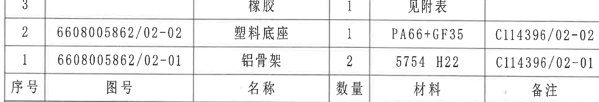
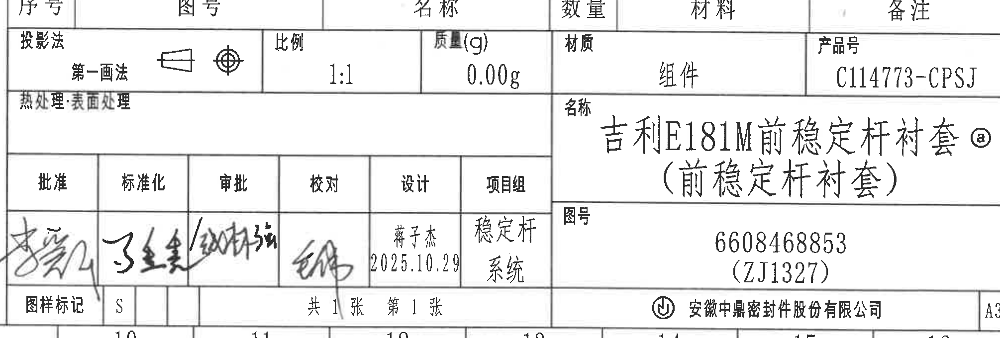

# 20C114773 图纸内容识别

整页渲染图：`outputs/20C114773_assets/images/page_1.png`  
渲染尺寸：4959 x 3505 px，bbox `[0, 0, 4959, 3505]`

## object_1：表1 橡胶材料试验

原图位置/视图名称：第 1 页左上区域，表1：橡胶材料试验，bbox `[320, 125, 2770, 915]`。

### 原表行列还原

| 试验项目 | 试验方法(QJLY J7110647B-2019) | 试验要求 |
|---|---|---|
| 衬套橡胶硬度 | 按GB/T 531.1规定的方法进行试验 | 邵氏硬度 见附表 |
| 胶料拉伸强度试验 | 按照GB/T 528-2009《硫化橡胶或热塑性橡胶拉伸应力应变性能的测定》规定，试样按照1型试样，试验速度500mm/min | ≥14MPa |
| 胶料断裂伸长率试验 | 按照GB/T 528-2009《硫化橡胶或热塑性橡胶拉伸应力应变性能的测定》规定，试样按照1型试样，试验速度500mm/min | ≥400% |
| 热空气老化试验 | 按GB/T 3512-2014《硫化橡胶或热塑性橡胶 热空气加速老化和耐热试验》中照规定的方法进行试验，经70℃X72h后 | 硬度变化0~+7 SHA；拉伸强度变化率≤20%MAX；断裂伸长率变化率≤20%MAX |
| 压缩永久变形 | 按GB/T 7759.1-2015《硫化橡胶或热塑性橡胶压缩永久变形的测定第1部分：在常温及高温条件下》中照规定的方法进行试验，试样选用A型，经70℃X72h后 | 压缩永久变形≤25% |
| 橡胶耐臭氧性 | 按照GB/T 7762-2014《硫化橡胶或热塑性橡胶耐臭氧龟裂静态拉伸试验》中照规定的方法进行试验，臭氧浓度为(50±5) pphm，温度、时间、伸长率为40℃X96hX20% | 试验后试样无龟裂 |
| 橡胶低温脆性 | 按GB/T 15256-2014规定的方法进行，选用A型试样，脆性温度不高于-40℃ | 试验后试样无龟裂 |
| 撕裂强度要求 | 按GB/T 529-2008《硫化橡胶或热塑性橡胶撕裂强度的测定(裤型、直角型和新月形试样)》中要求，选用无割口直角形试样进行试验。 | 撕裂强度≥30KN/m |

### 提取表格

| 提取项 | 原图数值或文本 | 含义说明 |
|---|---|---|
| 表编号 | 表1 | 橡胶材料试验要求表。 |
| 试验方法版本 | QJLY J7110647B-2019 | 表1所用企业试验方法编号。 |
| 橡胶硬度 | 邵氏硬度 见附表 | 衬套橡胶硬度按附表确认。 |
| 拉伸强度 | ≥14MPa | 胶料拉伸强度验收下限。 |
| 断裂伸长率 | ≥400% | 胶料断裂伸长率验收下限。 |
| 热空气老化 | 70℃X72h后；硬度变化0~+7 SHA；拉伸强度变化率≤20%MAX；断裂伸长率变化率≤20%MAX | 老化后硬度和强度变化限制。 |
| 压缩永久变形 | ≤25% | 70℃X72h后压缩永久变形限值。 |
| 臭氧条件 | (50±5) pphm，40℃X96hX20% | 臭氧龟裂静态拉伸试验条件。 |
| 低温脆性 | 脆性温度不高于-40℃ | 低温脆性控制要求。 |
| 撕裂强度 | ≥30KN/m | 撕裂强度验收下限。 |

边界归属说明：裁切保留表1完整外框、列头和所有表1行。下边界靠近表2标题行，图像中共享边界线附近可能可见表2上边线，但表2数据不归入 object_1。

## object_2：表2 产品性能试验

原图位置/视图名称：第 1 页左中区域，表2：产品性能试验，bbox `[320, 840, 2770, 2625]`。

### 原表行列还原

| 试验项目 | 试验方法(QJLY J7110371E-2022) | 试验要求 |
|---|---|---|
| 径向静刚度试验(Z向) | 环境温度20±5℃，径向以速度12±2mm/min加载±5kN，预加载4次。之后预载0N，以速度12±2mm/min加载±5kN。记录刚度曲线并计算0到±500N之间的刚度值。 | 11000N/mm±15%卡箍测试 |
| 径向静刚度试验(X向) | 环境温度20±5℃，径向以速度12±2mm/min加载±5kN，预加载4次。之后预载0N，以速度12±2mm/min加载±5kN。记录刚度曲线并计算0到±500N之间的刚度值。 | 仅记录实验数据，结果不做判定 |
| 轴向静刚度试验(Y向) | 环境温度20±5℃，轴向以速度12±2mm/min加载±2kN，预加载4次。之后预载0N，以速度12±2mm/min加载±2kN。记录刚度曲线并计算0到±500N之间的刚度值。 | 仅记录实验数据，结果不做判定 |
| 动刚度试验(Z向) | 1. 幅值为±0.025mm，频率从10Hz到至400Hz进行扫频，步进10Hz。2. 幅值为±1mm，频率从0Hz到至50Hz进行扫频，步进5Hz。 | 仅记录实验数据，结果不做判定 |
| 扭转刚度试样(Ry向) | 环境温度20±5℃，以速度10deg/min扭转样棒，最大扭转角度±25°，预加载4次。之后预载0°，以速度10deg/min扭转样件，最大扭转角度±25°。记录刚度曲线并计算±5Nm之间的刚度值。 | <1.7Nm/deg卡箍测试 |
| 耐久性试验 | 1. 对试验件先进行衬套径向静刚度测试。2. 施加径向预载4761N，同时以±20°，频率1Hz施加摆动(两端同向)，循环10万次。同时在距离衬套中心100mm处加载150N，频率1Hz的圆锥摆动载荷。3. 试验完成后，取下样件，测量Z向静刚度。按照公式计算静刚度变化率：(试验前刚度-试验后刚度)/试验前刚度*100%。 | 刚度变化率≤15%，无可见裂纹、瑕疵和过度的橡胶变形，外观完好，无异响 |
| 耐高低温试验 | 先测试样件Z向静刚度。1. 将样件在-40℃环境下放置24h，取出后立即测试Z向静刚度，并计算变化率。2. 将样件在+80℃环境下放置24h，取出后立即测试Z向静刚度，并计算变化率。 | 仅记录实验数据，结果不做判定 |
| 异响试验 | 1. 测试径向刚度并记录刚度值。2. 测试部件安装在测试夹具中，在臭氧浓度为200pphm，38℃的环境下，放置168H，然后在80℃环境下放置168H。3. 按照衬套耐久要求条件进行试验，同时每1H，喷5min泥水混合物。4. 试验完成后取下零件测试Z向刚度，并计算刚度变化率。5. 测试完刚度后放置在-40℃环境下冷冻2H，去除后立即施加径向预载4761N，同时以±20Deg，频率1Hz，施加摆动，同时在距离衬套中心100mm处加载150N，频率1Hz的圆锥摆动载荷，直到衬套温度回复到常温。6. 观察有无裂纹、瑕疵和过度的橡胶变形，无异响。 | 无可见裂纹、瑕疵和过度的橡胶变形，外观完好，无异响，刚度变化仅做参考 |
| 粘接试验 | 在稳定杆衬套放置在测试工装上，沿稳定杆衬套轴向施加载荷，直到衬套与稳定杆分离，记录载荷曲线。 | 压脱力>5000N；粘接面积>90% |
| 热害试验 | a)把硫化样棒6根放置在实验室环境中不小于12h，使用测试工装测试样棒的径向和扭转刚度；b)把测试后的样棒去除工装放入+120℃温度环境中不小于12h；c)把样棒取出，放置到实验室环境中不小于12h，观察样棒表面是否有龟裂和开胶现象，对6根样棒进行径向和扭转刚度测试，计算刚度损失；d)对其中3根样棒进行拉脱力测试，实测拉脱力和粘结面积；e)对剩余3根进行耐久试验，要求耐久后产品无失效，实测耐久后的径向和扭转刚度损失，测试完成后进行拉脱力测试，实测拉脱力和粘结面积。 | 仅记录实验数据，结果不做判定 |

### 提取表格

| 提取项 | 原图数值或文本 | 含义说明 |
|---|---|---|
| 表编号 | 表2 | 产品性能试验要求表。 |
| 试验方法版本 | QJLY J7110371E-2022 | 表2所用企业试验方法编号。 |
| Z向径向静刚度 | 11000N/mm±15% | Z向卡箍测试判定要求。 |
| X向径向静刚度 | 仅记录实验数据，结果不做判定 | X向刚度只记录，不判定。 |
| Y向轴向静刚度 | 加载±2kN；计算0到±500N刚度值 | Y向轴向刚度测试条件。 |
| 动刚度 | ±0.025mm，10Hz到400Hz，步进10Hz；±1mm，0Hz到50Hz，步进5Hz | 两组扫频条件。 |
| 扭转刚度 | <1.7Nm/deg | Ry向扭转刚度卡箍测试限值。 |
| 耐久性预载 | 4761N，±20°，1Hz，10万次；100mm处加载150N | 耐久工况载荷、角度、频率和循环数。 |
| 刚度变化率 | ≤15% | 耐久后刚度变化判定限值。 |
| 温度条件 | -40℃ 24h；+80℃ 24h | 耐高低温试验条件。 |
| 异响试验臭氧条件 | 200pphm，38℃，168H；80℃，168H | 异响试验前处理环境。 |
| 粘接试验 | 压脱力>5000N；粘接面积>90% | 粘接强度和面积要求。 |
| 热害试验 | +120℃不小于12h；6根样棒；其中3根拉脱力测试，剩余3根耐久试验 | 热害验证流程与样本分配。 |

边界归属说明：裁切覆盖表2标题、列头和全部产品性能试验行。上边界与表1共享分隔线，表1橡胶材料试验数据不归入 object_2；右侧靠近主视图区域，任何可见主视图标注片段不作为表2内容提取。

## object_3：修订履历表

原图位置/视图名称：第 1 页右上区域，修订履历表，bbox `[2745, 80, 4865, 460]`。

### 原表行列还原

| 来历 | 客户版本号 | 变更标记 | 区域 | 变更事项 | 中鼎版本号 | 年月日 | 变更者 |
|---|---|---|---|---|---|---|---|
|  |  |  |  | 首次下发图纸 | A | 2025.10.29 | 蒋子杰 |
|  |  |  |  |  |  |  |  |
|  |  |  |  |  |  |  |  |

### 提取表格

| 提取项 | 原图数值或文本 | 含义说明 |
|---|---|---|
| 变更事项 | 首次下发图纸 | 该版本为首次发布图纸。 |
| 中鼎版本号 | A | 中鼎内部版本号。 |
| 年月日 | 2025.10.29 | 修订记录日期。 |
| 变更者 | 蒋子杰 | 本次变更记录人员。 |

边界归属说明：裁切完整包含表格列头、有效修订行和空白行。顶部图框坐标数字和右侧 A/B 图框标识为原图位置参考，不作为修订表字段。

## object_4：主视图/加工正视图

原图位置/视图名称：第 1 页右中主视图，bbox `[2530, 515, 3970, 1635]`。

### 提取表格

| 提取项 | 原图数值或文本 | 含义说明 |
|---|---|---|
| 视图名称 | 主视图/加工正视图 | 显示衬套正向轮廓、孔位、标识区、硬度测试区和 A-A 剖切位置。 |
| 标识内容 | 标识：-时间钟；-杆径；-型腔号；-供应商标识 | 产品永久性标识的组成内容，与技术要求第7条对应。 |
| 硬度测试区域 | 产品硬度测试区域 | 引出线指向主视图左侧外圆区域，表示产品表面硬度检测位置。 |
| 半径 | R23±0.5 | 上方外轮廓圆弧半径，公差±0.5。 |
| 关键直径尺寸 | ØA±0.3☆ | 主视图中两处同值直径标注，带星号，按技术要求第9条为关键特性；公差±0.3。 |
| A取值 | A=22/22.5/23 | A为孔径变量，对应产品信息表中三种孔径规格。 |
| 总宽/底部宽度 | 45±0.5 | 主视图底部水平尺寸，公差±0.5。 |
| 总高/侧向高度 | 26.5±0.5 | 主视图右侧垂直尺寸，公差±0.5。 |
| 剖切基准 | A、A | 上下两处 A 标识和箭头定义 A-A 剖切位置。 |
| 关键特性符号 | ☆ | 图中 ØA±0.3 后有星号；技术要求第9条说明关键特性以☆标出。 |
| 出厂尺寸符号 | 未在本主视图尺寸旁见完整圆圈符号 | 技术要求第9条说明出厂尺寸用圆圈标出，本对象内未见可独立确认的完整圆圈出厂尺寸符号。 |

边界归属说明：主视图左侧两个引出标注文字和气泡靠近左侧试验表边界，为完整保留主视图标注，裁切左侧带入少量表格边框/文字边缘；这些边缘内容不归入主视图提取。右边界在 A-A 剖视图前截断，剖视图尺寸不归入 object_4。

## object_5：A-A 剖面视图

原图位置/视图名称：第 1 页右中，A-A 剖视图，bbox `[3910, 580, 4760, 1550]`。

### 提取表格

| 提取项 | 原图数值或文本 | 含义说明 |
|---|---|---|
| 视图名称 | A-A | 由主视图 A-A 剖切线得到的剖面视图。 |
| 上部总宽 | 39±0.5 | 剖视图上部外宽，公差±0.5。 |
| 上部参考内宽 | (27) | 括号内参考尺寸，仅作结构参考；位于上半剖面内腔。 |
| 下部参考内宽 | (27) | 括号内参考尺寸，仅作结构参考；位于下半剖面内腔。 |
| 下部局部宽度 | 33±0.5 | 剖视图下部局部水平尺寸，公差±0.5。 |
| 下部总宽 | 39±0.5 | 剖视图底部外宽，公差±0.5。 |
| 剖面填充 | 交叉剖面线 | 表示被剖切材料区域。 |
| 参考尺寸说明 | (27) 两处 | 括号表示参考尺寸，不能作为主检验尺寸；仍属于 A-A 剖视图尺寸信息。 |

边界归属说明：裁切完整包含 A-A 标识和剖视图全部尺寸线、箭头、文字。下边界在 A-A 标识后结束，未带入轴测图；左边界与主视图分开，主视图尺寸不归入本对象。

## object_6：轴测/局部三维方向视图

原图位置/视图名称：第 1 页右中偏下，轴测图和方向坐标，bbox `[3880, 1545, 4750, 2000]`。

### 提取表格

| 提取项 | 原图数值或文本 | 含义说明 |
|---|---|---|
| 视图类型 | 轴测图 | 表达零件三维外形、端面结构和侧面窗口特征。 |
| 方向坐标 | X、Y、Z | 表示图纸方向坐标；Z竖直向上，X向右下，Y向左下。 |
| 尺寸标注 | 无独立尺寸数值 | 本对象为外形方向示意，不含可独立提取的尺寸、公差、T编号或基准字母。 |

边界归属说明：为完整保留 X/Y/Z 三轴，左下角带入少量技术要求文字边缘；该文字不归入 object_6，技术要求完整内容归入 object_7。上边界未包含 A-A 剖视图尺寸。

## object_7：NOTES/技术要求

原图位置/视图名称：第 1 页右下中部，技术要求 NOTES，bbox `[2760, 1780, 4340, 2355]`。

### 原文本还原

1. 橡胶材料：NR+BR；材料性能要求见表1；
2. 骨架材料：插片：5754-H22，化学成分需符合GB/T3190-2020标准，底座：PA66-GF35，执行标准Q-JL J124010-2019-聚酰胺(PA)材料技术要求；
3. 表面无毛刺，裂纹，缺料，气泡等外观缺陷，分型线飞边1mmMAX；
4. 未注尺寸请参照3D数模，未注橡胶公差尺寸按《GB/T3672.1》中M3级执行；
5. 产品性能试验见表2；
6. 禁用、限用物质要求按Q/JL J160001-2022《汽车零部件和材料禁用、限用物质要求》执行；
7. 产品标识：图示标识位置做永久性标识，内容包括型腔号、时间钟、匹配杆径、供应商代码，要求字体清晰可辨；
8. 衬套适用于二次硫化电磁加热技术方案。
9. 出厂尺寸○标出，关键特性☆标出。

### 提取表格

| 提取项 | 原图数值或文本 | 含义说明 |
|---|---|---|
| 橡胶材料 | NR+BR | 橡胶配方材料类别。 |
| 插片材料 | 5754-H22；符合GB/T3190-2020 | 骨架插片材料及化学成分标准。 |
| 底座材料 | PA66-GF35；Q-JL J124010-2019 | 塑料底座材料和执行标准。 |
| 外观要求 | 无毛刺、裂纹、缺料、气泡；分型线飞边1mmMAX | 外观缺陷和飞边最大值要求。 |
| 未注尺寸 | 参照3D数模 | 图纸未标尺寸以3D数模为依据。 |
| 未注橡胶公差 | GB/T3672.1 中 M3级 | 橡胶未注尺寸公差等级。 |
| 产品性能试验 | 见表2 | 性能验证引用 object_2。 |
| 禁限用物质 | Q/JL J160001-2022 | 禁用、限用物质执行标准。 |
| 标识内容 | 型腔号、时间钟、匹配杆径、供应商代码 | 与主视图标识引出框对应。 |
| 工艺适用 | 二次硫化电磁加热技术方案 | 衬套适用工艺方案。 |
| 出厂尺寸符号 | ○ | 出厂尺寸以圆圈标出。 |
| 关键特性符号 | ☆ | 关键特性以星号标出；主视图 ØA±0.3☆ 属此类。 |

边界归属说明：裁切完整包含技术要求 1-9 条。右上可见轴测方向坐标的一部分，用于保持第7条末尾文字完整；坐标图不作为 NOTES 文本提取，轴测图归入 object_6。

## object_8：表3 产品信息

原图位置/视图名称：第 1 页左下区域，表3：产品信息，bbox `[320, 2645, 2305, 3375]`。

### 原表行列还原

| 项目代号 | 名称 | 客户图号 | 杆径 | 孔径 | 材料 | 样块硬度 | 产品表面硬度 |
|---|---|---|---|---|---|---|---|
| 吉利 E181M | 上衬套(圆形) / 下衬套(方形) | 6608468853 | Ø23.5 | Ø22 | R6949-H52 | 52±3SHA | 54±5SHA |
| 吉利 E181M | 上衬套(圆形) / 下衬套(方形) | 6608468853 | Ø24 | Ø22.5 | R6949-H55 | 55±3SHA | 57±5SHA |
| 吉利 E181M | 上衬套(圆形) / 下衬套(方形) | 6608468853 | Ø24.5 | Ø23 | R6949-H55 | 55±3SHA | 57±5SHA |

### 提取表格

| 提取项 | 原图数值或文本 | 含义说明 |
|---|---|---|
| 表编号 | 表3 | 产品信息表。 |
| 客户图号 | 6608468853 | 三组规格共用客户图号。 |
| 杆径规格 | Ø23.5、Ø24、Ø24.5 | 匹配杆径变量。 |
| 孔径规格 | Ø22、Ø22.5、Ø23 | 与主视图 A=22/22.5/23 对应。 |
| 材料 | R6949-H52；R6949-H55 | 不同规格橡胶材料/硬度牌号。 |
| 样块硬度 | 52±3SHA；55±3SHA | 样块硬度公差。 |
| 产品表面硬度 | 54±5SHA；57±5SHA | 成品表面硬度公差。 |

边界归属说明：裁切完整包含表3标题、列头和三组规格数据。下边界包含底部图框坐标行，用于保留表格外框，不作为表3字段。

## object_9：材料明细/BOM 表

原图位置/视图名称：第 1 页右下上部，材料明细表，bbox `[2760, 2385, 4770, 2730]`。

### 原表行列还原

| 序号 | 图号 | 名称 | 数量 | 材料 | 备注 |
|---|---|---|---|---|---|
| 3 |  | 橡胶 | 1 | 见附表 |  |
| 2 | 6608005862/02-02 | 塑料底座 | 1 | PA66+GF35 | C114396/02-02 |
| 1 | 6608005862/02-01 | 铝骨架 | 2 | 5754 H22 | C114396/02-01 |

### 提取表格

| 提取项 | 原图数值或文本 | 含义说明 |
|---|---|---|
| 序号3 | 橡胶，数量1，材料见附表 | 橡胶件材料引用附表。 |
| 序号2 | 6608005862/02-02，塑料底座，数量1，PA66+GF35，C114396/02-02 | 塑料底座明细。 |
| 序号1 | 6608005862/02-01，铝骨架，数量2，5754 H22，C114396/02-01 | 铝骨架明细。 |

边界归属说明：原图该表表头在下方、数据在上方，Markdown按常规表头置顶还原字段。裁切上边界紧贴序号3行，图号空白单元格按空值保留；下边界接近标题栏共享线，标题栏字段不归入 object_9。

## object_10：标题栏/签审栏

原图位置/视图名称：第 1 页右下角标题栏，bbox `[2760, 2670, 4770, 3350]`。

### 提取表格

| 提取项 | 原图数值或文本 | 含义说明 |
|---|---|---|
| 投影法 | 第一画法 | 图样投影方法。 |
| 比例 | 1:1 | 图样比例。 |
| 质量(g) | 0.00g | 标题栏记录质量。 |
| 材质 | 组件 | 总成材质栏为组件。 |
| 产品号 | C114773-CPSJ | 产品号。 |
| 热处理/表面处理 | 热处理：表面处理 | 标题栏对应处理栏文本。 |
| 名称 | 吉利E181M前稳定杆衬套@（前稳定杆衬套） | 产品名称。 |
| 图号 | 6608468853（ZJ1327） | 图纸编号/括号内编号。 |
| 批准 | 签名 | 批准栏手写签名。 |
| 标准化 | 签名 | 标准化栏手写签名。 |
| 审批 | 签名 | 审批栏手写签名。 |
| 校对 | 签名 | 校对栏手写签名。 |
| 设计 | 蒋子杰 2025.10.29 | 设计人员和日期。 |
| 项目组 | 稳定杆系统 | 项目组名称。 |
| 图样标记 | S | 图样标记字段。 |
| 页码 | 共1张 第1张 | 图纸页数。 |
| 公司 | 安徽中鼎密封件股份有限公司 | 出图单位。 |
| 幅面 | A3 | 图幅规格。 |

边界归属说明：上边界包含材料明细表头共享线的少量内容，以避免标题栏第一行字段被裁断；材料明细数据归入 object_9。标题栏中的签名为手写签署内容，按“签名”还原。

## 裁切检查记录

| 对象 | 图片路径 | 检查结果 |
|---|---|---|
| page_1 | outputs/20C114773_assets/images/page_1.png | 整页渲染完整，4959x3505 px，包含整张A3图纸。 |
| object_1 | outputs/20C114773_assets/images/object_1.png | 表1列头、行线和文字完整；下边界与表2共享分隔线，表2标题不作为表1内容。 |
| object_2 | outputs/20C114773_assets/images/object_2.png | 表2标题、列头和全部性能试验行完整；未把右侧主视图尺寸归入表格内容。 |
| object_3 | outputs/20C114773_assets/images/object_3.png | 修订履历表列头、有效行和空白行完整；顶部/右侧图框坐标仅作位置参考。 |
| object_4 | outputs/20C114773_assets/images/object_4.png | 主视图全部尺寸线、箭头、标注文字和 A-A 剖切字母完整；左侧为保留引出标注带入少量表格边缘，未归属为主视图内容。 |
| object_5 | outputs/20C114773_assets/images/object_5.png | A-A 剖视图完整包含 39±0.5、(27)、33±0.5、A-A 标识和全部尺寸线；未带入轴测图。 |
| object_6 | outputs/20C114773_assets/images/object_6.png | 轴测图和 X/Y/Z 坐标完整；左下少量技术要求文字边缘不归入轴测图。 |
| object_7 | outputs/20C114773_assets/images/object_7.png | 技术要求 1-9 条完整可读；右上保留少量坐标轴以避免第7条文字截断，坐标轴归属 object_6。 |
| object_8 | outputs/20C114773_assets/images/object_8.png | 表3标题、列头、三组规格和硬度数据完整；底部图框坐标不作为表格字段。 |
| object_9 | outputs/20C114773_assets/images/object_9.png | BOM三行数据和表头完整；表头在原图下方，已按字段还原；下边界未提取标题栏字段。 |
| object_10 | outputs/20C114773_assets/images/object_10.png | 标题栏主要字段、签审栏、图号、名称、公司和幅面完整；上边界少量材料明细表头不作为标题栏字段。 |
