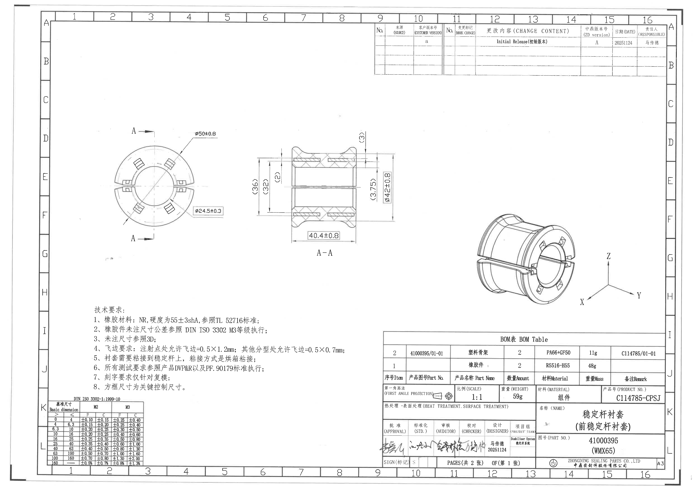
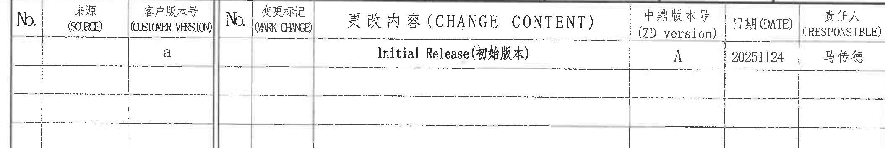
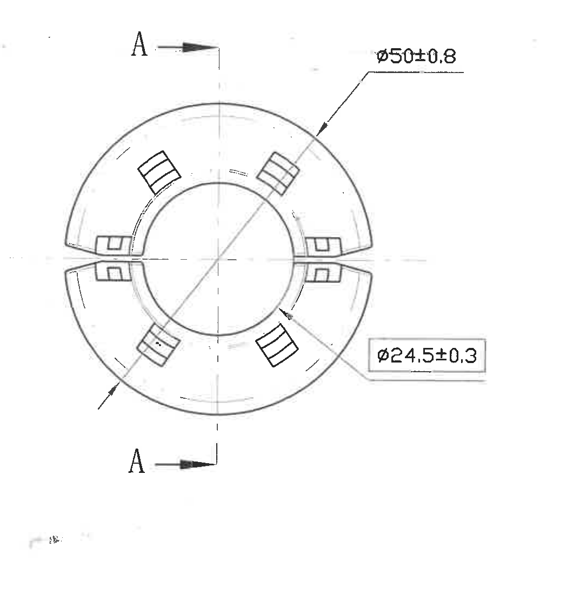
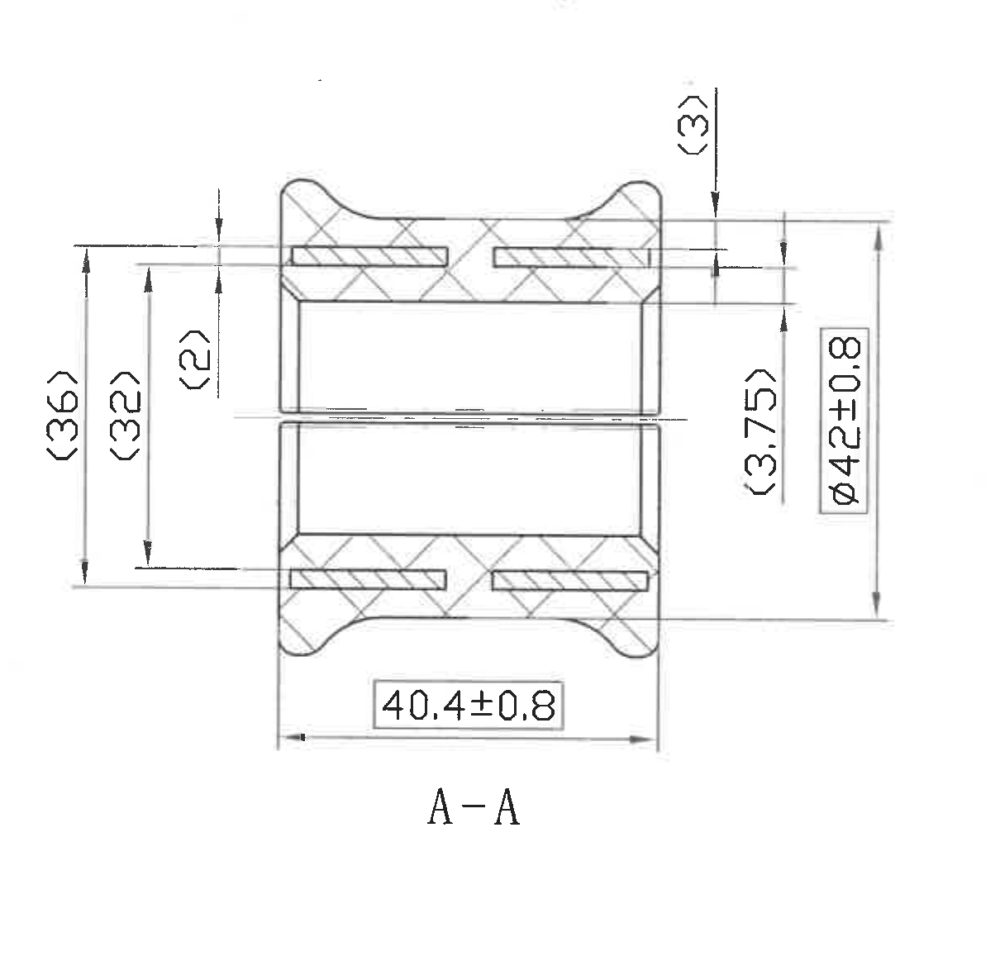
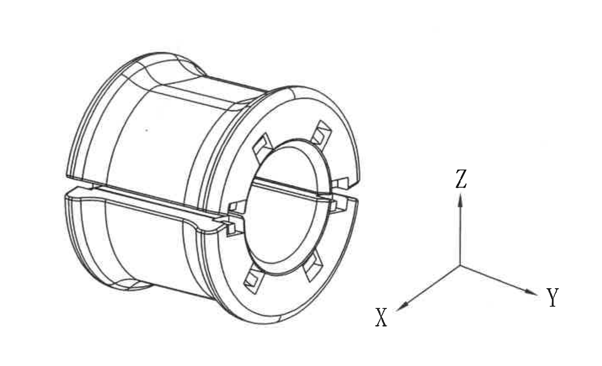
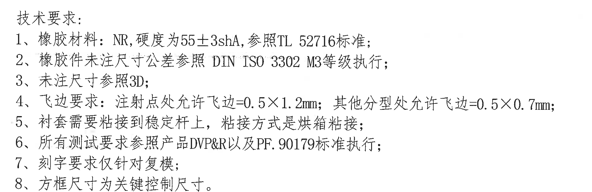
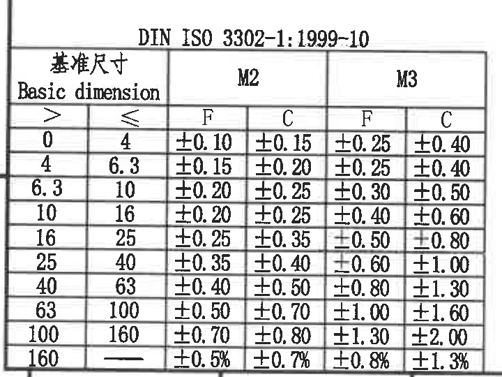
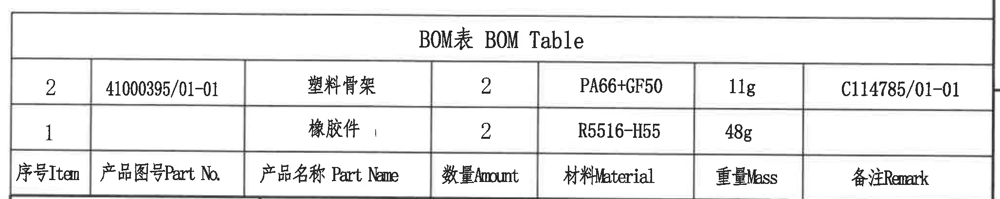
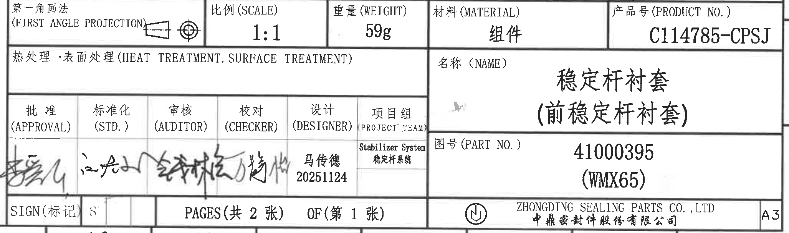

# 20C114774 内容识别结果

整页渲染图：  

坐标说明：本文 bbox 均为基于 `page_1.png` 的像素坐标 `[x_min, y_min, x_max, y_max]`。

## object_8 修订履历表

原图位置/视图名称：页面顶部右侧修订履历表，bbox `[2655, 170, 4765, 525]`。

原表行列还原：

| No. | 来源(SOURCE) | 客户版本号(CUSTOMER VERSION) | No. | 变更标记(MARK CHANGE) | 更改内容(CHANGE CONTENT) | 中鼎版本号(ZD version) | 日期(DATE) | 责任人(RESPONSIBLE) |
|---|---|---|---|---|---|---|---|---|
|  |  | a |  |  | Initial Release(初始版本) | A | 20251124 | 马传德 |
|  |  |  |  |  |  |  |  |  |
|  |  |  |  |  |  |  |  |  |
|  |  |  |  |  |  |  |  |  |

| 提取项 | 原图数值或文本 | 含义说明 |
|---|---|---|
| 客户版本号 | a | 客户版本栏内记录的版本标记。 |
| 更改内容 | Initial Release(初始版本) | 初始发行记录。 |
| 中鼎版本号 | A | 中鼎版本栏版本。 |
| 日期 | 20251124 | 修订/发行日期，格式为 YYYYMMDD。 |
| 责任人 | 马传德 | 该修订记录责任人。 |

边界归属说明：裁切仅包含修订履历表本体；上方图框分区号 9-16 和右侧 A/B 坐标字母未纳入提取内容。

## object_1 左侧端面视图

原图位置/视图名称：左侧端面加工视图，bbox `[700, 855, 1760, 1975]`。

| 提取项 | 原图数值或文本 | 含义说明 |
|---|---|---|
| 剖切标识 | A-A | 两处 A 箭头定义剖切位置和观察方向，对应中部 `A-A` 剖面视图；不是基准字母。 |
| 外径尺寸 | φ50±0.8 | 端面外圆直径，公差 ±0.8。引出线箭头指向外圆弧。 |
| 内孔/内圆尺寸 | φ24.5±0.3 | 端面中心孔/内圆直径，公差 ±0.3。该尺寸带方框，是关键控制尺寸。 |
| 角度/弧度/R 标注 | 未见数值标注 | 本视图有圆弧轮廓，但未给出角度、弧长或 R 半径数值。 |
| 数量前缀/T 编号/星号 | 未见 | 本视图未出现数量前缀、T 编号或带星号尺寸。 |

边界归属说明：右上 `φ50±0.8` 和右下 `φ24.5±0.3` 的文字、引出线和箭头均完整包含；未把中部 A-A 剖面中的尺寸归入本视图。

## object_2 A-A 剖面视图

原图位置/视图名称：中部 `A-A` 剖面视图，bbox `[1750, 835, 2960, 2015]`。

| 提取项 | 原图数值或文本 | 含义说明 |
|---|---|---|
| 剖面名称 | A-A | 来源于左侧端面视图的 A-A 剖切线。 |
| 轴向总长 | 40.4±0.8 | 零件轴向长度，底部水平尺寸线给出，公差 ±0.8；带方框，为关键控制尺寸。 |
| 外径/外包络直径 | φ42±0.8 | 剖面右侧纵向直径尺寸，公差 ±0.8；带方框，为关键控制尺寸。 |
| 总高度参考尺寸 | (36) | 左侧最外侧纵向尺寸，括号表示参考尺寸，用于说明剖面外包络高度。 |
| 内部高度参考尺寸 | (32) | 左侧内侧纵向尺寸，括号表示参考尺寸，用于说明内部结构高度。 |
| 局部厚度参考尺寸 | (2) | 左侧上部局部厚度/台阶参考尺寸，括号表示参考尺寸。 |
| 上部局部参考尺寸 | (3) | 右上方局部高度/台阶参考尺寸，括号表示参考尺寸。 |
| 右侧局部参考尺寸 | (3.75) | 右侧局部高度参考尺寸，括号表示参考尺寸。 |
| 角度/弧度/R 标注 | 未见数值标注 | 本剖面有弧形外轮廓，但未给出角度、弧长或 R 半径数值。 |
| 数量前缀/T 编号/星号 | 未见 | 本剖面未出现数量前缀、T 编号或带星号尺寸。 |

边界归属说明：剖面左右侧竖向尺寸线、底部水平尺寸线、右侧 `φ42±0.8` 标注框和 `A-A` 文字均完整包含；没有包含左侧端面视图或右侧等轴测视图的标注。

## object_3 右侧等轴测视图

原图位置/视图名称：右侧等轴测/三维形状视图，bbox `[3260, 1410, 4690, 2280]`。

| 提取项 | 原图数值或文本 | 含义说明 |
|---|---|---|
| 等轴测形状 | 稳定杆衬套整体三维外形 | 表达圆筒状衬套、端部开口、分型间隙、端面槽/窗口等三维形态。 |
| 坐标方向 | X、Y、Z | 右侧坐标三叉标识三维方向；不是尺寸公差。 |
| 数字尺寸 | 未见 | 该视图未标注数字尺寸、参考尺寸、公差、角度、弧长或 R 半径。 |
| 数量前缀/T 编号/星号 | 未见 | 本视图未出现数量前缀、T 编号或带星号尺寸。 |

边界归属说明：裁切完整包含 X/Y/Z 坐标标识和等轴测轮廓；未包含下方 BOM 表格和标题栏。

## object_4 技术要求 NOTES

原图位置/视图名称：左下技术要求文字区，bbox `[620, 2160, 2590, 2800]`。

| 提取项 | 原图数值或文本 | 含义说明 |
|---|---|---|
| 标题 | 技术要求: | 本区域为技术要求/NOTES。 |
| 1 | 橡胶材料：NR, 硬度为55±3shA, 参照TL 52716标准; | 定义橡胶材料、硬度和参考标准。 |
| 2 | 橡胶件未注尺寸公差参照 DIN ISO 3302 M3等级执行; | 未注橡胶件尺寸公差按 DIN ISO 3302 M3 执行。 |
| 3 | 未注尺寸参照3D; | 未在图纸标注的尺寸以 3D 数据为准。 |
| 4 | 飞边要求：注射点处允许飞边=0.5×1.2mm; 其他分型处允许飞边=0.5×0.7mm; | 定义注射点和其他分型处允许飞边尺寸。 |
| 5 | 衬套需要粘接到稳定杆上，粘接方式是烘箱粘接; | 定义装配粘接要求和粘接工艺。 |
| 6 | 所有测试要求参照产品DVP&R以及PF. 90179标准执行; | 测试要求参考产品 DVP&R 和 PF. 90179。 |
| 7 | 刻字要求仅针对复模; | 刻字要求适用范围限定为复模。 |
| 8 | 方框尺寸为关键控制尺寸。 | 图中带方框的尺寸为关键控制尺寸，例如 `φ24.5±0.3`、`40.4±0.8`、`φ42±0.8`。 |

边界归属说明：裁切仅包含 1-8 条技术要求文字；下方 DIN ISO 公差表和右侧 BOM 表未纳入该对象。

## object_5 DIN ISO 3302-1 一般公差表

原图位置/视图名称：左下 `DIN ISO 3302-1:1999-10` 公差表，bbox `[330, 2805, 1050, 3345]`。

原表行列还原：

| 基准尺寸 Basic dimension > | 基准尺寸 Basic dimension ≤ | M2 F | M2 C | M3 F | M3 C |
|---|---|---|---|---|---|
| 0 | 4 | ±0.10 | ±0.15 | ±0.25 | ±0.40 |
| 4 | 6.3 | ±0.15 | ±0.20 | ±0.25 | ±0.40 |
| 6.3 | 10 | ±0.20 | ±0.25 | ±0.30 | ±0.50 |
| 10 | 16 | ±0.20 | ±0.25 | ±0.40 | ±0.60 |
| 16 | 25 | ±0.25 | ±0.35 | ±0.50 | ±0.80 |
| 25 | 40 | ±0.35 | ±0.40 | ±0.60 | ±1.00 |
| 40 | 63 | ±0.40 | ±0.50 | ±0.80 | ±1.30 |
| 63 | 100 | ±0.50 | ±0.70 | ±1.00 | ±1.60 |
| 100 | 160 | ±0.70 | ±0.80 | ±1.30 | ±2.00 |
| 160 | — | ±0.5% | ±0.7% | ±0.8% | ±1.3% |

| 提取项 | 原图数值或文本 | 含义说明 |
|---|---|---|
| 标准 | DIN ISO 3302-1:1999-10 | 橡胶制品尺寸公差参考表。 |
| 等级 | M2、M3 | 表中给出 M2 与 M3 等级，且技术要求第 2 条指定未注橡胶件尺寸公差按 M3 执行。 |
| F/C 列 | F、C | 表中按 F、C 两类列出各尺寸段公差。 |

边界归属说明：表头、所有尺寸段和最后百分比行均完整包含；未包含上方技术要求或下方图框分区号。

## object_6 BOM 表

原图位置/视图名称：右下 BOM 表，bbox `[2720, 2350, 4775, 2760]`。

原表行列还原：

| 序号 Item | 产品图号 Part No. | 产品名称 Part Name | 数量 Amount | 材料 Material | 重量 Mass | 备注 Remark |
|---|---|---|---|---|---|---|
| 2 | 41000395/01-01 | 塑料骨架 | 2 | PA66+GF50 | 11g | C114785/01-01 |
| 1 |  | 橡胶件 | 2 | R5516-H55 | 48g |  |

| 提取项 | 原图数值或文本 | 含义说明 |
|---|---|---|
| 表名 | BOM表 BOM Table | 物料清单区域。 |
| 塑料骨架 | 41000395/01-01 / 数量 2 / PA66+GF50 / 11g / 备注 C114785/01-01 | BOM 第 2 项，塑料骨架零件信息。 |
| 橡胶件 | 数量 2 / R5516-H55 / 48g | BOM 第 1 项，橡胶件信息；产品图号和备注栏为空。 |

边界归属说明：裁切仅包含 BOM 表题、两条物料记录和表头；下方标题栏字段未归入 BOM。

## object_7 标题栏

原图位置/视图名称：右下标题栏，bbox `[2720, 2760, 4775, 3370]`。

标题栏字段还原：

| 原表字段 | 原图数值或文本 |
|---|---|
| 第一角画法 (FIRST ANGLE PROJECTION) | 第一角画法符号 |
| 比例 (SCALE) | 1:1 |
| 重量 (WEIGHT) | 59g |
| 材料 (MATERIAL) | 组件 |
| 产品号 (PRODUCT NO.) | C114785-CPSJ |
| 热处理・表面处理 (HEAT TREATMENT. SURFACE TREATMENT) |  |
| 名称 (NAME) | 稳定杆衬套（前稳定杆衬套） |
| 批准 (APPROVAL) | 手写签名 |
| 标准化 (STD.) | 手写签名 |
| 审核 (AUDITOR) | 手写签名 |
| 校对 (CHECKER) | 手写签名 |
| 设计 (DESIGNER) | 马传德 / 20251124 |
| 项目组 (PROJECT TEAM) | Stabilizer System / 稳定杆系统 |
| 图号 (PART NO.) | 41000395（WMX65） |
| SIGN(标记) | S |
| PAGES(共 2 张) | OF(第 1 张) |
| 公司 | ZHONGDING SEALING PARTS CO., LTD / 中鼎密封件股份有限公司 |
| 图幅 | A3 |

| 提取项 | 原图数值或文本 | 含义说明 |
|---|---|---|
| 零件名称 | 稳定杆衬套（前稳定杆衬套） | 图纸标题栏名称字段。 |
| 图号 | 41000395（WMX65） | 图纸/零件编号字段。 |
| 产品号 | C114785-CPSJ | 产品编号字段。 |
| 比例/重量/材料 | 1:1 / 59g / 组件 | 标题栏基本属性。 |
| 页码 | PAGES(共 2 张) OF(第 1 张) | 总 2 张中的第 1 张。 |

边界归属说明：裁切包含标题栏主体字段和公司/A3 区域；BOM 表格不归入标题栏，下方图框分区数字不作为标题栏内容提取。

## 裁切检查记录

| 对象 | 图片路径 | 检查结论 |
|---|---|---|
| object_1 | `outputs/20C114774_assets/images/object_1.png` | 完整包含端面视图、A-A 剖切箭头、`φ50±0.8` 和 `φ24.5±0.3` 的文字、引出线、箭头；未混入 A-A 剖面尺寸。 |
| object_2 | `outputs/20C114774_assets/images/object_2.png` | 完整包含 A-A 剖面、左右纵向尺寸、底部 `40.4±0.8` 尺寸线和 `A-A` 标题；未混入其他视图。 |
| object_3 | `outputs/20C114774_assets/images/object_3.png` | 重裁后完整包含等轴测视图和 X/Y/Z 坐标；未混入下方 BOM 表格。 |
| object_4 | `outputs/20C114774_assets/images/object_4.png` | 重裁后完整包含技术要求 1-8 条；未混入公差表或 BOM。 |
| object_5 | `outputs/20C114774_assets/images/object_5.png` | 重裁后完整包含 DIN ISO 3302-1 表头、全部尺寸段和最后百分比行；未混入下方图框分区号。 |
| object_6 | `outputs/20C114774_assets/images/object_6.png` | 重裁后仅包含 BOM 表题、两条物料记录和表头；未提取下方标题栏字段。 |
| object_7 | `outputs/20C114774_assets/images/object_7.png` | 重裁后包含标题栏主体、公司和 A3 字段；下方图框分区数字未作为标题栏内容提取。 |
| object_8 | `outputs/20C114774_assets/images/object_8.png` | 重裁后完整包含修订履历表头和首条修订记录；未提取上方分区号或右侧图框 A/B 字母。 |
