# 20C114775 内容识别与裁切提取

源文件：`input/20C114775.pdf`

整页渲染图：`20C114775_assets/images/page_1.png`

页面：1；整页 PNG 尺寸：4959 x 3505 px；坐标格式：`[x1, y1, x2, y2]`，原点在整页 PNG 左上角。

本页未见独立命名的剖面视图或局部视图；已按可见加工视图、三维示意图、表格、NOTES、标题栏分别裁切。

## object_1 NOTES / 技术要求

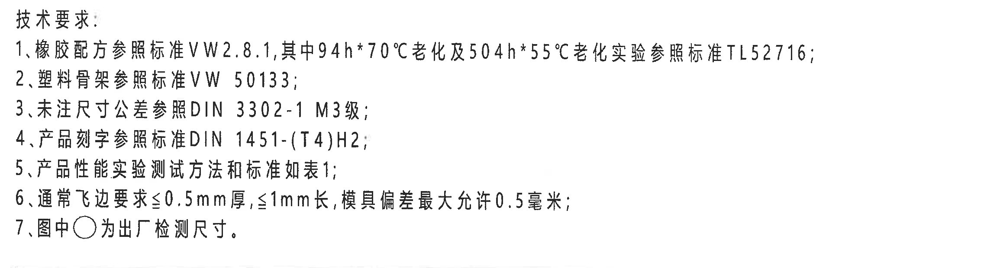

原图位置/视图名称：第 1 页左上技术要求区；bbox `[405, 235, 2715, 855]`。

| 提取项 | 原图数值或文本 | 含义说明 |
|---|---|---|
| 标题 | 技术要求： | 该区域为全图通用技术要求。 |
| 1 | 橡胶配方参照标准 VW 2.8.1，其中 94h*70℃ 老化及 504h*55℃ 老化实验参照标准 TL52716； | 橡胶配方及老化试验引用标准；`*` 在此处为老化条件写法。 |
| 2 | 塑料骨架参照标准 VW 50133； | 塑料骨架材料或零件要求引用标准。 |
| 3 | 未注尺寸公差参照 DIN 3302-1 M3级； | 未单独标注公差的尺寸按该标准等级处理。 |
| 4 | 产品刻字参照标准 DIN 1451-(T4)H2； | 产品文字/刻字样式及规格引用标准；`T4` 为标准文本标识。 |
| 5 | 产品性能实验测试方法和标准如表1； | 性能试验内容指向表1。 |
| 6 | 通常飞边要求≤0.5mm厚，≤1mm长，模具偏差最大允许0.5毫米； | 飞边厚度、长度及模具偏差要求。 |
| 7 | 图中○为出厂检测尺寸。 | 图中用圆/椭圆框标识的尺寸为出厂检测尺寸。 |

边界归属说明：裁切仅包含技术要求文字区，上方和左侧留有空白边；未包含下方“表1:衬套性能实验”和右上修订履历表。

## object_2 修订履历表

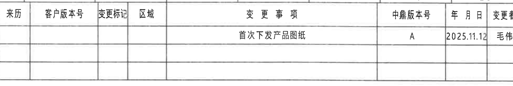

原图位置/视图名称：第 1 页右上修订履历表；bbox `[2795, 155, 4755, 485]`。

原表行列还原：

| 来历 | 客户版本号 | 变更标记 | 区域 | 变更事项 | 中鼎版本号 | 年月日 | 变更者 |
|---|---|---|---|---|---|---|---|
|  |  |  |  | 首次下发产品图纸 | A | 2025.11.12 | 毛伟 |
|  |  |  |  |  |  |  |  |
|  |  |  |  |  |  |  |  |

| 提取项 | 原图数值或文本 | 含义说明 |
|---|---|---|
| 变更事项 | 首次下发产品图纸 | 首次发布图纸的变更说明。 |
| 中鼎版本号 | A | 当前中鼎版本号。 |
| 年月日 | 2025.11.12 | 修订记录日期。 |
| 变更者 | 毛伟 | 修订/变更人员。 |
| 空白栏位 | 来历、客户版本号、变更标记、区域及下方两行为空 | 原表存在空白单元格，未填内容。 |

边界归属说明：裁切框沿表格外框截取，未提取右侧图框坐标栏内容；表格下方空行按原图保留。

## object_3 表1:衬套性能实验

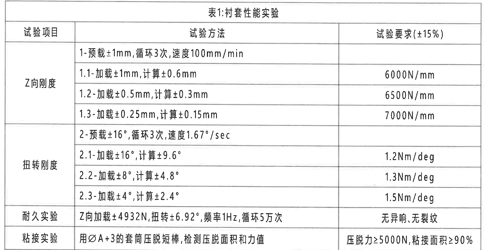

原图位置/视图名称：第 1 页左中“表1:衬套性能实验”；bbox `[410, 855, 2630, 1975]`。

原表行列还原：

| 试验项目 | 试验方法 | 试验要求(±15%) |
|---|---|---|
| Z向刚度 | 1-预载±1mm,循环3次,速度100mm/min |  |
|  | 1.1-加载±1mm,计算±0.6mm | 6000N/mm |
|  | 1.2-加载±0.5mm,计算±0.3mm | 6500N/mm |
|  | 1.3-加载±0.25mm,计算±0.15mm | 7000N/mm |
| 扭转刚度 | 2-预载±16°,循环3次,速度1.67°/sec |  |
|  | 2.1-加载±16°,计算±9.6° | 1.2Nm/deg |
|  | 2.2-加载±8°,计算±4.8° | 1.3Nm/deg |
|  | 2.3-加载±4°,计算±2.4° | 1.5Nm/deg |
| 耐久实验 | Z向加载±4932N,扭转±6.92°,频率1Hz,循环5万次 | 无异响,无裂纹 |
| 粘接实验 | 用ØA+3的套筒压脱短棒,检测压脱面积和力值 | 压脱力≥5000N,粘接面积≥90% |

| 提取项 | 原图数值或文本 | 含义说明 |
|---|---|---|
| 表题 | 表1:衬套性能实验 | 该表给出产品性能试验方法和验收要求。 |
| 试验要求公差 | ±15% | 表头限定试验要求允许偏差。 |
| Z向刚度 | 6000N/mm、6500N/mm、7000N/mm | 对应 1.1、1.2、1.3 三个加载/计算位移工况。 |
| 扭转刚度 | 1.2Nm/deg、1.3Nm/deg、1.5Nm/deg | 对应 ±16°、±8°、±4° 扭转加载工况。 |
| 耐久实验 | Z向加载±4932N,扭转±6.92°,频率1Hz,循环5万次；无异响,无裂纹 | 同时包含力、角度、频率、循环次数和判定要求。 |
| 粘接实验 | 用ØA+3的套筒压脱短棒；压脱力≥5000N,粘接面积≥90% | `ØA+3` 为套筒直径相对 A 尺寸增加 3 的要求。 |

边界归属说明：裁切完整包含表1外框、表头、合并单元格和底部粘接实验行；未包含左上技术要求和下方其他表格。

## object_4 正视加工视图 / 主视图

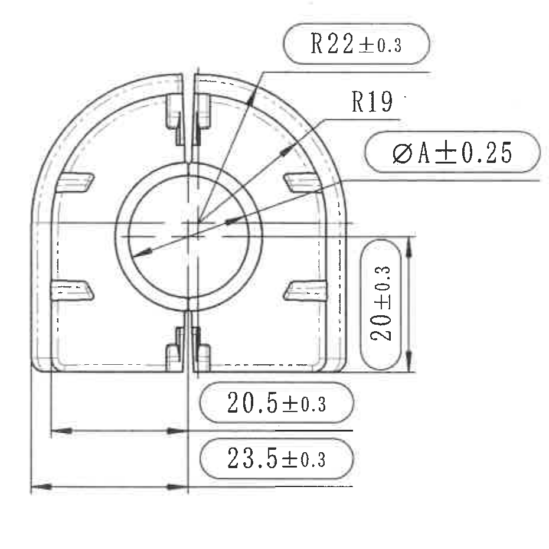

原图位置/视图名称：第 1 页右中正视加工视图；bbox `[2860, 650, 3790, 1580]`。

| 提取项 | 原图数值或文本 | 含义说明 |
|---|---|---|
| 半径尺寸 | R22±0.3 | 上方外弧半径，带 ±0.3 公差，文字带圆角框，按技术要求第7条为出厂检测尺寸。 |
| 半径尺寸 | R19 | 内侧弧向半径标注，原图未给单独公差。 |
| 直径尺寸 | ØA±0.25 | 中央孔/内径 A 的直径尺寸，带 ±0.25 公差；A 与 MQB 调教表及产品信息表的内径/孔径字段对应。 |
| 垂直尺寸 | 20±0.3 | 右侧局部高度/台阶方向尺寸，带 ±0.3 公差，文字竖排并带圆角框。 |
| 水平尺寸 | 20.5±0.3 | 下方较短水平尺寸，带 ±0.3 公差，文字带圆角框。 |
| 水平尺寸 | 23.5±0.3 | 下方较长水平尺寸，带 ±0.3 公差，文字带圆角框。 |
| 参考尺寸 | 未见括号内参考尺寸 | 本主视图中没有括号尺寸。 |
| 星号关键尺寸 | 未见独立星号关键尺寸 | 本主视图尺寸标注未带星号。 |
| 基准字母/T编号 | 未见 | 本主视图未出现基准字母或 T 编号。 |

边界归属说明：右边界收在侧视图左侧之前，未把侧视图片段归入主视图；下方两条水平尺寸线及箭头完整包含，右侧 `20±0.3` 尺寸线和文字完整包含。

## object_5 侧视图

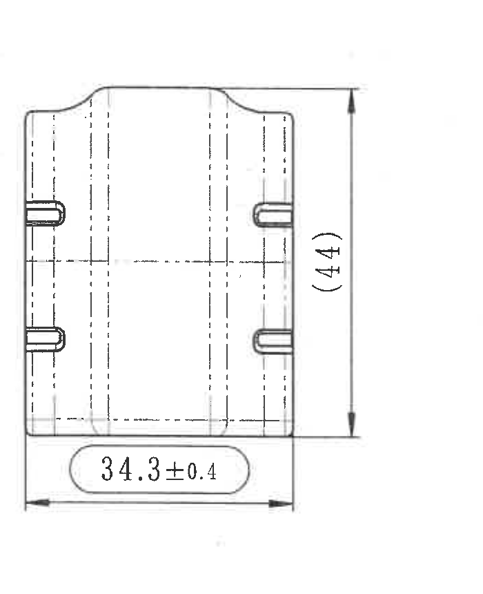

原图位置/视图名称：第 1 页右中侧视图；bbox `[3800, 650, 4500, 1510]`。

| 提取项 | 原图数值或文本 | 含义说明 |
|---|---|---|
| 水平尺寸 | 34.3±0.4 | 侧视图底部宽度/深度尺寸，带 ±0.4 公差。 |
| 括号内参考尺寸 | (44) | 侧视图右侧总高度参考尺寸；括号表示参考尺寸，原图无直接公差。 |
| 参考尺寸说明 | (44) 位于侧视图右侧竖向尺寸线上 | 该尺寸归属侧视图，不归入主视图。 |
| 星号关键尺寸 | 未见 | 本侧视图尺寸标注未带星号。 |
| 基准字母/T编号 | 未见 | 本侧视图未出现基准字母或 T 编号。 |

边界归属说明：裁切框完整包含右侧 `(44)` 竖向尺寸线、箭头和文字，以及底部 `34.3±0.4` 尺寸线；未包含左侧主视图尺寸。

## object_6 三维示意图 / 轴测视图

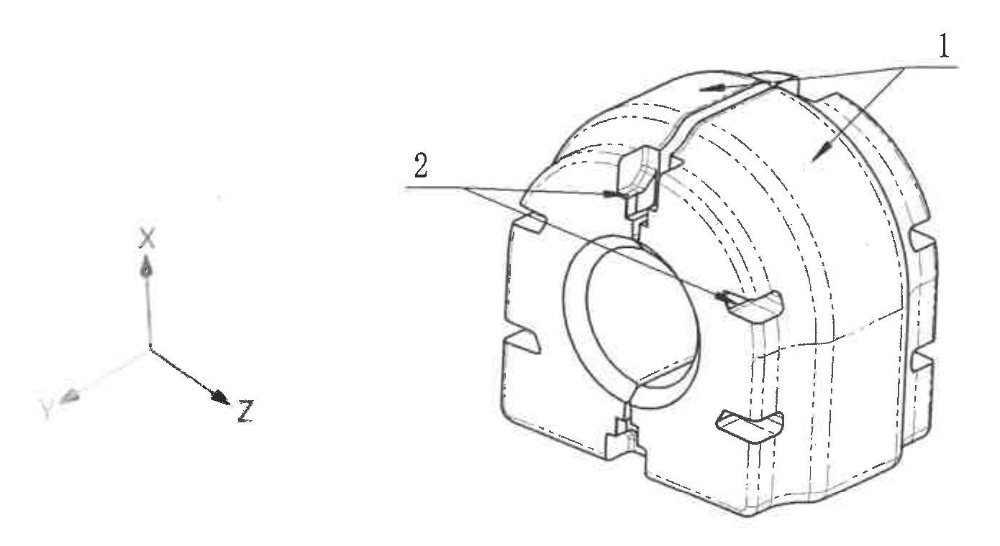

原图位置/视图名称：第 1 页右下三维示意图；bbox `[3060, 1650, 4450, 2410]`。

| 提取项 | 原图数值或文本 | 含义说明 |
|---|---|---|
| 引出编号 | 1 | 按 BOM 序号对应为橡胶件；箭头指向主体橡胶区域。 |
| 引出编号 | 2 | 按 BOM 序号对应为塑料骨架；箭头指向骨架/插入件区域。 |
| 坐标轴 | X、Y、Z | 轴测视图方向标识。 |
| 尺寸标注 | 未见数值尺寸 | 该视图用于三维结构和序号指引，未给尺寸、公差、参考尺寸或 T 编号。 |

边界归属说明：裁切完整包含编号 1、编号 2、引线箭头和 X/Y/Z 坐标轴；下方 BOM 表格未纳入该视图裁切。

## object_7 GB/T 3672.1-2002 M3 公差表

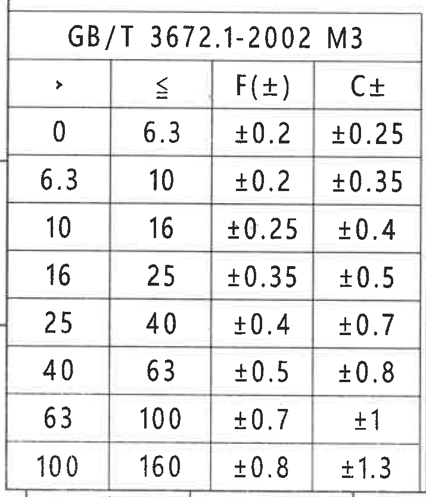

原图位置/视图名称：第 1 页左下公差表；bbox `[375, 2505, 1090, 3340]`。

原表行列还原：

| > | ≤ | F(±) | C± |
|---|---|---|---|
| 0 | 6.3 | ±0.2 | ±0.25 |
| 6.3 | 10 | ±0.2 | ±0.35 |
| 10 | 16 | ±0.25 | ±0.4 |
| 16 | 25 | ±0.35 | ±0.5 |
| 25 | 40 | ±0.4 | ±0.7 |
| 40 | 63 | ±0.5 | ±0.8 |
| 63 | 100 | ±0.7 | ±1 |
| 100 | 160 | ±0.8 | ±1.3 |

| 提取项 | 原图数值或文本 | 含义说明 |
|---|---|---|
| 表题 | GB/T 3672.1-2002 M3 | 橡胶制品相关公差等级表。 |
| 尺寸范围列 | `>` 与 `≤` | 表示尺寸区间下限和上限。 |
| F(±) | ±0.2 至 ±0.8 | F 类公差值随尺寸区间变化。 |
| C± | ±0.25 至 ±1.3 | C 类公差值随尺寸区间变化。 |

边界归属说明：裁切仅含 GB/T 3672.1-2002 M3 公差表；右侧邻近 MQB 表格未纳入。

## object_8 MQB后桥调教表

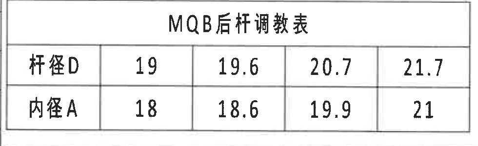

原图位置/视图名称：第 1 页底部偏左“MQB后桥调教表”；bbox `[1080, 2665, 2060, 2965]`。

原表行列还原：

| MQB后桥调教表 |  |  |  |  |
|---|---|---|---|---|
| 杆径D | 19 | 19.6 | 20.7 | 21.7 |
| 内径A | 18 | 18.6 | 19.9 | 21 |

| 提取项 | 原图数值或文本 | 含义说明 |
|---|---|---|
| 参数 D | 杆径D: 19、19.6、20.7、21.7 | 调教表给出的杆径 D 可选值。 |
| 参数 A | 内径A: 18、18.6、19.9、21 | 调教表给出的内径 A 可选值；与主视图 `ØA±0.25` 对应。 |
| 与产品信息对应 | 杆径 Ø19.6、孔径 Ø18.6 | 表3产品信息选用了 D=19.6、A=18.6。 |

边界归属说明：裁切完整包含标题和两行参数表；未包含左侧 GB/T 公差表和下方产品信息表。

## object_9 表3:产品信息

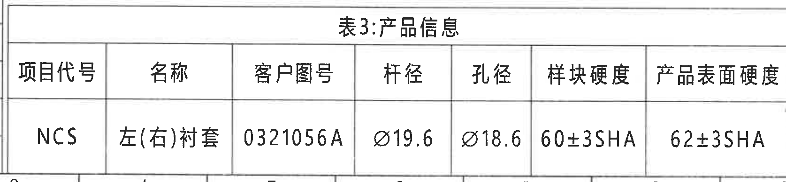

原图位置/视图名称：第 1 页底部中左“表3:产品信息”；bbox `[1075, 2960, 2750, 3350]`。

原表行列还原：

| 项目代号 | 名称 | 客户图号 | 杆径 | 孔径 | 样块硬度 | 产品表面硬度 |
|---|---|---|---|---|---|---|
| NCS | 左(右)衬套 | 0321056A | Ø19.6 | Ø18.6 | 60±3SHA | 62±3SHA |

| 提取项 | 原图数值或文本 | 含义说明 |
|---|---|---|
| 项目代号 | NCS | 产品项目代号。 |
| 名称 | 左(右)衬套 | 产品名称/左右件适用说明。 |
| 客户图号 | 0321056A | 客户图号。 |
| 杆径 | Ø19.6 | 对应 MQB 表中的 D=19.6。 |
| 孔径 | Ø18.6 | 对应 MQB 表中的 A=18.6 和主视图 `ØA±0.25`。 |
| 样块硬度 | 60±3SHA | 样块硬度要求。 |
| 产品表面硬度 | 62±3SHA | 产品表面硬度要求。 |

边界归属说明：裁切完整包含表3标题、表头和数据行；右侧仅有极轻微相邻线痕，未提取为表3内容。

## object_10 BOM 清单

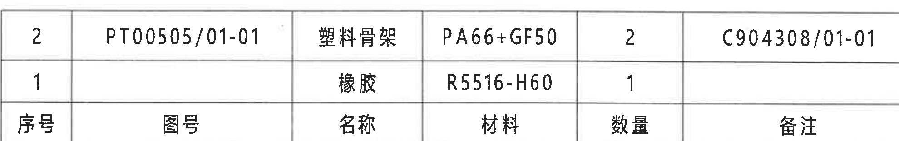

原图位置/视图名称：第 1 页右下 BOM 清单；bbox `[2780, 2425, 4760, 2737]`。

原表行列还原：

| 序号 | 图号 | 名称 | 材料 | 数量 | 备注 |
|---|---|---|---|---|---|
| 2 | PT00505/01-01 | 塑料骨架 | PA66+GF50 | 2 | C904308/01-01 |
| 1 |  | 橡胶 | R5516-H60 | 1 |  |

| 提取项 | 原图数值或文本 | 含义说明 |
|---|---|---|
| BOM序号2 | 图号 PT00505/01-01；名称 塑料骨架；材料 PA66+GF50；数量 2；备注 C904308/01-01 | 对应三维示意图编号 2 的塑料骨架。 |
| BOM序号1 | 名称 橡胶；材料 R5516-H60；数量 1 | 对应三维示意图编号 1 的橡胶件。 |
| 表头 | 序号、图号、名称、材料、数量、备注 | 原图表头位于清单下方，Markdown 按表头置顶还原列关系。 |

边界归属说明：BOM 清单与下方标题栏共享边界线；本裁切只提取清单行和清单表头，不提取下方标题栏字段。

## object_11 标题栏

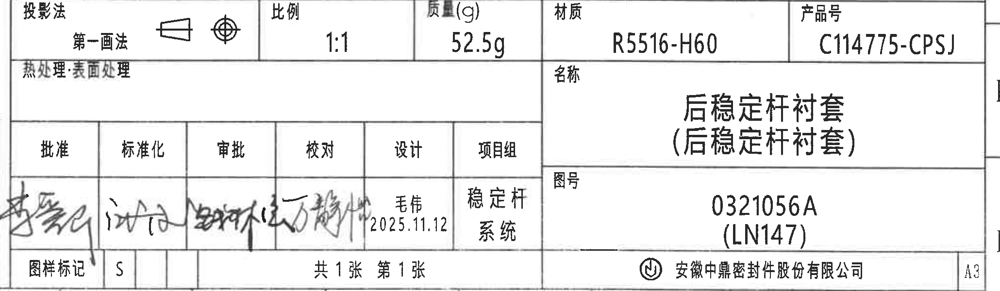

原图位置/视图名称：第 1 页右下标题栏；bbox `[2760, 2745, 4820, 3345]`。

标题栏字段还原：

| 字段 | 原图数值或文本 |
|---|---|
| 投影法 | 第一画法；含第一角投影符号 |
| 比例 | 1:1 |
| 质量(g) | 52.5g |
| 材质 | R5516-H60 |
| 产品号 | C114775-CPSJ |
| 热处理:表面处理 | 空白 |
| 名称 | 后稳定杆衬套（后稳定杆衬套） |
| 图号 | 0321056A (LN147) |
| 图样标记 | S |
| 页数 | 共1张 第1张 |
| 公司 | 安徽中鼎密封件股份有限公司 |
| 图幅 | A3 |

签审/项目字段还原：

| 批准 | 标准化 | 审批 | 校对 | 设计 | 项目组 |
|---|---|---|---|---|---|
| 手写签名 | 手写签名 | 手写签名 | 手写签名 | 毛伟 / 2025.11.12 | 稳定杆系统 |

| 提取项 | 原图数值或文本 | 含义说明 |
|---|---|---|
| 产品名称 | 后稳定杆衬套（后稳定杆衬套） | 标题栏主名称。 |
| 图号 | 0321056A (LN147) | 图纸编号及括号内平台/项目标识。 |
| 产品号 | C114775-CPSJ | 产品号字段。 |
| 材质 | R5516-H60 | 标题栏材料，与 BOM 序号1橡胶材料一致。 |
| 质量 | 52.5g | 单件质量字段。 |
| 设计 | 毛伟 / 2025.11.12 | 设计人员与日期。 |

边界归属说明：裁切包含标题栏主字段、签审区、页数、公司和 A3 图幅；顶部与 BOM 清单相邻，左侧手写签名靠近边界但文字完整，右侧仅保留必要图幅边界。

## 裁切检查记录

| 对象 | 图片路径 | 检查结果 |
|---|---|---|
| object_1 | `20C114775_assets/images/object_1.png` | 完整包含技术要求 1-7 条；未裁掉文字；未带入表1。 |
| object_2 | `20C114775_assets/images/object_2.png` | 完整包含修订履历表外框、表头、首行记录和空白行；未提取右侧图框坐标栏。 |
| object_3 | `20C114775_assets/images/object_3.png` | 完整包含表1所有行列及底部粘接实验行；未裁掉表格线或文字。 |
| object_4 | `20C114775_assets/images/object_4.png` | 主视图所有尺寸线、箭头和文字完整；右侧未混入侧视图片段。 |
| object_5 | `20C114775_assets/images/object_5.png` | 侧视图 `34.3±0.4`、`(44)` 的尺寸线、箭头和文字完整；未混入主视图。 |
| object_6 | `20C114775_assets/images/object_6.png` | 三维视图编号 1、2、引线和 X/Y/Z 坐标轴完整；未混入下方 BOM 文本。 |
| object_7 | `20C114775_assets/images/object_7.png` | GB/T 公差表外框、表头和 8 行数据完整；未混入 MQB 表。 |
| object_8 | `20C114775_assets/images/object_8.png` | MQB 后桥调教表标题、两行参数和全部列完整。 |
| object_9 | `20C114775_assets/images/object_9.png` | 表3标题、表头、数据行和右侧“产品表面硬度”文字完整；右侧轻微相邻线痕不作为内容提取。 |
| object_10 | `20C114775_assets/images/object_10.png` | BOM 清单行和表头完整；下方标题栏字段未纳入提取。 |
| object_11 | `20C114775_assets/images/object_11.png` | 标题栏主要字段、签审区、公司、页数和 A3 图幅完整；右侧图框边界仅作裁切余量。 |
