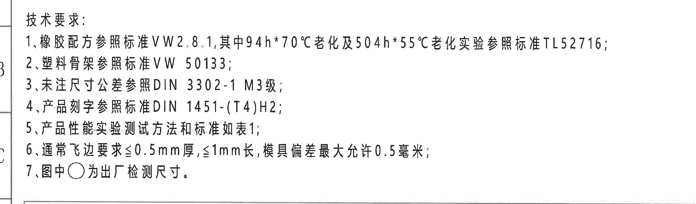
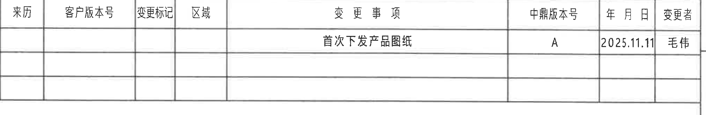
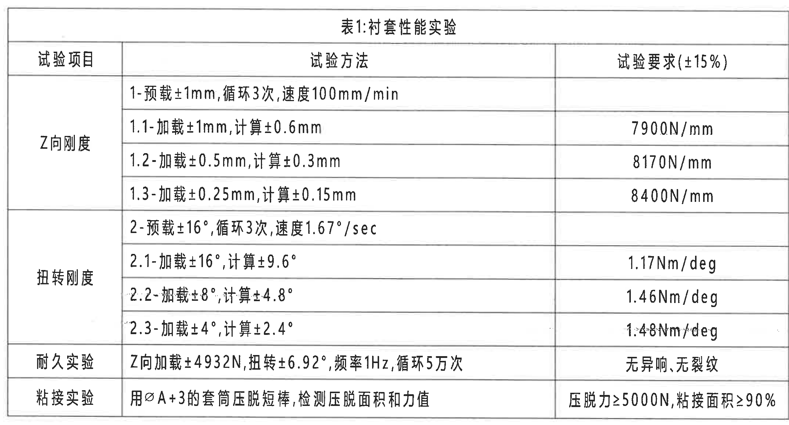
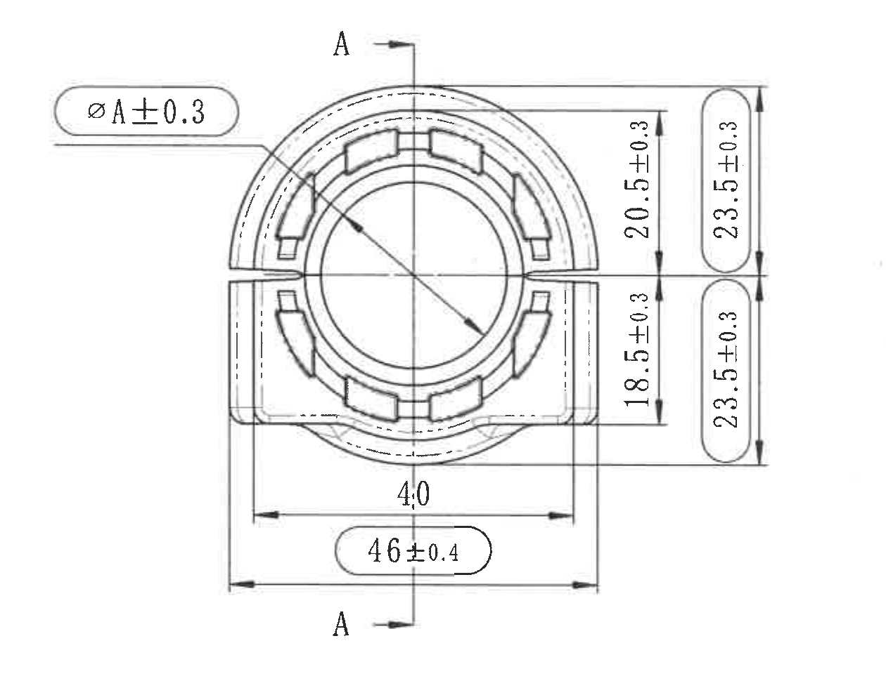
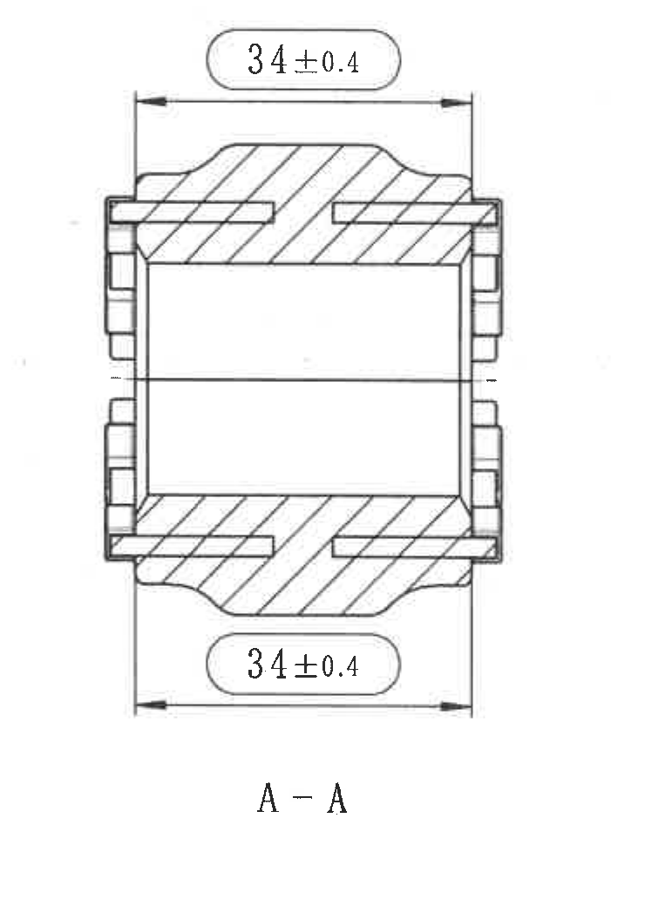
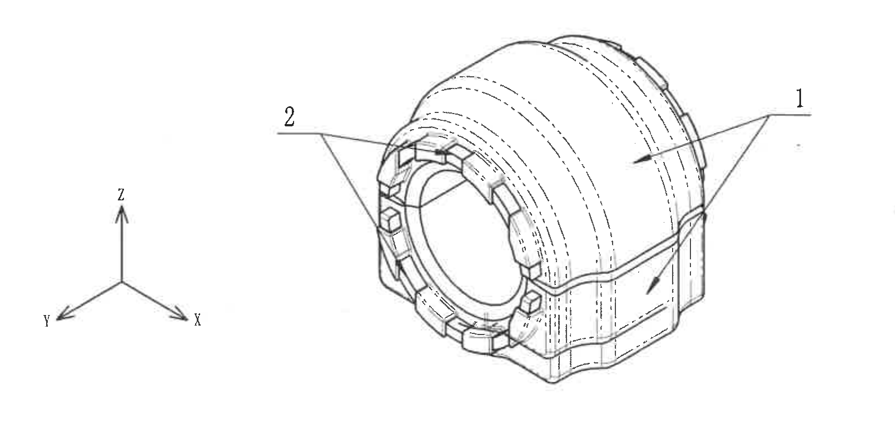
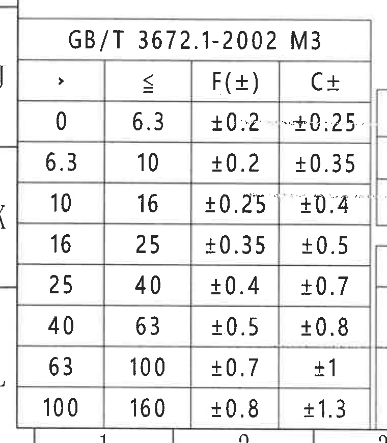
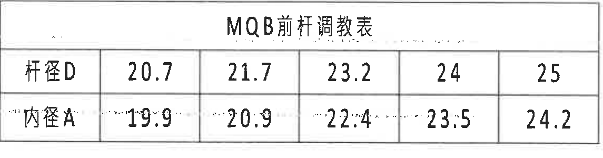
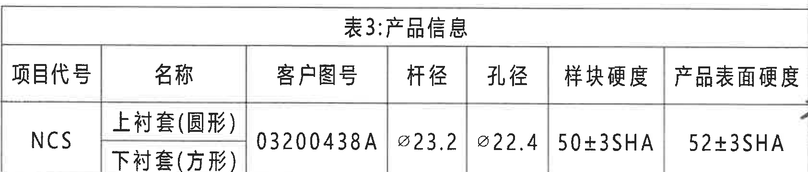
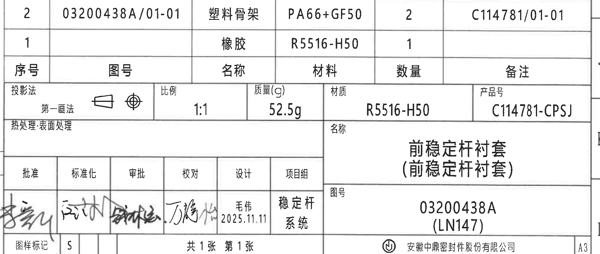

# 20C114781 PDF 内容识别与裁切提取

整页 PNG：`20C114781_assets/images/page_1.png`  
页面尺寸：4959 x 3505 px  
说明：所有 bbox 均为整页 PNG 像素坐标 `[x1, y1, x2, y2]`。图中未发现括号形式的参考尺寸标注；括号文本如 `(LN147)`、`(前稳定杆衬套)`、`(圆形)`、`(方形)` 为图号/名称文本，不作为参考尺寸解释。未发现带星号的关键尺寸标注；技术要求中的 `94h*70℃`、`504h*55℃` 为老化条件写法。

## object_1 - NOTES / 技术要求

原图位置/视图名称：左上区域 A-C/1-9，技术要求；bbox `[350, 230, 2560, 880]`。

原文还原：

1、橡胶配方参照标准VW2.8.1,其中94h*70℃老化及504h*55℃老化实验参照标准TL52716;  
2、塑料骨架参照标准VW 50133;  
3、未注尺寸公差参照DIN 3302-1 M3级;  
4、产品刻字参照标准DIN 1451-(T4)H2;  
5、产品性能实验测试方法和标准如表1;  
6、通常飞边要求≤0.5mm厚,≤1mm长,模具偏差最大允许0.5毫米;  
7、图中○为出厂检测尺寸。

| 提取项 | 原图数值或文本 | 含义说明 |
|---|---|---|
| 橡胶配方标准 | VW2.8.1 | 橡胶材料/配方执行标准。 |
| 老化条件 | 94h*70℃；504h*55℃ | 老化试验条件，星号在此处为条件组合/乘号写法，不是关键尺寸星号。 |
| 老化试验标准 | TL52716 | 94h*70℃ 与 504h*55℃ 老化实验参照标准。 |
| 塑料骨架标准 | VW 50133 | 塑料骨架执行标准。 |
| 未注尺寸公差 | DIN 3302-1 M3级 | 图中未单独标注公差的尺寸按此等级执行。 |
| 产品刻字标准 | DIN 1451-(T4)H2 | 产品刻字字体/高度要求。 |
| 性能试验依据 | 表1 | 产品性能实验测试方法和标准见 object_3。 |
| 飞边要求 | ≤0.5mm厚；≤1mm长 | 通常飞边厚度和长度限制。 |
| 模具偏差 | 最大允许0.5毫米 | 模具偏差上限。 |
| 出厂检测尺寸标识 | 图中○ | 被圆形/圆角框圈出的尺寸为出厂检测尺寸。 |

边界归属说明：该裁切只覆盖技术要求文本区，底部表1标题线不进入识别内容；左侧少量图框坐标线属于图纸边框，不作为 NOTES 文本。

## object_2 - 修订履历表

原图位置/视图名称：右上区域 A-B/10-16，修订/变更表；bbox `[2775, 185, 4795, 515]`。

原表还原：

| 来历 | 客户版本号 | 变更标记 | 区域 | 变更事项 | 中鼎版本号 | 年 月 日 | 变更者 |
|---|---|---|---|---|---|---|---|
|  |  |  |  | 首次下发产品图纸 | A | 2025.11.11 | 毛伟 |
|  |  |  |  |  |  |  |  |
|  |  |  |  |  |  |  |  |

| 提取项 | 原图数值或文本 | 含义说明 |
|---|---|---|
| 变更事项 | 首次下发产品图纸 | 图纸首次发布记录。 |
| 中鼎版本号 | A | 当前中鼎版本号。 |
| 年月日 | 2025.11.11 | 该修订记录日期。 |
| 变更者 | 毛伟 | 记录责任人。 |
| 空白字段 | 来历、客户版本号、变更标记、区域 | 原图对应单元格为空。 |

边界归属说明：裁切包含完整表头、首条记录和下方两个空白记录行；未包含右侧图框坐标字母 A/B 作为表格内容。

## object_3 - 表1：衬套性能实验

原图位置/视图名称：左中区域 D-G/1-9，表1：衬套性能实验；bbox `[405, 850, 2555, 2010]`。

原表还原：

| 试验项目 | 试验方法 | 试验要求(±15%) |
|---|---|---|
| Z向刚度 | 1-预载±1mm,循环3次,速度100mm/min |  |
| Z向刚度 | 1.1-加载±1mm,计算±0.6mm | 7900N/mm |
| Z向刚度 | 1.2-加载±0.5mm,计算±0.3mm | 8170N/mm |
| Z向刚度 | 1.3-加载±0.25mm,计算±0.15mm | 8400N/mm |
| 扭转刚度 | 2-预载±16°,循环3次,速度1.67°/sec |  |
| 扭转刚度 | 2.1-加载±16°,计算±9.6° | 1.17Nm/deg |
| 扭转刚度 | 2.2-加载±8°,计算±4.8° | 1.46Nm/deg |
| 扭转刚度 | 2.3-加载±4°,计算±2.4° | 1.48Nm/deg |
| 耐久实验 | Z向加载±4932N,扭转±6.92°,频率1Hz,循环5万次 | 无异响,无裂纹 |
| 粘接实验 | 用ØA+3的套筒压脱短棒,检测压脱面积和力值 | 压脱力≥5000N,粘接面积≥90% |

| 提取项 | 原图数值或文本 | 含义说明 |
|---|---|---|
| 表号/表名 | 表1:衬套性能实验 | 产品性能实验测试方法和标准。 |
| Z向刚度预载 | ±1mm；循环3次；速度100mm/min | Z向刚度测试前置加载条件。 |
| Z向刚度 1.1 | 加载±1mm,计算±0.6mm；7900N/mm | Z向加载位移和计算位移对应刚度要求。 |
| Z向刚度 1.2 | 加载±0.5mm,计算±0.3mm；8170N/mm | Z向加载位移和计算位移对应刚度要求。 |
| Z向刚度 1.3 | 加载±0.25mm,计算±0.15mm；8400N/mm | Z向加载位移和计算位移对应刚度要求。 |
| 扭转刚度预载 | ±16°；循环3次；速度1.67°/sec | 扭转刚度测试前置角度和速度。 |
| 扭转刚度 2.1 | 加载±16°,计算±9.6°；1.17Nm/deg | 扭转角度对应刚度要求。 |
| 扭转刚度 2.2 | 加载±8°,计算±4.8°；1.46Nm/deg | 扭转角度对应刚度要求。 |
| 扭转刚度 2.3 | 加载±4°,计算±2.4°；1.48Nm/deg | 扭转角度对应刚度要求；原图该数值附近有扫描干扰线，按可辨文字读取。 |
| 耐久实验 | Z向加载±4932N,扭转±6.92°,频率1Hz,循环5万次；无异响,无裂纹 | 耐久试验载荷、扭转角、频率、循环次数及验收要求。 |
| 粘接实验 | 用ØA+3的套筒压脱短棒；压脱力≥5000N,粘接面积≥90% | `ØA+3` 关联主视图直径 A，规定压脱工装直径及粘接验收要求。 |

边界归属说明：该裁切完整覆盖表1外框、表头、所有行线和文字；下方空白图纸区域未纳入。表内角度、力值和直径符号只归属于性能实验表，不归入右侧主视图或剖视图。

## object_4 - 主视图 / A-A 剖切位置图

原图位置/视图名称：右上偏中区域 C-F/10-13，主视图，带 A-A 剖切位置；bbox `[2680, 690, 3940, 1670]`。

| 提取项 | 原图数值或文本 | 含义说明 |
|---|---|---|
| 直径尺寸 | ØA±0.3 | 主视图中以内孔/圆形特征为基准的直径 A，公差 ±0.3；圆角框标识为出厂检测尺寸。 |
| 剖切基准字母 | A、A；A-A | 竖向剖切线穿过主视图中心，上下标注 A，对应 object_5 的 A-A 剖视。 |
| 上侧局部高度 | 20.5±0.3 | 自中间水平基准线向上到上部相关轮廓的垂直尺寸。 |
| 下侧局部高度 | 18.5±0.3 | 自中间水平基准线向下到下部相关轮廓的垂直尺寸。 |
| 上侧外廓高度 | 23.5±0.3 | 自中间水平基准线向上到外廓的垂直检测尺寸；圆角框标识为出厂检测尺寸。 |
| 下侧外廓高度 | 23.5±0.3 | 自中间水平基准线向下到外廓的垂直检测尺寸；圆角框标识为出厂检测尺寸。 |
| 外廓总高度 | 47.0±0.6 | 原图未直接给出总高度；由上下两个 `23.5±0.3` 相加得到，仅作为由原图尺寸链得出的说明。 |
| 内侧水平宽度 | 40 | 下方较短水平尺寸，表示两侧内边界/台阶间宽度；未单独标注公差，按技术要求未注公差执行。 |
| 外侧水平宽度 | 46±0.4 | 下方较长水平检测尺寸；圆角框标识为出厂检测尺寸。 |
| 圆弧/弧向尺寸 | 未标注独立 R、弧长或弧度数值 | 主视图显示多道圆弧轮廓，但未给出单独半径、弧长、角度或弧向尺寸数值。 |
| 参考尺寸 | 未见括号参考尺寸 | 本视图无括号尺寸。 |
| 数量前缀/T编号 | 未见 2X、nX 或 T 编号 | 本视图无数量前缀尺寸和 T 编号。 |

边界归属说明：右侧 `20.5±0.3`、`18.5±0.3`、上下 `23.5±0.3` 的尺寸线和箭头均指向主视图轮廓，因此归入本对象；右侧相邻 A-A 剖视中的 `34±0.4` 未纳入本对象。下方 `40`、`46±0.4` 的尺寸线完整包含在裁切内。

## object_5 - A-A 剖视图

原图位置/视图名称：右上区域 C-F/14-15，A-A 剖视图；bbox `[3905, 650, 4645, 1690]`。

| 提取项 | 原图数值或文本 | 含义说明 |
|---|---|---|
| 剖视名称 | A-A | 对应 object_4 主视图中的 A-A 剖切线。 |
| 上侧宽度尺寸 | 34±0.4 | 剖视图上方水平检测尺寸，尺寸线跨越剖视外侧宽度；圆角框标识为出厂检测尺寸。 |
| 下侧宽度尺寸 | 34±0.4 | 剖视图下方水平检测尺寸，尺寸线跨越剖视外侧宽度；圆角框标识为出厂检测尺寸。 |
| 剖面线 | 斜剖面线 | 表示 A-A 剖切到的实体材料区域。 |
| 中心线 | 水平中心线 | 剖视中心参考线。 |
| 参考尺寸 | 未见括号参考尺寸 | 本剖视图无括号尺寸。 |
| 圆弧/弧向尺寸 | 未标注独立 R、弧长或弧度数值 | 剖视外廓含曲线轮廓，但未给出单独弧度/半径标注。 |
| 数量前缀/T编号 | 未见 2X、nX 或 T 编号 | 本剖视图无数量前缀尺寸和 T 编号。 |

边界归属说明：裁切只覆盖 A-A 剖视图及其上下 `34±0.4` 尺寸线、箭头和文字；左侧主视图的垂直尺寸未进入本对象。

## object_6 - 轴测图 / 序号标注图

原图位置/视图名称：右下区域 G-I/10-16，轴测图；bbox `[2985, 1680, 4595, 2440]`。

| 提取项 | 原图数值或文本 | 含义说明 |
|---|---|---|
| 序号标注 | 1 | 引出线指向外侧橡胶/主体区域；对应标题栏 BOM 中序号 1：橡胶，材料 R5516-H50，数量 1。 |
| 序号标注 | 2 | 引出线指向端面骨架/嵌件区域；对应标题栏 BOM 中序号 2：塑料骨架，材料 PA66+GF50，数量 2。 |
| 坐标轴 | X、Y、Z | 图中给出轴测方向参考。 |
| 尺寸标注 | 未标注数值尺寸 | 本轴测图仅用于结构与物料序号表达，没有尺寸线、角度、直径、弧度或公差数值。 |
| 参考尺寸/T编号 | 未见 | 本轴测图无括号参考尺寸和 T 编号。 |

边界归属说明：裁切包含完整轴测零件、序号 1/2 引出线和 X/Y/Z 坐标轴；底部标题栏未纳入本对象。

## object_7 - GB/T 3672.1-2002 M3 公差表

原图位置/视图名称：左下区域 J-L/1-3，GB/T 3672.1-2002 M3 公差表；bbox `[350, 2500, 1110, 3370]`。

原表还原：

| > | ≤ | F(±) | C± |
|---|---|---|---|
| 0 | 6.3 | ±0.2 | ±0.25 |
| 6.3 | 10 | ±0.2 | ±0.35 |
| 10 | 16 | ±0.25 | ±0.4 |
| 16 | 25 | ±0.35 | ±0.5 |
| 25 | 40 | ±0.4 | ±0.7 |
| 40 | 63 | ±0.5 | ±0.8 |
| 63 | 100 | ±0.7 | ±1 |
| 100 | 160 | ±0.8 | ±1.3 |

| 提取项 | 原图数值或文本 | 含义说明 |
|---|---|---|
| 标准/等级 | GB/T 3672.1-2002 M3 | 橡胶件尺寸公差等级表。 |
| 范围 0-6.3 | F±0.2；C±0.25 | 对应尺寸范围的 F/C 公差。 |
| 范围 6.3-10 | F±0.2；C±0.35 | 对应尺寸范围的 F/C 公差。 |
| 范围 10-16 | F±0.25；C±0.4 | 对应尺寸范围的 F/C 公差。 |
| 范围 16-25 | F±0.35；C±0.5 | 对应尺寸范围的 F/C 公差。 |
| 范围 25-40 | F±0.4；C±0.7 | 对应尺寸范围的 F/C 公差。 |
| 范围 40-63 | F±0.5；C±0.8 | 对应尺寸范围的 F/C 公差。 |
| 范围 63-100 | F±0.7；C±1 | 对应尺寸范围的 F/C 公差。 |
| 范围 100-160 | F±0.8；C±1.3 | 对应尺寸范围的 F/C 公差。 |

边界归属说明：裁切包含该公差表完整外框和底部行；左右边缘仅有相邻图框线段，不含相邻对象文字。该表的公差数值用于未注或标准公差解释，不归入具体视图尺寸线。

## object_8 - MQB 前杆调整表

原图位置/视图名称：底部偏左 K/4-8，MQB前杆调整表；bbox `[1090, 2675, 2235, 2975]`。

原表还原：

|  | 20.7 | 21.7 | 23.2 | 24 | 25 |
|---|---|---|---|---|---|
| 杆径D | 20.7 | 21.7 | 23.2 | 24 | 25 |
| 内径A | 19.9 | 20.9 | 22.4 | 23.5 | 24.2 |

| 提取项 | 原图数值或文本 | 含义说明 |
|---|---|---|
| 表名 | MQB前杆调整表 | 前稳定杆杆径 D 与内径 A 的对应调整表。 |
| 杆径D | 20.7、21.7、23.2、24、25 | 横向列出的杆径选项。 |
| 内径A | 19.9、20.9、22.4、23.5、24.2 | 与杆径 D 对应的内径 A；A 与主视图 `ØA±0.3` 关联。 |

边界归属说明：裁切包含表名、两行表格和所有列线；不包含下方表3产品信息内容。

## object_9 - 表3：产品信息

原图位置/视图名称：底部中左 L/4-9，表3：产品信息；bbox `[1085, 2970, 2770, 3330]`。

原表还原：

| 项目代号 | 名称 | 客户图号 | 杆径 | 孔径 | 样块硬度 | 产品表面硬度 |
|---|---|---|---|---|---|---|
| NCS | 上衬套(圆形) | 03200438A | Ø23.2 | Ø22.4 | 50±3SHA | 52±3SHA |
|  | 下衬套(方形) |  |  |  |  |  |

| 提取项 | 原图数值或文本 | 含义说明 |
|---|---|---|
| 表号/表名 | 表3:产品信息 | 产品项目、客户图号、杆径/孔径和硬度信息。 |
| 项目代号 | NCS | 项目代号。 |
| 名称 | 上衬套(圆形)；下衬套(方形) | 同一项目下的上下衬套名称。 |
| 客户图号 | 03200438A | 客户图纸号。 |
| 杆径 | Ø23.2 | 杆径尺寸，带直径符号。 |
| 孔径 | Ø22.4 | 孔径尺寸，带直径符号。 |
| 样块硬度 | 50±3SHA | 样块硬度要求。 |
| 产品表面硬度 | 52±3SHA | 产品表面硬度要求。 |

边界归属说明：裁切覆盖表3外框和全部字段；右边界按产品信息表边线裁切，未把右侧标题栏签字区内容作为本表内容。

## object_10 - 标题栏 / BOM / 图纸信息

原图位置/视图名称：右下区域 I-L/10-16，标题栏、BOM、图纸信息；bbox `[2760, 2470, 4810, 3340]`。

BOM 原表还原：

| 序号 | 图号 | 名称 | 材料 | 数量 | 备注 |
|---|---|---|---|---|---|
| 2 | 03200438A/01-01 | 塑料骨架 | PA66+GF50 | 2 | C114781/01-01 |
| 1 |  | 橡胶 | R5516-H50 | 1 |  |

标题栏字段还原：

| 字段 | 原图文本 |
|---|---|
| 投影法 | 第一画法；投影视图符号 |
| 比例 | 1:1 |
| 质量(g) | 52.5g |
| 材质 | R5516-H50 |
| 产品号 | C114781-CPSJ |
| 热处理·表面处理 | 空白 |
| 名称 | 前稳定杆衬套（前稳定杆衬套） |
| 图号 | 03200438A（LN147） |
| 批准 | 手写签名 |
| 标准化 | 手写签名 |
| 审批 | 手写签名 |
| 校对 | 手写签名 |
| 设计 | 毛伟；2025.11.11 |
| 项目组 | 稳定杆系统 |
| 图样标记 | S |
| 张数 | 共1张 第1张 |
| 公司 | 安徽中鼎密封件股份有限公司 |
| 图幅 | A3 |

| 提取项 | 原图数值或文本 | 含义说明 |
|---|---|---|
| BOM 序号 2 | 图号 03200438A/01-01；塑料骨架；PA66+GF50；数量 2；备注 C114781/01-01 | 轴测图序号 2 对应塑料骨架。 |
| BOM 序号 1 | 橡胶；R5516-H50；数量 1 | 轴测图序号 1 对应橡胶主体。 |
| 比例 | 1:1 | 图样比例。 |
| 质量 | 52.5g | 产品质量。 |
| 材质 | R5516-H50 | 标题栏材质字段。 |
| 产品号 | C114781-CPSJ | 产品编号。 |
| 名称 | 前稳定杆衬套（前稳定杆衬套） | 零件名称。 |
| 图号 | 03200438A（LN147） | 图纸编号/平台或项目代码。 |
| 日期 | 2025.11.11 | 设计栏日期，与修订表日期一致。 |

边界归属说明：裁切按右下标题栏主框截取，包含 BOM、投影法、比例、质量、材质、产品号、名称、图号、签字/审核栏、图样标记、张数、公司和图幅。左侧表3产品信息只在相邻边界处接触，不作为本标题栏内容提取。

## 裁切检查记录

| 对象 | 图片路径 | 检查结论 |
|---|---|---|
| object_1 | `20C114781_assets/images/object_1.png` | 完整包含技术要求 1-7 条；底部表1边线未纳入文本提取。 |
| object_2 | `20C114781_assets/images/object_2.png` | 完整包含修订表表头、首条记录和空白行；无文字被裁断。 |
| object_3 | `20C114781_assets/images/object_3.png` | 完整包含表1外框、行列线、角度/载荷/刚度/粘接要求；无边缘文字裁切。 |
| object_4 | `20C114781_assets/images/object_4.png` | 完整包含主视图、A-A 剖切标识、`ØA±0.3`、`20.5±0.3`、`18.5±0.3`、上下 `23.5±0.3`、`40`、`46±0.4` 的尺寸线、箭头和文字；未混入 A-A 剖视图 `34±0.4`。 |
| object_5 | `20C114781_assets/images/object_5.png` | 重裁后完整包含 A-A 剖视、上下 `34±0.4` 尺寸线、箭头和文字；未混入主视图尺寸。 |
| object_6 | `20C114781_assets/images/object_6.png` | 重裁后完整包含轴测图、序号 1/2 引出线和 X/Y/Z 坐标轴；底部标题栏未纳入。 |
| object_7 | `20C114781_assets/images/object_7.png` | 完整包含 GB/T 公差表外框和全部行列；左右仅有相邻图框线段，无相邻对象文字。 |
| object_8 | `20C114781_assets/images/object_8.png` | 完整包含 MQB 前杆调整表表名、两行数据和全部列线；无边缘文字裁切。 |
| object_9 | `20C114781_assets/images/object_9.png` | 完整包含表3产品信息字段和数据；右边界避免纳入标题栏签字区。 |
| object_10 | `20C114781_assets/images/object_10.png` | 完整包含标题栏主框内 BOM、投影法、比例、质量、材质、产品号、名称、图号、签字/审核栏、图样标记、张数、公司和图幅；未将左侧表3列内容并入本对象。 |
