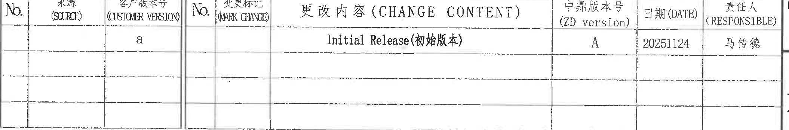
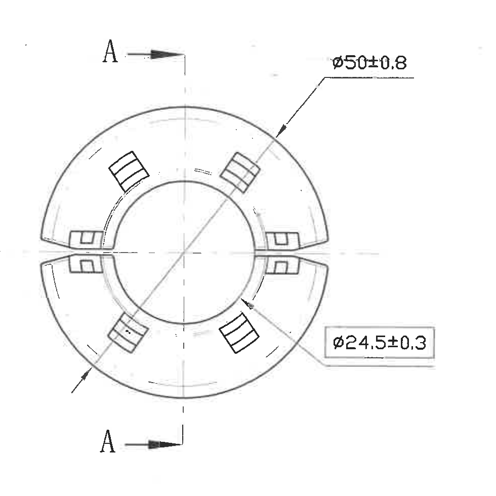
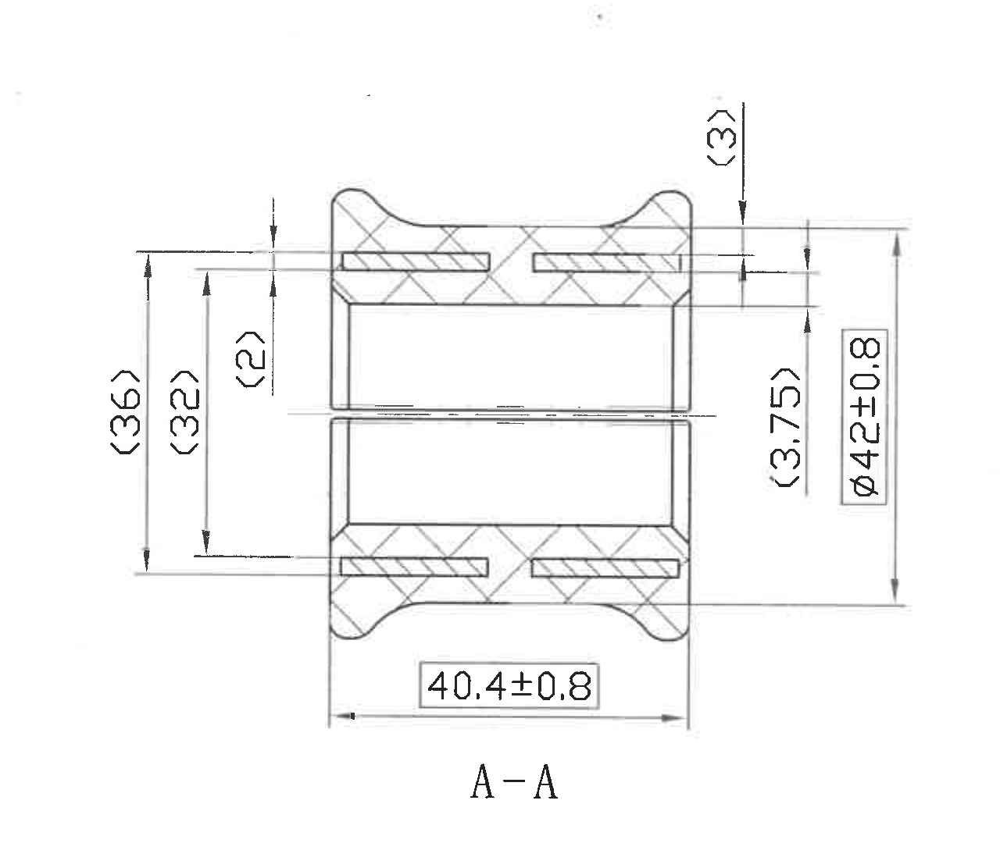
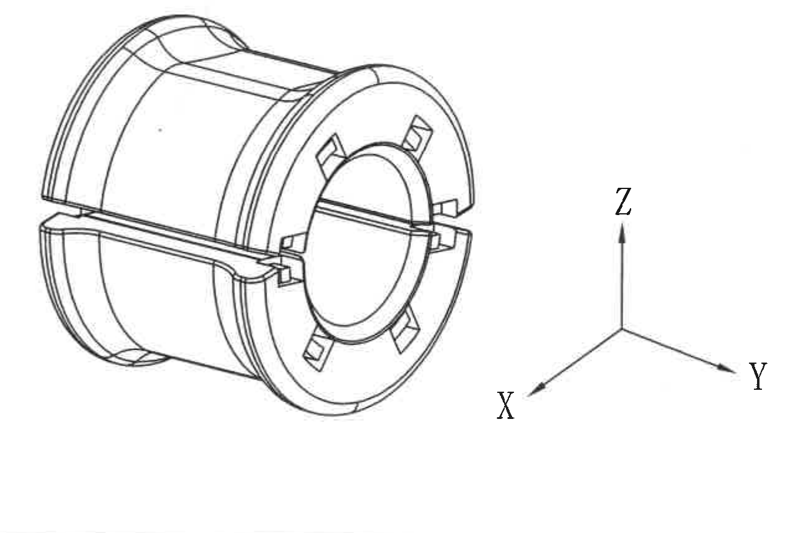
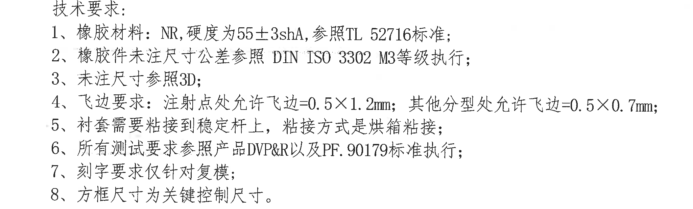
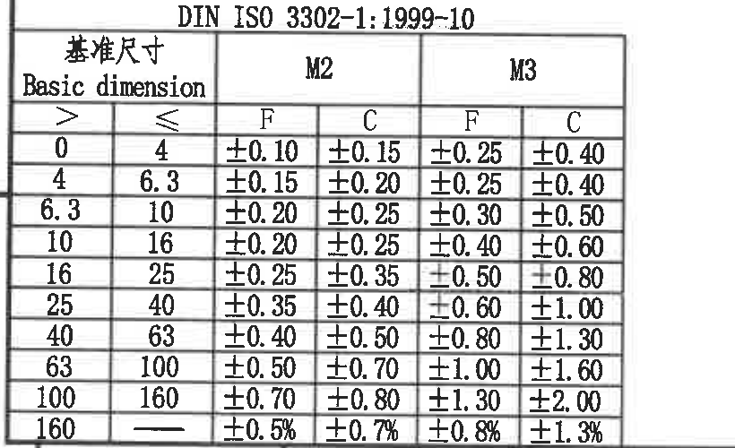
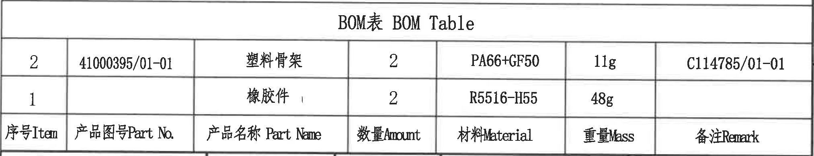
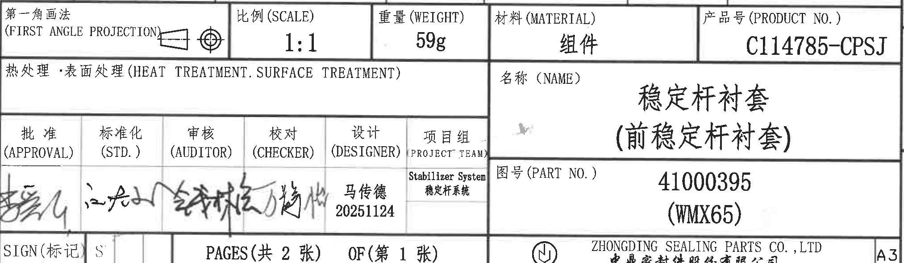

# 20C114785 内容识别

整页 PNG：`outputs/20C114785_assets/images/page_1.png`，尺寸 4959 x 3505 px。  
说明：图纸尺寸单位按机械图默认 mm 记录；括号内尺寸按参考尺寸记录并说明；本页未见星号关键尺寸标记、T 编号、角度数值、弧度数值或弧向尺寸数值标注。

## object_1 顶部修订/版本记录表

原图位置/视图名称：第 1 页顶部修订/版本记录表，bbox `[2680, 190, 4790, 540]`。

原表行列还原：

| No. | 来源 (SOURCE) | 客户版本号 (CUSTOMER VERSION) | No. | 变更标记 (MARK CHANGE) | 更改内容（CHANGE CONTENT） | 中鼎版本号 (ZD version) | 日期 (DATE) | 责任人 (RESPONSIBLE) |
|---|---|---|---|---|---|---|---|---|
|  |  | a |  |  | Initial Release(初始版本) | A | 20251124 | 马传德 |
|  |  |  |  |  |  |  |  |  |
|  |  |  |  |  |  |  |  |  |
|  |  |  |  |  |  |  |  |  |

提取表格：

| 提取项 | 原图数值或文本 | 含义说明 |
|---|---|---|
| 客户版本号 | a | 客户版本栏当前记录为 a。 |
| 更改内容 | Initial Release(初始版本) | 本次记录为初始发布。 |
| 中鼎版本号 | A | 中鼎内部版本为 A。 |
| 日期 | 20251124 | 修订/发布日期记录。 |
| 责任人 | 马传德 | 对应版本记录责任人。 |

边界归属说明：裁切只覆盖顶部修订表外框和表内记录；上方图框坐标数字已排除，右侧图框坐标字母未纳入表格内容。

## object_2 端面加工视图

原图位置/视图名称：第 1 页左中部端面加工视图，bbox `[740, 835, 1720, 1815]`。

提取表格：

| 提取项 | 原图数值或文本 | 含义说明 |
|---|---|---|
| 剖切标识 | A / A | 上、下两处 A 箭头标出 A-A 剖切方向；该标识归属于端面视图，用于生成中部 A-A 剖视图，不是尺寸。 |
| 外径尺寸 | Ø50±0.8 | 端面外圆轮廓直径，带直径符号，公差为 ±0.8。 |
| 内径尺寸 | Ø24.5±0.3 | 端面中心孔/内圆直径，带直径符号，公差为 ±0.3。 |
| 角度/弧度/弧向尺寸 | 未标注数值 | 视图中可见圆弧轮廓和分型开口，但没有角度、弧度或弧长数值标注。 |
| 星号关键尺寸/T 编号 | 未标注 | 本端面视图中未见星号尺寸和 T 编号。 |

边界归属说明：Ø50±0.8 和 Ø24.5±0.3 的引出线、箭头和文字均完整包含在本裁切内；A-A 剖切箭头属于端面视图的剖切指示。中部 A-A 剖视图的尺寸未归入本区域。

## object_3 A-A 剖视图

原图位置/视图名称：第 1 页中部 A-A 剖视图，bbox `[1665, 810, 2945, 1890]`。

提取表格：

| 提取项 | 原图数值或文本 | 含义说明 |
|---|---|---|
| 剖视图名称 | A-A | 与端面视图中的 A/A 剖切箭头对应，表示沿 A-A 位置剖开后的加工视图。 |
| 轴向长度 | 40.4±0.8 | 剖视图底部水平尺寸，表示两端面之间的总长度/宽度控制尺寸，公差 ±0.8。 |
| 外径尺寸 | Ø42±0.8 | 剖视图右侧竖向尺寸，带直径符号，表示剖面外廓直径控制尺寸，公差 ±0.8。 |
| 参考尺寸 | (36) | 左侧外侧竖向括号尺寸，为剖面外廓高度/直径方向参考尺寸；括号表示参考，不单独作为检验控制尺寸。 |
| 参考尺寸 | (32) | 左侧内侧竖向括号尺寸，为剖面主体高度/直径方向参考尺寸；括号表示参考。 |
| 参考尺寸 | (2) | 剖视图上部左侧局部厚度/台阶偏移参考尺寸；括号表示参考。 |
| 参考尺寸 | (3) | 剖视图右上部局部台阶高度参考尺寸；括号表示参考。 |
| 参考尺寸 | (3.75) | 剖视图右侧中部台阶/壁厚位置参考尺寸；括号表示参考。 |
| 角度/弧度/弧向尺寸 | 未标注数值 | 剖视图中可见圆角/弧形外廓，但没有角度、弧度或弧长数值标注。 |
| 星号关键尺寸/T 编号 | 未标注 | 本剖视图中未见星号尺寸和 T 编号。 |

边界归属说明：本裁切完整包含 A-A 标识、剖面剖线、40.4±0.8、Ø42±0.8 以及全部括号参考尺寸的尺寸线、箭头和文字；未混入左侧端面视图或右侧轴测图的尺寸。

## object_4 轴测图与坐标方向

原图位置/视图名称：第 1 页右中部轴测视图，bbox `[3350, 1510, 4650, 2370]`。

提取表格：

| 提取项 | 原图数值或文本 | 含义说明 |
|---|---|---|
| 轴测视图 | 零件三维外观 | 展示稳定杆衬套的开口、端面骨架槽和整体圆筒外形，用于形状识别。 |
| 坐标方向 | X、Y、Z | 右侧坐标三轴标识，用于说明三维方向。 |
| 尺寸标注 | 未标注 | 该轴测图无尺寸数值、无公差、无参考尺寸。 |
| 角度/弧度/弧向尺寸 | 未标注数值 | 该轴测图无角度、弧度或弧长数值标注。 |
| 星号关键尺寸/T 编号 | 未标注 | 该轴测图中未见星号尺寸和 T 编号。 |

边界归属说明：裁切完整包含轴测图本体和 X/Y/Z 坐标轴；无相邻 BOM 表、标题栏或剖视图内容混入。

## object_5 技术要求 NOTES

原图位置/视图名称：第 1 页左下部技术要求，bbox `[520, 2195, 2570, 2815]`。

提取表格：

| 提取项 | 原图数值或文本 | 含义说明 |
|---|---|---|
| 标题 | 技术要求： | 技术说明区域标题。 |
| 1 | 橡胶材料：NR, 硬度为55±3shA, 参照TL 52716标准； | 材料为 NR，硬度要求 55±3 shA，并引用 TL 52716。 |
| 2 | 橡胶件未注尺寸公差参照 DIN ISO 3302 M3等级执行； | 未注尺寸公差按 DIN ISO 3302 的 M3 等级执行。 |
| 3 | 未注尺寸参照3D； | 图纸未标注的尺寸以 3D 数据为参考。 |
| 4 | 飞边要求：注射点处允许飞边=0.5×1.2mm；其他分型处允许飞边=0.5×0.7mm； | 注射点和其他分型位置分别给出允许飞边尺寸。 |
| 5 | 衬套需要粘接到稳定杆上，粘接方式是烘箱粘接； | 装配/工艺要求：衬套需粘接到稳定杆，方式为烘箱粘接。 |
| 6 | 所有测试要求参照产品DVP&R以及PF.90179标准执行； | 测试要求引用产品 DVP&R 和 PF.90179。 |
| 7 | 刻字要求仅针对复模； | 刻字要求适用对象为复模。 |
| 8 | 方框尺寸为关键控制尺寸。 | 图纸中方框标注的尺寸为关键控制尺寸。 |

边界归属说明：裁切包含技术要求 1 至 8 的完整文字；底部 DIN 公差表标题和行列内容未纳入本 NOTES 对象。

## object_6 DIN ISO 3302-1:1999-10 公差表

原图位置/视图名称：第 1 页左下角 DIN ISO 3302-1:1999-10 公差表，bbox `[330, 2840, 1150, 3340]`。

原表行列还原：

DIN ISO 3302-1:1999-10

| 基准尺寸 Basic dimension `>` | 基准尺寸 Basic dimension `≤` | M2 F | M2 C | M3 F | M3 C |
|---:|---:|---:|---:|---:|---:|
| 0 | 4 | ±0.10 | ±0.15 | ±0.25 | ±0.40 |
| 4 | 6.3 | ±0.15 | ±0.20 | ±0.25 | ±0.40 |
| 6.3 | 10 | ±0.20 | ±0.25 | ±0.30 | ±0.50 |
| 10 | 16 | ±0.20 | ±0.25 | ±0.40 | ±0.60 |
| 16 | 25 | ±0.25 | ±0.35 | ±0.50 | ±0.80 |
| 25 | 40 | ±0.35 | ±0.40 | ±0.60 | ±1.00 |
| 40 | 63 | ±0.40 | ±0.50 | ±0.80 | ±1.30 |
| 63 | 100 | ±0.50 | ±0.70 | ±1.00 | ±1.60 |
| 100 | 160 | ±0.70 | ±0.80 | ±1.30 | ±2.00 |
| 160 | — | ±0.5% | ±0.7% | ±0.8% | ±1.3% |

提取表格：

| 提取项 | 原图数值或文本 | 含义说明 |
|---|---|---|
| 标准号 | DIN ISO 3302-1:1999-10 | 橡胶件未注尺寸公差引用的标准表。 |
| 公差等级 | M2、M3 | 表格列出 M2 和 M3 等级。 |
| 列别 | F、C | 每个等级下分 F 与 C 两列公差。 |
| 基准尺寸范围 | 0 至 160 以上 | 按基本尺寸区间选择对应公差。 |
| 百分比行 | `>160`：M2 F ±0.5%、M2 C ±0.7%、M3 F ±0.8%、M3 C ±1.3% | 当基准尺寸大于 160 时采用百分比公差。 |

边界归属说明：裁切完整包含表题、表头、所有尺寸范围行及底部表框线；底部图框坐标数字已排除，左侧图框线不作为表格字段。

## object_7 BOM 表

原图位置/视图名称：第 1 页右下部 BOM 表，bbox `[2740, 2375, 4765, 2765]`。

原表行列还原：

BOM表 BOM Table

| 序号 Item | 产品图号 Part No. | 产品名称 Part Name | 数量 Amount | 材料 Material | 重量 Mass | 备注 Remark |
|---:|---|---|---:|---|---:|---|
| 2 | 41000395/01-01 | 塑料骨架 | 2 | PA66+GF50 | 11g | C114785/01-01 |
| 1 |  | 橡胶件 | 2 | R5516-H55 | 48g |  |

提取表格：

| 提取项 | 原图数值或文本 | 含义说明 |
|---|---|---|
| BOM 标题 | BOM表 BOM Table | 物料清单表标题。 |
| 物料 2 | 41000395/01-01；塑料骨架；数量 2；PA66+GF50；11g；C114785/01-01 | 塑料骨架物料记录。 |
| 物料 1 | 橡胶件；数量 2；R5516-H55；48g | 橡胶件物料记录，产品图号和备注栏为空。 |
| 表头 | 序号Item、产品图号Part No.、产品名称Part Name、数量Amount、材料Material、重量Mass、备注Remark | 原图表头位于 BOM 数据行下方，已按列名还原。 |

边界归属说明：裁切仅包含 BOM 表标题、两行物料数据和列名行；下方标题栏的比例、重量、材料、产品号等字段未归入 BOM。

## object_8 标题栏

原图位置/视图名称：第 1 页右下角标题栏，bbox `[2740, 2750, 4765, 3340]`。

提取表格：

| 提取项 | 原图数值或文本 | 含义说明 |
|---|---|---|
| 投影法 | 第一角画法 (FIRST ANGLE PROJECTION) | 图纸投影法说明，旁有第一角投影符号。 |
| 比例 | 1:1 | 图纸比例。 |
| 重量 | 59g | 组件总重量。 |
| 材料 | 组件 | 标题栏材料字段。 |
| 产品号 | C114785-CPSJ | 产品号字段。 |
| 热处理/表面处理 | 热处理·表面处理 (HEAT TREATMENT. SURFACE TREATMENT)，内容为空 | 该栏无具体处理内容填写。 |
| 名称 | 稳定杆衬套（前稳定杆衬套） | 零件/组件名称。 |
| 图号 | 41000395 (WMX65) | 零件图号及括号内代号。 |
| 批准 | 签名/手写，无法可靠辨识文字 | 审签栏。 |
| 标准化 | 签名/手写，无法可靠辨识文字 | 审签栏。 |
| 审核 | 签名/手写，无法可靠辨识文字 | 审签栏。 |
| 校对 | 签名/手写，无法可靠辨识文字 | 审签栏。 |
| 设计 | 马传德；20251124 | 设计人和日期。 |
| 项目组 | Stabilizer System；稳定杆系统 | 项目组字段。 |
| 标记 | SIGN(标记)；S | 标记栏显示 S。 |
| 页码 | PAGES(共 2 张) OF(第 1 张) | 图纸标题栏页数记录。 |
| 公司 | ZHONGDING SEALING PARTS CO., LTD；中鼎密封件股份有限公司 | 出图公司。 |
| 图幅 | A3 | 图纸幅面。 |

边界归属说明：裁切覆盖标题栏完整外框和所有字段；与上方 BOM 表共享的分隔线仅作为边界线，BOM 物料行未纳入标题栏内容。

## 裁切检查记录

| 对象 | 检查结果 | 完整性与归属 |
|---|---|---|
| page_1 | 已生成整页 PNG | 页面完整，尺寸 4959 x 3505 px。 |
| object_1 | 通过 | 修订表文字、行列、现有记录完整；未切断表头文字；无非表格内容作为字段提取。 |
| object_2 | 通过 | 端面视图 Ø50±0.8、Ø24.5±0.3 的文字、引出线、箭头完整；A/A 剖切箭头完整；未混入 A-A 剖视图尺寸。 |
| object_3 | 通过 | A-A 剖视图名称、剖线、40.4±0.8、Ø42±0.8、(36)、(32)、(2)、(3)、(3.75) 的尺寸线和文字完整；未混入端面视图或轴测图。 |
| object_4 | 通过 | 轴测图与 X/Y/Z 坐标轴完整；无尺寸文字被裁切；未混入 BOM 或标题栏。 |
| object_5 | 通过 | 技术要求 1 至 8 完整；底部 DIN 公差表字段未作为 NOTES 提取。 |
| object_6 | 通过 | DIN ISO 3302-1:1999-10 表题、表头、全部 10 行公差数据完整；底部图框坐标数字已排除。 |
| object_7 | 通过 | BOM 标题、两行物料、列名行完整；下方标题栏字段未归入 BOM。 |
| object_8 | 通过 | 标题栏字段、审签栏、页码、公司和 A3 字段完整；上方 BOM 数据未归入标题栏。 |
