# 20C114792 PDF 内容识别

整页渲染图：`outputs/20C114792_assets/images/page_1.png`

页面：1，整页 PNG 尺寸：4959 x 3505 px。

## object_1 主视图（加工视图）

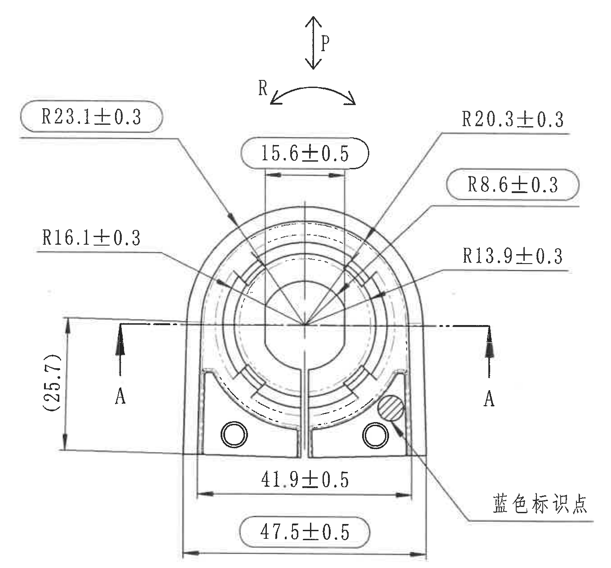

原图位置/视图名称：第 1 页左上区域，主视图，含 P/R 方向标识、A-A 剖切位置、底座宽度、圆弧半径、参考尺寸和蓝色标识点。

| 提取项 | 原图数值或文本 | 含义说明 |
|---|---:|---|
| 方向标识 | P | P 向载荷/静态特性方向，和表 1、表 2 中 P 向条件对应。 |
| 方向标识 | R | R 向旋转/扭转方向，和表 1、表 2 中 R 向条件对应。 |
| 弧向半径 | R23.1±0.3 | 上部外侧圆弧半径，带圆角框，为注 7 所述出厂检验控制尺寸。 |
| 弧向半径 | R20.3±0.3 | 右上外侧圆弧半径，普通标注尺寸。 |
| 宽度尺寸 | 15.6±0.5 | 上部开口/槽口宽度，带圆角框，为出厂检验控制尺寸。 |
| 弧向半径 | R8.6±0.3 | 右侧内侧局部圆弧半径，带圆角框，为出厂检验控制尺寸。 |
| 弧向半径 | R16.1±0.3 | 左侧内侧圆弧半径，普通标注尺寸。 |
| 弧向半径 | R13.9±0.3 | 右侧内侧圆弧半径，普通标注尺寸。 |
| 参考尺寸 | (25.7) | 左侧竖向括号尺寸，为参考尺寸；用于说明剖切中心线到下部基准边附近的高度关系，不作为独立检验公差尺寸。 |
| 剖切标记 | A / A | 水平剖切位置，箭头指示剖视方向；对应 object_3 的 A-A 剖视图。 |
| 宽度尺寸 | 41.9±0.5 | 下部内侧两竖边之间的宽度尺寸。 |
| 宽度尺寸 | 47.5±0.5 | 下部外侧总宽度，带圆角框，为出厂检验控制尺寸。 |
| 标识文字 | 蓝色标识点 | 指向右下斜线剖面/圆点位置，表示蓝色标识点位置。 |
| 直径符号、数量前缀、角度、T 编号 | 未见 | 当前主视图未出现直径符号、数量前缀、角度标注或 T 编号。 |
| 星号关键尺寸 | 未见星号标记 | 本图以圆角框标出出厂检验控制尺寸，未见星号关键尺寸。 |

边界归属说明：本裁切只提取主视图内的尺寸、P/R 方向、A-A 剖切标记和“蓝色标识点”。右侧相邻侧视图未纳入；下方 A-A 剖视图的 R7.9、1.2、44 不归入本区域。

## object_2 侧视图（加工视图）

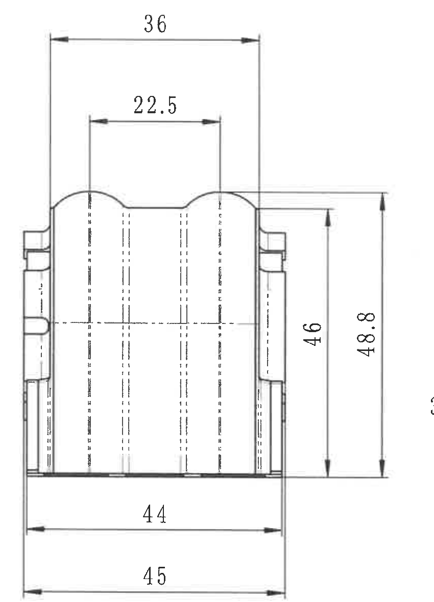

原图位置/视图名称：第 1 页中上区域，侧视图。

| 提取项 | 原图数值或文本 | 含义说明 |
|---|---:|---|
| 顶部总宽 | 36 | 侧视图顶部外侧两基准竖线之间的宽度。 |
| 顶部内宽 | 22.5 | 侧视图上部内侧两竖向虚线/结构中心线之间的宽度。 |
| 竖向尺寸 | 46 | 侧视图内部主体高度。 |
| 总高度 | 48.8 | 侧视图外侧总高度。 |
| 底部宽度 | 44 | 侧视图底部内侧宽度。 |
| 底部总宽 | 45 | 侧视图底部外侧总宽度。 |
| 公差、参考尺寸、直径符号、数量前缀、角度、T 编号 | 未见 | 当前侧视图未单独给出公差、括号参考尺寸、直径符号、数量前缀、角度或 T 编号。 |

边界归属说明：本裁切仅包含侧视图本体及 36、22.5、46、48.8、44、45 六个尺寸。左侧主视图和右侧轴测/技术要求区域未纳入。

## object_3 A-A 剖视图（剖面视图）

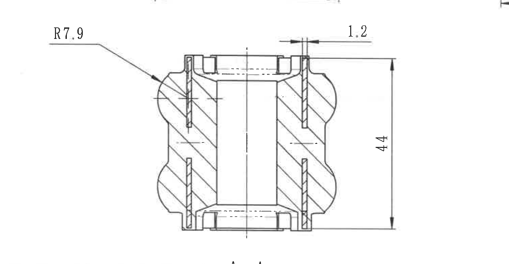

原图位置/视图名称：第 1 页左中下区域，A-A 剖视图，比例 1:1。

| 提取项 | 原图数值或文本 | 含义说明 |
|---|---:|---|
| 视图名称 | A-A | 对应主视图中的 A-A 剖切标记。 |
| 比例 | 1:1 | 剖视图比例标注。 |
| 弧向半径 | R7.9 | 剖面左上肩部圆弧半径。 |
| 局部尺寸 | 1.2 | 剖面顶部右侧薄壁/间隙尺寸。 |
| 总高度 | 44 | 剖视图右侧竖向总高度尺寸。 |
| 剖面线 | 斜向剖面线 | 表示被剖切材料区域。 |
| 公差、参考尺寸、直径符号、数量前缀、角度、T 编号 | 未见 | 当前剖视图未给出单独公差、括号参考尺寸、直径符号、数量前缀、角度或 T 编号。 |

边界归属说明：本裁切以剖视图本体和 R7.9、1.2、44 为归属范围。上边缘可见极少主视图底部尺寸线残痕，属于相邻视图，不提取到本区域；下方公差表未纳入。

## object_4 轴测视图（局部/装配指示视图）

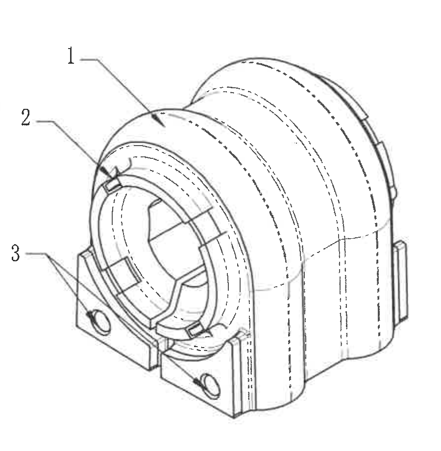

原图位置/视图名称：第 1 页右中区域，轴测视图，含序号引出线。

| 提取项 | 原图数值或文本 | 含义说明 |
|---|---:|---|
| 序号引出 | 1 | 与明细表序号 1 对应，指向橡胶主体。 |
| 序号引出 | 2 | 与明细表序号 2 对应，指向铁骨架/内侧骨架位置。 |
| 序号引出 | 3 | 与明细表序号 3 对应，指向塑料底座/安装脚位置。 |
| 尺寸标注 | 未见 | 当前轴测视图未直接标注尺寸、公差、角度、直径符号或 T 编号。 |

边界归属说明：本裁切只包含轴测外形和 1、2、3 序号引出线。右侧技术要求文字未纳入；序号含义依据 object_12 明细表对应。

## object_5 NOTES / 技术要求

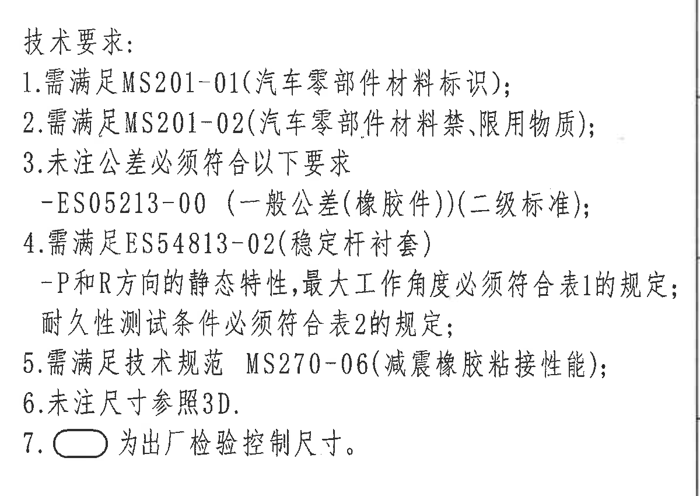

原图位置/视图名称：第 1 页右中区域，技术要求。

| 提取项 | 原图数值或文本 | 含义说明 |
|---|---|---|
| 标题 | 技术要求： | 技术要求区域标题。 |
| 1 | 需满足 MS201-01（汽车零部件材料标识）； | 材料标识要求。 |
| 2 | 需满足 MS201-02（汽车零部件材料禁、限用物质）； | 禁限用物质要求。 |
| 3 | 未注公差必须符合以下要求 | 未注公差引用下列标准。 |
| 3-补充 | -ES05213-00（一般公差（橡胶件））（二级标准）； | 未注一般公差适用标准，和 object_7 公差表对应。 |
| 4 | 需满足 ES54813-02（稳定杆衬套） | 稳定杆衬套技术规范要求。 |
| 4-补充 | -P 和 R 方向的静态特性，最大工作角度必须符合表 1 的规定； | P/R 方向静态特性与最大操作角由 object_8 表 1 控制。 |
| 4-补充 | 耐久性测试条件必须符合表 2 的规定； | 耐久测试条件由 object_9 表 2 控制。 |
| 5 | 需满足技术规范 MS270-06（减震橡胶粘接性能）； | 橡胶粘接性能规范要求。 |
| 6 | 未注尺寸参照 3D. | 未标注尺寸以 3D 数据为准。 |
| 7 | 圆角框 为出厂检验控制尺寸。 | 图中圆角框包围的尺寸为出厂检验控制尺寸。 |

边界归属说明：本裁切只提取技术要求正文。右侧极细图框线为邻接图框，不作为 NOTES 内容；左侧轴测图序号和外形不归入本区域。

## object_6 修订履历表（表格）

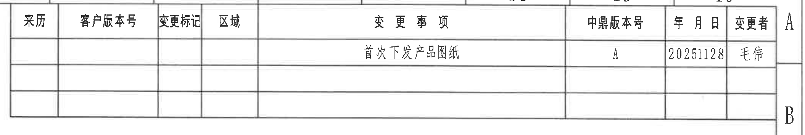

原图位置/视图名称：第 1 页右上区域，修订履历/变更事项表。

原表还原：

| 来历 | 客户版本号 | 变更标记 | 区域 | 变更事项 | 中鼎版本号 | 年月日 | 变更者 |
|---|---|---|---|---|---|---|---|
|  |  |  |  | 首次下发产品图纸 | A | 20251128 | 毛伟 |
|  |  |  |  |  |  |  |  |
|  |  |  |  |  |  |  |  |

| 提取项 | 原图数值或文本 | 含义说明 |
|---|---|---|
| 表头 | 来历、客户版本号、变更标记、区域、变更事项、中鼎版本号、年月日、变更者 | 修订记录字段。 |
| 修订记录 | 首次下发产品图纸 / A / 20251128 / 毛伟 | 首次下发记录，中鼎版本号为 A，日期为 2025-11-28，变更者为毛伟。 |
| 空白记录行 | 2 行空白 | 原表保留的空白修订记录行。 |

边界归属说明：本裁切覆盖完整修订表。右侧图框字母 A/B 与表格邻接，不作为表格字段提取。

## object_7 ES05213-00 基本尺寸公差表（表格）

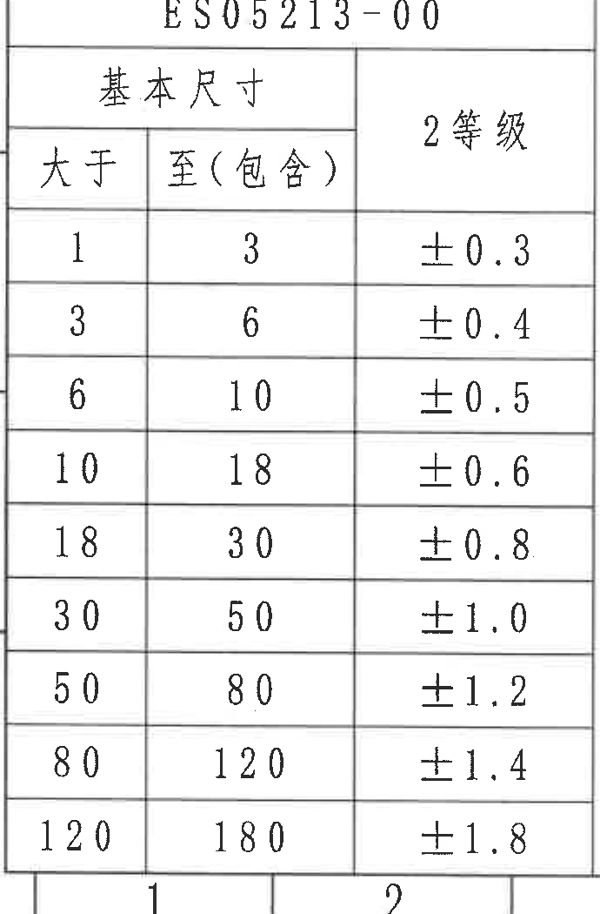

原图位置/视图名称：第 1 页左下区域，ES05213-00 基本尺寸 2 等级公差表。

原表还原：

| 基本尺寸 大于 | 基本尺寸 至（包含） | 2等级 |
|---:|---:|---:|
| 1 | 3 | ±0.3 |
| 3 | 6 | ±0.4 |
| 6 | 10 | ±0.5 |
| 10 | 18 | ±0.6 |
| 18 | 30 | ±0.8 |
| 30 | 50 | ±1.0 |
| 50 | 80 | ±1.2 |
| 80 | 120 | ±1.4 |
| 120 | 180 | ±1.8 |

| 提取项 | 原图数值或文本 | 含义说明 |
|---|---|---|
| 表题 | ES05213-00 | 未注一般公差标准编号。 |
| 表头 | 基本尺寸：大于、至（包含）；2等级 | 按基本尺寸范围确定未注公差。 |
| 公差等级 | 2等级 | 技术要求第 3 条指定的二级标准。 |

边界归属说明：本裁切覆盖完整公差表。底部可见图框坐标数字的顶部，为邻接图框，不属于公差表内容。

## object_8 表1 静态特性（表格）

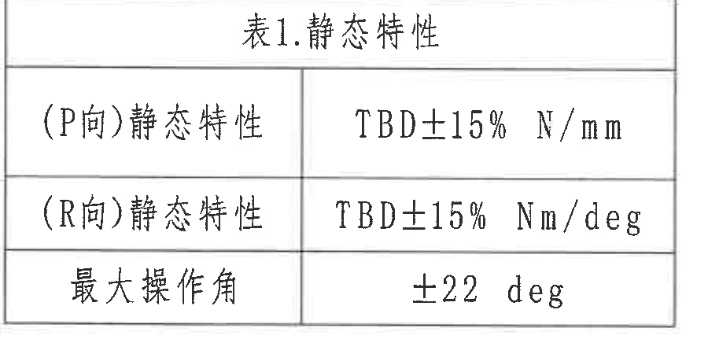

原图位置/视图名称：第 1 页中下区域，表 1 静态特性。

原表还原：

| 项目 | 规定值 |
|---|---|
| （P向）静态特性 | TBD±15% N/mm |
| （R向）静态特性 | TBD±15% Nm/deg |
| 最大操作角 | ±22 deg |

| 提取项 | 原图数值或文本 | 含义说明 |
|---|---|---|
| P向静态特性 | TBD±15% N/mm | P 向线性静态刚度要求，最终数值待定，允许 ±15%。 |
| R向静态特性 | TBD±15% Nm/deg | R 向扭转静态刚度要求，最终数值待定，允许 ±15%。 |
| 最大操作角 | ±22 deg | 最大工作/操作角度要求。 |

边界归属说明：本裁切只包含表 1 静态特性，和技术要求第 4 条对应；周边剖视图和表 2 未纳入。

## object_9 表2 耐久试验（表格）

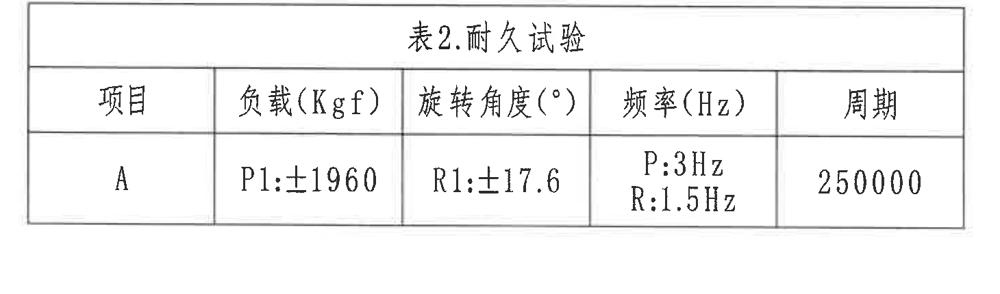

原图位置/视图名称：第 1 页中下偏左区域，表 2 耐久试验。

原表还原：

| 项目 | 负载（Kgf） | 旋转角度（°） | 频率（Hz） | 周期 |
|---|---|---|---|---:|
| A | P1:±1960 | R1:±17.6 | P:3Hz / R:1.5Hz | 250000 |

| 提取项 | 原图数值或文本 | 含义说明 |
|---|---|---|
| 项目 | A | 耐久试验项目编号。 |
| 负载 | P1:±1960 Kgf | P 向试验载荷幅值。 |
| 旋转角度 | R1:±17.6° | R 向旋转角度幅值。 |
| 频率 | P:3Hz；R:1.5Hz | P 向和 R 向试验频率。 |
| 周期 | 250000 | 耐久试验循环次数。 |

边界归属说明：本裁切只包含表 2 耐久试验，和技术要求第 4 条对应；右下标题栏和表 1 未纳入。

## object_10 P 向静态刚度曲线区（局部视图）

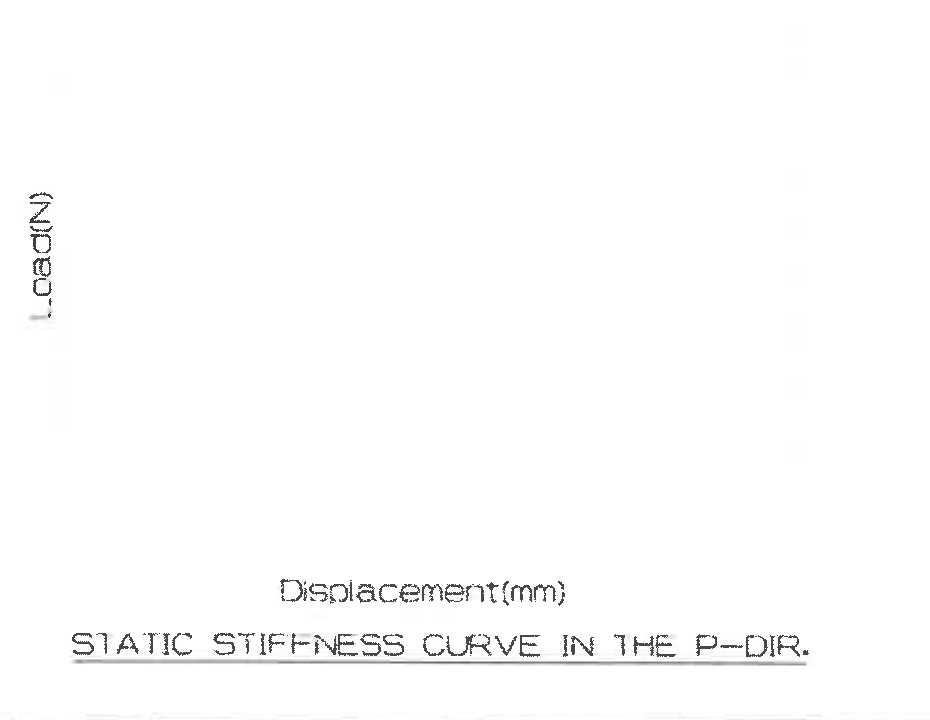

原图位置/视图名称：第 1 页右下偏中，P 向静态刚度曲线区。

| 提取项 | 原图数值或文本 | 含义说明 |
|---|---|---|
| 纵轴 | Load(N) | 载荷，单位 N。 |
| 横轴 | Displacement(mm) | 位移，单位 mm。 |
| 曲线标题 | STATIC STIFFNESS CURVE IN THE P-DIR. | P 向静态刚度曲线区域标题。 |
| 曲线数据 | 未绘出具体曲线/数值 | 原图中该区域没有可提取的数据曲线或刻度数值。 |

边界归属说明：本裁切只包含左侧 P 向静态刚度曲线区；右侧 R 向扭转曲线区已单独裁切为 object_11。

## object_11 R 向扭转刚度曲线区（局部视图）

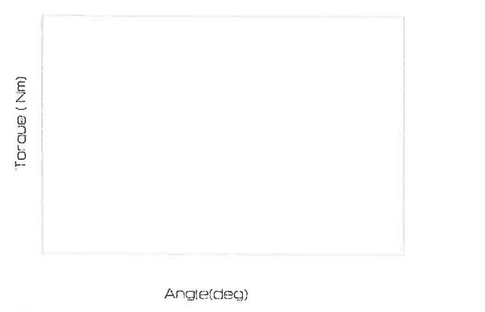

原图位置/视图名称：第 1 页右下区域，R 向扭转刚度曲线区。

| 提取项 | 原图数值或文本 | 含义说明 |
|---|---|---|
| 纵轴 | Torque(Nm) | 扭矩，单位 Nm。 |
| 横轴 | Angle(deg) | 角度，单位 deg。 |
| 曲线标题 | TORSIONAL STIFFNESS CURVE IN THE R-DIR. | R 向扭转刚度曲线区域标题。 |
| 曲线数据 | 未绘出具体曲线/数值 | 原图中该区域没有可提取的数据曲线或刻度数值。 |

边界归属说明：本裁切只包含右侧 R 向扭转刚度曲线区。右侧极细图框线为邻接图框，不作为曲线区内容。

## object_12 零件明细表 / BOM（表格）

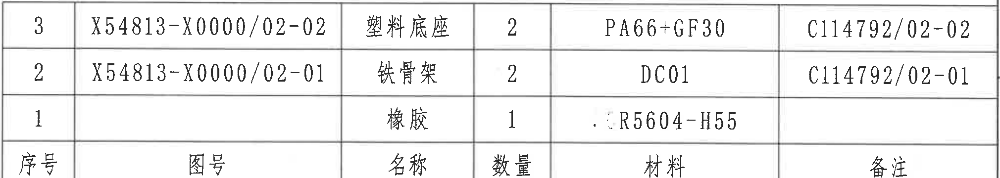

原图位置/视图名称：第 1 页右下区域，标题栏上方零件明细表。原图表头位于表格底部；下表按相同列名还原，数据顺序保持原图自上而下的 3、2、1。

原表还原：

| 序号 | 图号 | 名称 | 数量 | 材料 | 备注 |
|---:|---|---|---:|---|---|
| 3 | X54813-X0000/02-02 | 塑料底座 | 2 | PA66+GF30 | C114792/02-02 |
| 2 | X54813-X0000/02-01 | 铁骨架 | 2 | DC01 | C114792/02-01 |
| 1 |  | 橡胶 | 1 | R5604-H55 |  |

| 提取项 | 原图数值或文本 | 含义说明 |
|---|---|---|
| 明细表序号 1 | 橡胶，数量 1，材料 R5604-H55 | 与轴测视图序号 1 对应。 |
| 明细表序号 2 | X54813-X0000/02-01，铁骨架，数量 2，材料 DC01，备注 C114792/02-01 | 与轴测视图序号 2 对应。 |
| 明细表序号 3 | X54813-X0000/02-02，塑料底座，数量 2，材料 PA66+GF30，备注 C114792/02-02 | 与轴测视图序号 3 对应。 |

边界归属说明：本裁切只包含零件明细表。下方标题栏的投影法、比例、产品号等字段不归入本区域。

## object_13 标题栏（title block）

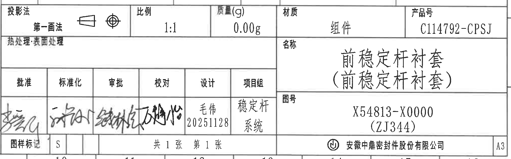

原图位置/视图名称：第 1 页右下角标题栏。

| 提取项 | 原图数值或文本 | 含义说明 |
|---|---|---|
| 投影法 | 第一画法 | 图样投影方式。 |
| 比例 | 1:1 | 图样比例。 |
| 质量(g) | 0.00g | 图样质量字段。 |
| 材质 | 组件 | 标题栏材质字段。 |
| 产品号 | C114792-CPSJ | 产品号。 |
| 热处理・表面处理 | 空白 | 原图该字段未填写具体内容。 |
| 名称 | 前稳定杆衬套（前稳定杆衬套） | 零件/组件名称，括号内重复名称按原图保留。 |
| 批准 | 手写签名 | 批准栏签名，扫描件中不可稳定识别为标准文字。 |
| 标准化 | 手写签名 | 标准化栏签名，扫描件中不可稳定识别为标准文字。 |
| 审批 | 手写签名 | 审批栏签名，扫描件中不可稳定识别为标准文字。 |
| 校对 | 手写签名 | 校对栏签名，扫描件中不可稳定识别为标准文字。 |
| 设计 | 毛伟 20251128 | 设计者和日期。 |
| 项目组 | 稳定杆系统 | 项目组字段。 |
| 图号 | X54813-X0000（ZJ344） | 图号及括号内代号。 |
| 图样标记 | S | 图样标记字段。 |
| 张数 | 共 1 张 第 1 张 | 图纸张数信息。 |
| 公司 | 安徽中鼎密封件股份有限公司 | 公司名称。 |
| 幅面 | A3 | 图纸幅面。 |

边界归属说明：本裁切覆盖标题栏字段。上边缘可见与 BOM 共享边界的相邻表格线，不作为标题栏字段；底部图框坐标数字未提取为标题栏内容。

## 裁切检查记录

| 对象 | 裁切图片 | 完整性检查 | 边界归属检查 |
|---|---|---|---|
| object_1 | outputs/20C114792_assets/images/object_1.png | 完整包含主视图尺寸线、箭头、文字、P/R 方向和蓝色标识点。 | 未混入侧视图；下方 A-A 剖视图尺寸未归入。 |
| object_2 | outputs/20C114792_assets/images/object_2.png | 完整包含 36、22.5、46、48.8、44、45 的尺寸线和文字。 | 未混入主视图、轴测图或 NOTES。 |
| object_3 | outputs/20C114792_assets/images/object_3.png | 完整包含 R7.9、1.2、44 的尺寸线和剖视图本体。 | 上边缘极少主视图残线不提取；下方表格未纳入。 |
| object_4 | outputs/20C114792_assets/images/object_4.png | 完整包含轴测图外形和 1、2、3 引出线。 | 未混入 NOTES。 |
| object_5 | outputs/20C114792_assets/images/object_5.png | 完整包含技术要求 1-7 条文字。 | 右侧细图框线不作为 NOTES 内容。 |
| object_6 | outputs/20C114792_assets/images/object_6.png | 完整包含修订履历表头、记录行和空白行。 | 右侧图框字母 A/B 不作为表格字段。 |
| object_7 | outputs/20C114792_assets/images/object_7.png | 完整包含 ES05213-00 表题、表头和 9 行公差。 | 底部图框坐标数字顶部不作为表格内容。 |
| object_8 | outputs/20C114792_assets/images/object_8.png | 完整包含表 1 的 3 行字段和单位。 | 未混入剖视图或表 2。 |
| object_9 | outputs/20C114792_assets/images/object_9.png | 完整包含表 2 表头和项目 A 全部字段。 | 未混入标题栏或表 1。 |
| object_10 | outputs/20C114792_assets/images/object_10.png | 完整包含 P 向曲线区轴标签和标题。 | 未提取右侧 R 向曲线内容。 |
| object_11 | outputs/20C114792_assets/images/object_11.png | 完整包含 R 向曲线区坐标框、轴标签和标题。 | 右侧图框线不作为曲线内容。 |
| object_12 | outputs/20C114792_assets/images/object_12.png | 完整包含 BOM 三行物料、底部表头和列线。 | 下方标题栏字段未归入。 |
| object_13 | outputs/20C114792_assets/images/object_13.png | 完整包含标题栏投影法、比例、质量、材质、产品号、名称、图号、签署、张数、公司、A3。 | 上边缘邻接 BOM 共享边界线不作为标题栏字段。 |
